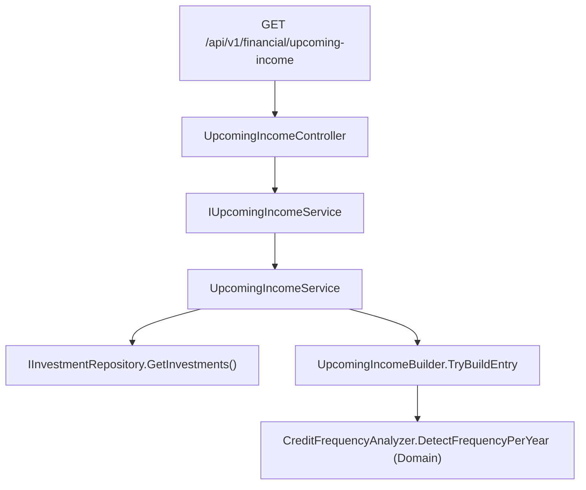

# P52-F04 — Upcoming Income — Technical Spec

## 1. Overview

F04 adds a single computed, read-only Application-layer surface — a list of `UpcomingIncomeDTO`
entries — that projects each Active holding's next expected dividend or coupon payment forward
from that holding's own historical `Credit` dates, using the frequency `CreditFrequencyAnalyzer`
(P46, already shipped and already unit-tested) already detects. It is computed on demand from the
already-loaded in-memory `Investments` graph on every request — nothing is persisted, and nothing
in this feature changes the JSON document shape.

The feature is the thinnest of the four P52 backend features: it needs no market value, no price,
no currency conversion and no XIRR — only each Active asset's `Credits` collection. Research
confirms `CreditFrequencyAnalyzer.DetectFrequencyPerYear(IEnumerable<Credit>)`
(`Financial.Investment.Domain/Rules/CreditFrequencyAnalyzer.cs`) is a pure, static Domain rule that
takes a flat sequence of `Credit`s and returns `12`, `4`, `3` or `null` — fewer than 2 distinct
payment months, or a gap whose average exceeds the four-monthly bucket, both return `null` — and is
already covered by `Tests/Financial.Investment.Domain.Tests/Domain/CreditFrequencyAnalyzerTests.cs`.
No Domain change is needed: this feature only calls the existing rule per Active asset and turns a
non-null result into one projected entry. No Infrastructure change is needed either: every input is
already reachable through `IInvestmentRepository.GetInvestments()` (`Investments.ActiveBrokers`),
the same aggregate root F01/F02/F03 already read. This feature adds one new Application DTO, one
new Application service, one small internal builder, and one new Api controller endpoint.

### Decisions / Assumptions

Recorded here because the PRD does not spell these out and no user was available to ask.

1. **Route path.** Following the identical convention F01/F02/F03 already recorded (every
   controller in `Financial.Api/Controllers` uses a flat kebab-case segment directly under the
   `api/v{version}/financial` group — `[Route("dashboard")]`, `[Route("allocation-breakdown")]`,
   `[Route("data-quality-report")]`, never nested under `investment/`), this spec uses
   `[Route("upcoming-income")]` on a new `UpcomingIncomeController`, giving
   `GET /api/v1/financial/upcoming-income`.
2. **Service name and shape.** New `IUpcomingIncomeService` / `UpcomingIncomeService`, registered
   as `AddSingleton` in `AddFinancialApplication()`. One method,
   `IReadOnlyList<UpcomingIncomeDTO> GetUpcomingIncome()`, no parameters, **synchronous** —
   `CreditFrequencyAnalyzer` is a pure, deterministic Domain rule with no I/O, so this service has
   no async dependency at all, going further than F02's own "no async dependency" case (F02 still
   reads `IHoldingValuationService.GetValuation` for pricing; F04 reads no valuation at all — see
   Decision 5).
3. **`UpcomingIncomeDTO` is itself the per-entry record; the endpoint returns
   `IReadOnlyList<UpcomingIncomeDTO>` directly, with no wrapper container.** The PRD's own
   Capabilities text names `UpcomingIncomeDTO` as the shape of "one projected entry" (`AssetName`,
   `BrokerName`, `LastCreditDate`, `ProjectedNextDate`, `ProjectedAmount`), not as a container
   holding a list — unlike F02's `AllocationBreakdownDTO` (four named dimension lists) or F03's
   `DataQualityReportDTO` (eight named finding fields), F04 has exactly one flat list with nothing
   else to group it by. `CreditsController.GetCreditsByBroker` already returns a raw
   `IReadOnlyList<CreditDTO>` with no wrapper for the same reason (a single homogeneous list), so
   this is an existing, accepted shape in this codebase, not a new one.
4. **Window filter: the endpoint always returns the full, unfiltered, `ProjectedNextDate`-ascending
   list; the 30/90/180-day window is applied client-side by F05/F06, not by this endpoint.**
   Research confirms no controller in this codebase takes a day-count/period/window `[FromQuery]`
   parameter anywhere — every existing `[FromQuery]` parameter across every controller
   (`AssetPricesController`, `AssetsController`, `CreditsController`, `NavigationController`,
   `SummaryController`, `TaxWorkbookController`, etc.) is either a string scope/lookup value
   (`scope`, `ticker`, `jurisdiction`) or a string identity filter — never a numeric or enum window.
   The one existing pattern the PRD explicitly points to as precedent —
   `PeriodFilterOption`/`FilterTabList` (`Financial.Web/src/utils/periodFilter.ts`,
   `Financial.Web/src/components/FilterTabList.tsx`), used by `PriceHistoryTab`/`usePriceHistory` —
   is itself entirely client-side: `usePriceHistory` fetches an asset's full price history once,
   and `getPeriodFilterStartDate` filters the already-fetched array in the browser on every filter
   change, with no request re-issued. Since the PRD's own reference precedent is client-side
   filtering over a fully-fetched list, and no backend-side windowed-list convention exists
   anywhere else to follow instead, this spec has the endpoint compute the projection once and
   return every entry; F05/F06 filter by `ProjectedNextDate <= today + N days` the same way
   `usePriceHistory` filters by date today. This also makes the PRD's own acceptance criterion
   ("changing the window filter changes exactly which entries are shown, with no change to the
   projected dates themselves") true by construction: the computation never takes a window as
   input, so there is nothing for a window to change except which entries a later, separate
   filtering step includes.
5. **No `IHoldingValuationService` dependency.** Unlike F01/F02/F03, F04 needs no market value, no
   price, and no `MarketStatus` — every field it produces (`LastCreditDate`, `ProjectedNextDate`,
   `ProjectedAmount`) is derived purely from `Asset.Credits`. An unpriced Active holding is not
   excluded here the way it is in F01's `MarketValue`/F02's weight basis — a holding with no price
   snapshot at all can still have a well-defined credit history and a valid projection.
6. **Active scope only, no Historic.** The PRD's Capabilities text is explicit: "for every Active
   holding." Unlike F01's `IncomeYtd`/`IncomeLifetime` (Decision 5 of F01's own spec, which spans
   both scopes because income is framed as a lifetime fact) or F03's `UnresolvedTaxClassifications`
   (same dual-scope reasoning), F04 is forward-looking by nature — projecting a "next expected
   payment" for a Historic (closed) holding is meaningless, since no further payment is expected
   from a position that no longer exists. This spec therefore reads only `Investments.ActiveBrokers`.
7. **`LastCreditDate` and `ProjectedAmount` both come from the single most-recent `Credit`.** The
   PRD states "`ProjectedNextDate` = `LastCreditDate` plus the interval..." and separately
   "`ProjectedAmount` = the most recent `Credit.NetAmount` for that holding" — read together, both
   facts describe the same one credit (an asset has exactly one most-recent `Credit` by `Date`),
   not two independently-selected credits. This spec selects the single `Credit` with the maximum
   `Date` for a given asset once, and reads both `Date` and `NetAmount` off that same instance.
8. **Frequency-to-interval mapping is a small internal builder with its own test file.**
   `CreditFrequencyAnalyzer.DetectFrequencyPerYear` returns exactly one of three non-null values
   (`12`, `4`, `3`), each mapping to a fixed calendar interval (`+1 month`, `+3 months`,
   `+4 months` respectively, per the PRD). This mapping, plus the "no detectable frequency → omit
   entirely" rule, is isolated in `UpcomingIncomeBuilder.TryBuildEntry` (`internal static`),
   mirroring `PortfolioXirrBuilder`'s (F01) and `AllocationBreakdownBuilder`'s (F02) precedent of
   giving a small but branchy pure builder its own dedicated Unit test file, rather than folding
   the branching directly into the service.
9. **Sort order: ascending by `ProjectedNextDate`, tie-broken ascending by `AssetName`
   (ordinal, case-insensitive).** The PRD's Experience section states the primary sort
   ("sorted by `ProjectedNextDate` ascending") but not a tie-break; this spec records an explicit,
   deterministic tie-break, mirroring F02 Decision 7's identical precedent of recording an
   otherwise-unspecified tie-break rather than leaving it to implementation-time improvisation.
10. **No enum-bearing property, so no `JsonStringEnumConverter` anywhere in this feature.**
    `AssetName`/`BrokerName` are plain `string` (no backing enum exists for either, the same as
    `BrokerAllocationEntryDTO.BrokerName` in F02), `LastCreditDate`/`ProjectedNextDate` are
    `DateTime` (matching `Credit.Date`'s own type), and `ProjectedAmount` is `decimal` (matching
    `Credit.NetAmount`'s own type). This is called out explicitly only because every other P52
    backend feature so far has needed the converter on at least one field.

## 2. Scope

### Included
- New `UpcomingIncomeDTO` (Application DTO, one record — the per-entry shape), computed on demand.
- New `IUpcomingIncomeService` / `UpcomingIncomeService` (Application), assembling the list from
  `IInvestmentRepository.GetInvestments()`.
- New internal builder: `UpcomingIncomeBuilder` (detects frequency per Active asset via
  `CreditFrequencyAnalyzer.DetectFrequencyPerYear`, computes `ProjectedNextDate`/`ProjectedAmount`,
  or omits the asset entirely when no frequency is detected).
- New `UpcomingIncomeController` (`Financial.Api/Controllers`), one
  `GET /api/v1/financial/upcoming-income` endpoint returning `IReadOnlyList<UpcomingIncomeDTO>`.
- DI registration of `IUpcomingIncomeService` in `AddFinancialApplication()`.
- OpenAPI snapshot + generated `Financial.Web/src/api/generated/openapi.ts` regeneration (the new
  DTO and endpoint are a wire-format change).
- Unit tests for the new service/builder; one Integration `ApiEndpointTests`-derived suite covering
  the endpoint and the backend-provable subset of every F04 §9 acceptance criterion.

### Deferred (to their own PRD features, already scheduled)
- Dashboard KPIs — **F01** (merged). Allocation breakdown — **F02** (merged). Data-quality warnings
  — **F03** (merged).
- The window selector UI (30/90/180-day tabs), the client-side filtering by
  `ProjectedNextDate <= today + N days`, the upcoming-income table, and the empty-state message —
  **F05** (React) and **F06** (WPF). This spec is backend-only; per Decision 4, the endpoint itself
  has no window concept at all.

### Out of scope (per PRD §7, applies to this feature too)
- Bond maturity dates and coupon schedules — F04 projects only from already-recorded payment
  history; no new date field is added to any Domain entity.
- Computing tax due.
- CSV or any other export.
- Automatic remediation of any data-quality finding (not applicable to this feature, listed for
  completeness against the PRD's shared out-of-scope list).
- Changes to `AggregatedSummaryTab`/`PortfolioSummaryTab`/`AssetSummaryTab`/`CreditsTab` or their
  backing services/endpoints — F04 adds a new, additive surface only.

## 3. Architecture / Component Overview

### Domain — no changes
No new entity, value object, or `Rules/` calculator. `CreditFrequencyAnalyzer.DetectFrequencyPerYear`
already exists, is already `public static`, and is already unit-tested
(`Tests/Financial.Investment.Domain.Tests/Domain/CreditFrequencyAnalyzerTests.cs`) for every branch
this feature relies on: fewer than 2 distinct payment months → `null`; monthly/quarterly cadence →
`12`/`4`; a gap too large for any bucket → `null`. `Asset.Credits`
(`IReadOnlyCollection<Credit>`), `Credit.Date` and `Credit.NetAmount` already exist and need no
change.

### Application

| File | Change |
|---|---|
| `Financial.Investment.Application/DTOs/UpcomingIncomeDTO.cs` | **New.** The single-record response shape (§4/§5). |
| `Financial.Investment.Application/Interfaces/IUpcomingIncomeService.cs` | **New.** `IReadOnlyList<UpcomingIncomeDTO> GetUpcomingIncome();` |
| `Financial.Investment.Application/Services/UpcomingIncomeService.cs` | **New.** Walks `Investments.ActiveBrokers` → portfolios → assets (mirroring `AllocationBreakdownService.CollectActiveHoldings`'s identical broker-then-asset walk, since `Asset` carries no back-reference to its owning `Broker`), delegates per-asset projection to the builder, sorts the survivors, and owns the span/log wrapper per `docs/rules/implementation.md`. |
| `Financial.Investment.Application/Services/UpcomingIncomeBuilder.cs` | **New**, `internal static`. `TryBuildEntry(Asset asset, string brokerName)` — calls `CreditFrequencyAnalyzer.DetectFrequencyPerYear(asset.Credits)`, returns `null` when the result is `null`, otherwise builds one `UpcomingIncomeDTO` from the asset's most-recent `Credit` and the frequency-to-interval mapping (§1 Decisions 7–8). |
| `Financial.Investment.Application/DependencyInjection/InvestmentApplicationServiceCollectionExtensions.cs` | **Changed.** One new line: `services.AddSingleton<IUpcomingIncomeService, UpcomingIncomeService>();` |

### Infrastructure — no changes
This feature is computed on demand from the already-loaded `IInvestmentRepository` graph; no new
persistence, no new external call, no new repository method.

### Presentation

| File | Change |
|---|---|
| `Financial.Api/Controllers/UpcomingIncomeController.cs` | **New.** `[ApiController] [Route("upcoming-income")]`, one `[HttpGet]` action, `GetUpcomingIncome()`, injecting `IUpcomingIncomeService`, returning `Ok(IReadOnlyList<UpcomingIncomeDTO>)`. No route/query parameters — mirrors `AllocationBreakdownController`'s/`DataQualityReportController`'s shape exactly (§1 Decision 4: no window parameter). |

No `Financial.App` or `Financial.Web` file changes in this feature (F05/F06 consume the endpoint
later).



## 4. API Contracts

### `GET /api/v1/financial/upcoming-income`

No request body, no query string, no route parameters (§1 Decision 4).

**200 OK** — `IReadOnlyList<UpcomingIncomeDTO>`, sorted ascending by `ProjectedNextDate`:

```json
[
  {
    "assetName": "VUSA",
    "brokerName": "Trading212",
    "lastCreditDate": "2026-08-15T00:00:00",
    "projectedNextDate": "2026-09-15T00:00:00",
    "projectedAmount": 12.34
  },
  {
    "assetName": "ITSA4",
    "brokerName": "XPI",
    "lastCreditDate": "2026-06-01T00:00:00",
    "projectedNextDate": "2026-09-01T00:00:00",
    "projectedAmount": 45.10
  }
]
```

**No holding with a detectable frequency** (empty array — never an error, same convention F02 §4
already established for "no priced holdings"):

```json
[]
```

There is no error/400 case: the endpoint takes no input to validate. An unexpected exception falls
through to `DomainExceptionMappingMiddleware`/the default ASP.NET Core problem-details handler,
exactly as every other read endpoint in this API (same precedent F01/F02/F03 §4 already recorded).

## 5. Data Model

**N/A — nothing persists.** The `UpcomingIncomeDTO` list is computed fresh from the in-memory
`Investments` graph on every call to `GetUpcomingIncome()`; there is no new field on
`data-investment.json`, no schema/migration concern, and no caching between requests (consistent
with every other Summary-family endpoint in this codebase, and with F01 §5/F02 §5/F03 §5's
identical framing).

New Application shape (not a database schema — listed here per this project's Data Model section
convention for computed DTOs):

**`UpcomingIncomeDTO`** (new record)

| Field | Type | Description |
|---|---|---|
| `AssetName` | `string` | Affected asset's name. |
| `BrokerName` | `string` | Owning broker's name. |
| `LastCreditDate` | `DateTime` | `Date` of the asset's most-recent `Credit` (§1 Decision 7). |
| `ProjectedNextDate` | `DateTime` | `LastCreditDate` plus the interval implied by the detected frequency: `+1 month` (12/year), `+3 months` (4/year), `+4 months` (3/year). |
| `ProjectedAmount` | `decimal` | `NetAmount` of that same most-recent `Credit` — no separate estimation formula. |

## 6. Requirements / Business Rules

All rules below operate over `activeAssets`, collected the same way `AllocationBreakdownService`
already collects them: for each `broker` in `investments.ActiveBrokers`, for each `asset` in
`broker.Portfolios.SelectMany(portfolio => portfolio.Assets)`, paired with `broker.Name`.

1. **Frequency detection** — for each asset in `activeAssets`, call
   `CreditFrequencyAnalyzer.DetectFrequencyPerYear(asset.Credits)`. When the result is `null`
   (fewer than 2 distinct payment months, or an average gap too large for any bucket, per the
   Domain rule's own existing contract), the asset is omitted from the result entirely — never
   given a guessed date, per the PRD's explicit requirement.
2. **`LastCreditDate`/`ProjectedAmount`** — when a frequency is detected, select the single
   `Credit` in `asset.Credits` with the maximum `Date`. `LastCreditDate` = that credit's `Date`;
   `ProjectedAmount` = that same credit's `NetAmount` (§1 Decision 7).
3. **`ProjectedNextDate`** = `LastCreditDate.AddMonths(interval)`, where `interval` is `1` when the
   detected frequency is `12`, `3` when it is `4`, and `4` when it is `3` — the only three non-null
   values `CreditFrequencyAnalyzer.DetectFrequencyPerYear` can return, so this mapping is
   exhaustive over the Domain rule's own documented contract.
4. **Active scope only** — a Historic holding's credits are never read for this feature (§1
   Decision 6); iterating only `investments.ActiveBrokers` makes this structural, not an extra
   filter to apply.
5. **No price/valuation dependency** — this feature never calls `IHoldingValuationService`; an
   Active holding with no current price can still produce a projected entry, since only `Credits`
   are read (§1 Decision 5).
6. **Sort order** — the result list is ordered ascending by `ProjectedNextDate`, ties broken
   ascending by `AssetName` (ordinal, case-insensitive) — §1 Decision 9.
7. **No window parameter, no date-based exclusion server-side** — the endpoint never filters by
   "today" or by any day-count window; every asset with a detected frequency produces exactly one
   entry regardless of how far in the future `ProjectedNextDate` falls (§1 Decision 4). A holding
   whose last payment was years ago still produces an entry with a `ProjectedNextDate` in the past;
   this spec does not treat a past `ProjectedNextDate` as a special case — client-side window
   filtering (F05/F06) naturally excludes it from every one of the 30/90/180-day views.
8. All monetary values use `decimal` (never `double`), matching every existing DTO in this context;
   `ProjectedAmount` is non-nullable `decimal` — an entry only ever exists when its underlying
   `Credit.NetAmount` is a real, already-recorded value.

## 7. Testing Strategy

Per `testing-guide-Financial`: Unit for the new service/builder's branches + failed-span/log
assertions, Integration (`ApiEndpointTests`-derived) for the wired endpoint and the mandatory
AC-tracing subset. This PRD (P52) already has AC ids from F01
(`P52-F01-dashboard-aggregate-01..04`), F02 (`P52-F02-allocation-breakdown-01..03`) and F03
(`P52-F03-data-quality-warnings-01..04`); per `references/feature-traceability.md`, this feature
adds ids to §9's F04 group the first time an AC-tracing test is written for it — plan.md's final
phase includes this as an explicit step (`P52-F04-upcoming-income-01..04`, in the order the four
bullets already appear in §9).

Two of F04's four §9 bullets describe window-filter/empty-state *UI* behaviour that, per §1
Decision 4, this backend feature does not itself implement (the endpoint has no window at all —
F05/F06 own that filtering). Following F03's own precedent for its own UI-owned bullets (§7 of
F03's spec: prove the backend precondition here, leave the actual rendering behaviour to F05/F06's
own test suites), this feature's AC-tracing tests prove the backend-provable half of those two
criteria only; the note against each says so explicitly.

### Unit — `Tests/Financial.Investment.Application.Tests/Services/`

- `UpcomingIncomeServiceTests.cs` (pattern: `AllocationBreakdownServiceTests.cs` —
  `StubInvestmentRepository` with `Investments` set, `RecordingTelemetryTracer`,
  `RecordingLogger<UpcomingIncomeService>`):
  - Constructor null-guard tests, one per dependency (`repository`, `tracer`, `logger`).
  - `GetUpcomingIncome_MonthlyPayer_ProjectsOneIntervalAfterLastCredit` — three monthly credits,
    asserts `ProjectedNextDate == LastCreditDate.AddMonths(1)`.
  - `GetUpcomingIncome_QuarterlyPayer_ProjectsThreeMonthsAfterLastCredit`.
  - `GetUpcomingIncome_FourMonthlyPayer_ProjectsFourMonthsAfterLastCredit`.
  - `GetUpcomingIncome_IrregularPayer_OmittedFromResult` — a fixture whose credit gap exceeds the
    four-monthly bucket (mirrors `CreditFrequencyAnalyzerTests.DetectFrequencyPerYear_WhenGapTooLarge_ReturnsNull`'s
    own fixture shape) produces no entry for that asset.
  - `GetUpcomingIncome_FewerThanTwoCredits_OmittedFromResult` — a single-credit asset produces no
    entry (the Domain rule's own `< 2 distinct months` branch).
  - `GetUpcomingIncome_ProjectedAmount_MatchesMostRecentCreditNetAmount` — a `Withheld` amount on
    the most recent credit proves `ProjectedAmount` reads `NetAmount`, not `Value`.
  - `GetUpcomingIncome_HistoricHolding_NeverProjected` — Active-scope-only proof, mirroring F02's
    own `HistoricHolding_ExcludedFromEveryDimension` test shape.
  - `GetUpcomingIncome_UnpricedActiveHolding_StillProjected` — the Decision 5 proof: an asset with
    no price snapshot at all (`TestHoldingValuationService` not even consulted) still produces an
    entry from its credit history alone.
  - `GetUpcomingIncome_SortedAscendingByProjectedNextDate_ThenByAssetName` — three assets with
    distinct projected dates, plus two assets sharing the same projected date, prove both the
    primary sort and the tie-break.
  - `GetUpcomingIncome_NoActiveHoldingHasCredits_ReturnsEmptyList`.
  - `Constructor_WithNullRepository_RecordsFailedSpanOnGetUpcomingIncomeFailure` (negative-path
    test using `StubInvestmentRepository`'s throwing member, asserting
    `RecordingTelemetryTracer`/`RecordingLogger<UpcomingIncomeService>` records the exception type,
    per `references/negative-path-testing.md`).

- `UpcomingIncomeBuilderTests.cs`:
  - `TryBuildEntry_MonthlyFrequency_AddsOneMonth`.
  - `TryBuildEntry_QuarterlyFrequency_AddsThreeMonths`.
  - `TryBuildEntry_FourMonthlyFrequency_AddsFourMonths`.
  - `TryBuildEntry_NoDetectableFrequency_ReturnsNull`.
  - `TryBuildEntry_MultipleCredits_SelectsMaxDateCreditForBothFields` — three credits at different
    dates/amounts, asserts both `LastCreditDate` and `ProjectedAmount` come from the single
    max-dated one, not the max-amount one (the Decision 7 regression proof).

### Integration — `Tests/Financial.Api.Tests/`

- `Controllers/UpcomingIncomeControllerTests.cs` (pattern: `AllocationBreakdownControllerTests`/
  `DataQualityReportControllerTests` guard-clause-only convention): `GetUpcomingIncome_ReturnsOk`.
- `Acceptance/UpcomingIncomeAcceptanceTests.cs` — one `[Fact]` per F04 §9 bullet, each tagged
  `[Trait("AC", "P52-F04-upcoming-income-0N")]`:
  - `-01` — seed one Active holding with a monthly credit pattern, one with a quarterly pattern,
    one with a four-monthly pattern; assert each entry's `ProjectedNextDate` equals
    `LastCreditDate` plus the exact interval for its own frequency.
  - `-02` — seed one Active holding with a single credit (or a too-large gap); assert it produces
    no entry in the response.
  - `-03` (backend precondition only, per this section's opening note) — call the endpoint twice
    with unchanged seed data; assert every `ProjectedNextDate` is byte-for-byte identical across
    both calls, proving the computation is independent of any request parameter (there is none) —
    the actual window-filter *display* behaviour is F05/F06's own test responsibility.
  - `-04` (backend precondition only) — seed a portfolio with no Active holding carrying a
    detectable frequency; assert the endpoint returns an empty array, cleanly, not an error — the
    actual empty-state *message* is F05/F06's own test responsibility.
- `Contract/OpenApiContractTests.cs` — no new test method; the existing
  `OpenApiDocument_NumericProperties_...` and snapshot-diff tests automatically cover the new
  endpoint/DTO once the snapshot is regenerated (plan.md's final phase).

### Not covered here (other features' responsibility)
- F01/F02/F03's own endpoints and DTOs.
- The window selector UI, the client-side day-window filtering, the upcoming-income table, and the
  empty-state message rendering (F05/F06).
