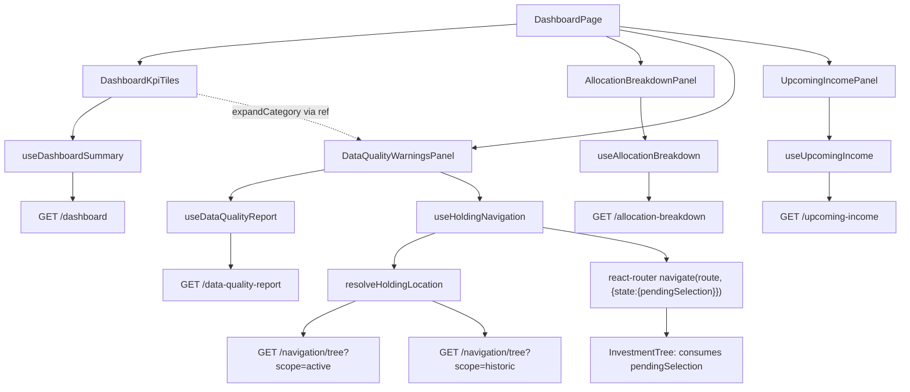

# P52-F05 — React — Portfolio Dashboard — Technical Spec

## 1. Overview

F05 adds `Financial.Web`'s first portfolio-wide page: a new "Dashboard" nav entry, first under
Investments, whose route renders four independent panels — F01's 8 KPI tiles, F02's four-dimension
allocation breakdown (pie chart + legend table), F03's data-quality warnings panel (expandable,
click-through to the existing Active/Historic Investments tree), and F04's upcoming-income table
with a 30/90/180-day window filter — all on one scrollable page, with no tree-node selection
required to see any of it. F01–F04 are backend-only and already merged to `main`; this feature is
the first (and, per this PRD's Wave 2, only alongside F06/WPF) consumer of all four endpoints. No
backend file changes — this is a `Financial.Web`-only feature, four new `fetch` calls against
already-shipped, already-versioned endpoints.

The feature's own PRD Capabilities/Experience text (§6 F05) is deliberately thin — one nav bullet
and one layout paragraph — because the real content of what F05 must render is specified in F01–
F04's own Capabilities/Experience sections upstream. This spec inherits every loading/empty/
partial-data/error state F01–F04 already defined and gives each one a first-time UI: nothing in
F01–F04's specs rendered pixels; this feature does.

Research confirms the codebase has no shared multi-panel dashboard precedent, no existing loading-
skeleton component, no existing cross-page selection-passing mechanism, and no type aliases or
client methods yet for any of the four new DTOs (`Financial.Web/src/api/types.ts` and
`financialApiClient.ts` have zero references to `dashboard`, `allocation-breakdown`,
`data-quality-report`, or `upcoming-income`, confirmed by inspecting both files directly). Four
close structural precedents exist and are reused throughout this spec: `AggregatedSummaryTab.tsx`
(KPI-style field grid, reporting-currency secondary section, `signClass`/`formatN2`/
`formatPercentFraction` formatting, `incomplete-notice`/`partial-notice` `role="status"` pattern),
`BrokerBreakdownCharts.tsx` (the recharts `PieChart`/`Pie`/`Cell`/`Tooltip`/`Legend` setup and
`CATEGORICAL_PALETTE`, reused verbatim for F02's charts per the PRD's explicit "matching
`BrokerBreakdownCharts`' existing visual style"), `AnnualSummaryPage.tsx` (a page composing several
independently-loading sections with its own `TabList`/`Tab` content-switching tabs), and
`FilterTabList.tsx`/`periodFilter.ts` (the chart-filter "chip" pattern F04's own spec explicitly
names as precedent for its window selector, though the day-count semantics require a new option
type — Decision 9).

### Decisions / Assumptions

Recorded here because the PRD's F05 section is intentionally thin and no interactive user was
available to ask (Auto Mode). Ordered by where they surface in the rest of this spec.

1. **Route and nav entry.** `Financial.Web/src/navigation/navTree.ts`'s `investments` category
   gets a new first child, `{ id: 'dashboard', label: 'Dashboard', route:
   '/investments/dashboard' }`, ahead of `active-investments` — the exact ordering the PRD asks
   for. `Financial.Web/src/navigation/lazyPages.tsx` gets `DashboardPage = lazy(() =>
   import('../pages/DashboardPage'))`; `routes.tsx`'s `PAGE_ROUTES` gets `{ path:
   'investments/dashboard', element: <DashboardPage /> }` — the same three-file pattern every
   existing sidebar page already follows (confirmed by reading all three files). No new nav
   category, no icon change (`Sidebar.tsx` only icons per-category, not per-child, confirmed by
   reading its icon components — Investments' existing arrow-chart icon already fits a dashboard
   entry with no change needed). `Breadcrumb.tsx` needs no change — it already resolves any
   `NAV_TREE` child generically by matching `location.pathname`.
2. **Page/component/hook file layout.** New `Financial.Web/src/components/dashboard/` folder
   holds the four panel components plus their small shared subcomponents — mirroring the existing
   `components/grid/` folder's precedent (the only other place this codebase already groups a
   cohesive family of components for one feature area under a subfolder) rather than adding four
   more files to the already-large flat `components/` directory. Hooks stay flat in
   `Financial.Web/src/hooks/`, unchanged from every other feature's convention (no `hooks/grid/`
   equivalent exists either).
3. **One hook per panel, each built on `useAsyncResource` exactly like every existing data hook**
   (`useAggregatedSummary`, `useBrokerBreakdown`, `useAnnualSummary`, `usePaymentsDue` all follow
   this shape, confirmed by reading `useAggregatedSummary.ts` and the hooks skill's own summary).
   `useDashboardSummary()`, `useAllocationBreakdown()`, `useDataQualityReport()`,
   `useUpcomingIncome()` — each fetches once on mount (no route params, no selection dependency,
   matching all four endpoints' own "no query string" contracts), exposing `{ data, isLoading,
   error, retry }` under a feature-specific data key (`summary`/`breakdown`/`report`/`entries`).
   Because each hook's `useAsyncResource` instance is independent, a failure in one never affects
   another — this is what makes the "1 of 4 failed" vs. "4 of 4 failed" distinction in Decision 4
   possible without extra plumbing.
4. **Page-level vs. panel-level error state.** The PRD names only the "all 4 requests failed" case
   explicitly. This spec treats it literally: `DashboardPage` renders the single page-level
   `ErrorState` (with one "Try again" action that calls all four hooks' `retry()`) only when all
   four hooks are simultaneously non-loading and non-null-error. Any other error combination (1,
   2, or 3 of 4 failed) renders every panel in its normal position, with the failed panel(s)
   showing their own `ErrorState` + retry and the succeeding panel(s) showing their real content —
   consistent with `docs/ui/ux-principles.md`'s "preserve context" and "one primary action per
   region" (a page-level retry that also discards three panels that loaded fine would violate
   both). This matches how no other page in this codebase collapses multiple independent sections
   into one shared error state, and is the natural reading of "a page-level error state (all 4
   requests failed) shows a single retry action rather than 4 separate error tiles" — the
   4-separate-error-tiles case being explicitly what the page-level state replaces, only in the
   all-failed case.
5. **Loading skeletons are new to this codebase, added only where F01's Experience text explicitly
   asks for them.** Every existing loading state in this codebase (`LoadingState.tsx`) is a plain
   "Loading..." paragraph that replaces its whole container — no skeleton component exists
   anywhere today (confirmed: no `Skeleton` reference in `Financial.Web/src`). F01's own Experience
   text is explicit and singular in demanding one: "each tile shows a loading skeleton" — a
   per-tile placeholder that keeps the 8-tile grid's shape stable while loading, which a
   full-container text swap cannot do. F02/F03/F04's own Experience sections never mention a
   skeleton, so this spec keeps `LoadingState` (the existing, established convention) for those
   three panels and adds exactly one new shared component, `KpiTileSkeleton.tsx`, using Fluent UI
   React's `Skeleton`/`SkeletonItem` (already part of the adopted `@fluentui/react-components`
   package per ADR-004 — this is the package's first use of that specific component, not a new
   dependency), reused for all 8 native-currency tiles and, when rendered, the reporting-currency
   secondary block's tiles too (Decision 7).
6. **KPI value colour convention reuses `signClass` verbatim**, the same utility
   `AggregatedSummaryTab` already uses for its green/red gain-loss values, applied to
   `UnrealisedGainLoss`/`RealisedGainLoss`/`GrossXirr`/`NetXirr` (and their `Converted*`
   counterparts) with new, dashboard-scoped CSS classes (`dashboard-kpi-tiles__value--green`/
   `--red`) rather than reusing `aggregated-summary__value--*` literally, since the two components
   don't share a stylesheet and `docs/ui/react.md`'s "no baked-in sizing/behaviour assumption
   across contexts" principle argues against cross-component CSS coupling. `MarketValue`,
   `Invested`, `IncomeYtd`, `IncomeLifetime` are never signed (always ≥ 0 by construction per F01
   §6) and render in the default text colour, matching `AggregatedSummaryTab`'s own treatment of
   its unsigned fields (Total Bought/Sold/Credits get fixed green/red/blue; Market Value gets no
   colour at all).
7. **Reporting-currency secondary block mirrors `AggregatedSummaryTab`'s actual existing structure,
   not a literal inline second line per tile.** The PRD's Experience text says "each converted
   tile shows its native-currency total as a secondary line, the same convention
   `AggregatedSummaryTab` already uses" — but `AggregatedSummaryTab`'s actual, current
   implementation (confirmed by reading it) is a primary grid of native-currency fields followed,
   when `isReportingCurrencyEnabled`, by an entirely separate `<h3>Converted to {currency}</h3>`
   section below with its own grid of converted fields — never a second `` line stacked
   inside one field. Since the PRD names that exact component as "the convention," and no other
   converted-totals pattern exists anywhere in this codebase to reconcile the PRD's more literal
   wording against, this spec reproduces `AggregatedSummaryTab`'s real structure for the KPI tiles:
   the primary 8-tile grid always shows native-currency values (`MarketValue`, `Invested`, …);
   when `isReportingCurrencyEnabled`, a second "Converted to {reportingCurrency}" block renders the
   8 `Converted*` equivalents in the same tile layout below, with `isReportingCurrencyUnavailable`
   showing `ErrorState` (retry re-fetches the dashboard) in place of that block and
   `isReportingCurrencyPartial` showing the same `role="status"` partial notice text
   `AggregatedSummaryTab` already uses, reworded for the dashboard's own figures.
8. **`IsPartial` inline notice cross-links into the warnings panel in-page, not via a route
   change.** The PRD says the notice needs "a link into F03's missing-price warning for the full
   list." Since both panels render on the same scrollable page (no navigation involved — this is
   the one F05 cross-panel interaction that stays entirely client-side, unlike the tree
   click-through in Decision 12, which genuinely changes route), `DataQualityWarningsPanel` exposes
   an imperative handle (`forwardRef`/`useImperativeHandle`) with one method,
   `expandCategory('missingPrice')`, which `DashboardPage` wires to a callback prop
   (`onViewMissingPriceHoldings`) passed into `DashboardKpiTiles`. Clicking the notice's "View
   affected holdings" link calls the callback, which expands the Missing Price category in the
   warnings panel (Decision 13) and scrolls its container into view
   (`scrollIntoView({behavior:'smooth', block:'start'})`) — a same-page anchor jump, not a
   route/history entry.
9. **Upcoming-income window filter needs a new option type; only the `FilterTabList` *component*
   is reused verbatim, not `PeriodFilterOption`.** F04's own backend spec (§1 Decision 4) already
   anticipated this: `PeriodFilterOption` (`this-month`/`last-3-months`/…/`all-time`) expresses a
   calendar-relative *lookback* window for historical data (price history); F04's filter is a
   forward-looking day-count window (30/90/180 days *ahead* of today) applied to
   `ProjectedNextDate` — a different semantic that reusing `PeriodFilterOption`'s six lookback
   values cannot express. This spec adds a small new module,
   `Financial.Web/src/utils/upcomingIncomeWindow.ts`, exporting `UpcomingIncomeWindowDays = 30 |
   90 | 180`, `UPCOMING_INCOME_WINDOW_OPTIONS` (three `{ value, label }` entries, "30 days"/"90
   days"/"180 days"), `DEFAULT_UPCOMING_INCOME_WINDOW = 90` (PRD: "90 days selected by default"),
   and `isWithinUpcomingIncomeWindow(projectedNextDate, windowDays, referenceDate = new Date())` —
   structurally identical in shape to `periodFilter.ts` (same `{value,label}[]` + pure predicate
   pattern) but with day-count-ahead semantics, so the *pattern* the PRD names is genuinely
   followed even though the concrete option values cannot be shared. `FilterTabList` itself (the
   `TabList`/`Tab`-wrapping presentational component) is reused with no change, exactly as F04's
   spec names it.
10. **Allocation dimension tabs (Class/Currency/Country/Broker) use raw `TabList`/`Tab` directly,
    not `FilterTabList`.** `docs/ui/react.md`'s own component-system rule distinguishes two tab
    roles: page-level content-switching tabs (e.g. `AnnualSummaryPage`'s Category Totals/
    Investments/Historic Summary Average) use Fluent's `TabList`/`Tab` directly; the chart
    filter/mode "chip" pattern (period filters, display-mode toggles) uses the shared
    `FilterTabList` wrapper. F02's four dimension tabs switch the *entire chart + legend table*
    being displayed — the same content-switching role `AnnualSummaryPage`'s tabs already have, not
    a filter over one fixed dataset — so this spec follows `AnnualSummaryPage.tsx`'s exact pattern
    (`useState<AllocationDimension>('class')` + `TabList`/`Tab` + conditional render), reserving
    `FilterTabList` for F04's genuine chip-style day-window filter (Decision 9).
11. **Allocation legend table is a new small presentational component, not `BrokerBreakdownCharts`
    reused directly.** `BrokerBreakdownCharts` renders one or more pies with only Recharts' own
    built-in `Legend` (a colour-key list, no values/percentages) — F02's Experience explicitly
    asks for "a pie or donut chart plus a legend table (dimension value, market value,
    percentage)," a three-column data table `BrokerBreakdownCharts` doesn't have. This spec adds
    `AllocationPieChart.tsx`, a dimension-agnostic component (`{ entries: {label, marketValue,
    percentage}[] }`) that renders one Recharts `PieChart` reusing `BrokerBreakdownCharts`'
    `CATEGORICAL_PALETTE`/tooltip pattern verbatim (so both charts read as the same visual family,
    per the PRD's explicit "matching `BrokerBreakdownCharts`' existing visual style"), plus a
    `<table className="data-table">` legend beneath it with columns Label/Market Value/Percentage,
    right-aligned numerics per `docs/ui/forms-data-and-visualisations.md`'s alignment rule.
    `AllocationBreakdownPanel.tsx` renders one `AllocationPieChart` per selected tab, mapping each
    dimension's entry shape (`AssetClassAllocationEntryDTO.Class`, `CurrencyAllocationEntryDTO
    .Currency`, etc.) to the shared `{label, marketValue, percentage}` shape at the call site.
12. **Warnings panel uses Fluent's `Accordion`/`AccordionItem`, `multiple` (more than one category
    can be expanded at once).** No expand/collapse precedent exists elsewhere in this codebase to
    follow instead (confirmed: no other page has a collapsible finding list). Fluent's `Accordion`
    is the standards-compliant, already-adopted-library choice (WAI-ARIA accordion pattern for
    free — keyboard operable, correct `aria-expanded`, per `docs/ui/accessibility.md`) over a
    hand-rolled `<button>` + conditional render, consistent with `docs/ui/react.md`'s "reuse Fluent
    components before hand-rolling." `multiple` (not single-open) because a user comparing two
    categories (e.g. missing price against missing cost basis, since a holding can appear in
    exactly one of the two per F03's own backend Decision 6) benefits from having both open at
    once; nothing in the PRD asks for exclusive expansion.
13. **The click-through navigation mechanism — the single most architecturally significant
    decision in this spec.** Research finding: `SelectedNodeContext`
    (`Financial.Web/src/context/SelectedNodeContext.tsx`) is instantiated fresh by
    `InvestmentTreePage` on every mount (`<SelectedNodeProvider scope={scope}>` wraps `InvestmentTree`
    + `DetailPanel` inside that one page component) — there is no global/app-level selection store,
    and the provider's `selectedNode` state does not survive a route change. Separately, none of
    F03's four click-through-eligible finding DTOs (`SalesExceedPurchasesFinding`,
    `UnpricedOpenHoldingFinding`, `OpenHoldingMissingCostBasisFinding`,
    `UnresolvedTaxClassificationFinding` — confirmed by reading `DataQualityReportDTOs.cs`
    directly) carries an `InvestmentScope` field; two of the four categories are structurally
    Active-only by the backend's own computation (`UnpricedOpenHoldings`/
    `OpenHoldingsMissingCostBasis`, per F03's backend spec §6 rule 1's `activeHoldings`-only
    scope), but `SalesExceedPurchases` and `UnresolvedTaxClassifications` can legitimately name a
    Historic holding (F03's backend spec §6 Decision 7 explicitly spans both scopes for tax
    classifications) with no scope indicator to tell which. Changing the already-merged F01–F04
    backend DTOs to add a scope field is out of this feature's scope (F05 is additive-only per the
    PRD's own dependency framing) and would not be a "vertical slice" fix scoped to this frontend
    feature. This spec therefore resolves scope entirely client-side:
    - A new pure utility, `Financial.Web/src/utils/holdingNavigation.ts`, exports
      `resolveHoldingLocation(brokerName, portfolioName, assetName): Promise<{ scope:
      InvestmentScope; route: string } | null>`. It calls the already-existing
      `apiClient.getNavigationTree('active')`, recursively searches the returned `TreeNodeDto` for
      a Broker→Portfolio→Asset triple matching by name (reusing the same
      `getMetaString(node.metadata, 'BrokerName'|'PortfolioName'|'AssetName')` accessors
      `InvestmentTree.tsx` already uses to read tree metadata); if found, resolves
      `{ scope: 'active', route: '/investments/active-investments' }`. If not found, it repeats
      against `getNavigationTree('historic')`, resolving `{ scope: 'historic', route:
      '/investments/historic-investments' }` on a match, or `null` if the holding is in neither
      tree (a real but rare edge case — e.g. the holding was moved/archived between the report
      being generated and the click; see Error Handling in §6).
    - A thin hook, `useHoldingNavigation()`, wraps `resolveHoldingLocation` with React Router's
      `useNavigate()`: `navigateToHolding(brokerName, portfolioName, assetName)` resolves the
      location, then calls `navigate(route, { state: { pendingSelection: { brokerName,
      portfolioName, assetName } } })` — using React Router's own `location.state` (not a new
      global store) to hand the target page the one piece of information it's missing. On a `null`
      resolution, it does not navigate; it returns a failure the calling panel surfaces inline
      (Decision 14/§6 Error Handling).
    - `InvestmentTree.tsx` (**changed**, not new) reads `useLocation().state?.pendingSelection` in
      a new `useEffect` that runs after its own tree-fetch `useEffect` resolves: once `tree` is
      loaded and a `pendingSelection` is present, it walks the loaded tree for the matching
      Asset node, calls the existing `setSelectedNode({...})` (the exact same shape
      `AssetNode`'s own `handleClick` already builds), adds that asset's ancestor `broker:`/
      `portfolio:` keys to `openItems` so the node is visible without a manual expand, and then
      clears the consumed state (`navigate(location.pathname, { replace: true, state: null })`)
      so revisiting the page later (browser back/forward) does not re-trigger the same selection.
      A best-effort `scrollIntoView({ block: 'nearest' })` on the matched `TreeItem`'s DOM node
      (via a `ref` keyed by the tree item's own `value` string) brings it into view without
      claiming pixel-perfect scroll behaviour is a hard requirement.
    - `InvestmentTreePage.tsx` needs no change — `InvestmentTree` already renders inside the
      router's `Outlet`, so `useLocation()` is already available to it.
14. **A holding the resolver cannot locate in either tree shows an inline, non-blocking message,
    not a silent no-op or a thrown error.** Per `docs/ui/ux-principles.md`'s "explain what
    happened" error-recovery principle, `DataQualityWarningsPanel` tracks a local
    `navigationError: string | null` state; a failed `navigateToHolding` call (resolves `null`)
    sets it to `"Unable to locate {assetName} — it may have moved or been archived since this
    report was generated."`, rendered as a dismissible `MessageBar intent="warning"` above the
    accordion (Fluent, matching the "status not colour alone" accessibility rule via its own
    built-in icon + text). It clears on the next successful navigation or when the panel
    unmounts/re-fetches.
15. **Empty warnings panel (all 5 categories zero) shows a confirmation, not nothing.** The PRD's
    F03 Experience text says a clean portfolio's panel is "brief or absent." Per NN/g's visibility-
    of-system-status heuristic (`docs/ui/ux-principles.md` cites this directly) and
    `docs/rules/implementation.md`'s Definition-of-Done expectation that every state is designed
    rather than left as an accidental blank, this spec resolves "brief or absent" as *brief*: the
    panel's heading stays, with a single `MessageBar intent="success"` reading "No data-quality
    issues detected" in place of the accordion — never a fully vanished panel that could read as a
    bug (a panel that silently disappears is indistinguishable from a panel that failed to load
    without an error, which every other empty-state convention in this codebase — e.g.
    `BrokerBreakdownCharts`' "No active portfolios to display" — already avoids).
16. **Responsive breakpoints for the panel layout reuse the codebase's two already-established
    breakpoints, 1024px and 640px**, rather than inventing new ones — `Financial.Web/src/index.css`
    already switches layout at `max-width: 1024px` in three places, and
    `components/formPanelStyles.ts`/`UkExpensePromptDialog.tsx` already switch again at `639px`,
    confirmed by grepping every `@media` rule in `Financial.Web/src`. This spec's own layout
    (§6 UX Flows) uses the same two breakpoints for the allocation/warnings side-by-side-vs-stacked
    decision and each panel's own internal reflow.
17. **Page-level retry (Decision 4) is a single `Button appearance="primary"` labelled "Retry"**,
    per `docs/ui/ux-principles.md`'s specific-label rule (avoid vague "OK"/"Retry" is the one
    labelled example the rules explicitly allow, since its effect — reload the whole page's data —
    is unambiguous in this single-button, all-panels-failed context) and
    `forms-data-and-visualisations.md`'s Action Buttons rule (primary appearance, standard size,
    left-positioned, no icon).

## 2. Scope

### Included
- New "Dashboard" nav entry (`navTree.ts`), route (`routes.tsx`), and lazy-loaded page component
  (`lazyPages.tsx`, `pages/DashboardPage.tsx`).
- Four new data hooks (`useDashboardSummary`, `useAllocationBreakdown`, `useDataQualityReport`,
  `useUpcomingIncome`) and four new panel components rendering F01–F04's figures with every
  loading/empty/partial/error state those features' own Experience sections define.
- Four new `FinancialApiClient` methods (`getDashboard`, `getAllocationBreakdown`,
  `getDataQualityReport`, `getUpcomingIncome`) and their DTO type aliases in `api/types.ts`,
  against the already-shipped, already-versioned backend endpoints — no OpenAPI snapshot
  regeneration needed (the four endpoints and DTOs already exist in
  `src/api/generated/openapi.ts`; only the hand-written alias/client layer above it is new).
- Warnings-panel click-through: `utils/holdingNavigation.ts`, `hooks/useHoldingNavigation.ts`, and
  a change to the existing `components/InvestmentTree.tsx` to consume a `pendingSelection` handed
  through router state.
- New `utils/upcomingIncomeWindow.ts` (day-count window option type + predicate) for F04's window
  filter, applied client-side over the endpoint's always-unfiltered list (per F04's own backend
  spec Decision 4).
- New `KpiTileSkeleton.tsx` (Fluent `Skeleton`/`SkeletonItem`) for F01's tile loading state.
- New `AllocationPieChart.tsx` (chart + legend table, dimension-agnostic).
- Page-level all-4-failed error state with a single retry.
- Unit tests for every new hook, utility, and component; one page-level Integration test suite
  covering the full state matrix and the F05 §9 acceptance criteria; a change to
  `InvestmentTree`'s existing test suite covering the `pendingSelection` behaviour.

### Deferred (to their own PRD feature, already scheduled)
- `Financial.App`/WPF rendering of the same four panels and the same click-through, and the actual
  React/WPF Cross-Feature Integration parity assertions (F05 vs. F06 rendering identically) —
  **F06**, which does not exist yet at F05's implementation time (see §7 Testing Strategy).

### Out of scope (per PRD §7, applies to this feature too)
- Any backend DTO/endpoint change (this feature is additive-only against F01–F04's already-merged,
  already-versioned surfaces — no OpenAPI snapshot regeneration is needed or performed).
- Computing tax due, bond maturity/coupon modelling, CSV export, a configurable staleness
  threshold, automatic remediation of any finding, click-through from the allocation breakdown
  (F02's view stays read-only per its own PRD callout), and any change to
  `AggregatedSummaryTab`/`PortfolioSummaryTab`/`AssetSummaryTab`/`BrokerBreakdownCharts` beyond the
  new `AllocationPieChart` sitting alongside them.
- A server-side scope field on any F03 finding DTO — client-side resolution (§1 Decision 13) is
  this feature's whole answer to the click-through problem.

## 3. Architecture / Component Overview

### Navigation / routing

| File | Change |
|---|---|
| `Financial.Web/src/navigation/navTree.ts` | **Changed.** New first child of `investments`: `{ id: 'dashboard', label: 'Dashboard', route: '/investments/dashboard' }`. |
| `Financial.Web/src/navigation/lazyPages.tsx` | **Changed.** New `DashboardPage = lazy(() => import('../pages/DashboardPage'))`. |
| `Financial.Web/src/navigation/routes.tsx` | **Changed.** New `{ path: 'investments/dashboard', element: <DashboardPage /> }` entry, positioned first among the `investments/*` routes to match `PAGE_ROUTES`' existing ordering-by-appearance convention. |

### Pages

| File | Change |
|---|---|
| `Financial.Web/src/pages/DashboardPage.tsx` | **New.** Composes the four panel hooks/components; owns the page-level all-4-failed error state (§1 Decision 4) and the `expandCategory`/scroll wiring between the KPI panel's partial notice and the warnings panel (§1 Decision 8). |
| `Financial.Web/src/pages/DashboardPage.css` | **New.** Page grid: KPI tiles full-width at top; allocation + warnings side by side ≥1024px, stacked below; upcoming income full-width at the bottom (§6 UX Flows). |

### Components (`Financial.Web/src/components/dashboard/`)

| File | Change |
|---|---|
| `DashboardKpiTiles.tsx` | **New.** F01's 8-tile grid + reporting-currency secondary block + `IsPartial` notice with the "View affected holdings" cross-link (§1 Decisions 6–8). |
| `DashboardKpiTiles.css` | **New.** |
| `KpiTileSkeleton.tsx` | **New.** Fluent `Skeleton`/`SkeletonItem` placeholder, one instance per tile while loading (§1 Decision 5). |
| `AllocationBreakdownPanel.tsx` | **New.** F02's four dimension tabs (`TabList`/`Tab`) + per-dimension `AllocationPieChart` + empty state when a dimension's entry list is empty (§1 Decisions 10–11). |
| `AllocationBreakdownPanel.css` | **New.** |
| `AllocationPieChart.tsx` | **New.** Dimension-agnostic pie chart + legend table, reusing `BrokerBreakdownCharts`' palette/tooltip pattern (§1 Decision 11). |
| `DataQualityWarningsPanel.tsx` | **New.** F03's severity-ordered `Accordion`, hide-if-zero categories, stale-valuation count-only tile, click-through wiring via `useHoldingNavigation`, the `expandCategory` imperative handle (§1 Decisions 8, 12–15). |
| `DataQualityWarningsPanel.css` | **New.** |
| `UpcomingIncomePanel.tsx` | **New.** F04's `FilterTabList` window selector + sorted table + empty state (§1 Decision 9). |
| `UpcomingIncomePanel.css` | **New.** |

### Hooks (`Financial.Web/src/hooks/`)

| File | Change |
|---|---|
| `useDashboardSummary.ts` | **New.** `useAsyncResource(() => apiClient.getDashboard(), [], 'Unable to load dashboard summary')`. |
| `useAllocationBreakdown.ts` | **New.** Same shape, `apiClient.getAllocationBreakdown()`. |
| `useDataQualityReport.ts` | **New.** Same shape, `apiClient.getDataQualityReport()`. |
| `useUpcomingIncome.ts` | **New.** Same shape, `apiClient.getUpcomingIncome()` — returns the full, unfiltered, already-sorted list; window filtering happens in `UpcomingIncomePanel` (§1 Decision 9). |
| `useHoldingNavigation.ts` | **New.** Wraps `resolveHoldingLocation` + `useNavigate()` (§1 Decision 13). |

### Utilities (`Financial.Web/src/utils/`)

| File | Change |
|---|---|
| `holdingNavigation.ts` | **New.** `resolveHoldingLocation(brokerName, portfolioName, assetName)` — pure async tree search, no React dependency (§1 Decision 13). |
| `upcomingIncomeWindow.ts` | **New.** `UpcomingIncomeWindowDays`, `UPCOMING_INCOME_WINDOW_OPTIONS`, `DEFAULT_UPCOMING_INCOME_WINDOW`, `isWithinUpcomingIncomeWindow` (§1 Decision 9). |

### API layer

| File | Change |
|---|---|
| `Financial.Web/src/api/types.ts` | **Changed.** New aliases: `PortfolioDashboardDto`, `AllocationBreakdownDto`, `AssetClassAllocationEntryDto`, `CurrencyAllocationEntryDto`, `CountryAllocationEntryDto`, `BrokerAllocationEntryDto`, `DataQualityReportDto`, `SalesExceedPurchasesFindingDto`, `UnpricedOpenHoldingFindingDto`, `OpenHoldingMissingCostBasisFindingDto`, `UnresolvedTaxClassificationFindingDto`, `UpcomingIncomeDto` — each `Schema<'...DTO'>`, following every existing alias's own naming convention in the file. |
| `Financial.Web/src/api/financialApiClient.ts` | **Changed.** Four new `FinancialApiClient` interface members and implementations: `getDashboard: () => request<PortfolioDashboardDto>('/dashboard')`, `getAllocationBreakdown: () => request<AllocationBreakdownDto>('/allocation-breakdown')`, `getDataQualityReport: () => request<DataQualityReportDto>('/data-quality-report')`, `getUpcomingIncome: () => request<UpcomingIncomeDto[]>('/upcoming-income')` — no query string on any of the four, matching every endpoint's own "no request body, no query string, no route parameters" contract (F01–F04 §4). |

### Tree integration (existing file, changed)

| File | Change |
|---|---|
| `Financial.Web/src/components/InvestmentTree.tsx` | **Changed.** New `useLocation()` read + a second `useEffect` (after the existing tree-fetch effect) that consumes `location.state?.pendingSelection` once the tree has loaded: finds the matching node, calls the existing `setSelectedNode`, adds ancestor keys to `openItems`, best-effort scrolls the matched `TreeItem` into view, and clears the consumed router state (§1 Decision 13). |

No `Financial.App`/WPF file changes in this feature (F06 consumes the same four endpoints later,
in-process rather than over HTTP, per the PRD's own F06 Capabilities text).

## 4. API Contracts

F05 consumes four already-shipped endpoints with no request body, query string, or route
parameters — see F01 §4, F02 §4, F03 §4, F04 §4 for the authoritative wire shapes; this section
lists only the frontend client surface added on top of them.

### `financialApiClient.getDashboard(): Promise<PortfolioDashboardDto>`
`GET /api/v1/financial/dashboard` → `PortfolioDashboardDTO` (F01 §4 JSON example applies
unchanged).

### `financialApiClient.getAllocationBreakdown(): Promise<AllocationBreakdownDto>`
`GET /api/v1/financial/allocation-breakdown` → `AllocationBreakdownDTO` (F02 §4 JSON example
applies unchanged; an all-empty `{byClass:[],byCurrency:[],byCountry:[],byBroker:[]}` response is
the F02-defined empty case, never an error).

### `financialApiClient.getDataQualityReport(): Promise<DataQualityReportDto>`
`GET /api/v1/financial/data-quality-report` → `DataQualityReportDTO` (F03 §4 JSON example applies
unchanged; every one of the 8 fields is always present, zero/empty on a clean portfolio, never
`null` — F03's own Decision 9).

### `financialApiClient.getUpcomingIncome(): Promise<UpcomingIncomeDto[]>`
`GET /api/v1/financial/upcoming-income` → `UpcomingIncomeDTO[]`, already sorted ascending by
`projectedNextDate` (F04 §4 JSON example applies unchanged; `[]` is the F04-defined empty case).

### Error behaviour (all four)
Every one of the four endpoints has no documented error/400 case (F01–F04 §4); a network failure
or 5xx surfaces through `useAsyncResource`'s existing `ApiError`/`getErrorMessage` handling exactly
like every other data hook in this codebase — no new error-shape handling is introduced.

### Reused, unchanged existing endpoint
`apiClient.getNavigationTree(scope?: InvestmentScope): Promise<TreeNodeDto>` — already exists,
called twice per click-through attempt (active, then historic on a miss) by
`resolveHoldingLocation` (§1 Decision 13). No change to this method or its contract.

## 5. Data Model

**N/A — no persistence, no schema, no migration.** This is a pure frontend consumption feature;
every DTO it reads is already defined and already stable (F01–F04 §5's own "nothing persists"
framing applies transitively — F05 adds no new server-side shape at all, only client-side type
aliases mirroring the already-generated OpenAPI schema).

New frontend-only shapes (not wire DTOs — listed here per this project's Data Model convention for
computed/derived client-side shapes):

**`UpcomingIncomeWindowDays`** (new type, `Financial.Web/src/utils/upcomingIncomeWindow.ts`)

| Value | Label |
|---|---|
| `30` | "30 days" |
| `90` | "90 days" (default) |
| `180` | "180 days" |

**`AllocationDimension`** (new type, local to `AllocationBreakdownPanel.tsx`) — `'class' \|
'currency' \| 'country' \| 'broker'`, defaulting to `'class'` per F02's own Experience text
("defaulting to Class on first load").

**`pendingSelection` router state shape** (new, carried via React Router `location.state`, not a
persisted type) — `{ brokerName: string; portfolioName: string; assetName: string }`, the same
three identifying fields every click-through-eligible finding DTO already carries.

## 6. Requirements / Business Rules

This section translates F01–F04's own Capabilities/Experience text (the actual content this
feature renders for the first time) into F05's concrete UX flows, plus this feature's own PRD §6
text and every relevant §9 acceptance criterion.

### 6.1 Page shell and layout

1. The Dashboard route (`/investments/dashboard`) renders `DashboardPage`, reachable only from the
   new "Dashboard" sidebar entry, first under Investments (F05 PRD Capabilities;
   `P52-F05-react-portfolio-dashboard-01`).
2. Layout, top to bottom: KPI tiles (full width) → allocation breakdown + warnings panel (side by
   side ≥1024px viewport width, stacked in document order — allocation first, warnings second —
   below 1024px, per §1 Decision 16) → upcoming-income table (full width). The whole page scrolls
   as one document; no panel requires a tree-node selection to render (F05 PRD Experience).
3. Each panel fetches and renders independently (§1 Decision 3); one panel's loading/error/empty
   state never blocks or hides another panel's content.
4. **Page-level error state** (§1 Decision 4): when all four hooks report a non-null `error`
   simultaneously (and none is `isLoading`), `DashboardPage` renders one `ErrorState` in place of
   all four panels, with a single "Retry" button (§1 Decision 17) that calls every hook's `retry()`
   (`P52-F05-react-portfolio-dashboard-03`).
5. Any other combination (1–3 of 4 failed) renders every panel in its normal position; a failed
   panel shows its own `ErrorState` + "Try again" (the existing, unmodified `ErrorState` component)
   (`P52-F05-react-portfolio-dashboard-02`).

### 6.2 KPI tiles (`DashboardKpiTiles`, consumes F01)

1. Renders 8 tiles in the PRD's exact order: Market Value, Invested, Unrealised Gain/Loss, Realised
   Gain/Loss (Lifetime), Income YTD, Income Lifetime, Gross XIRR, Net XIRR (of Tax) — labels/order
   fixed per F01 Experience.
2. **Loading**: each tile renders `KpiTileSkeleton` in place of its figure while `isLoading` (§1
   Decision 5) — the 8-tile grid keeps its shape; nothing collapses or reflows once data arrives.
3. **Values**: `MarketValue`/`Invested`/`IncomeYtd`/`IncomeLifetime` via `formatN2`, unsigned, no
   colour. `UnrealisedGainLoss`/`RealisedGainLoss` via `formatN2` + `signClass`.
   `GrossXirr`/`NetXirr` via `formatPercentFraction` + `signClass`, rendered as "—" when `null`
   (matching `AggregatedSummaryTab`'s own null-rate convention) — `XirrCalculator.Calculate` can
   return `null` per F01 §6 rule 9.
4. **Partial notice** (`IsPartial`): a `role="status"` inline notice below the tile grid, worded
   from `UnvaluedHoldingCount` (mirroring `AggregatedSummaryTab.incompleteValuationMessage`'s exact
   phrasing pattern, adapted to the dashboard's whole-portfolio scope: "N holdings could not be
   valued; Market Value, Unrealised Gain/Loss and both XIRR figures are incomplete."), plus a "View
   affected holdings" link/button invoking the cross-panel `expandCategory('missingPrice')` handle
   (§1 Decision 8) (`P52-F01-dashboard-aggregate-02`, proved at this UI layer for the first time).
5. **Reporting-currency secondary block** (§1 Decision 7): when `isReportingCurrencyEnabled`, an
   `<h3>Converted to {reportingCurrency}</h3>` section renders the same 8 tiles from the
   `Converted*` fields. `isReportingCurrencyUnavailable` replaces that block with `ErrorState`
   (retry re-runs `useDashboardSummary`'s `retry()`). `isReportingCurrencyPartial` renders a
   `role="status"` notice above the converted grid, worded like
   `AggregatedSummaryTab.aggregated-summary__partial-notice`.
6. **Error**: `ErrorState` + "Try again" (calls `useDashboardSummary`'s own `retry()`), independent
   of the page-level state (§6.1 rule 5).

### 6.3 Allocation breakdown (`AllocationBreakdownPanel`, consumes F02)

1. Four tabs — Class, Currency, Country, Broker — via `TabList`/`Tab` (§1 Decision 10), defaulting
   to Class on first load (F02 Experience).
2. Selecting a tab renders `AllocationPieChart` for that dimension only: a pie/donut chart (reusing
   `BrokerBreakdownCharts`' palette/tooltip) plus a legend table (Label, Market Value, Percentage —
   right-aligned numerics) sorted exactly as the backend already returns it (descending by market
   value, F02 §6 rule 5 — no client-side re-sort).
3. **Empty**: when the selected dimension's entry list is `[]` (no priced Active holdings at all,
   F02 §4's documented empty case), render a short message ("No priced holdings to display for this
   view.") in place of the chart, matching `BrokerBreakdownCharts`' own "No active portfolios to
   display" empty-state convention.
4. **Read-only**: no click/selection handler on any slice or legend row — F02's own PRD Experience
   explicitly excludes click-through for this panel (§7 Out of Scope).
5. **Loading/error**: `LoadingState`/`ErrorState` + "Try again" (calls `useAllocationBreakdown`'s
   `retry()`), independent of the other three panels.

### 6.4 Data-quality warnings (`DataQualityWarningsPanel`, consumes F03)

1. Categories render as `AccordionItem`s in the PRD's fixed severity order: impossible cash-flow
   sequence (`SalesExceedPurchases`), missing price (`UnpricedOpenHoldings`), missing cost basis
   (`OpenHoldingsMissingCostBasis`), stale valuation (`StaleValuationCount`), unresolved tax
   classification (`UnresolvedTaxClassifications`) — F03 Experience's own literal order.
2. **Hide-if-zero**: a category whose count is 0 renders no `AccordionItem` at all
   (`P52-F03-data-quality-warnings-02`, proved at this UI layer). The header always shows the
   live count matching the backend list length (`P52-F03-data-quality-warnings-01`).
3. **All-zero**: renders the success `MessageBar` in place of the accordion (§1 Decision 15).
4. **Stale valuation** renders as a plain count row (no `AccordionItem`, no expand, no per-holding
   list — F03's own backend Decision 4: this category carries no finding list at all).
5. **Click-through**: every row inside `SalesExceedPurchases`/`UnpricedOpenHoldings`/
   `OpenHoldingsMissingCostBasis`/`UnresolvedTaxClassifications`' expanded panel is a button
   showing `AssetName` (plus `PortfolioName`/`BrokerName` as secondary text, plus
   `OffendingSaleDate`/`QuantityHeld`/`Shortfall` for sales-exceed-purchases rows or
   `TaxYear`/`EventCategory` for tax-classification rows). Clicking it calls
   `useHoldingNavigation().navigateToHolding(brokerName, portfolioName, assetName)`
   (`P52-F03-data-quality-warnings-03`). A resolution failure shows the inline warning (§1
   Decision 14) instead of navigating.
6. **`expandCategory` imperative handle** (§1 Decision 8): opens the Missing Price
   `AccordionItem` and scrolls the panel into view when invoked from the KPI tiles' partial
   notice.
7. **Loading/error**: `LoadingState`/`ErrorState` + "Try again" (calls `useDataQualityReport`'s
   `retry()`), independent of the other three panels.

### 6.5 Upcoming income (`UpcomingIncomePanel`, consumes F04)

1. `FilterTabList` window selector — 30/90/180 days — defaulting to 90 (F04 Experience; §1
   Decision 9), driving a local `windowDays` state.
2. Table columns: Asset, Broker, Projected Date, Projected Amount — sorted by `ProjectedNextDate`
   ascending exactly as the backend returns it (F04 §6 rule 6 — no client-side re-sort beyond the
   window filter itself).
3. **Client-side window filtering**: renders only entries where
   `isWithinUpcomingIncomeWindow(entry.projectedNextDate, windowDays)` — i.e.
   `entry.projectedNextDate <= today + windowDays` — from the already-fetched, unfiltered list
   (§1 Decision 9; F04 §6 rule 7's own documented client-filtering contract). Switching tabs
   re-filters the already-held list; it never re-fetches
   (`P52-F04-upcoming-income-03`, proved at this UI layer for the first time).
4. **Empty**: when the filtered set is empty, render "No upcoming payments detected in the next N
   days" (F04's own literal PRD wording, `N` = the selected window)
   (`P52-F04-upcoming-income-04`, proved at this UI layer).
5. **Loading/error**: `LoadingState`/`ErrorState` + "Try again" (calls `useUpcomingIncome`'s
   `retry()`), independent of the other three panels.

### 6.6 Click-through navigation mechanics (consumes F03, integrates with the existing tree)

1. On a successful `resolveHoldingLocation` (§1 Decision 13), the user is routed to
   `/investments/active-investments` or `/investments/historic-investments` (whichever tree
   actually contains the holding), landing with the correct broker/portfolio/asset node already
   selected and visible, and `DetailPanel` showing that asset's Summary tab by default (the
   existing `DetailPanel` behaviour on any new selection — no change needed there)
   (Cross-Feature Integration: "Data-quality warnings from F03 render identically, including
   matching click-through navigation to the affected holding").
2. On a failed resolution (holding not found in either tree), the user stays on the Dashboard page
   and sees the inline warning (§1 Decision 14) — no partial/broken navigation occurs.

## 7. Testing Strategy

Per `testing-guide-Financial`: Unit for every new hook (`react-hooks.md`), utility, and component
(`react-components.md`); Integration (frontend) for `DashboardPage` (`react-pages.md`) covering the
full state matrix and every F05 §9 acceptance criterion; an addition to `InvestmentTree`'s existing
test suite for the `pendingSelection` behaviour. This PRD (P52) already has AC ids through F04
(`P52-F01-dashboard-aggregate-01..04`, `P52-F02-allocation-breakdown-01..03`,
`P52-F03-data-quality-warnings-01..04`, `P52-F04-upcoming-income-01..04`); per
`references/feature-traceability.md`, this feature adds ids to §9's F05 group the first time an
AC-tracing test is written for it (`P52-F05-react-portfolio-dashboard-01..03`, in the order the
three bullets already appear in §9) — plan.md's final phase includes this as an explicit step.

### Unit — `Financial.Web/src/hooks/__tests__/`
- `useDashboardSummary.test.ts`, `useAllocationBreakdown.test.ts`, `useDataQualityReport.test.ts`,
  `useUpcomingIncome.test.ts` — each: loading→success, loading→error (`ApiError`/generic rejection
  → `error` set, `data` null), `retry()` re-fetches, called exactly once per mount (mirrors
  `useBanks.test.ts`'s pattern; per the hooks skill's "one-line `useAsyncResource` call" skip rule,
  these stay to one success + one error test each since none does extra mapping).
- `useHoldingNavigation.test.ts`: `navigateToHolding` calls `resolveHoldingLocation` then
  `navigate(route, {state:{pendingSelection}})` on a match; calls neither `navigate` nor throws on
  a `null` resolution, instead returning a failure the caller can surface.

### Unit — `Financial.Web/src/utils/__tests__/`
- `holdingNavigation.test.ts`: resolves `active` when the holding is in the active tree (mocked
  `apiClient.getNavigationTree`); falls through to `historic` when absent from active but present
  in historic; resolves `null` when absent from both; calls `getNavigationTree('historic')` only
  when the active search misses (asserts it is *not* called otherwise, proving the "try active
  first" short-circuit).
- `upcomingIncomeWindow.test.ts`: `isWithinUpcomingIncomeWindow` true for a date exactly at the
  boundary (`today + windowDays`), false one day past it, true for a date in the past (already-due
  payments stay visible in every window, matching F04 §6 rule 7's own note that a past
  `ProjectedNextDate` is not special-cased); one test per of the 3 window values.

### Unit — `Financial.Web/src/components/dashboard/__tests__/`
- `DashboardKpiTiles.test.tsx`: 8 tiles render in order with mocked `useDashboardSummary` data;
  skeleton shown while loading; sign colouring on gain/loss and XIRR tiles; `null` XIRR renders
  "—"; `IsPartial` notice text + "View affected holdings" calls the `onViewMissingPriceHoldings`
  prop; reporting-currency block shown/hidden per `isReportingCurrencyEnabled`, `ErrorState` shown
  per `isReportingCurrencyUnavailable`, partial notice shown per `isReportingCurrencyPartial`;
  error state calls `retry`.
- `AllocationBreakdownPanel.test.tsx`: defaults to Class tab; switching tabs swaps the rendered
  `AllocationPieChart` data (mock `recharts` per `BrokerBreakdownCharts.test.tsx`'s own pattern);
  empty-dimension message when a dimension's list is `[]`; no click handler wired on any slice/row
  (asserts read-only).
- `AllocationPieChart.test.tsx`: legend table renders Label/Market Value/Percentage columns,
  right-aligned numerics, in the order the props array already provides (no re-sort).
- `DataQualityWarningsPanel.test.tsx`: severity order of rendered `AccordionItem`s; a zero-count
  category renders no item; all-zero renders the success `MessageBar`; stale valuation renders a
  count with no expand affordance; clicking a finding row calls `navigateToHolding` with the right
  `brokerName`/`portfolioName`/`assetName`; a failed resolution shows the inline warning message;
  `expandCategory('missingPrice')` (invoked via the exposed ref) opens that item and calls
  `scrollIntoView` on the panel's own container.
- `UpcomingIncomePanel.test.tsx`: default window is 90 days; switching windows re-filters the
  already-held list without calling `apiClient.getUpcomingIncome` again (asserts the mock is still
  called exactly once from the initial render); empty-state message includes the selected N;
  sort order unchanged by filtering.
- `KpiTileSkeleton.test.tsx`: renders Fluent `Skeleton`, has no misleading accessible name (a
  skeleton must not read as real content to a screen reader).

### Integration (frontend) — `Financial.Web/src/pages/__tests__/DashboardPage.test.tsx`
Per `react-pages.md`: real page + hooks + components + `MemoryRouter` (`initialEntries:
['/investments/dashboard']`) + `vi.mock('../../api/financialApiClient')` faking all five methods
this page's tree touches (`getDashboard`, `getAllocationBreakdown`, `getDataQualityReport`,
`getUpcomingIncome`, `getNavigationTree` for the click-through path).
- `shows the Dashboard route reachable from the sidebar` (nav entry present, first under
  Investments) — `P52-F05-react-portfolio-dashboard-01`.
- `renders all four panels with independent loading states before any request resolves`,
  `renders all four panels' real content once every request resolves` —
  `P52-F05-react-portfolio-dashboard-02`.
- `one panel's error state does not affect the other three panels' successful content` (3 mocks
  resolve, 1 rejects) — proves §1 Decision 4's "not page-level unless all 4 fail" reading.
- `shows the single page-level error state with one Retry button only when all four requests fail`,
  `Retry re-issues all four requests` — `P52-F05-react-portfolio-dashboard-03`.
- `clicking a warning holding navigates to the Active Investments tree with that node selected`,
  `clicking a Historic-only holding navigates to the Historic Investments tree` (two
  `getNavigationTree` fixtures, one where the holding is only in the historic response) — Cross-
  Feature Integration: "Data-quality warnings from F03 render identically, including matching
  click-through navigation to the affected holding" (F05's own half; the React/WPF identical-
  rendering half is F06's).
- `IsPartial notice's "View affected holdings" link expands and scrolls to the missing-price
  warning category`.

### `Financial.Web/src/components/__tests__/InvestmentTree.test.tsx` (existing, extended)
- `a pendingSelection in router state selects the matching node once the tree loads and expands its
  ancestors`.
- `a pendingSelection for a node not present in the loaded tree is a no-op` (defensive — the
  resolver already guarantees a match by construction, but the component must not throw on a stale/
  malformed state value).
- `router state is cleared after the pending selection is applied, so navigating back to the page
  does not reselect it`.

### `Financial.Web/src/navigation/__tests__/routes.test.ts` (existing, unaffected by content but
re-run)
Already asserts `NAV_TREE` and `PAGE_ROUTES` agree on every entry; the new Dashboard entry is
covered by this existing generic test with no test-file change needed, only the two data files
(§3 Navigation / routing) — confirmed by reading the test's own logic (it iterates both arrays
generically, not per named page).

### Not covered here (F06's own responsibility)
- `Financial.App`/WPF rendering of the same four panels.
- The Cross-Feature Integration criteria's "renders identically in F05 **and F06**" comparison —
  F05's suite proves F05 renders F01–F04's data correctly for known fixtures; the actual
  cross-platform identical-output assertion is F06's own test suite's responsibility once the WPF
  view exists, the same deferral pattern F04's backend spec used for its own UI-owned criteria.
