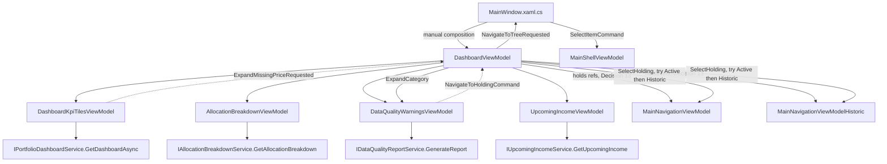

# P52-F06 — WPF — Portfolio Dashboard — Technical Spec

## 1. Overview

F06 adds `Financial.App`'s first portfolio-wide view: a new "Dashboard" nav entry, first under
Investments, whose view renders four independent panels — F01's 8 KPI tiles, F02's four-dimension
allocation breakdown (pie chart + legend table), F03's data-quality warnings panel (expandable,
click-through to the existing Active/Historic Investments tree), and F04's upcoming-income table
with a 30/90/180-day window filter — matching F05 (React)'s task sequence, terminology, field
order, financial formatting and state behaviour exactly, adapted only where WPF's own controls,
DI composition and desktop conventions require it. F01–F04 are backend-only and already merged to
`main`; F05 (React) is a merged sibling this spec treats as the UX reference, not a dependency.

Unlike F05, this feature makes **no HTTP call at all**. `IPortfolioDashboardService`,
`IAllocationBreakdownService`, `IDataQualityReportService`, `IUpcomingIncomeService` are Application
interfaces already registered `AddSingleton` in `AddFinancialApplication()` (confirmed by reading
F01–F04's own specs — none needs a new DI registration), and `Financial.App` already composes that
same Application layer in-process (`App.xaml.cs`'s `services.AddFinancialApplication()`), exactly
like `MainNavigationViewModel`'s own `ISummaryService`/`IPortfolioAssetSummaryService` dependencies.
`DashboardViewModel` therefore takes all four interfaces as constructor dependencies and calls them
directly — no `HttpClient`, no `FinancialApiClient` equivalent, no OpenAPI type generation, and (per
this feature's research) no click-through DTO scope-resolution problem either: both the Active and
Historic investment trees are already fully loaded in memory at startup
(`MainNavigationViewModel`/`MainNavigationViewModelHistoric`'s `LoadNavigationTreeAsync()`, awaited
in `MainWindow`'s `Loaded` handler), so resolving which tree a clicked holding belongs to is a
synchronous local search, not the two-request async resolver F05 needed.

Research confirms three close structural precedents, reused throughout this spec:
`TaxWorkbookViewModel` (the closest existing multi-section-with-independent-loading-state WPF
ViewModel: separate `IsLoading*`/`*Error`/`ShowContent`-style computed properties per section, no
shared "loading state" component exists anywhere in this codebase — confirmed by reading it in
full), `BrokerBreakdownChartBuilder`/`PortfolioSummaryView` (the existing OxyPlot `PieSeries` +
validated categorical palette, and the existing "Converted to {ReportingCurrency}" bordered
secondary-block pattern with `IsReportingCurrencyAvailable`/`Unavailable` bool flags and
`SignedValueToBrushConverter`), and `PriceHistoryTabViewModel`/`DisposalsView` (the existing
`ItemsControl` + `Button` + `SelectableOptionViewModel<T>` "chip" filter pattern — the WPF
equivalent of React's `FilterTabList` — and the existing `Expander` used as "WPF's closest
equivalent to Web's Fluent Accordion", per the comment already in `DisposalsView.xaml`).

### Decisions / Assumptions

Recorded here because the PRD's F06 section is deliberately thin (one nav bullet, one
"same as F05" Experience paragraph) and no interactive user was available to ask (Auto Mode).
Ordered by where they surface in the rest of this spec.

1. **Nav entry.** `Financial.App/Navigation/NavTree.cs`'s `investments` category gets a new first
   child, `new NavChild("dashboard", "Dashboard", "dashboard")`, ahead of `active-investments` — the
   exact ordering the PRD asks for and the exact ordering F05 already used for the web nav tree. No
   new category, no icon change (`NavCategory` only carries one icon per category, not per child,
   confirmed by reading `NavTree.cs` — Investments' existing icon already covers a Dashboard entry
   with no change needed, mirroring F05 Decision 1's identical finding for `Sidebar.tsx`).
2. **View/ViewModel file layout.** New `Financial.App/ViewModels/Investment/Dashboard/` and
   `Financial.App/Views/Investment/Dashboard/` folders hold the four panel ViewModels/Views plus
   `DashboardViewModel` itself and their small builder/helper classes — mirroring
   `Financial.Web/src/components/dashboard/`'s own subfolder precedent (F05 Decision 2) rather than
   adding ~10 more files to the already-large flat `ViewModels/Investment/`/`Views/Investment/`
   directories. This is the first subfolder under either directory; every existing Investment
   ViewModel/View sits flat today (confirmed by the earlier glob of both directories), so this spec
   introduces the grouping convention F05 already established for React, applied to WPF for the
   first time — consistent with `docs/rules/ui.md`'s parity mandate, not a new pattern invented from
   nothing.
3. **`DashboardViewModel` composes four independent panel ViewModels, each with its own
   `IsLoading`/`ErrorMessage`/`ShowContent` triple**, mirroring `TaxWorkbookViewModel`'s own
   established shape (`IsLoadingOptions`/`OptionsError`/`ShowContent`,
   `IsLoadingWorkbook`/`WorkbookError`/`ShowWorkbookContent`) rather than inventing a new shared
   "async resource" abstraction — no such shared abstraction exists anywhere in `Financial.App`
   today (confirmed: `MainNavigationViewModelBase` and `TaxWorkbookViewModel` each hand-roll their
   own loading/error properties; there is no WPF equivalent of React's `useAsyncResource`).
   `DashboardKpiTilesViewModel`, `AllocationBreakdownViewModel`, `DataQualityWarningsViewModel`,
   `UpcomingIncomeViewModel` each expose `bool IsLoading`, `string? ErrorMessage`, `bool ShowContent
   => !IsLoading && ErrorMessage is null`, and a parameterless `LoadAsync()`/`RefreshCommand`
   (`RelayCommand`) calling the one Application-service method it owns
   (`GetDashboardAsync`/`GetAllocationBreakdown`/`GenerateReport`/`GetUpcomingIncome`) inside a
   try/catch that sets `ErrorMessage` on failure — the synchronous three (`GetAllocationBreakdown`,
   `GenerateReport`, `GetUpcomingIncome`) are still wrapped in `Task.Run`-free `async Task LoadAsync()`
   methods for a uniform call shape from `DashboardViewModel`, matching how `TaxWorkbookViewModel`
   already awaits `Task.FromResult`-shaped work uniformly. Because each panel ViewModel's load call
   is independent, a failure in one never blocks another — the same "1 of 4 failed" vs. "4 of 4
   failed" distinction F05 Decision 3 relies on.
4. **Page-level vs. panel-level error state**, identical reasoning to F05 Decision 4:
   `DashboardViewModel` exposes `bool ShowPageLevelError => KpiTiles.ErrorMessage != null &&
   Allocation.ErrorMessage != null && Warnings.ErrorMessage != null && Income.ErrorMessage != null &&
   !KpiTiles.IsLoading && !Allocation.IsLoading && !Warnings.IsLoading && !Income.IsLoading` — true
   only when all four panels are simultaneously non-loading and errored. `DashboardView.xaml` binds
   its four panel `UserControl`s' container `Visibility` to `!ShowPageLevelError` and a page-level
   error block's `Visibility` to `ShowPageLevelError`, with one `Button` (`RetryAllCommand`, a
   `RelayCommand` on `DashboardViewModel` calling all four panels' `RefreshCommand`s) — matching
   F05's single-retry, all-four-refetch behaviour exactly (`P52-F06-03` reads "renders with the same
   figures as F05 for the same data", which includes this state).
5. **Loading state renders as a plain "Loading…" text block per panel**, not a skeleton. F01's
   Experience text asks specifically for "a loading skeleton" — but `docs/ui/wpf.md`'s "React is the
   UX source of truth... adapt controls and mechanics only where WPF conventions... require it"
   licenses a platform-appropriate substitute, and no skeleton/shimmer control or pattern exists
   anywhere in this codebase today (confirmed: no `Skeleton`-named class in `Financial.App`, and
   `Wpf.Ui`'s control set — per `docs/ui/wpf.md`'s own "Wpf.Ui ships neither its own tab-strip nor
   theme resources for `TabControl`" precedent of documenting a real gap rather than inventing a
   control — has no first-party skeleton primitive either). Building a bespoke shimmer control for
   one feature's 8 tiles is a heavier lift than the outcome (a stable-shaped loading placeholder)
   requires: this spec reuses every other panel's already-established `TaxWorkbookViewModel`-style
   loading text (a centred `TextBlock` reading "Loading…" in place of the tile grid while
   `KpiTiles.IsLoading`), which still keeps the *page* shape stable — the container's fixed height
   doesn't collapse — even though the tile grid inside it does. This is a documented, justified
   intentional WPF difference from React's per-tile skeleton (`docs/ui/wpf.md` "Document intentional
   differences and explain why they preserve the same user outcome") since the outcome ("the user
   sees the data is loading, not a blank or broken page") is preserved.
6. **KPI value colour convention reuses `SignedValueToBrushConverter` verbatim**, the same converter
   `PortfolioSummaryView` already uses for its green/red gain-loss values, applied to
   `UnrealisedGainLoss`/`RealisedGainLoss`/`GrossXirr`/`NetXirr` (and their `Converted*`
   counterparts). `MarketValue`, `Invested`, `IncomeYtd`, `IncomeLifetime` bind with no
   `Foreground` override (default text brush), matching F05 Decision 6's identical unsigned-field
   treatment and `PortfolioSummaryView`'s own existing convention for its unsigned fields.
   **Known, accepted debt** (flagged by `ui-reviewer`, not introduced by this feature):
   `SignedValueToBrushConverter` returns hardcoded `Brushes.Green`/`Red`/`Black`, not
   `DynamicResource`-bound theme tokens, so it doesn't respect dark theme or high-contrast mode —
   the same gap `PortfolioSummaryView` already ships with today. This feature reuses the converter
   as-is rather than widening scope to make it theme-aware (a cross-cutting fix that would also
   change `PortfolioSummaryView`'s existing, unrelated screen); a dedicated follow-up should make
   `SignedValueToBrushConverter` itself theme-aware, benefiting every consumer at once.
7. **Reporting-currency secondary block reuses `PortfolioSummaryView`'s actual existing XAML
   structure verbatim**: a primary grid of native-currency tiles, followed — when
   `IsReportingCurrencyEnabled` — by a second bordered section headed `TextBlock Text="{Binding
   ReportingCurrency, StringFormat='Converted to {0}'}"` holding the 8 `Converted*` tiles, with
   `IsReportingCurrencyUnavailable` showing the existing "Converted totals unavailable — showing
   native-currency figures only." message in its place and `IsReportingCurrencyPartial` showing a
   `role`-equivalent status `TextBlock` above the converted grid — the exact WPF-native structure
   F05 Decision 7 reproduced from the same component's React counterpart, applied here to its actual
   WPF counterpart instead.
8. **`IsPartial` inline notice cross-links into the warnings panel via a `RoutedEvent`-free plain
   C# event on `DashboardViewModel`, not router state.** Both panels live in the same
   `DashboardView` visual tree (no navigation involved, exactly like F05 Decision 8's "same
   scrollable page" reasoning) — `DashboardKpiTilesViewModel` exposes a `RelayCommand
   ViewMissingPriceHoldingsCommand` that raises a plain event, `ExpandMissingPriceRequested`, which
   `DashboardViewModel` subscribes to in its constructor and forwards by calling
   `Warnings.ExpandCategory(DataQualityCategory.MissingPrice)` (a public method on
   `DataQualityWarningsViewModel` that sets the matching `WarningCategoryViewModel.IsExpanded = true`
   — see Decision 12) followed by a `BringIntoView()` call the code-behind performs on the Warnings
   panel's container, triggered by a small boolean toggle property `DashboardViewModel` flips
   (`ScrollToWarningsRequested`) that `DashboardView.xaml.cs`'s single event-handler observes via
   `PropertyChanged` — the one narrowly-scoped code-behind concern `docs/ui/wpf.md`'s Architecture
   section explicitly allows ("code-behind only for narrowly scoped view concerns that cannot
   reasonably be expressed elsewhere"), since `BringIntoView()` has no data-bindable XAML
   equivalent.
   **Implemented shape (Part 3).** The scroll-into-view signal lives on
   `DataQualityWarningsViewModel` rather than `DashboardViewModel`, as a plain `CategoryExpanded`
   event raised by `ExpandCategory` and observed by `DataQualityWarningsView.xaml.cs` — one
   code-behind handler instead of two (`DashboardViewModel.ScrollToWarningsRequested` +
   `DashboardView.xaml.cs`), because the handler also has to *find the newly expanded `Expander`*
   in order to move focus onto it, and only the warnings view's own `ItemContainerGenerator` can do
   that. The focus move is not an extra: F05's `expandCategory` already performs the equivalent
   (`#warning-category-header-…`.`focus()`), because scrolling alone gives a sighted mouse user the
   "you're here now" signal but leaves a keyboard/screen-reader user's focus stranded on the KPI
   panel's button. Same user outcome as specified, one narrower code-behind concern instead of two.
   The KPI panel's "View affected holdings" `ui:Button` (deliberately omitted in Part 1, which had
   no subscriber for it and would have shipped an inert control) is added back in Part 3, now that
   this forwarding gives it real behaviour.
9. **Upcoming-income window filter reuses the existing `SelectableOptionViewModel<T>` +
   `ItemsControl`/`Button` "chip" pattern verbatim, with a new option value type.** Exactly like F05
   Decision 9's finding for `PeriodFilterOption`, `PriceHistoryTabViewModel`'s existing
   `PeriodFilter` enum (`Last12Months`, etc.) expresses a calendar-relative *lookback* window, not
   F04's forward-looking day-count window. This spec adds a small new enum,
   `Financial.App/ViewModels/Investment/Dashboard/UpcomingIncomeWindow.cs` —
   `public enum UpcomingIncomeWindow { Days30 = 30, Days90 = 90, Days180 = 180 }` — and populates
   `ObservableCollection<SelectableOptionViewModel<UpcomingIncomeWindow>>` with three entries ("30
   days"/"90 days"/"180 days"), defaulting to `Days90` ("90 days selected by default", matching F04
   Experience and F05 Decision 9's identical default). The `ItemsControl`/`Button` XAML template is
   copied from `PriceHistoryView.xaml`'s existing filter row with no structural change beyond the
   bound collection's generic type argument.
10. **Allocation dimension tabs (Class/Currency/Country/Broker) use the native `TabControl`, not
    the chip pattern**, mirroring F05 Decision 10's content-switching-vs-filter-chip distinction:
    these four tabs swap the *entire chart + legend table* being displayed (a content-switching
    role), not a filter over one fixed dataset, so this spec follows the codebase's existing
    `TabControl` usage (`AnnualSummaryView.xaml`) rather than the chip pattern reserved for F04's
    window filter (Decision 9). Per `docs/ui/wpf.md`'s own documented gap ("the native `TabControl`
    is currently the only option... renders with the plain, unthemed classic Windows chrome — a
    known, open gap"), this spec accepts that same known, already-documented visual gap rather than
    building a custom Fluent `TabControl` template as a side effect of this feature — closing that
    gap is explicitly out of scope per `docs/ui/wpf.md` itself ("not attempted yet since it can't be
    visually verified without a WPF GUI" — unchanged by this feature).
11. **Allocation legend table is a new `DataGrid`, not a reuse of `BrokerBreakdownChartBuilder`'s
    output directly.** `BrokerBreakdownChartBuilder` only builds the `PlotModel`; no existing WPF
    view pairs it with a Label/Value/Percentage table. This spec adds
    `AllocationPieChartBuilder.cs` (dimension-agnostic, reusing `BrokerBreakdownChartBuilder`'s exact
    `Palette`/`PieSeries`/`TrackerFormatString` setup — same visual family, matching the PRD's
    "matching `BrokerBreakdownCharts`' existing visual style" requirement applied to its WPF
    counterpart) plus a read-only `DataGrid` (`AutoGenerateColumns="False"`, three explicit columns:
    Label `Width="*"`, Market Value and Percentage both right-aligned fixed-width, per
    `docs/ui/wpf.md`'s "identifying/label column gets `Width="*"`" rule and
    `forms-data-and-visualisations.md`'s numeric-alignment rule) bound to
    `AllocationBreakdownViewModel`'s currently-selected dimension's entries, mapped to a shared
    `AllocationEntryRowViewModel { Label, MarketValue, Percentage }` at the view-model layer — the
    WPF counterpart of F05's `{label, marketValue, percentage}` shared shape (Decision 11).
12. **Warnings panel uses `Expander`, each independently expandable (no mutual exclusivity)** — the
    already-documented WPF equivalent of Fluent `Accordion` (`DisposalsView.xaml`'s own comment: "WPF's
    closest equivalent to Web's Fluent Accordion"), reused here for the first time as the *page's own*
    accordion rather than a per-row audit-trail disclosure. One `Expander` per nonzero category, in
    the PRD's fixed severity order, each independently toggleable via its own `IsExpanded` bound to
    `WarningCategoryViewModel.IsExpanded` — matching F05 Decision 12's "multiple can be expanded at
    once" choice (`Expander` has no single-open-only mode built in, so "multiple" is simply the
    default, free behaviour, not an extra decision to implement).
13. **The click-through navigation mechanism — the single most architecturally significant decision
    in this spec, and structurally simpler than F05's because both trees are already fully loaded
    in-process.** Research finding: `MainNavigationViewModel` (Active) and
    `MainNavigationViewModelHistoric` (Historic) are each resolved exactly **once** from the DI
    container, as constructor parameters of `MainWindow` (`AppHost.Services.GetRequiredService<
    MainWindow>()` is called exactly once at startup, per `App.xaml.cs`'s `OnStartup`), and
    `MainWindow.xaml.cs` already captures both into private fields (`_navigationViewModel`,
    `_navigationViewModelHistoric`) and wires cross-view behaviour between them directly today (the
    existing `assetPriceView.ViewModel.FetchCompleted += (_, _) => { _navigationViewModel
    .ReloadSelectedNodeDetails(); _navigationViewModelHistoric.ReloadSelectedNodeDetails(); }`).
    Both are registered `AddTransient` in `App.xaml.cs`; requesting either type again from the
    container at a second injection site (e.g., a constructor parameter of `DashboardViewModel`
    resolved automatically by DI) would return a **second, different instance** — not the one
    driving the visible tree — since .NET's default container does not deduplicate a `Transient`
    registration within one object graph the way a `Scoped` registration would. Changing their
    lifetime to `Singleton` is avoidable and would be a wider-blast-radius change than this feature
    needs (every other consumer, and any future test resolving them from a fresh container, would be
    affected). This spec instead follows the exact pattern `MainWindow.xaml.cs` already uses for the
    `FetchCompleted` wiring: `DashboardViewModel` is **not** resolved by attribute/constructor
    injection into `MainWindow`'s own parameter list; instead, `MainWindow.xaml.cs`'s constructor
    manually composes it — `new DashboardViewModel(dashboardService, allocationService,
    dataQualityService, upcomingIncomeService, _navigationViewModel, _navigationViewModelHistoric)`
    — using the same `_navigationViewModel`/`_navigationViewModelHistoric` fields already captured
    from `MainWindow`'s own constructor parameters (the four Application services are added as new
    `MainWindow` constructor parameters, DI-resolved once, like every other service `MainWindow`
    already receives this way). This guarantees `DashboardViewModel` holds references to the exact
    same `MainNavigationViewModel`/`MainNavigationViewModelHistoric` instances the visible tree
    panes use — no event bus, no messenger, no new singleton, consistent with this project's
    documented preference for "explicit calls over a decorator/indirection" (memory:
    `feedback_shared_abstractions_over_decorator`).
    - `MainNavigationViewModelBase<TAssetDetailsViewModel>` (**changed**, not new) gets one new
      public method, `bool SelectHolding(string brokerName, string portfolioName, string assetName)`:
      walks `RootNodes` (Broker → Portfolio → Asset, using the existing
      `NavigationMetadataKeys.BrokerName`/`PortfolioName`/`AssetName` metadata accessors
      `MoveSelectedAssetAsync` already uses) for a matching Asset node; on a match, sets `IsExpanded
      = true` up every ancestor (Broker and Portfolio nodes) and sets the matched node's own
      `IsSelected = true` — **never** assigns `SelectedNode` directly (the testing guide's own
      documented pitfall: "WPF: test through `IsSelected`... assigning it directly shipped a
      permanently-disabled button past 743 green tests" — `IsSelected`'s setter is what raises
      `OnNodeSelected`/`NodeSelected`, which `MainNavigationViewModelBase` already subscribes to via
      its own selection-changed plumbing to update `SelectedNode` and load `AssetDetails`; setting
      `SelectedNode` directly would skip that chain entirely) — and returns `true`. Returns `false`
      with no state change on no match. No async/await needed — both trees are already
      fully-materialised `ObservableCollection<TreeNodeViewModel>` graphs by the time any click is
      possible (the Dashboard view cannot render before `Loaded`'s `Task.WhenAll(...)` completes,
      Decision 3).
    - `DashboardViewModel` exposes `NavigateToHoldingCommand` (a `RelayCommand<WarningHoldingRef>`,
      where `WarningHoldingRef` is a small new record `{ string BrokerName, string PortfolioName,
      string AssetName }`) that tries `_activeTree.SelectHolding(...)` first, falling through to
      `_historicTree.SelectHolding(...)` on a `false` result — the exact same "try Active, then
      Historic" order F05's `resolveHoldingLocation` already established (Decision 13 of that spec)
      — then, on whichever tree matched, raises `NavigateToTreeRequested` (a plain C# event carrying
      `InvestmentScope`) that `MainWindow.xaml.cs` subscribes to (alongside the `ExpandMissingPrice`/
      `ScrollToWarnings` wiring, Decision 8) to call `SelectItemCommand.Execute("active-investments")`
      or `"historic-investments")` on the already-constructed `MainShellViewModel` (captured into a
      local variable before `DataContext` is assigned, then referenced from both event handlers) —
      switching the visible pane to the tree that now has the correct node selected and expanded.
      A resolution that matches neither tree sets `Warnings.NavigationError` (Decision 14) instead of
      raising the event.
    - **Implemented shape (Part 3), two refinements, neither weakening the instance-identity
      guarantee above.** (a) `DashboardViewModel`'s two tree parameters are typed
      `IMainNavigationViewModel`, not the concrete `MainNavigationViewModel`/
      `MainNavigationViewModelHistoric` — `SelectHolding` is declared on that existing interface
      alongside `ReloadSelectedNodeDetails`/`CanAcceptDrop`/`DropAssetAsync` and implemented once on
      `MainNavigationViewModelBase`. `MainWindow.xaml.cs` still passes its own two captured fields,
      so the composition root and its reasoning are unchanged; the interface only spares
      `DashboardViewModelTests` from standing up two real `MainNavigationViewModel`s (15 stub
      services each) to assert a two-line fallthrough. (b) The warning row's `Button` binds to
      `DataQualityWarningsViewModel.SelectFindingCommand`, which raises `NavigateToHoldingRequested`
      for `DashboardViewModel` to run through `NavigateToHoldingCommand` — the same
      panel-raises-event, shell-handles-it shape Part 1 already established for
      `ViewMissingPriceHoldingsCommand`/`ExpandMissingPriceRequested`, and it keeps the row's
      `Command` binding resolvable against the panel's own `DataContext` instead of reaching two
      `UserControl` ancestors up the visual tree for `DashboardViewModel`.
    - `MainNavigationViewModelBase`'s existing private `SelectAsset` (post-move reselection) now
      delegates to `SelectHolding`: they were the same walk-expand-select already, and keeping two
      copies is how the two would drift.
    - Because both trees are already in memory, this is synchronous and instantaneous — there is no
      WPF equivalent of F05's "holding not found because the report is stale" network race being any
      more or less likely; the same rare edge case (holding moved/archived between report generation
      and the click) is still possible and handled identically (Decision 14).
14. **A holding `SelectHolding` cannot locate in either tree shows an inline, non-blocking message,
    not a silent no-op or a thrown exception** — `DataQualityWarningsViewModel` exposes
    `string? NavigationError`, set to `"Unable to locate {assetName} — it may have moved or been
    archived since this report was generated."` on a double-miss, rendered as a dismissible
    `InfoBar`/`ui:InfoBar` (`Wpf.Ui`'s Fluent status-message control, the WPF equivalent of Fluent
    React's `MessageBar` used for this exact purpose in F05 Decision 14) above the `Expander` list,
    with a bound `Severity="Warning"` and a close button clearing `NavigationError`. It also clears on
    the next successful navigation or the next `RefreshCommand` execution.
15. **Empty warnings panel (all 5 categories zero) shows a confirmation, not nothing** — identical
    reasoning to F05 Decision 15: an `ui:InfoBar Severity="Success"` reading "No data-quality issues
    detected" renders in place of the `Expander` list when every category count is zero, keeping the
    panel's heading visible (never a fully vanished panel).
16. **Panel layout uses a fixed two-column `Grid` for Allocation + Warnings, not a breakpoint-driven
    reflow.** `docs/ui/wpf.md`/`docs/ui/react.md` license WPF-native adaptation where "high-quality
    WPF experience needs desktop-specific... window sizing" — and, unlike the browser, this codebase
    has no WPF equivalent of a CSS media query (`docs/ui/wpf.md`'s own `TabControl` gap note
    describes the same class of platform limitation). This spec follows `docs/ui/wpf.md`'s "adapt to
    narrower windows rather than allowing fields to become unusably narrow" literally but simply: a
    `Grid` with two `*`-proportional `ColumnDefinition`s (Allocation left, Warnings right) that
    scales fluidly with the window (unlike a fixed-pixel layout, this reflows continuously rather
    than snapping at a breakpoint) down to each column's own `MinWidth="320"`, below which the
    window's own horizontal scrollbar (already the app-wide fallback for an undersized window
    everywhere else in `Financial.App`) takes over — a documented, intentional platform difference
    from React's two-breakpoint stack/side-by-side toggle (F05 Decision 16), justified because WPF
    desktop windows are user-resized continuously (unlike a fixed mobile/tablet/desktop viewport
    triage) and this app has no existing precedent for a XAML `Trigger`-driven "stack below N
    pixels" layout swap to reuse or extend. KPI tiles render in a `UniformGrid Columns="4"` (2 rows
    of 4, or `Columns="2"` under a narrow-window trigger is out of scope for the same
    no-existing-precedent reason) above it, full width; the upcoming-income table renders full
    width below it — same top-to-bottom order as F05 (F05 Decision 2's layout, applied here).
    **Extension (added during Part 2's review):** the identical reasoning applies one level down,
    inside `AllocationBreakdownView` itself — its own chart+legend split is a fluid two-column
    `Grid` (`MinWidth="240"`/`"280"`) with no stacked-below-N-pixels fallback, for the same
    "no existing WPF breakpoint-reflow precedent to extend, and the window's own horizontal
    scrollbar is the app-wide fallback everywhere else" reasoning as the page-level Allocation +
    Warnings split above — not a separate, unreviewed gap, the same accepted platform difference
    applied consistently within one panel as across the whole page.
17. **Page-level retry is a single `ui:Button Appearance="Primary"` labelled "Retry"** — same label
    and rationale as F05 Decision 17, using `Wpf.Ui.Controls.Button`'s `Primary` appearance per
    ADR-004.

## 2. Scope

### Included
- New "Dashboard" nav entry (`NavTree.cs`), a new `DashboardView.xaml`/`DashboardViewModel` pair
  resolved and wired in `MainWindow.xaml.cs`/`App.xaml.cs` per the in-process DI composition
  pattern (Decisions 1, 13).
- Four new panel ViewModels (`DashboardKpiTilesViewModel`, `AllocationBreakdownViewModel`,
  `DataQualityWarningsViewModel`, `UpcomingIncomeViewModel`) and four new panel Views
  (`DashboardKpiTilesView.xaml`, `AllocationBreakdownView.xaml`, `DataQualityWarningsView.xaml`,
  `UpcomingIncomeView.xaml`), each calling one of F01–F04's already-registered Application services
  directly, with every loading/empty/partial/error state those features' own Experience sections
  define (Decision 3).
- Warnings-panel click-through: the new `MainNavigationViewModelBase.SelectHolding` method
  (changed, not new type) and the `DashboardViewModel`/`MainWindow.xaml.cs` event wiring (Decision
  13).
- New `AllocationPieChartBuilder.cs` (chart-model builder, dimension-agnostic) and
  `AllocationEntryRowViewModel` (legend `DataGrid` row shape).
- New `UpcomingIncomeWindow` enum + `SelectableOptionViewModel<UpcomingIncomeWindow>` population for
  F04's window filter (Decision 9).
- Page-level all-4-failed error state with a single retry (Decision 4).
- Unit tests for every new ViewModel (constructor injection of stub Application services, per
  `testing-guide-Financial`'s `wpf-viewmodels.md`), an extension to
  `MainNavigationViewModelBase`'s existing test suite for `SelectHolding`, and one Integration
  (DI-resolution) test proving `DashboardViewModel` and its four panel ViewModels resolve cleanly
  through the real `AppHost` composition, per `testing-guide-Financial`'s documented "2 classes"
  WPF Integration precedent.

### Deferred (none — this is the wave's final feature)
- Nothing is deferred past this feature; F05 already shipped, and this is P52's own P52-F06.

### Out of scope (per PRD §7 and F05's own §2 "Out of scope", applies to this feature too)
- Any backend DTO/endpoint change (F01–F04 are already merged, already-shipped, already-versioned
  Application-layer surfaces this feature only consumes).
- Computing tax due, bond maturity/coupon modelling, CSV export, a configurable staleness
  threshold, automatic remediation of any finding, click-through from the allocation breakdown
  (F02's own PRD explicitly excludes this), and any change to `PortfolioSummaryView`/
  `BrokerBreakdownChartBuilder` beyond `AllocationPieChartBuilder` sitting alongside it.
- Closing `docs/ui/wpf.md`'s existing, already-documented `TabControl` Fluent-theming gap
  (Decision 10) — unrelated to this feature, called out there as "not attempted yet."
- Changing `MainNavigationViewModel`/`MainNavigationViewModelHistoric`'s DI lifetime — Decision 13
  explains why this is unnecessary and avoided.

## 3. Architecture / Component Overview

### Navigation

| File | Change |
|---|---|
| `Financial.App/Navigation/NavTree.cs` | **Changed.** New first child of `investments`: `new NavChild("dashboard", "Dashboard", "dashboard")`. |
| `Financial.App/MainWindow.xaml.cs` | **Changed.** New `dashboardView` constructor parameter (DI-resolved), new `["dashboard"] = dashboardView` entry in `viewsByKey` (positioned as the dictionary's first Investments-category entry, matching `NavTree.cs`'s order), manual `DashboardViewModel` composition using the already-captured `_navigationViewModel`/`_navigationViewModelHistoric` fields, and the three event-handler wirings from Decisions 8 and 13 (`ExpandMissingPriceRequested`/`ScrollToWarningsRequested`, `NavigateToTreeRequested`). |
| `Financial.App/App.xaml.cs` | **Changed.** `services.AddTransient<DashboardKpiTilesViewModel>(); services.AddTransient<AllocationBreakdownViewModel>(); services.AddTransient<DataQualityWarningsViewModel>(); services.AddTransient<UpcomingIncomeViewModel>(); services.AddTransient<DashboardView>();` — `DashboardViewModel` itself is **not** DI-registered (Decision 13: it is manually composed in `MainWindow.xaml.cs`), but its four panel ViewModels and the four Application-service interfaces it depends on are already resolvable (panel ViewModels are still DI-registered/injected into `DashboardViewModel`'s constructor via `MainWindow`'s own resolved parameters, since none of them touches the tree ViewModels — only `DashboardViewModel` itself needs the manual composition). |

### ViewModels (`Financial.App/ViewModels/Investment/Dashboard/`)

| File | Change |
|---|---|
| `DashboardViewModel.cs` | **New.** Composes the four panel ViewModels; owns `ShowPageLevelError`/`RetryAllCommand` (Decision 4), the cross-panel `ExpandMissingPriceRequested`→`ExpandCategory` forwarding (Decision 8), and `NavigateToHoldingCommand`/`NavigateToTreeRequested` (Decision 13). Constructor takes the four panel ViewModels plus `MainNavigationViewModel`/`MainNavigationViewModelHistoric` (the same already-constructed instances `MainWindow` holds). |
| `DashboardKpiTilesViewModel.cs` | **New.** Calls `IPortfolioDashboardService.GetDashboardAsync()`; exposes the 8 native tiles, the 8 `Converted*` tiles, `IsPartial`/`UnvaluedHoldingCount` notice text, `ViewMissingPriceHoldingsCommand` (Decisions 3, 5–8). |
| `AllocationBreakdownViewModel.cs` | **New.** Calls `IAllocationBreakdownService.GetAllocationBreakdown()`; exposes `SelectedDimension` (`AllocationDimension` enum: `Class`/`Currency`/`Country`/`Broker`, defaulting to `Class`), the selected dimension's `AllocationEntryRowViewModel` collection, and the `PlotModel` from `AllocationPieChartBuilder` (Decisions 10–11). |
| `DataQualityWarningsViewModel.cs` | **New.** Calls `IDataQualityReportService.GenerateReport()`; exposes one `WarningCategoryViewModel` per nonzero category (severity-ordered), `NavigationError` (Decision 14), `ExpandCategory(DataQualityCategory)` (Decision 8/12). |
| `UpcomingIncomeViewModel.cs` | **New.** Calls `IUpcomingIncomeService.GetUpcomingIncome()`; exposes `SelectedWindow` (`UpcomingIncomeWindow`, defaulting to `Days90`), the window-filtered, already-sorted entry list, empty-state text (Decision 9). |
| `WarningCategoryViewModel.cs` | **New.** One row group: category label, count, `IsExpanded`, its finding rows (`WarningFindingRowViewModel`) or none for the count-only stale-valuation category (Decision 12; mirrors F03 backend Decision 4's count-only shape). |
| `WarningFindingRowViewModel.cs` | **New.** One clickable finding row: `AssetName`, `BrokerName`, `PortfolioName`, category-specific secondary fields (`OffendingSaleDate`/`Shortfall` or `TaxYear`/`EventCategory`), and the `WarningHoldingRef` `NavigateToHoldingCommand` binds to. |
| `AllocationEntryRowViewModel.cs` | **New.** `{ string Label, decimal MarketValue, decimal Percentage }` — the WPF counterpart of F05's shared `{label, marketValue, percentage}` shape (Decision 11). |
| `AllocationPieChartBuilder.cs` | **New.** `internal static PlotModel Build(IReadOnlyList<(string Name, decimal Value)> slices)` — copies `BrokerBreakdownChartBuilder`'s palette/series/tracker setup verbatim (Decision 11). |
| `UpcomingIncomeWindow.cs` | **New.** `enum UpcomingIncomeWindow { Days30 = 30, Days90 = 90, Days180 = 180 }` (Decision 9). |
| `AllocationDimension.cs` | **New.** `enum AllocationDimension { Class, Currency, Country, Broker }`, defaulting to `Class` (Decision 10). |
| `DataQualityCategory.cs` | **New.** `enum DataQualityCategory { SalesExceedPurchases, UnpricedOpenHoldings, OpenHoldingsMissingCostBasis, StaleValuation, UnresolvedTaxClassifications }`, in the PRD's fixed severity order (Decision 12; mirrors F03's own DTO field order, F03 spec Decision 8). |
| `WarningHoldingRef.cs` | **New.** `record WarningHoldingRef(string BrokerName, string PortfolioName, string AssetName)` (Decision 13). |

### Views (`Financial.App/Views/Investment/Dashboard/`)

| File | Change |
|---|---|
| `DashboardView.xaml`/`.xaml.cs` | **New.** Composes the four panel `UserControl`s in the layout Decision 16 defines; owns the page-level error block (Decision 4) and the narrowly-scoped `BringIntoView()` code-behind for Decision 8's scroll-to-warnings behaviour. |
| `DashboardKpiTilesView.xaml` | **New.** `UniformGrid Columns="4"` of 8 tiles + the reporting-currency secondary section (Decision 7) + the `IsPartial` notice (Decision 8). |
| `AllocationBreakdownView.xaml` | **New.** `TabControl` (Decision 10) + `AllocationPieChartBuilder`'s `PlotModel` in an OxyPlot `PlotView` + the legend `DataGrid` (Decision 11). |
| `DataQualityWarningsView.xaml` | **New.** `ui:InfoBar` (empty/error states, Decision 14–15) + one `Expander` per nonzero category (Decision 12) + clickable finding rows. |
| `UpcomingIncomeView.xaml` | **New.** `ItemsControl`/`Button` window-filter row (Decision 9) + a read-only `DataGrid` (Asset, Broker, Projected Date, Projected Amount) + empty-state text. |

### Tree integration (existing file, changed)

| File | Change |
|---|---|
| `Financial.App/ViewModels/Investment/MainNavigationViewModelBase.cs` | **Changed.** New public `bool SelectHolding(string brokerName, string portfolioName, string assetName)` method (Decision 13) — walks `RootNodes`, sets ancestor `IsExpanded`/matched-node `IsSelected`, returns whether a match was found; the existing private `SelectAsset` now delegates to it. No other member changes. |
| `Financial.App/ViewModels/Investment/IMainNavigationViewModel.cs` | **Changed.** Declares the same `SelectHolding` member, so `DashboardViewModel` depends on the abstraction both trees already implement (Decision 13, implemented shape). |

No `Financial.Api`/backend file changes in this feature (F01–F04 are already merged, already
consumed in-process per Decision 13's own composition root reasoning). No `Financial.Web` file
changes — this feature only touches `Financial.App` and its test project.

## 4. API Contracts

**N/A — no HTTP endpoint is added or called.** This feature consumes F01–F04's Application-layer
interfaces directly, in-process. The "contract" this feature actually depends on is each service's
already-stable C# method signature, listed for traceability:

| Service | Method | Consumed by |
|---|---|---|
| `IPortfolioDashboardService` | `Task<PortfolioDashboardDTO> GetDashboardAsync()` | `DashboardKpiTilesViewModel` |
| `IAllocationBreakdownService` | `AllocationBreakdownDTO GetAllocationBreakdown()` | `AllocationBreakdownViewModel` |
| `IDataQualityReportService` | `DataQualityReportDTO GenerateReport()` | `DataQualityWarningsViewModel` |
| `IUpcomingIncomeService` | `IReadOnlyList<UpcomingIncomeDTO> GetUpcomingIncome()` | `UpcomingIncomeViewModel` |

Every DTO shape is F01–F04's own §4/§6, unchanged. No new Application interface member, no new
Api controller, no OpenAPI snapshot regeneration (this feature never touches
`Financial.Api`/`Financial.Web`).

## 5. Data Model

**N/A — no persistence, no schema, no migration.** Pure in-process consumption feature; every DTO
it reads is already defined and stable (F01–F04's own "nothing persists" framing applies
transitively, same as F05 §5).

New WPF-only shapes (not wire DTOs — listed per this project's Data Model convention for
computed/derived presentation-layer shapes):

**`UpcomingIncomeWindow`** (new enum, `Financial.App/ViewModels/Investment/Dashboard/UpcomingIncomeWindow.cs`)

| Value | Label | Default |
|---|---|---|
| `Days30 = 30` | "30 days" | |
| `Days90 = 90` | "90 days" | ✓ |
| `Days180 = 180` | "180 days" | |

**`AllocationDimension`** (new enum) — `Class \| Currency \| Country \| Broker`, defaulting to
`Class` per F02's own Experience text.

**`DataQualityCategory`** (new enum) — the 5 dashboard-relevant categories in the PRD's fixed
severity order (Decision 12).

**`WarningHoldingRef`** (new record) — `{ string BrokerName, string PortfolioName, string
AssetName }`, the WPF counterpart of F05's `pendingSelection` router-state shape, passed as a
plain method argument/command parameter here instead of router state (no router exists in WPF).

## 6. Requirements / Business Rules

This section translates F01–F04's own Capabilities/Experience text into F06's concrete WPF UX
flows — the same content F05 already rendered for the first time, now given a WPF-equivalent
implementation per `docs/ui/wpf.md`'s parity mandate — plus this feature's own PRD §6 text and
every relevant §9 acceptance criterion.

### 6.1 Shell and layout

1. The Dashboard entry is reachable only from the new "Dashboard" sidebar item, first under
   Investments (F06 PRD Capabilities; first bullet of F06's §9 group).
2. Layout, top to bottom, inside `DashboardView`: KPI tiles (`UniformGrid`, full width) →
   allocation breakdown + warnings panel (two-column `Grid`, Decision 16) → upcoming-income table
   (full width). The whole view is one `ScrollViewer`-wrapped page; no panel requires a tree-node
   selection to render (F06 PRD Experience: "Same KPI tiles, allocation view, warnings panel and
   upcoming-income table as F05").
3. Each panel loads and renders independently (Decision 3); one panel's loading/error/empty state
   never blocks or hides another panel's content (F06 §9 second bullet: "All 4 panels render with
   the same figures as F05 for the same data").
4. **Page-level error state** (Decision 4): when all four panel ViewModels report a non-null
   `ErrorMessage` simultaneously (and none is `IsLoading`), `DashboardView` shows one error block in
   place of all four panels, with a single "Retry" `ui:Button` (Decision 17) that executes every
   panel's `RefreshCommand`.
5. Any other combination (1–3 of 4 failed) renders every panel in its normal position; a failed
   panel shows its own inline error text + "Try again" button (its own `RefreshCommand`).

### 6.2 KPI tiles (`DashboardKpiTilesViewModel`/`DashboardKpiTilesView`, consumes F01)

1. Renders 8 tiles in the PRD's exact order: Market Value, Invested, Unrealised Gain/Loss, Realised
   Gain/Loss (Lifetime), Income YTD, Income Lifetime, Gross XIRR, Net XIRR (of Tax) — labels/order
   fixed per F01 Experience, matching F05 §6.2 rule 1 exactly (terminology parity per
   `docs/ui/wpf.md`).
2. **Loading**: a centred "Loading…" text replaces the tile grid while `IsLoading` (Decision 5) —
   an intentional WPF adaptation of F05's per-tile skeleton, documented above.
3. **Values**: `MarketValue`/`Invested`/`IncomeYtd`/`IncomeLifetime` formatted `N2`, unsigned, no
   colour override. `UnrealisedGainLoss`/`RealisedGainLoss` formatted `N2` +
   `SignedValueToBrushConverter`. `GrossXirr`/`NetXirr` formatted `P2` + the same converter,
   rendering `"—"` (`TargetNullValue`) when `null` (`XirrCalculator.Calculate` can return `null` per
   F01 §6 rule 9 — same null convention F05 §6.2 rule 3 already established for React).
4. **Partial notice** (`IsPartial`): an inline notice below the tile grid, worded from
   `UnvaluedHoldingCount` ("N holdings could not be valued; Market Value, Unrealised Gain/Loss and
   both XIRR figures are incomplete." — the same wording F05 §6.2 rule 4 already fixed, per
   `docs/ui/wpf.md`'s terminology-parity rule), plus a "View affected holdings" `ui:Button` invoking
   `ViewMissingPriceHoldingsCommand` (Decision 8), proving `P52-F01-dashboard-aggregate-02` at this
   UI layer.
5. **Reporting-currency secondary block** (Decision 7): shown when `IsReportingCurrencyEnabled`;
   `IsReportingCurrencyUnavailable` replaces it with the existing unavailable-totals message (retry
   re-runs `KpiTiles.RefreshCommand`); `IsReportingCurrencyPartial` shows a status text above the
   converted grid.
6. **Error**: inline error text + "Try again" (`KpiTiles.RefreshCommand`), independent of the
   page-level state (§6.1 rule 5).

### 6.3 Allocation breakdown (`AllocationBreakdownViewModel`/`AllocationBreakdownView`, consumes F02)

1. Four `TabItem`s — Class, Currency, Country, Broker (Decision 10), defaulting to Class on first
   load (F02 Experience).
2. Selecting a tab rebuilds `AllocationPieChartBuilder`'s `PlotModel` for that dimension and
   re-populates the legend `DataGrid` (Label, Market Value, Percentage — right-aligned numerics),
   sorted exactly as the backend already returns it (descending by market value, F02 §6 rule 5 — no
   client-side re-sort).
3. **Empty**: when the selected dimension's entry list is empty (no priced Active holdings, F02's
   documented empty case), a short message ("No priced holdings to display for this view.") replaces
   the chart — same wording family as F05 §6.3 rule 3's `BrokerBreakdownCharts`-matching empty state.
4. **Read-only**: no click/selection handler on any pie slice or `DataGrid` row — F02's own PRD
   Experience explicitly excludes click-through for this panel.
5. **Loading/error**: "Loading…" text / inline error + "Try again" (`Allocation.RefreshCommand`),
   independent of the other three panels.

### 6.4 Data-quality warnings (`DataQualityWarningsViewModel`/`DataQualityWarningsView`, consumes F03)

1. Categories render as `Expander`s in the PRD's fixed severity order: impossible cash-flow
   sequence (`SalesExceedPurchases`), missing price (`UnpricedOpenHoldings`), missing cost basis
   (`OpenHoldingsMissingCostBasis`), stale valuation (`StaleValuationCount`), unresolved tax
   classification (`UnresolvedTaxClassifications`) — F03 Experience's own literal order, matching
   F05 §6.4 rule 1.
2. **Hide-if-zero**: a category whose count is 0 renders no `Expander` at all (proving
   `P52-F03-data-quality-warnings-02` at this UI layer too). Each `Expander`'s header always shows
   the live count matching the backend list length (`P52-F03-data-quality-warnings-01`).
3. **All-zero**: an `ui:InfoBar Severity="Success"` ("No data-quality issues detected") renders in
   place of the `Expander` list (Decision 15).
4. **Stale valuation** renders as a plain count row with no `Expander`, no finding list — F03's own
   backend Decision 4: this category carries no per-holding identity.
5. **Click-through**: every row inside `SalesExceedPurchases`/`UnpricedOpenHoldings`/
   `OpenHoldingsMissingCostBasis`/`UnresolvedTaxClassifications`'s expanded `Expander` is a `Button`
   showing `AssetName` (plus `PortfolioName`/`BrokerName` as secondary text, plus
   `OffendingSaleDate`/`QuantityHeld`/`Shortfall` for sales-exceed-purchases rows or
   `TaxYear`/`EventCategory` for tax-classification rows). Clicking it executes
   `DashboardViewModel.NavigateToHoldingCommand` with that row's `WarningHoldingRef`, proving
   `P52-F03-data-quality-warnings-03` and (together with F05's own suite) the Cross-Feature
   Integration criterion "matching click-through navigation... in F05 and F06". A resolution
   failure sets `NavigationError` (Decision 14) instead of navigating.
6. **`ExpandCategory` forwarding** (Decision 8): opens the Missing Price `Expander` and requests a
   scroll-into-view when invoked from the KPI tiles' partial notice.
7. **Loading/error**: "Loading…" text / inline error + "Try again" (`Warnings.RefreshCommand`),
   independent of the other three panels.

### 6.5 Upcoming income (`UpcomingIncomeViewModel`/`UpcomingIncomeView`, consumes F04)

1. Chip-style window selector — 30/90/180 days (Decision 9) — defaulting to 90 (F04 Experience),
   driving a local `SelectedWindow` property.
2. `DataGrid` columns: Asset, Broker, Projected Date, Projected Amount — sorted by
   `ProjectedNextDate` ascending exactly as the backend returns it (F04 §6 rule 6 — no client-side
   re-sort beyond the window filter).
3. **Client-side window filtering**: renders only entries where `entry.ProjectedNextDate <= Today +
   SelectedWindow` days, from the already-fetched, unfiltered list (F04 §6 rule 7's documented
   client-filtering contract). Switching the window re-filters the already-held list; it never
   re-calls `IUpcomingIncomeService` (`P52-F04-upcoming-income-03`, proved at this UI layer).
4. **Empty**: when the filtered set is empty, "No upcoming payments detected in the next N days"
   (F04's own literal wording, `N` = the selected window) — `P52-F04-upcoming-income-04`.
5. **Loading/error**: "Loading…" text / inline error + "Try again" (`Income.RefreshCommand`),
   independent of the other three panels.

### 6.6 Click-through navigation mechanics (consumes F03, integrates with the existing trees)

1. On a successful `SelectHolding` (Decision 13), the shell switches to Active or Historic
   Investments (whichever tree actually contains the holding) via `MainShellViewModel
   .SelectItemCommand`, landing with the correct Broker/Portfolio/Asset node already expanded and
   selected, and `AssetDetails` showing that asset's Summary tab by default (the existing
   `MainNavigationViewModelBase` selection-changed behaviour — no change needed there) — Cross-
   Feature Integration: "Data-quality warnings from F03 render identically, including matching
   click-through navigation to the affected holding" (F06's own half; F05's is already proven).
2. On a failed resolution (holding not found in either tree), the shell stays on the Dashboard view
   and `NavigationError` (Decision 14) is shown — no partial/broken navigation occurs.

## 7. Testing Strategy

Per `testing-guide-Financial`'s `wpf-viewmodels.md` and the WPF row of its artifact-type table: Unit
for every new ViewModel (constructor-injected stub Application services + `RecordingLogger<T>`
where applicable, mirroring `InvestmentAccountsViewModelTests.cs`'s established pattern — a private
`CreateViewModel()` factory returning the ViewModel plus its stubs); selection is exercised through
`TreeNodeViewModel.IsSelected`, never by assigning `SelectedNode` directly (the testing guide's own
documented pitfall). Views/XAML are covered by contract (binding) tests plus manual verification
only, per `coverlet.runsettings`'s own documented exclusion of `Financial.Presentation.App`'s
XAML view/component/control code-behind — confirmed by reading the file directly: this applies to
every new `.xaml`/`.xaml.cs` file this feature adds, so this feature's Testing Strategy asks for no
unit test against any `DashboardView`/`*View.xaml.cs` file, only against the ViewModels and the one
changed `MainNavigationViewModelBase` method. This PRD (P52) already has AC ids through F05
(`P52-F01...`–`P52-F05...`); per `references/feature-traceability.md`, this feature adds ids to
§9's F06 group and the Cross-Feature Integration group the first time an AC-tracing test is written
for it (`P52-F06-wpf-portfolio-dashboard-01..03`, in the order the three (currently unchecked)
bullets already appear in §9) — plan.md's final phase includes this as an explicit step.

### Unit — `Tests/Financial.Presentation.Tests/ViewModels/Investment/Dashboard/`
- `DashboardViewModelTests.cs`: composes four stub panel ViewModels; `ShowPageLevelError` true only
  when all four are simultaneously errored/non-loading, false for any other combination;
  `RetryAllCommand` calls all four `RefreshCommand`s; `ExpandMissingPriceRequested` forwards to
  `Warnings.ExpandCategory(MissingPrice)`; `NavigateToHoldingCommand` calls the active tree's
  `SelectHolding` first, falls through to the historic tree's `SelectHolding` on a `false` result,
  raises `NavigateToTreeRequested` with the matching scope on success, sets `Warnings
  .NavigationError` on a double-miss without raising the event.
- `DashboardKpiTilesViewModelTests.cs`: `LoadAsync` populates all 8 native tiles + 8 converted
  tiles from a stub `IPortfolioDashboardService`; `IsLoading` true during the call, false + content
  after; a thrown/faulted call sets `ErrorMessage`, leaves `ShowContent` false;
  `IsPartial`/`UnvaluedHoldingCount` notice text matches the DTO; `ViewMissingPriceHoldingsCommand`
  raises `ExpandMissingPriceRequested`; `IsReportingCurrencyEnabled`/`Unavailable`/`Partial` each
  drive the expected computed-property state.
- `AllocationBreakdownViewModelTests.cs`: `LoadAsync` populates `ByClass`/etc. from a stub
  `IAllocationBreakdownService`; `SelectedDimension` defaults to `Class`; changing it swaps the
  bound legend rows and rebuilds the `PlotModel`; an empty dimension list sets the empty-state flag;
  no command/handler exists on any row (read-only, asserted by absence).
- `AllocationPieChartBuilderTests.cs`: same shape as an existing `BrokerBreakdownChartBuilder` test
  if one exists (mirrors its assertions — slice count, palette cycling, empty-input → empty model).
- `DataQualityWarningsViewModelTests.cs`: `LoadAsync` from a stub `IDataQualityReportService`
  produces one `WarningCategoryViewModel` per nonzero category, in severity order; a zero-count
  category produces no view-model entry; all-zero sets an all-clear flag; stale valuation produces
  a count-only entry (no finding rows); `ExpandCategory(MissingPrice)` sets that category's
  `IsExpanded`; `NavigationError` set/cleared per Decision 14's rules.
- `UpcomingIncomeViewModelTests.cs`: `LoadAsync` from a stub `IUpcomingIncomeService` populates the
  full list; `SelectedWindow` defaults to `Days90`; changing it re-filters the already-held list
  without a second service call (assert the stub's call count stays 1); empty-state text includes
  the selected day count; sort order unchanged by filtering.
- `WarningCategoryViewModelTests.cs`/`WarningFindingRowViewModelTests.cs`: plain shape/mapping
  tests only where any non-trivial mapping logic exists (e.g. secondary-field selection per
  category) — skipped per the hooks-skill-equivalent "one-line mapping" rule where there is none.

### Unit — `Tests/Financial.Presentation.Tests/ViewModels/Investment/MainNavigationViewModelBaseTests.cs` (existing, extended)
- `SelectHolding` selects the matching Asset node (via `IsSelected`, never `SelectedNode` directly)
  and expands its Broker/Portfolio ancestors, returning `true`.
- `SelectHolding` returns `false` and changes no node's `IsExpanded`/`IsSelected` when no matching
  node exists in the tree.
- `SelectHolding` matching an already-selected node is idempotent (no duplicate `NodeSelected`
  raise, matching the existing `IsSelected` setter's own guard against reassigning the same value —
  confirmed by reading `TreeNodeViewModel.IsSelected`'s setter, which only fires on `SetProperty`
  returning `true`).

### Integration (WPF, DI-resolution) — `Tests/Financial.Presentation.Tests/Integration/DashboardCompositionTests.cs`
Per `testing-guide-Financial`'s documented "Integration (DI): 2 classes" WPF precedent: builds the
real `AppHost`-equivalent service collection (`AddFinancialApplication()` +
`AddFinancialInfrastructure()` against a temp/fixture data file, never the live one, per this
project's own migration-safety convention) and resolves `DashboardKpiTilesViewModel`/
`AllocationBreakdownViewModel`/`DataQualityWarningsViewModel`/`UpcomingIncomeViewModel` to prove
the real DI graph composes with no missing registration — the WPF counterpart of `DashboardPage
.test.tsx`'s "real page + hooks + components" integration coverage, and this feature's own
AC-tracing home:
- `Dashboard nav entry appears first under Investments` (`NavTree.Categories` assertion) —
  `P52-F06-wpf-portfolio-dashboard-01`.
- `all four panel ViewModels load real fixture data with independent loading/error states, proving
  DI composition end-to-end` — `P52-F06-wpf-portfolio-dashboard-02`.
- `a warning finding's NavigateToHoldingCommand selects the matching node in the real tree built
  from the same fixture` — `P52-F06-wpf-portfolio-dashboard-03` and the Cross-Feature Integration
  click-through criterion's F06 half.
- `dashboard aggregate/allocation/warning-count/upcoming-income figures computed from the same
  fixture data match the values F05's own equivalent fixture-driven test suite asserts` — the
  remaining three Cross-Feature Integration criteria ("render identically... in F05 and F06"),
  satisfied by both suites reading the same documented fixture shape rather than a literal shared
  test (no cross-project test-sharing mechanism exists between `Financial.Presentation.Tests` and
  `Financial.Web`'s vitest suite).

### Not covered here
- Nothing — F06 is P52's final feature; every deferred item from F05's own spec (§7 "Not covered
  here") is this feature's responsibility, discharged above.
