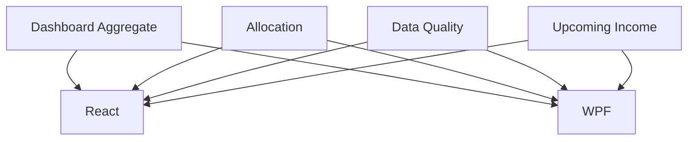

# Portfolio Dashboard and Data Quality

## 1. Executive Summary

Portfolio Dashboard and Data Quality gives the Investment bounded context its first portfolio-wide
view. Today every figure — market value, return, income, allocation — lives on a broker- or
asset-scoped Summary tab, so seeing the whole portfolio means opening each broker's tree node in turn
and adding figures by hand. This feature adds a single new Dashboard page, first in the Investment
navigation, that aggregates market value, invested amount, unrealised and lifetime realised gain,
income year-to-date and lifetime, and a genuine money-weighted portfolio XIRR (gross and net of tax) —
building directly on the per-holding valuation, return and disposal machinery Waves 0, 1 and 4 (P46,
P47, P50) already shipped.

The same page also gives P46-F07's data-quality report — today a console tool nobody runs day to day —
its first in-app surface: five warning categories (missing price, missing cost basis, stale valuation,
unresolved tax classification, an impossible sale sequence), each actionable, clicking straight through
to the affected holding in the existing tree. A four-dimension allocation breakdown (asset class,
currency, country, broker) reuses the exact market-value weighting the app already applies to portfolio
weight, so exposure reads consistently with every other percentage already on screen. A fourth panel
projects each holding's next expected dividend or coupon forward from its own already-detected payment
frequency, within a user-selectable window, with no new manual data entry.

This closes the dashboard half of G7 (no portfolio-level return, no dashboard) and gives G11's known
data-quality gaps — 90 of 160 assets unclassified at time of writing, three holdings with an impossible
sale, four mis-filed Historic holdings — a visible home for the first time. It stays inside the same
boundary every prior wave has respected: no new manual data entry, no bond maturity/coupon-schedule
modelling (nothing in the domain expresses a future date today, and this feature does not add such a
field), and both `Financial.Web` and `Financial.App` ship at parity in the same wave.

## 2. Problem and Opportunity

**The Problem**

- **No portfolio-wide view exists.** Every return, income and value figure lives on a broker- or
  asset-scoped Summary tab (`AggregatedSummaryTab`, `PortfolioSummaryTab`, `AssetSummaryTab`); getting
  a whole-portfolio picture today means opening each broker's tree node one at a time and adding
  figures by hand.
- **Data-quality issues are invisible in the app.** P46-F07's report (unpriced open holdings,
  `GlobalAssetClass.Unknown` holdings, sales that exceed the units held, Historic holdings that still
  carry a quantity) exists only as a console tool (`Tools/InvestmentDataQualityReport`) with no API
  endpoint and no UI — a user only ever sees these findings if they run a command-line tool by hand.
- **Portfolio return is a percentage, never a money-weighted rate.** `TotalReturn`/`TotalReturnNetOfTax`
  already exist at portfolio and broker level (P46-F06, P47), but no XIRR accounts for the timing of
  contributions and withdrawals across the whole portfolio the way the per-asset figure already does
  for a single holding.
- **Allocation is one-dimensional.** The only existing breakdown (`BrokerBreakdownCharts`) groups by
  invested amount, by portfolio then by asset within a broker — there is no way to see exposure by
  asset class, currency, country or broker.
- **Income visibility is entirely retrospective.** Income YTD, last-month and estimated-annual figures
  all look backward; nothing signals when the next payment from a given holding is actually expected.

**The Opportunity**

- A single Dashboard page aggregates every portfolio-wide figure the backend can already produce, plus
  a new genuine portfolio-level XIRR, closing the dashboard half of G7 in one place instead of
  requiring the user to add up per-broker tabs.
- Exposing P46-F07's existing, already-tested report through a real API endpoint and an actionable
  warning panel turns a command the user never runs into something they see every time they open the
  app — the data-quality findings already exist; only the surface is missing.
- Grouping by asset class, currency, country and broker, using the same market-value weighting the app
  already applies to portfolio weight (`AssetAmountBases`), gives an honest, consistent exposure picture
  with no new basis to reconcile against the rest of the app.
- Projecting the next expected payment from each holding's already-detected frequency
  (`CreditFrequencyAnalyzer`) gives a forward-looking signal with zero new manual data entry — the
  frequency detection this relies on already ships and is already tested.

## 3. Target Audience

### Primary Users

**Self-hosted personal investor wanting one portfolio-wide view and an early-warning system for data problems**
- Currently opens each broker's Summary tab in turn to piece together total market value, income and
  return — there is no single page that already shows the whole portfolio.
- Wants a fast way to see which holdings need attention — a missing price, a missing cost basis, a
  stale valuation, an unresolved tax classification, an impossible sale — before those problems quietly
  distort other figures on screen.
- Wants a rough sense of when the next dividend or coupon is expected without opening each holding's
  payment history by hand.

## 4. Objectives

**Product Objectives**
- **Aggregate** portfolio-wide market value, invested amount, unrealised and lifetime realised gain,
  income YTD and lifetime, and a genuine gross/net-of-tax portfolio XIRR into one page, computed
  server-side.
- **Surface** every category of data-quality issue the backend can already detect, in-app and
  actionable, where today it is a console tool nobody runs.
- **Visualize** exposure across four dimensions (asset class, currency, country, broker), sized by
  market value using the app's existing weighting convention.
- **Project** each holding's next expected income payment from its own historical frequency, within a
  user-selectable window, with no new manual data entry.
- **Match** `Financial.App` and `Financial.Web` outcomes at parity for every capability above.

**Success Metrics**
- The new dashboard's `MarketValue`, `Invested`, `PriceOnlyReturn`-equivalent and `TotalReturnNetOfTax`-
  equivalent figures reconcile exactly (to the cent) with the sum of the same figures already exposed
  per broker via `AggregatedSummaryDTO`, verified by an automated cross-feature test.
- All 4 allocation dimensions (class, currency, country, broker) render with slices summing to exactly
  100% of the priced Active-scope market value, verified by a test asserting the total independently of
  live data volume.
- All 5 data-quality warning categories (missing price, missing cost basis, stale valuation, unresolved
  tax classification, impossible cash-flow sequence) return a nonzero count whenever the underlying
  condition exists in a test fixture, extending `DataQualityReportServiceTests`' existing coverage with
  the 2 new categories this feature adds.
- 0 holdings with a `CreditFrequencyAnalyzer`-detected frequency are omitted from the upcoming-income
  list; 100% of holdings with no detectable frequency are omitted from it — verified by a test covering
  at least one monthly, one quarterly and one four-monthly payer, plus one irregular payer.
- Both front ends render identical dashboard KPIs, allocation percentages, warning counts and
  upcoming-income entries for the same data, verified by a parity test analogous to the app's existing
  WPF/React parity coverage.

## 5. User Stories

### F01. Dashboard Aggregate
- As a user, I want to see my whole portfolio's market value, invested amount, unrealised gain/loss and
  lifetime realised gain/loss in one place so that I don't have to add up every broker's tab by hand
- As a user, I want to see my income year-to-date and lifetime income across every broker so that I
  know my total income without opening each holding's credit history
- As a user, I want to see a genuine gross and net-of-tax portfolio XIRR so that I know my
  money-weighted return, not just a return percentage
- As a user, I want to be told when a dashboard figure is incomplete because a holding has no current
  price, so that I don't mistake a partial total for the full picture

### F02. Allocation Breakdown
- As a user, I want to see my portfolio's exposure by asset class so that I understand my diversification
- As a user, I want to see my exposure by currency and by country so that I understand my
  cross-currency and geographic risk
- As a user, I want to see my exposure by broker so that I understand how concentrated I am at any one
  custodian

### F03. Data-Quality Warnings
- As a user, I want to see a count of holdings with no current price so that I know which figures are
  incomplete before I trust them
- As a user, I want to see a count of open holdings with no derivable cost basis so that I know which
  gain/loss figures can't be computed
- As a user, I want to see a count of holdings with a stale valuation so that I know which prices are
  out of date
- As a user, I want to see a count of disposals or income events with an unresolved tax classification
  so that I know which entries in my tax workbook still need a rule configured
- As a user, I want to see a count of holdings with an impossible sale (more units sold than ever held)
  so that I can investigate a likely data-entry mistake
- As a user, I want clicking any warning to take me straight to the affected holding so that I can
  investigate or fix it without searching the tree myself

### F04. Upcoming Income
- As a user, I want to see a projected list of upcoming dividend and coupon payments, based on each
  holding's own payment history, so that I have a forward-looking view of expected income
- As a user, I want to choose how far ahead the projection looks (30, 90 or 180 days) so that I can see
  either a near-term or a longer-term view
- As a user, I want a holding with no clear, regular payment pattern to be left off the projection
  rather than shown with a guessed date, so that I don't mistake a guess for a forecast

### F05. React — Portfolio Dashboard
- As a user, I want a Dashboard entry as the first item under Investments in the web app so that it's
  the natural place I land to see my whole portfolio
- As a user, I want the dashboard's KPIs, allocation charts, data-quality warnings and upcoming-income
  list all on one page so that I get the whole picture in one view

### F06. WPF — Portfolio Dashboard
- As a user, I want the same Dashboard entry, in the same position, in the desktop app as in the web
  app so that switching between the two feels the same
- As a user, I want the same KPIs, allocation charts, data-quality warnings and upcoming-income list in
  the desktop app so that neither front end is missing part of the picture

## 6. Functionalities

### F01. Dashboard Aggregate

**Provides:**
- Portfolio-wide aggregate figures — market value, invested amount, unrealised gain/loss, lifetime
  realised gain/loss, income YTD, income lifetime, gross XIRR, net-of-tax XIRR, and a partial-data flag
  (used by F05, F06)

**Capabilities:**
- New `PortfolioDashboardDTO`, computed on demand (not persisted) from every Active and Historic
  broker's holdings, with a `Converted*` counterpart for every money figure whenever the
  reporting-currency setting (P49-F03) is enabled, following the same per-record, own-date conversion
  already used for every other converted total in the app:
  - `MarketValue` — sum of every priced Active holding's market value.
  - `Invested` — sum of every Active holding's invested amount (P46-F03's "cost basis of currently-held
    units" figure), across all holdings regardless of price availability.
  - `UnrealisedGainLoss` — `MarketValue` minus the invested amount of priced Active holdings only.
  - `RealisedGainLoss` — the lifetime sum of `DisposalRecord.GainLoss` (P50) with `Status == Active`
    (excluding `Superseded` records, per P50-F03's supersede-never-rewrite policy), across every asset
    in both Active and Historic scope.
  - `IncomeYtd` — the sum of every `Credit.NetAmount`, across every broker, dated from January 1 of the
    current year (host-local date) through today.
  - `IncomeLifetime` — the same sum with no date floor.
  - `GrossXirr` / `NetXirr` — one combined cash-flow series across every asset's own dated flows, built
    the same way `AssetCashFlowBuilder` already builds them per asset (`BuildWithCredits` for gross,
    `BuildNetOfTaxWithCredits` for net), plus one synthetic terminal cash flow per priced Active holding
    on today's date equal to that holding's market value — mirroring `XirrCalculationService`'s existing
    per-holding terminal-flow pattern — fed into a single `XirrCalculator.Calculate` call. A Historic
    holding contributes its real dated flows only, with no terminal value, per the existing
    zero-terminal-value convention for closed positions (G14).
  - `IsPartial` — true whenever at least one Active holding has no market value, meaning `MarketValue`,
    `UnrealisedGainLoss`, `GrossXirr` and `NetXirr` all exclude that holding's true current contribution
    — the same field name and meaning as P49's existing `IsPartial` flag, reused here for a different
    cause (missing price rather than missing FX rate).

**Experience:**
- On the new Dashboard page, 8 KPI tiles render in this order: Market Value, Invested, Unrealised
  Gain/Loss, Realised Gain/Loss (Lifetime), Income YTD, Income Lifetime, Gross XIRR, Net XIRR (of Tax).
- While the aggregate loads, each tile shows a loading skeleton in place of its figure.
- Gain/loss and XIRR tiles use the app's existing positive/negative colour convention (green/red) with
  the amount and a signed percentage or rate.
- When the reporting-currency setting is on, each converted tile shows its native-currency total as a
  secondary line, the same convention `AggregatedSummaryTab` already uses.
- When `IsPartial` is true, an inline notice explains which and how many holdings are excluded from the
  totals above it, with a link into F03's missing-price warning for the full list.

### F02. Allocation Breakdown

**Provides:**
- Allocation breakdown by asset class, currency, country and broker, each as market-value-weighted
  percentages (used by F05, F06)

**Capabilities:**
- New `AllocationBreakdownDTO`, computed on demand, with one entry list per dimension:
  - **Class** — grouped by `GlobalAssetClass` (11 values: `Unknown`, `Equity`, `RealEstate`, `Bond`,
    `Fund`, `ETF`, `Cash`, `Pension`, `Other`, `Cryptocurrency`, `PrivateCredit`).
  - **Currency** — grouped by each holding's `Broker.Currency`.
  - **Country** — grouped by `CountryCode` (4 values: `Unknown`, `BR`, `US`, `UK`).
  - **Broker** — grouped by `Broker.Name`.
- Every dimension reuses the exact weight-basis convention `AssetAmountBases`/`PortfolioAssetSummaryBuilder`
  already apply to portfolio weight: Active scope only, market value where priced. A holding with no
  price is excluded from both the numerator and the denominator of every dimension entirely (never
  shown as a zero-value slice), consistent with the existing per-portfolio weight calculation, and is
  instead counted in F03's missing-price warning.
- Each dimension's entries' percentages always sum to exactly 100% of that dimension's priced Active
  market-value total — a total that may differ from F01's `MarketValue`, which is not restricted to
  priced holdings, the same distinction the existing weight calculation already makes.
- An `Unknown` slice is shown for the Class and Country dimensions whenever it applies, matching the
  data reality already documented in G11, rather than being hidden or erroring.

**Experience:**
- Four selectable views — Class, Currency, Country, Broker — as tabs above one chart area, defaulting
  to Class on first load.
- Each view renders a pie or donut chart plus a legend table (dimension value, market value,
  percentage), matching `BrokerBreakdownCharts`' existing visual style.
- This view is read-only in this wave — selecting a slice does not navigate elsewhere; only F03's
  warnings are click-through.

### F03. Data-Quality Warnings

**Provides:**
- A list of data-quality findings across 5 categories, each with the affected holding(s) (used by F05,
  F06)

**Capabilities:**
- Exposes `IDataQualityReportService.GenerateReport()` (P46-F07) for the first time through a new
  read-only endpoint, `GET /api/v1/financial/investment/data-quality-report`, returning the existing
  `DataQualityReportDTO` plus 2 new finding lists:
  - `OpenHoldingsMissingCostBasis` (`BrokerName`, `PortfolioName`, `AssetName`) — every Active holding
    whose invested amount is 0 or null despite a nonzero market value: a provider-valued or otherwise
    cost-free open position with no derivable basis.
  - `UnresolvedTaxClassifications` (`BrokerName`, `PortfolioName`, `AssetName`, `TaxYear`,
    `EventCategory`) — every `TaxClassification` (P51) whose `CalculationStatus` is `Incomplete` or
    `RequiresReview`.
- The dashboard's 5 warning categories map to existing and new report fields: missing price →
  `UnpricedOpenHoldings`; missing cost basis → the new `OpenHoldingsMissingCostBasis`; stale valuation →
  a new rollup count of every Active holding whose `MarketStatus` (P48) is `Stale`, computed the same
  way `HoldingValuationService` already computes it per holding, just counted across the whole
  portfolio; unresolved tax classification → the new `UnresolvedTaxClassifications`; impossible
  cash-flow sequence → the existing `SalesExceedPurchases`.
- A category with 0 findings is hidden rather than shown as an empty state, so a clean portfolio shows
  a brief or absent warnings panel.

**Experience:**
- A warnings panel on the Dashboard page lists each nonzero category as a count with an expand/collapse
  control revealing the affected holdings.
- Clicking a listed holding navigates to that holding's node in the existing Active/Historic
  Investments tree, using the tree's existing node-selection mechanism, so the user lands exactly where
  they'd investigate or fix it.
- Categories are ordered by severity: impossible cash-flow sequence, missing price, missing cost basis,
  stale valuation, unresolved tax classification.

### F04. Upcoming Income

**Provides:**
- A projected list of upcoming income payments per holding, for a selectable forward window (used by
  F05, F06)

**Capabilities:**
- New `UpcomingIncomeDTO`: for every Active holding where `CreditFrequencyAnalyzer.DetectFrequencyPerYear`
  returns a non-null frequency (12, 4 or 3 payments per year), one projected entry: `AssetName`,
  `BrokerName`, `LastCreditDate`, `ProjectedNextDate`, `ProjectedAmount`.
- `ProjectedNextDate` = `LastCreditDate` plus the interval implied by the detected frequency — 1 month
  for 12/year, 3 months for 4/year, 4 months for 3/year.
- `ProjectedAmount` = the most recent `Credit.NetAmount` for that holding — no separate estimation
  formula beyond reusing the last known payment.
- A holding with no detectable frequency (fewer than 2 distinct payment months, or a gap that fits no
  bucket) is omitted from the list entirely rather than shown with a guessed date, consistent with
  `CreditFrequencyAnalyzer` already returning `null` for exactly this case.
- Window filter: 30, 90 (default) or 180 days ahead of today, applied to `ProjectedNextDate`.

**Experience:**
- A window selector (30 / 90 / 180 days) renders as tabs, mirroring the existing
  `PeriodFilterOption`/`FilterTabList` pattern price history already uses, with 90 days selected by
  default on load.
- Below it, a table of projected entries sorted by `ProjectedNextDate` ascending: asset, broker,
  projected date, projected amount.
- An empty state ("No upcoming payments detected in the next N days") shows when no holding has a
  projection within the selected window.

### F05. React — Portfolio Dashboard

**Consumes:**
- F01: portfolio-wide aggregate figures (market value, invested, unrealised/realised gain, income
  YTD/lifetime, gross/net XIRR, partial-data flag)
- F02: allocation breakdown by class, currency, country and broker
- F03: data-quality warning counts and findings per category
- F04: projected upcoming-income entries for the selected window

**Capabilities:**
- New "Dashboard" entry added first in `Financial.Web`'s `investments` nav category
  (`Financial.Web/src/navigation/navTree.ts`), before "Active Investments", with a matching route and
  lazy-loaded page component.

**Experience:**
- The Dashboard page renders F01's KPI tiles at the top, F02's allocation view and F03's warnings panel
  side by side or stacked depending on viewport width, and F04's upcoming-income table below, all on
  one scrollable page — no tree-node selection required to see it.
- Loading, empty and partial-data states for each panel follow the per-feature Experience sections
  above; a page-level error state (all 4 requests failed) shows a single retry action rather than 4
  separate error tiles.

### F06. WPF — Portfolio Dashboard

**Consumes:**
- F01: portfolio-wide aggregate figures (market value, invested, unrealised/realised gain, income
  YTD/lifetime, gross/net XIRR, partial-data flag)
- F02: allocation breakdown by class, currency, country and broker
- F03: data-quality warning counts and findings per category
- F04: projected upcoming-income entries for the selected window

**Capabilities:**
- New "Dashboard" entry added first in `Financial.App`'s `investments` nav category
  (`Financial.App/Navigation/NavTree.cs`), before "Active Investments", with a matching view and view
  model resolved via the existing in-process DI composition (no HTTP round trip, consistent with every
  other WPF Investment view).

**Experience:**
- Same KPI tiles, allocation view, warnings panel and upcoming-income table as F05, laid out for the
  desktop shell, with the same loading, empty and partial-data behaviour and the same click-through
  from a warning to its holding in the WPF tree.

## 7. Out of Scope

- **Computing tax due.** Unresolved-tax-classification counts point at P51's existing workbook; this
  feature still never computes or displays a tax-due figure, per D1.
- **Bond maturity dates and coupon schedules.** No domain field exists for a future/maturity date
  today, and none is added by this feature — F04 projects only from already-recorded payment history.
- **CSV or any other export** of dashboard figures, allocation breakdowns or warning lists.
- **A configurable staleness threshold.** F03's stale-valuation warning reuses P48's existing
  `MarketStatus.Stale` rule unchanged; no new admin-configurable window is introduced.
- **Automatic remediation of data-quality findings.** Clicking a warning navigates to the affected
  holding; it does not auto-classify, auto-price or auto-correct anything, consistent with D5 — asset
  classification stays a manual, one-at-a-time judgement.
- **Click-through navigation from the allocation breakdown.** F02's view is read-only in this wave;
  only F03's warnings navigate.
- **Changes to the existing per-node Summary tabs** (`AggregatedSummaryTab`, `PortfolioSummaryTab`,
  `AssetSummaryTab`). This feature adds a new page; it does not alter or replace any existing one.
- **Corporate actions** (splits, mergers, spin-offs) — Wave 7 (P53), unrelated to this feature.

## 8. Dependency Graph

### Part 1: Dependency Table

| # | Feature | Priority | Dependencies |
|---|---------|----------|--------------|
| F01 | Dashboard Aggregate | 1 | None |
| F02 | Allocation Breakdown | 2 | None |
| F03 | Data-Quality Warnings | 1 | None |
| F04 | Upcoming Income | 3 | None |
| F05 | React — Portfolio Dashboard | 1 | F01, F02, F03, F04 |
| F06 | WPF — Portfolio Dashboard | 1 | F01, F02, F03, F04 |

### Part 3: Execution Waves

Features within the same wave can be built in parallel. A wave starts only after every feature in
earlier waves is complete.

- **Wave 1**: F01, F03, F02, F04
- **Wave 2**: F05, F06

### Priority levels
- **1** = Essential — product does not work without it
- **2** = Important — significant value addition
- **3** = Desirable — incremental improvement

## 9. Acceptance Criteria

### F01. Dashboard Aggregate
- [x] **P52-F01-dashboard-aggregate-01** Dashboard market value, invested, unrealised and realised
      gain, income YTD/lifetime and both XIRR figures reconcile exactly with the sum of the
      equivalent per-broker figures
- [x] **P52-F01-dashboard-aggregate-02** `IsPartial` is true and an inline notice appears whenever at
      least one Active holding has no market value
- [x] **P52-F01-dashboard-aggregate-03** Realised gain/loss excludes every `Superseded`
      `DisposalRecord`
- [x] **P52-F01-dashboard-aggregate-04** Income YTD resets to 0 on a new calendar year and lifetime
      income never does

### F02. Allocation Breakdown
- [x] **P52-F02-allocation-breakdown-01** Each of the 4 dimensions' percentages sum to exactly 100% of
      the priced Active market-value total
- [x] **P52-F02-allocation-breakdown-02** A holding with no price is excluded from every dimension's
      numerator and denominator, never shown as a zero-value slice
- [x] **P52-F02-allocation-breakdown-03** An `Unknown` slice appears for Class and Country whenever an
      unclassified holding exists

### F03. Data-Quality Warnings
- [x] **P52-F03-data-quality-warnings-01** Each of the 5 categories shows a count matching the number
      of findings the backend report returns for that category
- [x] **P52-F03-data-quality-warnings-02** A category with 0 findings does not render on the panel
- [x] **P52-F03-data-quality-warnings-03** Clicking a listed holding navigates to that holding's node
      in the existing tree
- [x] **P52-F03-data-quality-warnings-04** The stale-valuation count matches the number of Active
      holdings whose `MarketStatus` is `Stale`

### F04. Upcoming Income
- [x] **P52-F04-upcoming-income-01** A holding with a detected monthly/quarterly/four-monthly
      frequency shows a projected entry dated exactly one interval after its last credit
- [x] **P52-F04-upcoming-income-02** A holding with no detectable frequency is omitted from the list
- [x] **P52-F04-upcoming-income-03** Changing the window filter (30/90/180 days) changes exactly which
      projected entries are shown, with no change to the projected dates themselves
- [x] **P52-F04-upcoming-income-04** The empty state shows when no holding has a projection inside the
      selected window

### F05. React — Portfolio Dashboard
- [x] **P52-F05-react-portfolio-dashboard-01** A "Dashboard" nav entry appears first under Investments
      and opens the new page
- [x] **P52-F05-react-portfolio-dashboard-02** All 4 panels (KPIs, allocation, warnings, upcoming
      income) render on the page with their independent loading/empty/partial states
- [x] **P52-F05-react-portfolio-dashboard-03** A page-level error state with a single retry action
      shows when every panel's request fails

### F06. WPF — Portfolio Dashboard
- [ ] **P52-F06-wpf-portfolio-dashboard-01** A "Dashboard" nav entry appears first under Investments,
      in the same position as the web app, and opens the new view
- [ ] **P52-F06-wpf-portfolio-dashboard-02** All 4 panels render with the same figures as F05 for the
      same data
- [ ] **P52-F06-wpf-portfolio-dashboard-03** Clicking a warning navigates to the affected holding in
      the WPF tree

### Cross-Feature Integration
- [ ] Dashboard aggregate figures from F01 render identically in F05 (React) and F06 (WPF)
- [ ] Allocation breakdown from F02 renders identically, with matching percentages, in F05 and F06
- [ ] Data-quality warnings from F03 render identically, including matching click-through navigation
      to the affected holding, in F05 and F06
- [ ] Upcoming-income projections from F04, including the window selector, render identically in F05
      and F06
