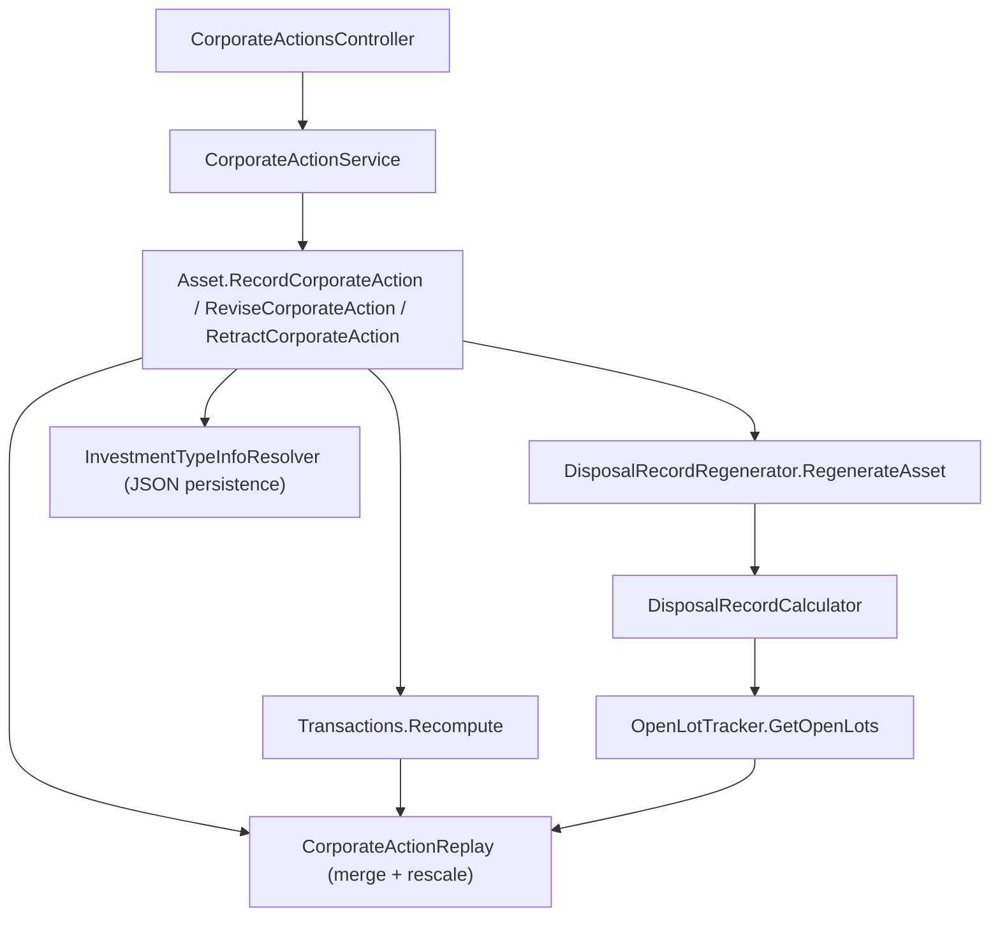

## 1. Technical Overview

**What:** Add a `CorporateAction` domain concept (initially, only the `Split` type — a single record covering both an ordinary split and a reverse split, since both are just a decimal ratio factor) that participates in the same date-ordered replay that already owns a holding's `Quantity`, `AveragePrice`, `RealizedCapitalGain` and FIFO/SpecificId open lots. Recording, editing or deleting a split re-triggers that replay the same way a transaction edit already does, and any already-existing `DisposalRecord` whose lot costs depended on a since-changed split is recomputed under the existing supersede-never-rewrite policy — no new recalculation policy, only a new replay input.

**Why:** `Transactions.Recompute()`, `OpenLotTracker.GetOpenLots(...)` and `DisposalRecordCalculator.BuildAverageCostLot(...)` are today three independent chronological replays over `IEnumerable<Transaction>`, each sorted by `TransactionReplayOrder`. A split has to be visible to all three — position, lots, and historical disposal recompute — at the same point in the timeline (before any same-day transaction), or a later sale's cost basis silently uses pre-split figures. The only way to guarantee that without duplicating the rescale logic three times is a small shared replay-ordering/rescale utility all three call sites consume.

**Scope:**
- Included: `CorporateAction` entity (Split only), the merged replay ordering/rescale rule, `Asset.RecordCorporateAction`/`ReviseCorporateAction`/`RetractCorporateAction`, wiring into `Transactions`, `OpenLotTracker`, `DisposalRecordCalculator`, `DisposalRecordRegenerator`; the Application service, DTOs, JSON persistence registration, and a `CorporateActionsController` (`POST`/`PUT /corporate-actions/split`, `DELETE /corporate-actions`).
- Excluded (later features in this PRD): Merger (F02), Spin-off (F03), the unified cross-type history/data-quality endpoint (F04), and both front ends (F05/F06) — this feature is a backend-only vertical slice, consistent with the PRD's dependency graph (F05 depends on F04, which depends on F01+F02+F03).
- Excluded (documented assumption, see §3): optimistic-concurrency/"reload and try again" conflict detection — no such mechanism exists anywhere in `Financial.Investment.*` today (ordinary transaction edits have the same gap), so this feature does not introduce one either.

## 2. Architecture Impact

**Affected components:**
- `Financial.Investment.Domain/Entities/CorporateAction.cs` — new entity
- `Financial.Investment.Domain/Rules/CorporateActionReplay.cs` — new rule (merge ordering + rescale math)
- `Financial.Investment.Domain/Entities/Transactions.cs` — modified (position replay now consumes corporate actions)
- `Financial.Investment.Domain/Rules/OpenLotTracker.cs` — modified (lot replay now consumes corporate actions)
- `Financial.Investment.Domain/Entities/Asset.cs` — modified (owns `CorporateActions`, exposes Record/Revise/Retract)
- `Financial.Investment.Domain/Rules/DisposalRecordCalculator.cs` — modified (average-cost replay branch consumes corporate actions; FIFO/SpecificId branches already inherit it via `OpenLotTracker`)
- `Financial.Investment.Domain/Rules/DisposalRecordRegenerator.cs` — modified (regeneration replay consumes corporate actions)
- `Financial.Investment.Application/Interfaces/ICorporateActionService.cs` — new
- `Financial.Investment.Application/Services/CorporateActionService.cs` — new
- `Financial.Investment.Application/DTOs/CorporateActionSplitCreateDTO.cs`, `CorporateActionSplitUpdateDTO.cs`, `CorporateActionDeleteDTO.cs` — new
- `Financial.Investment.Infrastructure/Persistence/InvestmentTypeInfoResolver.cs` — modified (register `CorporateAction` for JSON (de)serialization)
- Application/API DI registration extension method — modified (register `ICorporateActionService`)
- `Financial.Api/Controllers/CorporateActionsController.cs` — new



## 3. Technical Decisions

| Decision | Chosen Approach | Alternative Considered | Trade-off |
|---|---|---|---|
| Split vs. reverse split modeling | One `CorporateActionType.Split` value; ratio is a signed decimal factor (2.0 for 2-for-1, 0.1 for 1-for-10) exactly as PRD §6 F01 specifies | Two enum values (`Split`/`ReverseSplit`) | Fewer branches; the "N-for-M → factor" text conversion is a presentation-layer (F05/F06) concern, not a backend distinction |
| Merging corporate actions into the existing replay | New `CorporateActionReplay.Merge(transactions, corporateActions)` returns a single date-ordered sequence (corporate actions sort before same-day transactions); `Transactions.Recompute`, `OpenLotTracker.GetOpenLots`, and `DisposalRecordCalculator.BuildAverageCostLot` all iterate this merged sequence instead of `TransactionReplayOrder.Sort(transactions)` directly | Give `Transaction` and `CorporateAction` a shared interface/base type | A shared interface would touch `Transaction.cs` and every existing consumer of `Transaction`, a much larger blast radius for one feature; a small merge helper keeps the two entities independent |
| `Transactions.Add`'s incremental (non-`Recompute`) fast path | Whenever `Asset.CorporateActions` is non-empty, treat every transaction insert as needing a full `Recompute()` (skip the in-order fast path) | Teach the fast path to also check corporate-action ordering | Single-user, small-portfolio scale (per CLAUDE.md "right-sized, not over-engineered") makes the O(n) full recompute cost irrelevant; only asset with at least one recorded corporate action pays it, and only for that asset |
| Deleting a split whose rescaled lots were since consumed by a SpecificId disposal | Attempt `DisposalRecordRegenerator.RegenerateAsset` after removing the corporate action; if `DisposalRecordCalculator` throws `InvestmentRuleViolationException` (lot now has fewer open units than the historical disposal recorded), roll the corporate action back and re-throw `InvestmentRuleViolationException("Cannot delete: a later disposal depends on lots created by this split.")`, matching PRD §6 F01 Error Handling text | Pre-flight-detect the conflict before attempting the regenerate | The regenerate-and-catch path already exists (`ReviseTransaction`/`RetractTransaction` use the identical try/rollback shape) — reusing it needs no new detection logic, only a friendlier re-thrown message |
| Effective date before the holding's first transaction | No separate check — replaying up to that date naturally yields `Quantity == 0`, so it is rejected by the same zero-quantity guard PRD §6 F01 already requires | A dedicated "date before first transaction" validation | One rule covers both cases described in the PRD (they are the same condition: no open position exists yet at the effective date) |
| Optimistic-concurrency ("reload and try again") | Not implemented in this feature | Add an ETag/version field to `Asset` or `CorporateAction` | No such mechanism exists anywhere in `Financial.Investment.*` today (verified: ordinary `Transaction` add/update/delete has the same gap); introducing one only for corporate actions would be an inconsistent, unrequested new pattern. Not required by PRD §9 F01 acceptance criteria. Flagged here as an explicit assumption per spec-writer's auto-accept policy |

## 4. Component Overview

**Domain:**

| File Path | New/Modified | Purpose | Key Responsibilities |
|---|---|---|---|
| `Financial.Investment.Domain/Entities/CorporateAction.cs` | New | The corporate action record | `Id`, `Type` (`CorporateActionType.Split`), `EffectiveDate` (`DateTime`), `RatioFactor` (`decimal`), `Note` (`string?`, ≤500 chars); `CreateSplit(effectiveDate, ratioFactor, note)` and `CreateSplitWithId(id, ...)` factories validate `RatioFactor > 0 && RatioFactor != 1.0m`, throwing `ArgumentException` otherwise (mirrors `Transaction.Create`/`CreateWithId`) |
| `Financial.Investment.Domain/Rules/CorporateActionReplay.cs` | New | Merge ordering + rescale math, shared by every replay consumer | `Merge(IEnumerable<Transaction>, IEnumerable<CorporateAction>)` → ordered sequence of a private discriminated step (corporate action before same-day transaction, transactions keep existing purchases-before-sales tie-break); `RescalePosition(decimal quantity, decimal averagePrice, decimal factor)` → `(Quantity, AveragePrice)` with `Quantity × factor`, `AveragePrice ÷ factor`; `RescaleLots(IReadOnlyList<OpenLot>, decimal factor)` → new `OpenLot`s with `RemainingQuantity × factor`, `UnitCost ÷ factor` |
| `Financial.Investment.Domain/Entities/Transactions.cs` | Modified | Position (`Quantity`/`AveragePrice`) replay | `Recompute()` accepts the asset's `CorporateAction`s (new internal field set via a package-visible setter called from `Asset`) and iterates `CorporateActionReplay.Merge(...)` instead of `TransactionReplayOrder.Sort(_items)`; a corporate-action step calls `RescalePosition` instead of `Apply(Transaction)`; `Add()`'s in-order fast path falls back to `Recompute()` whenever corporate actions exist (see §3) |
| `Financial.Investment.Domain/Rules/OpenLotTracker.cs` | Modified | FIFO/SpecificId open-lot bookkeeping | `GetOpenLots` gains an overload `GetOpenLots(IEnumerable<Transaction>, IEnumerable<CorporateAction>)` that iterates the merged replay, calling `CorporateActionReplay.RescaleLots` on every currently open lot when a corporate-action step is reached; existing single-argument overload delegates to the new one with an empty corporate-action list (keeps all other call sites compiling unchanged) |
| `Financial.Investment.Domain/Entities/Asset.cs` | Modified | Aggregate root | New `_corporateActions` backing field + `IReadOnlyCollection<CorporateAction> CorporateActions`; `RecordCorporateAction(CorporateAction, CostBasisMethod, Investments?)` validates non-zero quantity at the effective date (via a preview replay), appends, re-syncs `Transactions`' corporate-action list, and calls `DisposalRecordRegenerator.RegenerateAsset` anchored at the effective date so any already-existing disposal on/after that date is recomputed under supersede; `ReviseCorporateAction(...)` and `RetractCorporateAction(Guid, ...)` mirror `ReviseTransaction`/`RetractTransaction`'s try/rollback-on-exception shape (see §3 for the delete-guard) |
| `Financial.Investment.Domain/Rules/DisposalRecordCalculator.cs` | Modified | Disposal cost-basis calculation | `Calculate(...)` and `BuildAverageCostLot(...)` gain a `precedingCorporateActions` parameter; `BuildAverageCostLot` replays through `CorporateActionReplay.Merge` instead of `TransactionReplayOrder.Sort` alone, calling `RescalePosition` on a corporate-action step; `BuildAutoConsumedLots`/`BuildSpecificIdLots` pass the corporate actions straight through to the new `OpenLotTracker.GetOpenLots` overload |
| `Financial.Investment.Domain/Rules/DisposalRecordRegenerator.cs` | Modified | Recompute existing disposals after any position-affecting edit | `ComputePlan` replays `CorporateActionReplay.Merge(asset.Transactions, asset.CorporateActions)` instead of `TransactionReplayOrder.Sort(asset.Transactions)` alone, accumulating a parallel `precedingCorporateActions` list to pass into `DisposalRecordCalculator.Calculate` for every disposing transaction encountered |

**Application:**

| File Path | New/Modified | Purpose | Key Responsibilities |
|---|---|---|---|
| `Financial.Investment.Application/Interfaces/ICorporateActionService.cs` | New | Service contract | `AddSplitAsync(CorporateActionSplitCreateDTO) → Task<AssetDetailsDTO?>`, `UpdateSplitAsync(CorporateActionSplitUpdateDTO) → Task<AssetDetailsDTO?>`, `DeleteSplitAsync(CorporateActionDeleteDTO) → Task<AssetDetailsDTO?>` |
| `Financial.Investment.Application/Services/CorporateActionService.cs` | New | Implementation | Constructor-injects `IInvestmentRepository`, `ITelemetryTracer`, `ILogger<CorporateActionService>` (same shape as `TransactionService`); each method wraps in `StartSpan(...)`/try-catch/`MarkSuccess`/`MarkFailed`, resolves broker's `CostBasisMethod` the same way `TransactionService.ResolveCostBasisMethod` does, and delegates to `AssetMutationHelper.ExecuteAssetMutationAsync` calling `asset.RecordCorporateAction`/`ReviseCorporateAction`/`RetractCorporateAction` |
| `Financial.Investment.Application/DTOs/CorporateActionSplitCreateDTO.cs` | New | Request shape | `BrokerName`, `PortfolioName`, `AssetName` (all `required string`), `EffectiveDate` (`DateTime`), `RatioFactor` (`decimal`), `Note` (`string?`) |
| `Financial.Investment.Application/DTOs/CorporateActionSplitUpdateDTO.cs` | New | Request shape | Same fields as create, plus `Id` (`Guid`) |
| `Financial.Investment.Application/DTOs/CorporateActionDeleteDTO.cs` | New | Request shape | `BrokerName`, `PortfolioName`, `AssetName`, `Id` — identical shape to `TransactionDeleteDTO`, shared by every future corporate-action type (F02/F03 delete by the same identity+Id) |

**Infrastructure / Presentation:**

| File Path | New/Modified | Purpose | Key Responsibilities |
|---|---|---|---|
| `Financial.Investment.Infrastructure/Persistence/InvestmentTypeInfoResolver.cs` | Modified | JSON (de)serialization | Add `typeof(CorporateAction)` to `ManagedTypes` so the reflection-based private-constructor/private-setter wiring applies to it, exactly as for `DisposalRecord`/`TaxClassification` |
| Application DI registration extension (`AddFinancialInvestmentApplication`, in `Financial.Investment.Application`) | Modified | DI wiring | Register `ICorporateActionService → CorporateActionService` |
| `Financial.Api/Controllers/CorporateActionsController.cs` | New | HTTP surface | `[Route("corporate-actions")]`; `POST corporate-actions/split` → `AddSplitAsync`, `PUT corporate-actions/split` → `UpdateSplitAsync`, `DELETE corporate-actions` → `DeleteSplitAsync` (generic path — F02/F03 will add their own type-specific POST/PUT actions to this same controller later); same `ApiControllerBase`/`OkOrBadRequest`/null-request-→-`BadRequest()` shape as `TransactionsController` |

## 5. API Contracts

**Endpoint: Record a Split**
- **Method:** POST
- **Path:** `/corporate-actions/split`
- **Authentication:** None (matches existing `TransactionsController` — single-user, self-hosted)

**Request:**

| Field | Type | Required | Validation | Description |
|---|---|---|---|---|
| `brokerName` | `string` | Yes | non-empty | Broker owning the holding |
| `portfolioName` | `string` | Yes | non-empty | Portfolio owning the holding |
| `assetName` | `string` | Yes | non-empty | Asset the split applies to |
| `effectiveDate` | `datetime` | Yes | — | Date the split takes effect (applied before any same-day transaction) |
| `ratioFactor` | `decimal` | Yes | `> 0` and `≠ 1.0` | 2-for-1 split = `2.0`; 1-for-10 reverse split = `0.1` |
| `note` | `string` | No | ≤ 500 chars | Free-text source reference |

**Request Example:**
```json
{
  "brokerName": "XPI",
  "portfolioName": "Main",
  "assetName": "PETR4",
  "effectiveDate": "2026-03-01T00:00:00Z",
  "ratioFactor": 2.0,
  "note": "2-for-1 split announced 2026-02-15"
}
```

**Response (Success - 200):** `AssetDetailsDTO` (existing shape — the updated asset with its new `Quantity`/`AveragePrice`).

**Error Codes:**

| Condition | HTTP Status | Description |
|---|---|---|
| `ratioFactor ≤ 0` or `== 1.0` | 400 | `ArgumentException` from `CorporateAction.CreateSplit`, mapped by `DomainExceptionMappingMiddleware` |
| Zero quantity at effective date | 409 | `InvestmentRuleViolationException`, mapped by `DomainExceptionMappingMiddleware` |
| Broker/Portfolio/Asset not found | 404 | `KeyNotFoundException`, mapped by `DomainExceptionMappingMiddleware` |
| Null request body | 400 | Controller-level null check |

**Endpoint: Update a Split**
- **Method:** PUT
- **Path:** `/corporate-actions/split`
- **Request:** same fields as create, plus `id` (`guid`, required)
- **Response/Errors:** same as create

**Endpoint: Delete a Corporate Action**
- **Method:** DELETE
- **Path:** `/corporate-actions`
- **Request:** `brokerName`, `portfolioName`, `assetName`, `id`
- **Response (Success - 200):** `AssetDetailsDTO`
- **Error Codes:** adds one condition — a later `SpecificId` disposal depends on lots this split created → 409 `InvestmentRuleViolationException` ("Cannot delete: a later disposal depends on lots created by this split.")

## 6. Data Model

No relational schema — both bounded contexts persist to a single JSON document (`data-investment.json`) loaded once at process startup, per CLAUDE.md. `CorporateAction` is a new object embedded under each `Asset`, alongside the existing `Transactions`/`DisposalRecords`/`TaxClassifications` collections, serialized via `InvestmentTypeInfoResolver`'s reflection-based private-member wiring (no attributes needed, matching `DisposalRecord`/`TaxClassification`).

**Shape (per `Asset`, JSON):**

| Field | Type | Description |
|---|---|---|
| `id` | `guid` | |
| `type` | `string` (enum) | `"Split"` (only value in this feature) |
| `effectiveDate` | `datetime` | |
| `ratioFactor` | `decimal` | |
| `note` | `string \| null` | |

No migration script — the field is simply absent (deserializes to an empty collection) on every existing `Asset` in `data-investment.json` and `data-investment.example.json` until a split is first recorded against one.

## 7. Testing Strategy

Per `testing-guide-Financial`: Domain rules and entity behavior are Unit-tested; the Application service is Unit/Integration-tested against a fake `IInvestmentRepository`; no E2E coverage in this feature (no UI yet — F05/F06 own that).

| Test File | Test Type | Target | Coverage Goal |
|---|---|---|---|
| `Tests/Financial.Investment.Domain.Tests/Domain/CorporateActionTests.cs` | Unit | `CorporateAction.CreateSplit`/`CreateSplitWithId` | 100% of validation branches |
| `Tests/Financial.Investment.Domain.Tests/Rules/CorporateActionReplayTests.cs` | Unit | `CorporateActionReplay.Merge`/`RescalePosition`/`RescaleLots` | 100% |
| `Tests/Financial.Investment.Domain.Tests/Domain/TransactionsTests.cs` | Unit | `Transactions.Recompute` with a split interleaved | Split-before-same-day-transaction ordering, average-cost-holding rescale |
| `Tests/Financial.Investment.Domain.Tests/Rules/OpenLotTrackerTests.cs` | Unit | `GetOpenLots` with a split interleaved | FIFO lot proportional rescale, total lot cost unchanged |
| `Tests/Financial.Investment.Domain.Tests/Domain/AssetCorporateActionTests.cs` | Unit | `Asset.RecordCorporateAction`/`ReviseCorporateAction`/`RetractCorporateAction` | Every PRD §9 F01 AC (2-for-1, 1-for-10 reverse, FIFO 2+ open lots, zero-quantity rejection, invalid-ratio rejection, delete-and-recompute, no `DisposalRecord` created/modified) |
| `Tests/Financial.Investment.Domain.Tests/Rules/DisposalRecordCalculatorTests.cs` | Unit | `BuildAverageCostLot`/`BuildAutoConsumedLots` with a split preceding a later disposal | A disposal after a split totals correctly against rescaled cost |
| `Tests/Financial.Investment.Domain.Tests/Rules/DisposalRecordRegeneratorTests.cs` | Unit | `RegenerateAsset` when a split is recorded/edited/deleted after an existing disposal | Existing `DisposalRecord` is superseded (never rewritten), new record reflects the split; deleting a split whose lots a `SpecificId` disposal depends on is rejected with the specific message |
| `Tests/Financial.Investment.Application.Tests/Services/CorporateActionServiceTests.cs` | Unit/Integration | `CorporateActionService.AddSplitAsync`/`UpdateSplitAsync`/`DeleteSplitAsync` | Happy path returns updated `AssetDetailsDTO`; broker/portfolio/asset-not-found returns null/throws per existing `AssetMutationHelper` contract |
| `Tests/Financial.Api.Tests/Controllers/CorporateActionsControllerTests.cs` | Integration | `CorporateActionsController` | 200 on success, 400 on null body, error-mapping for the 400/404/409 conditions above; `OpenApiContractTests` snapshot updated for the new routes |

**Acceptance-test traceability (PRD §9 F01):**
- "2-for-1 split doubles quantity, halves average price, cost basis unchanged" → `AssetCorporateActionTests`
- "1-for-10 reverse split" → `AssetCorporateActionTests`
- "same-date buy/sell applied after the split" → `TransactionsTests` + `AssetCorporateActionTests`
- "FIFO/SpecificId open lots rescaled proportionally" → `OpenLotTrackerTests` + `AssetCorporateActionTests`
- "zero-quantity holding rejected" → `AssetCorporateActionTests`
- "ratio of exactly 1.0 or ≤ 0 rejected" → `CorporateActionTests`
- "deleting a split re-triggers replay and updates quantity/average cost" → `AssetCorporateActionTests`
- "no `DisposalRecord` created or modified by recording/editing/deleting a split" → `DisposalRecordRegeneratorTests`
