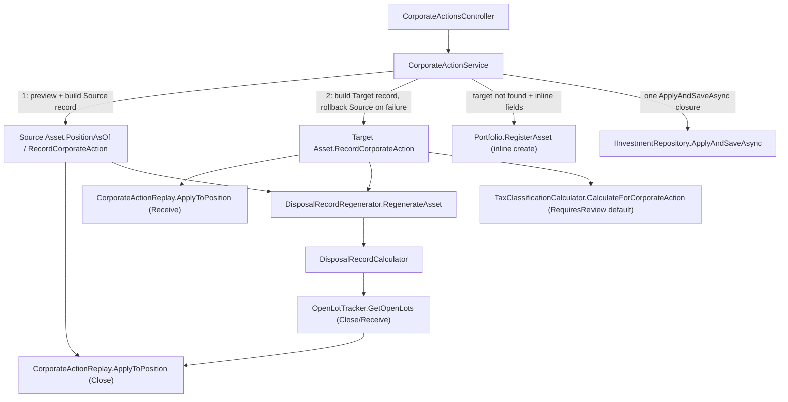

## 1. Technical Overview

**What:** Extend `CorporateAction` (today Split-only) with a second `CorporateActionType.Merger`, recorded as **two linked records** — one on the source asset (`MergerRole.Source`, the holding that closes) and one on the target asset (`MergerRole.Target`, the holding that grows) — sharing a `CorrelationId` so F04's history can show the same event on both holdings. Applying a merger is fundamentally unlike a split: it doesn't rescale one asset's position by a factor, it **closes the source's position entirely** (quantity → 0, every open lot cleared) and **carries the source's full cost basis into the target as a new lot** (quantity += received units, cost basis += carried amount). Both effects are folded into the same date-ordered replay (`CorporateActionReplay.Merge`) F01 already built, so a same-day transaction on either asset still applies after the merger, exactly as a split already does.

**Why:** `Transactions.Recompute`, `SaleCoverageRule.FindFirstUncoveredSale`, `OpenLotTracker.GetOpenLots` and `DisposalRecordCalculator.BuildAverageCostLot` all currently apply a corporate-action replay step by unconditionally calling `CorporateActionReplay.RescalePosition(..., corporateAction.RatioFactor)` — Split-shaped math hardcoded at four call sites. A merger's source-side effect (`(0, 0)`, unconditional) and target-side effect (`quantity += received, averagePrice = blended`) are different formulas entirely, and re-deriving "what does this corporate action do to a position" at four places (a fifth if `Asset.EnsureNonZeroPositionAt`'s own inline rescale is counted) would both duplicate logic and risk the four call sites drifting out of sync as more types (F03 Spin-off) are added. This feature centralizes that decision in one new `CorporateActionReplay.ApplyToPosition(quantity, averagePrice, corporateAction)` dispatcher every position-facing consumer calls instead of `RescalePosition` directly; lot bookkeeping (`OpenLotTracker`) gets the equivalent `Close`/`Receive` dispatch over its own mutable-lot representation.

**Scope:**
- Included: `CorporateActionType.Merger` + `MergerRole` on `CorporateAction`; the position/lot dispatch generalization in `CorporateActionReplay`, `Transactions`, `SaleCoverageRule`, `OpenLotTracker`, `DisposalRecordCalculator`; `Asset.PositionAsOf` (as-of-date position preview, generalized out of F01's existing zero-quantity check) and merger-aware `RecordCorporateAction`/`ReviseCorporateAction`/`RetractCorporateAction`; a new `SourceType.CorporateAction`/`EventCategory.CorporateAction` and `TaxClassificationCalculator.CalculateForCorporateAction` defaulting to `RequiresReview`; the Application-layer two-asset atomic orchestration (`AddMergerAsync`/`UpdateMergerAsync`, generalized `DeleteCorporateActionAsync`), DTOs, and the `POST`/`PUT /corporate-actions/merger` routes on the existing `CorporateActionsController`.
- Excluded (later features in this PRD): Spin-off (F03), the unified cross-type history/data-quality endpoint (F04), and both front ends (F05/F06) — backend-only vertical slice, consistent with the PRD's dependency graph.
- Excluded (documented assumption, see §3): optimistic-concurrency/"reload and try again" conflict detection — same gap F01 already left open, not introduced here either.

## 2. Architecture Impact

**Affected components:**
- `Financial.Investment.Domain/Entities/CorporateAction.cs` — modified (adds `Merger` type, `MergerRole`, and the merger-specific fields; `RatioFactor` becomes nullable)
- `Financial.Investment.Domain/Rules/CorporateActionReplay.cs` — modified (adds `ApplyToPosition` dispatcher and the close/receive math)
- `Financial.Investment.Domain/Entities/Transactions.cs` — modified (`Recompute` calls the new dispatcher instead of `RescalePosition` directly)
- `Financial.Investment.Domain/Rules/SaleCoverageRule.cs` — modified (same dispatch change; this call site was not enumerated by F01's spec but does the identical inline `RescalePosition` call and needs the identical fix)
- `Financial.Investment.Domain/Rules/OpenLotTracker.cs` — modified (lot replay gains `Close`/`Receive` alongside the existing `Rescale`)
- `Financial.Investment.Domain/Rules/DisposalRecordCalculator.cs` — modified (`BuildAverageCostLot`'s replay branch calls the new dispatcher; `BuildAutoConsumedLots`/`BuildSpecificIdLots` are unaffected — they already delegate lot state entirely to `OpenLotTracker.GetOpenLots`)
- `Financial.Investment.Domain/Entities/Asset.cs` — modified (new `PositionAsOf`; `RecordCorporateAction`/`ReviseCorporateAction`/`RetractCorporateAction` become merger-aware; `EnsureNonZeroPositionAt`'s replay loop is generalized into `PositionAsOf`)
- `Financial.Investment.Domain/Entities/TaxClassification.cs` — modified (`CreateForCorporateAction` factory)
- `Financial.Investment.Domain/Rules/TaxClassificationCalculator.cs` — modified (`CalculateForCorporateAction`, `RequiresReview`-by-default)
- `Financial.Investment.Domain/Entities/SourceType.cs` — modified (adds `CorporateAction`)
- `Financial.Investment.Domain/Entities/EventCategory.cs` — modified (adds `CorporateAction`)
- `Financial.Investment.Application/Interfaces/ICorporateActionService.cs` — modified (`AddMergerAsync`, `UpdateMergerAsync`; `DeleteSplitAsync` renamed `DeleteCorporateActionAsync`)
- `Financial.Investment.Application/Services/CorporateActionService.cs` — modified (two-asset atomic orchestration, target inline-create, type-dispatching delete)
- `Financial.Investment.Application/DTOs/CorporateActionMergerCreateDTO.cs`, `CorporateActionMergerUpdateDTO.cs`, `CorporateActionMergerResultDTO.cs` — new
- `Financial.Api/Controllers/CorporateActionsController.cs` — modified (`POST`/`PUT corporate-actions/merger`; delete route unchanged, now backed by the renamed service method)
- `Financial.Investment.Infrastructure/Persistence/InvestmentTypeInfoResolver.cs` — **not modified**: `CorporateAction` is already a registered managed type from F01, and no new top-level type is introduced (`MergerRole` is a plain enum, which the resolver never special-cases, matching every other enum in this bounded context)



## 3. Technical Decisions

| Decision | Chosen Approach | Alternative Considered | Trade-off |
|---|---|---|---|
| Cross-asset modeling | Two linked `CorporateAction` records — `MergerRole.Source` on the source asset, `MergerRole.Target` on the target asset — sharing a `CorrelationId` (`Guid`) and each other's asset name via `LinkedAssetName` | A single record referencing both assets, stored on one of them | `Asset.CorporateActions` is a per-asset collection (like `DisposalRecords`/`TaxClassifications`); a single cross-asset record would be invisible from the other asset's own history/JSON subtree, breaking PRD F04's "appears in both holdings' history" and the JSON document's existing "everything about an asset nests under that asset" shape. Two linked records need no schema change to that shape |
| Extending `CorporateAction`'s shape | Same flat class, more nullable fields (`Role`, `CorrelationId`, `LinkedAssetName`, `ExchangeRatio`, `CashInLieu`, `ConvertedQuantity`, `CarriedCostBasis`), gated by `Type`/`Role` | A `CorporateAction` base type with `Split`/`Merger` subclasses | `Transaction` already uses exactly this flat-class-plus-type-enum shape for 8 very different transaction types; `InvestmentTypeInfoResolver`'s reflection-based (de)serialization has no polymorphic/`JsonDerivedType` support today, so subclassing would need new Infrastructure work this feature doesn't otherwise require |
| Source-side application math | Not `RescalePosition` with a factor — a merger doesn't rescale, it unconditionally closes: `(Quantity, AveragePrice) → (0, 0)`, lots cleared entirely (not rescaled by a factor of 0, which would divide `UnitCost` by zero) | Represent closure as `RescalePosition(..., factor: 0)` | Factor-0 rescale is mathematically undefined for `UnitCost ÷ factor`; closure needs its own case, which is also clearer to read at the call site than a magic zero factor |
| Target-side application math | New `ReceiveMerger(quantity, averagePrice, receivedQuantity, carriedCostBasis)`: `resultingQuantity = quantity + receivedQuantity`; `averagePrice = resultingQuantity == 0 ? 0 : (averagePrice × quantity + carriedCostBasis) ÷ resultingQuantity` — same blended-average shape `AverageCostReplay.Apply` already uses for a Buy, expressed over raw values instead of a `Transaction` | Synthesize a fake `Transaction` (a "Buy" at an implied unit price) and reuse `AverageCostReplay.Apply` directly | A synthetic transaction would leak into `Transactions`' own collection or require a parallel non-persisted list, and misrepresents the merger as an ordinary purchase in any code that inspects `TransactionType` |
| Where `ApplyToPosition` dispatch lives | One new `CorporateActionReplay.ApplyToPosition(decimal, decimal, CorporateAction)` switches on `Type`/`Role`; every position-facing consumer (`Transactions.Recompute`, `SaleCoverageRule.FindFirstUncoveredSale`, `DisposalRecordCalculator.BuildAverageCostLot`, `Asset.PositionAsOf`) calls it instead of inlining `RescalePosition` | Leave each of the four call sites with its own inline switch | The four call sites already independently duplicated the exact same `RescalePosition(...)` call for Split; centralizing avoids a fifth (F03) duplication and the drift risk of one call site being missed during Merger's rollout — confirmed by finding `SaleCoverageRule` doing this inline, which F01's own spec did not enumerate |
| Lot bookkeeping for the merger-created lot | The target's new lot's `SourceTransactionId` is the `Merger`/`Target` `CorporateAction`'s own `Id` | Add a separate `SourceCorporateActionId` field to `OpenLot`/`DisposalLotConsumption` | `SourceTransactionId` is a bare `Guid` with no FK constraint to `Transaction` (confirmed: `OpenLot`/`DisposalLotConsumption` never navigate back to a `Transaction` object, only carry the id) — reusing it needs no schema change and lets a later `SpecificId` disposal on the target reference this lot exactly like any transaction-sourced one |
| Source/target broker & portfolio scope | Target asset must be in the **same** Broker + Portfolio as the source | Allow a cross-portfolio/cross-broker target, addressed by its own broker/portfolio names | `IInvestmentRepository.GetAsset`/`ApplyAndSaveAsync` have no concept of "resolve two arbitrary broker/portfolio/asset triples atomically" — same-portfolio keeps the existing single-broker-list lookup pattern (`AssetMutationHelper`) reusable and matches the real-world case (a broker converts a holding into another holding in the same account); a genuine cross-portfolio merger is rare enough to defer, consistent with "right-sized, not over-engineered" |
| Target asset resolution | Explicit `CreateTargetAssetInline` flag on the request DTO: `true` requires the identity fields and creates via `Asset.Create` + `Portfolio.RegisterAsset` inside the same `ApplyAndSaveAsync` closure as the merger itself; `false` looks up `TargetAssetName` and 404s if absent | Implicit "look up, fall back to create if identity fields are present" | An explicit flag matches the UI's own "search vs. create" tab state (per PRD F05) and avoids silently creating a new asset from a misspelled existing name |
| Atomic two-asset write | `CorporateActionService.AddMergerAsync` composes two already-rollback-safe single-asset calls (`source.RecordCorporateAction`, then `target.RecordCorporateAction`) inside one `ApplyAndSaveAsync` closure, with an outer `try/catch` that retracts the source's record if the target step throws | A new `Asset`-spanning transactional primitive in `IInvestmentRepository` | `ApplyAndSaveAsync`'s single synchronous closure already gives exclusive, all-or-nothing persistence (confirmed: it takes an arbitrary closure, not one scoped to a single asset); composing the existing per-asset rollback-on-exception shape (already used by `RecordCorporateAction`/`ReviseCorporateAction`/`RetractCorporateAction` for Split) at the orchestration level needs no new Domain-level transaction concept |
| Where the linked `TaxClassification` lives | Created against the **target**'s `Merger`/`Target` record, stored in the target asset's `TaxClassifications` (`SourceType.CorporateAction`, `SourceId` = the target record's `Id`) | Attach it to the source, or to both | The target is where the carried-over cost basis lands and where a future disposal's tax treatment actually depends on this event's classification; the source asset is fully closed going forward, so there is nothing left to review there. Mirrors how a `Credit`'s `TaxClassification` lives on the same asset as the `Credit` itself |
| Jurisdiction for the merger's `TaxClassification` | Resolved from the **source broker**'s `Currency` (parsed via the existing `EnumParser.TryParseEnum<Currency>`, same idiom `FxEntryCaptureHelper`/`SummaryService` already use), then `Jurisdiction` via the existing `BRL → BR, else → UK` rule | Derive from the target broker's currency, or require the caller to supply a `Jurisdiction` directly | `CorporateAction` carries no `Currency` of its own (unlike `Transaction`/`Credit`); the source broker's currency is the one driving the event ("my broker converted my holding"), consistent with how a disposal's jurisdiction is driven by the transaction that triggered it, not an unrelated account |
| Default tax status when no rule matches | `CalculationStatus.RequiresReview` (already exists in the enum — used today by `CalculateForCredit`'s `Unrecognized` branch) rather than `Incomplete` | Reuse `Incomplete`, matching `CalculateForDisposal`/most of `CalculateForCredit` | PRD §6 F02 explicitly requires `RequiresReview` as the default, distinct from `Incomplete`'s "recognized category, just no rule yet" meaning — a merger's tax treatment is inherently uncertain (carryover vs. taxable), not merely unrated |
| `RecordCorporateAction`/`ReviseCorporateAction` signature | Extended with an optional `Currency? brokerCurrency = null` parameter (used only by the `Merger`/`Target` branch to build the `TaxClassification`), rather than adding new merger-specific public methods | Add `RecordMergerSource`/`RecordMergerTarget` (and Revise/Retract equivalents) as separate public methods | Keeps `Asset`'s public surface at the same three methods F01 already shipped; the zero-quantity check already only applies conditionally (`Split` and `Merger`/`Source`, never `Merger`/`Target`, since a brand-new target asset legitimately starts at zero) |
| Delete endpoint reuse | `DELETE /corporate-actions` is unchanged (still generic-by-id, confirmed by reading `CorporateActionsController`); `ICorporateActionService.DeleteSplitAsync` is renamed `DeleteCorporateActionAsync` and now inspects the found action's `Type` to dispatch single-asset (Split) vs. two-asset (Merger, removing both linked records) retraction | Add a separate `DeleteMergerAsync` and have the controller branch | The route and DTO were already type-agnostic; branching inside the service (which can cheaply read the action's `Type` after the existing `GetAsset` lookup) keeps that generic contract honest instead of leaking a type distinction into the controller |
| Optimistic-concurrency ("reload and try again") | Not implemented, same as F01 | Add version/ETag tracking | No such mechanism exists anywhere in `Financial.Investment.*` today; introducing one only for Merger would be inconsistent and unrequested by PRD §9 |

## 4. Component Overview

**Domain:**

| File Path | New/Modified | Purpose | Key Responsibilities |
|---|---|---|---|
| `Financial.Investment.Domain/Entities/CorporateAction.cs` | Modified | The corporate action record | Adds `CorporateActionType.Merger` and nested `enum MergerRole { Source, Target }`; new nullable fields `Role`, `CorrelationId`, `LinkedAssetName`, `ExchangeRatio`, `CashInLieu`, `ConvertedQuantity`, `CarriedCostBasis`; `RatioFactor` becomes `decimal?` (Split-only now); `CreateMergerSource(effectiveDate, exchangeRatio, cashInLieu, note, correlationId, linkedAssetName, convertedQuantity, carriedCostBasis)` validates `exchangeRatio > 0` and `cashInLieu >= 0` when present (no "≠ 1.0" rule — a 1:1 merger is valid, unlike a split); `CreateMergerTarget(effectiveDate, note, correlationId, linkedAssetName, convertedQuantity, carriedCostBasis)`; `...WithId` variants for both, mirroring `CreateSplitWithId` |
| `Financial.Investment.Domain/Rules/CorporateActionReplay.cs` | Modified | Merge ordering + position/lot math dispatch | New `ApplyToPosition(decimal quantity, decimal averagePrice, CorporateAction action)` switches on `action.Type`/`action.Role`: `Split` → existing `RescalePosition`; `Merger`/`Source` → `(0m, 0m)`; `Merger`/`Target` → new `ReceiveMerger(quantity, averagePrice, action.ConvertedQuantity!.Value, action.CarriedCostBasis!.Value)` (blended-average math, see §3); `Merge`'s same-day ordering (corporate action before same-day transaction) is unchanged — already type-agnostic |
| `Financial.Investment.Domain/Entities/Transactions.cs` | Modified | Position (`Quantity`/`AveragePrice`) replay | `Recompute()`'s corporate-action branch calls `CorporateActionReplay.ApplyToPosition(...)` instead of `RescalePosition(...)` directly |
| `Financial.Investment.Domain/Rules/SaleCoverageRule.cs` | Modified | Pre-mutation "would this leave a sale uncovered" check | Same swap: `FindFirstUncoveredSale`'s corporate-action branch calls `ApplyToPosition` instead of its own inline `RescalePosition` call, so a same-day sale validated against a source asset mid-merger sees the post-close (zero) quantity, and against a target sees the post-receive quantity |
| `Financial.Investment.Domain/Rules/OpenLotTracker.cs` | Modified | FIFO/SpecificId open-lot bookkeeping | `GetOpenLots`'s corporate-action branch dispatches on `Type`/`Role`: `Split` → existing `Rescale`; `Merger`/`Source` → `lots.Clear()`; `Merger`/`Target` → appends one new `MutableLot` (`SourceTransactionId = action.Id`, `RemainingQuantity = action.ConvertedQuantity`, `UnitCost = action.CarriedCostBasis / action.ConvertedQuantity`) |
| `Financial.Investment.Domain/Rules/DisposalRecordCalculator.cs` | Modified | Disposal cost-basis calculation | `BuildAverageCostLot`'s replay branch calls `ApplyToPosition` instead of `RescalePosition`; `BuildAutoConsumedLots`/`BuildSpecificIdLots` need no change — they already delegate entirely to `OpenLotTracker.GetOpenLots` |
| `Financial.Investment.Domain/Entities/Asset.cs` | Modified | Aggregate root | New `PositionAsOf(DateTime effectiveDate)` (generalizes the replay-and-stop loop F01's `EnsureNonZeroPositionAt` already has into a reusable, publicly callable as-of-date `(Quantity, AveragePrice)` preview — used by the Application service to compute a merger's `ConvertedQuantity`/`CarriedCostBasis` before constructing the source record); `RecordCorporateAction`/`ReviseCorporateAction` gain an optional `Currency? brokerCurrency` parameter, run the zero-quantity guard only for `Split`/`Merger`-`Source`, and — for `Merger`/`Target` — additionally call `TaxClassificationCalculator.CalculateForCorporateAction` and append the result; `RetractCorporateAction`, when retracting a `Merger`/`Target` record, supersedes its linked `TaxClassification` via the existing `SupersedeTaxClassificationBySource` |
| `Financial.Investment.Domain/Entities/TaxClassification.cs` | Modified | Tax classification record | New `CreateForCorporateAction(corporateActionId, jurisdiction, taxYear, costBasis, calculationStatus, taxRuleId)` factory — `Proceeds`/`GainLoss`/`GrossAmount`/`WithheldAmount`/`NetAmount` all `null` (no disposal, no recognised gain); `CostBasis` set to the carried amount for informational display |
| `Financial.Investment.Domain/Rules/TaxClassificationCalculator.cs` | Modified | Tax classification derivation | New `CalculateForCorporateAction(CorporateAction targetRecord, Currency currency, Investments investments)`: jurisdiction via existing `ForCurrency`; looks up a `TaxRule` for `(jurisdiction, EventCategory.CorporateAction, effectiveDate)`; status `Final` when a rule matches, **`RequiresReview`** otherwise (not `Incomplete` — see §3) |
| `Financial.Investment.Domain/Entities/SourceType.cs` | Modified | Tax-classification source discriminator | Adds `CorporateAction` |
| `Financial.Investment.Domain/Entities/EventCategory.cs` | Modified | Tax-rule matching category | Adds `CorporateAction` |

**Application:**

| File Path | New/Modified | Purpose | Key Responsibilities |
|---|---|---|---|
| `Financial.Investment.Application/Interfaces/ICorporateActionService.cs` | Modified | Service contract | Adds `AddMergerAsync(CorporateActionMergerCreateDTO) → Task<CorporateActionMergerResultDTO?>`, `UpdateMergerAsync(CorporateActionMergerUpdateDTO) → Task<CorporateActionMergerResultDTO?>`; `DeleteSplitAsync` renamed `DeleteCorporateActionAsync(CorporateActionDeleteDTO) → Task<AssetDetailsDTO?>` |
| `Financial.Investment.Application/Services/CorporateActionService.cs` | Modified | Implementation | `AddMergerAsync`: one `ApplyAndSaveAsync` closure that (1) resolves the source asset and broker currency, (2) resolves/creates the target asset (inline `Asset.Create` + `Portfolio.RegisterAsset` when `CreateTargetAssetInline`), (3) reads `source.PositionAsOf(effectiveDate)`, builds and records the `Merger`/`Source` record on the source, (4) builds and records the linked `Merger`/`Target` record on the target (passing the resolved `Currency`), rolling the source record back if step 4 throws; `UpdateMergerAsync` locates both linked records by `CorrelationId`, retracts-and-re-records both under the same rollback discipline; `DeleteCorporateActionAsync` looks up the action by id, dispatches to the existing single-asset retraction for `Split`, or locates and retracts both linked records (via `CorrelationId`/`LinkedAssetName`) for `Merger` |
| `Financial.Investment.Application/DTOs/CorporateActionMergerCreateDTO.cs` | New | Request shape | `BrokerName`, `PortfolioName`, `SourceAssetName` (required), `EffectiveDate`, `ExchangeRatio` (`decimal`), `CashInLieuAmount` (`decimal?`), `Note` (`string?`), `TargetAssetName` (required), `CreateTargetAssetInline` (`bool`), `TargetISIN`/`TargetExchange`/`TargetTicker`/`TargetCountry`/`TargetLocalTypeCode`/`TargetClass` (all nullable, used only when `CreateTargetAssetInline`) |
| `Financial.Investment.Application/DTOs/CorporateActionMergerUpdateDTO.cs` | New | Request shape | Same identity/editable fields as create (`BrokerName`, `PortfolioName`, `SourceAssetName`, `EffectiveDate`, `ExchangeRatio`, `CashInLieuAmount`, `Note`), plus `Id` (the source/`MergerRole.Source` record's id) — target linkage (`TargetAssetName` and the inline-create fields) is immutable after creation, consistent with Split's edit scope (F01 never lets an edit move a split to a different asset either) |
| `Financial.Investment.Application/DTOs/CorporateActionMergerResultDTO.cs` | New | Response shape | `Source` and `Target`, both `AssetDetailsDTO?` — lets the caller update both affected holdings from one response, per PRD F02 Experience ("both...holdings reflect the change immediately") |

**Infrastructure / Presentation:**

| File Path | New/Modified | Purpose | Key Responsibilities |
|---|---|---|---|
| `Financial.Api/Controllers/CorporateActionsController.cs` | Modified | HTTP surface | `[HttpPost("merger")]`/`[HttpPut("merger")]` → `AddMergerAsync`/`UpdateMergerAsync`, returning `CorporateActionMergerResultDTO`; existing `DELETE /corporate-actions` unchanged at the route/DTO level, now calls the renamed `DeleteCorporateActionAsync` |

## 5. API Contracts

**Endpoint: Record a Merger**
- **Method:** POST
- **Path:** `/corporate-actions/merger`
- **Authentication:** None (matches existing controller — single-user, self-hosted)

**Request:**

| Field | Type | Required | Validation | Description |
|---|---|---|---|---|
| `brokerName` | `string` | Yes | non-empty | Broker owning both the source and target holdings |
| `portfolioName` | `string` | Yes | non-empty | Portfolio owning both holdings |
| `sourceAssetName` | `string` | Yes | non-empty, must exist | The holding being converted |
| `effectiveDate` | `datetime` | Yes | — | Date the merger takes effect (applied before any same-day transaction on either asset) |
| `exchangeRatio` | `decimal` | Yes | `> 0` | Units of target received per unit of source |
| `cashInLieuAmount` | `decimal` | No | `≥ 0` | Note-only; never becomes a `DisposalRecord` |
| `note` | `string` | No | ≤ 500 chars | Free-text source reference, copied to both linked records |
| `targetAssetName` | `string` | Yes | non-empty | Existing asset name, or the name to create inline |
| `createTargetAssetInline` | `bool` | Yes | — | `true` creates a new asset from the identity fields below; `false` requires an existing asset by that name in the same portfolio |
| `targetISIN`, `targetExchange`, `targetTicker`, `targetCountry`, `targetLocalTypeCode`, `targetClass` | mixed | Only when `createTargetAssetInline` | Same fields/validation as `AssetAdminCreateDTO` | `targetClass` left null auto-resolves via `GlobalAssetClassMapping`, same as Add Asset |

**Request Example:**
```json
{
  "brokerName": "Trading212",
  "portfolioName": "Main",
  "sourceAssetName": "TWTR",
  "effectiveDate": "2026-04-01T00:00:00Z",
  "exchangeRatio": 0.5,
  "cashInLieuAmount": 3.25,
  "note": "Acquisition completed 2026-04-01",
  "targetAssetName": "XCORP",
  "createTargetAssetInline": true,
  "targetISIN": "US00000X1234",
  "targetExchange": "NASDAQ",
  "targetTicker": "XCORP",
  "targetCountry": "US",
  "targetLocalTypeCode": "COMMON"
}
```

**Response (Success - 200):** `CorporateActionMergerResultDTO` — `{ "source": AssetDetailsDTO, "target": AssetDetailsDTO }`, both reflecting the post-merger position.

**Error Codes:**

| Condition | HTTP Status | Description |
|---|---|---|
| `exchangeRatio ≤ 0` | 400 | `ArgumentException` from `CorporateAction.CreateMergerSource`, mapped by `DomainExceptionMappingMiddleware` |
| `cashInLieuAmount < 0` | 400 | Same |
| Source holding has zero quantity at effective date | 409 | `InvestmentRuleViolationException` |
| Target name collides with an existing distinct asset (`createTargetAssetInline: true`) | 409 | `InvestmentRuleViolationException` from `Portfolio.RegisterAsset` |
| Target asset not found (`createTargetAssetInline: false`) | 404 | `KeyNotFoundException` |
| Source broker/portfolio/asset not found | 404 | `KeyNotFoundException` |
| Null request body | 400 | Controller-level null check |

**Endpoint: Update a Merger**
- **Method:** PUT
- **Path:** `/corporate-actions/merger`
- **Request:** `id` (the source record's id) plus `brokerName`, `portfolioName`, `sourceAssetName`, `effectiveDate`, `exchangeRatio`, `cashInLieuAmount`, `note` — target linkage is immutable
- **Response/Errors:** same as create

**Endpoint: Delete a Corporate Action** (unchanged route, generalized behavior)
- **Method:** DELETE
- **Path:** `/corporate-actions`
- **Request:** `brokerName`, `portfolioName`, `assetName`, `id` — unchanged shape; for a merger, `assetName`/`id` may name either the source or the target record, and both linked records are retracted together
- **Response (Success - 200):** `AssetDetailsDTO` for the named asset only (the other asset's updated state is not included in this response — the caller re-fetches it via the existing asset-details endpoint, keeping this shared endpoint's contract unchanged for Split)

## 6. Data Model

No relational schema — both bounded contexts persist to a single JSON document, per CLAUDE.md. `CorporateAction`'s shape (already an embedded object under each `Asset` since F01) grows new nullable fields, all absent/`null` for existing `Split` records.

**Shape (per `Asset`, JSON, new/changed fields only):**

| Field | Type | Description |
|---|---|---|
| `type` | `string` (enum) | `"Split"` or `"Merger"` |
| `ratioFactor` | `decimal \| null` | `Split` only (was non-nullable in F01; now `null` for `Merger`) |
| `role` | `string` (enum) `\| null` | `"Source"` or `"Target"`; `null` for `Split` |
| `correlationId` | `guid \| null` | Shared by the `Source`/`Target` sibling pair; `null` for `Split` |
| `linkedAssetName` | `string \| null` | The other asset's name; `null` for `Split` |
| `exchangeRatio` | `decimal \| null` | `Merger`/`Source` only |
| `cashInLieu` | `decimal \| null` | `Merger`/`Source` only, optional |
| `convertedQuantity` | `decimal \| null` | `Merger` only — quantity closed (`Source`) or received (`Target`) |
| `carriedCostBasis` | `decimal \| null` | `Merger` only — cost basis carried out (`Source`) or in (`Target`) |

`TaxClassification`'s existing shape is unchanged; a corporate-action-sourced row simply uses `sourceType: "CorporateAction"` and `eventCategory: "CorporateAction"`, both new enum members serialized the same way every existing enum on this type already is.

No migration script — new fields deserialize to their default (`null`/absent) on every existing `Split` record in `data-investment.json` and `data-investment.example.json`.

## 7. Testing Strategy

Per `testing-guide-Financial`: Domain rules and entity behavior are Unit-tested; the Application service is Unit/Integration-tested against a fake `IInvestmentRepository`; acceptance tests trace PRD §9 F02 ACs against the real HTTP pipeline; no E2E coverage in this feature (F05/F06 own the UI).

| Test File | Test Type | Target | Coverage Goal |
|---|---|---|---|
| `Tests/Financial.Investment.Domain.Tests/Domain/CorporateActionTests.cs` | Unit | `CreateMergerSource`/`CreateMergerTarget` validation | Exchange ratio ≤ 0 rejected, no "≠ 1.0" rejection (unlike Split), cash-in-lieu < 0 rejected, note length |
| `Tests/Financial.Investment.Domain.Tests/Rules/CorporateActionReplayTests.cs` | Unit | `ApplyToPosition` for `Merger`/`Source` and `Merger`/`Target` | Source closes to `(0, 0)` regardless of incoming position; target's blended average matches a hand-computed `AverageCostReplay`-equivalent result |
| `Tests/Financial.Investment.Domain.Tests/Rules/OpenLotTrackerTests.cs` | Unit | `GetOpenLots` with a merger interleaved | Source's open lots are cleared entirely (not rescaled); target gains exactly one new lot at the carried unit cost |
| `Tests/Financial.Investment.Domain.Tests/Rules/SaleCoverageRuleTests.cs` | Unit | `FindFirstUncoveredSale` with a merger interleaved | A same-day sale on the source after its merger is rejected as uncovered (position is already zero) |
| `Tests/Financial.Investment.Domain.Tests/Domain/AssetCorporateActionTests.cs` | Unit | `Asset.PositionAsOf`, merger-aware `RecordCorporateAction`/`ReviseCorporateAction`/`RetractCorporateAction` | Every PRD §9 F02 AC: source zeroes and closes lots; target gains `source qty × ratio` and carried cost basis; zero-quantity source rejected; `TaxClassification` created with `RequiresReview` when no `TaxRule` matches; retracting a `Merger`/`Target` record supersedes its linked classification |
| `Tests/Financial.Investment.Domain.Tests/Rules/TaxClassificationCalculatorTests.cs` | Unit | `CalculateForCorporateAction` | `RequiresReview` default; `Final` when a matching `TaxRule` exists; jurisdiction derived from the supplied `Currency` |
| `Tests/Financial.Investment.Application.Tests/Services/CorporateActionServiceTests.cs` | Unit/Integration | `AddMergerAsync`/`UpdateMergerAsync`/`DeleteCorporateActionAsync` | Inline target creation happy path; target-name-collision rejection; atomic rollback when the target-side step throws (source record left absent, not orphaned); delete removes both linked records for a merger, only the named record for a split |
| `Tests/Financial.Api.Tests/Controllers/CorporateActionsControllerTests.cs` | Integration | `CorporateActionsController` merger routes | 200 on success returning both assets, 400 on null body / invalid ratio, 404/409 error-mapping; `OpenApiContractTests` snapshot updated for the new routes and DTOs |
| `Tests/Financial.Api.Tests/Acceptance/CorporateActionMergerAcceptanceTests.cs` | Acceptance | End-to-end HTTP, one test per PRD §9 F02 AC | Mirrors `CorporateActionSplitAcceptanceTests`' shape; each test `[Trait("AC", "P53-F02-merger-0N")]` |

**Acceptance-test traceability (PRD §9 F02):**
- "Merger reduces source quantity to zero and closes all open lots" → `CorporateActionMergerAcceptanceTests` + `AssetCorporateActionTests`
- "Target quantity increases by source qty × ratio, cost basis by source's full cost basis" → `CorporateActionMergerAcceptanceTests` + `AssetCorporateActionTests`
- "Create-inline for a non-existent target creates it and links the merger" → `CorporateActionMergerAcceptanceTests` + `CorporateActionServiceTests`
- "Target name collision rejected" → `CorporateActionMergerAcceptanceTests` + `CorporateActionServiceTests`
- "No `DisposalRecord` for the converted portion" → `CorporateActionMergerAcceptanceTests`
- "`TaxClassification` created with `RequiresReview` when no `TaxRule` matches" → `CorporateActionMergerAcceptanceTests` + `TaxClassificationCalculatorTests`
- "Pre-existing source `DisposalRecord` left byte-identical" → `CorporateActionMergerAcceptanceTests`
- "Cash-in-lieu stored, no `DisposalRecord`" → `CorporateActionMergerAcceptanceTests`
