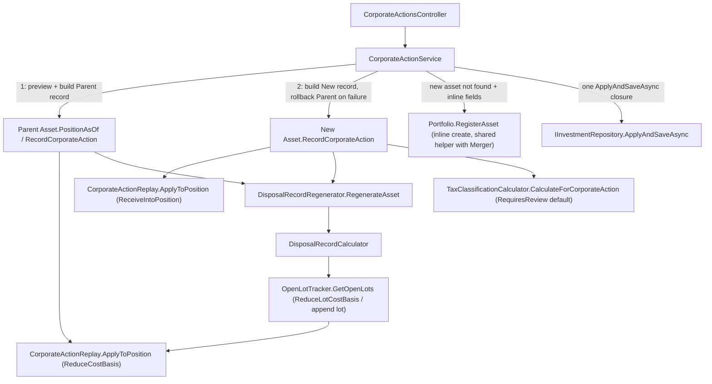

## 1. Technical Overview

**What:** Extend `CorporateAction` (today `Split` and `Merger`) with a third `CorporateActionType.SpinOff`, recorded as **two linked records** — one on the parent asset (`CorporateActionRole.Parent`, the holding that stays open) and one on the new asset (`CorporateActionRole.New`, the holding that receives the spun-off shares) — sharing a `CorrelationId`, the same linking shape F02's Merger already established. Applying a spin-off is unlike either existing type: it doesn't rescale a position by a factor (Split), and it doesn't close one side while fully carrying cost basis to the other (Merger). Instead **both sides stay open**: the parent's quantity is untouched and only its cost basis shrinks by a user-entered percentage; the new asset receives a user-entered quantity at a unit cost derived from that same percentage. Both effects are folded into the same date-ordered replay (`CorporateActionReplay.Merge`/`ApplyToPosition`) F01/F02 already built, so a same-day transaction on either asset still applies after the spin-off, exactly as a split or merger already does.

**Why:** F02 already centralized "what does this corporate action do to a position/to the open lots" into two single dispatch points — `CorporateActionReplay.ApplyToPosition` and `OpenLotTracker`'s per-type switch — specifically so a third type would only need two new `case` arms, not a third re-derivation across `Transactions.Recompute`, `SaleCoverageRule.FindFirstUncoveredSale`, `DisposalRecordCalculator.BuildAverageCostLot` and `DisposalRecordRegenerator.ComputePlan`. Reading all four of those call sites confirms this worked exactly as intended: none of them branch on `CorporateActionType` themselves anymore, they only call the two dispatchers. This feature is therefore, structurally, an extension of two switch statements plus the aggregate-level orchestration Merger already proved out (two linked records, one atomic two-asset write, tax classification on the "new" side) — not a new pipeline.

**Scope:**
- Included: `CorporateActionType.SpinOff` + the `Role` enum generalized from `MergerRole` to `CorporateActionRole` (`Source`, `Target`, `Parent`, `New`) on `CorporateAction`; a new `AllocationPercentage` field; the two new `ApplyToPosition`/`OpenLotTracker` dispatch cases; `TaxClassificationCalculator.CalculateForCorporateAction`'s guard relaxed to accept `SpinOff`/`New` alongside `Merger`/`Target`; `Asset`'s merger-tax-classification hook generalized to fire for either linked "receiving" role; the Application-layer two-asset atomic orchestration (`AddSpinOffAsync`/`UpdateSpinOffAsync`), a DTO-agnostic extraction of Merger's inline-target-asset-creation helper so Spin-off reuses it instead of duplicating it, and the `POST`/`PUT /corporate-actions/spin-off` routes on the existing `CorporateActionsController`.
- Excluded (later features in this PRD): the unified cross-type history/data-quality endpoint (F04) and both front ends (F05/F06) — backend-only vertical slice, consistent with the PRD's dependency graph (F01/F02/F03 are all Wave 1, F04 is Wave 2).
- Excluded (documented assumption, see §3): optimistic-concurrency/"reload and try again" conflict detection — same gap F01 and F02 already left open, not introduced here either.
- Not required (verified by reading the current code, not assumed): no change to `Transactions.cs`, `SaleCoverageRule.cs`, `DisposalRecordCalculator.cs`, or `DisposalRecordRegenerator.cs` — all four already dispatch through the generic `ApplyToPosition`/`OpenLotTracker.GetOpenLots` entry points F02 built, with no `CorporateActionType`-specific branching of their own left to extend.

## 2. Architecture Impact

**Affected components:**
- `Financial.Investment.Domain/Entities/CorporateAction.cs` — modified (adds `SpinOff` type; renames `MergerRole` to `CorporateActionRole` with two new members `Parent`/`New`; adds `AllocationPercentage`; adds `CreateSpinOffParent`/`CreateSpinOffNew` + `WithId` variants)
- `Financial.Investment.Domain/Rules/CorporateActionReplay.cs` — modified (`ApplyToPosition` gains `SpinOff`/`Parent` and `SpinOff`/`New` cases; `ReceiveMerger` renamed `ReceiveIntoPosition` and reused by both `Merger`/`Target` and `SpinOff`/`New`)
- `Financial.Investment.Domain/Rules/OpenLotTracker.cs` — modified (`ApplyCorporateAction` gains `SpinOff`/`Parent` (proportional unit-cost reduction, quantity untouched) and `SpinOff`/`New` (append one lot — extracted into a helper shared with `Merger`/`Target`'s identical append))
- `Financial.Investment.Domain/Entities/Asset.cs` — modified (the private merger-tax-classification predicates/helpers generalize to any "receiving" role — `Merger`/`Target` or `SpinOff`/`New`; `RetractCorporateAction`'s delete-guard message gains a third branch)
- `Financial.Investment.Domain/Rules/TaxClassificationCalculator.cs` — modified (`CalculateForCorporateAction`'s guard accepts `SpinOff`/`New` alongside `Merger`/`Target`; reuses the existing `EventCategory.CorporateAction` — no new category)
- `Financial.Investment.Application/Interfaces/ICorporateActionService.cs` — modified (`AddSpinOffAsync`, `UpdateSpinOffAsync`)
- `Financial.Investment.Application/Services/CorporateActionService.cs` — modified (two-asset atomic orchestration mirroring `AddMergerAsync`/`UpdateMergerAsync`; extracts the DTO-specific `ResolveOrCreateTargetAsset` into a DTO-agnostic helper both Merger and Spin-off call)
- `Financial.Investment.Application/DTOs/CorporateActionSpinOffCreateDTO.cs`, `CorporateActionSpinOffUpdateDTO.cs`, `CorporateActionSpinOffResultDTO.cs` — new
- `Financial.Api/Controllers/CorporateActionsController.cs` — modified (`POST`/`PUT corporate-actions/spin-off`; delete route unchanged, already type-agnostic)
- **Not modified** (confirmed by reading each file): `Transactions.cs`, `SaleCoverageRule.cs`, `DisposalRecordCalculator.cs`, `DisposalRecordRegenerator.cs`, `SourceType.cs`, `EventCategory.cs`, `InvestmentTypeInfoResolver.cs` — none of these branch on `CorporateActionType` themselves; they consume the two dispatchers this feature extends, or (for the enums/resolver) already cover every case this feature needs



## 3. Technical Decisions

| Decision | Chosen Approach | Alternative Considered | Trade-off |
|---|---|---|---|
| Cross-asset modeling | Two linked `CorporateAction` records — `Parent`/`New` — sharing `CorrelationId`/`LinkedAssetName`, exactly Merger's `Source`/`Target` shape | A single record referencing both assets | Same reasoning F02 already established: `Asset.CorporateActions` is per-asset, so a single cross-asset record would be invisible from one side's own history and JSON subtree, breaking PRD F04's "appears in both holdings' history" |
| Generalizing `MergerRole` to `CorporateActionRole` | Rename the nested enum (`Source`, `Target`, `Parent`, `New`) and keep one `Role` property on `CorporateAction`, shared by Merger and Spin-off | Add a second nullable `SpinOffRole?` property alongside the existing `Role` | A second role property would need every dispatch site (`ApplyToPosition`, `OpenLotTracker`, `Asset`'s predicates) to check two nullable enums depending on `Type`, doubling the branching this exact refactor exists to avoid; renaming is safe because the JSON shape only ever stores the enum member's *string name* (`"Source"`/`"Target"`), which is unaffected by the C# type's name |
| New `AllocationPercentage` field vs. reusing `ExchangeRatio` | New nullable `decimal? AllocationPercentage` field, populated only on the `Parent` record | Reuse `ExchangeRatio` | `ExchangeRatio` is validated `> 0` for Merger (a 1:1 ratio is meaningless as "no conversion" but is still a valid ratio); an allocation of exactly `0%` must be valid per PRD §6 F03 ("the new holding is recorded with zero cost basis... a valid input"), which a `> 0`-validated shared field could never represent. Distinct field, distinct validation range (`0–100` inclusive) |
| Reusing `ConvertedQuantity`/`CarriedCostBasis` for spin-off's received-quantity/cost-basis-moved | Reused as-is (both already `decimal?`, already mean "quantity moved" / "cost basis moved between the two linked assets" for Merger) | Add `QuantityReceived`/`SpinOffCostBasis` fields specific to Spin-off | Same flat-shape, gated-by-`Type`/`Role` design F02 already chose over subclassing (`InvestmentTypeInfoResolver` has no polymorphic (de)serialization); the two fields' existing meaning already generalizes cleanly to "quantity/cost basis this record represents moving," so a new field pair would only duplicate that meaning under a different name |
| Where the validated quantity/percentage inputs live | `CorporateAction.CreateSpinOffParent` validates both `allocationPercentage` (`0–100` inclusive) and `quantityReceived` (`> 0`) — the two fields PRD §9 F03 explicitly requires rejecting outside range; `CreateSpinOffNew` performs no validation, trusting the caller | Validate in both factories | Mirrors Merger's existing asymmetry exactly: `CreateMergerSource` validates the user-typed `exchangeRatio`/`cashInLieu`, `CreateMergerTarget` validates nothing because its values are Application-computed/copied, not independently re-entered by the user |
| Parent-side position math | New `ApplyToPosition` case: `SpinOff`/`Parent` → `(quantity, averagePrice × (1 − allocationPercentage / 100))` — quantity unchanged, average price scaled down | Model it as `RescalePosition` with a derived factor | `RescalePosition` scales quantity too (`quantity × factor`); a spin-off must leave quantity untouched per PRD §6 F03 ("the parent's quantity is unchanged"), so reusing it would need a factor of `1` for quantity and a different factor for price simultaneously — two different rescale factors is a worse fit than a dedicated, clearly-named case |
| New-side position math | Rename `ReceiveMerger` → `ReceiveIntoPosition(quantity, averagePrice, receivedQuantity, carriedCostBasis)` (identical blended-average formula) and call it from both `Merger`/`Target` and `SpinOff`/`New` | Add a second, differently-named but identically-shaped `ReceiveSpinOff` method | The formula is byte-for-byte the same blended average `AverageCostReplay.Apply` already uses for a Buy — Merger's own spec called this out as "the same blended-average shape... expressed over raw values." A spin-off's new asset can equally already hold a position (the widget is search-existing-or-create-inline, same as Merger's target), so the blend (not a from-zero assignment) is the correct math for both, and one method covers both without a rename tying it to "Merger" forever |
| Lot dispatch for the parent side | New `OpenLotTracker` case: `SpinOff`/`Parent` reduces every open lot's `UnitCost` by the allocation percentage (`UnitCost × (1 − allocationPercentage / 100)`), `RemainingQuantity` untouched | Reuse the existing `Rescale` helper | `Rescale` divides `RemainingQuantity` by the same factor as `UnitCost`; a spin-off must leave lot quantities untouched (PRD §6 F03: "applied proportionally to every currently open lot (`UnitCost × (1 − allocation%)` per lot)" — quantity is explicitly absent from that formula), so a dedicated `ReduceLotCostBasis` helper is used instead |
| Lot dispatch for the new side | `SpinOff`/`New` appends one new lot exactly the way `Merger`/`Target` already does (`SourceTransactionId = action.Id`, `RemainingQuantity = action.ConvertedQuantity`, `UnitCost = action.CarriedCostBasis / action.ConvertedQuantity`) — extracted into a small shared private helper (`AppendCarriedLot`) so the two call sites don't drift | Duplicate the lot-construction block a second time | The two blocks were already byte-identical once `ConvertedQuantity`/`CarriedCostBasis` are reused (previous decision); extracting removes the only remaining duplication this feature would otherwise introduce |
| Zero-quantity guard on the parent | None — `Asset.EnsureNonZeroPositionAt`'s existing opt-in condition (`Type == Split \|\| IsMergerSource(...)`) already excludes `SpinOff` without any code change, and PRD §6 F03's Error Handling list has no "parent has zero quantity" rejection (unlike Merger's explicit one) | Add an explicit zero-cost-basis-or-zero-quantity guard for `SpinOff`/`Parent` | PRD is specific here: Split and Merger's source both require an existing position to rescale/convert; a spin-off allocates a *percentage* of whatever cost basis exists (including zero), and PRD §6 F03 explicitly allows `0%` allocation as valid — nothing in the feature's own text requires a nonzero starting position. Confirmed the guard's existing condition already skips `SpinOff` correctly with zero changes |
| Tax classification for the new asset | Relax `TaxClassificationCalculator.CalculateForCorporateAction`'s guard from "must be `Merger`/`Target`" to "must be `Merger`/`Target` or `SpinOff`/`New`"; reuse `EventCategory.CorporateAction` (no new category) | Add a separate `EventCategory.SpinOff` | PRD §6 F03 states explicitly: "the same jurisdiction-derivation and requires-review-by-default rule as F02" — no textual signal for a distinct tax-rule category, and an admin `TaxRule` matched on `EventCategory.CorporateAction` should apply to either a merger or a spin-off equally (both are non-taxable-by-default corporate restructurings from the tax-jurisdiction's point of view) |
| Where the linked `TaxClassification` lives | Created against the **new** asset's `SpinOff`/`New` record (`SourceType.CorporateAction`), mirroring Merger's target-side placement | Attach it to the parent, or to both | Same reasoning as Merger: the new asset is where a fresh, review-worthy cost basis lands; the parent's own remaining position is an ordinary continuation of an already-classified (or already-reviewed) holding |
| Jurisdiction for the spin-off's `TaxClassification` | Resolved from the **parent broker**'s `Currency`, same idiom F02 already uses | Derive from the new asset's broker | Same-portfolio/broker scope decision below makes parent and new broker identical in every case this feature supports, so this is really "the one broker involved," expressed the same way Merger already expresses it |
| Quantity received: user input, not derived | `CorporateActionSpinOffCreateDTO.QuantityReceived` is taken verbatim from the request and stored as-is on both linked records; `CarriedCostBasis` is computed (`allocationPercentage / 100 × parent's prior total cost basis`, via `Asset.PositionAsOf`) | Compute `QuantityReceived` the way Merger computes `ConvertedQuantity` (`sourceQuantity × exchangeRatio`) | PRD §6 F03 is explicit and unusual here: "the system does not compute the allocation itself; it is always the user's entered figure" — unlike Merger's exchange ratio, there is no fair-market-value data this system has to derive a received quantity or a cost-basis split from, so both the quantity and (indirectly, via the percentage) the cost basis are user-supplied, not calculated from a ratio the way Merger's are |
| New-asset resolution/creation | Extract Merger's `ResolveOrCreateTargetAsset(Portfolio, CorporateActionMergerCreateDTO, out bool)` into a DTO-agnostic `ResolveOrCreateLinkedAsset(Portfolio, string assetName, bool createInline, string? isin, string? exchange, string? ticker, CountryCode? country, string? localTypeCode, GlobalAssetClass? assetClass, out bool isNew)`, called by both `AddMergerAsync` and `AddSpinOffAsync` | Duplicate the inline-creation branch for `CorporateActionSpinOffCreateDTO` | Both DTOs carry the identical identity-field set (mirroring `AssetAdminCreateDTO`, per PRD §6 F02/F03); extracting the explicit-parameter version removes what would otherwise be this feature's only duplicated block of non-trivial logic, at the cost of touching one already-shipped Merger method (a small, mechanical signature change, not a behavior change) |
| Delete endpoint reuse | No change beyond the rejection message: `DeleteCorporateActionFromAsset`'s existing branch (`Type == Split` → single-asset retraction, else → two-linked-records retraction via `LinkedAssetName`/`CorrelationId`) already covers `SpinOff` with zero code changes — confirmed it never checks `Type == Merger` specifically | Add a `SpinOff`-specific branch | The "else" branch was already written generically (keyed only on the linking fields every two-record type shares), so Spin-off falls into working behavior automatically; only `RetractCorporateAction`'s user-facing message needs a third case |
| Optimistic-concurrency ("reload and try again") | Not implemented, same as F01/F02 | Add version/ETag tracking | No such mechanism exists anywhere in `Financial.Investment.*` today; introducing one only for Spin-off would be inconsistent and unrequested by PRD §9 |

## 4. Component Overview

**Domain:**

| File Path | New/Modified | Purpose | Key Responsibilities |
|---|---|---|---|
| `Financial.Investment.Domain/Entities/CorporateAction.cs` | Modified | The corporate action record | Adds `CorporateActionType.SpinOff`; renames nested `MergerRole` → `CorporateActionRole` with two new members `Parent`, `New` (property `Role` retyped accordingly); new nullable `AllocationPercentage`; `CreateSpinOffParent(effectiveDate, allocationPercentage, note, correlationId, linkedAssetName, quantityReceived, carriedCostBasis)` validates `allocationPercentage` `0–100` inclusive and `quantityReceived > 0`; `CreateSpinOffNew(effectiveDate, note, correlationId, linkedAssetName, quantityReceived, carriedCostBasis)` performs no validation (mirrors `CreateMergerTarget`); `...WithId` variants for both |
| `Financial.Investment.Domain/Rules/CorporateActionReplay.cs` | Modified | Position math dispatch | `ApplyToPosition` gains `SpinOff`/`Parent` → `(quantity, averagePrice × (1 − action.AllocationPercentage!.Value / 100))`, and `SpinOff`/`New` → `ReceiveIntoPosition(quantity, averagePrice, action.ConvertedQuantity!.Value, action.CarriedCostBasis!.Value)`; `ReceiveMerger` renamed `ReceiveIntoPosition`, now called by both `Merger`/`Target` and `SpinOff`/`New`; `Merge`'s same-day ordering is unchanged — already type-agnostic |
| `Financial.Investment.Domain/Rules/OpenLotTracker.cs` | Modified | FIFO/SpecificId open-lot bookkeeping | `ApplyCorporateAction` gains `SpinOff`/`Parent` → new `ReduceLotCostBasis(lots, allocationPercentage)` (each lot's `UnitCost *= (1 − allocationPercentage / 100)`, `RemainingQuantity` untouched), and `SpinOff`/`New` → the same one-new-lot append `Merger`/`Target` already does, extracted into a shared private `AppendCarriedLot(lots, action)` helper used by both |
| `Financial.Investment.Domain/Entities/Asset.cs` | Modified | Aggregate root | `IsMergerTarget` generalized to a `RequiresCorporateActionTaxReview(CorporateAction)` predicate (`Merger`/`Target` or `SpinOff`/`New`); `CanClassifyMergerTarget`/`AppendMergerTargetTaxClassification`/`ReviseMergerTargetTaxClassification`/`SupersedeMergerTargetTaxClassification` renamed to drop the "Merger" qualifier and use the generalized predicate, so a `SpinOff`/`New` record gets the identical tax-classification-on-record/tax-classification-on-retract treatment a `Merger`/`Target` record already gets; `RetractCorporateAction`'s delete-guard message gains a third `SpinOff` branch ("Cannot delete: a later disposal depends on lots created by this spin-off."); `EnsureNonZeroPositionAt`'s existing condition needs no change (already skips `SpinOff` — see §3) |
| `Financial.Investment.Domain/Rules/TaxClassificationCalculator.cs` | Modified | Tax classification derivation | `CalculateForCorporateAction`'s guard widens from "`Merger` and `Target`" to "(`Merger` and `Target`) or (`SpinOff` and `New`)"; parameter renamed `record` (was `targetRecord`, no longer Merger-specific); body unchanged otherwise — jurisdiction from the supplied `Currency`, `RequiresReview` unless a matching `TaxRule` for `EventCategory.CorporateAction` exists |

**Application:**

| File Path | New/Modified | Purpose | Key Responsibilities |
|---|---|---|---|
| `Financial.Investment.Application/Interfaces/ICorporateActionService.cs` | Modified | Service contract | Adds `AddSpinOffAsync(CorporateActionSpinOffCreateDTO) → Task<CorporateActionSpinOffResultDTO?>`, `UpdateSpinOffAsync(CorporateActionSpinOffUpdateDTO) → Task<CorporateActionSpinOffResultDTO?>` |
| `Financial.Investment.Application/Services/CorporateActionService.cs` | Modified | Implementation | `AddSpinOffAsync`: one `ApplyAndSaveAsync` closure that (1) resolves the parent asset and broker currency, (2) reads `parent.PositionAsOf(effectiveDate)`, computes `carriedCostBasis = allocationPercentage / 100 × (quantity × averagePrice)`, builds and records the `SpinOff`/`Parent` record, (3) resolves/creates the new asset via the now-DTO-agnostic `ResolveOrCreateLinkedAsset`, builds and records the linked `SpinOff`/`New` record (passing the resolved `Currency`), rolling the parent record back if step 3 throws; `UpdateSpinOffAsync` locates both linked records by `CorrelationId` and retracts-and-re-records both under the same compensation-stack discipline `UpdateMergerAsync` already uses; `ResolveOrCreateTargetAsset` is generalized to `ResolveOrCreateLinkedAsset` (explicit identity parameters instead of a Merger-specific DTO) and both `AddMergerAsync` and `AddSpinOffAsync` call it; `DeleteCorporateActionFromAsset` needs no change (already generic — see §3) |
| `Financial.Investment.Application/DTOs/CorporateActionSpinOffCreateDTO.cs` | New | Request shape | `BrokerName`, `PortfolioName`, `ParentAssetName` (required), `EffectiveDate`, `QuantityReceived` (`decimal`), `AllocationPercentage` (`decimal`), `Note` (`string?`), `NewAssetName` (required), `CreateNewAssetInline` (`bool`), `NewISIN`/`NewExchange`/`NewTicker`/`NewCountry`/`NewLocalTypeCode`/`NewClass` (nullable, used only when `CreateNewAssetInline`) |
| `Financial.Investment.Application/DTOs/CorporateActionSpinOffUpdateDTO.cs` | New | Request shape | Same editable fields as create (`BrokerName`, `PortfolioName`, `ParentAssetName`, `EffectiveDate`, `QuantityReceived`, `AllocationPercentage`, `Note`), plus `Id` (the parent/`Parent` record's id) — new-asset linkage is immutable after creation, same as Merger's target |
| `Financial.Investment.Application/DTOs/CorporateActionSpinOffResultDTO.cs` | New | Response shape | `Parent` and `New`, both `AssetDetailsDTO?` — lets the caller update both affected holdings from one response, per PRD F03 Experience ("both holdings reflect the change immediately") |

**Infrastructure / Presentation:**

| File Path | New/Modified | Purpose | Key Responsibilities |
|---|---|---|---|
| `Financial.Api/Controllers/CorporateActionsController.cs` | Modified | HTTP surface | `[HttpPost("spin-off")]`/`[HttpPut("spin-off")]` → `AddSpinOffAsync`/`UpdateSpinOffAsync`, returning `CorporateActionSpinOffResultDTO`; existing `DELETE /corporate-actions` unchanged at the route/DTO level, already dispatches by the found record's type |

## 5. API Contracts

**Endpoint: Record a Spin-off**
- **Method:** POST
- **Path:** `/corporate-actions/spin-off`
- **Authentication:** None (matches existing controller — single-user, self-hosted)

**Request:**

| Field | Type | Required | Validation | Description |
|---|---|---|---|---|
| `brokerName` | `string` | Yes | non-empty | Broker owning both the parent and new holdings |
| `portfolioName` | `string` | Yes | non-empty | Portfolio owning both holdings |
| `parentAssetName` | `string` | Yes | non-empty, must exist | The holding the spin-off is recorded against |
| `effectiveDate` | `datetime` | Yes | — | Date the spin-off takes effect (applied before any same-day transaction on either asset) |
| `quantityReceived` | `decimal` | Yes | `> 0` | Quantity of the new asset received — a direct user figure, never computed |
| `allocationPercentage` | `decimal` | Yes | `0`–`100` inclusive | Percentage of the parent's cost basis moved to the new asset; `0` is a valid input |
| `note` | `string` | No | ≤ 500 chars | Free-text source reference, copied to both linked records |
| `newAssetName` | `string` | Yes | non-empty | Existing asset name, or the name to create inline |
| `createNewAssetInline` | `bool` | Yes | — | `true` creates a new asset from the identity fields below; `false` requires an existing asset by that name in the same portfolio |
| `newISIN`, `newExchange`, `newTicker`, `newCountry`, `newLocalTypeCode`, `newClass` | mixed | Only when `createNewAssetInline` | Same fields/validation as `AssetAdminCreateDTO` | `newClass` left null auto-resolves via `GlobalAssetClassMapping`, same as Add Asset |

**Request Example:**
```json
{
  "brokerName": "Trading212",
  "portfolioName": "Main",
  "parentAssetName": "GEHC-PARENT",
  "effectiveDate": "2026-04-01T00:00:00Z",
  "quantityReceived": 5,
  "allocationPercentage": 15,
  "note": "Spin-off completed 2026-04-01, allocation per broker letter",
  "newAssetName": "SPINCO",
  "createNewAssetInline": true,
  "newISIN": "US00000Y5678",
  "newExchange": "NASDAQ",
  "newTicker": "SPCO",
  "newCountry": "US",
  "newLocalTypeCode": "COMMON"
}
```

**Response (Success - 200):** `CorporateActionSpinOffResultDTO` — `{ "parent": AssetDetailsDTO, "new": AssetDetailsDTO }`, both reflecting the post-spin-off position.

**Error Codes:**

| Condition | HTTP Status | Description |
|---|---|---|
| `allocationPercentage < 0` or `> 100` | 400 | `ArgumentException` from `CorporateAction.CreateSpinOffParent`, mapped by `DomainExceptionMappingMiddleware` |
| `quantityReceived ≤ 0` | 400 | Same |
| New asset name collides with an existing distinct asset (`createNewAssetInline: true`) | 409 | `InvestmentRuleViolationException` from `Portfolio.RegisterAsset` |
| New asset not found (`createNewAssetInline: false`) | 404 | `KeyNotFoundException` |
| Parent broker/portfolio/asset not found | 404 | `KeyNotFoundException` |
| Null request body | 400 | Controller-level null check |

**Endpoint: Update a Spin-off**
- **Method:** PUT
- **Path:** `/corporate-actions/spin-off`
- **Request:** `id` (the parent record's id) plus `brokerName`, `portfolioName`, `parentAssetName`, `effectiveDate`, `quantityReceived`, `allocationPercentage`, `note` — new-asset linkage is immutable
- **Response/Errors:** same as create

**Endpoint: Delete a Corporate Action** (unchanged route, already covers this type)
- **Method:** DELETE
- **Path:** `/corporate-actions`
- **Request:** `brokerName`, `portfolioName`, `assetName`, `id` — unchanged shape; for a spin-off, `assetName`/`id` may name either the parent or the new record, and both linked records are retracted together
- **Response (Success - 200):** `AssetDetailsDTO` for the named asset only (same one-sided response contract Merger's delete already has)

## 6. Data Model

No relational schema — both bounded contexts persist to a single JSON document, per CLAUDE.md. `CorporateAction`'s shape (already an embedded object under each `Asset` since F01, extended by F02) grows one new nullable field; `type` and `role` gain new string values.

**Shape (per `Asset`, JSON, new/changed fields only):**

| Field | Type | Description |
|---|---|---|
| `type` | `string` (enum) | `"Split"`, `"Merger"`, or `"SpinOff"` |
| `role` | `string` (enum) `\| null` | `"Source"`, `"Target"`, `"Parent"`, or `"New"`; `null` for `Split` |
| `allocationPercentage` | `decimal \| null` | `SpinOff`/`Parent` only — the user-entered percentage, `0`–`100` |
| `convertedQuantity` | `decimal \| null` | Reused: for `SpinOff`, the entered quantity received (present on both `Parent` and `New`) |
| `carriedCostBasis` | `decimal \| null` | Reused: for `SpinOff`, the cost basis computed as `allocationPercentage% × parent's prior total cost basis` (present on both `Parent` and `New`) |

`exchangeRatio`/`cashInLieu`/`ratioFactor` remain `null` for `SpinOff` records (Merger- and Split-only respectively). `TaxClassification`'s shape is unchanged; a spin-off-sourced row uses the same `sourceType: "CorporateAction"`/`eventCategory: "CorporateAction"` Merger already produces.

No migration script — the new field and enum values deserialize to their default (`null`/absent, or simply an unused string value) on every existing `Split`/`Merger` record in `data-investment.json` and `data-investment.example.json`.

## 7. Testing Strategy

Per `testing-guide-Financial`: Domain rules and entity behavior are Unit-tested; the Application service is Unit/Integration-tested against a fake `IInvestmentRepository`; acceptance tests trace PRD §9 F03 ACs against the real HTTP pipeline; no E2E coverage in this feature (F05/F06 own the UI).

| Test File | Test Type | Target | Coverage Goal |
|---|---|---|---|
| `Tests/Financial.Investment.Domain.Tests/Domain/CorporateActionTests.cs` | Unit | `CreateSpinOffParent`/`CreateSpinOffNew` validation | Allocation percentage `< 0`/`> 100` rejected, `0` and `100` accepted as boundary values; quantity received `≤ 0` rejected; `CreateSpinOffNew` performs no validation (mirrors `CreateMergerTarget`) |
| `Tests/Financial.Investment.Domain.Tests/Rules/CorporateActionReplayTests.cs` | Unit | `ApplyToPosition` for `SpinOff`/`Parent` and `SpinOff`/`New` | Parent's quantity is unchanged, average price scaled by `(1 − allocation%)`; new asset's blended receive matches a hand-computed result, including receiving into an asset that already has a position |
| `Tests/Financial.Investment.Domain.Tests/Rules/OpenLotTrackerTests.cs` | Unit | `GetOpenLots` with a spin-off interleaved | Parent's open lots keep their `RemainingQuantity`, `UnitCost` reduced by the allocation percentage; new asset gains exactly one lot at the carried unit cost |
| `Tests/Financial.Investment.Domain.Tests/Domain/AssetCorporateActionTests.cs` | Unit | Spin-off-aware `RecordCorporateAction`/`ReviseCorporateAction`/`RetractCorporateAction` | Every PRD §9 F03 AC: parent quantity unchanged and cost basis reduced by exactly `allocation% × prior cost basis`; new asset quantity equals entered figure with unit cost `carried cost basis ÷ quantity received`; FIFO/SpecificId parent lots proportionally reduced; allocation outside `0–100` rejected; quantity `≤ 0` rejected; `TaxClassification` created with `RequiresReview` when no `TaxRule` matches; no `DisposalRecord` created on the parent; recording a spin-off against a zero-quantity parent succeeds (unlike Split/Merger) |
| `Tests/Financial.Investment.Domain.Tests/Rules/TaxClassificationCalculatorTests.cs` | Unit | `CalculateForCorporateAction` widened guard | Accepts `SpinOff`/`New`; still rejects an invalid combination (e.g. `SpinOff`/`Parent`, or `Split`) with the existing `InvalidOperationException` |
| `Tests/Financial.Investment.Application.Tests/Services/CorporateActionServiceTests.cs` | Unit/Integration | `AddSpinOffAsync`/`UpdateSpinOffAsync`/`DeleteCorporateActionAsync` (spin-off) | Inline new-asset creation happy path (via the shared `ResolveOrCreateLinkedAsset`); new-asset-name-collision rejection; atomic rollback when the new-asset-side step throws (parent record left absent, not orphaned); delete removes both linked records |
| `Tests/Financial.Api.Tests/Controllers/CorporateActionsControllerTests.cs` | Integration | `CorporateActionsController` spin-off routes | 200 on success returning both assets, 400 on null body / invalid allocation or quantity, 404/409 error-mapping; `OpenApiContractTests` snapshot updated for the new routes and DTOs |
| `Tests/Financial.Api.Tests/Acceptance/CorporateActionSpinOffAcceptanceTests.cs` | Acceptance | End-to-end HTTP, one test per PRD §9 F03 AC | Mirrors `CorporateActionMergerAcceptanceTests`' shape; each test `[Trait("AC", "P53-F03-spinoff-0N")]` |

No new cases are required in `TransactionsTests`, `SaleCoverageRuleTests`, `DisposalRecordCalculatorTests`, or `DisposalRecordRegeneratorTests` beyond what F01/F02 already cover — confirmed by reading the corresponding production files (§1, §2): none of them branch on `CorporateActionType`, so their existing generic-replay coverage already exercises a `SpinOff` step correctly once `ApplyToPosition`/`OpenLotTracker` handle it. One additional scenario is still added to `DisposalRecordRegeneratorTests` (a disposal on the parent recomputed after a spin-off is recorded/edited/deleted, confirming the parent's reduced average cost flows through under the existing supersede-never-rewrite policy) since this is a genuinely new *scenario*, not new production code to cover.

**Acceptance-test traceability (PRD §9 F03):**
- "Spin-off leaves parent quantity unchanged, reduces cost basis by exactly `allocation% × prior cost basis`" → `CorporateActionSpinOffAcceptanceTests` + `AssetCorporateActionTests`
- "New asset quantity equals entered quantity, unit cost = `(allocation% × parent's prior cost basis) ÷ quantity received`" → `CorporateActionSpinOffAcceptanceTests` + `AssetCorporateActionTests`
- "Every open lot on a FIFO/SpecificId parent proportionally reduced" → `CorporateActionSpinOffAcceptanceTests` + `OpenLotTrackerTests`
- "Allocation percentage outside 0–100 rejected" → `CorporateActionSpinOffAcceptanceTests` + `CorporateActionTests`
- "Quantity received ≤ 0 rejected" → `CorporateActionSpinOffAcceptanceTests` + `CorporateActionTests`
- "`TaxClassification` created with `RequiresReview` when no `TaxRule` matches" → `CorporateActionSpinOffAcceptanceTests` + `TaxClassificationCalculatorTests`
- "No `DisposalRecord` created on the parent" → `CorporateActionSpinOffAcceptanceTests`
