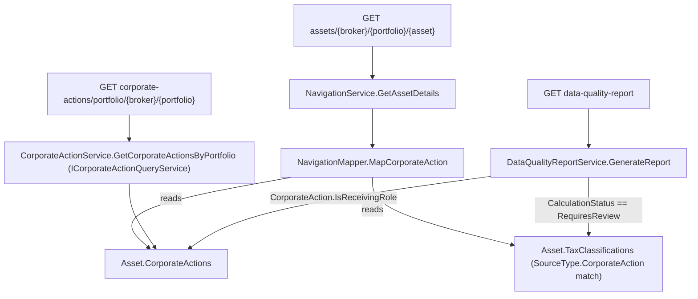

## 1. Technical Overview

**What:** F04 adds no new mutation logic at all — recording, revising and retracting a `CorporateAction` (Split/Merger/SpinOff) is fully shipped (F01-F03), and `Asset.RetractCorporateAction` already never directly rewrites a `DisposalRecord`/`TaxClassification`, only triggers the existing supersede policy. F04's entire job is two read-side additions on top of that already-shipped state: (1) surface every `CorporateAction` recorded against an asset — per-asset and portfolio-wide — each entry carrying its type-specific fields and, for a Merger/SpinOff record in the "receiving" role, its linked `TaxClassification`'s current `CalculationStatus`; (2) add a new finding category to the existing P52 dashboard data-quality report for any such record still `RequiresReview`, reusing the exact `DataQualityReportService`/`DataQualityReportDTO` mechanism the dashboard already renders.

**Why:** Both read surfaces already have an established, working precedent in this codebase that F04 only needs to extend, not invent. `AssetDetailsDTO` already embeds `DisposalRecords` on the same per-asset `GET assets/{brokerName}/{portfolioName}/{assetName}` endpoint the F04 user story explicitly compares itself to ("the same way I already see its disposal history"); `TransactionSummaryItemDTO`/`ITransactionQueryService` already establish the cross-asset, broker/portfolio-scoped list shape and the one-service-implements-two-interfaces DI pattern (`TransactionService : ITransactionService, ITransactionQueryService`); and `DataQualityReportService.GenerateReport()` already has five `Finding` record types following one exact shape (flat record, `BrokerName`/`PortfolioName`/`AssetName` first, populated via LINQ over `allHoldings`, appended as a new `IReadOnlyList<T>` property on `DataQualityReportDTO`). Following these precedents exactly is both the fastest path and the one least likely to introduce a review finding of its own.

**Scope:**
- Included: `CorporateActions` added to `AssetDetailsDTO` (per-asset history, via the existing asset-details endpoint); a new `GET corporate-actions/portfolio/{brokerName}/{portfolioName}` route + `ICorporateActionQueryService.GetCorporateActionsByPortfolio` implemented by the existing `CorporateActionService` (portfolio-wide history); a new `CorporateActionAwaitingTaxReviewFinding` on `DataQualityReportDTO`, populated by `DataQualityReportService`.
- Excluded (later features in this PRD): both front ends (F05/F06) — F04 is the API/Application read surface only; per PRD §6 F04 Experience: "No new screen beyond what F05/F06 render."
- Excluded (out of scope for this wave, PRD §7): automatic tax-due computation, automatic detection/fetching of corporate actions, retroactive price-snapshot adjustment — none of these are F04 concerns either.
- Not required (verified by reading the current code, not assumed): **zero Domain-layer changes.** `CorporateAction.IsReceivingRole` (already public, already generalized by F03 to cover `Merger`/`Target` and `SpinOff`/`New`) is exactly the predicate the new finding needs; `Asset.TaxClassifications` and `Asset.CorporateActions` are already public `IReadOnlyCollection<T>`s that `NavigationService`/`DataQualityReportService` already query externally by LINQ for the same kind of cross-reference (`taxJurisdictions`, `unresolvedTaxClassifications`) — no new Domain method, no new persisted field, no JSON shape change.



## 2. Architecture Impact

**Affected components:**
- `Financial.Investment.Application/DTOs/CorporateActionDTO.cs` — new (full per-asset shape, embedded in `AssetDetailsDTO`, mirrors `DisposalRecordDTO`)
- `Financial.Investment.Application/DTOs/AssetDetailsDTO.cs` — modified (adds `List<CorporateActionDTO> CorporateActions`)
- `Financial.Investment.Application/Services/NavigationMapper.cs` — modified (adds `MapCorporateAction(CorporateAction, Asset)`)
- `Financial.Investment.Application/Services/NavigationService.cs` — modified (`GetAssetDetails` populates the new list, ordered by `EffectiveDate` ascending)
- `Financial.Investment.Application/DTOs/DataQualityReportDTOs.cs` — modified (new `CorporateActionAwaitingTaxReviewFinding` record + `DataQualityReportDTO.CorporateActionsAwaitingTaxReview`)
- `Financial.Investment.Application/Services/DataQualityReportService.cs` — modified (`GenerateReport` populates the new finding)
- `Financial.Investment.Application/DTOs/CorporateActionSummaryItemDTO.cs` — new (cross-asset row for the portfolio-wide list, mirrors `TransactionSummaryItemDTO`)
- `Financial.Investment.Application/Interfaces/ICorporateActionQueryService.cs` — new (`GetCorporateActionsByPortfolio`)
- `Financial.Investment.Application/Services/CorporateActionService.cs` — modified (implements the new interface alongside its existing `ICorporateActionService`)
- `Financial.Investment.Application/DependencyInjection/InvestmentApplicationServiceCollectionExtensions.cs` — modified (registers `ICorporateActionQueryService` against the existing `CorporateActionService` singleton, same pattern as `ICreditQueryService`/`ITransactionQueryService`)
- `Financial.Api/Controllers/CorporateActionsController.cs` — modified (`GET corporate-actions/portfolio/{brokerName}/{portfolioName}`)
- **Not modified** (confirmed by reading each file): every `Financial.Investment.Domain/*` file — `CorporateAction.cs`, `Asset.cs`, `TaxClassification.cs`, `TaxClassificationCalculator.cs` all already expose everything F04 needs as public members; `Financial.Investment.Infrastructure/Persistence/InvestmentTypeInfoResolver.cs` — no new persisted type; `CorporateActionsController`'s existing `POST`/`PUT`/`DELETE` routes — unchanged, F04 adds a `GET` only

## 3. Technical Decisions

| Decision | Chosen Approach | Alternative Considered | Trade-off |
|---|---|---|---|
| Per-asset history read surface | Extend the existing `AssetDetailsDTO`/`GET assets/{brokerName}/{portfolioName}/{assetName}` endpoint with a `CorporateActions` list, exactly how `DisposalRecords` is already embedded there | A dedicated `GET corporate-actions/asset/{brokerName}/{portfolioName}/{assetName}` endpoint | PRD §5 F04's own user story says "I want to see the corporate action history list for a holding **the same way I already see its disposal history**" — that history is `AssetDetailsDTO.DisposalRecords` today, not a separate endpoint. Extending the existing DTO avoids a second, redundant read path and lets F05/F06 reuse one existing fetch instead of two |
| Portfolio-wide history read surface | New `ICorporateActionQueryService.GetCorporateActionsByPortfolio(brokerName, portfolioName, scope)`, implemented by the **existing** `CorporateActionService` class (which already implements `ICorporateActionService`), registered the same two-interfaces-one-singleton way `TransactionService`/`CreditService` already are in `InvestmentApplicationServiceCollectionExtensions` | A new, separate `CorporateActionQueryService` class | `services.AddSingleton<ICreditQueryService>(sp => sp.GetRequiredService<CreditService>())` and the identical line for `ITransactionQueryService`/`TransactionService` are the established convention for "one service class, one mutation interface, one query interface" — a separate class would be inconsistent with both existing precedents for no benefit |
| No broker-wide corporate-action route | Not added | `GET corporate-actions/broker/{brokerName}`, mirroring `TransactionsController`/`CreditsController`'s broker-scoped routes | PRD §6 F04 Provides explicitly says "Per-asset **and portfolio-wide**" only — no broker-wide requirement anywhere in PRD §5/§6/§9 for F04. Adding an unrequested scope is exactly the kind of unneeded surface CLAUDE.md's "right-sized, not over-engineered" invariant warns against; can be added later if F05/F06 actually need it |
| Resolving the linked `TaxClassification`'s status | Filter the already-public `Asset.TaxClassifications` collection from the Application layer (`SourceType.CorporateAction`, matching `SourceId`, `Status == Active`) | Add a public `Asset.FindTaxClassificationFor(CorporateAction)` Domain method | `NavigationService.GetAssetDetails` (`taxJurisdictions`) and `DataQualityReportService.GenerateReport` (`unresolvedTaxClassifications`) already do exactly this kind of external filter over `Asset.TaxClassifications` today — a new Domain method would duplicate a query already expressible, and the exact lookup (`SourceType`/`SourceId`/`Status`) is only ever needed by these two Application-layer call sites, never by another Domain rule |
| Data-quality finding predicate | Reuse `CorporateAction.IsReceivingRole` (public; F03 already generalized it to cover `Merger`/`Target` and `SpinOff`/`New` in one property) to select which `CorporateAction`s can have a review-worthy `TaxClassification`, then filter by `CalculationStatus == RequiresReview` | Re-derive the "is this a tax-relevant corporate action" condition inline in `DataQualityReportService` (`Type == Merger && Role == Target \|\| Type == SpinOff && Role == New`) | `IsReceivingRole` already exists as the single source of truth for this exact condition (it drives `Asset`'s own merger/spin-off tax-classification hook internally); duplicating the condition in the Application layer would be the kind of drift the F03 refactor specifically eliminated |
| Auto-clear mechanism for the warning | No new logic — `DataQualityReportService.GenerateReport()` is already stateless (called fresh on every `GET data-quality-report`, reading whatever `TaxClassification.CalculationStatus` currently is), exactly like the existing `UnresolvedTaxClassificationFinding` already behaves for Disposal/Credit-sourced classifications | Add logic that re-evaluates every corporate action's `TaxClassification` against currently-defined `TaxRule`s on every report generation | **Verified by reading `TaxRuleService.CreateTaxRuleAsync`:** adding a `TaxRule` does **not** retroactively recompute any already-created `TaxClassification`'s stored `CalculationStatus` — that field is fixed at creation/revision time by `TaxClassificationCalculator`. A warning therefore clears only once the underlying corporate action is next revised (which already supersedes the classification via `Asset.ReviseCorporateAction`'s existing `SupersedeTaxClassificationBySource` call, re-running the calculator against whatever `TaxRule`s exist *then*) or a fresh corporate action is recorded after the rule exists — **not** the instant a `TaxRule` is saved with no other action taken. This is not a gap F04 introduces: `UnresolvedTaxClassificationFinding` has the identical characteristic today for Disposal/Credit, and PRD §6 F04's own phrase — "consistent with how existing `TaxClassification` status already resolves" — is describing exactly this precedent, not asking for new reclassification logic |
| History ordering (per-asset) | Ascending by `EffectiveDate` (chronological) | Descending (newest-first), matching `Transactions`/`Credits`/`PriceSnapshots`' existing `OrderByDescending` in the same `NavigationService.GetAssetDetails` method | PRD §5 F04's user story says "I want to see every corporate action... **in date order**" — read literally as chronological narrative order (what happened to the position, in sequence), distinct from the "recent activity first" framing that motivates descending order for transactions/credits/prices. `DisposalRecords` in the same DTO is not explicitly ordered at all today, so there is no single existing convention this must match |
| New finding's shape | Flat record `CorporateActionAwaitingTaxReviewFinding(BrokerName, PortfolioName, AssetName, CorporateActionId, Type, EffectiveDate, TaxYear)`, added as its own `IReadOnlyList<T>` property on `DataQualityReportDTO` | A boolean flag or count folded into an existing finding type | Every one of the five existing finding types follows this exact flat-record-plus-own-list shape (`SalesExceedPurchasesFinding`, `UnpricedOpenHoldingFinding`, etc.) — matching it exactly is what lets F05/F06 render the new category with the same list-rendering code path they already use for the other five, no special-casing |
| Data Model impact | None — F04 persists nothing new; `CorporateAction`/`TaxClassification` are already fully persisted since F01-F03 | — | F04 is a pure read/projection feature: no new JSON field, no migration, no `InvestmentTypeInfoResolver` change |

## 4. Component Overview

**Domain:** No changes. Confirmed by reading `CorporateAction.cs`, `Asset.cs`, `TaxClassification.cs`, `TaxClassificationCalculator.cs` — every member F04 needs (`CorporateAction.IsReceivingRole`, `Asset.CorporateActions`, `Asset.TaxClassifications`, `TaxClassification.SourceType`/`SourceId`/`CalculationStatus`) is already public.

**Application:**

| File Path | New/Modified | Purpose | Key Responsibilities |
|---|---|---|---|
| `Financial.Investment.Application/DTOs/CorporateActionDTO.cs` | New | Full per-asset corporate-action shape | Mirrors `CorporateAction`'s own fields 1:1: `Id`, `Type`, `EffectiveDate`, `RatioFactor`, `Note`, `Role`, `CorrelationId`, `LinkedAssetName`, `ExchangeRatio`, `CashInLieu`, `ConvertedQuantity`, `CarriedCostBasis`, `AllocationPercentage`, plus a computed `CalculationStatus?` (null for `Split`, or for a `Merger`/`SpinOff` record with no active linked classification — never expected in practice but not assumed away) |
| `Financial.Investment.Application/DTOs/AssetDetailsDTO.cs` | Modified | Per-asset read model | Adds `List<CorporateActionDTO> CorporateActions { get; set; } = new();`, alongside the existing `DisposalRecords` |
| `Financial.Investment.Application/Services/NavigationMapper.cs` | Modified | Entity→DTO mapping | New `internal static CorporateActionDTO MapCorporateAction(CorporateAction action, Asset asset)`: copies every field 1:1, resolves `CalculationStatus` by filtering `asset.TaxClassifications` for `SourceType.CorporateAction`, `SourceId == action.Id`, `Status == TaxClassificationStatus.Active` |
| `Financial.Investment.Application/Services/NavigationService.cs` | Modified | `GetAssetDetails` | Adds `asset.CorporateActions.OrderBy(ca => ca.EffectiveDate).Select(ca => NavigationMapper.MapCorporateAction(ca, asset)).ToList()`, assigned to `AssetDetailsDTO.CorporateActions` |
| `Financial.Investment.Application/DTOs/CorporateActionSummaryItemDTO.cs` | New | Cross-asset row, portfolio-wide list | `AssetName`, `Type`, `Role`, `EffectiveDate`, `LinkedAssetName`, `CalculationStatus?` — mirrors `TransactionSummaryItemDTO`'s lighter, asset-name-qualified shape (the full per-asset `CorporateActionDTO` is redundant here since it's always fetched within a known asset already) |
| `Financial.Investment.Application/Interfaces/ICorporateActionQueryService.cs` | New | Query contract | `IReadOnlyList<CorporateActionSummaryItemDTO> GetCorporateActionsByPortfolio(string brokerName, string portfolioName, InvestmentScope scope = InvestmentScope.Active)` |
| `Financial.Investment.Application/Services/CorporateActionService.cs` | Modified | Implementation | Implements `ICorporateActionQueryService` alongside its existing `ICorporateActionService`; `GetCorporateActionsByPortfolio` returns an empty list for a blank broker/portfolio name (matching `TransactionService.GetTransactionsByPortfolio`'s exact early-return shape), otherwise flattens `_repository.GetAssetsByBrokerPortfolio(brokerName, portfolioName, scope)`'s assets' `CorporateActions`, mapped via a new private `MapSummaryItem`, ordered by `EffectiveDate` |
| `Financial.Investment.Application/DTOs/DataQualityReportDTOs.cs` | Modified | Finding shape | New `CorporateActionAwaitingTaxReviewFinding(string BrokerName, string PortfolioName, string AssetName, Guid CorporateActionId, CorporateAction.CorporateActionType Type, DateTime EffectiveDate, string TaxYear)`; `DataQualityReportDTO` gains `IReadOnlyList<CorporateActionAwaitingTaxReviewFinding> CorporateActionsAwaitingTaxReview { get; init; } = [];` |
| `Financial.Investment.Application/Services/DataQualityReportService.cs` | Modified | `GenerateReport` | New query over `allHoldings`: for each holding's `Asset.CorporateActions.Where(ca => ca.IsReceivingRole)`, look up the active linked `TaxClassification` (same filter as `NavigationMapper.MapCorporateAction`), keep only `CalculationStatus == RequiresReview`, project to the new finding, order by `BrokerName`/`PortfolioName`/`AssetName` (same tie-break convention every other finding in this method already uses); assigned to the new `DataQualityReportDTO.CorporateActionsAwaitingTaxReview` property |

**Infrastructure / Presentation:**

| File Path | New/Modified | Purpose | Key Responsibilities |
|---|---|---|---|
| `Financial.Investment.Application/DependencyInjection/InvestmentApplicationServiceCollectionExtensions.cs` | Modified | DI wiring | Adds `services.AddSingleton<ICorporateActionQueryService>(sp => sp.GetRequiredService<CorporateActionService>());` immediately after the existing `services.AddSingleton<ICorporateActionService, CorporateActionService>();` line — but that line must first change to register the concrete `CorporateActionService` singleton and resolve both interfaces from it, exactly like the `CreditService`/`TransactionService` block above it |
| `Financial.Api/Controllers/CorporateActionsController.cs` | Modified | HTTP surface | New `[HttpGet("portfolio/{brokerName}/{portfolioName}")]` → `ICorporateActionQueryService.GetCorporateActionsByPortfolio`, `[FromQuery] string? scope`, 400 if either name is blank — same shape as `TransactionsController.GetTransactionsByPortfolio`; constructor gains the new interface dependency |

## 5. API Contracts

**Endpoint: Asset Details (enriched, not new)**
- **Method:** GET
- **Path:** `/assets/{brokerName}/{portfolioName}/{assetName}`
- **Change:** Response (`AssetDetailsDTO`) gains `corporateActions: CorporateActionDTO[]`, ordered by `effectiveDate` ascending. No request shape change.

**Response addition example (one entry):**
```json
{
  "corporateActions": [
    {
      "id": "5f2c...",
      "type": "Merger",
      "effectiveDate": "2026-04-01T00:00:00Z",
      "ratioFactor": null,
      "note": "Acquired by BigCo",
      "role": "Source",
      "correlationId": "9a11...",
      "linkedAssetName": "BIGCO",
      "exchangeRatio": 1.5,
      "cashInLieu": 12.34,
      "convertedQuantity": 150,
      "carriedCostBasis": 2000.00,
      "allocationPercentage": null,
      "calculationStatus": "RequiresReview"
    }
  ]
}
```

**Endpoint: Corporate Actions by Portfolio (new)**
- **Method:** GET
- **Path:** `/corporate-actions/portfolio/{brokerName}/{portfolioName}`
- **Authentication:** None (matches `CorporateActionsController`'s existing routes)
- **Query:** `scope` — optional, `"active-only"` (default) or `"all"`, same `InvestmentScopeParser` as every other list endpoint

**Response (Success - 200):** `IReadOnlyList<CorporateActionSummaryItemDTO>`
```json
[
  {
    "assetName": "PETR4",
    "type": "Split",
    "role": null,
    "effectiveDate": "2026-03-01T00:00:00Z",
    "linkedAssetName": null,
    "calculationStatus": null
  },
  {
    "assetName": "GEHC-PARENT",
    "type": "SpinOff",
    "role": "Parent",
    "effectiveDate": "2026-04-01T00:00:00Z",
    "linkedAssetName": "SPINCO",
    "calculationStatus": null
  }
]
```

**Error Codes:**

| Condition | HTTP Status | Description |
|---|---|---|
| `brokerName` or `portfolioName` blank | 400 | Controller-level check, same as `TransactionsController.GetTransactionsByPortfolio` |
| Broker/portfolio not found | 200, empty array | Matches `TransactionService.GetTransactionsByPortfolio`'s existing behavior — not a 404, an empty result |

**Endpoint: Data Quality Report (enriched, not new)**
- **Method:** GET
- **Path:** `/data-quality-report`
- **Change:** Response (`DataQualityReportDTO`) gains `corporateActionsAwaitingTaxReview: CorporateActionAwaitingTaxReviewFinding[]`.

```json
{
  "corporateActionsAwaitingTaxReview": [
    {
      "brokerName": "Trading212",
      "portfolioName": "Main",
      "assetName": "BIGCO",
      "corporateActionId": "5f2c...",
      "type": "Merger",
      "effectiveDate": "2026-04-01T00:00:00Z",
      "taxYear": "2026/2027"
    }
  ]
}
```

## 6. Data Model

No relational schema — both bounded contexts persist to a single JSON document, per CLAUDE.md. **F04 introduces no new persisted field, no new entity, and no migration.** `CorporateAction` and `TaxClassification` are already fully persisted (since F01-F03); F04 only projects their already-stored fields into new/enriched DTOs at read time. `InvestmentTypeInfoResolver` needs no change — nothing new is being (de)serialized.

## 7. Testing Strategy

Per `testing-guide-Financial`: Application services/mappers are Unit-tested; acceptance tests trace PRD §9 F04 (and the F04 rows of Cross-Feature Integration) against the real HTTP pipeline; no Domain-layer tests are needed (no Domain changes) and no E2E coverage in this feature (F05/F06 own the UI).

| Test File | Test Type | Target | Coverage Goal |
|---|---|---|---|
| `Tests/Financial.Investment.Application.Tests/Services/NavigationMapperTests.cs` | Unit | `MapCorporateAction` | Field-by-field mapping for Split/Merger/SpinOff; `CalculationStatus` populated for a `Merger`/`SpinOff` record with an active linked `TaxClassification`, `null` for `Split`, `null` when the linked classification has been superseded (only the active one is matched) |
| `Tests/Financial.Investment.Application.Tests/Services/NavigationServiceTests.cs` | Unit | `GetAssetDetails` | `CorporateActions` populated, ordered by `EffectiveDate` ascending, for an asset with a mix of all three types |
| `Tests/Financial.Investment.Application.Tests/Services/CorporateActionServiceQueryTests.cs` | Unit | `CorporateActionService.GetCorporateActionsByPortfolio` (new `ICorporateActionQueryService` member) | Happy path across multiple assets in a portfolio, correct ordering; blank broker/portfolio name returns an empty list, not an exception; assets in a different portfolio are excluded |
| `Tests/Financial.Investment.Application.Tests/Services/DataQualityReportServiceTests.cs` | Unit | `GenerateReport`'s new finding | Populated for a `Merger`/`Target` or `SpinOff`/`New` record whose linked classification is `RequiresReview`; absent when `Final`/`Incomplete`; absent for `Split` (never has a linked classification); absent once the corporate action is revised after a matching `TaxRule` is added (proves the documented auto-clear-on-revision behavior, not "on `TaxRule` creation alone") |
| `Tests/Financial.Api.Tests/Acceptance/CorporateActionHistoryAcceptanceTests.cs` | Acceptance | End-to-end HTTP, one test per PRD §9 F04 AC + relevant Cross-Feature Integration items | `[Trait("AC", "P53-F04-history-0N")]` per test, mirroring `CorporateActionSplitAcceptanceTests`' shape |
| `Tests/Financial.Api.Tests/Contract/openapi-v1.snapshot.json` (via `OpenApiContractTests`) | Contract | New/changed routes and DTOs | Regenerated per CLAUDE.md's `UPDATE_OPENAPI_SNAPSHOT` procedure; `Financial.Web/src/api/generated/openapi.ts` regenerated in the same PR |

**Acceptance-test traceability (PRD §9 F04):**
- "The history endpoint for an asset returns every split, merger, and spin-off recorded against it, ordered by effective date" → `CorporateActionHistoryAcceptanceTests` (records one of each type on the same asset, asserts `GET assets/.../{assetName}`'s `corporateActions` is complete and ordered) + `NavigationServiceTests`
- "A merger or spin-off with `TaxClassification` status `RequiresReview` appears in the P52 dashboard data-quality warnings list" → `CorporateActionHistoryAcceptanceTests` (records a merger with no matching `TaxRule`, asserts `GET data-quality-report`) + `DataQualityReportServiceTests`
- "Clicking the warning navigates to the affected holding" → covered by F05 (this AC's backend precondition — the finding carries `BrokerName`/`PortfolioName`/`AssetName` — is asserted by `CorporateActionHistoryAcceptanceTests`; the click-through itself is a React concern out of scope for F04)
- "The warning disappears once a matching admin `TaxRule` re-classifies the event to a resolved status" → `CorporateActionHistoryAcceptanceTests` (creates a `TaxRule`, revises the corporate action, asserts the finding is gone) + `DataQualityReportServiceTests`
- "Deleting a corporate action from the history list re-triggers replay and does not directly modify any `DisposalRecord` or `TaxClassification` outside the existing supersede policy" → confirmed by test, not by new code (F01's `DELETE /corporate-actions` and `Asset.RetractCorporateAction` already implement this); `CorporateActionHistoryAcceptanceTests` adds the missing end-to-end regression test asserting record IDs/content are unchanged outside the supersede chain

**Cross-Feature Integration traceability:**
- "F04's history list correctly displays a split recorded via F01, a merger recorded via F02, and a spin-off recorded via F03 for the same asset, each showing its own type-specific fields" → `CorporateActionHistoryAcceptanceTests`
- "F04's dashboard warning correctly reflects the `TaxClassification` status produced by F02 and F03" → `CorporateActionHistoryAcceptanceTests`
