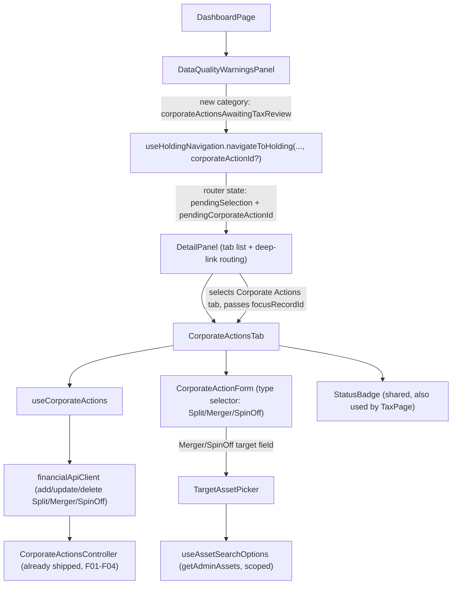

## 1. Technical Overview

**What:** A new "Corporate Actions" tab on the asset detail view (`Financial.Web`'s `DetailPanel`), alongside the existing Transactions/Credits/Price History/Disposals tabs. It gives the user an inline "New Corporate Action" form with a Split/Merger/Spin-off type selector that swaps in only the fields relevant to the selected type, a history list of every corporate action recorded against the asset (reusing the app's standard grid conventions the way `DisposalsTab` does), and a shared target-asset search-or-create widget used by both the Merger and Spin-off forms. It also adds a fourth dashboard data-quality warning category ("Corporate action awaiting tax review") that click-through-navigates to the affected holding's Corporate Actions tab, scrolled and focused to the specific record.

**Why:** F01-F04 already shipped the entire backend for this — `CorporateActionsController`'s `POST`/`PUT /corporate-actions/{split,merger,spin-off}` and `DELETE /corporate-actions` routes, `AssetDetailsDTO.corporateActions` (per-asset history), and `DataQualityReportDTO.corporateActionsAwaitingTaxReview` (the new finding) are all live today — confirmed by reading `Financial.Web/src/api/generated/openapi.ts`, which already contains every `CorporateAction*` schema and route. F05 adds no new backend surface; it is a pure presentation-layer vertical slice that consumes what already exists, following the same established `Financial.Web` patterns `TransactionsTab`/`useTransactions` (inline form + reducer-driven state), `DisposalsTab`/`useDisposals` (asset-scoped history list), `AssetFormDialog` (asset identity fields), and `DataQualityWarningsPanel`/`useHoldingNavigation` (dashboard click-through) already establish.

**Scope:**
- Included: a `CorporateActionsTab` component + `useCorporateActions` hook (mirroring `useTransactions`'s shape) providing the inline type-selector form (Split/Merger/Spin-off) and the history list; a shared `TargetAssetPicker` component (search-existing-or-create-inline, reusing `AssetFormDialog`'s identity field set) used by Merger's Target Asset and Spin-off's New Asset fields; a mandatory confirmation step inside the Merger form before save; a live cost-basis-split preview inside the Spin-off form; extending `financialApiClient.ts`/`types.ts` with the (already-generated) request/response shapes for all three corporate-action types; wiring the new tab into `DetailPanel`; adding the fourth warning category to `DataQualityWarningsPanel` with click-through that both navigates to the holding (existing mechanism) and opens/focuses the specific record (new, small extension to `useHoldingNavigation`); extracting `TaxPage.tsx`'s private `StatusBadge` into a shared component so the Corporate Actions history list and the dashboard/tax views render `RequiresReview`/`Final`/`Incomplete` identically.
- Excluded (already shipped, F01-F04): every Domain/Application/Infrastructure/API change — this feature reads/writes only through the already-shipped HTTP contract.
- Excluded (later feature in this PRD): `Financial.App` (WPF) parity — F06, Wave 4, depends on F05 being done first.
- Excluded (documented assumption, see §4): the portfolio-wide `GET corporate-actions/portfolio/{brokerName}/{portfolioName}` endpoint (F04) is not consumed by F05 — PRD §6 F05's own Experience text only describes an asset-scoped section, matching `DisposalsTab`'s existing asset-only scoping, so only the already-embedded `AssetDetailsDTO.corporateActions` list is needed.

## 2. UX Workflow Assessment

*(`fluent-ui` skill §1 "Assess the workflow" — every mandatory doc listed in the skill and `docs/rules/ui.md` §Required reading was read before this section was written: `docs/rules/ui.md`, `docs/ui/README.md`, `docs/ui/standards-hierarchy.md`, `docs/ui/ux-principles.md`, `docs/ui/design-tokens.md`, `docs/ui/forms-data-and-visualisations.md`, `docs/ui/accessibility.md`, `docs/ui/react.md`, ADR-001, ADR-003, ADR-004, ADR-006, and `docs/ui/review-checklist.md`.)*

**User task:** Record a rare, high-consequence event (a split, a merger, or a spin-off) against a holding so the app's quantity/cost-basis/tax figures stay correct, and later review or correct what was recorded. A secondary task is noticing and resolving a "still awaiting tax review" item surfaced on the dashboard.

**Financial/domain context:** Same single-user, multi-broker/multi-currency portfolio every other Investment view already operates in. The three corporate-action types have very different field shapes (§ below) but share the same effective-date-before-same-day-transaction replay semantics already established by F01-F04. Getting this wrong is worse than not recording it at all (per the PRD's own framing), so validation must be as strict here as anywhere else in the app — no shortcuts because the feature is rare.

**Current React behavior:** None exists yet — this is a new tab and new components. There is nothing to correct; the assessment below is a fresh design against the standards, not a gap analysis of existing code.

**Information hierarchy:** `DetailPanel`'s existing `TabList` (`Summary | Transactions | Credits | Price History | Disposals`) gains a sixth, asset-only tab, `Corporate Actions`, positioned after `Disposals` (the tab list's existing order already runs from "day-to-day entry" to "results/audit" left-to-right — Corporate Actions is the least-frequently-touched of all of them, so it sits last). Inside the tab: a left-aligned primary "New Corporate Action" button above the history table (matching every other grid's create-trigger position in this repo), the inline form appears between the button and the table when open, and the history table always renders below — no separate "corporate actions" section elsewhere in the app duplicates this.

**Primary and secondary actions:** Primary: "New Corporate Action" (opens the inline form) and, once open, the save action — implemented (PR1) as the generic "Add Corporate Action"/"Save", not a type-specific "Add Split"/"Add Merger"/"Add Spin-off": the trigger itself is necessarily generic (no type is chosen yet when it's clicked), and `TransactionsTab`'s own precedent — a `Type` selector inside a form whose trigger/title/confirm all stay generic ("New transaction"/"Add transaction") rather than swapping per selected type — is what the trigger→title→confirm naming-consistency rule actually asks this form to match; a type-specific confirm label paired with a generic trigger would itself be the naming mismatch that rule warns against. Secondary: per-row Edit/Delete icon buttons in the history table's trailing Actions column (unlike `DisposalsTab`'s read-only chain-history chevron, Corporate Actions are user-editable/deletable per F04, so the pattern to follow is `TransactionsTab`'s Edit/Delete pair, not `DisposalsTab`'s).

**Field order and grouping:** Per `forms-data-and-visualisations.md`'s default field order (date → related entities → description → financial values → optional metadata → actions):
- **Split:** Effective Date, Ratio (a paired "N-for-M" number input, see §4), Note. No explicit "Asset" field — like `TransactionsTab`, the holding is implicit from the page the user is already on.
- **Merger:** Effective Date, Source Asset (read-only, pre-filled with the current holding's name — shown explicitly here, unlike Split, because a second asset enters the picture and disambiguation matters), Target Asset (`TargetAssetPicker`), Exchange Ratio, Cash-in-Lieu Amount (optional), Note → then the confirmation step.
- **Spin-off:** Effective Date, Parent Asset (read-only, pre-filled), New Asset (`TargetAssetPicker`), Quantity Received, Allocation % (with `InfoLabel` help text per PRD: "Find this on your broker's cost-basis allocation letter for this spin-off"), live currency-split preview, Note.
- All three share the same 4/2/1-column responsive grid (`useFormPanelStyles`) every other inline form in this app already uses.

**Inline vs. dialog vs. drawer:** Inline form, per ADR-003 and `forms-data-and-visualisations.md`'s "New X create actions are inline forms, not popup dialogs" rule — Corporate Action is a transactional/financial entry action (like Transaction/Credit/Price), not one of the ten ADR-006-exempted Admin lookup entities, so no dialog carve-out applies. The Merger confirmation step (§4) stays inside the same inline panel as a second in-place state, not a popup `Dialog` — swapping a panel's own content by local state, not opening a new surface, is the same pattern `IncomeSplitForm` already uses for its post-submit result view; ADR-003 itself warns against moving an inline form into a dialog "merely to reduce visible page content."

**Required states:** Initial (tab shows the "New Corporate Action" button + history list/empty state), Loading (skeleton via the shared `LoadingState`, matching `DisposalsTab`), Empty ("No corporate actions yet — nothing has changed this holding through a split, merger, or spin-off." matching `DisposalsTab`'s empty-copy convention), Validation (inline per-field, via `useFieldError`, identical mechanism to `TransactionsTab`), Server error (non-blocking `MessageBar intent="error"` inside the panel, entered values preserved — the exact `TransactionsTab`/`IncomeSplitForm` shape), Saving (`isSaving` disables the Save button and shows "Saving..."/"Adding..." text, matching `TransactionsTab`), Success (panel closes or, for Merger, briefly nothing extra is needed since the confirmation step already summarized the effect — the history list updates from the mutation response), Disabled (Save disabled until required fields are valid, same `canSubmit`-style gate as `AssetFormDialog`), Unsaved-changes (Cancel always available while the form is open; no browser-level "are you sure" prompt is added — no existing inline form in this app has one either, so adding one here would be an inconsistent new pattern).

**Responsive/adaptive behavior:** The shared `useFormPanelStyles` grid already reflows 4→2→1 columns at the existing breakpoints; the history table follows `react.md`'s grid-row-height/no-wrap/`TruncatedText` rules for its Note column; no page-specific responsive work is needed beyond reusing what's already there.

**Accessibility and focus:** Visible labels via Fluent `Field`, required-field asterisks via `Field required`, `InfoLabel` for the allocation-percentage help text, focus moves into the form's first field when it opens (matching `TransactionsTab`'s `InlineForm` — no special handling needed beyond what `Field`/`Input` give for free), the confirmation step's summary text is plain readable prose (not solely conveyed by layout/color), and the dashboard warning's click-through focus-management follows `DataQualityWarningsPanel`'s own existing `focusToken` pattern (§4).

**API contract implications:** None — every DTO F05 needs already exists in the committed OpenAPI snapshot/generated `openapi.ts`; F05 only adds `types.ts` aliases and `financialApiClient.ts` methods, no backend or snapshot change.

**Files and tests affected:** See §5 (Component Overview) and §7 (Testing Strategy); PR slicing is in `plan.md`.

## 3. Architecture Impact

**Affected components:**
- `Financial.Web/src/components/CorporateActionsTab.tsx` — new
- `Financial.Web/src/components/CorporateActionForm.tsx` — new
- `Financial.Web/src/components/TargetAssetPicker.tsx` — new
- `Financial.Web/src/components/StatusBadge.tsx` — new (extracted from `TaxPage.tsx`)
- `Financial.Web/src/hooks/useCorporateActions.ts` — new
- `Financial.Web/src/hooks/useAssetSearchOptions.ts` — new
- `Financial.Web/src/components/DetailPanel.tsx` — modified (new tab, deep-link focus routing)
- `Financial.Web/src/components/dashboard/DataQualityWarningsPanel.tsx` — modified (new warning category)
- `Financial.Web/src/hooks/useHoldingNavigation.ts` — modified (carries an optional target-record id)
- `Financial.Web/src/pages/TaxPage.tsx` — modified (consumes the extracted `StatusBadge`)
- `Financial.Web/src/api/financialApiClient.ts` — modified (add/update/delete for all three types)
- `Financial.Web/src/api/types.ts` — modified (new DTO aliases)



## 4. Technical Decisions

| Decision | Chosen Approach | Alternative Considered | Trade-off |
|---|---|---|---|
| Type selector control | A `Field label="Type"` + `Select` (Split/Reverse Split, Merger, Spin-off), positioned as the form's 2nd field, mirroring `TransactionsTab`'s own `Type` `Select` exactly | A `TabList`/chip toggle (the "chart filter/mode" pattern) | The chip pattern in `forms-data-and-visualisations.md` is documented for chart period/mode filters, a page-level *view* toggle — this is a single *form field* that reshapes the rest of the form, the same role `TransactionsTab`'s `Type` field already plays; reusing that exact precedent keeps the two forms consistent instead of inventing a second "type selector" idiom |
| Split ratio entry | Two adjacent number `Input`s ("New units" / "Old units", i.e. the "N" / "M" of "N-for-M"), with inline example text ("2-for-1 split", "1-for-10 reverse split") underneath, client-side computing `ratioFactor = N / M` before calling the API | A single free-text "2-for-1" string parsed server-side, or one raw decimal-factor input | PRD §6 F01 explicitly requires "Ratio (entered as 'N-for-M', converted to the decimal factor)... to avoid factor-direction confusion" and gives the exact example copy to show; the API only accepts the already-converted decimal `ratioFactor` (confirmed in `CorporateActionSplitCreateDTO`), so the N/M-to-factor conversion is necessarily a client-side presentation concern, not a new backend field |
| Target-asset search-or-create widget | New `TargetAssetPicker` built on Fluent's own `Combobox` (freeform text + filtered options from `useAssetSearchOptions`, which calls the existing `getAdminAssets()` filtered client-side to the current broker+portfolio, excluding the source/parent asset itself); when the typed text matches no existing asset, an inline "Create new asset '{name}'" affordance expands the same identity fields `AssetFormDialog` already uses (ISIN, Exchange, Ticker, Country, Class) | Extend the existing hand-rolled `TickerCombobox` component | `TickerCombobox` predates the Fluent UI React migration (ADR-004) and is a plain `<input>`+custom `<ul>` listbox with no Fluent styling/theming — building a new widget on it would extend a pre-Fluent pattern instead of the adopted one; Fluent's `Combobox` already ships the freeform-typing + filtered-options + keyboard-navigation behavior this widget needs, matching `react.md`'s "reuse project components and wrappers before using raw Fluent components... use semantic HTML/native Fluent components" guidance |
| Merger confirmation step | A second in-place state inside the same `CorporateActionForm` panel (`step: 'fields' | 'confirm'`), showing the exact PRD-specified summary sentence, with "Confirm & Save" (primary) / "Back" (secondary, returns to `'fields'` preserving every entered value) | A popup `Dialog` confirmation | The "New X are inline forms, not popup dialogs" rule's own carve-out is for a confirmation "unrelated to populating a specific grid row" — this confirmation *is* the row-populating action itself, just split into two screens of the same task, the same shape `IncomeSplitForm` already uses (swap the panel's own content via local state) rather than a second surface; keeps the merger's irreversible-in-spirit effect described in the same visual context as the fields that produced it |
| Spin-off live preview | Pure client-side computation from the already-loaded `AssetDetailsDto.quantity`/`averagePrice` (no `averageCost`? — confirmed field is `averagePrice` on `AssetDetailsDTO`) and the typed `allocationPercentage`, rendered as prose text under the field, live on every keystroke, bolding only the two computed amounts per `forms-data-and-visualisations.md`'s "bold the value, not the label" rule | A server round-trip "preview" endpoint | The formula (`allocation% × quantity × averagePrice`) needs no backend data the asset-details response doesn't already carry; PRD §6 F03 itself describes this as a live-as-you-type preview, which a network round-trip per keystroke would undermine |
| History list row actions | Trailing Actions column with Edit/Delete icon buttons (`appearance="subtle" size="small"`, `EditRegular`/`DeleteRegular`), `confirmThenRun` on Delete — the exact `TransactionsTab` shape | `DisposalsTab`'s expand-chevron audit-trail pattern | Corporate actions are user-editable/deletable per F04 ("edit or delete a corporate action and have the position recompute correctly"); `DisposalsTab`'s rows are read-only computed history with no user mutation, a fundamentally different case its chevron-expand pattern exists for |
| `StatusBadge` extraction | Move `TaxPage.tsx`'s private `StatusBadge`/`STATUS_PRESENTATION` into `components/StatusBadge.tsx`, imported by both `TaxPage.tsx` (unchanged behavior) and `CorporateActionsTab.tsx`'s history rows | Duplicate the `RequiresReview`/`Final`/`Incomplete` badge presentation locally in `CorporateActionsTab.tsx` | PRD §6 F02 explicitly requires "using the same status label/styling P51 already uses"; duplicating the `STATUS_PRESENTATION` map would immediately drift the two call sites apart, exactly the kind of repeated-visual-value `docs/ui/design-tokens.md` warns against |
| Dashboard warning → specific-record deep link | Extend `useHoldingNavigation.navigateToHolding` with an optional 4th argument `corporateActionId`, carried in router state alongside the existing `pendingSelection` as `pendingCorporateActionId`; `DetailPanel` reads it (via `useLocation`), selects the `corporateActions` tab instead of its normal reset-to-`summary` on node change, and passes it to `CorporateActionsTab` as `focusRecordId`, which scrolls/focuses/briefly-highlights that row once the history list has loaded — mirroring `DataQualityWarningsPanel`'s own existing `focusToken` ref-based focus pattern for internal consistency | A URL query parameter (`?focusCorporateActionId=...`) | The existing "navigate to a holding" mechanism already uses router *state* (not the URL) for `pendingSelection`, specifically because the tree/selection provider is recreated on every mount (per `useHoldingNavigation`'s own comment) — a query param would need a second, parallel read path for no benefit; extending the same state object keeps one mechanism |
| Portfolio-wide corporate-action list (F04's `GET corporate-actions/portfolio/...`) | Not consumed by F05 | Use it to power a secondary "all corporate actions across the portfolio" view | PRD §6 F05's Experience text describes only an asset-scoped section ("the same way I already see its disposal history" — `DisposalsTab` is asset-only); no acceptance criterion in §9 F05 asks for a portfolio-wide view. Flagged here as an explicit auto-accept decision, not an oversight — the endpoint remains available for F06 or a future feature |
| Remembered form defaults | Corporate-action forms do **not** persist a last-used "Type"/ratio the way `TransactionsTab` remembers Date/Type via `getStoredDefault`/`setStoredDefault`; only the Effective Date defaults to today (`todayIsoDate()`), matching every other form's date default | Remember the last-used type/ratio like Transactions does | The PRD's own framing is that corporate actions are "rare enough to be forgotten" per-holding — a remembered type from a prior, unrelated corporate action (a different holding, weeks/months earlier) is more likely to be wrong than helpful, unlike Transaction Date/Type, which really is the same value repeated many times in a row during real usage |
| Cross-asset UI refresh after Merger/Spin-off | The two-asset mutation response (`CorporateActionMergerResultDTO`/`CorporateActionSpinOffResultDTO`) updates only the currently-viewed asset's local state from its matching side (source/target or parent/new) — the same "replace local state from the mutation response" pattern `useTransactions` already uses for a single-asset save | Proactively refresh the other affected asset's cached view, or the navigation tree, immediately | No existing mutation anywhere in this app proactively pushes an update to a *different*, currently-unviewed node's state (the navigation tree itself isn't live-refreshed on an ordinary transaction save either) — introducing that only for this feature would be a new, unrequested consistency guarantee; the other asset's data is correct as soon as it is next opened/fetched, same as everywhere else in the app today |
| Note field control | Fluent `Textarea` (not single-line `Input`), sized for the shared 500-character limit all three types share | `Input` (single line) | A free-text "source reference" note is the kind of content `forms-data-and-visualisations.md`'s field-rules section expects an appropriately-sized control for; every other single-line financial value field in this form set already uses `Input`, so `Textarea` is reserved for the one genuinely multi-line-capable field |

## 5. Component Overview

**Components:**

| File Path | New/Modified | Purpose | Key Responsibilities |
|---|---|---|---|
| `Financial.Web/src/components/CorporateActionsTab.tsx` | New | Tab container | Renders the "New Corporate Action" trigger, `CorporateActionForm` when open, and the history table (Date, Type, Affected/Linked Asset, Resulting Change, Tax Status via `StatusBadge`, trailing Actions column); handles loading/empty/error states via the shared `LoadingState`/`ErrorState`; accepts an optional `focusRecordId` prop (from `DetailPanel`) to scroll/focus/highlight a specific row once loaded |
| `Financial.Web/src/components/CorporateActionForm.tsx` | New | Inline entry form | Type selector (`Select`) driving which field group renders (Split / Merger / Spin-off); Merger's two-step `fields`/`confirm` flow; Spin-off's live currency-split preview; delegates target-asset selection to `TargetAssetPicker`; same `saveError`/`saveErrorFields`/`isSaving` shape as `TransactionsTab`'s `InlineForm` |
| `Financial.Web/src/components/TargetAssetPicker.tsx` | New | Shared search-or-create widget | Fluent `Combobox` over `useAssetSearchOptions`'s filtered candidate list; reveals `AssetFormDialog`'s identity fields (ISIN/Exchange/Ticker/Country/Class) inline when the typed name matches no existing asset; surfaces the server's exact 409 name-collision message (PRD-specified wording) as the field's own validation message |
| `Financial.Web/src/components/StatusBadge.tsx` | New (extracted) | Shared `CalculationStatus` badge | `STATUS_PRESENTATION` map (`Final`/`Incomplete`/`RequiresReview`) + rendering, moved out of `TaxPage.tsx` unchanged |
| `Financial.Web/src/components/DetailPanel.tsx` | Modified | Tab host | Adds `corporateActions` to `TabId`/the asset tab list (lazy-loaded, matching every other tab); reads `location.state.pendingCorporateActionId` via `useLocation` and, when present for the resolved node, selects the `corporateActions` tab instead of the default reset-to-`summary`, passing the id down as `focusRecordId` |
| `Financial.Web/src/components/dashboard/DataQualityWarningsPanel.tsx` | Modified | Dashboard warnings | Adds `'corporateActionAwaitingTaxReview'` to `WarningCategoryId`, a new `WarningCategory` mapping `report.corporateActionsAwaitingTaxReview` to rows (secondary text: `"{type}, tax year {taxYear}"`), and passes each row's `corporateActionId` through to `navigateToHolding` |

**Hooks:**

| File Path | New/Modified | Purpose | Key Responsibilities |
|---|---|---|---|
| `Financial.Web/src/hooks/useCorporateActions.ts` | New | Form + history state | Reducer-driven state mirroring `useTransactions.ts`'s shape (`isFormVisible`/`editingId`/per-field form state/`isSaving`/`saveError`/`saveErrorFields`/`deleteError`), fetches via the asset's already-loaded `corporateActions` (from `getAssetDetails`, same source `useDisposals` already reads), dispatches `addSplit`/`updateSplit`/`addMerger`/`updateMerger`/`addSpinOff`/`updateSpinOff`/`deleteCorporateAction` to `financialApiClient`, updates local asset state from each mutation's response |
| `Financial.Web/src/hooks/useAssetSearchOptions.ts` | New | Target-asset candidates | Calls `apiClient.getAdminAssets()`, filters client-side to the current broker+portfolio, excludes the source/parent asset itself; exposes loading/error like every other data hook |
| `Financial.Web/src/hooks/useHoldingNavigation.ts` | Modified | Dashboard click-through | `navigateToHolding` gains an optional 4th parameter `corporateActionId?: string`, included in the router-state payload as `pendingCorporateActionId` alongside the existing `pendingSelection` |

**API client / types:**

| File Path | New/Modified | Purpose | Key Responsibilities |
|---|---|---|---|
| `Financial.Web/src/api/financialApiClient.ts` | Modified | HTTP methods | Adds `addSplit`/`updateSplit`, `addMerger`/`updateMerger`, `addSpinOff`/`updateSpinOff`, `deleteCorporateAction`, each following the existing `addTransaction`/`updateTransaction`/`deleteTransaction` request-building shape 1:1 against the already-shipped routes |
| `Financial.Web/src/api/types.ts` | Modified | DTO aliases | Adds `CorporateActionDto`, `CorporateActionType`, `CorporateActionRole`, `CalculationStatus`, `CorporateActionSplitCreateDto`/`UpdateDto`, `CorporateActionMergerCreateDto`/`UpdateDto`/`ResultDto`, `CorporateActionSpinOffCreateDto`/`UpdateDto`/`ResultDto`, `CorporateActionDeleteDto`, `CorporateActionAwaitingTaxReviewFindingDto` — each a direct `Schema<'...DTO'>` alias, matching the file's existing 1:1 convention exactly (no hand-written shapes) |
| `Financial.Web/src/pages/TaxPage.tsx` | Modified | Tax workbook page | Removes its private `StatusBadge`/`STATUS_PRESENTATION`, imports the extracted shared component; no behavior change |

## 6. Consumed API Contracts (already shipped, F01-F04)

No new backend endpoint or DTO is introduced by this feature. F05 consumes exactly what F01-F04 already shipped and what `Financial.Web/src/api/generated/openapi.ts` already generates from the committed snapshot:

| Endpoint | DTO(s) | Consumed by |
|---|---|---|
| `POST`/`PUT /corporate-actions/split` | `CorporateActionSplitCreateDTO`/`UpdateDTO` → `AssetDetailsDTO` | Split form save |
| `POST`/`PUT /corporate-actions/merger` | `CorporateActionMergerCreateDTO`/`UpdateDTO` → `CorporateActionMergerResultDTO` | Merger form save (after confirmation step) |
| `POST`/`PUT /corporate-actions/spin-off` | `CorporateActionSpinOffCreateDTO`/`UpdateDTO` → `CorporateActionSpinOffResultDTO` | Spin-off form save |
| `DELETE /corporate-actions` | `CorporateActionDeleteDTO` → `AssetDetailsDTO` | History list row Delete action |
| `GET /assets/{brokerName}/{portfolioName}/{assetName}` (enriched) | `AssetDetailsDTO.corporateActions: CorporateActionDTO[]` | History list, and the asset's own `quantity`/`averagePrice` for Merger/Spin-off preview text |
| `GET /assets` (admin) | `AssetAdminDTO[]` | `TargetAssetPicker`'s existing-asset candidate list, via `useAssetSearchOptions` |
| `GET /data-quality-report` (enriched) | `DataQualityReportDTO.corporateActionsAwaitingTaxReview: CorporateActionAwaitingTaxReviewFinding[]` | `DataQualityWarningsPanel`'s new category |

Verified against `Financial.Web/src/api/generated/openapi.ts` directly (not against the F01-F04 spec docs alone, per this task's instructions) — field names above (`brokerName`, `sourceAssetName`, `targetAssetName`, `createTargetAssetInline`, `parentAssetName`, `newAssetName`, `createNewAssetInline`, `allocationPercentage`, `quantityReceived`, `exchangeRatio`, `cashInLieuAmount`, `ratioFactor`, `role`, `correlationId`, `linkedAssetName`, `calculationStatus`) match the currently-generated schema exactly; no drift from the F01-F04 spec docs' own contract tables was found.

## 7. Data Model

No new persisted data — this is a pure frontend read/write feature against an already-persisted backend model. The one new *client-side, ephemeral* shape is the router-state payload `useHoldingNavigation` passes on a dashboard-warning click-through:

```ts
{ pendingSelection: { brokerName, portfolioName, assetName }, pendingCorporateActionId?: string }
```

This lives only in `history.state` for the duration of one navigation (read once by `DetailPanel`, then not persisted), the same lifetime the existing `pendingSelection` already has.

## 8. Testing Strategy

Per `testing-guide-Financial`: this is a Web-only feature — Vitest + React Testing Library component/hook tests, following the file's existing one-`__tests__`-file-per-component/hook convention. No Domain/Application/Infrastructure tests (nothing changed there). No new Playwright smoke test is required by any PRD §9 F05 acceptance criterion; the existing smoke suite is unaffected since no existing route/flow changes.

| Test File | Test Type | Target | Coverage Goal |
|---|---|---|---|
| `Financial.Web/src/hooks/__tests__/useCorporateActions.test.ts` | Unit | `useCorporateActions` | Form state transitions for all three types, save/edit/delete success and failure paths, `saveErrorFields` mapping, local asset-state update from each mutation's response |
| `Financial.Web/src/components/__tests__/CorporateActionsTab.test.tsx` | Component | `CorporateActionsTab` | Loading/empty/error/populated states; history row rendering per type (Split/Merger/SpinOff); Edit/Delete actions; `focusRecordId` scroll/focus behavior |
| `Financial.Web/src/components/__tests__/CorporateActionForm.test.tsx` | Component | `CorporateActionForm` | Type selector swaps field groups correctly (only relevant fields shown per PRD AC); Split ratio N/M-to-factor conversion; Merger's two-step confirm flow (including "Back" preserving entered values); Spin-off's live preview text; validation errors per field; saving/disabled-while-saving state; server-error preserves entered values |
| `Financial.Web/src/components/__tests__/TargetAssetPicker.test.tsx` | Component | `TargetAssetPicker` | Search filters existing candidates; selecting an existing asset sets `createInline: false`; typing an unmatched name reveals identity fields and sets `createInline: true`; server-side name-collision message surfaces as the field's own error |
| `Financial.Web/src/components/__tests__/StatusBadge.test.tsx` | Component | `StatusBadge` | Each `CalculationStatus` value renders its documented color/icon/label; unknown/null status falls back gracefully |
| `Financial.Web/src/hooks/__tests__/useAssetSearchOptions.test.ts` | Unit | `useAssetSearchOptions` | Filters to the current broker+portfolio; excludes the source/parent asset; loading/error states |
| `Financial.Web/src/components/dashboard/__tests__/DataQualityWarningsPanel.test.tsx` | Component | New category | New `corporateActionAwaitingTaxReview` category renders when the report carries entries; row click calls `navigateToHolding` with the finding's `corporateActionId` |
| `Financial.Web/src/hooks/__tests__/useHoldingNavigation.test.ts` | Unit | `navigateToHolding` | Optional `corporateActionId` is included in the router-state payload when provided, omitted when not |
| `Financial.Web/src/components/__tests__/DetailPanel.test.tsx` (existing file, extended) | Component | Tab wiring + deep link | `corporateActions` tab renders for an asset node; `pendingCorporateActionId` in router state selects that tab instead of `summary` and is forwarded as `focusRecordId` |
| `Financial.Web/src/pages/__tests__/TaxPage.test.tsx` (existing file, extended if needed) | Component | Extraction regression | `StatusBadge` import swap produces no rendering/behavior change |

**Acceptance-test traceability (PRD §9 F05):**
- "The Corporate Actions section shows only the fields relevant to the selected type" → `CorporateActionForm.test.tsx`
- "The target-asset control supports both searching existing assets and creating one inline" → `TargetAssetPicker.test.tsx`
- "The history list renders every recorded corporate action for the asset" → `CorporateActionsTab.test.tsx`
- "A server-side save rejection preserves the user's entered form data rather than discarding it" → `CorporateActionForm.test.tsx`
- "The merger confirmation step summarises the position-closing effect before the final save" → `CorporateActionForm.test.tsx`

**Cross-Feature Integration traceability:**
- "F05 correctly submits to and renders data from F01/F02/F03's validation rules and F04's history/warnings endpoints" → `CorporateActionForm.test.tsx` (validation) + `CorporateActionsTab.test.tsx` (history) + `DataQualityWarningsPanel.test.tsx` (warnings), each asserting against the real generated `openapi.ts` types so a future backend contract drift fails these tests at compile time (`tsc -b`), the same guarantee `openapiFreshness.test.ts` already gives every other consumer
