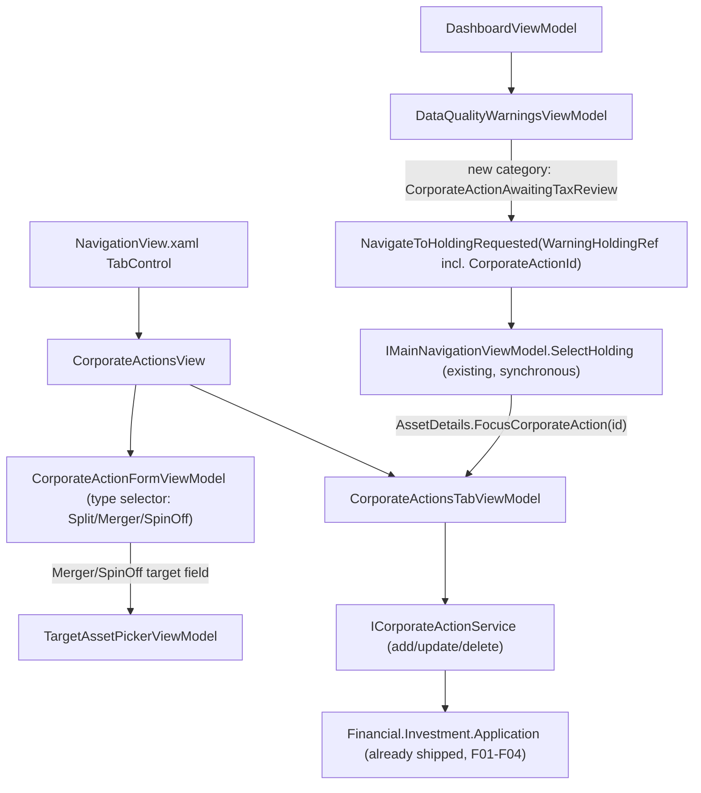

## 1. Technical Overview

**What:** Port F05's already-shipped React Corporate Actions experience into `Financial.App` (WPF): three type-specific entry forms (Split, Merger, Spin-off) on a new "Corporate Actions" asset-detail tab with a history list, a shared search-or-create-inline target-asset control used by Merger and Spin-off, a Merger confirmation step, a Spin-off live cost-basis-split preview, and a fourth dashboard data-quality warning category with click-through that selects the affected holding and focuses the Corporate Actions tab.

**Why:** F01-F04 already shipped the entire Investment Application layer this feature needs — `ICorporateActionService`/`ICorporateActionQueryService`, `AssetDetailsDTO.CorporateActions`, `DataQualityReportDTO.CorporateActionsAwaitingTaxReview` — and `Financial.App` already composes that Application layer in-process via `services.AddFinancialApplication()` (`App.xaml.cs:54`), the same DI extension the API uses. F06 adds no new backend surface and needs no HTTP client: it is a pure Presentation-layer (WPF) vertical slice consuming what already exists, following the same established `Financial.App` patterns `TransactionsTabViewModel`/`TransactionDialogViewModel` (inline form + validation), `DisposalsTabViewModel` (asset-scoped read-only history), and `DataQualityWarningsViewModel`/`DashboardViewModel.NavigateToHolding` (dashboard click-through) already establish. `docs/rules/ui.md`'s "Scope of compliance" and `Financial.App/CLAUDE.md`'s WPF invariants require this to preserve F05's task sequence, terminology, field order, validation wording, and outcomes — platform-native control adaptation only.

**Scope:**
- Included: a `CorporateActionsTabViewModel` (mirroring `TransactionsTabViewModel`'s inline-form + history shape) with a `CorporateActionFormViewModel` (mirroring `TransactionDialogViewModel`'s Add/Update/validation/`CloseRequested` shape) offering all three types via a type selector that swaps the visible field group; a shared `TargetAssetPickerViewModel`/control (search-existing-or-create-inline, the WPF-native equivalent of React's `TargetAssetPicker` — no existing WPF precedent, built new) used by Merger's Target Asset and Spin-off's New Asset fields; a two-step fields/confirm flow inside the Merger form; a live cost-basis-split preview inside the Spin-off form; wiring the new tab into `NavigationView.xaml`'s asset-detail `TabControl`; adding the fourth warning category to `DataQualityWarningsViewModel` with click-through that both selects the holding (existing `IMainNavigationViewModel.SelectHolding` mechanism) and focuses the specific record on the new tab (small extension to `WarningHoldingRef` and `AssetDetailsViewModel`'s tab-selection state — no router-state race to correct here, since WPF has no router: the whole chain is a synchronous in-process method call, not React's async navigation).
- Excluded (already shipped, F01-F05): every Domain/Application/Infrastructure/API change, and every React/`Financial.Web` change — F06 reads/writes only through the already-shipped Application-layer interfaces, and treats F05's shipped UX (terminology, field order, validation wording, states) as the source of truth to match, not to redesign.
- Excluded (documented platform difference, not a gap): per-field validation display. Every existing WPF form (`TransactionDialogViewModel`, and by the same convention `CreditDialogViewModel`/price-entry) shows one combined `ValidationMessage` string, not React's per-field `saveErrorFields` — confirmed by grepping the whole `Views/Investment`+`ViewModels/Investment` tree for `Validation.ErrorTemplate`/per-field error styling (zero matches anywhere). Corporate Actions forms follow this established WPF convention: the error **text** matches React's messages/field-blocking rules exactly, only the **display mechanism** is WPF's own single-message banner. See §4 Technical Decisions.

## 2. UX Workflow Assessment

*(`fluent-ui` skill + `docs/ui/wpf.md` + `Financial.App/CLAUDE.md` read in full before this section was written. React (`Financial.Web`) is the UX source of truth per those docs — F05's shipped `CorporateActionForm.tsx`/`CorporateActionsTab.tsx`/`DataQualityWarningsPanel.tsx` were re-read as the target to match, not redesigned.)*

**User task:** Same as F05 — record a rare, high-consequence event against a holding from the desktop app, with the same terminology/field order/validation the user already learned in the browser.

**Current WPF behavior:** None exists yet — `CorporateAction*` has zero matches anywhere under `Financial.App`. This is a fresh build against the F05 target, not a gap analysis of existing WPF code.

**Information hierarchy:** `NavigationView.xaml`'s asset-detail `TabControl` (`Summary | Holdings* | Transactions | Credits | Price History* | Disposals*` — `*` = asset-only, gated by `AssetDetails.IsAssetView`, lines 181-204) gains a seventh, asset-only tab, "Corporate Actions", positioned last (after Disposals, index 6) — matching React's tab order exactly, for the same reason: least-frequently-touched, placed at the end of the "day-to-day entry → results/audit" sequence. Inside the tab: a "New Corporate Action" trigger above the history grid (matching `TransactionsView.xaml`'s existing create-trigger position), the inline form appears between the trigger and the grid when open, the history grid always renders below.

**Primary and secondary actions:** Primary: "New Corporate Action" (opens the inline form), and the form's own Confirm action — labeled generically ("Add Corporate Action"/"Save"), never type-specific, mirroring `TransactionDialogViewModel.ConfirmLabel`'s mode-driven (not type-driven) labeling and F05's own naming-consistency reasoning. Secondary: per-row Edit/Delete actions in the grid's trailing column, matching `TransactionsView.xaml`'s existing row-action pattern (Corporate Actions are user-editable/deletable per F04, unlike Disposals' read-only rows).

**Field order and grouping:** Identical to F05's already-shipped order (see F05's `spec.md` §2, ported verbatim — not re-derived):
- **Split:** Effective Date, Ratio (paired "New units"/"Old units" number inputs), Note.
- **Merger:** Effective Date, Source Asset (read-only), Target Asset (`TargetAssetPickerViewModel`), Exchange Ratio, Cash-in-Lieu Amount (optional), Note → confirmation step.
- **Spin-off:** Effective Date, Parent Asset (read-only), New Asset (`TargetAssetPickerViewModel`), Quantity Received, Allocation % (with a help affordance equivalent to React's `InfoLabel`), live preview, Note.
- All three use `docs/ui/decisions/ADR-002-responsive-form-layout.md`'s 4-column `Grid` (label-above-control per field), per `docs/ui/wpf.md` §Layout — not the older single-column label-left layout.

**Inline vs. dialog vs. window:** Inline form, per ADR-003/`docs/ui/forms-data-and-visualisations.md`'s "inline forms not popup dialogs" rule, using the already-established WPF conversion pattern documented in `docs/ui/wpf.md` §Dialogs and contextual UI: keep the `*DialogViewModel` shape (state/validation/`ConfirmCommand`/`CancelCommand`/`CloseRequested` — "dialog" in the name is historical, not literal), host it via `IsFormOpen`/`FormViewModel` properties + a `TaskCompletionSource` instead of `new XDialog(vm){Owner=...}.ShowDialog()`. The Merger confirm step is a second in-place state inside the same form VM (`IsConfirmStep` bool, mirroring `HasQuantityEffect`'s existing visibility-toggle mechanism in `TransactionFormView.xaml:75,84`), not a second window — matching React's `formStep: 'fields' | 'confirm'` decision and its own reasoning (the confirmation *is* the row-populating action, just split into two screens of the same task).

**Required states:** Initial/Loading/Empty/Validation/Server-error/Saving/Success/Disabled — same set F05 already defined, expressed through WPF's existing conventions: a busy indicator during save (`IsSaving`, disabling `ConfirmCommand`'s `CanExecute`), the combined `ValidationMessage` banner for both client and server-side rejections (§1 Excluded), entered values preserved on a failed save via `ReportSubmitFailed`+re-show-same-VM-instance (`TransactionsTabViewModel`'s `RetrySameFormAsync` pattern, `TransactionsTabViewModel.cs:476`) rather than discarding and rebuilding the form.

**Responsive/adaptive behavior:** The shared 4-column form `Grid` already reflows per ADR-002; the history grid's Note column uses `TruncatedColumnTextStyle` (`App.xaml`) per `docs/ui/wpf.md`'s "free-text column" rule — never `TextWrapping="Wrap"`, never left unstyled.

**Accessibility and focus:** Visible `TextBlock` labels above each control (ADR-002's label-above-control shape already carries this), `AutomationProperties.Name` on any control whose purpose isn't obvious from a visible label (the target-asset search box, the confirm-step summary region), focus moves to the form's first field when it opens (matching `TransactionFormView`'s existing behavior — no special handling needed), and the dashboard warning's click-through focus lands on the newly-selected Corporate Actions tab's grid region once the tab switch completes (no scroll/highlight-fade choreography needed the way React's did — WPF's `DataGrid.ScrollIntoView`+`Focus()` on the matching row, done once per navigation, since there is no async race to guard against here; see §4).

**API contract implications:** None — every DTO F06 needs (`CorporateActionDTO`, `CorporateActionSplitCreateDTO`/`UpdateDTO`, `CorporateActionMergerCreateDTO`/`UpdateDTO`/`ResultDTO`, `CorporateActionSpinOffCreateDTO`/`UpdateDTO`/`ResultDTO`, `CorporateActionDeleteDTO`, `CorporateActionAwaitingTaxReviewFinding`) already exists in `Financial.Investment.Application.DTOs`, consumed directly (same assembly reference, no serialization boundary) — confirmed via direct file reads, not assumed from the PRD.

**Files and tests affected:** See §4 (Component Overview) and §7 (Testing Strategy); PR slicing is in `plan.md`.

## 3. Architecture Impact

**Affected components:**
- `Financial.App/ViewModels/Investment/CorporateActionsTabViewModel.cs` — new
- `Financial.App/ViewModels/Investment/CorporateActionFormViewModel.cs` — new
- `Financial.App/ViewModels/Investment/TargetAssetPickerViewModel.cs` — new
- `Financial.App/Views/Investment/CorporateActionsView.xaml(.cs)` — new
- `Financial.App/Views/Investment/CorporateActionFormView.xaml(.cs)` — new
- `Financial.App/Controls/TargetAssetPickerControl.xaml(.cs)` — new (or `Views/Investment/`, matching whichever the codebase's existing reusable-control convention turns out to be — see plan Stage 2)
- `Financial.App/ViewModels/Investment/AssetDetailsViewModel.cs` — modified (compose `CorporateActions`, extend tab-index selection for deep-link focus)
- `Financial.App/ViewModels/Investment/IAssetDetailsViewModel.cs` — modified (expose the new tab VM + focus entry point)
- `Financial.App/Components/NavigationView.xaml` — modified (new `TabItem`)
- `Financial.App/ViewModels/Investment/Dashboard/DataQualityCategory.cs` — modified (new enum value)
- `Financial.App/ViewModels/Investment/Dashboard/WarningHoldingRef.cs` — modified (optional `CorporateActionId`)
- `Financial.App/ViewModels/Investment/Dashboard/DataQualityWarningsViewModel.cs` — modified (new category branch)
- `Financial.App/ViewModels/Investment/Dashboard/DashboardViewModel.cs` — modified (thread `CorporateActionId` through `NavigateToHolding`/`TrySelect`)
- `Financial.App/ViewModels/Investment/IMainNavigationViewModel.cs` — unchanged (`AssetDetails` is already exposed; no signature change needed — see §4 Technical Decisions)

## 4. Technical Decisions

| Decision | Chosen Approach | Alternative Considered | Trade-off |
|---|---|---|---|
| Validation display | One combined `ValidationMessage` string (matching `TransactionDialogViewModel` exactly), message text/wording identical to React's | Genuine per-field validation (new WPF mechanism) | Confirmed by the user during spec interview: match the established WPF convention every existing form uses today rather than introduce a first-of-its-kind per-field mechanism for one feature; the *content* still matches React field-for-field, only the *display* differs — consistent with CLAUDE.md's "equivalent does not mean identical controls" |
| Type selector control | A bound `SelectedType` (or three `IsSplit`/`IsMerger`/`IsSpinOff` derived bools) driving `Visibility` via the existing `BoolToVisibilityConverter`, the same mechanism `TransactionFormView.xaml:75,84` already uses for `HasQuantityEffect` | A `TabControl`-based type switcher | The visibility-toggle mechanism is already proven in this exact form family; a nested `TabControl` would also hit `docs/ui/wpf.md`'s documented "TabControl renders unthemed" gap for no benefit |
| Target-asset search-or-create widget | New `TargetAssetPickerViewModel` + control: an editable `ComboBox` (`IsEditable="True"`) bound to a filtered candidate list (mirrors React's `useAssetSearchOptions` — call the existing admin-asset query, filter client-side to current broker+portfolio, exclude the source/parent asset), with a `Visibility`-toggled panel of identity fields (ISIN/Exchange/Ticker/Country/Class — the same five React uses, no Local Type Code) shown when the typed name matches no candidate | Extending some existing combobox control | Grepped `Views/Investment` for `AutoCompleteBox`/editable-`ComboBox`/create-inline patterns: none exist. This is new UI with no WPF precedent to reuse or conflict with |
| Merger confirmation step | `IsConfirmStep` bool on `CorporateActionFormViewModel`, toggling the field-group panel vs. a summary panel via the same `BoolToVisibilityConverter` mechanism — not a second `Window`/dialog | A confirmation `Window` | No existing WPF dialog/form shows a computed-summary confirmation step; matches React's `formStep` decision (the confirmation is part of the same task, not a separate surface) and reuses the codebase's one existing conditional-visibility idiom instead of inventing a second one |
| Dashboard click-through → specific-record focus | Extend `WarningHoldingRef` with an optional `CorporateActionId`, carried unchanged through `SelectFindingCommand`/`NavigateToHoldingRequested`/`DashboardViewModel.NavigateToHolding`/`TrySelect`; after `IMainNavigationViewModel.SelectHolding` returns `true`, call a new `IAssetDetailsViewModel.FocusCorporateAction(Guid id)` method (using the `tree.AssetDetails` reference `TrySelect` already has in scope) that sets the tab index to Corporate Actions and hands the id to `CorporateActionsTabViewModel` for grid focus | Mimic React's router-state approach | Not applicable here: WPF has no router, so there is no async round-trip and no state-clearing race to correct (the exact bug F05's PR5 had to work around in React). `IMainNavigationViewModel` already exposes `AssetDetails` directly (`IMainNavigationViewModel.cs:5`) — a plain synchronous method call is the simplest correct mechanism, not a workaround |
| History grid Tax Status column | Reuse the existing `ResolveStatus(CalculationStatus)` resolver already used by `TaxWorkbookEntryRowViewModel` (`TaxWorkbookEntryRowViewModel.cs:41,67-71`) for the identical `Final`/`Incomplete`/`RequiresReview` → (background, foreground, symbol, label) mapping | Duplicate the color/icon/label mapping locally | PRD requires the same status label/styling P51 already uses; `ResolveStatus` already is that shared definition — reuse, don't re-derive |
| Remembered form defaults | None — Corporate Actions forms do not remember a last-used type/ratio, matching F05's explicit decision (ported, not re-derived): only Effective Date defaults to today | Remember last-used type/ratio like `TransactionsTabViewModel`'s `_lastUsedTransactionType` (`TransactionsTabViewModel.cs:54-55`) does | F05 already decided this for the identical reason (corporate actions are rare enough per-holding that a remembered value from an unrelated prior event is more likely wrong than helpful) — WPF parity means matching that decision, not re-opening it |

## 5. Component Overview

**ViewModels:**

| File Path | New/Modified | Purpose | Key Responsibilities |
|---|---|---|---|
| `Financial.App/ViewModels/Investment/CorporateActionsTabViewModel.cs` | New | Tab container | Owns `ObservableCollection<CorporateActionRowViewModel>` (rebuilt from `AssetDetailsDTO.CorporateActions` on load, matching `Disposals`' read source), `IsFormOpen`/`CorporateActionFormViewModel` inline-form toggle (matching `TransactionsTabViewModel`'s shape), Edit/Delete row commands calling `ICorporateActionService`, and a `FocusCorporateAction(Guid id)` entry point for the dashboard deep link |
| `Financial.App/ViewModels/Investment/CorporateActionFormViewModel.cs` | New | Inline entry form | Type selector (Split/Merger/SpinOff) driving which field-group panel is visible; Merger's `IsConfirmStep` two-step flow; Spin-off's live preview text (computed client-side from the already-loaded `AssetDetailsDTO.Quantity`/cost-basis fields, no service round-trip); delegates target-asset selection to `TargetAssetPickerViewModel`; same `Mode`/`ValidationMessage`/`ConfirmCommand`/`CancelCommand`/`CloseRequested`/`ReportSubmitFailed` shape as `TransactionDialogViewModel` |
| `Financial.App/ViewModels/Investment/TargetAssetPickerViewModel.cs` | New | Shared search-or-create widget | Editable-combobox candidate list (calls the existing admin-asset query service, filtered client-side); reveals identity fields (ISIN/Exchange/Ticker/Country/Class) when the typed name matches nothing; surfaces the server's 409 name-collision message through the same combined `ValidationMessage` mechanism |
| `Financial.App/ViewModels/Investment/AssetDetailsViewModel.cs` | Modified | Composition root | Constructs `CorporateActions = new CorporateActionsTabViewModel(corporateActionService, ...)` alongside the existing `Transactions`/`Credits`/`PriceHistory`/`Disposals` construction (same closures-for-context pattern, `AssetDetailsViewModel.cs:458-486`); extends the tab-index reset logic so a pending focus request selects index 6 instead of resetting to 0 |
| `Financial.App/ViewModels/Investment/IAssetDetailsViewModel.cs` | Modified | Composition contract | Exposes `CorporateActionsTabViewModel CorporateActions { get; }` and `void FocusCorporateAction(Guid id)` |
| `Financial.App/ViewModels/Investment/Dashboard/DataQualityWarningsViewModel.cs` | Modified | Dashboard warnings | New `BuildCategories` branch mapping `report.CorporateActionsAwaitingTaxReview` to a `WarningCategoryViewModel`, secondary text `"{type}, tax year {taxYear}"` (reusing the same type-label mapping F05 extracted — see below) |
| `Financial.App/ViewModels/Investment/Dashboard/WarningHoldingRef.cs` | Modified | Holding reference | Adds `Guid? CorporateActionId = null` (optional positional parameter, so every existing category's construction sites are unaffected) |
| `Financial.App/ViewModels/Investment/Dashboard/DashboardViewModel.cs` | Modified | Click-through | `TrySelect` calls `tree.AssetDetails.FocusCorporateAction(holding.CorporateActionId.Value)` when `SelectHolding` succeeds and `CorporateActionId` is set |
| `Financial.App/ViewModels/Investment/Dashboard/DataQualityCategory.cs` | Modified | Category enum | Adds `CorporateActionAwaitingTaxReview` |

**Views:**

| File Path | New/Modified | Purpose | Key Responsibilities |
|---|---|---|---|
| `Financial.App/Views/Investment/CorporateActionsView.xaml(.cs)` | New | Tab content | "New Corporate Action" trigger, inline form host (`Grid` wrapper bound to `IsFormOpen` at the *parent's* DataContext, per `docs/ui/wpf.md`'s documented DataContext+Visibility pitfall — never set both on the same element), history `DataGrid` with Date/Type/Affected-Linked-Asset/Resulting-Change/Tax-Status/Actions columns, each `DataGridTextColumn` using the shared `PlainColumnTextStyle`/`NumericColumnTextStyle`/`TruncatedColumnTextStyle` `ElementStyle`s (`docs/ui/wpf.md`'s row-height rule) |
| `Financial.App/Views/Investment/CorporateActionFormView.xaml(.cs)` | New | Inline form | 4-column `Grid` per ADR-002, field groups toggled via `BoolToVisibilityConverter`, Merger confirm-step panel, Spin-off live-preview `TextBlock` (bold value via a separate `Text` binding, not `<Run>`, per `docs/ui/wpf.md`) |
| `Financial.App/Controls/TargetAssetPickerControl.xaml(.cs)` | New | Shared widget view | Editable `ComboBox` + conditionally-visible identity-field panel |
| `Financial.App/Components/NavigationView.xaml` | Modified | Tab host | New `TabItem Header="Corporate Actions"` after `Disposals` (index 6), `Visibility` gated on `AssetDetails.IsAssetView` like `PriceHistory`/`Disposals` |

## 6. Data Model

No new persisted data and no new client-side data shape — this is a pure Presentation-layer feature consuming already-persisted, already-DTO'd Investment Application data in-process. `WarningHoldingRef`'s new `CorporateActionId` field is the only new "shape," and it is an ephemeral in-memory record used for one synchronous method call, not a stored/serialized model.

## 7. Consumed Application-Layer Contracts (already shipped, F01-F04)

No new Application-layer interface or DTO is introduced by this feature. F06 consumes exactly what F01-F04 already shipped, referenced directly (same .NET assembly, no serialization boundary):

| Interface / Member | DTO(s) | Consumed by |
|---|---|---|
| `ICorporateActionService.AddSplitAsync`/`UpdateSplitAsync` | `CorporateActionSplitCreateDTO`/`UpdateDTO` → `AssetDetailsDTO?` | Split form save |
| `ICorporateActionService.AddMergerAsync`/`UpdateMergerAsync` | `CorporateActionMergerCreateDTO`/`UpdateDTO` → `CorporateActionMergerResultDTO?` | Merger form save (after confirm step) |
| `ICorporateActionService.AddSpinOffAsync`/`UpdateSpinOffAsync` | `CorporateActionSpinOffCreateDTO`/`UpdateDTO` → `CorporateActionSpinOffResultDTO?` | Spin-off form save |
| `ICorporateActionService.DeleteCorporateActionAsync` | `CorporateActionDeleteDTO` → `AssetDetailsDTO?` | History grid row Delete action |
| `AssetDetailsDTO.CorporateActions` | `List<CorporateActionDTO>` | History grid, and `AssetDetailsDTO`'s own quantity/cost-basis fields for Merger/Spin-off preview text |
| Existing admin-asset query (already used elsewhere in WPF) | Admin asset list | `TargetAssetPickerViewModel`'s existing-asset candidate list |
| `DataQualityReportDTO.CorporateActionsAwaitingTaxReview` | `IReadOnlyList<CorporateActionAwaitingTaxReviewFinding>` (`BrokerName`, `PortfolioName`, `AssetName`, `CorporateActionId`, `Type`, `EffectiveDate`, `TaxYear`) | `DataQualityWarningsViewModel`'s new category |

Verified against `Financial.Investment.Application/DTOs/*.cs` and `Interfaces/ICorporateActionService.cs`/`ICorporateActionQueryService.cs` directly (not assumed from the PRD or from F05's React types) — field names above match the real C# DTOs exactly (`CorporateActionMergerCreateDTO.TargetAssetName`/`CreateTargetAssetInline`/`TargetISIN`/`TargetExchange`/`TargetTicker`/`TargetCountry`/`TargetLocalTypeCode`/`TargetClass`, `CorporateActionSpinOffCreateDTO`'s equivalent `New*` fields, `CorporateActionDTO.Role`/`LinkedAssetName`/`ConvertedQuantity`/`CarriedCostBasis`/`AllocationPercentage`/`CalculationStatus`).

## 8. Testing Strategy

Per `testing-guide-Financial`: this is a `Financial.App` (WPF)-only feature — `Financial.Presentation.Tests` ViewModel tests, following the existing per-ViewModel test-class convention. No Domain/Application/Infrastructure tests (nothing changed there). Selection-driven tests must go through `TreeNodeViewModel.IsSelected = true`, never direct `SelectedNode` assignment, per this codebase's established WPF VM-testing convention (`MainNavigationViewModelMoveTests.cs`, `TreeNodeViewModelTests.cs`).

| Test File | Test Type | Target | Coverage Goal |
|---|---|---|---|
| `Tests/Financial.Presentation.Tests/ViewModels/Investment/CorporateActionsTabViewModelTests.cs` | Unit | `CorporateActionsTabViewModel` | Load/rebuild from `AssetDetailsDTO.CorporateActions`; inline-form open/edit/cancel; save (add/update) success and server-rejection-preserves-entered-values paths for all three types; delete success/failure; `FocusCorporateAction` selects the matching row |
| `Tests/Financial.Presentation.Tests/ViewModels/Investment/CorporateActionFormViewModelTests.cs` | Unit | `CorporateActionFormViewModel` | Type selector swaps visible field groups correctly (only relevant fields per type, matching F05's AC); Split ratio N/M-to-factor conversion; Merger's `IsConfirmStep` two-step flow (Back preserves entered values); Spin-off's live preview text; combined `ValidationMessage` covers every client-side and server-side rejection case F05 already covers per-field |
| `Tests/Financial.Presentation.Tests/ViewModels/Investment/TargetAssetPickerViewModelTests.cs` | Unit | `TargetAssetPickerViewModel` | Search filters existing candidates to current broker+portfolio, excluding the source/parent asset; typing an unmatched name reveals identity fields; server-side name-collision message surfaces via `ValidationMessage` |
| `Tests/Financial.Presentation.Tests/ViewModels/Investment/Dashboard/DataQualityWarningsViewModelTests.cs` (existing file, extended) | Unit | New category | `CorporateActionAwaitingTaxReview` category builds from `report.CorporateActionsAwaitingTaxReview`; `SelectFindingCommand` raises `NavigateToHoldingRequested` with the finding's `CorporateActionId` set on `WarningHoldingRef` |
| `Tests/Financial.Presentation.Tests/ViewModels/Investment/Dashboard/DashboardViewModelTests.cs` (existing file, extended) | Unit | Click-through | `NavigateToHolding` with a `CorporateActionId`-bearing `WarningHoldingRef` calls `FocusCorporateAction` on the tree that successfully selected the holding, and does not call it when `CorporateActionId` is null |
| `Tests/Financial.Presentation.Tests/ViewModels/Investment/AssetDetailsViewModelTests.cs` (existing file, extended) | Unit | Tab composition + focus | `CorporateActions` is constructed and wired the same way `Transactions`/`Credits` are; `FocusCorporateAction` sets `SelectedDetailTabIndex` to the Corporate Actions tab instead of resetting to 0 |

**Acceptance-test traceability (PRD §9 F06):**
- "Every F01–F04 capability is available in `Financial.App` with equivalent terminology, field order, and validation" → `CorporateActionFormViewModelTests.cs` (field order/terminology assertions mirror F05's own `CorporateActionForm.test.tsx` assertions, ported), `CorporateActionsTabViewModelTests.cs` (history)
- "The WPF Corporate Actions view composes the Investment Application layer in-process, with no HTTP call" → `AssetDetailsViewModelTests.cs` (constructor composition), verified structurally (no `HttpClient`/API-client dependency anywhere in the new ViewModels — confirmed by construction signature alone, not a runtime network-call test)
- "A dashboard warning's click-through navigates to the correct holding in the WPF app" → `DataQualityWarningsViewModelTests.cs` + `DashboardViewModelTests.cs`

**Cross-Feature Integration traceability:**
- "F06 renders the same data F05 does for the same recorded corporate action, verified side by side against the same backend, matching the parity verification standard P52 already established" → not a single automated test; per P52's own established parity-verification standard, this is a manual side-by-side check (same seeded data, React and WPF open together) performed once per PR slice before merge, documented in the PR description — matching how P51/P52's own WPF-parity PRs verified this.
