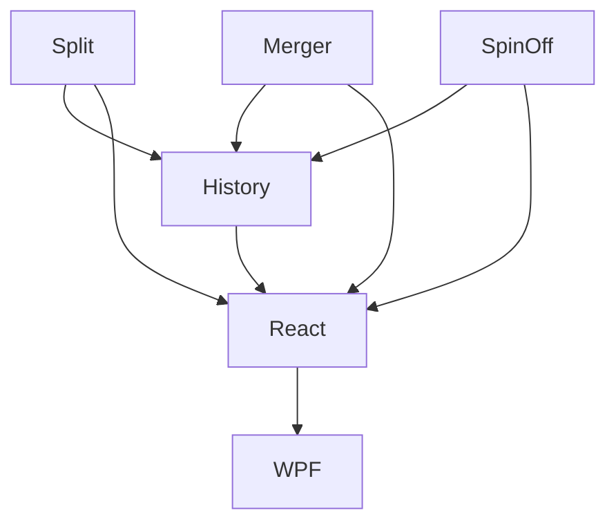

# Corporate Actions

## 1. Executive Summary

Corporate Actions closes the last open gap in the Investment bounded context's calculation core: splits, reverse splits, mergers and spin-offs currently have no representation at all, so any of them happening on a real holding would silently corrupt quantity, average cost and every downstream figure (market value, unrealised gain, XIRR, tax classification) derived from it.

The product is for the same single self-directed investor this whole programme already serves, managing a multi-broker, multi-currency (BRL + GBP) personal portfolio across `Financial.Web` and `Financial.App`. Corporate actions are rare — most holdings will never have one — but when one happens, getting it wrong is worse than not tracking it: an unrescaled split doubles or halves every subsequent return calculation, and an unmodelled merger leaves a position that no longer matches the broker statement.

The core value is a small, explicit `CorporateAction` record — split/reverse split, merger, or spin-off — recorded against the affected holding(s), applied at its effective date through the same date-ordered replay that already owns quantity and average cost (`Transactions.Recompute`, per the Investment calculation core delivered in P46), and left as an auditable input alongside transactions rather than a one-off silent edit. Recording, editing or deleting a corporate action re-triggers the same replay pipeline a transaction edit already does; anything it changes downstream (a `DisposalRecord`, a `TaxClassification`) follows the existing supersede-never-rewrite policy already shipped in P50/P51 — Wave 7 adds no new recalculation policy, it adds the missing input.

## 2. Problem and Opportunity

**The Problem**

- **Silent data corruption on a real, ordinary market event.** A 2-for-1 split on a holding the user already owns has zero representation today — the next price fetch after the split reports half the price with no adjustment to quantity, so market value, unrealised gain and XIRR all become wrong from that date forward until someone notices and hand-edits the position.
- **No way to record a merger or spin-off at all.** When a held company is acquired (stock-for-stock) or spins off a division, the user's only option today is to manually zero out the old holding and manually create a new one with a guessed cost basis — losing the audit trail P50/P51 built for exactly this kind of event.
- **Tax classification blind spot.** P51 classifies every disposal and qualifying income event with a jurisdiction and calculation status, but a merger or spin-off exchange has no event type to classify into — it would either be missed entirely or misfiled as an ordinary taxable sale, which is usually wrong (most stock-for-stock exchanges carry over cost basis rather than triggering a disposal).
- **Rare enough to be forgotten, consequential enough to matter.** Because these events happen infrequently, there is no operational habit of checking for them, and the error compounds silently until a return figure looks obviously wrong.

**The Opportunity**

Recording splits, mergers and spin-offs as first-class, auditable events — problem 1 and 2 — keeps quantity, cost basis and every return figure correct going forward without ever touching an already-filed `DisposalRecord`, reusing the replay machinery that already exists rather than adding a parallel recalculation path. Defaulting merger/spin-off tax status to "requires review" and surfacing it on the P52 dashboard — problem 3 and 4 — turns a silent blind spot into a visible, click-through-able item the same way an unclassified holding already is, so nothing gets forgotten.

## 3. Target Audience

### Primary Users

**Self-Directed Multi-Broker Investor**
- Holds shares, ETFs, bonds and funds across Brazilian (XPI) and UK (Trading 212, Coinbase, FreeTrade) brokers, already tracked in this system since Wave 0.
- Occasionally holds a security that undergoes a split, is acquired, or spins off a division — infrequent, but expects the resulting position to match their broker statement exactly, not an approximation.
- Already uses the P50 disposals view and P51 tax workbook to keep an auditable record of every taxable event, and expects a corporate action to fit the same standard rather than being a manual workaround.

## 4. Objectives

**Product Objectives**

- **Eliminate silent corruption from unrecorded splits.** Every split/reverse split recorded results in a position that exactly matches the post-split reality (quantity and average cost), for both `AverageCost` and lot-based (`FIFO`/`SpecificId`) holdings.
- **Make mergers and spin-offs recordable without losing the audit trail.** Every merger/spin-off produces a linked, auditable `CorporateAction` record and correctly carries or splits cost basis to the resulting holding(s), instead of a manual zero-and-recreate workaround.
- **Close the tax classification blind spot for corporate actions.** Every merger and spin-off produces a `TaxClassification` with an honest status, defaulting to requires-review rather than silently omitted or silently filed as an ordinary disposal.
- **Preserve immutability guarantees already shipped.** Recording, editing or deleting a corporate action never rewrites an already-created `DisposalRecord` or `TaxClassification` — it supersedes, exactly as P50-F03/P51 already do for a transaction edit.

**Success Metrics**

- 100% of split/reverse-split recordings produce a quantity and average cost matching the broker-reported post-split figures, verified against at least 3 synthetic test scenarios (2-for-1, 3-for-1 reverse, and a split on a `FIFO`-costed holding with 2+ open lots) before the feature ships.
- 100% of merger and spin-off recordings that touch a holding with an existing `DisposalRecord` or `TaxClassification` leave those records unmodified (verified by an automated regression test asserting record IDs and content are byte-identical before/after).
- 0 corporate-action-driven regressions in the existing 76-PR Investment test suite baseline (P46–P52) after this wave ships.
- Every merger/spin-off with no matching admin `TaxRule` appears in the P52 dashboard data-quality warnings within the same recompute that created it — no delay, no manual refresh required.

## 5. User Stories

### F01. Split and Reverse Split
- As a user, I want to record a split or reverse split on a holding with an effective date and a ratio so that my quantity and average cost stay correct without me hand-editing the position
- As a user, I want the split to apply before any transaction dated the same day so that a same-day buy or sell is priced against the already-adjusted average cost
- As the system, I want a split on a `FIFO`- or `SpecificId`-costed holding to proportionally rescale every open lot so that a later disposal against those lots still totals the correct cost basis
- As a user, I want to be prevented from recording a split on a holding with zero quantity so that I cannot rescale a position that does not exist

### F02. Merger
- As a user, I want to record a merger converting my holding in Company A into shares of Company B, with an exchange ratio and effective date, so that my position reflects what my broker actually did
- As a user, I want to search for or create the target asset inline while recording the merger so that I don't have to leave the flow to set up Company B first
- As a user, I want the merger to carry my original cost basis on Company A over to Company B rather than recording a taxable sale, so that my tax figures aren't wrong by default
- As a user, I want to note a small cash-in-lieu-of-fractional-shares amount on the merger record so that it's documented even though it isn't automatically classified as a disposal
- As the system, I want every merger to produce a `TaxClassification` defaulting to requires-review, linked back to the merger record, so that the user is never silently given a wrong tax status

### F03. Spin-off
- As a user, I want to record a spin-off creating a new holding from an existing one, with an effective date and a cost-basis allocation percentage, so that both holdings end up with an honest split of my original cost
- As a user, I want to search for or create the new spun-off asset inline while recording the spin-off, the same way I would for a merger
- As the system, I want the allocation percentage to proportionally reduce every open lot on the parent holding so that a `FIFO`/`SpecificId`-costed parent stays internally consistent after the spin-off
- As the system, I want the new spin-off holding to produce a `TaxClassification` defaulting to requires-review, the same as a merger

### F04. Corporate Action History and Data-Quality Integration
- As a user, I want to see every corporate action recorded against a holding, in date order, alongside its type and resulting quantity/cost-basis change, so that I have one audit trail for what happened to the position
- As a user, I want to edit or delete a corporate action and have the position recompute correctly, the same way editing a transaction already does, so that I can correct a data-entry mistake without side effects
- As a user, I want a merger or spin-off still awaiting tax review to appear as a dashboard data-quality warning with click-through to the affected holding, so that I don't forget to resolve it
- As the system, I want editing or deleting a corporate action to never directly rewrite an existing `DisposalRecord` or `TaxClassification`, only to trigger the same supersede policy an edited transaction already triggers

### F05. React Entry and Display
- As a user, I want a "Corporate Actions" section on the holding view where I pick a type (Split/Reverse Split, Merger, Spin-off) and see only the fields relevant to that type
- As a user, I want the target-asset field on a merger or spin-off form to let me search existing assets or create a new one inline, using the same identity fields as the existing Add Asset form
- As a user, I want to see the corporate action history list for a holding the same way I already see its disposal history
- As a user, I want a corporate action's data-quality warning on the dashboard to take me straight to this view when I click it

### F06. WPF Parity
- As a user, I want the same corporate action recording, history and dashboard warning click-through in `Financial.App` as in `Financial.Web`, with the same terminology, field order and validation, so my desktop workflow matches my browser workflow

## 6. Functionalities

### F01. Split and Reverse Split

**Provides:**
- Recorded split/reverse-split `CorporateAction` events with their effective date, ratio, and the affected asset (used by F04)

**Capabilities:**
- A split/reverse-split record has: affected asset, effective date, ratio expressed as a decimal factor (e.g. 2-for-1 split = factor `2.0`, 1-for-10 reverse split = factor `0.1`), and an optional free-text note/source reference (max 500 characters).
- Ratio factor must be a positive number other than exactly `1.0` (a no-op split is rejected as invalid).
- Applying the event: `Quantity → Quantity × factor`, `AveragePrice → AveragePrice ÷ factor` — total cost basis (`Quantity × AveragePrice`) is unchanged by construction. No cash effect, no realised gain/loss, no `DisposalRecord` is created.
- The event is an input to the same date-ordered replay (`Transactions.Recompute`) that already owns position figures — it sits at its effective date and is applied **before** any transaction dated the same day, consistent with the existing purchases-before-sales same-date convention.
- For a holding costed via `FIFO` or `SpecificId`, every currently open lot's quantity and unit cost are rescaled by the same factor (`Quantity × factor`, `UnitCost ÷ factor`) so total lot cost stays unchanged and a later disposal against those lots totals correctly.
- Historical `AssetPriceSnapshot` entries are **not** retroactively adjusted — price history before the effective date remains exactly as recorded, and a chart spanning the split date will show the raw pre-split price alongside the post-split-adjusted quantity/average cost. This is a deliberate simplification (see §7 Out of Scope).
- Rejected if the holding's quantity at the effective date (after replaying everything up to that point) is zero — there is no position to rescale.
- Recording, editing or deleting a split re-triggers the same replay pipeline as editing a transaction; any `DisposalRecord` created from a later disposal that consumed post-split lots is recomputed under the existing supersede-never-rewrite policy (P50-F03), unchanged by this feature.

**Experience:**
- Entry form (on the holding's detail view) with three fields: Effective Date, Ratio (entered as "N-for-M", converted to the decimal factor), optional Note. Ratio examples shown inline ("2-for-1 split", "1-for-10 reverse split") to avoid factor-direction confusion.
- On save, the holding's quantity/average cost update immediately and the corporate action appears in the F04 history list.
- Attempting to record a split on a zero-quantity holding shows an inline validation error: "This holding has no open position to split."
- A validation error on the effective date order (a split dated before the holding's very first transaction) is rejected the same way an out-of-range transaction date already is.

**Error Handling:**
- **Invalid ratio (factor ≤ 0 or exactly 1.0):** inline field error, "Enter a valid split ratio other than 1-for-1", save blocked.
- **Zero-quantity holding at effective date:** inline error as above, save blocked, no partial state persisted.
- **Concurrent edit conflict (two saves against the same holding's position in quick succession):** the second save fails with a clear "This holding changed since you loaded it — reload and try again" message, matching the existing transaction-save conflict pattern; no silent overwrite.
- **Recompute failure after delete (e.g. a downstream lot allocation becomes invalid):** the delete is rejected with the specific reason ("Cannot delete: a later disposal depends on lots created by this split") rather than silently leaving the position inconsistent.

### F02. Merger

**Provides:**
- Recorded merger `CorporateAction` events linking a source and target asset, with carried-over cost basis and a linked `TaxClassification` (used by F04)

**Capabilities:**
- A merger record has: effective date, source asset (the holding being converted), target asset (existing or newly created inline), exchange ratio (units of target received per unit of source, decimal, > 0), an optional cash-in-lieu-of-fractional-shares amount (decimal, ≥ 0, recorded as a note field only — not computed into any disposal), and an optional free-text note/source reference (max 500 characters).
- Target asset selection reuses the existing Add Asset identity fields (Name, ISIN, Exchange, Ticker, Country, Class) when creating inline; if the chosen name collides with an existing distinct asset, the existing `RegisterAsset` uniqueness-by-name rejection applies and the user must pick the existing asset or choose a different name.
- Applying the event at the effective date (before any same-day transaction, same convention as F01): source asset's quantity is reduced to zero and every open lot on it is closed (the position is fully converted, not partially); target asset's quantity increases by `source quantity × exchange ratio`, and the target's cost basis increases by the source's total cost basis at the effective date (a full carryover — no gain/loss is recognised on the converted amount).
- No `DisposalRecord` is created for the converted portion (non-taxable by default, per the recommendation this PRD was scoped against). The cash-in-lieu amount, if entered, is stored on the merger record only — it is not automatically turned into a disposal; the user reconciles it manually if their jurisdiction taxes it.
- A `TaxClassification` is created and linked to the merger record, jurisdiction derived the same way P51 already derives it for a disposal — from the transaction/event's own currency (BRL → BR, other → UK; `CountryCode` is not consulted, consistent with D7) — with calculation status `RequiresReview` unless a matching dated, admin-configured `TaxRule` for the corporate-action event category already exists.
- Recording, editing or deleting a merger re-triggers the same replay pipeline as editing a transaction on either asset; a `DisposalRecord` that already existed on the source asset before the merger (from an earlier ordinary sale) is left untouched — it predates the merger and is never in scope for recomputation by it.

**Experience:**
- Entry form: Effective Date, Source Asset (pre-filled from the holding the user is on), Target Asset (search-existing-or-create-inline widget, same identity fields as Add Asset), Exchange Ratio, optional Cash-in-Lieu Amount, optional Note.
- A confirmation step summarises the effect before saving: "Your position in {source} (X units) will close and convert into Y units of {target}, carrying over £Z of cost basis." — since this is irreversible-in-spirit (closes a position), the confirmation step is mandatory, matching other position-closing actions in the app.
- After saving, both the source (now zero quantity, historic) and target (new/increased quantity) holdings reflect the change immediately, and the merger appears in both holdings' F04 history.
- The resulting `TaxClassification`'s requires-review status is visible on the holding's tax detail view, using the same status label/styling P51 already uses.

**Error Handling:**
- **Target asset name collides with an existing distinct asset:** inline error, "An asset named '{name}' already exists — select it or choose a different name", save blocked.
- **Source holding has zero quantity at effective date:** inline error, "This holding has no open position to convert", save blocked.
- **Exchange ratio ≤ 0:** inline field error, save blocked.
- **Concurrent edit conflict on either the source or target asset:** same reload-and-retry message as F01, no partial write across the two assets (the merger record and both position updates are written atomically or not at all).

### F03. Spin-off

**Provides:**
- Recorded spin-off `CorporateAction` events linking a parent and new asset, with a user-entered cost-basis allocation and a linked `TaxClassification` (used by F04)

**Capabilities:**
- A spin-off record has: effective date, parent asset, new asset (existing or newly created inline, same widget as F02), quantity of the new asset received (decimal, > 0), cost-basis allocation percentage transferring from parent to new asset (decimal, 0–100 inclusive), and an optional free-text note/source reference (max 500 characters).
- Applying the event at the effective date (before any same-day transaction): the parent's quantity is **unchanged** (a spin-off does not reduce the parent's unit count); the parent's total cost basis is reduced by `allocation% × current total cost basis`, and its average price is recalculated as `new total cost basis ÷ unchanged quantity`. The new asset's quantity increases by the entered received quantity, with unit cost `(allocation% × parent's pre-spin-off total cost basis) ÷ quantity received`.
- For a `FIFO`/`SpecificId`-costed parent, the allocation percentage is applied proportionally to every currently open lot (`UnitCost × (1 − allocation%)` per lot), so the parent's lot-level bookkeeping stays internally consistent for later disposals.
- No `DisposalRecord` is created on the parent — reducing cost basis without reducing quantity is not a disposal.
- A `TaxClassification` is created and linked to the spin-off record for the new asset, same jurisdiction-derivation and requires-review-by-default rule as F02.
- Allocation of exactly `0%` is a valid input (the new holding is recorded with zero cost basis, all original cost stays on the parent) — the system does not compute the allocation itself; it is always the user's entered figure, since fair-market-value-at-spin-off-date is not derivable from data this system has.

**Experience:**
- Entry form: Effective Date, Parent Asset (pre-filled), New Asset (search-existing-or-create-inline), Quantity Received, Cost-Basis Allocation % (with inline help text: "Find this on your broker's cost-basis allocation letter for this spin-off"), optional Note.
- Live preview beneath the allocation field shows the resulting split in currency terms as the user types: "£X stays with {parent}, £Y moves to {new asset}."
- After saving, both holdings reflect the change immediately and the spin-off appears in both holdings' F04 history.

**Error Handling:**
- **Allocation percentage outside 0–100:** inline field error, save blocked.
- **Quantity received ≤ 0:** inline field error, save blocked.
- **Target asset name collision:** same message as F02.
- **Concurrent edit conflict:** same reload-and-retry message as F01/F02, atomic write across both assets.

### F04. Corporate Action History and Data-Quality Integration

**Consumes:**
- F01: split/reverse-split `CorporateAction` records (type, date, affected asset, ratio, resulting quantity/average-cost change)
- F02: merger `CorporateAction` records (type, date, source/target asset link, exchange ratio, carried-over cost basis, `TaxClassification` status)
- F03: spin-off `CorporateAction` records (type, date, parent/new asset link, allocation %, resulting cost-basis split, `TaxClassification` status)

**Provides:**
- Per-asset and portfolio-wide corporate action history/audit list (used by F05, F06)
- Pending-review corporate action data-quality warnings (used by F05, F06)

**Capabilities:**
- A single read endpoint returns every `CorporateAction` (all three types) for a given asset, ordered by effective date, each entry carrying its type, date, the field values captured at F01/F02/F03, and — for merger/spin-off — the linked `TaxClassification`'s current status.
- Any merger or spin-off whose linked `TaxClassification` status is `RequiresReview` is surfaced through the exact same data-quality-warning mechanism P52-F03 already exposes on the dashboard (missing price, stale valuation, unclassified holding, etc.) — a new warning category, "Corporate action awaiting tax review", added to that existing list, with click-through navigation to the affected holding, reusing the established pattern rather than a new panel.
- A warning clears automatically the moment an admin-configured `TaxRule` matching the event's jurisdiction and category exists and re-classifies it — no separate "acknowledge" action, consistent with how existing `TaxClassification` status already resolves.
- Editing or deleting a corporate action from the history list re-triggers the same replay pipeline as F01/F02/F03 describe; it never directly rewrites a `DisposalRecord` or `TaxClassification` — only the existing supersede policy (P50-F03) responds to what the recompute changes.

**Experience:**
- No new screen beyond what F05/F06 render — this feature is the API/Application surface both front ends consume.

### F05. React Entry and Display

**Consumes:**
- F01: split/reverse-split entry fields and validation rules
- F02: merger entry fields, target-asset search-or-create, validation rules
- F03: spin-off entry fields, target-asset search-or-create, validation rules
- F04: corporate action history list, pending-review data-quality warnings

**Capabilities:**
- A "Corporate Actions" section on the asset detail view, alongside the existing Transactions and Disposals tabs, with a type selector (Split/Reverse Split, Merger, Spin-off) that shows only the fields relevant to the selected type per F01/F02/F03.
- Target-asset search-or-create control shared between the Merger and Spin-off forms, reusing the existing Admin Add Asset field set.
- History list rendered the same way the existing Disposals tab renders `DisposalRecord`s — date, type, affected asset(s), resulting change — with edit/delete actions per F04.
- Dashboard data-quality warning entries for corporate actions (F04) link through to this section, scrolled/focused to the specific record.

**Experience:**
- Full state coverage per the UI invariants: loading (skeleton while history fetches), empty (no corporate actions yet — friendly empty state explaining what belongs here), validation (inline, per-field, as specified in F01–F03), saving (button shows progress, form disabled), success (toast + history list updates), server error (non-blocking banner, form data preserved, matching the existing "refused save doesn't discard what was typed" fix from P46), disabled (save button disabled until required fields are valid).
- Confirmation step for Merger (per F02) rendered as a review screen before the final save.

**Error Handling:**
- Every error condition listed under F01/F02/F03 surfaces as the described inline/field-level message; a server-side rejection (e.g. concurrent edit) surfaces as the shared conflict banner already used elsewhere in the app.

### F06. WPF Parity

**Consumes:**
- F01: split/reverse-split entry fields and validation rules
- F02: merger entry fields, target-asset search-or-create, validation rules
- F03: spin-off entry fields, target-asset search-or-create, validation rules
- F04: corporate action history list, pending-review data-quality warnings

**Capabilities:**
- Same three entry forms, history list, and dashboard warning click-through as F05, composed in-process via DI against the Investment Application layer (no HTTP round trip), consistent with how every prior wave's WPF parity feature already works.
- Same terminology, field order, and validation messages as React — platform-native control adaptation only (WPF form controls, WPF list/grid), never a different workflow.

**Experience:**
- Same state coverage as F05 (loading, empty, validation, saving, success, error, disabled), expressed through WPF's existing state-handling conventions (busy indicators, inline `ValidationError` styles already used by `TransactionDialogViewModel`).

**Error Handling:**
- Same error conditions and equivalent messages as F05.

## 7. Out of Scope

**Rights issues.** A rights issue (buying additional units at a discounted subscription price) is recorded as an ordinary Buy transaction with the subscription price — it needs no new mechanism and is not a feature in this wave.

**Retroactive correction of pre-existing, unrecorded historical events.** This wave is forward-looking; there are no known past splits/mergers/spin-offs in the current data that need retroactive correction. A user who discovers a past unrecorded event can record it dated in the past, but no bulk-migration or detection tool is provided.

**Retroactive split-adjustment of historical price snapshots.** `AssetPriceSnapshot` entries before a split's effective date are never rewritten; a price chart spanning the split date will show the raw discontinuity. Adjusting price history for continuous charting is a possible future enhancement, not in Wave 7.

**Automatic tax-due computation on corporate action events.** Consistent with D1 (§5 of the roadmap): the `TaxClassification` produced records jurisdiction and an honest calculation status; it never computes tax owed.

**Automatic detection or fetching of corporate action events from any price/data provider.** Every corporate action is manually entered by the user; there is no provider integration that detects a split or merger automatically.

**Automatic tax computation of cash-in-lieu-of-fractional-shares amounts.** The amount is recorded as a note on the merger record for the user's own manual reconciliation; it is not turned into a `DisposalRecord`.

**Partial-position corporate actions.** A merger always converts the entirety of the source holding's open position; there is no support for converting only some units of a holding while leaving the rest as the original security (real-world partial tender offers/elections are out of scope).

**Multi-step or contingent corporate actions.** Chained events (e.g. a merger followed immediately by a spin-off of the combined entity) are recorded as separate, independent `CorporateAction` records applied in date order — there is no single compound-event type.

## 8. Dependency Graph

| # | Feature | Priority | Dependencies |
|---|---------|----------|--------------|
| F01 | Split and Reverse Split | 1 | None |
| F02 | Merger | 2 | None |
| F03 | Spin-off | 2 | None |
| F04 | Corporate Action History and Data-Quality Integration | 2 | F01, F02, F03 |
| F05 | React Entry and Display | 1 | F01, F02, F03, F04 |
| F06 | WPF Parity | 1 | F05 |

### Execution Waves
Features within the same wave can be built in parallel. A wave starts only after every feature in earlier waves is complete.

- **Wave 1**: F01, F02, F03
- **Wave 2**: F04
- **Wave 3**: F05
- **Wave 4**: F06

### Priority levels
- **1** = Essential — product does not work without it
- **2** = Important — significant value addition
- **3** = Desirable — incremental improvement

## 9. Acceptance Criteria

### F01. Split and Reverse Split
- [ ] Recording a 2-for-1 split doubles quantity and halves average price, with total cost basis unchanged
- [ ] Recording a 1-for-10 reverse split reduces quantity to one-tenth and multiplies average price by ten, with total cost basis unchanged
- [ ] A split applied on the same date as a buy or sell is applied before that transaction in replay order
- [ ] Every open lot on a `FIFO`/`SpecificId`-costed holding is rescaled proportionally, with total lot cost unchanged
- [ ] Recording a split on a zero-quantity holding is rejected with an inline error and no state change
- [ ] Recording a ratio of exactly 1.0 or ≤ 0 is rejected with an inline error
- [ ] Deleting a split re-triggers replay and updates the holding's quantity/average cost correctly
- [ ] No `DisposalRecord` is created or modified by recording, editing, or deleting a split

### F02. Merger
- [ ] Recording a merger reduces the source holding's quantity to zero and closes all its open lots
- [ ] The target holding's quantity increases by `source quantity × exchange ratio`, and its cost basis increases by the source's full cost basis at the effective date
- [ ] Selecting "create inline" for a non-existent target asset creates it with the entered identity fields and links the merger to it
- [ ] Selecting a target asset name that collides with an existing distinct asset is rejected with an inline error
- [ ] No `DisposalRecord` is created for the converted portion
- [ ] A `TaxClassification` is created for the merger with status `RequiresReview` when no matching `TaxRule` exists
- [ ] An existing `DisposalRecord` on the source asset predating the merger is left byte-identical after the merger is recorded
- [ ] Cash-in-lieu amount, when entered, is stored on the merger record and does not create any `DisposalRecord`

### F03. Spin-off
- [ ] Recording a spin-off leaves the parent's quantity unchanged and reduces its cost basis by exactly `allocation% × prior cost basis`
- [ ] The new asset's quantity equals the entered received quantity, with unit cost equal to `(allocation% × parent's prior cost basis) ÷ quantity received`
- [ ] Every open lot on a `FIFO`/`SpecificId`-costed parent is proportionally reduced by the allocation percentage
- [ ] An allocation percentage outside 0–100 is rejected with an inline error
- [ ] A quantity received ≤ 0 is rejected with an inline error
- [ ] A `TaxClassification` is created for the new asset with status `RequiresReview` when no matching `TaxRule` exists
- [ ] No `DisposalRecord` is created on the parent asset

### F04. Corporate Action History and Data-Quality Integration
- [ ] The history endpoint for an asset returns every split, merger, and spin-off recorded against it, ordered by effective date
- [ ] A merger or spin-off with `TaxClassification` status `RequiresReview` appears in the P52 dashboard data-quality warnings list
- [ ] Clicking the warning navigates to the affected holding
- [ ] The warning disappears once a matching admin `TaxRule` re-classifies the event to a resolved status
- [ ] Deleting a corporate action from the history list re-triggers replay and does not directly modify any `DisposalRecord` or `TaxClassification` outside the existing supersede policy

### F05. React Entry and Display
- [ ] The Corporate Actions section shows only the fields relevant to the selected type
- [ ] The target-asset control supports both searching existing assets and creating one inline
- [ ] The history list renders every recorded corporate action for the asset
- [ ] A server-side save rejection preserves the user's entered form data rather than discarding it
- [ ] The merger confirmation step summarises the position-closing effect before the final save

### F06. WPF Parity
- [ ] Every F01–F04 capability is available in `Financial.App` with equivalent terminology, field order, and validation
- [ ] The WPF Corporate Actions view composes the Investment Application layer in-process, with no HTTP call
- [ ] A dashboard warning's click-through navigates to the correct holding in the WPF app

### Cross-Feature Integration
- [ ] F04's history list correctly displays a split recorded via F01, a merger recorded via F02, and a spin-off recorded via F03 for the same asset, each showing its own type-specific fields
- [ ] F04's dashboard warning correctly reflects the `TaxClassification` status produced by F02 and F03
- [ ] F05 correctly submits to and renders data from F01/F02/F03's validation rules and F04's history/warnings endpoints
- [ ] F06 renders the same data F05 does for the same recorded corporate action, verified side by side against the same backend, matching the parity verification standard P52 already established
