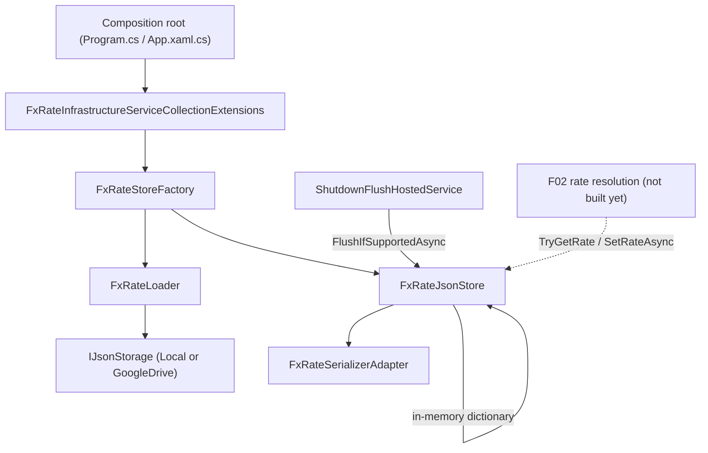

## 1. Technical Overview

**What:** Introduce a permanent, shared JSON-backed store (`data-fx-rates.json`) for end-of-day USD-based FX rates (USD→BRL, USD→GBP), following the exact storage architecture already used for `data-investment.json`/`data-cashflow.json`: an `IJsonStorage`-backed document loaded once at process startup, mutated in-memory, and persisted through the existing `LocalJsonStorage` (atomic stage-then-rename) or `DebouncedJsonStorage` (Google Drive, coalescing + retry) paths, selected by configuration.

**Why:** The store must be reachable by both bounded contexts without either one taking a dependency on the other, and without `Financial.Integrations.Frankfurter` reaching into Investment/CashFlow-specific code (enforced today by `FrankfurterIsolationRuleTests`). The only existing location that already satisfies both constraints and already owns the generic JSON storage primitives (`IJsonStorage`, `IJsonStorageFactory`, `DebouncedJsonStorage`, `ShutdownFlushHostedService<T>`) is the `Financial.Shared.Abstractions` / `Financial.Shared.Infrastructure` pair, so this feature adds to those two projects rather than creating a new one.

**Scope:**
- Included: the FX rate document model, its serializer (with the `Version` forward-compatibility marker), a loader that tolerates a missing or corrupted file, an in-memory-backed store with a synchronous read path and an async, gated write path, configuration keys/options mirroring `Investment:Repository:*`/`CashFlow:Repository:*`, a DI extension method wiring the store as `IFxRateStore`, composition-root registration (including `ShutdownFlushHostedService<IFxRateStore>`) in both `Financial.Api` and `Financial.App`, and an `.example.json` template.
- Excluded (belongs to later features in this PRD): USD-based cross-rate math and the yesterday-or-earlier classification rule (F02), the batched Frankfurter HTTP call (F03), and the layered `IExchangeRateProvider` composition/registration that makes any of this reachable from existing callers (F04). F01 produces `IFxRateStore` as a library component; nothing in the app calls it yet until F02/F04 land.

## 2. Architecture Impact

**Affected components:**
- `Financial.Shared.Abstractions/Currencies/FxRates/FxRateRecord.cs` — new value type
- `Financial.Shared.Abstractions/Currencies/FxRates/IFxRateStore.cs` — new interface
- `Financial.Shared.Infrastructure/Persistence/FxRates/FxRateJsonStore.cs` — new implementation
- `Financial.Shared.Infrastructure/Persistence/FxRates/IFxRateSerializer.cs` + `FxRateSerializerAdapter.cs` — new
- `Financial.Shared.Infrastructure/Persistence/FxRates/FxRateLoader.cs` — new
- `Financial.Shared.Infrastructure/Repositories/FxRates/FxRateRepositoryProvider.cs`, `FxRateRepositorySelectionOptions.cs`, `FxRateStoreFactory.cs` — new
- `Financial.Shared.Infrastructure/Configuration/FxRateRepositoryConfigurationKeys.cs`, `FxRateRepositorySettingsOptions.cs` — new
- `Financial.Shared.Infrastructure/DependencyInjection/FxRateInfrastructureServiceCollectionExtensions.cs` — new
- `Financial.Api/Program.cs`, `Financial.App/App.xaml.cs` — modified (composition root wiring)
- `Financial.Api/appsettings*.json`, `Financial.App/appsettings*.json` — modified (new `FxRates` config block)
- `data/data-fx-rates.example.json`, `.gitignore` — new/modified

**Data flow:**



## 3. Technical Decisions

| Decision | Chosen Approach | Alternative Considered | Trade-off |
|----------|----------------|----------------------|-----------|
| `FxRateRecord` shape | Explicit `BrlRate`/`GbpRate` decimal properties | `IReadOnlyDictionary<Currency, decimal>` keyed by currency | Loses generality if a 4th currency is ever added, but matches the PRD's fixed BRL/GBP scope, avoids dictionary-keyed JSON converter code, and keeps F02's cross-rate math reading two named properties instead of dictionary lookups with `TryGetValue` null-checks |
| Project placement | Add to existing `Financial.Shared.Abstractions` (contracts) / `Financial.Shared.Infrastructure` (implementation) | New `Financial.Shared.FxRates` project | A new project would satisfy `FrankfurterIsolationRuleTests`-style isolation just as well, but CLAUDE.md's "right-sized, not over-engineered" principle argues against a single-purpose project for one JSON-backed store when the exact primitives it needs (`IJsonStorage`, `IJsonStorageFactory`, `DebouncedJsonStorage`) already live in `Financial.Shared.Infrastructure` |
| Write concurrency | `SemaphoreSlim`-gated "update in-memory dict → serialize whole document → `IJsonStorage.WriteAsync`" critical section, mirroring `InvestmentJsonRepository`/`CashFlowJsonRepository`'s `ApplyAndSaveAsync` gate | No explicit gate (rely on `ConcurrentDictionary` alone) | The gate costs a small amount of contention under concurrent resolutions, but guarantees two dates resolved back-to-back both land in the same or a subsequent physical write, matching the F01 acceptance criterion; a bare `ConcurrentDictionary` cannot guarantee ordering between a dict commit and a concurrent snapshot-for-write |
| Config options class location | `Financial.Shared.Infrastructure/Configuration/FxRateRepositorySettingsOptions.cs` | New `Financial.Shared.Application` project, mirroring `Investment`/`CashFlow`'s `*RepositorySettingsOptions` living in their `Application` layer | `Financial.Shared` has no `Application` layer today; introducing one for a single options POCO would be scaffolding disconnected from any other need, so the options class sits next to the configuration keys class it pairs with, in `Infrastructure`, where the DI wiring that consumes it already lives |
| Write-failure handling | `FxRateJsonStore.SetRateAsync` catches any exception from `IJsonStorage.WriteAsync`, logs a warning (exception type + date only), and returns normally | Let the exception propagate to the caller | The PRD requires "a persistently failing store never blocks a caller's rate lookup" — since the in-memory dictionary update always succeeds before the write is attempted, the resolved rate is still usable for the rest of the process's life even if the physical write fails |

## 4. Component Overview

**Backend:**

| File Path | New/Modified | Purpose | Key Responsibilities |
|-----------|--------------|---------|---------------------|
| `Financial.Shared.Abstractions/Currencies/FxRates/FxRateRecord.cs` | New | Immutable stored-rate value type | Carries `Base` ("USD"), `BrlRate`, `GbpRate`, `Source` ("frankfurter"), `StoredAt` (UTC); no rounding, full `decimal` precision |
| `Financial.Shared.Abstractions/Currencies/FxRates/IFxRateStore.cs` | New | Store contract consumed by future F02 | `FxRateRecord? TryGetRate(DateOnly date)` synchronous in-memory read; `Task SetRateAsync(DateOnly date, FxRateRecord record)` async persisted write; extends `ISyncStatusProvider` so `ShutdownFlushHostedService<IFxRateStore>` can flush it |
| `Financial.Shared.Infrastructure/Persistence/FxRates/IFxRateSerializer.cs` | New | Serializer contract | `string Serialize(IReadOnlyDictionary<DateOnly, FxRateRecord>)`, `Dictionary<DateOnly, FxRateRecord> Deserialize(string)` |
| `Financial.Shared.Infrastructure/Persistence/FxRates/FxRateSerializerAdapter.cs` | New | JSON (de)serialization | Maps the in-memory dictionary to/from the `{ "ratesByDate": { "<yyyy-MM-dd>": {...} }, "Version": 1 }` document shape; stamps `Version` on write; treats a missing `Version` as `1` on read, matching `CashFlowSerializerAdapter`'s minimal (no-migration) pattern |
| `Financial.Shared.Infrastructure/Persistence/FxRates/FxRateLoader.cs` | New | Startup load | `LoadSync(IJsonStorage, IFxRateSerializer)`; catches `FileNotFoundException` → empty dictionary; catches JSON parse failure → logs a warning naming only the exception type → empty dictionary (this JSON-corruption tolerance is new relative to `CashFlowLoader`/`InvestmentLoader`, which don't yet handle it, per this feature's explicit requirement) |
| `Financial.Shared.Infrastructure/Persistence/FxRates/FxRateJsonStore.cs` | New | `IFxRateStore` implementation | Holds the loaded dictionary in memory; `TryGetRate` reads directly; `SetRateAsync` rejects (no-op + warning log) when `date == DateOnly.FromDateTime(DateTime.Now)`, otherwise updates the dictionary and persists the whole document inside a `SemaphoreSlim` gate, swallowing and logging write failures; implements `GetStatus()`/`FlushAsync()` by delegating to the underlying `IJsonStorage`'s `ISyncStatusProvider` (or idle status for `LocalJsonStorage`) |
| `Financial.Shared.Infrastructure/Configuration/FxRateRepositoryConfigurationKeys.cs` | New | Config key constants | `FxRates:Repository:Provider`, `FxRates:DataJsonFile`, `FxRates:GoogleDrive:CredentialsPath`, `FxRates:GoogleDrive:FilePath` |
| `Financial.Shared.Infrastructure/Configuration/FxRateRepositorySettingsOptions.cs` | New | Flat config POCO | `Provider`, `DataJsonFile`, `GoogleDriveCredentialsPath`, `GoogleDriveFilePath` (all nullable strings), bound via `services.Configure<T>(...)` exactly like `InvestmentRepositorySettingsOptions` |
| `Financial.Shared.Infrastructure/Repositories/FxRates/FxRateRepositoryProvider.cs` | New | Provider enum | `{ LocalJson, GoogleDriveJson }` |
| `Financial.Shared.Infrastructure/Repositories/FxRates/FxRateRepositorySelectionOptions.cs` | New | Resolved selection record | `record(FxRateRepositoryProvider Provider, string? LocalDataPath, string? GoogleDriveCredentialsPath, string? GoogleDriveFilePath)` |
| `Financial.Shared.Infrastructure/Repositories/FxRates/FxRateStoreFactory.cs` | New | Store construction | `DefaultDataFileName = "data-fx-rates.json"`; switches on `Provider` to call `IJsonStorageFactory.CreateLocal`/`CreateRemote`, loads via `FxRateLoader.LoadSync`, returns `new FxRateJsonStore(...)` — mirrors `InvestmentRepositoryFactory`/`CashFlowRepositoryFactory` exactly |
| `Financial.Shared.Infrastructure/DependencyInjection/FxRateInfrastructureServiceCollectionExtensions.cs` | New | DI wiring | `AddFinancialFxRateInfrastructure(this IServiceCollection, IConfiguration)`: binds `FxRateRepositorySettingsOptions` from the config keys, resolves the provider via `RepositoryProviderResolver.Resolve(settings.Provider, FxRateRepositoryProvider.LocalJson)`, registers `IFxRateStore` as a singleton built by `FxRateStoreFactory` |
| `Financial.Api/Program.cs` | Modified | Composition root | Calls `builder.Services.AddFinancialFxRateInfrastructure(configuration);` and `builder.Services.AddHostedService<ShutdownFlushHostedService<IFxRateStore>>();`, placed alongside the existing Investment/CashFlow infrastructure + hosted service registrations |
| `Financial.App/App.xaml.cs` | Modified | Composition root | Same two additions as `Program.cs`, in the same relative position within `ConfigureServices` |
| `Financial.Api/appsettings.json`, `appsettings.Development.json`, `appsettings.Production.json` | Modified | Config defaults | New `FxRates` block: `Repository:Provider` ("LocalJson" default / blank in base, matching `Investment`/`CashFlow`), `DataJsonFile`, `GoogleDrive:CredentialsPath`/`FilePath`; `Development.json` points `DataJsonFile` at `../../../../data/data-fx-rates.json` |
| `Financial.App/appsettings.json`, `appsettings.Development.json`, `appsettings.Production.json` | Modified | Config defaults | Same `FxRates` block, mirroring the `Investment`/`CashFlow` blocks already present |
| `data/data-fx-rates.example.json` | New | Tracked template | Example document matching the PRD's JSON shape, with one or two illustrative historical entries; real `data/data-fx-rates.json` stays gitignored like the other two data files |
| `.gitignore` | Modified | Ignore rule | Add `data/data-fx-rates.json` alongside the existing `data-investment.json`/`data-cashflow.json` ignore entries |

**Data Model:**

Not applicable — no relational schema. See the JSON Document Model below.

## 5. API Contracts

Not applicable. This feature has no HTTP surface — see PRD §6 F01 Experience: "Purely backend infrastructure — no UI surface." The only external contract is the in-process `IFxRateStore` interface (documented in Component Overview) that F02 will consume in the next wave.

## 6. Data Model

**JSON Document Model — `data-fx-rates.json`:**

| Field | Type | Nullable | Description |
|-------|------|----------|--------------|
| `Version` | `int` | No (defaults to `1` on read if absent) | Forward-compatibility marker, stamped on every write; a file with no `Version` property (any file written before this convention existed) is treated as version 1 |
| `ratesByDate` | `object` (map of `string` → rate entry) | No (defaults to `{}`) | Keyed by the exact `yyyy-MM-dd` string of the requested (not fallback) date |
| `ratesByDate.<date>.base` | `string` | No | Always `"USD"` |
| `ratesByDate.<date>.rates.BRL` | `decimal` | No | USD→BRL rate, ≥6 decimal places, no rounding |
| `ratesByDate.<date>.rates.GBP` | `decimal` | No | USD→GBP rate, ≥6 decimal places, no rounding |
| `ratesByDate.<date>.source` | `string` | No | Always `"frankfurter"` for this task |
| `ratesByDate.<date>.storedAt` | `string` (ISO 8601 UTC) | No | Timestamp of when the entry was persisted |

**Invariants enforced by `FxRateJsonStore`:**
- No entry is ever created or updated for `date == DateOnly.FromDateTime(DateTime.Now)` (host-local today) — `SetRateAsync` no-ops and logs a warning instead.
- A stored entry always carries both `rates.BRL` and `rates.GBP` — `IFxRateStore` exposes no partial-record write path; callers (F02, in a later wave) are responsible for only calling `SetRateAsync` once both currencies are known.
- The whole document is loaded into memory once at startup (`FxRateLoader.LoadSync`); every `TryGetRate` read after that is served from the in-memory dictionary, never from disk.

**Example file (`data/data-fx-rates.example.json`):**
```json
{
  "Version": 1,
  "ratesByDate": {
    "2026-09-18": {
      "base": "USD",
      "rates": { "BRL": 5.452317, "GBP": 0.771845 },
      "source": "frankfurter",
      "storedAt": "2026-09-18T23:59:59Z"
    }
  }
}
```

## 7. Testing Strategy

**Test File Structure:**

| Test File | Test Type | Target | Coverage Goal |
|-----------|-----------|--------|---------------|
| `Tests/Financial.Shared.Infrastructure.Tests/Persistence/FxRates/FxRateSerializerAdapterTests.cs` | Unit | `FxRateSerializerAdapter` | ≥95% |
| `Tests/Financial.Shared.Infrastructure.Tests/Persistence/FxRates/FxRateLoaderTests.cs` | Unit | `FxRateLoader` | ≥95% |
| `Tests/Financial.Shared.Infrastructure.Tests/Persistence/FxRates/FxRateJsonStoreTests.cs` | Unit | `FxRateJsonStore` | ≥95% |
| `Tests/Financial.Shared.Infrastructure.Tests/Repositories/FxRates/FxRateStoreFactoryTests.cs` | Unit | `FxRateStoreFactory` | ≥90% |
| `Tests/Financial.Shared.Infrastructure.Tests/DependencyInjection/FxRateInfrastructureServiceCollectionExtensionsTests.cs` | Integration | `AddFinancialFxRateInfrastructure` | ≥90% |
| `Tests/Financial.Api.Tests/ShutdownFlushHostedServiceRegistrationTests.cs` | Integration | Composition root | Extend existing test with `IFxRateStore` case |

**Test functions:**

| Test Function | Description | Assertions |
|---------------|-------------|------------|
| `Serialize_Stamps_Current_Version` | Serializing any dictionary | Output JSON has `"Version": 1` |
| `Deserialize_Missing_Version_Treated_As_Version_1` | Deserializing a document with no `Version` property | No exception; document reads successfully |
| `Deserialize_Preserves_At_Least_Six_Decimal_Places` | Round-trip a rate with 6+ decimal digits | Deserialized value equals the original `decimal` exactly, no rounding |
| `LoadSync_Missing_File_Returns_Empty_Dictionary` | `IJsonStorage.ReadAsync` throws `FileNotFoundException` | Returns an empty dictionary, no exception propagates |
| `LoadSync_Corrupted_Json_Logs_Warning_Returns_Empty_Dictionary` | `IJsonStorage.ReadAsync` returns invalid JSON | Returns an empty dictionary; a warning is logged naming only the exception type, never file contents |
| `TryGetRate_Existing_Date_Returns_Stored_Record` | Store pre-loaded with a date | Returns the exact stored `FxRateRecord` |
| `TryGetRate_Missing_Date_Returns_Null` | Date not in the dictionary | Returns `null`, no store/Frankfurter access (store has no Frankfurter dependency at all in F01) |
| `SetRateAsync_Persists_New_Date_To_Storage` | Set a historical date | `IJsonStorage.WriteAsync` is called with JSON containing the new date under `ratesByDate`, `base`, `rates.BRL`/`rates.GBP` with ≥6 decimals, `source`, `storedAt` |
| `SetRateAsync_Rejects_Todays_Date` | Call with `date == DateOnly.FromDateTime(DateTime.Now)` | No entry is added to the in-memory dictionary or written to storage; a warning is logged; the file/store contains zero entries keyed by today's date |
| `SetRateAsync_Two_Dates_In_Quick_Succession_Both_Persisted` | Two `SetRateAsync` calls issued back-to-back | Both dates end up in the dictionary and the final persisted document contains both |
| `SetRateAsync_Storage_Write_Failure_Does_Not_Throw` | `IJsonStorage.WriteAsync` throws | Method completes without throwing; in-memory dictionary still contains the new entry; a warning is logged with exception type + date only |
| `Create_LocalJson_Provider_Uses_Default_File_Name` | `Provider` unset/`LocalJson` | `IJsonStorageFactory.CreateLocal` called with `data-fx-rates.json` default |
| `Create_GoogleDrive_Provider_Uses_Remote_Storage` | `Provider = GoogleDriveJson` | `IJsonStorageFactory.CreateRemote` called with the configured credentials/file path keys |
| `Create_Missing_File_Starts_With_Empty_Store` | No file at the resolved local path | Resulting `IFxRateStore.TryGetRate` returns `null` for any date; app does not fail to start |
| `AddFinancialFxRateInfrastructure_Registers_IFxRateStore_Singleton` | DI container built with the extension called | Resolving `IFxRateStore` twice returns the same instance |
| `AddFinancialFxRateInfrastructure_Provider_Unset_Defaults_To_LocalJson` | No `FxRates:Repository:Provider` configured | Resolved store is backed by `LocalJsonStorage`-equivalent behavior (file-based, default file name) |
| `ShutdownFlushHostedService_Flushes_IFxRateStore_On_Stop` | Extend existing registration test | `ShutdownFlushHostedService<IFxRateStore>` is registered and calls `FlushIfSupportedAsync` on stop |
