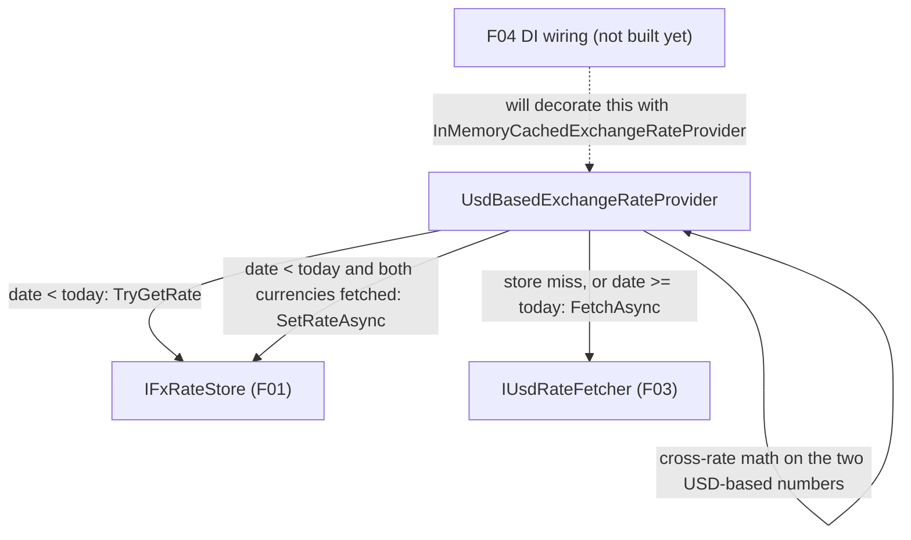

## 1. Technical Overview

**What:** Add `UsdBasedExchangeRateProvider`, a new `IExchangeRateProvider` implementation that resolves any (date, from, to) triple among {USD, BRL, GBP} by combining F01's persistent store (`IFxRateStore`) and F03's batched fetch (`IUsdRateFetcher`): historical dates (strictly before host-local today) are served from the store when present, or fetched-then-persisted when not; today (and any future date) is always resolved live and never persisted; every result is computed via a single USD-anchored cross-rate formula.

**Why:** F01 and F03 are independent, unused-so-far building blocks (a store and a batched fetcher). F02 is the layer that actually applies the PRD's business rule — "yesterday or earlier is final, today is always live" — and turns two USD-based numbers into any of the six possible pairs among USD/BRL/GBP. It has to sit between F01/F03 and the still-untouched `IExchangeRateProvider` DI registration, so F04 (later) can swap the registration without writing any resolution logic itself.

**Scope:**
- Included: the cross-rate computation formula (USD→X, X→USD, X→Y) at full `decimal` precision; the `from == to` short-circuit; the today-vs-historical date classification using host-local `DateOnly.FromDateTime(DateTime.Now)`; store-first/fetch-and-persist-second resolution for historical dates; live-always/never-persisted resolution for today (and future dates, unchanged from today's behavior); partial-fetch tolerance (a fetch that resolves only one of BRL/GBP still satisfies a caller asking for that one currency, but is never persisted); the zero-stored-rate guard (returns `null` instead of dividing by zero, logs a warning naming only the date).
- Excluded (later feature in this PRD): wiring `UsdBasedExchangeRateProvider` into DI as the actual `IExchangeRateProvider` singleton, or having `InMemoryCachedExchangeRateProvider` decorate it instead of `FrankfurterExchangeRateProvider` — that swap is F04's job. F02 ships as a fully tested, unused-so-far class, exactly like F01 and F03 before it.

## 2. Architecture Impact

**Affected components:**
- `Financial.Shared.Abstractions/Currencies/FxRates/UsdBasedExchangeRateProvider.cs` — new implementation

**Data flow:**

## 3. Technical Decisions

| Decision | Chosen Approach | Alternative Considered | Trade-off |
|----------|----------------|----------------------|-----------|
| Cross-rate formula | A single helper `Get(currency) → decimal?` (USD ⇒ `1`, BRL/GBP ⇒ the stored/fetched value or `null`) and `rate(from→to) = Get(to) / Get(from)` | Three separate branches (USD→X, X→USD, X→Y) as the PRD's Capabilities text literally enumerates them | The unified formula is mathematically identical for all three cases (and for `from==to`, though that is still short-circuited earlier for zero cost) and collapses three code paths — including the partial-fetch null-propagation and the zero-rate guard — into one, instead of triplicating the null/zero checks across three branches |
| "Today" determination | `DateOnly.FromDateTime(DateTime.Now)` computed inline, no injected clock | Inject `TimeProvider` for testability | Matches the established convention already used by `ControleMaeService.CreateEntryAsync` and by F01's `FxRateJsonStore` for the exact same host-local "today" concept — introducing a `TimeProvider` here alone would be inconsistent with the rest of the FX pipeline; tests instead use dates far enough in the past/future relative to the real clock to avoid flakiness, the same tolerance the existing `ControleMaeService` tests already accept |
| Zero-rate guard scope | If either `Get(from)` or `Get(to)` resolves to exactly `0m`, return `null` and log a warning naming only the date | Guard only the reciprocal/cross denominator (`Get(from)`) | The PRD frames this as guarding against "a stored rate of zero" in general (a corrupted-file scenario), not specifically a division denominator — guarding both operands is simpler to reason about and equally cheap, since USD's `Get` value is always `1` and can never trigger it |
| Persistence timing | `SetRateAsync` is awaited before `GetHistoricalRateAsync` returns, for the case where a historical date's fetch resolves both currencies | Fire-and-forget the persist | The PRD's F02 capability says the date "results in that date being persisted... before returning" — awaiting also means the very next call for the same date within the same process, before F04's outer cache is even involved, would already see it in the store |

## 4. Component Overview

**Backend:**

| File Path | New/Modified | Purpose | Key Responsibilities |
|-----------|--------------|---------|---------------------|
| `Financial.Shared.Abstractions/Currencies/FxRates/UsdBasedExchangeRateProvider.cs` | New | `IExchangeRateProvider` implementation combining F01 + F03 | `GetHistoricalRateAsync(date, from, to)`: short-circuits `from==to` to `1`; for `date < today`, reads `IFxRateStore.TryGetRate` first, falling back to `IUsdRateFetcher.FetchAsync` and persisting via `IFxRateStore.SetRateAsync` only when both BRL and GBP resolved; for `date >= today`, always calls `IUsdRateFetcher.FetchAsync` and never persists; computes the requested pair via the shared USD-anchored cross-rate formula, applying the zero-rate guard and propagating `null` for an unresolved currency |

**Data Model:** Not applicable — no new persisted schema (F01 already owns the stored shape; this feature only reads/writes through `IFxRateStore`).

## 5. API Contracts

Not applicable. No HTTP surface; `IExchangeRateProvider.GetHistoricalRateAsync(date, from, to)` (unchanged signature) is the only contract, already documented in F01/F03's specs and the PRD.

## 6. Data Model

Not applicable — see §5.

## 7. Testing Strategy

**Test File Structure:**

| Test File | Test Type | Target | Coverage Goal |
|-----------|-----------|--------|---------------|
| `Tests/Financial.Shared.Infrastructure.Tests/Currencies/FxRates/UsdBasedExchangeRateProviderTests.cs` | Unit | `UsdBasedExchangeRateProvider` | ≥95% |

**Test functions:**

| Test Function | Description | Assertions |
|---------------|-------------|------------|
| `GetHistoricalRateAsync_SameCurrency_ReturnsOneWithoutTouchingStoreOrFetcher` | `from == to` | Returns `1`; `IFxRateStore.TryGetRate` and `IUsdRateFetcher.FetchAsync` are never called |
| `GetHistoricalRateAsync_HistoricalDateAlreadyInStore_ComputesFromStoredRatesOnly` | Historical date, store has a record | Returns the correct computed pair; `IUsdRateFetcher.FetchAsync` is never called |
| `GetHistoricalRateAsync_HistoricalDateNotInStore_FetchesComputesAndPersistsBothCurrencies` | Historical date, store miss, fetch resolves both | Returns the correct pair; `IFxRateStore.SetRateAsync` is called once with a record carrying both BRL and GBP |
| `GetHistoricalRateAsync_TodaysDate_ReturnsLiveRateAndNeverPersists` | `date == today` | Returns the fetched pair; `IFxRateStore.SetRateAsync` is never called, even though both currencies were fetched |
| `GetHistoricalRateAsync_AllSixPairsForSameDate_AreMathematicallyConsistent` | USD→BRL, USD→GBP, BRL→USD, GBP→USD, BRL→GBP, GBP→BRL for one historical date with known stored rates | Each pair equals the expected cross-rate derived from the same two stored numbers (e.g., `BRL→GBP == storedGbp / storedBrl`) |
| `GetHistoricalRateAsync_FetchFailsForBothCurrencies_ReturnsNullAndDoesNotPersist` | Historical date, fetch returns both null | Returns `null`; `IFxRateStore.SetRateAsync` is never called |
| `GetHistoricalRateAsync_FetchResolvesOnlyOneCurrency_SatisfiesThatCurrencyButDoesNotPersist` | Historical date, fetch resolves only BRL, caller asks USD→BRL | Returns the BRL rate; `IFxRateStore.SetRateAsync` is never called |
| `GetHistoricalRateAsync_FetchResolvesOnlyOneCurrency_ReturnsNullForTheMissingOne` | Same partial fetch, caller asks USD→GBP (the unresolved one) | Returns `null` |
| `GetHistoricalRateAsync_StoredRateIsZero_ReturnsNullAndLogsWarningWithDateOnly` | Stored record has `BrlRate == 0` | Returns `null` for any pair involving BRL; a warning is logged naming only the date, never the rate value or currency pair details beyond what's needed |

**Cross-Feature Integration tests (from PRD §9):**

| Test Function | Description | Assertions |
|---------------|-------------|------------|
| `GetHistoricalRateAsync_RateFromStore_UsedWithNoRedundantFetcherCall` | A rate F01 already persisted for a date is read back by F02 | Correct pair computed; `IUsdRateFetcher.FetchAsync` never invoked |
| `GetHistoricalRateAsync_RateFromFetcher_HandedToStoreOnlyWhenBothCurrenciesPresent` | F03's fetch result reaches F02, partial vs. full | `SetRateAsync` called only in the full case, matching F01's own "both currencies required" persistence rule |
