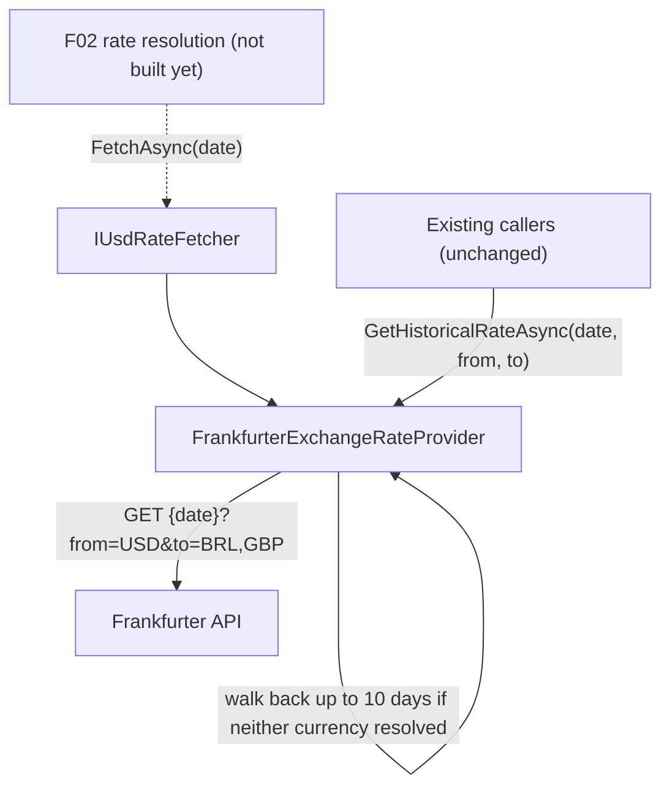

## 1. Technical Overview

**What:** Add a batched USD-based rate fetch to the existing `FrankfurterExchangeRateProvider` (`Integrations/Frankfurter`): a single HTTP call per date that resolves both USD→BRL and USD→GBP, exposed through a new small abstraction (`IUsdRateFetcher`) that the future F02 resolution logic will depend on. The existing weekend/holiday walk-back (`MaxFallbackDays = 10`) is preserved unchanged.

**Why:** Today's `IExchangeRateProvider.GetHistoricalRateAsync(date, from, to)` fetches one currency pair per HTTP call (`?from=X&to=Y`). Resolving a date's full USD-based record (needed by F01's store and F02's cross-rate math) currently costs two round trips instead of one. `FrankfurterIsolationRuleTests` requires that only `Financial.Integrations.Frankfurter` talks to Frankfurter and that it reaches nothing beyond `Financial.Shared.Abstractions`, so the new batched capability is added to the same class, behind a new interface that lives in the shared kernel — mirroring exactly how `IExchangeRateProvider` itself is split between an abstraction in `Financial.Shared.Abstractions` and an implementation in `Financial.Integrations.Frankfurter`.

**Scope:**
- Included: a new `IUsdRateFetcher` abstraction and `UsdRateFetchResult` value type in `Financial.Shared.Abstractions`; a new `FetchUsdRatesAsync(DateOnly date)` method on `FrankfurterExchangeRateProvider` implementing it, issuing one `GET {date}?from=USD&to=BRL,GBP` call per attempted date; the existing 10-day walk-back logic, applied while *neither* currency has resolved yet, stopping as soon as either one does; per-currency partial-success tolerance (a response with BRL but not GBP, or vice versa, is returned as-is, no further walk-back for the missing one); exception handling identical in spirit to the existing single-pair method (catch, log exception type + currencies + date only, never response content, return an empty result).
- Excluded (later features in this PRD): consuming `IUsdRateFetcher` from anywhere (F02, wave 2, is the first consumer); any change to the existing `GetHistoricalRateAsync(date, from, to)` method or its `?from=X&to=Y` single-pair HTTP shape — it stays exactly as it is today, since every existing caller still depends on it until F04 swaps the DI registration; removing/deprecating `GetHistoricalRateAsync` once it becomes unused (F04's decision, not F03's).

## 2. Architecture Impact

**Affected components:**
- `Financial.Shared.Abstractions/Currencies/FxRates/IUsdRateFetcher.cs` — new interface
- `Financial.Shared.Abstractions/Currencies/FxRates/UsdRateFetchResult.cs` — new value type
- `Integrations/Frankfurter/FrankfurterExchangeRateProvider.cs` — modified (new method + interface implementation; existing `GetHistoricalRateAsync` untouched)

**Data flow:**



## 3. Technical Decisions

| Decision | Chosen Approach | Alternative Considered | Trade-off |
|----------|----------------|----------------------|-----------|
| New abstraction vs. reusing `IExchangeRateProvider` | Add a separate `IUsdRateFetcher` interface for the batched, nullable-per-currency shape | Overload `IExchangeRateProvider` with a batched method | `IExchangeRateProvider.GetHistoricalRateAsync` returns a single `decimal?` for one arbitrary pair (used generically, non-USD-based pairs included); the batched fetch is USD-anchored and partial-tolerant by design (`UsdRateFetchResult` with two independently-nullable fields) — conflating the two shapes into one interface would force every existing caller's contract to change for a concern only F02 needs |
| Walk-back trigger condition for the batched call | Walk back while **both** `BrlRate` and `GbpRate` are still null; stop as soon as either resolves | Walk back independently per currency (continue seeking GBP even after BRL resolves on an earlier date) | Matches the PRD's explicit error-handling rule ("Frankfurter's response includes BRL but omits GBP (or vice versa): returns whichever succeeded") and keeps the fetch to exactly one HTTP call per attempted date, at the cost of a currency that could theoretically resolve one day earlier sometimes being left unresolved on a partial-response date |
| Location of the new method | Add `FetchUsdRatesAsync` to the existing `FrankfurterExchangeRateProvider` class | New separate class wrapping the same `HttpClient` | The existing class already owns the walk-back constant, the HTTP client, the logger, and the response DTO; splitting the batched fetch into a second class would duplicate all four for no isolation benefit, since `FrankfurterIsolationRuleTests` only cares about the project boundary, not the class boundary |

## 4. Component Overview

**Backend:**

| File Path | New/Modified | Purpose | Key Responsibilities |
|-----------|--------------|---------|---------------------|
| `Financial.Shared.Abstractions/Currencies/FxRates/UsdRateFetchResult.cs` | New | Batched fetch result | Immutable `BrlRate`/`GbpRate` (both `decimal?`, independently nullable) |
| `Financial.Shared.Abstractions/Currencies/FxRates/IUsdRateFetcher.cs` | New | Fetch contract for the future F02 resolution layer | `Task<UsdRateFetchResult> FetchAsync(DateOnly date)` |
| `Integrations/Frankfurter/FrankfurterExchangeRateProvider.cs` | Modified | Batched HTTP fetch | Implements `IUsdRateFetcher`; `FetchAsync` issues `GET {date}?from=USD&to=BRL,GBP`, walks back up to `MaxFallbackDays` (10) while both currencies remain unresolved, parses `BRL`/`GBP` independently out of the same response, and swallows/logs any exception (type + currencies + date only) into an empty `UsdRateFetchResult`; `GetHistoricalRateAsync` is unchanged |

**Data Model:** Not applicable — no persisted schema; `UsdRateFetchResult` is an in-memory transfer type only (F01 already owns the persisted shape).

## 5. API Contracts

Not applicable for this application's own API surface (no HTTP endpoint is added or changed).

**External call shape (Frankfurter, for reference):**
- **Method:** GET
- **Path:** `{FrankfurterExchangeRateProvider.BaseAddress}{yyyy-MM-dd}?from=USD&to=BRL,GBP`
- **Example response:**
```json
{ "amount": 1.0, "base": "USD", "date": "2026-09-18", "rates": { "BRL": 5.452317, "GBP": 0.771845 } }
```
- A response with only one of `BRL`/`GBP` present is valid and yields a partial `UsdRateFetchResult`.

## 6. Data Model

Not applicable — see §5.

## 7. Testing Strategy

**Test File Structure:**

| Test File | Test Type | Target | Coverage Goal |
|-----------|-----------|--------|---------------|
| `Tests/Financial.Frankfurter.Tests/FrankfurterExchangeRateProviderTests.cs` | Unit | `FrankfurterExchangeRateProvider.FetchAsync` (extend existing file) | ≥95% |

**Test functions:**

| Test Function | Description | Assertions |
|---------------|-------------|------------|
| `FetchAsync_WithSuccessfulResponse_ParsesBothCurrencies` | Response has both BRL and GBP | Result has both `BrlRate` and `GbpRate` populated correctly |
| `FetchAsync_IssuesExactlyOneHttpCallForAResolvedDate` | Successful response on the exact date | Exactly one request is made, with `to=BRL,GBP` in the query string |
| `FetchAsync_WithOnlyBrlInResponse_ReturnsPartialResult` | Response has BRL but not GBP | `BrlRate` populated, `GbpRate` null, no further request issued |
| `FetchAsync_WithOnlyGbpInResponse_ReturnsPartialResult` | Response has GBP but not BRL | `GbpRate` populated, `BrlRate` null, no further request issued |
| `FetchAsync_WhenExactDateHasNoRates_FallsBackToNearestEarlierDateWithinTenDays` | Empty `rates` on the exact date, populated on an earlier date | Both currencies resolved from the fallback date; result still associated with the originally requested date; requested dates walk back day-by-day |
| `FetchAsync_WhenNoRateWithinTenDayWindow_ReturnsEmptyResult` | Empty `rates` for 11 consecutive days | Both `BrlRate`/`GbpRate` null; exactly 11 requests made (offsets 0–10) |
| `FetchAsync_WhenHttpRequestThrows_ReturnsEmptyResultAndLogsExceptionType` | `HttpRequestException` from the handler | Both fields null; a warning is logged naming only the exception type, currencies, and date — never response content |
| `FetchAsync_WithMalformedBody_ReturnsEmptyResult` | Non-JSON response body | Both fields null, no exception propagates |
| `FetchAsync_WithNonSuccessStatusCode_ReturnsEmptyResult` | HTTP 503 | Both fields null |
| `GetHistoricalRateAsync_StillUsesOneCurrencyAtATimeShape_Unmodified` | Regression guard | Existing single-pair tests in the same file continue to pass unmodified, confirming `GetHistoricalRateAsync`'s HTTP shape and behavior are untouched |

**Architecture test:** `Tests/Financial.Architecture.Tests/FrankfurterIsolationRuleTests.cs` is re-run (not modified) to confirm `Financial.Integrations.Frankfurter` still references only `Financial.Shared.Abstractions`.
