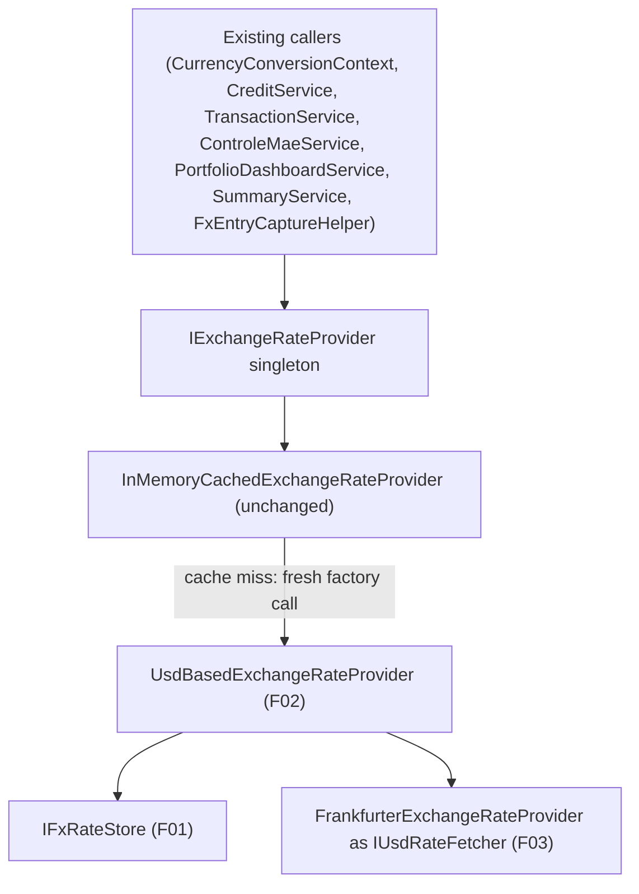

## 1. Technical Overview

**What:** Swap the single line of DI composition in `InvestmentInfrastructureServiceCollectionExtensions.AddFinancialInfrastructure` and `CashFlowInfrastructureServiceCollectionExtensions.AddFinancialCashFlowInfrastructure` so the shared `IExchangeRateProvider` singleton is `InMemoryCachedExchangeRateProvider` decorating F02's `UsdBasedExchangeRateProvider` (which itself combines F01's store and F03's fetcher) instead of decorating `FrankfurterExchangeRateProvider` directly. This is the final feature of the PRD — it makes F01/F02/F03 reachable from every existing caller for the first time.

**Why:** F01, F02, and F03 have shipped as fully tested, unused-so-far library code (per their own specs' explicit scope exclusion). `IExchangeRateProvider.GetHistoricalRateAsync(date, from, to)`'s signature never changed across any of them, so this feature is a pure composition swap: two files change, both already `TryAddSingleton`-guarded so only the first bounded context's registration call wins, exactly as today.

**Scope:**
- Included: replacing the inner factory passed to `InMemoryCachedExchangeRateProvider` in both DI extension methods; no change to `InMemoryCachedExchangeRateProvider` itself, to either method's other registrations, or to `Program.cs`/`App.xaml.cs` (F01 already registered `IFxRateStore` and its shutdown-flush hosted service; `FrankfurterExchangeRateProvider` is already registered via `AddHttpClient<FrankfurterExchangeRateProvider>()` in both files).
- Excluded: any change to `FrankfurterExchangeRateProvider.GetHistoricalRateAsync` (the old single-pair method) — it becomes unused in production once this swap lands, but removing dead code is not part of this task (out of scope per the PRD, and removing it would be a separate cleanup with its own review, not a functional requirement here).

## 2. Architecture Impact

**Affected components:**
- `Financial.Investment.Infrastructure/DependencyInjection/InvestmentInfrastructureServiceCollectionExtensions.cs` — modified
- `Financial.CashFlow.Infrastructure/DependencyInjection/CashFlowInfrastructureServiceCollectionExtensions.cs` — modified

**Data flow:**

## 3. Technical Decisions

| Decision | Chosen Approach | Alternative Considered | Trade-off |
|----------|----------------|----------------------|-----------|
| Inner factory reuse pattern | Resolve `IFxRateStore` (singleton, cheap) and a fresh `FrankfurterExchangeRateProvider` (transient, via `AddHttpClient<T>`) on every factory invocation, exactly mirroring today's `() => sp.GetRequiredService<FrankfurterExchangeRateProvider>()` | Resolve `UsdBasedExchangeRateProvider` itself as a registered singleton/transient service and reference it directly | Keeping the inline factory preserves the existing comment's rationale ("resolved fresh per cache miss so it doesn't bypass `IHttpClientFactory` handler rotation") for the Frankfurter half unchanged, while `IFxRateStore` — already a singleton — costs nothing extra to resolve on every call; introducing a separate DI registration for `UsdBasedExchangeRateProvider` would add a service nothing else ever needs to resolve independently |
| Verifying the composition without live HTTP calls in tests | Use reflection to read `InMemoryCachedExchangeRateProvider`'s private `_innerFactory` field, invoke it once, and assert the constructed instance's type — construction alone performs no I/O | Add an internal test-only accessor/property exposing the inner factory or inner type | The PRD's own AC wording ("backed by the new layered chain") requires verifying the actual wired type, not just that some `IExchangeRateProvider` is resolvable; reflection keeps this verification confined to the test file instead of adding a production-code seam whose only consumer would be this one test |

## 4. Component Overview

**Backend:**

| File Path | New/Modified | Purpose | Key Responsibilities |
|-----------|--------------|---------|---------------------|
| `Financial.Investment.Infrastructure/DependencyInjection/InvestmentInfrastructureServiceCollectionExtensions.cs` | Modified | DI composition | Replaces the `TryAddSingleton<IExchangeRateProvider>` factory to decorate `UsdBasedExchangeRateProvider(IFxRateStore, FrankfurterExchangeRateProvider, ILogger<UsdBasedExchangeRateProvider>)` instead of `FrankfurterExchangeRateProvider` directly; no other registrations in this method change |
| `Financial.CashFlow.Infrastructure/DependencyInjection/CashFlowInfrastructureServiceCollectionExtensions.cs` | Modified | DI composition | Same factory replacement, kept byte-for-byte identical to the Investment side as today (the existing `TryAdd` comment explaining the shared-instance race stays valid and unchanged) |

**Data Model:** Not applicable — no new persisted schema; this is pure composition.

## 5. API Contracts

Not applicable — `IExchangeRateProvider.GetHistoricalRateAsync(date, from, to)`'s signature is unchanged, and no HTTP endpoint is added or modified.

## 6. Data Model

Not applicable — see §5.

## 7. Testing Strategy

**Test File Structure:**

| Test File | Test Type | Target | Coverage Goal |
|-----------|-----------|--------|---------------|
| `Tests/Financial.Investment.Infrastructure.Tests/DependencyInjection/InvestmentInfrastructureServiceCollectionExtensionsTests.cs` | Integration | `AddFinancialInfrastructure` (extend existing file) | ≥90% |
| `Tests/Financial.CashFlow.Infrastructure.Tests/DependencyInjection/CashFlowInfrastructureServiceCollectionExtensionsTests.cs` | Integration | `AddFinancialCashFlowInfrastructure` (extend existing file) | ≥90% |

**Test functions:**

| Test Function | Description | Assertions |
|---------------|-------------|------------|
| `AddFinancialInfrastructure_ExchangeRateProvider_IsBackedByUsdBasedResolver` | Build the container (now also registering `IFxRateStore` via `AddFinancialFxRateInfrastructure` in the test's minimal setup), resolve `IExchangeRateProvider`, reflectively invoke `InMemoryCachedExchangeRateProvider`'s inner factory | Resolved type is still `InMemoryCachedExchangeRateProvider` (existing, unmodified assertion); the invoked inner factory returns a `UsdBasedExchangeRateProvider` instance |
| `AddFinancialCashFlowInfrastructure_ExchangeRateProvider_IsBackedByUsdBasedResolver` | Same shape on the CashFlow side | Same assertions, confirming the CashFlow registration path also builds the new chain when it is the first to run |
| `AddFinancialInfrastructure_And_AddFinancialCashFlowInfrastructure_ShareOneExchangeRateProviderInstance` | Register both extensions against the same `IServiceCollection`, resolve `IExchangeRateProvider` twice | Both resolutions return the exact same singleton instance (existing `TryAddSingleton` guarantee, now proven against the new inner chain) |

**Acceptance tests (from PRD §9, verified without new test code — see Deviations note in the implementation report):**
- "Existing test suites for `CurrencyConversionContext`, `CreditService`, `TransactionService`, `ControleMaeService`, `PortfolioDashboardService`, `SummaryService` pass unmodified" — verified by running the full solution test suite; none of those test files are touched by this feature, and their tests exercise `IExchangeRateProvider` through fakes, not the real DI chain, so the composition swap cannot affect them.
- "A second request for the same key returns from the in-memory cache with no store read and no Frankfurter call" — already covered by the pre-existing, provider-agnostic `InMemoryCachedExchangeRateProviderTests.GetHistoricalRateAsync_SecondCallForSameKey_DoesNotCallInnerAgain`, which uses a counting fake `IExchangeRateProvider` and needs no change: the caching behavior it proves is independent of which concrete type the factory constructs.
- `FrankfurterIsolationRuleTests` — re-run unmodified; still passes, since neither DI extension file lives in an isolation-checked project and no bounded context gains a new Frankfurter-touching type.

**Cross-Feature Integration test (from PRD §9):**

| Test Function | Description | Assertions |
|---------------|-------------|------------|
| `AddFinancialInfrastructure_RateResolvedThroughFullChain_ReachesExistingCallerUnmodified` | Build the real composition (Investment + CashFlow + FxRate infrastructure) with `IFxRateStore` pre-seeded (via a fake `IJsonStorage` returning a document with one historical date), resolve `IExchangeRateProvider`, and call `GetHistoricalRateAsync` for that historical date/pair directly (no live HTTP needed, since the store already has the answer) | Returns the expected computed rate with no exception, proving the full F01→F02→F04 chain is reachable end-to-end through the same public interface every existing caller already depends on |
