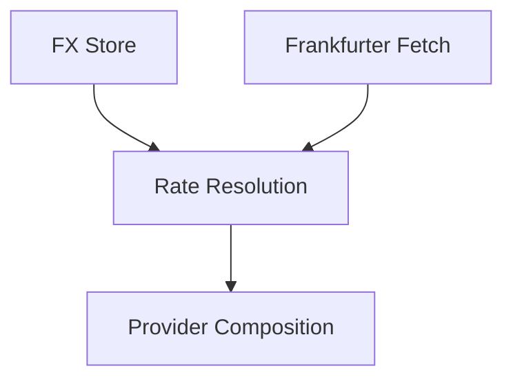

# FX Rate Persistent Store

## 1. Executive Summary

Financial converts money between USD, BRL, and GBP throughout the app — Investment's dashboard totals, asset summaries, and per-transaction/credit conversions, and CashFlow's Controle Mãe ledger — all through a single shared `IExchangeRateProvider`. Today that provider's only cache is a process-lifetime, in-memory dictionary: every time the API or WPF app restarts, the cache empties, and the first dashboard load (or any other FX-heavy read) has to re-fetch every historical date it needs from Frankfurter, one sequential HTTP call at a time. Since a published end-of-day FX rate for a past date never changes, this repeated fetching is pure waste that gets worse as more history accumulates.

This feature introduces a permanent, local JSON file (`data-fx-rates.json`) that sits between the existing in-memory cache and Frankfurter, storing end-of-day USD-based rates (USD→BRL, USD→GBP) for every date once it has been resolved. Once a historical date (yesterday or earlier) is fetched and stored, it is never fetched from Frankfurter again — on this run or any future one. Today's rate is always fetched live and is deliberately never written to the permanent store, so a midday quote can never be mistaken for the day's final closing rate.

The change is entirely internal to the existing FX pipeline: `IExchangeRateProvider.GetHistoricalRateAsync(date, from, to)` keeps its exact signature, and every existing caller in Investment and CashFlow needs no code changes at all. The value delivered is speed and resilience — faster dashboard loads after the first run, fewer outbound calls to a third-party API, and one shared, durable source of truth for FX history instead of a cache that resets on every restart.

## 2. Problem and Opportunity

### The Problem

**Cold-start FX latency**
- Every process restart empties `InMemoryCachedExchangeRateProvider`'s cache, so the first dashboard load after every restart pays the full cost of re-resolving every historical date it needs.
- Frankfurter calls are made one currency pair at a time and sequentially, so a dashboard that touches N historical dates across multiple assets/brokers can trigger N (or more) round trips before it finishes loading.
- This cost repeats identically on every single restart, forever — nothing learned in a previous run survives to the next one.

**No durable memory of stable data**
- A published end-of-day FX rate for a past date is immutable, yet the app currently has no way to remember "this date's rate is already known" across restarts.
- Investment and CashFlow already share one `IExchangeRateProvider` singleton instance at runtime (via `TryAddSingleton` in both bounded contexts' DI wiring), but that sharing is only ever within a single process lifetime.

**Fragile handling of transient failures**
- A network hiccup on a historical date returns `null` from Frankfurter today, and there is no record that a *later*, successful resolution for that same date should be kept — the only cache is the in-memory one, so a successful fetch is only "remembered" until the next restart.

**Unnecessary external dependency load**
- This is a single-user, self-hosted tool (see `CLAUDE.md`), yet it re-requests the same handful of years of historical FX history from a third-party API every time the process restarts, which is wasted load against Frankfurter with no offsetting benefit.

### The Opportunity

A permanent, shared, USD-based FX rate store closes all four gaps at once: once a historical date is resolved, it is written to `data-fx-rates.json` and read from there on every future lookup — this run or any future one — eliminating the repeated network round trips that make cold starts slow. Because the store is shared by both bounded contexts through the same `IExchangeRateProvider` interface they already depend on, neither Investment nor CashFlow needs its own cache or its own Frankfurter client — the single shared store becomes the one durable source of truth for FX history across the whole application.

## 3. Target Audience

### Primary Users

**Self-Hosted Power User**
- Runs Financial as a single-user, self-hosted install (Docker or local `dotnet run`), and personally notices every extra second the dashboard takes to load after a restart.
- Comfortable configuring `appsettings.json`/environment variables and choosing between `LocalJson` and `GoogleDrive` storage providers, since they already do this for `data-investment.json` and `data-cashflow.json`.
- Cares about the accuracy of totals shown in BRL/GBP/USD across both bounded contexts, and expects a stored historical rate to be treated as final, not silently second-guessed on a later run.

## 4. Objectives

- **Reduce** cold-start FX latency: after a date has been resolved once, no subsequent restart re-fetches it from Frankfurter.
  - *Metric:* on a restart where every historical date the dashboard needs is already present in `data-fx-rates.json`, the count of outbound Frankfurter HTTP requests during that dashboard's first load is 0, measured via the Frankfurter HTTP client's request log/counter in an integration test.
- **Eliminate** redundant Frankfurter calls for a given historical date across the application's lifetime.
  - *Metric:* a given (date ≤ yesterday) triggers at most 1 Frankfurter HTTP call across ≥2 consecutive process restarts in the acceptance test suite — the second restart makes 0 calls for that date.
- **Preserve** calculation accuracy by never treating an intraday rate as final.
  - *Metric:* `data-fx-rates.json` contains 0 entries keyed by today's date at any point in time; enforced by a unit test asserting the persistence path rejects `date == DateOnly.FromDateTime(DateTime.Now)`.
- **Keep** the change transparent to every existing FX consumer.
  - *Metric:* 100% of existing call sites (`CurrencyConversionContext`, `CreditService`, `TransactionService`, `ControleMaeService`, `PortfolioDashboardService`, `SummaryService`, `FxEntryCaptureHelper`) compile and pass their existing test suites with zero source changes after the new provider is wired in.

## 5. User Stories

### F01. Persistent FX Rate Store
- As the system, I want to persist each resolved end-of-day USD-based rate for BRL and GBP to `data-fx-rates.json` so that it survives process restarts.
- As the system, I want to load the full FX rate history into memory once at startup so that repeated lookups within a run never re-read the file from disk.
- As the system, I want writes to `data-fx-rates.json` to be atomic and debounced so that many rate resolutions during a busy dashboard load collapse into one file write instead of one per date.
- As the system, I want to read and write `data-fx-rates.json` through either a local path or a Google Drive-backed file, selected by configuration, so the store fits whichever storage provider the rest of the app already uses.
- As the system, I want a missing or corrupted `data-fx-rates.json` to start the app with an empty store rather than failing to start, so a fresh install or a damaged cache file never blocks startup.

### F02. USD-Based Rate Resolution and Yesterday-or-Earlier Rule
- As the system, I want to compute any requested currency pair among USD, BRL, and GBP from a date's stored USD-based rates so that only two numbers need to be stored per date to cover every supported conversion.
- As the system, I want to return 1 immediately when the requested "from" and "to" currencies are the same, without touching the store or Frankfurter, so trivial conversions cost nothing.
- As the system, I want any date strictly before today treated as final and eligible for permanent storage, so a historical lookup is never repeated once resolved.
- As the system, I want today's date to always resolve to a live/intraday rate that is never written to `data-fx-rates.json`, so a midday quote is never mistaken for the day's final closing rate.
- As the system, I want a date for which only one of BRL/GBP could be fetched to stay unpersisted, so an incomplete record is never mistaken for a fully-known date later.

### F03. Batched Frankfurter Historical Fetch
- As the system, I want to fetch USD→BRL and USD→GBP for a given date in a single Frankfurter HTTP call so that resolving a missing date costs one round trip instead of two.
- As the system, I want the existing weekend/holiday walk-back behavior (checking up to 10 days earlier) preserved so a date with no published rate still resolves to the nearest earlier business day's rate.
- As the system, I want a partial Frankfurter response — one currency resolves, the other doesn't — to still return whatever succeeded, so one currency's outage doesn't block the other.

### F04. Layered Exchange Rate Provider Composition
- As the system, I want `IExchangeRateProvider` lookups to check the in-memory cache, then the persistent store, then Frankfurter, in that order, so each layer only does the work the layer before it couldn't.
- As the system, I want the new layered provider registered as the single shared `IExchangeRateProvider` for both Investment and CashFlow so neither bounded context implements its own FX cache or file.
- As the system, I want a rate resolved from the persistent store or from Frankfurter written into the in-memory cache before being returned so the very next lookup for that exact key never touches the store or the network again.

## 6. Functionalities

### F01. Persistent FX Rate Store

**Provides:**
- A stored end-of-day USD-based rate record for a given date — USD→BRL, USD→GBP, source, stored-at timestamp — readable and writable by date (used by F02)

**Capabilities:**
- File: `data-fx-rates.json`, a single JSON document shaped as:
  ```json
  {
    "ratesByDate": {
      "2026-09-20": {
        "base": "USD",
        "rates": { "BRL": 5.452317, "GBP": 0.771845 },
        "source": "frankfurter",
        "storedAt": "2026-09-20T23:59:59Z"
      }
    }
  }
  ```
- BRL and GBP are stored with at least 6 decimal places; the store performs no rounding of its own — all arithmetic consuming these values (F02) works at the same full precision, consistent with the existing Domain convention of never rounding money/rate values except at UI display.
- `source` is always `"frankfurter"` for this task — no manual-entry path is introduced (see §7 Out of Scope).
- Storage provider is selectable through configuration, mirroring `Investment:Repository:Provider` / `CashFlow:Repository:Provider`:
  - `FxRates:Repository:Provider` — `LocalJson` (default) or `GoogleDrive`.
  - `FxRates:DataJsonFile` — local file path, defaulting to `data-fx-rates.json` alongside `data-investment.json`/`data-cashflow.json`.
  - `FxRates:GoogleDrive:CredentialsPath` / `FxRates:GoogleDrive:FilePath` — same shape as the existing per-context Google Drive keys.
- The whole document is loaded into an in-memory dictionary once at process startup (same one-time-load model `CLAUDE.md` documents for `data-investment.json`/`data-cashflow.json`); every read after startup is served from memory, never from disk.
- A write adds or updates one date's entry in the in-memory dictionary, then persists the entire document through the same atomic, debounced path already used for `data-cashflow.json`/`data-investment.json` (`LocalJsonStorage`'s stage-then-rename write for `LocalJson`, `DebouncedJsonStorage`'s coalescing window for `GoogleDrive`) — many rate resolutions in quick succession collapse into one physical write.
- The document carries a `Version` marker following the same forward-compatible pattern as `CashFlowSerializerAdapter`/`InvestmentSerializerAdapter`; a document with no `Version` (any file written before this convention existed) is treated as version 1.
- A missing file at startup is treated as an empty store (`ratesByDate: {}`), not an error.

**Experience:**
Purely backend infrastructure — no UI surface. On API/App startup, the store loads `data-fx-rates.json` (or starts empty if it doesn't exist yet). On shutdown, the existing `ShutdownFlushHostedService` mechanism — already used to flush pending Investment/CashFlow repository writes — is extended to also flush any pending FX-rate write, so a rate resolved just before a clean shutdown is not lost.

**Error Handling:**
- File exists but contains invalid JSON at startup: log a warning naming the exception type only (never file contents), and start with an empty in-memory store rather than failing application startup.
- Write fails after retries (GoogleDrive transient failure, disk full): the resolved rate remains correct and usable for the rest of this process's life via the in-memory dictionary/cache; the write is retried on the next debounce cycle through the existing `DebouncedJsonStorage` retry policy; a persistently failing store never blocks a caller's rate lookup.
- Two different dates are resolved within the same debounce window: both updates land in the shared in-memory dictionary before the coalesced write serializes the whole document, so neither is lost.

### F02. USD-Based Rate Resolution and Yesterday-or-Earlier Rule

**Consumes:**
- F01: stored end-of-day USD-based rate record for a date (read and write)
- F03: freshly fetched USD→BRL / USD→GBP rates for a date, possibly partial

**Provides:**
- A resolved rate for any (date, from, to) triple within {USD, BRL, GBP} (used by F04)

**Capabilities:**
- Supported currencies: exactly USD, BRL, GBP — matching the existing `Currency` enum; no new currency values are introduced.
- `from == to`: returns `1` immediately, with no store read and no Frankfurter call — centralizes the short-circuit `CurrencyConversionContext` already applies today for Investment, so every caller (including CashFlow's `ControleMaeService`) gets it.
- Cross-rate computation from the two USD-based stored numbers:
  - USD → X: the stored rate for X directly.
  - X → USD: the reciprocal of the stored rate for X (`1 / storedRate(X)`).
  - X → Y (both non-USD): `storedRate(Y) / storedRate(X)`.
  - All arithmetic is performed in `decimal` at full stored precision; no intermediate rounding.
- Date classification uses host-local "today" (`DateOnly.FromDateTime(DateTime.Now)`, the same convention already used in `ControleMaeService.CreateEntryAsync`):
  - `date < Today`: final/historical. Resolved from F01 if present; otherwise fetched via F03, and — only once both BRL and GBP for that date are known — persisted to F01 before returning.
  - `date == Today`: live/intraday. Always resolved via F03 (or the outer in-memory cache within this process run) and never written to F01, even though the two currencies may both be available.
  - `date > Today`: behaves exactly as today — no existing caller passes a future date, and this task adds no new validation for it.
- Partial-fetch handling: if F03 returns only one of BRL/GBP for a date, that date is not persisted to F01 — a stored record always carries both currencies, so a partial fetch is treated as "still unresolved" for storage purposes, even though the successfully fetched currency can still satisfy the immediate caller if it's the one requested.

**Experience:**
Backend logic only. The caller-visible symptom of an unresolved rate — a `null` return — is unchanged from today's behavior, and existing UI already displays a degraded/partial state for it (e.g., `PortfolioDashboardService`'s existing partial-conversion reporting).

**Error Handling:**
- Frankfurter fails to resolve either currency for a historical date: returns `null` for the requested pair, exactly as today; nothing is persisted, so the next request for that date retries instead of caching a permanent miss.
- A previously stored rate is never re-validated against a fresh Frankfurter fetch (out of scope, §7) — once persisted, a date's rate is authoritative and is never silently overwritten.
- A stored rate of zero (not achievable through a real FX rate, but guards a corrupted file): reciprocal/cross computation treats this as an unresolvable rate (`null`) rather than throwing a divide-by-zero exception, logging a data-quality warning naming only the date.

### F03. Batched Frankfurter Historical Fetch

**Provides:**
- USD→BRL and USD→GBP rates for a given date, or a partial/empty result on failure (used by F02)

**Capabilities:**
- Single HTTP call per date: `GET {Frankfurter base}/{date}?from=USD&to=BRL,GBP`, replacing today's one-currency-at-a-time `to={to}` request shape in `FrankfurterExchangeRateProvider`.
- Weekend/holiday walk-back is preserved unchanged: if the exact date has no published rate, walk back up to 10 days earlier (`MaxFallbackDays` stays 10) and use the first date that returns a response.
- The result is associated with the originally requested date, not the fallback date actually used — matching today's behavior where a Friday's rate silently stands in for a Saturday/Sunday request.
- Any HTTP or deserialization exception is caught and logged (exception type, currencies, and date only — never response content) and treated as "no rates available for this date" rather than propagating.

**Error Handling:**
- Frankfurter unreachable (timeout, DNS failure, 5xx): logged as a warning; returns no rates for either currency; causes F02 to return `null` for the requested pair and skip persistence so the next request retries.
- Frankfurter returns one currency but not the other in the same response: returns whichever succeeded; F02 does not persist the date until both are available (see F02's partial-fetch rule).
- Rate limiting / HTTP 429: treated the same as any other failed fetch — logged, returns no rate. No retry-with-backoff is added in this task, since the existing provider has none today and the new file store already removes the majority of repeat calls that would otherwise risk rate limiting.

### F04. Layered Exchange Rate Provider Composition

**Consumes:**
- F02: resolved rate for any (date, from, to) triple

**Capabilities:**
- `IExchangeRateProvider.GetHistoricalRateAsync(DateOnly date, Currency from, Currency to)`'s signature is unchanged — no existing call site (`CurrencyConversionContext`, `CreditService`, `TransactionService`, `ControleMaeService`, `PortfolioDashboardService`, `SummaryService`, `FxEntryCaptureHelper`) requires any source change.
- The existing outer `InMemoryCachedExchangeRateProvider` process-lifetime cache (keyed by `date|from|to`) is kept exactly as it works today; it now decorates the new file-backed-plus-Frankfurter provider (F01 + F02 + F03) instead of decorating `FrankfurterExchangeRateProvider` directly.
- Registered once as the single shared `IExchangeRateProvider` singleton, following the existing `TryAddSingleton` pattern already duplicated in both `InvestmentInfrastructureServiceCollectionExtensions` and `CashFlowInfrastructureServiceCollectionExtensions` — only the first registration to run wins, so both bounded contexts continue to share one instance, exactly as today.
- No bounded context gains its own FX cache, file, or Frankfurter client — the existing `FrankfurterIsolationRuleTests` architecture test, which already asserts only the Frankfurter integration touches the Frankfurter API, continues to pass unmodified.

**Experience:**
Purely compositional — every existing FX-dependent view (Investment dashboard, asset summaries, Credits grid, Controle Mãe) behaves identically to today, just faster on repeat runs once dates have been resolved once.

## 7. Out of Scope

**Entity-level audit snapshots**
- Adding `FromCurrency` or a converted-amount field to Investment's existing `FxRateSnapshot` on `Transaction`/`Credit`.
- Adding any FX snapshot to CashFlow's `MaeLedgerEntry`, which continues to call `IExchangeRateProvider` live for every read/computation exactly as it does today.

**Store population strategy**
- Any one-time backfill or migration tool that pre-populates `data-fx-rates.json` for dates already referenced by existing Transactions/Credits/MaeLedgerEntries. The store fills in reactively, purely from live request traffic.
- Any scheduled/background job (e.g., a new `IHostedService`) that proactively pre-fetches or warms the store. Resolution stays request-driven, as it is today.

**Operator-facing surface**
- Any Admin-area UI (Web or WPF) to list, inspect, or manually enter/correct a stored rate. `source` is always `"frankfurter"`; no `"manual"` entry path exists in this task.

**Currency and correctness scope**
- Any currency beyond USD, BRL, and GBP.
- Detecting or reconciling a disagreement between an already-stored historical rate and what Frankfurter would return today for the same date — once stored, a date's rate is permanently authoritative.
- Retry-with-backoff, circuit-breaker behavior, or rate-limit handling for Frankfurter beyond what exists today.
- Changing the Frankfurter fallback window (`MaxFallbackDays`) or its walk-back semantics.

## 8. Dependency Graph

### Part 1: Dependency Table

| # | Feature | Priority | Dependencies |
|---|---------|----------|---------------|
| F01 | Persistent FX Rate Store | 1 | None |
| F03 | Batched Frankfurter Historical Fetch | 1 | None |
| F02 | USD-Based Rate Resolution and Yesterday-or-Earlier Rule | 1 | F01, F03 |
| F04 | Layered Exchange Rate Provider Composition | 1 | F02 |

### Execution Waves
Features within the same wave can be built in parallel. A wave starts only after every feature in earlier waves is complete.

- **Wave 1**: F01, F03
- **Wave 2**: F02
- **Wave 3**: F04

### Priority levels
- **1** = Essential — product does not work without it
- **2** = Important — significant value addition
- **3** = Desirable — incremental improvement



## 9. Acceptance Criteria

### F01. Persistent FX Rate Store
- [ ] Given no `data-fx-rates.json` file exists, the application starts successfully with the FX store initialized to an empty `ratesByDate` map.
- [ ] Given a resolved historical rate is persisted, the file on disk contains an entry keyed by the requested date's exact `yyyy-MM-dd` string, with `base` = `"USD"`, `rates.BRL` and `rates.GBP` each carrying at least 6 decimal places, `source` = `"frankfurter"`, and a `storedAt` timestamp.
- [ ] Given `FxRates:Repository:Provider` is set to `GoogleDrive`, the store reads and writes through the same Google Drive client/credentials mechanism already used by Investment/CashFlow.
- [ ] Given `FxRates:Repository:Provider` is unset or `LocalJson`, the store defaults to `LocalJson`, matching Investment/CashFlow's own default.
- [ ] Given `data-fx-rates.json` exists but contains invalid JSON, the application logs a warning and starts with an empty in-memory FX store instead of failing to start.
- [ ] Given two different dates are resolved within the same debounce window, both entries are present in the file after the debounced write completes.

### F02. USD-Based Rate Resolution and Yesterday-or-Earlier Rule
- [ ] Given `from` and `to` are the same currency, `GetHistoricalRateAsync` returns `1` with no store read and no Frankfurter call.
- [ ] Given a date strictly before today already present in the store, `GetHistoricalRateAsync` returns the computed pair using only the stored USD-based rates, with no Frankfurter call.
- [ ] Given a date strictly before today with no entry in the store, `GetHistoricalRateAsync` fetches from Frankfurter, computes the requested pair, and results in that date being persisted with both BRL and GBP present.
- [ ] Given today's date, `GetHistoricalRateAsync` returns a live rate, and no entry keyed by today's date exists in the store after the call.
- [ ] Given requests for USD→BRL, USD→GBP, BRL→USD, GBP→USD, BRL→GBP, and GBP→BRL for the same historical date, all six results are mathematically consistent via the two stored USD-based rates.
- [ ] Given Frankfurter fails to resolve either currency for a historical date, `GetHistoricalRateAsync` returns `null` and nothing is persisted for that date.
- [ ] Given Frankfurter resolves only one of BRL/GBP for a historical date, that date is not persisted to the store.

### F03. Batched Frankfurter Historical Fetch
- [ ] Given a historical date with published rates, exactly one outbound HTTP call retrieves both USD→BRL and USD→GBP.
- [ ] Given a date with no published rate (e.g., a weekend), the fetch walks back up to 10 earlier days and returns the first date with a published rate, associated with the originally requested date.
- [ ] Given the Frankfurter endpoint is unreachable, the fetch returns no rates for either currency without throwing, and the failure is logged with exception type, currencies, and date only.
- [ ] Given Frankfurter's response includes BRL but omits GBP (or vice versa), the fetch returns the one available rate rather than failing entirely.

### F04. Layered Exchange Rate Provider Composition
- [ ] Given both Investment and CashFlow infrastructure are composed in the same process, exactly one `IExchangeRateProvider` singleton is resolved by both, backed by the new layered chain.
- [ ] Given a rate for a (date, from, to) key was already resolved once in this process, a second request for the same key returns from the in-memory cache with no store read and no Frankfurter call.
- [ ] Given the existing test suites for `CurrencyConversionContext`, `CreditService`, `TransactionService`, `ControleMaeService`, `PortfolioDashboardService`, and `SummaryService`, all pass unmodified against the new provider composition.
- [ ] `FrankfurterIsolationRuleTests` continues to pass, confirming no bounded context calls Frankfurter directly.

### Cross-Feature Integration
- [ ] A rate persisted by F01 for a historical date is correctly read back and used by F02's resolution logic to compute a requested currency pair, with no redundant Frankfurter call.
- [ ] Rates fetched by F03 for a historical date are correctly handed to F02, which persists them to F01 only when both BRL and GBP are present.
- [ ] A rate resolved by F02 — whether served from F01 or freshly fetched via F03 — is correctly returned through F04's provider chain to an existing caller (e.g., `ControleMaeService.CreateEntryAsync`) with no change to that caller's code.
