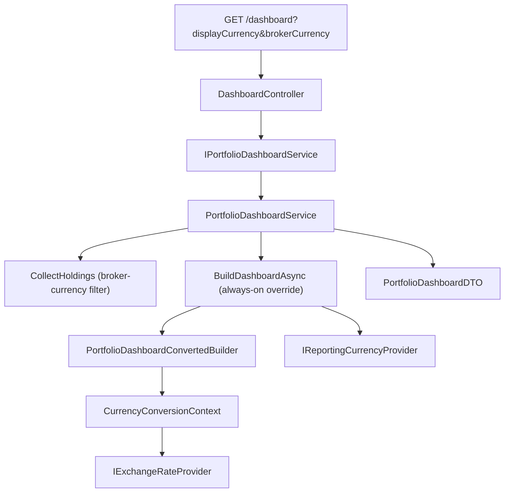

## Complexity: medium

## 1. Technical Overview

**What:** `IPortfolioDashboardService.GetDashboardAsync` gains two optional parameters —
`Currency? displayCurrency` and `Currency? brokerCurrencyFilter` — so the Dashboard KPI totals can
be (a) converted into a caller-chosen currency regardless of the global Reporting Currency
setting's enabled/disabled flag, and (b) computed only from brokers whose native currency matches
a caller-chosen filter, across both active and historic brokers. `GET /dashboard` exposes these as
optional `displayCurrency`/`brokerCurrency` query-string values, validated at the controller
boundary before any data is read.

**Why:** Today `PortfolioDashboardService` always converts using the single, server-persisted
Reporting Currency setting, gated by that setting's own enabled flag, and always includes every
broker. The PRD's F03/F04 front ends need a page-local, non-persisted override of both the target
currency and which brokers feed the totals — without touching the global setting or its endpoint
(P49, out of scope here). This feature adds exactly the two seams those front ends need, reusing
the already-shipped `CurrencyConversionContext` / `PortfolioDashboardConvertedBuilder` conversion
engine and the `EnumParser`/`ParseCurrency` broker-currency parsing already used by this same
service — no new conversion engine, no new persistence.

**Scope:**
- **Included:** `GetDashboardAsync(Currency? displayCurrency, Currency? brokerCurrencyFilter)`
  overload; broker-currency filtering applied before any valuation/conversion work, for both
  `ActiveBrokers` and `HistoricBrokers`; always-on conversion override when `displayCurrency` is
  supplied (ignores `IsReportingCurrencyEnabled()`); `ReportingCurrency`/
  `IsReportingCurrencyEnabled` on `PortfolioDashboardDTO` reflect the resolved (requested-or-global)
  currency and whether conversion actually ran; partial/unavailable semantics unchanged and
  reused as-is; `GET /dashboard` query params `displayCurrency`/`brokerCurrency` (strings),
  parsed via `EnumParser.TryParseEnum<Currency>`, 400 on an invalid value; OpenAPI snapshot +
  `Financial.Web` generated-types regeneration.
- **Excluded (later features in this PRD):** Any UI control or page-local state (F03/F04);
  Allocation Breakdown's own conversion/filtering (F02 — separate service/DTO); persisting either
  parameter anywhere; changes to the global Reporting Currency setting or its endpoint.

## 2. Architecture Impact



**Affected components:**

| Component | Change |
|---|---|
| `Financial.Investment.Application/Interfaces/IPortfolioDashboardService.cs` | Modified — `GetDashboardAsync` gains two optional `Currency?` parameters, both defaulting to `null` |
| `Financial.Investment.Application/Services/PortfolioDashboardService.cs` | Modified — broker-currency filter in `CollectHoldings`/`AddHoldings`; always-on conversion override in `BuildDashboardAsync` |
| `Financial.Api/Controllers/DashboardController.cs` | Modified — `[FromQuery]` string params `displayCurrency`/`brokerCurrency`, parsed and validated before calling the service |
| `Tests/Financial.Api.Tests/Contract/openapi-v1.snapshot.json` | Regenerated — new query params on `GET /dashboard` |
| `Financial.Web/src/api/generated/openapi.ts` | Regenerated from the updated snapshot |

No other caller of `GetDashboardAsync` (e.g. `Financial.App`'s `DashboardKpiTilesViewModel`) needs
a change in this feature: both new parameters default to `null`, so the existing zero-argument
call preserves today's exact behavior (native totals, conversion gated by the global setting, all
brokers included) — the PRD's own AC for this feature ("Requesting the Dashboard without a display
currency preserves today's exact behaviour").

## 3. Technical Decisions

| Decision | Chosen Approach | Alternative Considered | Trade-off |
|---|---|---|---|
| Where broker filtering is applied | Inside `AddHoldings`, skip a broker whose `ParseCurrency(broker.Currency)` doesn't equal a supplied `brokerCurrencyFilter`, before any `IHoldingValuationService.GetValuation` call or holding is added to the in-memory list; applies identically to `ActiveBrokers` and `HistoricBrokers` | Filter the already-built `IReadOnlyList<PortfolioHolding>` after `CollectHoldings` returns | Filtering pre-collection avoids valuing/loading holdings that will be discarded anyway and keeps the "filter before any valuation or conversion work" AC literally true rather than true only by incidental ordering |
| Always-on conversion override semantics | `BuildDashboardAsync` computes `var effectiveCurrency = displayCurrency ?? reportingCurrency;` and `var shouldConvert = displayCurrency is not null \|\| _reportingCurrencyProvider.IsReportingCurrencyEnabled();`; when `shouldConvert`, call `PortfolioDashboardConvertedBuilder.BuildAsync(holdings, effectiveCurrency, ...)`; `ReportingCurrency` on the DTO is always `effectiveCurrency.ToString()` and `IsReportingCurrencyEnabled` is always `converted is not null` (i.e., `shouldConvert`) | Add a separate `RequestedDisplayCurrency` field to the DTO alongside the existing `ReportingCurrency` field | The plan's confirmed decision is explicit that no new DTO fields are needed for the KPI side — `ReportingCurrency`/`IsReportingCurrencyEnabled` already exist and already mean "the currency conversion ran into, and whether it ran"; overloading their existing meaning to reflect the resolved currency (global-or-requested) keeps `PortfolioDashboardDTO` unchanged and is exactly what F03/F04 need to read |
| Controller query-param validation | `[FromQuery] string? displayCurrency`, `[FromQuery] string? brokerCurrency`; for each supplied (non-null/non-empty) value, `EnumParser.TryParseEnum<Currency>` — on failure, `BadRequest()` immediately, before calling the service; absent/empty values map to `null` and are never validated (matches "when absent, all brokers... matching current behaviour") | Bind directly to `Currency?` via a custom model binder | `ReportingCurrencyController` already establishes the `EnumParser.TryParseEnum` + `BadRequest()` pattern for this exact enum in this exact codebase; reusing it keeps validation behavior (case-insensitive, same error shape) consistent across every currency-accepting endpoint rather than introducing a second parsing path |
| Historic-brokers scope for filtering | Filter applies to both `ActiveBrokers` and `HistoricBrokers`, matching the Dashboard KPI's existing scope (which already includes both, unlike Allocation Breakdown/F02's active-only scope) | Restrict filtering to active brokers only, for symmetry with F02 | The PRD's own F01 acceptance criterion is explicit: "excludes both active and historic brokers that don't match, from every KPI total" — the pre-existing Dashboard/Allocation asymmetry is called out as intentional and out of scope to change |

## 4. Component Overview

**Application:**

| File Path | New/Modified | Purpose | Key Responsibilities |
|---|---|---|---|
| `Financial.Investment.Application/Interfaces/IPortfolioDashboardService.cs` | Modified | Contract | `GetDashboardAsync(Currency? displayCurrency = null, Currency? brokerCurrencyFilter = null)` |
| `Financial.Investment.Application/Services/PortfolioDashboardService.cs` | Modified | Dashboard aggregation | Accepts and threads both new parameters through `CollectHoldings`/`AddHoldings` (filter) and `BuildDashboardAsync` (always-on override); no change to `SumActiveScope`/`SumIncome`/`SumRealisedGainLoss`/XIRR calculation logic |
| `Financial.Investment.Application/Services/PortfolioDashboardConvertedBuilder.cs` | Unmodified | Conversion engine | Already takes an arbitrary target `Currency`; reused as-is with `effectiveCurrency` |

**Presentation:**

| File Path | New/Modified | Purpose | Key Responsibilities |
|---|---|---|---|
| `Financial.Api/Controllers/DashboardController.cs` | Modified | `GET /dashboard` | Parses/validates `displayCurrency`/`brokerCurrency` query strings; 400 on invalid; calls the new service overload |

## 5. API Contracts

**Endpoint: Get Portfolio Dashboard (extended)**
- **Method:** GET
- **Path:** `/api/v1/financial/dashboard`

**Request:**

| Field | Type | Required | Validation | Description |
|---|---|---|---|---|
| `displayCurrency` | `string` (query) | No | Must parse to `BRL`/`GBP`/`USD` (case-insensitive) if supplied | Currency to convert every KPI total into; when supplied, conversion always runs regardless of the global Reporting Currency setting's enabled flag |
| `brokerCurrency` | `string` (query) | No | Must parse to `BRL`/`GBP`/`USD` (case-insensitive) if supplied | Restricts KPI totals to brokers (active and historic) whose native currency matches; absent = all brokers |

**Request Example:**
```
GET /api/v1/financial/dashboard?displayCurrency=GBP&brokerCurrency=BRL
```

**Response (200 OK):** `PortfolioDashboardDTO`, unchanged shape (no new fields). `reportingCurrency`
reflects `displayCurrency` when supplied, otherwise the global setting's currency.
`isReportingCurrencyEnabled` reflects whether conversion actually ran (always `true` when
`displayCurrency` is supplied and at least one currency group didn't fail entirely).

```json
{
  "marketValue": 15000.00,
  "invested": 12000.00,
  "unrealisedGainLoss": 3000.00,
  "realisedGainLoss": 500.00,
  "incomeYtd": 200.00,
  "incomeLifetime": 900.00,
  "grossXirr": 0.11,
  "netXirr": 0.10,
  "unvaluedHoldingCount": 0,
  "isPartial": false,
  "reportingCurrency": "GBP",
  "isReportingCurrencyEnabled": true,
  "convertedMarketValue": 2150.75,
  "convertedInvested": 1720.00,
  "convertedUnrealisedGainLoss": 430.75,
  "convertedRealisedGainLoss": 71.60,
  "convertedIncomeYtd": 28.60,
  "convertedIncomeLifetime": 128.70,
  "convertedGrossXirr": 0.11,
  "convertedNetXirr": 0.10,
  "isReportingCurrencyPartial": false,
  "isReportingCurrencyUnavailable": false
}
```

**Empty-filter example** (`brokerCurrency=USD` today, no USD brokers exist):

```json
{
  "marketValue": 0.0,
  "invested": 0.0,
  "unrealisedGainLoss": 0.0,
  "realisedGainLoss": 0.0,
  "incomeYtd": 0.0,
  "incomeLifetime": 0.0,
  "grossXirr": null,
  "netXirr": null,
  "unvaluedHoldingCount": 0,
  "isPartial": false,
  "reportingCurrency": "GBP",
  "isReportingCurrencyEnabled": true,
  "convertedMarketValue": 0.0,
  "convertedInvested": 0.0,
  "convertedUnrealisedGainLoss": 0.0,
  "convertedRealisedGainLoss": 0.0,
  "convertedIncomeYtd": 0.0,
  "convertedIncomeLifetime": 0.0,
  "convertedGrossXirr": null,
  "convertedNetXirr": null,
  "isReportingCurrencyPartial": false,
  "isReportingCurrencyUnavailable": false
}
```

**Error Codes:**

| Code | HTTP Status | Description |
|---|---|---|
| — | 400 | `displayCurrency` or `brokerCurrency` supplied but not one of `BRL`/`GBP`/`USD` |

## 6. Data Model

Not applicable — no persistence change. Both parameters are request-scoped only; nothing new is
written to `data-investment.json`.

## 7. Testing Strategy

Per the `testing-guide-Financial` skill: Application-layer unit tests cover broker filtering and
the always-on override in isolation; a new AC-tracing integration test file proves the query
params reach the real host and behave per Section 9; an existing API contract test's snapshot is
regenerated and re-pinned.

| Test File | Test Type | Target | Coverage Goal |
|---|---|---|---|
| `Tests/Financial.Investment.Application.Tests/Services/PortfolioDashboardServiceTests.cs` | Unit | `PortfolioDashboardService` | Extended with: `GetDashboardAsync_WithBrokerCurrencyFilter_ExcludesNonMatchingActiveAndHistoricBrokers`; `GetDashboardAsync_WithBrokerCurrencyFilterMatchingNoBrokers_ReturnsZeroTotalsNotError`; `GetDashboardAsync_WithDisplayCurrency_ConvertsRegardlessOfGlobalSettingDisabled`; `GetDashboardAsync_WithDisplayCurrency_ReportingCurrencyReflectsRequestedValue`; `GetDashboardAsync_WithoutDisplayCurrencyOrFilter_PreservesExistingGatedBehavior` (regression covering the existing zero-argument call path) |
| `Tests/Financial.Api.Tests/Acceptance/PortfolioDashboardAggregateAcceptanceTests.cs` | Integration (AC-tracing) | `GET /dashboard` | Extended with one tagged test per F01 §9 criterion: valid `displayCurrency` converts regardless of global setting; omitted params preserve today's behavior; `brokerCurrency` excludes non-matching active+historic brokers; `brokerCurrency=USD` (no brokers) returns 200 with zero totals; invalid `displayCurrency`/`brokerCurrency` returns 400 before any calculation; partial vs. unavailable flagging via a stubbed `IExchangeRateProvider` returning null for some/all lookups |
| `Tests/Financial.Api.Tests/Contract/OpenApiContractTests.cs` | Contract | OpenAPI snapshot | Existing test re-verifies the regenerated snapshot includes the two new optional query params on `GET /dashboard` and that numeric properties stay stripped of the spurious `["number","string"]` alternative |

**Required regeneration steps (part of Definition of Done, not optional):**
1. `UPDATE_OPENAPI_SNAPSHOT=1 dotnet test Tests/Financial.Api.Tests` (bash) or the PowerShell
   `$env:UPDATE_OPENAPI_SNAPSHOT=1; ...; Remove-Item Env:\UPDATE_OPENAPI_SNAPSHOT` sequence — review
   the diff.
2. `cd Financial.Web && npm run generate-api-types` — commit the regenerated
   `src/api/generated/openapi.ts` in the same PR (`openapiFreshness.test.ts` fails otherwise). No
   hand-written `types.ts` alias changes are needed since `PortfolioDashboardDTO`'s shape is
   unchanged.

## Assumptions / Decisions (Auto-Accept Policy)

- **Scope question skipped** — the PRD's F01 entry has no `Core Scope`/`Full Scope additions`
  blocks, so the full feature definition above is in scope (per skill edge case: neither block
  present → assume full scope).
- **Query parameter names** (`displayCurrency`, `brokerCurrency`) — taken directly from the
  approved plan (`C:\Users\ggibe\.claude\plans\pasted-content-id-b7ab-dashboard-deep-horizon.md`),
  not re-derived.
- **No new DTO fields** — per the plan's explicit confirmation that `ReportingCurrency`/
  `IsReportingCurrencyEnabled` already suffice for the KPI side; documented here so the review can
  confirm this reuse-over-addition choice.
- **Test file names** — `PortfolioDashboardServiceTests.cs` (existing, extended) and
  `PortfolioDashboardAggregateAcceptanceTests.cs` (existing, extended) were located by searching
  the test tree for current `GetDashboardAsync`/`GetPortfolioDashboard` callers; both already exist
  and follow this repo's one-test-class-per-service/controller convention, so new tests are added
  to them rather than new files created, consistent with `testing-guide-Financial`'s AC-tracing
  convention of one tagged test per provable acceptance criterion in the existing controller-level
  acceptance suite.
- **`EnumParser.TryParseEnum<Currency>` validation helper** — reused verbatim from
  `Financial.Shared.Abstractions/Validation/EnumParser.cs`, the same helper
  `ReportingCurrencyController` and `PortfolioDashboardService.ParseCurrency` already use; no new
  validation helper is introduced.
- **DI/constructor** — no constructor changes: `PortfolioDashboardService` already holds every
  dependency (`IExchangeRateProvider`, `IReportingCurrencyProvider`, `TimeProvider`) this feature
  needs; only method signatures change.
- **WPF call-site impact** — confirmed by inspection that `Financial.App`'s
  `DashboardKpiTilesViewModel.LoadAsync` calls `GetDashboardAsync()` with no arguments; because
  both new parameters default to `null`, this call site requires no change for F01 (F04 will pass
  real values later).
