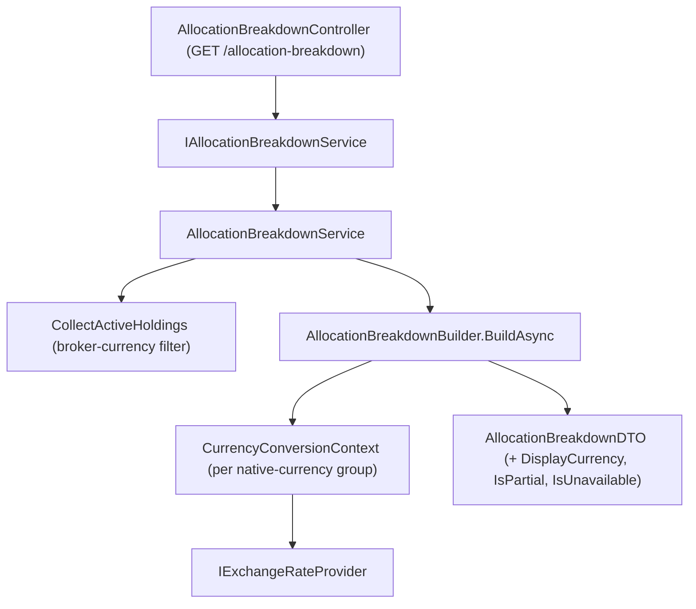

## Complexity: medium

## 1. Technical Overview

**What:** `AllocationBreakdownService`/`AllocationBreakdownBuilder` gain the same optional
`displayCurrency`/`brokerCurrency` query contract as F01's Dashboard KPI totals. Every priced
holding's market value is converted into `displayCurrency` before it is grouped into any of the
four allocation dimensions (`ByClass`, `ByCurrency`, `ByCountry`, `ByBroker`), so both the
dimension totals and their derived percentages are numerically correct even when brokers span
more than one native currency. Brokers not matching `brokerCurrency` are excluded before any
valuation work, mirroring the existing (pre-existing, unchanged) active-brokers-only scope of
this panel. `AllocationBreakdownDTO` gains `DisplayCurrency`, `IsPartial`, `IsUnavailable` —
one banner for the whole panel, not per dimension entry — following the exact provenance shape
already shipped for the Dashboard's converted KPI row.

**Why:** Today `AllocationBreakdownBuilder.Group` sums each holding's native `MarketValue` with
zero currency awareness — a BRL broker and a GBP broker are added as if they were the same unit,
so every dimension's percentages are already wrong as soon as more than one broker currency is
present. This is the actual bug fix in this PRD; F01 only extends an already-currency-safe KPI
path. The fix reuses the already-shipped multi-currency infrastructure from P49
(`IExchangeRateProvider`, `CurrencyConversionContext`) via the exact group-by-native-currency →
convert → sum pre-pass `PortfolioDashboardConvertedBuilder` already established for the KPI tiles,
rather than inventing a new conversion mechanism for this panel.

**Scope:**
- **Included:** `IAllocationBreakdownService.GetAllocationBreakdownAsync(Currency? displayCurrency, Currency? brokerCurrencyFilter)`
  (async, since conversion requires awaiting the exchange-rate provider); broker-currency filtering
  applied before valuation, to active brokers only (this feature does not extend Allocation
  Breakdown's scope to include historic brokers — that pre-existing asymmetry with the Dashboard
  KPI totals is explicitly out of scope); the conversion pre-pass in `AllocationBreakdownBuilder`
  for all four dimensions; three new `AllocationBreakdownDTO` fields; `AllocationBreakdownController`
  query-string parsing with 400 on an invalid value; OpenAPI snapshot + `openapi.ts` regeneration.
- **Excluded (this PRD's other features):** Any Dashboard KPI change (F01, separate service);
  any React/WPF control or display of these new fields (F03/F04); extending Allocation Breakdown
  to include historic brokers (explicitly out of scope per PRD §7); any new exchange-rate source.

## 2. Architecture Impact



**Affected components:**

| Component | Change |
|---|---|
| `Financial.Investment.Application/Interfaces/IAllocationBreakdownService.cs` | Modified — method becomes `Task<AllocationBreakdownDTO> GetAllocationBreakdownAsync(Currency? displayCurrency = null, Currency? brokerCurrencyFilter = null)` |
| `Financial.Investment.Application/Services/AllocationBreakdownService.cs` | Modified — injects `IExchangeRateProvider` and an optional `TimeProvider`; applies the broker-currency filter in `CollectActiveHoldings`; awaits the builder |
| `Financial.Investment.Application/Services/AllocationBreakdownBuilder.cs` | Modified — `Build` becomes `BuildAsync`; adds the conversion pre-pass ahead of the existing `Group` logic |
| `Financial.Investment.Application/DTOs/AllocationBreakdownDTO.cs` | Modified — adds `DisplayCurrency`, `IsPartial`, `IsUnavailable` |
| `Financial.Api/Controllers/AllocationBreakdownController.cs` | Modified — `[FromQuery] string? displayCurrency`, `[FromQuery] string? brokerCurrency`, parsed via `EnumParser.TryParseEnum<Currency>`, 400 on invalid; action becomes `async Task<ActionResult<AllocationBreakdownDTO>>` |
| `Tests/Financial.Api.Tests/Contract/openapi-v1.snapshot.json` | Regenerated — new query params + response fields |
| `Financial.Web/src/api/generated/openapi.ts` | Regenerated (consumed by F03, not modified by this feature otherwise) |

## 3. Technical Decisions

| Decision | Chosen Approach | Alternative Considered | Trade-off |
|---|---|---|---|
| Conversion pre-pass placement | Group priced holdings by native `Currency`, build one `CurrencyConversionContext` per group (`from = nativeCurrency, to = displayCurrency`), convert each holding's `MarketValue` once, then feed the same existing `Group()`/percentage logic with the converted value | Convert each dimension's already-summed native total with a single spot rate | Converting the already-summed total would need one broker's currency per dimension bucket, which doesn't hold for `ByClass`/`ByCountry` (a class or country can span brokers of different currencies) — only per-holding conversion before grouping is correct for every dimension, matching `PortfolioDashboardConvertedBuilder`'s own reasoning for its per-record approach |
| "As of" date for the conversion | `DateOnly.FromDateTime(_timeProvider.GetUtcNow().UtcDateTime)` — today, exactly like `PortfolioDashboardService`'s terminal-market-value conversion (`AddTerminalValueAsync`'s `asOf`) | A per-holding "priced as of" date pulled from the asset's own valuation | Allocation Breakdown has no existing "as of" concept — it reports a single live snapshot, not a dated series. Its one and only converted quantity (market value) is itself already a "right now" number from `IHoldingValuationService`, so converting it at "today's" rate is the correct, simplest choice and requires no new date-tracking concept: it is the exact converted-value use case `PortfolioDashboardConvertedBuilder.AddTerminalValueAsync` already solves the same way |
| Constructor shape | Add `IExchangeRateProvider exchangeRateProvider` (required, null-checked) and `TimeProvider? timeProvider = null` defaulting to `TimeProvider.System` — same two-parameter addition pattern as `PortfolioDashboardService`'s constructor | Also inject `IReportingCurrencyProvider` and an always-on-override gate like F01 | F02 has no pre-existing gated/native-vs-converted duality to preserve — Allocation Breakdown has never converted anything, so there is no "global setting" to override. Conversion here is purely and only opt-in via the `displayCurrency` query param; when it's absent, behavior is 100% today's (native, unconverted) — no gate needed |
| Holding-level conversion failure | A holding whose market-value conversion fails (`CurrencyConversionContext.ConvertAsync` returns `null`) is excluded from every dimension for that call, exactly like an already-existing unpriced holding is excluded today; its failure still increments that group's `FailureCount` for the panel-level `IsPartial`/`IsUnavailable` determination | Include it at native (unconverted) value, or at `0m` | Either alternative would silently mix currencies again (native value) or distort every dimension's percentage total (a fake zero) — dropping the holding from the sum while still counting the failure toward the panel-level flag is the only option consistent with "never silently wrong" (PRD §4 Success Metrics) and with how an unpriced holding is already handled |
| Panel-level `IsPartial`/`IsUnavailable` | Aggregate across every `CurrencyConversionContext` created during the call: `IsUnavailable` when at least one context attempted a conversion and every attempted context's `FailureCount == AttemptCount`; `IsPartial` when any context has `FailureCount > 0` and the response is not unavailable — identical rule to `PortfolioDashboardConvertedBuilder.BuildResult` | A separate partial/unavailable flag per dimension | PRD explicitly states these semantics apply "once at the panel level (not per dimension entry)" — a single pair of flags on the DTO root, reusing F01's already-proven aggregation rule exactly, keeps the two panels behaviorally consistent as the PRD requires |
| No-`displayCurrency` compatibility | When `displayCurrency` is `null`, skip the conversion pre-pass entirely and group using each holding's native `MarketValue` (today's exact code path); `DisplayCurrency` is `null`, `IsPartial`/`IsUnavailable` are both `false` on the response | Always run the (now-async) conversion pipeline with `from == to` short-circuiting inside `CurrencyConversionContext` | `CurrencyConversionContext` requires an explicit `to` currency; there is no "no conversion" `Currency` value, and forcing a currency choice for the compatibility path would fabricate a `DisplayCurrency` for a caller that never asked for one. Skipping the pipeline outright is simpler and matches the PRD's own wording: "behaviour is unchanged from today" |

## 4. Component Overview

**Application:**

| File Path | New/Modified | Purpose | Key Responsibilities |
|---|---|---|---|
| `Financial.Investment.Application/Interfaces/IAllocationBreakdownService.cs` | Modified | Contract | `Task<AllocationBreakdownDTO> GetAllocationBreakdownAsync(Currency? displayCurrency = null, Currency? brokerCurrencyFilter = null)` |
| `Financial.Investment.Application/Services/AllocationBreakdownService.cs` | Modified | Orchestration | Injects `IExchangeRateProvider`/optional `TimeProvider`; filters active brokers by `brokerCurrencyFilter` in `CollectActiveHoldings`; awaits `AllocationBreakdownBuilder.BuildAsync` |
| `Financial.Investment.Application/Services/AllocationBreakdownBuilder.cs` | Modified | Grouping + conversion | `BuildAsync(holdings, displayCurrency, exchangeRateProvider, asOf, holdingValuationService)`; new private conversion pre-pass grouping priced holdings by native currency, one `CurrencyConversionContext` per group; existing `Group()`/`Percentage()` logic unchanged, now fed converted (or native, when `displayCurrency` is `null`) market values |
| `Financial.Investment.Application/DTOs/AllocationBreakdownDTO.cs` | Modified | Wire shape | Adds `DisplayCurrency` (`string?`), `IsPartial` (`bool`), `IsUnavailable` (`bool`) |

**Presentation:**

| File Path | New/Modified | Purpose | Key Responsibilities |
|---|---|---|---|
| `Financial.Api/Controllers/AllocationBreakdownController.cs` | Modified | Endpoint | Parses `displayCurrency`/`brokerCurrency` query strings via `EnumParser.TryParseEnum<Currency>`; 400 on either being present but unparseable; awaits the service call |
| `Tests/Financial.Api.Tests/Contract/openapi-v1.snapshot.json` | Regenerated | Contract pin | Reflects the two new query params and three new response fields |
| `Financial.Web/src/api/generated/openapi.ts` | Regenerated | Frontend types | Consumed by F03; regenerated here so the OpenAPI freshness test does not fail mid-PR |

No Domain or Infrastructure changes — `Currency`, `IExchangeRateProvider`, and
`CurrencyConversionContext` already exist and are reused unmodified.

## 5. API Contracts

**Endpoint: Get Allocation Breakdown (extended)**
- **Method:** GET
- **Path:** `/api/v1/financial/allocation-breakdown`

**Request (query string):**

| Field | Type | Required | Validation | Description |
|---|---|---|---|---|
| `displayCurrency` | `string` | No | Must parse to `BRL`/`GBP`/`USD` when present | Currency every dimension's market value is converted into before grouping |
| `brokerCurrency` | `string` | No | Must parse to `BRL`/`GBP`/`USD` when present | Restricts the panel to active brokers whose native currency matches; absent = all active brokers (today's behavior) |

**Request Example:**
```
GET /api/v1/financial/allocation-breakdown?displayCurrency=GBP&brokerCurrency=BRL
```

**Response (200 OK) — added fields on `AllocationBreakdownDTO`:**

| Field | Type | Description |
|---|---|---|
| `displayCurrency` | `string?` | The currency every `marketValue` in this response is expressed in; `null` when `displayCurrency` was not supplied (native, unconverted response) |
| `isPartial` | `bool` | At least one, but not all, native-currency groups failed to convert |
| `isUnavailable` | `bool` | Every native-currency group that required conversion failed; every dimension's `marketValue`/`percentage` reflects only holdings that did not require conversion (native == display), or is entirely empty if none did |

```json
{
  "byClass": [{ "class": "Equity", "marketValue": 4200.00, "percentage": 62.5 }],
  "byCurrency": [
    { "currency": "GBP", "marketValue": 4200.00, "percentage": 62.5 },
    { "currency": "BRL", "marketValue": 2520.00, "percentage": 37.5 }
  ],
  "byCountry": [{ "country": "UK", "marketValue": 4200.00, "percentage": 62.5 }],
  "byBroker": [{ "brokerName": "T212", "marketValue": 4200.00, "percentage": 62.5 }],
  "displayCurrency": "GBP",
  "isPartial": false,
  "isUnavailable": false
}
```

**Error Codes:**

| Code | HTTP Status | Description |
|---|---|---|
| — | 400 | `displayCurrency` or `brokerCurrency` present but not one of `BRL`/`GBP`/`USD` |

**Empty-filter behavior:** `brokerCurrency` matching zero active brokers (e.g. `USD` today)
returns 200 with every dimension as an empty list — never an error, per PRD §6 F02 Capabilities.

## 6. Data Model

Not a persisted schema — API DTO only. `AllocationBreakdownDTO` (all fields additive, no removals):

| Field | Type | Nullable | Default | Description |
|---|---|---|---|---|
| `ByClass` / `ByCurrency` / `ByCountry` / `ByBroker` | `IReadOnlyList<...EntryDTO>` | No | `[]` | Unchanged shape; each entry's `MarketValue` is now the converted amount when `DisplayCurrency` is non-null |
| `DisplayCurrency` | `string?` | Yes | `null` | New — currency name (e.g. `"GBP"`) or `null` when no `displayCurrency` was requested |
| `IsPartial` | `bool` | No | `false` | New — panel-level partial-conversion flag |
| `IsUnavailable` | `bool` | No | `false` | New — panel-level unavailable-conversion flag |

No migration: this is a computed, on-demand response, not stored state in `data-investment.json`.

## 7. Testing Strategy

| Test File | Test Type | Target | Coverage Goal |
|---|---|---|---|
| `Tests/Financial.Investment.Application.Tests/Services/AllocationBreakdownServiceTests.cs` | Unit | `AllocationBreakdownService` | New `Constructor_WithNullExchangeRateProvider_Throws` guard test; broker-currency filter excludes non-matching active brokers from every dimension; filter matching zero brokers returns empty lists, not an error; existing tests updated to the async signature |
| `Tests/Financial.Investment.Application.Tests/Services/AllocationBreakdownServiceTests.cs` (new conversion cases) | Unit | `AllocationBreakdownBuilder`'s conversion pre-pass (exercised through the service, matching this file's existing pattern of testing the builder only via the service) | Two-broker, two-currency portfolio with `displayCurrency` produces per-dimension totals/percentages numerically consistent with a converted expectation; `ByCurrency` labels stay native (`"BRL"`, `"GBP"`) while `MarketValue` is converted; omitting `displayCurrency` reproduces today's exact native sums (regression); a failing rate for one native-currency group excludes only that group's holdings and sets `IsPartial`; every group failing sets `IsUnavailable` with every dimension list reflecting only non-conversion-requiring holdings |
| `Tests/Financial.Api.Tests/Acceptance/AllocationBreakdownAcceptanceTests.cs` | Integration (AC-tracing) | `GET /allocation-breakdown` | One `[Trait("AC", "P55-F02-allocation-breakdown-0N")]` test per §9 F02 acceptance criterion: display-currency conversion is numerically consistent across dimensions; `ByCurrency` label/value split; no-param compatibility; broker-currency filter excludes non-matching active brokers; empty-filter returns empty lists; invalid `displayCurrency`/`brokerCurrency` returns 400; existing three pre-existing tests (`P52-F02-allocation-breakdown-0N`) kept passing unmodified since no-param behavior is unchanged |
| `Tests/Financial.Api.Tests/Contract/OpenApiContractTests.cs` | Contract | OpenAPI snapshot | Regenerated snapshot pins the two new query params and three new response fields; existing numeric-property-stripping assertion continues to pass for the new `decimal` fields |
| `Financial.Web/src/api/generated/__tests__/openapiFreshness.test.ts` | Contract | Generated TS types | Passes once `npm run generate-api-types` is run against the regenerated snapshot (no source change otherwise — F03 is the consumer) |
