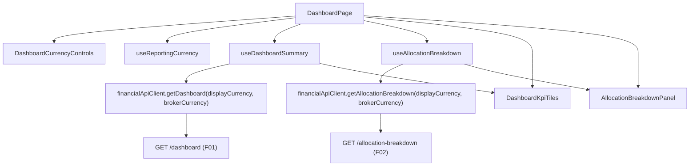

## Complexity: medium

## 1. Technical Overview

**What:** `DashboardPage.tsx` gains a header control, `DashboardCurrencyControls.tsx`, combining a
3-option currency selector (BRL/GBP/USD, always one selected, reusing `ReportingCurrencyPage.tsx`'s
`RadioGroup` pattern) and a 4-option broker-currency filter (All/BRL/GBP/USD, reusing
`FilterTabList.tsx`). Both are page-local state: the selector is seeded once per visit from
`useReportingCurrency()`'s stored currency value (ignoring its enabled flag), the filter always
starts at `'ALL'`. `useDashboardSummary`/`useAllocationBreakdown` take both values and pass them as
`displayCurrency`/`brokerCurrency` query params to `financialApiClient.ts`'s `getDashboard`/
`getAllocationBreakdown`, which F01/F02 have already extended with these exact optional params.
`DashboardKpiTiles.tsx`'s native (unconverted) tile row is removed — only the always-converted row
renders, labelled per tile with the selected currency. `AllocationBreakdownPanel.tsx` gains a
"Values shown in {currency}" line and the same partial/unavailable/empty-state handling the KPI
tiles already have, since F02 adds `displayCurrency`/`isPartial`/`isUnavailable` to
`AllocationBreakdownDto` and this panel has never had any conversion-provenance UI before.

**Why:** F01 and F02 built the backend contract (optional `displayCurrency`/`brokerCurrency` query
params, `isPartial`/`isUnavailable` flags, resolved currency) but ship with no caller — every
existing frontend call to `GET /dashboard` and `GET /allocation-breakdown` omits both params, so
today's mixed-currency bug is unfixed from the user's point of view until this feature wires the
two new controls through. Reusing `RadioGroup`/`FilterTabList`/`useAsyncResource`'s "return `null`
to skip fetching" capability keeps this a thin composition of already-shipped primitives rather
than a new state-management or data-fetching mechanism.

**Scope:**
- **Included:** `DashboardCurrencyControls.tsx` (new); `DashboardPage.tsx` owning
  `displayCurrency`/`brokerCurrencyFilter` state and passing both into the two data hooks;
  `useDashboardSummary`/`useAllocationBreakdown` accepting `(displayCurrency, brokerCurrencyFilter)`
  and not fetching until `displayCurrency` is seeded; `financialApiClient.ts`'s `getDashboard`/
  `getAllocationBreakdown` gaining the two query-string params; `DashboardKpiTiles.tsx`'s native row
  removed, only the converted row shown; `AllocationBreakdownPanel.tsx`'s currency label,
  partial/unavailable handling, and a broker-filter-specific empty state; two new frontend-only type
  aliases (`Currency`, `BrokerCurrencyFilter`) in `api/types.ts`; regenerating
  `api/generated/openapi.ts` once F01/F02 are implemented and their snapshot is regenerated
  (blocking prerequisite, not part of this feature's own code change).
- **Excluded (this PRD's other features):** F04 (WPF) — a separate, later feature building the
  equivalent outcome with WPF controls; any change to the global Reporting Currency setting's own
  page/endpoint (P49, read-only dependency here); Data Quality Warnings and Upcoming Income panels
  (explicitly untouched by either control); persisting either control's value.

## 2. Architecture Impact



**Affected components:**

| Component | Change |
|---|---|
| `Financial.Web/src/api/types.ts` | Modified — adds hand-written `Currency` and `BrokerCurrencyFilter` type aliases (no backend counterpart, alongside the existing `InvestmentScope`/`NodeType` hand-written types) |
| `Financial.Web/src/api/financialApiClient.ts` | Modified — `getDashboard`/`getAllocationBreakdown` gain optional `displayCurrency?: Currency, brokerCurrency?: Currency` params, appended as query-string params |
| `Financial.Web/src/hooks/useDashboardSummary.ts` | Modified — accepts `(displayCurrency: Currency \| null, brokerCurrencyFilter: BrokerCurrencyFilter)`; fetcher returns `null` (skips the request) while `displayCurrency` is `null` |
| `Financial.Web/src/hooks/useAllocationBreakdown.ts` | Modified — same signature and null-guard as above |
| `Financial.Web/src/components/dashboard/DashboardCurrencyControls.tsx` | New — the header currency selector + broker filter |
| `Financial.Web/src/components/dashboard/DashboardCurrencyControls.css` | New — layout for the two controls in the page header |
| `Financial.Web/src/pages/DashboardPage.tsx` | Modified — owns `displayCurrency`/`brokerCurrencyFilter` state, seeds the former from `useReportingCurrency()`, renders `DashboardCurrencyControls` in the header, passes both values into the two data hooks and `AllocationBreakdownPanel` |
| `Financial.Web/src/components/dashboard/DashboardKpiTiles.tsx` | Modified — removes the native tile grid and the `ConvertedKpiTiles` split; a single tile grid renders `converted*` fields with per-tile currency-labelled headings |
| `Financial.Web/src/components/dashboard/AllocationBreakdownPanel.tsx` | Modified — accepts `brokerCurrencyFilter`; renders a currency line, partial/unavailable states, and a broker-filter-specific empty state |
| `Financial.Web/src/components/dashboard/AllocationBreakdownPanel.css` | Modified — styling for the new currency line and notice rows, matching `DashboardKpiTiles.css`'s existing notice classes |

No backend files change in this feature — F01/F02 already ship the two query params and DTO fields
this spec consumes.

## 3. Technical Decisions

| Decision | Chosen Approach | Alternative Considered | Trade-off |
|---|---|---|---|
| Where `Currency`/`BrokerCurrencyFilter` types live | Hand-written in `api/types.ts`, alongside the existing hand-written `InvestmentScope`/`NodeType`/`SelectedNode` (per this repo's own documented convention: "a small handful of frontend-only types with no backend counterpart... stay hand-written above the aliases") | A new `Financial.Web/src/types/dashboardCurrency.ts` file | The OpenAPI-generated schema has no shared `Currency` enum type (the wire format is a plain string on every DTO field), so this is exactly the class of type the repo's own convention says to hand-write in `types.ts` rather than invent a new location for |
| Fetch-gating while the selector is unseeded | `useDashboardSummary`/`useAllocationBreakdown`'s fetcher callback returns `null` when `displayCurrency` is `null`, using `useAsyncResource`'s existing "return `null` to reset to idle instead of fetching" contract | A separate `enabled` boolean flag passed into the hooks | `useAsyncResource` already documents and implements exactly this null-fetcher contract (see its own doc comment); reusing it needs no change to the shared hook and keeps both panels' existing `isLoading` semantics (idle before first fetch reads as `isLoading: false`, matching the PRD's "existing loading state" requirement, since `DashboardKpiTiles`/`AllocationBreakdownPanel` already treat `summary/breakdown === null && !error` as pending) |
| Removing the KPI native row | Collapse `DashboardKpiTiles.tsx`'s two-grid (native + `ConvertedKpiTiles`) structure into one grid that always reads `converted*` fields, with `unvaluedHoldingsMessage` (native-holding-count partial notice) kept as-is since it's independent of currency conversion, driven only by `unvaluedHoldingCount`/`isPartial` | Keep both grids and simply hide the native one via CSS/a prop flag | The PRD is explicit the native row is "no longer shown" as a permanent behavior change (not a togglable display state) once this feature ships — deleting the dead code path (native tile values, the `native` field on `KpiTileDefinition`) is simpler than carrying an always-false visibility flag forward |
| Per-tile currency label format | `"{label} ({currency})"` (e.g. `"Market Value (GBP)"`) — matches the PRD Experience section's own literal example | Keep the existing `"{label} (converted to {currency})"` format | The PRD explicitly gives `"Market Value (GBP)"` as the desired label; the feature also removes the "there are two totals, one converted one not" framing that made "converted to" a meaningful qualifier, so the shorter form is both PRD-literal and the correct framing now that there is only ever one total shown |
| Allocation Breakdown's broker-filter-specific empty state | `AllocationBreakdownPanel` receives `brokerCurrencyFilter` as a prop from `DashboardPage`; when every dimension's entries are empty AND `brokerCurrencyFilter !== 'ALL'`, render `"No brokers use the selected currency ({brokerCurrencyFilter})."` instead of the existing generic `"No priced holdings to display for this view."` | Infer the "filtered to zero brokers" case purely from the response shape (e.g., a flag on the DTO) | F02's spec confirms `AllocationBreakdownDto` gains no such flag — an empty-filter response is just four empty dimension lists, indistinguishable on the wire from "this dimension merely has nothing priced." The panel already knows which filter is active (it's page-local UI state), so branching on the prop it already receives is simpler than asking F02 to expose a redundant signal |
| Partial/unavailable presentation on Allocation Breakdown | Mirror `DashboardKpiTiles.tsx`'s existing pattern exactly: an inline `role="status"` notice above the chart when `isPartial`, and the shared `ErrorState` component (with `retry`) replacing the chart entirely when `isUnavailable` | A dedicated banner component shared between both panels | The PRD's own wording ties F03's Allocation Breakdown notices to "the existing rate/date tooltip pattern already used on the KPI tiles, extended to the Allocation Breakdown panel" — matching the established KPI-tile markup/copy/`role="status"` convention keeps the two panels visually and behaviorally consistent without introducing a new shared component this feature doesn't otherwise need |

## 4. Component Overview

**Frontend:**

| File Path | New/Modified | Purpose | Key Responsibilities |
|---|---|---|---|
| `Financial.Web/src/api/types.ts` | Modified | Frontend-only type aliases | `export type Currency = 'BRL' \| 'GBP' \| 'USD'`; `export type BrokerCurrencyFilter = 'ALL' \| Currency` |
| `Financial.Web/src/api/financialApiClient.ts` | Modified | Typed HTTP client | `getDashboard(displayCurrency?: Currency, brokerCurrency?: Currency): Promise<PortfolioDashboardDto>`; `getAllocationBreakdown(displayCurrency?: Currency, brokerCurrency?: Currency): Promise<AllocationBreakdownDto>`; both append `?displayCurrency=...&brokerCurrency=...` only for the params actually supplied, following the existing `buildScopeQuery`/`buildExchangeQuery` query-builder convention |
| `Financial.Web/src/hooks/useDashboardSummary.ts` | Modified | Dashboard KPI data | `useDashboardSummary(displayCurrency: Currency \| null, brokerCurrencyFilter: BrokerCurrencyFilter): DashboardSummaryData`; fetcher returns `null` while `displayCurrency` is `null`; re-fetches whenever either argument changes (both in the hook's dependency array) |
| `Financial.Web/src/hooks/useAllocationBreakdown.ts` | Modified | Allocation breakdown data | Same signature and null-guard as `useDashboardSummary` |
| `Financial.Web/src/components/dashboard/DashboardCurrencyControls.tsx` | New | Header controls | Renders a `RadioGroup` (BRL/GBP/USD, always one selected) for `displayCurrency` and a `FilterTabList` (All/BRL/GBP/USD) for `brokerCurrencyFilter`; purely controlled — no internal state |
| `Financial.Web/src/components/dashboard/DashboardCurrencyControls.css` | New | Header layout | Places the two controls side by side in the page header, matching the existing `dashboard-page__header` flex layout |
| `Financial.Web/src/pages/DashboardPage.tsx` | Modified | Page composition | Owns `displayCurrency`/`brokerCurrencyFilter` state; seeds `displayCurrency` from `useReportingCurrency().currency` via a one-shot effect (never re-seeds after the first non-null value); resets `brokerCurrencyFilter` to `'ALL'` on every mount (it's local `useState` initial value, so this is automatic); passes both values into `useDashboardSummary`/`useAllocationBreakdown` and `brokerCurrencyFilter` into `AllocationBreakdownPanel` |
| `Financial.Web/src/components/dashboard/DashboardKpiTiles.tsx` | Modified | KPI tile grid | Single grid reading `summary.convertedX`/`summary.reportingCurrency`; per-tile label `"{label} ({reportingCurrency})"`; `isReportingCurrencyPartial`/`isReportingCurrencyUnavailable` notices kept, now unconditional (no more `isReportingCurrencyEnabled` gate since a display currency is always supplied); `unvaluedHoldingsMessage` unchanged |
| `Financial.Web/src/components/dashboard/AllocationBreakdownPanel.tsx` | Modified | Allocation breakdown | Accepts `brokerCurrencyFilter: BrokerCurrencyFilter`; renders `"Values shown in {breakdown.displayCurrency}"` above the tab list; renders the partial notice / unavailable error state per the Technical Decisions row above; the empty-dimension message branches on `brokerCurrencyFilter` |
| `Financial.Web/src/components/dashboard/AllocationBreakdownPanel.css` | Modified | Notice styling | Adds `.allocation-breakdown__currency-line` and `.allocation-breakdown__notice--partial`, mirroring `DashboardKpiTiles.css`'s existing notice class names |

## 5. API Contracts

Both endpoints already exist and are extended by F01/F02; this feature only adds the frontend call
sites for the two optional query params they define. No new endpoint.

**Endpoint: Get Portfolio Dashboard** *(existing, extended by F01 — consumed here for the first time
with parameters)*
- **Method:** GET
- **Path:** `/api/v1/financial/dashboard`

**Request (query string):**

| Field | Type | Required | Description |
|---|---|---|---|
| `displayCurrency` | `string` | No | One of `BRL`/`GBP`/`USD`; this feature always supplies it once seeded |
| `brokerCurrency` | `string` | No | One of `BRL`/`GBP`/`USD`; omitted (not sent) when the filter is `'ALL'` |

**Request Example:**
```
GET /api/v1/financial/dashboard?displayCurrency=GBP&brokerCurrency=BRL
```

**Endpoint: Get Allocation Breakdown** *(existing, extended by F02 — consumed here for the first time
with parameters)*
- **Method:** GET
- **Path:** `/api/v1/financial/allocation-breakdown`

**Request (query string):** same two params as above, same semantics.

**Response (200 OK):** `AllocationBreakdownDto`, per F02's spec — adds `displayCurrency`, `isPartial`,
`isUnavailable` on top of the existing four dimension lists. This feature reads all three new
fields; it introduces no new response fields of its own.

**Error Codes:** Both endpoints return 400 if either query param fails to parse to `BRL`/`GBP`/`USD`
(F01/F02). This feature never sends an invalid value — both controls are closed option sets
(`RadioGroup`/`FilterTabList`) — so the 400 path is exercised only by F01/F02's own tests, not
this feature's.

## 6. Data Model

Not applicable — no persistence, no new DTOs. `Currency`/`BrokerCurrencyFilter` (Section 4) are
TypeScript-only type aliases with no wire representation of their own; they narrow the existing
`string` query params and `string` DTO fields already defined by F01/F02.

## 7. Testing Strategy

Per this repo's Vitest + Testing Library convention (colocated `__tests__/` folders, one file per
hook/component, `it('descriptive_snake_case_name', ...)`), and per the `testing-guide-Financial`
skill.

| Test File | Test Type | Target | Coverage Goal |
|---|---|---|---|
| `Financial.Web/src/api/__tests__/financialApiClient.test.ts` | Unit | `getDashboard`/`getAllocationBreakdown` | New cases: `getDashboard_with_no_params_requests_the_bare_path` (regression); `getDashboard_with_both_params_appends_displayCurrency_and_brokerCurrency_to_the_query_string`; `getDashboard_with_only_displayCurrency_omits_brokerCurrency_from_the_query_string`; same three cases mirrored for `getAllocationBreakdown` |
| `Financial.Web/src/hooks/__tests__/useDashboardSummary.test.ts` | Unit | `useDashboardSummary` | Extended: `does_not_fetch_while_displayCurrency_is_null`; `fetches_once_displayCurrency_is_seeded`; `refetches_when_displayCurrency_changes`; `refetches_when_brokerCurrencyFilter_changes`; `passes_no_brokerCurrency_param_when_the_filter_is_ALL` (via the mocked `apiClient.getDashboard` call args) |
| `Financial.Web/src/hooks/__tests__/useAllocationBreakdown.test.ts` | Unit | `useAllocationBreakdown` | Same five cases as above, mirrored |
| `Financial.Web/src/components/dashboard/__tests__/DashboardCurrencyControls.test.tsx` | Component | `DashboardCurrencyControls` | New file: renders exactly 3 currency radio options with the seeded one selected; renders exactly 4 broker-filter tabs with `'ALL'` selected by default; selecting a currency option calls `onDisplayCurrencyChange` with the new value; selecting a broker-filter tab calls `onBrokerCurrencyFilterChange`; no option in either control can be deselected (always exactly one active) |
| `Financial.Web/src/components/dashboard/__tests__/DashboardKpiTiles.test.tsx` | Component | `DashboardKpiTiles` | Rewritten for the single-grid shape: `renders_the_eight_tiles_labelled_with_the_reporting_currency` (`"Market Value (GBP)"` etc.); removes every test asserting the old native/converted dual-grid split (`hides_the_converted_block_...`, `renders_the_converted_block_with_the_same_eight_tiles_...`); keeps (adapted) the partial-notice, unavailable-error, dash-for-null-converted-figure, and unvalued-holdings-notice cases against the new single-grid markup |
| `Financial.Web/src/components/dashboard/__tests__/AllocationBreakdownPanel.test.tsx` | Component | `AllocationBreakdownPanel` | Extended: `renders_the_values_shown_in_currency_line` with `breakdown.displayCurrency`; `shows_the_partial_notice_when_isPartial`; `replaces_the_panel_with_a_retryable_error_when_isUnavailable`; `shows_the_broker_filter_empty_state_when_every_dimension_is_empty_and_the_filter_is_not_ALL`; `keeps_the_generic_empty_message_when_a_dimension_is_empty_but_the_filter_is_ALL` (regression, existing case) |
| `Financial.Web/src/pages/__tests__/DashboardPage.test.tsx` | Component (AC-tracing) | `DashboardPage` | One test per F03 §9 criterion, tagged `P55-F03-react-dashboard-currency-selector-0N`: seeds the selector from `useReportingCurrency`'s value ignoring its `enabled` flag; the broker filter always starts at `'ALL'` on mount regardless of any prior render; selecting a currency re-fetches both `getDashboard` and `getAllocationBreakdown` with the new value, leaving `getDataQualityReport`/`getUpcomingIncome` uncalled; selecting a broker filter does the same; the selected currency is visible in the header; the native KPI row is absent (`queryByText` for a bare, non-currency-suffixed label finds nothing); a filtered-to-zero-brokers response shows the KPI zero values and the Allocation Breakdown empty state, not an error; a partial/unavailable `AllocationBreakdownDto` drives the panel's respective notice/error state, not an independently-computed one; remounting the page re-seeds the selector and resets the filter |
| `Financial.Web/src/api/generated/__tests__/openapiFreshness.test.ts` | Contract (existing) | Generated TS types | **Blocking prerequisite, not part of this feature's own code:** this test fails as soon as F01/F02 regenerate `openapi-v1.snapshot.json` unless `Financial.Web/src/api/generated/openapi.ts` is regenerated (`npm run generate-api-types`) in the same PR wave. This feature's implementation cannot compile/type-check against real `displayCurrency`/`brokerCurrency`/`isPartial`/`isUnavailable` typings until that regeneration has actually happened against F01 and F02's *shipped* code — their specs alone are not sufficient, since the OpenAPI snapshot is generated from running tests, not from the spec documents themselves |

**Cross-Feature Integration** (from PRD §9, referencing F03):
- "A display currency and broker-currency filter chosen in F03's UI are passed through to F01 and
  F02's backend calls" — covered by `DashboardPage.test.tsx`'s re-fetch-with-new-value cases above,
  asserting the mocked `apiClient.getDashboard`/`getAllocationBreakdown` call arguments directly.
- "The partial/unavailable indicators and resolved display currency provided by F01 and F02 are what
  drive F03's ... inline notices and error states — not independently re-derived on the client" —
  covered by `DashboardKpiTiles.test.tsx`'s and `AllocationBreakdownPanel.test.tsx`'s partial/
  unavailable cases, which assert the notice/error appears purely from the DTO flags with no
  client-side recomputation.

## Assumptions / Decisions (Auto-Accept Policy)

- **Scope question skipped** — the PRD's F03 entry has no `Core Scope`/`Full Scope additions`
  blocks, so the full feature definition is in scope (per skill edge case: neither block present →
  assume full scope).
- **Component/prop names, state ownership, and file locations** — taken directly from the approved
  plan (`C:\Users\ggibe\.claude\plans\pasted-content-id-b7ab-dashboard-deep-horizon.md`'s
  "Financial.Web design" section), not re-derived: `DashboardPage.tsx` owning both state values,
  `DashboardCurrencyControls.tsx` as the new component name, `RadioGroup` + `FilterTabList` as the
  two reused controls.
- **Query param names** (`displayCurrency`, `brokerCurrency`) — taken verbatim from F01/F02's specs,
  not re-derived, per this task's explicit instruction to use their documented contract exactly.
- **`Currency`/`BrokerCurrencyFilter` type alias location and shape** — no PRD/plan text specifies
  this; applied the repo's own documented convention (`types.ts`'s comment on hand-written
  frontend-only types) as the industry/repo-standard default for a missing detail.
- **Per-tile label format** (`"{label} ({currency})"`) — the PRD's Experience section gives this
  literal example; the existing `ConvertedKpiTiles` code used `"(converted to {currency})"` instead,
  so this is an explicit, documented deviation from the current source, not a silent one.
- **Allocation Breakdown's broker-filter empty-state message text** (`"No brokers use the selected
  currency ({brokerCurrencyFilter})."`) — the PRD gives only an illustrative example ("e.g. 'No
  brokers use the selected currency'"); the exact interpolated string is this spec's own reasonable
  default for the missing detail, to be confirmed/adjusted during implementation review.
- **Re-seeding on remount, not on every render** — `displayCurrency` seeds once from
  `useReportingCurrency()` and is never overwritten by a later change to the global setting while
  the Dashboard stays mounted, matching PRD wording ("Every time the Dashboard is (re)loaded... is
  seeded") and the plan's explicit "starting `null` until seeded" phrasing — a mount-scoped seed, not
  a continuously-synced one.
- **No new hook for `DashboardCurrencyControls`** — it is a purely controlled component (props in,
  callbacks out), consistent with `FilterTabList`'s own existing controlled-component shape; all
  state lives in `DashboardPage`, per the plan's explicit ownership decision.
