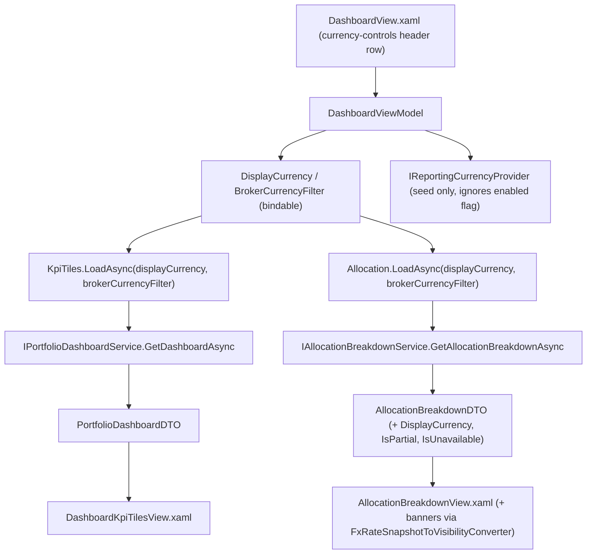

## Complexity: medium

## 1. Technical Overview

**What:** `Financial.App`'s `DashboardViewModel` gains two bindable properties — `DisplayCurrency`
and `BrokerCurrencyFilter` — surfaced in `DashboardView.xaml` as a WPF-native currency-controls
header row (radio-button-style selector for the 3-option currency, `ComboBox` for the 4-option
broker filter). `DashboardKpiTilesViewModel.LoadAsync` and `AllocationBreakdownViewModel.LoadAsync`
gain the two values as method parameters and pass them straight through to F01's
`IPortfolioDashboardService.GetDashboardAsync(displayCurrency, brokerCurrencyFilter)` and F02's
`IAllocationBreakdownService.GetAllocationBreakdownAsync(displayCurrency, brokerCurrencyFilter)` —
the same in-process Application-layer services `Financial.Api`'s controllers call, with no HTTP hop
and no query-string translation. This is the WPF mirror of F03 (React), built to the same two Wave 1
backend contracts, adapted to WPF's non-reactive, explicit-reload view-model convention.

**Why:** Today `DashboardKpiTilesViewModel.LoadAsync` calls `GetDashboardAsync()` with no arguments
and `AllocationBreakdownViewModel.LoadAsync` calls the (pre-F02) synchronous, parameterless
`GetAllocationBreakdown()` — both always show every broker's native/global-setting-gated totals,
with no page-local override and no way to isolate one broker currency. F01/F02 add exactly the two
optional parameters this feature needs; F04 is the WPF consumer of that contract, matching F03's
user-facing outcome (PRD §6 F04) with WPF-appropriate controls rather than F03's exact markup, per
this repo's "equivalent outcome, not identical controls" rule (`Financial.App/CLAUDE.md`).

**Scope:**
- **Included:** `DisplayCurrency`/`BrokerCurrencyFilter` bindable properties on `DashboardViewModel`,
  seeded on construction (currency from `IReportingCurrencyProvider.GetReportingCurrency()` ignoring
  its enabled flag; filter reset to "All" every load) before the existing `LoadAllAsync()` runs;
  changing either property re-triggers only `KpiTiles.LoadAsync(...)` and `Allocation.LoadAsync(...)`
  (not `Warnings`/`Income`); `DashboardKpiTilesViewModel.LoadAsync(Currency? displayCurrency, Currency?
  brokerCurrencyFilter)` and `AllocationBreakdownViewModel.LoadAsync(Currency? displayCurrency,
  Currency? brokerCurrencyFilter)` overloads calling F01/F02's new service parameters;
  `DashboardKpiTilesViewModel`'s existing native/unconverted KPI row hidden (parity with F03's
  native-row removal — the tile row shown unconditionally today becomes conditional on
  `DisplayCurrency`-driven load, i.e. the always-converted row is the only row); `AllocationBreakdown
  ViewModel` gains `DisplayCurrencyLabel`, `IsPartial`, `IsUnavailable` bindable properties mapped from
  the new `AllocationBreakdownDTO` fields, and an empty-state message for a broker-currency filter
  matching zero brokers; `DashboardView.xaml` currency-controls header row; `AllocationBreakdownView.xaml`
  partial/unavailable banners reusing `FxRateSnapshotToVisibilityConverter`/`...ToTooltipConverter`.
- **Excluded (out of scope per PRD §7, or owned by other features):** Any change to `Financial.Web`
  or the backend (F01/F02, consumed as-is); persisting either control across app restarts; changing
  the global Reporting Currency Settings page or its provider; Data Quality Warnings/Upcoming Income
  reacting to either control; historic-vs-active broker scope differences between the two panels
  (pre-existing, unchanged).

## 2. Architecture Impact

**Affected components:**

| Component | Change |
|---|---|
| `Financial.App/ViewModels/Investment/Dashboard/DashboardViewModel.cs` | Modified — `DisplayCurrency`/`BrokerCurrencyFilter` bindable properties + `IReportingCurrencyProvider` dependency; setters re-trigger only the two affected sub-VMs; constructor seeds both before the existing `LoadAllAsync()` call |
| `Financial.App/ViewModels/Investment/Dashboard/DashboardKpiTilesViewModel.cs` | Modified — `LoadAsync(Currency? displayCurrency = null, Currency? brokerCurrencyFilter = null)` threads both into `GetDashboardAsync`; native tile row visibility becomes conditional |
| `Financial.App/ViewModels/Investment/Dashboard/AllocationBreakdownViewModel.cs` | Modified — `LoadAsync(Currency? displayCurrency = null, Currency? brokerCurrencyFilter = null)`, `GetAllocationBreakdown()` → `await GetAllocationBreakdownAsync(...)`; new `DisplayCurrencyLabel`/`IsPartial`/`IsUnavailable` bindable properties; empty-filter message |
| `Financial.App/Views/Investment/Dashboard/DashboardView.xaml` | Modified — currency-controls header row (RadioButtons + ComboBox) bound to `DisplayCurrency`/`BrokerCurrencyFilter` |
| `Financial.App/Views/Investment/Dashboard/DashboardKpiTilesView.xaml` | Modified — native (unconverted) tile row's `Visibility` becomes conditional (hidden), matching F03's native-row removal |
| `Financial.App/Views/Investment/Dashboard/AllocationBreakdownView.xaml` | Modified — "Values shown in {currency}" label + partial/unavailable banners + empty-filter message, using the existing `FxRateSnapshotToVisibilityConverter`/`FxRateSnapshotToTooltipConverter` pattern |
| `Financial.App/App.xaml.cs` | Unmodified — `DashboardViewModel`'s constructor already resolves `IReportingCurrencyProvider` via existing DI registration (used by `ReportingCurrencyViewModel` today); no new registration needed |

## 3. Technical Decisions

| Decision | Chosen Approach | Alternative Considered | Trade-off |
|---|---|---|---|
| Where the two filter values live | `DashboardViewModel` owns `DisplayCurrency`/`BrokerCurrencyFilter` as settable bindable properties; `KpiTiles`/`Allocation` sub-VMs receive them as `LoadAsync` parameters, not as their own settable properties | Give `DashboardKpiTilesViewModel`/`AllocationBreakdownViewModel` their own `DisplayCurrency`/`BrokerCurrencyFilter` properties, each independently bound to the same header controls | The approved plan (`pasted-content-id-b7ab-dashboard-deep-horizon.md`) is explicit: these values are owned by the parent VM and passed as parameters, since there's no reactive push between VMs in this codebase — two independently-bound copies of the same header value would risk drifting out of sync with no mechanism to keep them aligned |
| Re-trigger scope on change | `DisplayCurrency`/`BrokerCurrencyFilter` setters call `Task.WhenAll(KpiTiles.LoadAsync(DisplayCurrency, BrokerCurrencyFilter), Allocation.LoadAsync(DisplayCurrency, BrokerCurrencyFilter))` only, mirroring `LoadAllAsync`'s `Task.WhenAll` pattern but scoped to the two affected panels | Re-run all four panels' `LoadAsync` (matching `LoadAllAsync`'s existing shape exactly) | PRD F04 Capabilities is explicit: "only KPI tiles and Allocation Breakdown react; Data Quality Warnings and Upcoming Income are unaffected" — re-running all four would waste two backend calls and risk visibly flickering panels that never change |
| Seeding on construction | Constructor calls `_reportingCurrencyProvider.GetReportingCurrency()` (synchronous, in-process — same call `ReportingCurrencyViewModel`'s constructor already makes) to set the backing field for `DisplayCurrency` and sets `BrokerCurrencyFilter` to `null` ("All"), both *before* `LoadAllAsync()` runs, so the first load already carries the seeded values — avoiding a second round-trip | Seed both to `null`/defaults, run `LoadAllAsync()`, then re-seed and reload once the provider read completes | `IReportingCurrencyProvider.GetReportingCurrency()` is synchronous and in-process (confirmed by `ReportingCurrencyViewModel`'s own constructor, which needs no loading state for this exact read) — there is no round trip to wait for, so seeding before the first load is strictly simpler and avoids a redundant double-fetch that F03's async-seeding constraint (documented for its HTTP round trip) doesn't apply to here |
| `BrokerCurrencyFilter`'s "All" representation | `Currency? BrokerCurrencyFilter` — `null` means "All", matching `IPortfolioDashboardService`/`IAllocationBreakdownService`'s own `Currency? brokerCurrencyFilter` parameter shape (no translation layer) | A 4-value enum including an explicit `All` member, translated to `null` before calling the service | Passing `Currency?` straight through end-to-end (VM property → sub-VM parameter → service parameter) needs no mapping code and cannot drift from the service contract; the only added value of a 4-value enum would be to avoid a nullable bool-like check in XAML, which a `ComboBox` bound to a small fixed item list handles the same way either way |
| Native KPI row removal mechanism | `DashboardKpiTilesViewModel` stops exposing a separately-visible native row: the existing `ShowContent` block keeps the native tiles bound (used internally for value inspection in tests / potential future need) but `DashboardKpiTilesView.xaml`'s native `UniformGrid` block's `Visibility` is bound to a new `false`-returning `ShowNativeTotals => false` property (always hidden once this feature ships), while the already-existing `ShowConvertedTotals` block becomes the only visible totals section | Delete the native `UniformGrid` markup entirely | The PRD is clear the native row is "no longer shown" — not that the underlying native values are meaningless (they still back `MarketValue`/`Invested`/etc., which some other tests and future features might still assert on). Hiding via a property keeps the VM/view contract minimally invasive and trivially reversible, and matches the low-risk style of this codebase's other `Show*` visibility-toggle properties (e.g. `ShowContent`, `ShowChart`) rather than deleting markup that other code may still reference |
| Allocation empty-filter messaging | `AllocationBreakdownViewModel` adds `EmptyFilterMessage => BrokerCurrencyFilter is not null && IsEmpty ? "No brokers use the selected currency" : null`, rendered in place of the existing generic "No priced holdings to display for this view." text when non-null | Reuse the existing generic empty-state text unconditionally for both cases | The existing message ("No priced holdings to display for this view.") reads as an error/data-quality issue, not an intentional filter result; the PRD's F03 Experience explicitly calls for message wording "e.g. 'No brokers use the selected currency'" reused here verbatim for React/WPF terminology parity |

## 4. Component Overview

**ViewModels:**

| File Path | New/Modified | Purpose | Key Responsibilities |
|---|---|---|---|
| `Financial.App/ViewModels/Investment/Dashboard/DashboardViewModel.cs` | Modified | Page-local filter state + orchestration | `DisplayCurrency`/`BrokerCurrencyFilter` bindable properties seeded in the constructor from `IReportingCurrencyProvider`/`null`; property setters call `Task.WhenAll(KpiTiles.LoadAsync(...), Allocation.LoadAsync(...))`; constructor takes an added `IReportingCurrencyProvider` dependency |
| `Financial.App/ViewModels/Investment/Dashboard/DashboardKpiTilesViewModel.cs` | Modified | KPI totals | `LoadAsync(Currency? displayCurrency = null, Currency? brokerCurrencyFilter = null)` calls `_dashboardService.GetDashboardAsync(displayCurrency, brokerCurrencyFilter)`; adds `ShowNativeTotals => false` |
| `Financial.App/ViewModels/Investment/Dashboard/AllocationBreakdownViewModel.cs` | Modified | Allocation breakdown | `LoadAsync(Currency? displayCurrency = null, Currency? brokerCurrencyFilter = null)` awaits `_allocationService.GetAllocationBreakdownAsync(displayCurrency, brokerCurrencyFilter)`; adds `DisplayCurrencyLabel`, `IsPartial`, `IsUnavailable`, `EmptyFilterMessage` bindable properties populated from the DTO's new fields |

**Views:**

| File Path | New/Modified | Purpose | Key Responsibilities |
|---|---|---|---|
| `Financial.App/Views/Investment/Dashboard/DashboardView.xaml` | Modified | Header controls | New `StackPanel` (Grid.Row="0", above the KPI tiles) holding a `RadioButton` trio (BRL/GBP/USD, `GroupName="DashboardDisplayCurrency"`, matching `ReportingCurrencyView.xaml`'s existing radio pattern) bound to a per-currency `IsXSelected`-style property on `DashboardViewModel`, plus a `ComboBox` (All/BRL/GBP/USD) bound to `BrokerCurrencyFilter` with a `Currency?`-aware `ItemsSource`/`SelectedValue` |
| `Financial.App/Views/Investment/Dashboard/DashboardKpiTilesView.xaml` | Modified | Native row visibility | Existing native `UniformGrid`'s `Visibility` bound to `ShowNativeTotals` (always `Collapsed`) instead of being unconditionally visible |
| `Financial.App/Views/Investment/Dashboard/AllocationBreakdownView.xaml` | Modified | Provenance + partial/unavailable banners | Adds a "Values shown in {DisplayCurrencyLabel}" `TextBlock`; a partial-notice `TextBlock` bound through `FxRateSnapshotToVisibilityConverter`-style boolean visibility on `IsPartial`; an unavailable-state block (reusing the KPI tiles' `Try again` button pattern) bound to `IsUnavailable`; empty-state `TextBlock` text swapped to `EmptyFilterMessage` when non-null |

## 5. API Contracts

None — WPF-only, consuming the already-specified in-process F01/F02 Application-layer service
methods directly (no HTTP call, no query string). Contract reused verbatim:
- `IPortfolioDashboardService.GetDashboardAsync(Currency? displayCurrency = null, Currency? brokerCurrencyFilter = null)`
- `IAllocationBreakdownService.GetAllocationBreakdownAsync(Currency? displayCurrency = null, Currency? brokerCurrencyFilter = null)`

## 6. Data Model

Not applicable — no persistence change. `DisplayCurrency`/`BrokerCurrencyFilter` are in-memory,
page-local `DashboardViewModel` state, never written to `data-investment.json` or any settings
store, matching the PRD's explicit "neither control is persisted by this feature" (§6 F04).

## 7. Testing Strategy

Per the `testing-guide-Financial` skill and this repo's established WPF VM interaction-test
convention (constructing the VM through its public constructor with stub services, then asserting
on bindable properties/commands — e.g. `DashboardViewModelTests`' `CreateViewModel` helper, and the
`feedback_wpf_test_through_isselected` convention of driving state changes through the same public
surface a real binding would use rather than reaching into private state).

**Blocking dependency:** this spec is written against Wave 1's *documented* service contract
(`GetDashboardAsync(Currency?, Currency?)` / `GetAllocationBreakdownAsync(Currency?, Currency?)` per
F01/F02's specs). These signatures do not exist in code yet — F04 cannot compile or be implemented
until F01 and F02 are merged, exactly the same blocking relationship F03's spec documents for the
React side.

| Test File | Test Type | Target | Coverage Goal |
|---|---|---|---|
| `Tests/Financial.Presentation.Tests/ViewModels/Investment/Dashboard/DashboardViewModelTests.cs` (extended) | Unit | `DashboardViewModel` | `Constructor_SeedsDisplayCurrencyFromReportingCurrencyProvider_IgnoringEnabledFlag`; `Constructor_SeedsBrokerCurrencyFilterToAll`; `Constructor_LoadsEveryPanelWithSeededFilterValues` (extends existing `Constructor_LoadsEveryPanel`, asserting the stub services received the seeded values); `SettingDisplayCurrency_ReloadsOnlyKpiTilesAndAllocation_LeavingWarningsAndIncomeUntouched`; `SettingBrokerCurrencyFilter_ReloadsOnlyKpiTilesAndAllocation`; `Constructor_RejectsAMissingReportingCurrencyProvider` (extends the existing null-guard test) |
| `Tests/Financial.Presentation.Tests/ViewModels/Investment/Dashboard/DashboardKpiTilesViewModelTests.cs` (extended) | Unit | `DashboardKpiTilesViewModel` | `LoadAsync_WithDisplayCurrencyAndBrokerCurrencyFilter_PassesBothToTheService` (extends the stub to a call-args-recording stub); `LoadAsync_WithoutArguments_PreservesExistingNoParamBehavior` (regression); `ShowNativeTotals_IsAlwaysFalse` |
| `Tests/Financial.Presentation.Tests/ViewModels/Investment/Dashboard/AllocationBreakdownViewModelTests.cs` (extended) | Unit | `AllocationBreakdownViewModel` | `LoadAsync_WithDisplayCurrencyAndBrokerCurrencyFilter_PassesBothToTheService`; `LoadAsync_MapsDisplayCurrencyIsPartialIsUnavailableFromTheDto`; `LoadAsync_WithBrokerCurrencyFilterMatchingNoBrokers_SetsEmptyFilterMessage`; `LoadAsync_WithoutBrokerCurrencyFilter_EmptyDimension_KeepsTheGenericEmptyMessage` (regression, existing `EmptyDimension_SetsTheEmptyStateAndBuildsAnEmptyPlotModel` still passes); stub service updated to the async `GetAllocationBreakdownAsync(Currency?, Currency?)` signature (breaking change from F02, propagated here) |
| `Tests/Financial.Presentation.Tests/Contract` (existing XAML binding-contract suite, extended) | Contract | `DashboardView`/`DashboardKpiTilesView`/`AllocationBreakdownView` bindings | New bindings (`DisplayCurrency`, `BrokerCurrencyFilter`, `ShowNativeTotals`, `DisplayCurrencyLabel`, `IsPartial`, `IsUnavailable`, `EmptyFilterMessage`) resolve against real VM properties |

**Acceptance criteria tracing (PRD §9 F04):**

| PRD Criterion | Test |
|---|---|
| Seeds selector from global Reporting Currency setting | `Constructor_SeedsDisplayCurrencyFromReportingCurrencyProvider_IgnoringEnabledFlag` |
| Always defaults broker-currency filter to "All currencies" | `Constructor_SeedsBrokerCurrencyFilterToAll` |
| Changing either control re-loads only KPI tiles + Allocation | `SettingDisplayCurrency_ReloadsOnlyKpiTilesAndAllocation_LeavingWarningsAndIncomeUntouched`, `SettingBrokerCurrencyFilter_ReloadsOnlyKpiTilesAndAllocation` |
| Selected display currency visible in header + next to converted values | XAML binding contract test + manual verification (`docs/rules/ui.md` review) |
| Only converted KPI values shown (native-row removal) | `ShowNativeTotals_IsAlwaysFalse` |
| Empty-state messaging for a currency with no brokers | `LoadAsync_WithBrokerCurrencyFilterMatchingNoBrokers_SetsEmptyFilterMessage` |
| Partial/unavailable results visually flagged via the existing fx-rate/date tooltip pattern | `LoadAsync_MapsDisplayCurrencyIsPartialIsUnavailableFromTheDto` + XAML binding contract test |

**Cross-Feature Integration** (PRD §9, referencing F04):
- "A display currency and broker-currency filter chosen in F04's UI are passed through to the same
  in-process F01 and F02 services, and the resulting converted, filtered totals and allocation
  dimensions are what's rendered in the WPF view" — proven by
  `LoadAsync_WithDisplayCurrencyAndBrokerCurrencyFilter_PassesBothToTheService` in both sub-VM test
  files, asserting the exact values reach the (stubbed) service call.
- "The partial/unavailable indicators and resolved display currency provided by F01 and F02 are what
  drive F03's and F04's respective inline notices and error states — not independently re-derived on
  the client" — proven by `LoadAsync_MapsDisplayCurrencyIsPartialIsUnavailableFromTheDto` asserting
  the VM properties are a direct pass-through of the DTO fields, with no client-side recomputation.

## Assumptions / Decisions (Auto-Accept Policy)

- **Scope question skipped** — the PRD's F04 entry has no `Core Scope`/`Full Scope additions` blocks,
  so the full feature definition above is in scope (skill edge case: neither block present → assume
  full scope).
- **Allocation sub-VM identity** — located by codebase search as `AllocationBreakdownViewModel`
  (`Financial.App/ViewModels/Investment/Dashboard/AllocationBreakdownViewModel.cs`), not a separately
  named class; its view is `AllocationBreakdownView.xaml`. Not previously confirmed by name in the
  approved plan, resolved here via Pattern Discovery.
- **Exact new bindable property names** (`DisplayCurrencyLabel`, `IsPartial`, `IsUnavailable`,
  `EmptyFilterMessage`, `ShowNativeTotals`) — chosen to mirror this file's existing naming convention
  (`IsPartial`/`ShowConvertedTotals` already exist on `DashboardKpiTilesViewModel`) rather than
  re-deriving new terminology; not specified verbatim by the PRD or the approved plan, so documented
  here per the Auto-Accept Policy's "partial PRD specification" rule.
- **`DisplayCurrency` XAML representation** — a `RadioButton` trio bound through three
  `IsXSelected`-style properties (`IsGbpSelected`/`IsBrlSelected`/`IsUsdSelected` pattern, mirroring
  `ReportingCurrencyViewModel`'s established pattern) rather than a single `SelectedValue`-bound
  control, since the codebase's one existing 3-option currency selector already uses this exact shape
  and the "always exactly one selected, no off state" requirement matches `RadioButton` semantics
  directly.
- **`BrokerCurrencyFilter` XAML representation** — a `ComboBox` (per the approved plan's explicit
  recommendation), bound via `SelectedValuePath`/`SelectedValue` to a `Currency?`, with a leading
  `null`-valued "All" item — mirroring the existing `TabControl`/`SelectedValuePath="Tag"` binding
  idiom already used by `AllocationBreakdownView.xaml`'s dimension tabs.
- **Constructor dependency addition** — `DashboardViewModel` gains an `IReportingCurrencyProvider`
  constructor parameter (already registered in DI for `ReportingCurrencyViewModel`); no new DI
  registration is needed, only the added constructor parameter and its null-guard, consistent with
  this class's existing "every dependency null-checked in the constructor" convention.
- **No new technology** — `IReportingCurrencyProvider`, `Currency`, and the two Application-layer
  service interfaces already exist; no new package or library is introduced.
