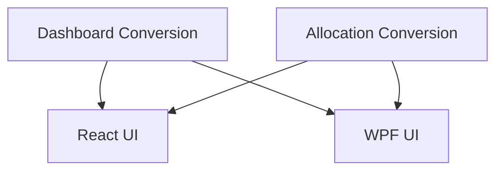

# Dashboard Currency Selector and Broker-Currency Filter

## 1. Executive Summary

The Investment Dashboard is a personal financial management tool consolidating investment
holdings across brokers in Brazil (BRL) and the UK (GBP), with USD support planned for
future brokers. Today the Dashboard's headline totals and its Allocation Breakdown panel
combine monetary values from brokers of different currencies as if they were the same
unit — a BRL broker's market value and a GBP broker's market value are summed directly,
producing numbers and percentages that are not meaningful.

This feature adds a currency selector directly on the Dashboard (BRL, GBP, or USD — always
exactly one selected) that converts every monetary value shown by the KPI tiles and the
Allocation Breakdown into a single, consistent currency before any total, percentage, or
comparison is calculated. It also adds an independent broker-currency filter (All, BRL,
GBP, or USD) that scopes which brokers feed those same two panels, so the user can, for
example, view BRL-only brokers while still displaying the result in GBP.

The result is a Dashboard that always shows internally consistent, correctly converted
totals, with the selected currency clearly labelled, a consistent exchange-rate
source/timestamp for every conversion in the same view, and an equivalent experience in
both the React web app and the WPF desktop app.

## 2. Problem and Opportunity

**The Problem**

- **Mixed-currency totals are numerically wrong.** The Dashboard's native (unconverted)
  KPI row and all four Allocation Breakdown dimensions (by asset class, by currency, by
  country, by broker) sum raw decimal amounts across BRL and GBP brokers with zero
  conversion — a portfolio with one BRL broker and one GBP broker produces a "total"
  that is neither a BRL nor a GBP amount, and percentages computed from it are
  meaningless as soon as more than one broker currency is present.
- **No way to see the Dashboard in a chosen currency.** A global "Reporting Currency"
  setting exists (P49) and already converts KPI totals, but it lives on a separate
  Settings page, is not visible from the Dashboard itself, and does not reach the
  Allocation Breakdown panel at all — that panel has no currency conversion capability
  today.
- **No way to isolate one currency's brokers.** There is no way to look at "only my BRL
  brokers" or "only my GBP brokers" on the Dashboard; every total always includes every
  broker, active and historic, regardless of currency.
- **Future USD brokers have no visible place to appear.** The shared `Currency` enum
  already includes USD for forward compatibility, but no Dashboard control today lets a
  user select or filter by USD, so a future USD broker would have nowhere to surface
  distinctly.

**The Opportunity**

- Reusing the already-shipped multi-currency infrastructure (FX rate provider, persistent
  FX store, `CurrencyConversionContext`, converted-KPI display pattern) to fix the
  Allocation Breakdown's currency-mixing bug and extend correct conversion to a
  Dashboard-local selector, without rebuilding any exchange-rate plumbing.
- A single, always-active currency selector on the Dashboard removes the meaningless
  mixed-currency row entirely — the user only ever sees one correct, clearly-labelled
  total.
- An independent broker-currency filter, orthogonal to the selector, lets the user
  answer both "how much do I have, in GBP?" and "how much do my BRL brokers hold, shown
  in GBP?" from the same screen.
- Shipping the same outcome in both Financial.Web and Financial.App keeps the two front
  ends at the feature parity the project requires, with Financial.Web validated first as
  the UX source of truth.

## 3. Target Audience

### Primary Users

**Multi-Currency Investor**
- Manages investment brokers across at least two currencies today (Brazil in BRL, UK in
  GBP) and expects a portfolio consolidated view rather than per-broker mental math.
- Wants to reason about total portfolio value and allocation in one currency at a time —
  sometimes their home currency, sometimes another, depending on what they're deciding.
- Is the sole user of a self-hosted, single-tenant tool and uses both the browser
  (Financial.Web) and the desktop app (Financial.App) depending on context, expecting
  the same workflow and terminology in either.

## 4. Objectives

**Product Objectives**

- **Eliminate** mixed-currency totals from the Dashboard — no KPI total or Allocation
  Breakdown dimension may sum values from more than one source currency without first
  converting them.
- **Expose** a Dashboard-local currency selector so the user can view totals in BRL,
  GBP, or USD without visiting a separate settings page.
- **Enable** an independent broker-currency filter so totals/allocations can be scoped to
  brokers of one currency while still being displayed in any of the three currencies.
- **Preserve** consistent exchange-rate provenance (source + as-of date) across every
  conversion shown together in one Dashboard view.
- **Match** the resulting workflow, terminology, and outcomes between Financial.Web and
  Financial.App.

**Success Metrics**

- 0 of the automated test cases covering KPI totals and the four Allocation Breakdown
  dimensions show a total that mixes source currencies without conversion, across the
  full test suite.
- The user can switch the Dashboard's displayed currency among all 3 supported values
  (BRL/GBP/USD) in a single interaction (one click/selection), with both affected panels
  reflecting the new currency on the same page, without navigating away.
- 100% of the currency-selector and broker-currency-filter interactions available on the
  Financial.Web Dashboard are also available on the Financial.App Dashboard, verified by
  a parity checklist during review.
- When at least one broker's currency cannot be converted (FX rate lookup fails), 100%
  of affected totals are visibly flagged as partial or unavailable — never silently
  wrong.

## 5. User Stories

### F01. Dashboard KPI Currency Conversion and Broker Filtering (Backend)
- As the system, I want to convert every KPI total into the requested display currency
  before summing, so that the Dashboard never presents a total that mixes source
  currencies
- As the system, I want to exclude brokers that don't match a requested broker-currency
  filter before computing KPI totals, so that a filtered view only reflects the brokers
  the user asked for
- As the system, I want to flag a KPI total as partial when at least one broker's amount
  couldn't be converted, and as unavailable when none could, so that the user is never
  shown a silently-wrong number

### F02. Allocation Breakdown Currency Conversion and Broker Filtering (Backend)
- As the system, I want to convert each holding's market value into the requested
  display currency before grouping it into any allocation dimension (by class, by
  currency, by country, by broker), so that every dimension's totals and percentages are
  numerically correct
- As the system, I want to exclude brokers that don't match a requested broker-currency
  filter before computing the allocation breakdown, so that a filtered view only
  reflects the brokers the user asked for
- As the system, I want to flag the allocation breakdown as partial or unavailable using
  the same rules as the KPI totals, so that the two panels behave consistently

### F03. React Dashboard Currency Selector and Broker Filter
- As a user, I want a currency selector on the Dashboard (BRL/GBP/USD, always one
  selected) so that I can see my portfolio totals and allocation in the currency I care
  about right now
- As a user, I want the selector to start on whatever currency I last set as my global
  Reporting Currency, so that I don't have to reselect my usual currency every time
- As a user, I want an independent broker-currency filter (All/BRL/GBP/USD) so that I
  can see only the brokers of one currency, regardless of which currency I'm displaying
  totals in
- As a user, I want the filter to always start on "All currencies" when I open the
  Dashboard, so that I see the full picture by default
- As a user, I want to see the selected display currency clearly labelled in the
  Dashboard header and next to every converted value, so that I'm never unsure what
  currency a number is in
- As a user, I want to see a clear empty state (not an error) when I filter to a
  currency with no brokers (e.g. USD today), so that I understand there's simply nothing
  to show yet
- As a user, I want to see a clear warning when some values couldn't be converted, and a
  clear error state with retry when none could, so that I can trust what I'm shown

### F04. WPF Dashboard Currency Selector and Broker Filter
- As a user, I want the same currency selector and broker-currency filter on the WPF
  Dashboard as in the web app, using WPF-native controls, so that I get the same outcome
  regardless of which app I'm using
- As a user, I want the WPF Dashboard's selector to also start from my global Reporting
  Currency setting and the filter to also default to "All currencies" every time I open
  it, so that both apps behave the same way
- As a user, I want the same empty-state and partial/unavailable messaging in WPF as in
  the web app, so that the two apps are consistent

## 6. Functionalities

### F01. Dashboard KPI Currency Conversion and Broker Filtering

**Provides:**
- Portfolio KPI totals (market value, invested, unrealised/realised gain-loss, income
  YTD/lifetime, gross/net XIRR) converted into the requested display currency, computed
  only from brokers matching the requested broker-currency filter, with partial/
  unavailable indicators and the resolved display currency (used by F03, F04)

**Capabilities:**
- Accepts an optional display-currency parameter (one of `BRL`, `GBP`, `USD`); when
  present, conversion is always performed regardless of the global Reporting Currency
  setting's enabled/disabled state.
- Accepts an optional broker-currency filter parameter (one of `BRL`, `GBP`, `USD`);
  when absent, all brokers (active and historic) are included, matching current
  behaviour.
- Filtering is applied before any valuation or conversion work, to both active and
  historic brokers.
- An invalid currency value on either parameter is rejected before any calculation
  begins.
- A filter that matches zero brokers (e.g. `USD` today) produces a valid response with
  zero/empty totals — never an error.
- Conversion uses the existing exchange-rate provider and per-holding "as of" date logic
  already used for the current converted KPI totals; results are marked partial when at
  least one holding's currency could not be converted, and unavailable when none could.

**Experience:**
- No direct UI — this is the API/service contract consumed by F03 and F04. Existing
  unfiltered/undisplayed-currency callers keep today's exact behaviour when neither
  parameter is supplied.

**Error Handling:**
- Invalid display-currency or broker-currency value supplied → request is rejected
  before any data is read; caller receives a clear "unsupported currency" response
  rather than a partial/garbled calculation.
- Exchange-rate lookup fails for one or more (but not all) currency groups → totals are
  computed from the groups that succeeded and the response is marked partial, rather
  than silently omitting or zeroing the failed group.
- Exchange-rate lookup fails for every currency group present → response is marked
  unavailable with no computed converted totals, rather than returning zeros that could
  be mistaken for a real answer.

### F02. Allocation Breakdown Currency Conversion and Broker Filtering

**Provides:**
- Allocation breakdown (by asset class, by currency, by country, by broker) with each
  dimension's market value and percentage computed in the requested display currency,
  computed only from brokers matching the requested broker-currency filter, with
  partial/unavailable indicators and the resolved display currency (used by F03, F04)

**Capabilities:**
- Accepts the same optional display-currency and broker-currency filter parameters as
  F01, with the same validation and empty-filter behaviour.
- Every holding's market value is converted into the display currency before it is
  grouped into any of the four dimensions, so that both the totals and the derived
  percentages are correct even when brokers use different currencies.
- The "by currency" dimension keeps each bucket's label as the holding's native currency
  (e.g. "BRL", "GBP") but reports its value already converted into the display currency,
  so it stays numerically consistent with the other three dimensions.
- Matches today's existing scope of active brokers only (this feature does not change
  that pre-existing asymmetry with the Dashboard KPI totals, which include historic
  brokers).
- Partial/unavailable semantics mirror F01 exactly, applied once at the panel level
  (not per dimension entry).

**Experience:**
- No direct UI — this is the API/service contract consumed by F03 and F04. When neither
  parameter is supplied, behaviour is unchanged from today (native, unconverted sums),
  preserving compatibility for any other existing caller.

**Error Handling:**
- Invalid display-currency or broker-currency value supplied → request is rejected
  before any data is read.
- Exchange-rate lookup fails for one or more (but not all) currency groups → the
  breakdown is computed from the groups that succeeded and marked partial.
- Exchange-rate lookup fails for every currency group present → the breakdown is marked
  unavailable with no computed totals/percentages.

### F03. React Dashboard Currency Selector and Broker Filter

**Consumes:**
- F01: converted, broker-filtered KPI totals, partial/unavailable indicators, resolved
  display currency
- F02: converted, broker-filtered allocation breakdown dimensions, partial/unavailable
  indicators, resolved display currency

**Capabilities:**
- Currency selector offers exactly 3 options (BRL, GBP, USD), always exactly one
  selected — no "off" state.
- Broker-currency filter offers exactly 4 options (All, BRL, GBP, USD), defaulting to
  All.
- Both controls are page-local state: the selector is seeded once per Dashboard visit
  from the current global Reporting Currency setting's currency value (its enabled/
  disabled flag is ignored), and the filter always starts at All on every visit; neither
  control writes back to the server, and neither survives a page reload beyond the
  selector's re-seeding from the global default.
- Only the KPI tiles and Allocation Breakdown panels react to these two controls; the
  Data Quality Warnings and Upcoming Income panels are unaffected.
- The native (unconverted) KPI row is no longer shown — only the single, converted row
  is displayed, since the Dashboard always shows one consistent currency once this
  feature ships.

**Experience:**
- The currency selector and broker-currency filter are shown together in the Dashboard
  header, above the KPI tiles.
- The selected display currency is shown next to the header controls and next to every
  converted KPI tile and Allocation Breakdown value (e.g. "Market Value (GBP)").
- While the selector's initial seed value is still loading, the KPI tiles and Allocation
  Breakdown panels show their existing loading state rather than fetching with a
  placeholder currency.
- Changing either control immediately re-fetches and re-renders both affected panels;
  Data Quality Warnings and Upcoming Income are untouched by the change.
- When the broker-currency filter matches zero brokers (e.g. filtering to USD today),
  the KPI tiles show zero/blank values and the Allocation Breakdown shows an explicit
  empty-state message (e.g. "No brokers use the selected currency") rather than an
  error.
- When either panel's conversion is marked partial, a visible inline notice explains
  that some values could not be converted; when marked unavailable, the panel shows its
  existing error state with a retry action.
- Every conversion shown together on the same page load uses the same exchange-rate
  source and as-of date, surfaced via the existing rate/date tooltip pattern already
  used on the KPI tiles, extended to the Allocation Breakdown panel.

### F04. WPF Dashboard Currency Selector and Broker Filter

**Consumes:**
- F01: converted, broker-filtered KPI totals, partial/unavailable indicators, resolved
  display currency
- F02: converted, broker-filtered allocation breakdown dimensions, partial/unavailable
  indicators, resolved display currency

**Capabilities:**
- Same 3-option currency selector and 4-option broker-currency filter as F03, presented
  with WPF-appropriate controls (not required to be pixel-identical to the web
  controls).
- Same seeding-from-global-default and reset-to-All-on-load behaviour as F03; neither
  control is persisted by this feature.
- Same panel scope as F03: only KPI tiles and Allocation Breakdown react; Data Quality
  Warnings and Upcoming Income are unaffected.
- Same native-row removal as F03: only the converted KPI values are shown once this
  feature ships.

**Experience:**
- The currency selector and broker-currency filter are shown together in the Dashboard
  view's header area, mirroring the web layout's field order and terminology.
- Since there is no reactive push between view models in this app, changing either
  control explicitly re-triggers loading of only the KPI tiles and Allocation Breakdown
  sub-views, using the same fx-rate/date tooltip pattern already used on the KPI tiles
  view.
- Same empty-state and partial/unavailable messaging and visual treatment as F03,
  adapted to WPF conventions (e.g. existing converter-driven visibility/tooltip
  bindings).

## 7. Out of Scope

**Conversion scope**
- Conversion of the Data Quality Warnings panel or the Upcoming Income panel.
- Conversion of individual asset/holding rows outside of the Dashboard's KPI totals and
  Allocation Breakdown (e.g. the Investment Tree's per-broker/per-portfolio summary
  view, which already has its own separate conversion mechanism from PRD P49).
- Adding currencies beyond BRL, GBP, and USD.
- Changing the Allocation Breakdown's existing scope of active-only brokers to include
  historic brokers (a pre-existing asymmetry with the Dashboard KPI totals, left
  unchanged).

**Persistence and settings**
- Persisting the Dashboard's currency selector or broker-currency filter choice across
  page loads or app restarts.
- Changing the global Reporting Currency setting's own behaviour, its Settings page, or
  any other page that consumes it today.
- Any new user-configurable exchange-rate source or manual rate override.

**Other**
- Any change to which brokers exist or their currency assignment.
- Retroactively re-converting historical FX-rate-snapshot data.
- Any new API surface for other consumers beyond the Dashboard and Allocation Breakdown
  endpoints described here.

## 8. Dependency Graph

| # | Feature | Priority | Dependencies |
|---|---------|----------|--------------|
| F01 | Dashboard KPI Currency Conversion and Broker Filtering (Backend) | 1 | None |
| F02 | Allocation Breakdown Currency Conversion and Broker Filtering (Backend) | 1 | None |
| F03 | React Dashboard Currency Selector and Broker Filter | 1 | F01, F02 |
| F04 | WPF Dashboard Currency Selector and Broker Filter | 1 | F01, F02 |

### Execution Waves
Features within the same wave can be built in parallel. A wave starts only after every
feature in earlier waves is complete.

- **Wave 1**: F01, F02
- **Wave 2**: F03, F04

### Priority levels
- **1** = Essential — product does not work without it
- **2** = Important — significant value addition
- **3** = Desirable — incremental improvement

## 9. Acceptance Criteria

### F01. Dashboard KPI Currency Conversion and Broker Filtering
- [x] Requesting the Dashboard with a display currency returns KPI totals converted into
  that currency, regardless of the global Reporting Currency setting's enabled/disabled
  state
- [x] Requesting the Dashboard without a display currency preserves today's exact
  behaviour (native totals, conversion gated by the global setting)
- [x] Requesting the Dashboard with a broker-currency filter excludes both active and
  historic brokers that don't match, from every KPI total
- [x] Requesting the Dashboard with a broker-currency filter matching zero brokers (e.g.
  USD) returns a valid response with zero/empty totals, not an error
- [x] An invalid display-currency or broker-currency value is rejected before any
  calculation
- [x] KPI totals are marked partial when at least one, but not all, currency groups
  failed to convert
- [x] KPI totals are marked unavailable when every currency group failed to convert

### F02. Allocation Breakdown Currency Conversion and Broker Filtering
- [x] Requesting the allocation breakdown with a display currency returns every
  dimension's market value and percentage computed in that currency
- [x] A portfolio with brokers in two different currencies produces allocation totals
  and percentages that are numerically consistent (sum to the expected converted total)
  once a display currency is requested
- [x] The "by currency" dimension's labels remain the native currency of each bucket,
  while its values are converted into the requested display currency
- [x] Requesting the allocation breakdown without a display currency preserves today's
  existing (unconverted) behaviour
- [x] Requesting the allocation breakdown with a broker-currency filter excludes
  non-matching active brokers from every dimension
- [x] Requesting the allocation breakdown with a broker-currency filter matching zero
  brokers returns a valid, empty response, not an error
- [x] The breakdown is marked partial or unavailable using the same rules as F01

### F03. React Dashboard Currency Selector and Broker Filter
- [x] Opening the Dashboard seeds the currency selector from the current global
  Reporting Currency setting's currency value, ignoring its enabled/disabled flag
- [x] Opening the Dashboard always shows the broker-currency filter defaulted to "All
  currencies," regardless of any prior session's selection
- [x] Selecting a different currency updates both the KPI tiles and the Allocation
  Breakdown panel to that currency, without affecting Data Quality Warnings or Upcoming
  Income
- [x] Selecting a broker-currency filter updates both the KPI tiles and the Allocation
  Breakdown panel to reflect only matching brokers, without affecting Data Quality
  Warnings or Upcoming Income
- [x] The selected display currency is visible in the Dashboard header and next to every
  converted value shown
- [x] Only the converted KPI row is shown; the native/unconverted row is no longer
  rendered
- [x] Filtering to a currency with no brokers shows a clear empty state on the
  Allocation Breakdown panel and zero/blank KPI tiles, with no error
- [x] A partial conversion result shows a visible inline notice; an unavailable result
  shows the existing error state with a retry action
- [x] Reloading the Dashboard page resets the broker-currency filter to "All currencies"
  and re-seeds the currency selector from the global default

### F04. WPF Dashboard Currency Selector and Broker Filter
- [ ] Opening the WPF Dashboard seeds the currency selector from the same global
  Reporting Currency setting value used by the web app
- [ ] Opening the WPF Dashboard always defaults the broker-currency filter to "All
  currencies"
- [ ] Changing either control re-loads only the KPI tiles and Allocation Breakdown
  sub-views, leaving Data Quality Warnings and Upcoming Income unchanged
- [ ] The selected display currency is visible in the WPF Dashboard's header area and
  next to converted values, matching the web app's terminology
- [ ] Only the converted KPI values are shown in WPF, matching the web app's
  native-row removal
- [ ] Filtering to a currency with no brokers shows the same empty-state messaging as
  the web app, adapted to WPF presentation
- [ ] Partial and unavailable conversion results are visually flagged using the existing
  fx-rate/date tooltip pattern, consistent with the web app's messaging

### Cross-Feature Integration
- [ ] A display currency and broker-currency filter chosen in F03's UI are passed
  through to F01 and F02's backend calls, and the resulting converted, filtered totals
  and allocation dimensions are what's rendered on the page
- [ ] A display currency and broker-currency filter chosen in F04's UI are passed
  through to the same in-process F01 and F02 services, and the resulting converted,
  filtered totals and allocation dimensions are what's rendered in the WPF view
- [ ] The partial/unavailable indicators and resolved display currency provided by F01
  and F02 are what drive F03's and F04's respective inline notices and error states —
  not independently re-derived on the client
