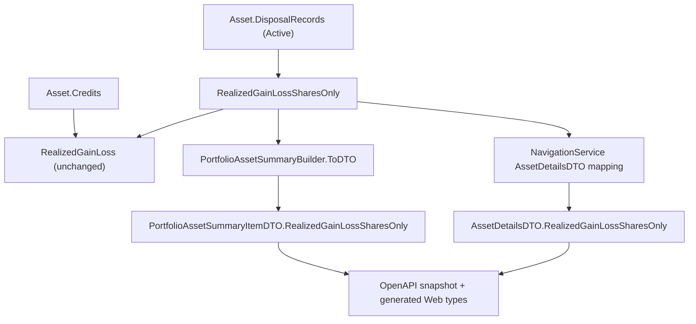

# Spec: F01. Realized (Shares Only) domain calculation and API exposure

## 1. Technical Overview

**What:** Add `Asset.RealizedGainLossSharesOnly`, a sibling of the existing `Asset.RealizedGainLoss` domain property, computed as the sum of `GainLoss` across the asset's active `DisposalRecords` with all `Credits` excluded. Expose it as a new field on `PortfolioAssetSummaryItemDTO` and `AssetDetailsDTO`, mapped by `PortfolioAssetSummaryBuilder` and `NavigationService` respectively, and regenerate the OpenAPI contract snapshot and the Web generated types to publish the new field.

**Why:** `RealizedGainLoss` blends taxable share capital gains with tax-exempt credit distributions (dividends, JCP, coupons). Computing the shares-only component once here — rather than in each front end — gives Financial.Web (F02) and Financial.App (F03) a single, authoritative source for the value, so neither client re-derives the formula and both are guaranteed to agree.

**Scope:**
- Included: the new `Asset` domain property; the new DTO fields and their mapping in both builders; OpenAPI snapshot + generated Web types regeneration; domain and application-layer test coverage.
- Excluded: any UI change (F02/F03, later wave); any change to `RealizedGainLoss`'s own value or formula; net-of-withholding/fee variants; new API endpoints (per PRD Section 7).
- No Core Scope/Full Scope split exists for F01 in the PRD — this spec covers the feature's full stated scope.

## 2. Architecture Impact

**Affected components:**
- `Financial.Investment.Domain/Entities/Asset.cs` — modified: new `RealizedGainLossSharesOnly` computed property.
- `Financial.Investment.Application/DTOs/PortfolioAssetSummaryItemDTO.cs` — modified: new `RealizedGainLossSharesOnly` field.
- `Financial.Investment.Application/DTOs/AssetDetailsDTO.cs` — modified: new `RealizedGainLossSharesOnly` field.
- `Financial.Investment.Application/Services/PortfolioAssetSummaryBuilder.cs` — modified: `AssetComputedData` record, `ComputeAssetData`, and `ToDTO` extended to carry and map the new value.
- `Financial.Investment.Application/Services/NavigationService.cs` — modified: `AssetDetailsDTO` construction extended to map the new value.
- `Tests/Financial.Api.Tests/Contract/openapi-v1.snapshot.json` — regenerated.
- `Financial.Web/src/api/generated/openapi.ts` — regenerated.
- `Tests/Financial.Investment.Domain.Tests/Domain/AssetTests.cs` — modified: new test.
- `Tests/Financial.Investment.Application.Tests/Services/PortfolioAssetSummaryServiceTests.cs` — modified: new tests.
- `Tests/Financial.Investment.Application.Tests/Services/NavigationServiceTests.cs` (or the equivalent file already covering `AssetDetailsDTO` mapping — confirm exact file name during implementation) — modified: new test.

No route, controller, or persistence changes: the field rides on the existing Portfolio Holdings summary and Asset Details responses; no new endpoint is introduced.



## 3. Technical Decisions

| Decision | Chosen Approach | Alternative Considered | Trade-off |
|----------|----------------|----------------------|-----------|
| Formula for the new property | `DisposalRecords.Where(d => d.Status == DisposalRecordStatus.Active).Sum(d => d.GainLoss)` — identical disposal-record sum `RealizedGainLoss` already uses, minus the `Credits.Sum(c => c.Value)` term | Compute as `RealizedGainLoss - Credits.Sum(c => c.Value)` | Both are mathematically equivalent; the chosen form avoids depending on `RealizedGainLoss`'s own expression, so a future change to one property's implementation detail can't silently couple to the other — each property independently expresses what it means ("shares only" vs "shares + credits") |
| Property placement | Directly below `RealizedGainLoss` in `Asset.cs` (same file, adjacent property) | Extracting both into a separate calculator class | The existing `RealizedGainLoss` is already a simple computed property on `Asset`; matching that placement is the established codebase pattern (`AveragePrice`, `Quantity`, `AverageSellPrice` are all adjacent computed properties on `Asset`) and avoids introducing a new abstraction for a one-line sum |
| DTO field type/nullability | `decimal` (non-nullable), matching `RealizedGainLoss`'s own type on both DTOs | `decimal?` | `RealizedGainLoss` is non-nullable on both DTOs already (it is always computable, defaulting to `0m` for an asset with no disposals) — the new field follows the same convention for consistency |
| No XML doc comment on the new `AssetDetailsDTO` property | Plain property declaration, no comment | Mirror the existing doc comment above `AssetDetailsDTO.RealizedGainLoss` | This repo's CLAUDE.md mandates a strict "no comments" policy for new code; the existing comment on `RealizedGainLoss` predates that policy and is not a pattern to extend |

## 4. Component Overview

**Backend:**

| File Path | New/Modified | Purpose | Key Responsibilities |
|-----------|--------------|---------|---------------------|
| `Financial.Investment.Domain/Entities/Asset.cs` | Modified | Domain entity | Add `RealizedGainLossSharesOnly` computed property immediately after `RealizedGainLoss` |
| `Financial.Investment.Application/DTOs/PortfolioAssetSummaryItemDTO.cs` | Modified | Portfolio Holdings summary DTO | Add `RealizedGainLossSharesOnly` field immediately after `RealizedGainLoss` |
| `Financial.Investment.Application/DTOs/AssetDetailsDTO.cs` | Modified | Asset details DTO | Add `RealizedGainLossSharesOnly` field immediately after `RealizedGainLoss` |
| `Financial.Investment.Application/Services/PortfolioAssetSummaryBuilder.cs` | Modified | Portfolio Holdings summary builder | Read `asset.RealizedGainLossSharesOnly` in `ComputeAssetData`, add it to the `AssetComputedData` record, map it in `ToDTO` |
| `Financial.Investment.Application/Services/NavigationService.cs` | Modified | Asset details service | Map `asset.RealizedGainLossSharesOnly` into `AssetDetailsDTO.RealizedGainLossSharesOnly` alongside the existing `RealizedGainLoss` mapping |

**Contract/generated artifacts:**

| File Path | New/Modified | Purpose |
|-----------|--------------|---------|
| `Tests/Financial.Api.Tests/Contract/openapi-v1.snapshot.json` | Regenerated | Pins the new field on both affected schemas |
| `Financial.Web/src/api/generated/openapi.ts` | Regenerated | Frontend type source for the new field |

`Financial.Web/src/api/types.ts` requires no manual edit — its `RealizedGainLoss`-adjacent type aliases pass through whatever the generated schema exposes.

## 5. API Contracts

No new endpoint. The existing Portfolio Holdings summary and Asset Details responses gain one field each:

**`PortfolioAssetSummaryItemDTO`** (served by the existing Portfolio Holdings summary endpoint):
```json
{
  "assetName": "MXRF11",
  "realizedGainLoss": -30.00,
  "realizedGainLossSharesOnly": -50.00,
  "totalCredits": 20.00
}
```

**`AssetDetailsDTO`** (served by the existing Asset Details endpoint):
```json
{
  "name": "MXRF11",
  "realizedGainLoss": 75.00,
  "realizedGainLossSharesOnly": 25.00,
  "totalCredits": 50.00
}
```

`realizedGainLossSharesOnly` always equals `realizedGainLoss - totalCredits` for the same payload; this is the contract both F02 and F03 rely on without re-deriving it themselves.

## 6. Data Model

Not applicable — no persistence or schema changes. `RealizedGainLossSharesOnly` is computed at read time from already-persisted `DisposalRecords`; nothing new is stored.

## 7. Testing Strategy

**Test File Structure:**

| Test File | Test Type | Target | Coverage Goal |
|-----------|-----------|--------|---------------|
| `Tests/Financial.Investment.Domain.Tests/Domain/AssetTests.cs` | Unit (xUnit + FluentAssertions) | `Asset.RealizedGainLossSharesOnly` | New property excludes credits; `RealizedGainLoss` unchanged |
| `Tests/Financial.Investment.Application.Tests/Services/PortfolioAssetSummaryServiceTests.cs` | Unit (xUnit + FluentAssertions) | `PortfolioAssetSummaryBuilder` via the service | DTO field populated correctly in both Active and Historic scope |
| `Tests/Financial.Investment.Application.Tests/Services/NavigationServiceTests.cs` (or the file already covering `GetAssetDetails`/`AssetDetailsDTO` mapping) | Unit (xUnit + FluentAssertions) | `NavigationService` | `AssetDetailsDTO.RealizedGainLossSharesOnly` populated correctly |
| `Tests/Financial.Api.Tests/Contract/OpenApiContractTests.cs` | Contract | OpenAPI snapshot | Passes unmodified against the regenerated snapshot including the new field |
| `Financial.Web/src/api/generated/__tests__/openapiFreshness.test.ts` | Freshness | Generated Web types | Passes after `npm run generate-api-types` is re-run and committed |

**New/updated test functions:**

| Test Function | Description | Assertions | Maps to AC |
|---------------|-------------|------------|------------|
| `RealizedGainLossSharesOnly_ExcludesCredits_MatchesDisposalRecordSumAlone` | Domain test mirroring `RealizedGainLoss_UnderAverageCost_MatchesPreFeatureWeightedAverageFigure` — same buy/sell/credit setup (10@100, 15@100 buy; 5@110 sell; 12 dividend credit) | `asset.RealizedGainLossSharesOnly.Should().Be(50m, "550 proceeds minus 5x100 cost basis, with the 12 credit excluded")`; `asset.RealizedGainLoss.Should().Be(62m)` unchanged in the same test | AC1, AC2, AC3 |
| `GetPortfolioAssetsSummary_HistoricScope_ComputesRealizedGainLossSharesOnly` | Mirrors `GetPortfolioAssetsSummary_HistoricScope_ComputesRealizedGainLoss` — same asset setup (5@60 buy, 5@50 sell, 20 dividend credit) | `result[0].RealizedGainLossSharesOnly.Should().Be(-50m, "TotalSold - TotalBought, credits excluded: 250 - 300 = -50")`; existing `RealizedGainLoss` assertion (`-30m`) re-run unchanged | AC4 |
| `GetPortfolioAssetsSummary_ActiveScope_ComputesRealizedGainLossSharesOnly` | Mirrors `GetPortfolioAssetsSummary_ActiveScope_ComputesRealizedGainLossFromTransactionReplay` (no credits in that fixture, so shares-only equals the existing `-50m`) | `result[0].RealizedGainLossSharesOnly.Should().Be(-50m)` | AC4 |
| `GetAssetDetails_MapsRealizedGainLossSharesOnly` (name adapted to the actual existing test's naming convention once the target file is confirmed) | Asset with a sell and a credit, asserting the mapped DTO field | `result.RealizedGainLossSharesOnly.Should().Be(asset.RealizedGainLossSharesOnly)` | AC5 |
| `OpenApiDocument_MatchesSnapshot` (existing test, re-run) | Confirms the regenerated snapshot is stable and schema-accurate | Existing assertion passes unmodified against the new snapshot | AC6 |
| `openapiFreshness.test.ts` (existing test, re-run) | Confirms generated Web types match the snapshot | Existing assertion passes after regeneration | AC7 |

**Cross-Feature Integration tests:** none apply directly to F01 — the PRD's three integration criteria are about F02/F03 consuming F01's field without re-deriving it, and are covered by F02's and F03's own test suites (verifying they read `realizedGainLossSharesOnly`/`RealizedGainLossSharesOnly` directly rather than subtracting). F01's contribution to those criteria is fully discharged by AC4/AC5 (the field is populated correctly) plus AC6/AC7 (it is actually published in the contract both clients build against).

## Assumptions / Decisions

1. **Exact NavigationService/AssetDetailsDTO test file name.** The spec assumes a `NavigationServiceTests.cs` (or equivalent) file already exists covering `AssetDetailsDTO` mapping; confirm the exact file at implementation time and add the new test there, following its existing naming convention.
2. **`RealizedGainLossSharesOnly` formula independence from `RealizedGainLoss`.** Chose to express both properties independently (each summing what it needs) rather than having one reference the other, per the Technical Decisions table above — this is a deliberate choice, not a PRD requirement, made to keep each property's meaning self-contained.
