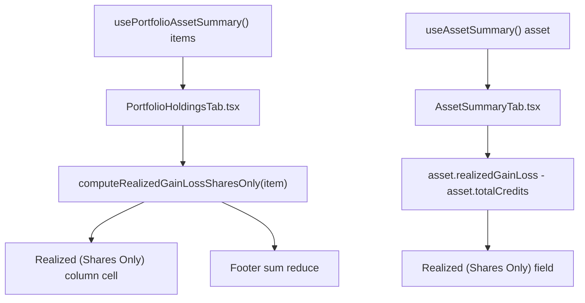

# Spec: F01. Realized (Shares Only) in Financial.Web

## 1. Technical Overview

**What:** Add a second, presentation-only figure — "Realized (Shares Only)" — next to the existing "Realized Gain/Loss" in two `Financial.Web` views: the Historic-scope Portfolio Holdings grid (`PortfolioHoldingsTab.tsx`, as a new sortable column with its own footer total cell) and the Asset Summary panel's "Realized" section (`AssetSummaryTab.tsx`, as a new field). The value is `realizedGainLoss - totalCredits`, computed inline in each component from fields the generated OpenAPI types already expose.

**Why:** `PortfolioAssetSummaryItemDto.realizedGainLoss` and `AssetDetailsDto.realizedGainLoss` blend taxable share capital gains with tax-exempt credit distributions (dividends, JCP, coupons). `PortfolioHoldingsTab.tsx`'s existing `computeProfitPercent` (line 37-44) already isolates the shares-only component as `item.realizedGainLoss - item.totalCredits` for a percentage; this feature surfaces that identical subtraction as its own labeled absolute-value metric, reusing data already loaded by both views' existing hooks (`usePortfolioAssetSummary`, `useAssetSummary`). No new field is added to any DTO, so no backend, OpenAPI snapshot, or generated-types change is needed.

**Scope:**
- Included: new grid column + footer cell in `PortfolioHoldingsTab.tsx` (Historic scope only); new field in `AssetSummaryTab.tsx`'s "Realized" section (historic, closed-position only); unit tests covering value, sort, footer sum, and coloring for both, mirroring the existing "Realized Gain/Loss" test coverage.
- Excluded (per PRD Section 7 and task framing): any DTO/domain/API/OpenAPI-snapshot change; `Financial.App` (WPF) parity (F02, separate feature); net-of-withholding or net-of-fee variants; currency-conversion changes; export/report/tax-form integration.
- The PRD has no `Core Scope`/`Full Scope additions` split for F01, so the spec covers the feature's full stated scope (all Section 6 Capabilities/Experience bullets and Section 9 acceptance criteria for F01).

## 2. Architecture Impact

**Affected components:**
- `Financial.Web/src/components/PortfolioHoldingsTab.tsx` — modified: new derived-value helper, new sortable column, new sort accessor, new footer aggregate + cell.
- `Financial.Web/src/components/AssetSummaryTab.tsx` — modified: new field in the existing "Realized" section.
- `Financial.Web/src/components/__tests__/PortfolioHoldingsTab.test.tsx` — modified: new/updated tests.
- `Financial.Web/src/components/__tests__/AssetSummaryTab.test.tsx` — modified: new/updated tests.

No other file changes: `PortfolioAssetSummaryItemDto` and `AssetDetailsDto` (`Financial.Web/src/api/generated/openapi.ts` via `Financial.Web/src/api/types.ts`) already carry `realizedGainLoss` and `totalCredits`; `DataTableCell`, `SortableColumnHeader`, and `useSortableRows` are reused unmodified.

## 3. Technical Decisions

| Decision | Chosen Approach | Alternative Considered | Trade-off |
|----------|----------------|----------------------|-----------|
| Where to compute the derived value | Inline helper function `computeRealizedGainLossSharesOnly(item)` in `PortfolioHoldingsTab.tsx`, colocated with `computeProfitPercent`; a plain inline expression `asset.realizedGainLoss - asset.totalCredits` in `AssetSummaryTab.tsx` (matching that file's existing style, which computes derived values inline rather than via named helpers, e.g. `totalCurrentPlusCredits`) | A single cross-file shared utility (e.g. in `formatters.ts`) | A shared utility would centralize the formula, but the codebase's own precedent (`computeProfitPercent` duplicating the same subtraction already exists in the same file) favors colocated, per-file derivation over introducing a new shared module for one two-term subtraction; documented as an Assumption below since the PRD doesn't mandate either |
| Column position in the grid | Immediately after `realizedGainLoss` in both the header row array and `sortAccessors` map, inside the existing `{isHistoric && (...)}` block | Appending at the end of the row | PRD explicitly requires "immediately after the existing 'Realized Gain/Loss' column" (Section 6 Capabilities); no trade-off, this is a direct requirement |
| Footer aggregate computation | Client-side `items.reduce((acc, it) => acc + (it.realizedGainLoss - it.totalCredits), 0)`, added alongside the existing `realizedGainLoss` footer reduce in the same IIFE (~line 245) | Deriving from the server-provided `AggregatedSummaryDto` (as `totalInvested`/`totalCredits` already do) | `AggregatedSummaryDto` (Section 9 AC) has no shares-only-realized field and adding one would be a backend/DTO change, explicitly out of scope; a client-side sum over already-loaded `items` mirrors the existing `realizedGainLoss` footer reduce (same IIFE, same non-DTO-backed pattern) |
| Field label wording and placement in Asset Summary | Label "Realized (Shares Only)" as a new `
` immediately following the existing "Realized Gain/Loss" field, inside the same `scope === 'historic'` conditional block (lines 132-166) | A separate subsection | PRD Section 6 Experience states the field appears "immediately below Realized Gain/Loss" within the existing section; no new section/subsection needed |

## 4. Component Overview

**Frontend:**

| File Path | New/Modified | Purpose | Key Responsibilities |
|-----------|--------------|---------|---------------------|
| `Financial.Web/src/components/PortfolioHoldingsTab.tsx` | Modified | Historic Portfolio Holdings grid | Add `computeRealizedGainLossSharesOnly` helper; render new `DataTableCell` for "Realized (Shares Only)" in `AssetRow` right after the "Realized Gain/Loss" cell (only when `isHistoric`); add `realizedGainLossSharesOnly` sort accessor; add matching `SortableColumnHeader` right after the "Realized Gain/Loss" header; extend the footer IIFE with a `realizedGainLossSharesOnly` sum and render its footer cell right after the "Realized Gain/Loss" footer item |
| `Financial.Web/src/components/AssetSummaryTab.tsx` | Modified | Historic Asset Summary "Realized" section | Add a new field block immediately after the existing "Realized Gain/Loss" field, computing `asset.realizedGainLoss - asset.totalCredits` inline and applying `signClass` the same way the neighboring field does |
| `Financial.Web/src/components/__tests__/PortfolioHoldingsTab.test.tsx` | Modified | Test coverage for the grid | Add tests for: column header presence/position in historic scope, absence in active scope, per-row value, sort ascending/descending, footer sum, positive/negative color classes |
| `Financial.Web/src/components/__tests__/AssetSummaryTab.test.tsx` | Modified | Test coverage for the panel | Add tests for: field presence/value/position in historic scope, absence when "Realized" section is hidden (active scope or open position), positive/negative color classes |

No Backend or Database sections apply — this feature makes zero backend, API, or persistence changes (confirmed against `Financial.Investment.Application/DTOs/PortfolioAssetSummaryItemDTO.cs` and `AssetDetailsDTO.cs`, both of which already expose `RealizedGainLoss` and `TotalCredits`, already reflected in `Financial.Web/src/api/generated/openapi.ts`).

## 5. API Contracts

Not applicable — no API changes. Both `PortfolioAssetSummaryItemDto.realizedGainLoss`/`totalCredits` and `AssetDetailsDto.realizedGainLoss`/`totalCredits` are already present in the generated types consumed by `Financial.Web/src/api/types.ts`; the existing `usePortfolioAssetSummary` and `useAssetSummary` hooks already fetch and expose them. No request/response shape changes.

## 6. Data Model

Not applicable — no persistence or schema changes. The value is derived entirely at render time from already-fetched DTO fields; nothing is stored.

## 7. Testing Strategy

**Test File Structure:**

| Test File | Test Type | Target | Coverage Goal |
|-----------|-----------|--------|---------------|
| `Financial.Web/src/components/__tests__/PortfolioHoldingsTab.test.tsx` | Unit (component, Vitest + Testing Library) | `PortfolioHoldingsTab` | New column: value, position, sort, footer sum, coloring, visibility |
| `Financial.Web/src/components/__tests__/AssetSummaryTab.test.tsx` | Unit (component, Vitest + Testing Library) | `AssetSummaryTab` | New field: value, position, coloring, visibility |

**`PortfolioHoldingsTab.test.tsx` — new/updated test functions:**

| Test Function | Description | Assertions | Maps to AC |
|---------------|-------------|------------|------------|
| `renders_realized_gain_loss_shares_only_column_header_immediately_after_realized_gain_loss_in_historic_scope` | Header order check in historic scope | `getAllByRole('columnheader')` — the "Realized (Shares Only)" header's index is `realizedGainLoss` header's index + 1 | AC1 |
| `does_not_render_realized_gain_loss_shares_only_column_in_active_scope` | Active-scope visibility | `queryByText('Realized (Shares Only)')` is not in the document when scope is `'active'` | AC6 |
| `renders_realized_gain_loss_shares_only_value_for_historic_asset` | Per-row value | Item with `realizedGainLoss: 280, totalCredits: 30` renders `250.00` (formatted via `formatN2`) in the new column's cell | AC2 |
| `sorts_rows_by_realized_gain_loss_shares_only_ascending_then_descending_independently_of_realized_gain_loss` | Sort behavior, mirroring the existing `sorts_rows_by_quantity_ascending...`/`clicking_the_realized_gain_loss_header_engages_that_columns_sort_in_historic_scope` pattern | Clicking the "Realized (Shares Only)" header reorders rows by the derived value ascending, then descending on a second click; clicking it does not also toggle the "Realized Gain/Loss" header's `aria-sort` | AC3 |
| `renders_footer_realized_gain_loss_shares_only_sum` | Footer aggregate, mirroring `renders_footer_realized_gain_loss_sum` | Two items with `(realizedGainLoss, totalCredits)` = `(280, 30)` and `(-20, 5)` produce a footer `data-label="Realized (Shares Only)"` input value of `225.00` | AC4 |
| `applies_positive_color_class_to_realized_gain_loss_shares_only_when_shares_only_result_is_positive_but_realized_gain_loss_itself_is_negative` | Coloring is independent of the sibling column's sign, proving the derived value (not the raw `realizedGainLoss`) drives the class | Item with `realizedGainLoss: -10, totalCredits: -50` (shares-only = 40) renders the cell with `portfolio-holdings__profit--green`; a second case with `realizedGainLoss: 10, totalCredits: 50` (shares-only = -40) renders `portfolio-holdings__profit--red` | AC5 |
| `existing_realized_gain_loss_column_value_sort_and_footer_are_unchanged` (regression) | Confirms `renders_realized_gain_loss_for_historic_asset`, `renders_footer_realized_gain_loss_sum`, and `clicking_the_realized_gain_loss_header_engages_that_columns_sort_in_historic_scope` still pass unmodified in behavior (existing tests re-run, no new assertions needed — flag in PR description as "0 changes to existing Realized Gain/Loss assertions") | Existing test bodies for these three tests remain byte-for-byte unchanged and pass | AC9 |

**`AssetSummaryTab.test.tsx` — new/updated test functions:**

| Test Function | Description | Assertions | Maps to AC |
|---------------|-------------|------------|------------|
| `renders_realized_gain_loss_shares_only_field_directly_below_realized_gain_loss_for_historic_closed_asset` | Field presence, value, and DOM order | Asset with `realizedGainLoss: 75, totalCredits: 50` (historic scope, `quantity: 0`) renders a "Realized (Shares Only)" label whose value is `25.00`; the field's label element is the "Realized Gain/Loss" field's next field-level sibling | AC7 |
| `does_not_render_realized_gain_loss_shares_only_field_when_realized_section_is_hidden_for_active_scope` | Visibility parity with the "Realized" section itself, mirroring `hides_realized_totals_section_for_active_scope` | `queryByText('Realized (Shares Only)')` is not in the document when scope is `'active'` | AC8 |
| `renders_positive_realized_gain_loss_shares_only_in_green_for_historic_scope` | Coloring, mirroring `renders_positive_realized_gain_loss_in_green_for_historic_scope` | Asset with `realizedGainLoss: 75, totalCredits: 0` (shares-only = 75) renders the new field's value with `asset-summary__value--green` | AC5 (Experience: same sign-based coloring) |
| `renders_negative_realized_gain_loss_shares_only_in_red_when_shares_only_result_differs_in_sign_from_realized_gain_loss` | Coloring is independent of the sibling field's sign | Asset with `realizedGainLoss: 10, totalCredits: 50` (shares-only = -40, while `realizedGainLoss` itself is positive) renders the new field's value with `asset-summary__value--red` while "Realized Gain/Loss" itself remains green | AC5 |
| `existing_realized_gain_loss_field_value_and_coloring_are_unchanged` (regression) | Confirms `renders_realized_totals_section_for_historic_scope` and `renders_positive_realized_gain_loss_in_green_for_historic_scope` still pass unmodified | Existing test bodies remain unchanged and pass | AC9 |

**Coverage note:** per `docs/rules/implementation.md` and the `testing-guide-Financial` skill, this is presentation-only derived-value logic with no new hook, no new API call, and no new state — component-level unit tests (Vitest + Testing Library, the pattern already used by both target test files) are the correct and sufficient layer; no new integration or E2E test is warranted, and none of Section 9's Cross-Feature Integration criteria apply to F01 (the PRD explicitly marks Cross-Feature Integration "Not applicable" for F01/F02).

## Assumptions / Decisions (Batch Mode Auto-Accept)

Per the task's Batch Mode / Auto-Accept Policy (interview skipped), the following defaults were applied where the PRD and codebase did not fully specify an approach:

1. **Derivation placement — colocated helper vs. shared utility.** Chose a colocated `computeRealizedGainLossSharesOnly` helper in `PortfolioHoldingsTab.tsx` (mirroring `computeProfitPercent`) and an inline expression in `AssetSummaryTab.tsx` (mirroring `totalCurrentPlusCredits`), rather than introducing a new shared `formatters.ts`/utility function. Rationale: matches each file's own established pattern for one-off derived values; the PRD does not require value-computation code sharing between the two components, and Web/WPF parity (the real cross-app consistency requirement) is enforced by F02 computing the identical `RealizedGainLoss - TotalCredits` formula independently in C#, not by a shared TS module.
2. **Sort tie-breaking for "Realized (Shares Only)".** Uses the existing `useSortableRows` hook's default comparison semantics (same as every other numeric column, e.g. `realizedGainLoss`, `totalCredits`) — no bespoke secondary sort key. The PRD's Section 6 Capabilities calls for "the same `SortableColumnHeader` pattern and numeric sort semantics," which this satisfies directly.
3. **Zero-value display/coloring.** When `realizedGainLoss - totalCredits === 0`, the value renders via the existing `signClass`/`getProfitClass` behavior, which classifies `0` as non-negative (`>= 0` check) and applies the "positive"/green class — identical to how the existing "Realized Gain/Loss" column already treats an exact-zero value. No special "neutral" class is introduced, since the PRD's Experience text ("green (positive), red (negative), or neutral (zero)") describes the existing convention's *effect*, not a new third CSS class, and the codebase's `signClass` helper has always been binary.
4. **Test naming convention.** Followed each test file's existing `snake_case_sentence` `it(...)` naming convention exactly (e.g. `renders_footer_realized_gain_loss_sum`), rather than introducing a different style for the new tests.
