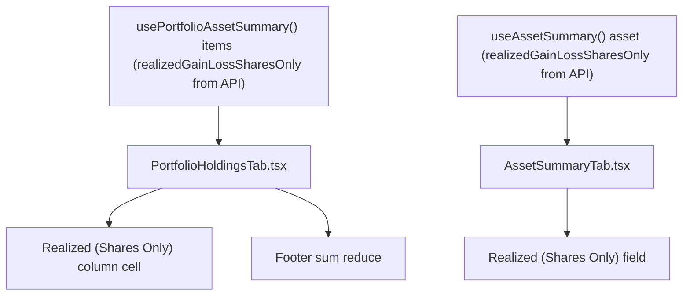

# Spec: F02. Realized (Shares Only) in Financial.Web

## 1. Technical Overview

**What:** Add a second, presentation-only figure — "Realized (Shares Only)" — next to the existing "Realized Gain/Loss" in two `Financial.Web` views: the Historic-scope Portfolio Holdings grid (`PortfolioHoldingsTab.tsx`, as a new sortable column with its own footer total cell) and the Asset Summary panel's "Realized" section (`AssetSummaryTab.tsx`, as a new field). The value is read directly from `item.realizedGainLossSharesOnly` / `asset.realizedGainLossSharesOnly` — the field F01 now computes server-side and exposes on `PortfolioAssetSummaryItemDto` and `AssetDetailsDto`. No subtraction happens in this codebase; the front end only displays what the API sends.

**Why:** `realizedGainLoss` blends taxable share capital gains with tax-exempt credit distributions (dividends, JCP, coupons). F01 already computes and serves the shares-only component as `realizedGainLossSharesOnly`; this feature surfaces that field as its own labeled value in the two views that already show `realizedGainLoss`, reusing data already loaded by both views' existing hooks (`usePortfolioAssetSummary`, `useAssetSummary`).

**Scope:**
- Included: new grid column + footer cell in `PortfolioHoldingsTab.tsx` (Historic scope only); new field in `AssetSummaryTab.tsx`'s "Realized" section (historic, closed-position only); unit tests covering value, sort, footer sum, and coloring for both, mirroring the existing "Realized Gain/Loss" test coverage.
- Excluded (per PRD Section 7 and Out of Scope): any further DTO/domain/API change (F01, already shipped); `Financial.App` (WPF) parity (F03, separate feature); net-of-withholding or net-of-fee variants; currency-conversion changes; export/report/tax-form integration; client-side derivation of the value (explicitly forbidden — the field must be read as-is from the API, per this feature's Consumes relationship to F01).
- The PRD has no `Core Scope`/`Full Scope additions` split for F02, so the spec covers the feature's full stated scope.

## 2. Architecture Impact

**Affected components:**
- `Financial.Web/src/components/PortfolioHoldingsTab.tsx` — modified: new sortable column, new sort accessor, new footer aggregate + cell. No new helper function — the value is read directly from the DTO field, unlike the existing `computeProfitPercent`/`computeProfitWithCreditsPercent` helpers which perform actual derivation.
- `Financial.Web/src/components/AssetSummaryTab.tsx` — modified: new field in the existing "Realized" section.
- `Financial.Web/src/components/__tests__/PortfolioHoldingsTab.test.tsx` — modified: new/updated tests.
- `Financial.Web/src/components/__tests__/AssetSummaryTab.test.tsx` — modified: new/updated tests.

No other file changes: `PortfolioAssetSummaryItemDto.realizedGainLossSharesOnly` and `AssetDetailsDto.realizedGainLossSharesOnly` are already present in `Financial.Web/src/api/generated/openapi.ts` (regenerated by F01) and flow through `Financial.Web/src/api/types.ts` unchanged; `DataTableCell`, `SortableColumnHeader`, and `useSortableRows` are reused unmodified.

## 3. Technical Decisions

| Decision | Chosen Approach | Alternative Considered | Trade-off |
|----------|----------------|----------------------|-----------|
| Where the displayed value comes from | Read `item.realizedGainLossSharesOnly` / `asset.realizedGainLossSharesOnly` directly — no client-side arithmetic | Compute `realizedGainLoss - totalCredits` in each component (the approach originally considered and rejected) | Rejected: computing the formula independently in Web and WPF duplicates business logic in two languages with no single source of truth; F01 already serves the correct value, so the front end's only job is to display it |
| Column position in the grid | Immediately after `realizedGainLoss` in both the header row array and `sortAccessors` map, inside the existing `{isHistoric && (...)}` block | Appending at the end of the row | PRD explicitly requires "immediately after the existing 'Realized Gain/Loss' column" (Section 6 Capabilities); no trade-off, this is a direct requirement |
| Footer aggregate computation | Client-side `items.reduce((acc, it) => acc + it.realizedGainLossSharesOnly, 0)`, added alongside the existing `realizedGainLoss` footer reduce in the same IIFE (~line 245) — summing the already-correct per-item field, not re-deriving it | Deriving from a server-provided `AggregatedSummaryDto` total | `AggregatedSummaryDto` has no shares-only-realized aggregate field and adding one is out of this feature's scope; summing the already-loaded, already-correct per-item `realizedGainLossSharesOnly` values client-side mirrors the existing `realizedGainLoss` footer reduce (same IIFE, same pattern) without introducing any new arithmetic |
| Field label wording and placement in Asset Summary | Label "Realized (Shares Only)" as a new `
` immediately following the existing "Realized Gain/Loss" field, inside the same `scope === 'historic'` conditional block (lines 132-166) | A separate subsection | PRD Section 6 Experience states the field appears "immediately below Realized Gain/Loss" within the existing section; no new section/subsection needed |

## 4. Component Overview

**Frontend:**

| File Path | New/Modified | Purpose | Key Responsibilities |
|-----------|--------------|---------|---------------------|
| `Financial.Web/src/components/PortfolioHoldingsTab.tsx` | Modified | Historic Portfolio Holdings grid | Render new `DataTableCell` for "Realized (Shares Only)" in `AssetRow` right after the "Realized Gain/Loss" cell (only when `isHistoric`), reading `item.realizedGainLossSharesOnly` directly; add `realizedGainLossSharesOnly` sort accessor (`r => r.item.realizedGainLossSharesOnly`); add matching `SortableColumnHeader` right after the "Realized Gain/Loss" header; extend the footer IIFE with a `realizedGainLossSharesOnly` sum and render its footer cell right after the "Realized Gain/Loss" footer item |
| `Financial.Web/src/components/AssetSummaryTab.tsx` | Modified | Historic Asset Summary "Realized" section | Add a new field block immediately after the existing "Realized Gain/Loss" field, rendering `asset.realizedGainLossSharesOnly` directly and applying `signClass` the same way the neighboring field does |
| `Financial.Web/src/components/__tests__/PortfolioHoldingsTab.test.tsx` | Modified | Test coverage for the grid | Add tests for: column header presence/position in historic scope, absence in active scope, per-row value (asserting it reads the DTO field, not derives it), sort ascending/descending, footer sum, positive/negative color classes |
| `Financial.Web/src/components/__tests__/AssetSummaryTab.test.tsx` | Modified | Test coverage for the panel | Add tests for: field presence/value/position in historic scope, absence when "Realized" section is hidden (active scope or open position), positive/negative color classes |

No Backend or Database sections apply — F01 already shipped the field; this feature makes zero further backend, API, or persistence changes.

## 5. API Contracts

Not applicable — no new API changes in this feature. `PortfolioAssetSummaryItemDto.realizedGainLossSharesOnly` and `AssetDetailsDto.realizedGainLossSharesOnly` were added by F01 and are already present in the generated types consumed by `Financial.Web/src/api/types.ts`; the existing `usePortfolioAssetSummary` and `useAssetSummary` hooks already fetch and expose them.

## 6. Data Model

Not applicable — no persistence or schema changes. The value is rendered directly from the already-fetched DTO field.

## 7. Testing Strategy

**Test File Structure:**

| Test File | Test Type | Target | Coverage Goal |
|-----------|-----------|--------|---------------|
| `Financial.Web/src/components/__tests__/PortfolioHoldingsTab.test.tsx` | Unit (component, Vitest + Testing Library) | `PortfolioHoldingsTab` | New column: value (from DTO field, not derived), position, sort, footer sum, coloring, visibility |
| `Financial.Web/src/components/__tests__/AssetSummaryTab.test.tsx` | Unit (component, Vitest + Testing Library) | `AssetSummaryTab` | New field: value, position, coloring, visibility |

**`PortfolioHoldingsTab.test.tsx` — new/updated test functions:**

| Test Function | Description | Assertions | Maps to AC |
|---------------|-------------|------------|------------|
| `renders_realized_gain_loss_shares_only_column_header_immediately_after_realized_gain_loss_in_historic_scope` | Header order check in historic scope | `getAllByRole('columnheader')` — the "Realized (Shares Only)" header's index is `realizedGainLoss` header's index + 1 | AC1 |
| `does_not_render_realized_gain_loss_shares_only_column_in_active_scope` | Active-scope visibility | `queryByText('Realized (Shares Only)')` is not in the document when scope is `'active'` | AC6 |
| `renders_realized_gain_loss_shares_only_value_from_dto_field_for_historic_asset` | Per-row value comes straight from the field, with `realizedGainLoss`/`totalCredits` set to unrelated values proving no client-side subtraction occurs | Item with `realizedGainLoss: 280, totalCredits: 30, realizedGainLossSharesOnly: 999` renders `999.00` (formatted via `formatN2`) in the new column's cell — confirms the component reads the field, not `realizedGainLoss - totalCredits` | AC2 |
| `sorts_rows_by_realized_gain_loss_shares_only_ascending_then_descending_independently_of_realized_gain_loss` | Sort behavior, mirroring the existing `clicking_the_realized_gain_loss_header_engages_that_columns_sort_in_historic_scope` pattern | Clicking the "Realized (Shares Only)" header reorders rows by `realizedGainLossSharesOnly` ascending, then descending on a second click; clicking it does not also toggle the "Realized Gain/Loss" header's `aria-sort` | AC3 |
| `renders_footer_realized_gain_loss_shares_only_sum` | Footer aggregate, mirroring `renders_footer_realized_gain_loss_sum` | Two items with `realizedGainLossSharesOnly` of `250` and `-25` produce a footer `data-label="Realized (Shares Only)"` input value of `225.00` | AC4 |
| `applies_positive_or_negative_color_class_to_realized_gain_loss_shares_only_independent_of_realized_gain_loss_sign` | Coloring is driven by the shares-only field's own sign, not its sibling's | Item with `realizedGainLoss: -10, realizedGainLossSharesOnly: 40` renders `portfolio-holdings__profit--green`; a second case with `realizedGainLoss: 10, realizedGainLossSharesOnly: -40` renders `portfolio-holdings__profit--red` | AC5 |
| `existing_realized_gain_loss_column_value_sort_and_footer_are_unchanged` (regression) | Confirms `renders_realized_gain_loss_for_historic_asset`, `renders_footer_realized_gain_loss_sum`, and `clicking_the_realized_gain_loss_header_engages_that_columns_sort_in_historic_scope` still pass unmodified | Existing test bodies for these three tests remain unchanged and pass | AC9 |

**`AssetSummaryTab.test.tsx` — new/updated test functions:**

| Test Function | Description | Assertions | Maps to AC |
|---------------|-------------|------------|------------|
| `renders_realized_gain_loss_shares_only_field_directly_below_realized_gain_loss_for_historic_closed_asset` | Field presence, value (from DTO field), and DOM order | Asset with `realizedGainLoss: 75, totalCredits: 50, realizedGainLossSharesOnly: 999` (historic scope, `quantity: 0`) renders a "Realized (Shares Only)" label whose value is `999.00` — confirms no client-side subtraction; the field's label element is the "Realized Gain/Loss" field's next field-level sibling | AC7 |
| `does_not_render_realized_gain_loss_shares_only_field_when_realized_section_is_hidden_for_active_scope` | Visibility parity with the "Realized" section itself, mirroring `hides_realized_totals_section_for_active_scope` | `queryByText('Realized (Shares Only)')` is not in the document when scope is `'active'` | AC8 |
| `renders_positive_realized_gain_loss_shares_only_in_green_for_historic_scope` | Coloring, mirroring `renders_positive_realized_gain_loss_in_green_for_historic_scope` | Asset with `realizedGainLossSharesOnly: 75` renders the new field's value with `asset-summary__value--green` | AC5 (Experience: same sign-based coloring) |
| `renders_negative_realized_gain_loss_shares_only_in_red_when_shares_only_result_differs_in_sign_from_realized_gain_loss` | Coloring is independent of the sibling field's sign | Asset with `realizedGainLoss: 10, realizedGainLossSharesOnly: -40` renders the new field's value with `asset-summary__value--red` while "Realized Gain/Loss" itself remains green | AC5 |
| `existing_realized_gain_loss_field_value_and_coloring_are_unchanged` (regression) | Confirms `renders_realized_totals_section_for_historic_scope` and `renders_positive_realized_gain_loss_in_green_for_historic_scope` still pass unmodified | Existing test bodies remain unchanged and pass | AC9 |

**Cross-Feature Integration tests:**

| Test Function | Description | Assertions | Cross-Feature Criterion |
|---------------|-------------|------------|--------------------------|
| `renders_realized_gain_loss_shares_only_value_from_dto_field_for_historic_asset` (above) | Proves the Web component consumes the API-provided `realizedGainLossSharesOnly` field verbatim, with no re-derivation | Already listed above — the test fixture sets `realizedGainLoss`/`totalCredits` to values inconsistent with `realizedGainLossSharesOnly`, so a passing test proves the component ignores the first two and trusts the field | "`realizedGainLossSharesOnly` computed by F01 flows unchanged into Financial.Web's Portfolio Holdings grid and Asset Summary panel (F02) with no client-side re-derivation" |
| `renders_realized_gain_loss_shares_only_field_directly_below_realized_gain_loss_for_historic_closed_asset` (above) | Same proof for the Asset Summary panel | Already listed above | Same criterion, Asset Summary surface |

**Coverage note:** per `docs/rules/implementation.md` and the `testing-guide-Financial` skill, this is presentation-only display logic with no new hook, no new API call, and no new state — component-level unit tests (Vitest + Testing Library, the pattern already used by both target test files) are the correct and sufficient layer; no new integration or E2E test is warranted.

## Assumptions / Decisions

None — F01's shipped field fully determines this feature's data contract, and the PRD's Capabilities/Experience sections leave no open design questions for F02.
