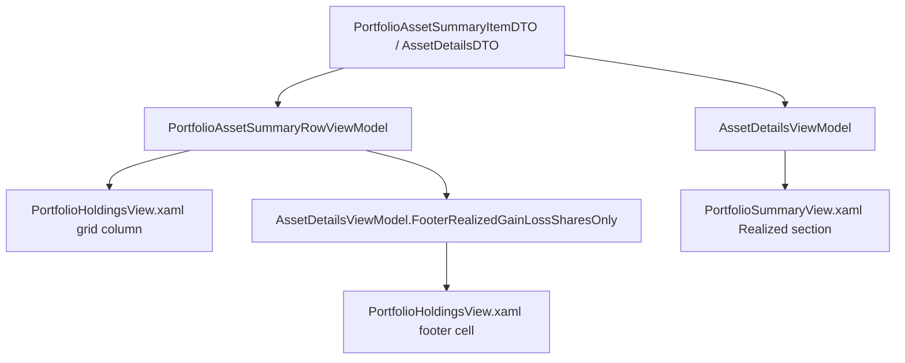

# Spec: F02. Realized (Shares Only) parity in Financial.App (WPF)

## 1. Technical Overview

**What:** Add a "Realized (Shares Only)" value next to the existing "Realized Gain/Loss" everywhere it appears in Financial.App (WPF): the Portfolio Holdings grid (`PortfolioHoldingsView.xaml`, bound to `PortfolioAssetSummaryRowViewModel`), its footer (bound to `AssetDetailsViewModel.FooterRealizedGainLoss`), and the Asset Summary panel (`PortfolioSummaryView.xaml`, bound to `AssetDetailsViewModel.RealizedGainLoss`). The new value is computed as `RealizedGainLoss - TotalCredits`, mirroring the derivation `PortfolioHoldingsTab`'s historic profit-percent already performs internally (`RealizedGainLoss - TotalCredits + TotalBought` for `_historicProfitPercent`), but exposed here as its own labeled amount rather than folded into a percentage.

**Why:** `PortfolioAssetSummaryItemDTO` and `AssetDetailsDTO` already carry `RealizedGainLoss` (shares + credits) and `TotalCredits` (credits alone) — both fields are already mapped into `PortfolioAssetSummaryRowViewModel` and `AssetDetailsViewModel` today. No backend, DTO, or API contract change is needed; this is purely a new computed view-model property plus its WPF bindings, following the exact pattern already established by `RealizedGainLoss`/`DisplayRealizedGainLoss`/`RealizedGainLossIsPositive`/`RealizedGainLossIsNegative` and `FooterRealizedGainLoss`.

**Scope:**
- **Included:** `RealizedGainLossSharesOnly` + `DisplayRealizedGainLossSharesOnly` + `RealizedGainLossSharesOnlyIsPositive`/`IsNegative` on `PortfolioAssetSummaryRowViewModel`; `RealizedGainLossSharesOnly` on `AssetDetailsViewModel` (current asset) plus `FooterRealizedGainLossSharesOnly` aggregate with matching reset-on-`Clear()` behavior; new XAML column in `PortfolioHoldingsView.xaml`'s grid (immediately after "Realized Gain/Loss"), new footer cell in the same view, new field in `PortfolioSummaryView.xaml`'s "Realized" section (immediately below "Realized Gain/Loss"); unit tests mirroring the existing `RealizedGainLoss` tests for both view models.
- **Excluded (Out of Scope, per PRD Section 7):** Any change to `Financial.Investment.Domain`, `Financial.Investment.Application` (DTOs, services), `Financial.Api` controllers, or the OpenAPI snapshot. No net-of-withholding variant, no currency-conversion changes, no export/report integration. No change to the existing `RealizedGainLoss`/`FooterRealizedGainLoss` value, sort key (grid has no sortable columns — see Decision D1), or footer computation.
- The PRD has no Core Scope / Full Scope split for F02, so this spec covers the full feature as described in Section 6.

## 2. Architecture Impact

**Affected components:**
- `Financial.App/ViewModels/Investment/PortfolioAssetSummaryRowViewModel.cs` — add computed properties, set from constructor.
- `Financial.App/ViewModels/Investment/AssetDetailsViewModel.cs` — add `RealizedGainLossSharesOnly` (current asset) and `FooterRealizedGainLossSharesOnly` (aggregate), wire into `LoadAssetDetails`, `LoadPortfolioSummary`, `Clear`, and `ClearAssetContext`.
- `Financial.App/Views/Investment/PortfolioHoldingsView.xaml` — new `DataGridTemplateColumn` after "Realized Gain/Loss" (row-level), new footer `TextBlock` pair after the existing `FooterRealizedGainLoss` stat.
- `Financial.App/Views/Investment/PortfolioSummaryView.xaml` — new label/value `TextBlock` pair inside the existing "Realized" grid section, immediately below the "Realized Gain/Loss" row.
- `Tests/Financial.Presentation.Tests/ViewModels/PortfolioAssetSummaryRowViewModelTests.cs` — new tests mirroring `DisplayRealizedGainLoss_FormatsN2`, `RealizedGainLossIsPositive_WhenGainPositive_IsTrue`, `RealizedGainLossIsNegative_WhenLossNegative_IsTrue`.
- `Tests/Financial.Presentation.Tests/ViewModels/AssetDetailsViewModelPortfolioSummaryTests.cs` — new tests mirroring `LoadPortfolioSummary_SetsFooterRealizedGainLoss_SumOfRows` and the `Clear()` reset assertion.
- A new test file or extension to an existing `AssetDetailsViewModel` test file covering `LoadAssetDetails` setting `RealizedGainLossSharesOnly` on the current asset (see Section 7 for exact target file).

## 3. Technical Decisions

| Decision | Chosen Approach | Alternative Considered | Trade-off |
|----------|----------------|----------------------|-----------|
| D1: Sortability of the new grid column | No `SortMemberPath`/click-sort added to the new column (matching that `PortfolioHoldingsView.xaml`'s `DataGrid` here has no interactive column-sort wiring beyond `SortMemberPath` metadata used by an external control — confirmed the existing "Realized Gain/Loss" column carries `SortMemberPath="RealizedGainLoss"` for the same passive purpose) | Add active sort-on-click behavior matching Financial.Web's F01 | The PRD's F02 acceptance criteria do not require WPF sortability (only F01/Web does); adding it would touch grid-wide sort infrastructure out of scope for this feature. `SortMemberPath="RealizedGainLossSharesOnly"` is still set on the new column for parity with the existing column's metadata pattern, in case the grid's existing generic column-header sort (if any) uses it. |
| D2: Positive/negative coloring mechanism per view | Grid column uses `RealizedGainLossSharesOnlyIsPositive`/`IsNegative` `DataTrigger`s (mirrors the grid's existing `RealizedGainLossIsPositive`/`IsNegative` pattern); Asset Summary panel and grid footer use `SignedValueToBrushConverter` bound directly to the decimal value (mirrors those views' existing `RealizedGainLoss`/`FooterRealizedGainLoss` pattern) | Standardize all three surfaces on one mechanism | Preserves each view's own pre-existing convention exactly (grid = boolean flags + triggers; summary panel + grid footer = converter), avoiding an unrelated refactor of untouched code, consistent with the project's vertical-slice and no-gold-plating principles |
| D3: Where `RealizedGainLossSharesOnly` is reset on `AssetDetailsViewModel.ClearAssetContext()` | Add `RealizedGainLossSharesOnly = 0` reset alongside the existing `RealizedGainLoss = 0` line in `ClearAssetContext()` (called by `Clear()` and `LoadAggregateCredits()`) | Only reset in `Clear()` | `ClearAssetContext()` is the single existing reset path for `RealizedGainLoss`; mirroring it exactly avoids stale values leaking into a subsequent broker/portfolio aggregate view, consistent with PRD AC "reset to 0m alongside FooterRealizedGainLoss on data reload/clear" applied to the per-asset value too |

## 4. Component Overview

**WPF Presentation:**

| File Path | New/Modified | Purpose | Key Responsibilities |
|-----------|--------------|---------|---------------------|
| `Financial.App/ViewModels/Investment/PortfolioAssetSummaryRowViewModel.cs` | Modified | Per-row shares-only realized figure | Add `RealizedGainLossSharesOnly` (decimal, set in ctor as `RealizedGainLoss - TotalCredits`), `DisplayRealizedGainLossSharesOnly` (`"N2"`), `RealizedGainLossSharesOnlyIsPositive`/`IsNegative` |
| `Financial.App/ViewModels/Investment/AssetDetailsViewModel.cs` | Modified | Per-asset and footer shares-only realized figures | Add `RealizedGainLossSharesOnly` property (mirrors `RealizedGainLoss`'s backing-field + `SetProperty` pattern), set in `LoadAssetDetails` from `details.RealizedGainLoss - details.TotalCredits`, reset in `ClearAssetContext`; add `FooterRealizedGainLossSharesOnly` (mirrors `FooterRealizedGainLoss`'s backing-field + `SetProperty` pattern), computed in `LoadPortfolioSummary` as `assetItems.Sum(i => i.RealizedGainLoss - i.TotalCredits)`, reset to `0m` in `Clear()` |
| `Financial.App/Views/Investment/PortfolioHoldingsView.xaml` | Modified | Grid column + footer cell | New `DataGridTemplateColumn` "Realized (Shares Only)" bound to `DisplayRealizedGainLossSharesOnly`, right-aligned, with `RealizedGainLossSharesOnlyIsPositive`/`IsNegative` `DataTrigger`s, positioned immediately after the "Realized Gain/Loss" column; new footer `StackPanel`/`TextBlock` pair bound to `AssetDetails.FooterRealizedGainLossSharesOnly` with `SignedValueToBrushConverter`, positioned immediately after the existing "Realized Gain/Loss:" footer stat |
| `Financial.App/Views/Investment/PortfolioSummaryView.xaml` | Modified | Asset Summary field | New label/value `TextBlock` pair "Realized (Shares Only):" bound to `AssetDetails.RealizedGainLossSharesOnly`, same `Grid.Row`+1 placement, same `IsHistoricScope` visibility binding, same `SignedValueToBrushConverter` foreground pattern as the existing "Realized Gain/Loss" row |

**Tests:**

| File Path | New/Modified | Purpose | Key Responsibilities |
|-----------|--------------|---------|---------------------|
| `Tests/Financial.Presentation.Tests/ViewModels/PortfolioAssetSummaryRowViewModelTests.cs` | Modified | Row-level unit coverage | New `[Fact]`s mirroring the existing `RealizedGainLoss` tests, for `RealizedGainLossSharesOnly`, `DisplayRealizedGainLossSharesOnly`, `RealizedGainLossSharesOnlyIsPositive`/`IsNegative` |
| `Tests/Financial.Presentation.Tests/ViewModels/AssetDetailsViewModelPortfolioSummaryTests.cs` | Modified | Footer aggregate unit coverage | New `[Fact]` mirroring `LoadPortfolioSummary_SetsFooterRealizedGainLoss_SumOfRows` for `FooterRealizedGainLossSharesOnly`; extend the existing `Clear()` reset test (or add one) asserting `FooterRealizedGainLossSharesOnly.Should().Be(0m)` |
| `Tests/Financial.Presentation.Tests/ViewModels/AssetDetailsViewModelXirrTests.cs` (or a new `AssetDetailsViewModelRealizedTests.cs` if `LoadAssetDetails`-focused tests are not already grouped in an existing file — verify at implementation time which file already builds an `AssetDetailsDTO` fixture and exercises `LoadAssetDetails`) | Modified or New | Per-asset unit coverage | New `[Fact]` asserting `RealizedGainLossSharesOnly == RealizedGainLoss - TotalCredits` after `LoadAssetDetails`, using the same `AssetDetailsDTO` builder pattern already present in that test class |

No API Contracts or Data Model sections apply — this feature is presentation-layer only (per Section 7 Out of Scope), so both are skipped per the template's trivial/simple scaling rule.

## 5. Testing Strategy

| Test File | Test Type | Target | Coverage Goal |
|-----------|-----------|--------|---------------|
| `Tests/Financial.Presentation.Tests/ViewModels/PortfolioAssetSummaryRowViewModelTests.cs` | Unit | `PortfolioAssetSummaryRowViewModel` | New property behaves identically to `RealizedGainLoss`'s existing coverage pattern |
| `Tests/Financial.Presentation.Tests/ViewModels/AssetDetailsViewModelPortfolioSummaryTests.cs` | Unit | `AssetDetailsViewModel.FooterRealizedGainLossSharesOnly` | Sum-of-rows and reset-on-clear behavior |
| `AssetDetailsViewModel` `LoadAssetDetails` test target (identified at implementation time per Section 4) | Unit | `AssetDetailsViewModel.RealizedGainLossSharesOnly` | Per-asset derivation from `AssetDetailsDTO` |

**Test Function List:**

| Test Function | Description | Assertions |
|---------------|-------------|------------|
| `DisplayRealizedGainLossSharesOnly_FormatsN2` | Mirrors `DisplayRealizedGainLoss_FormatsN2` | `row.DisplayRealizedGainLossSharesOnly.Should().Be("<N2 string>")` for `RealizedGainLoss - TotalCredits` |
| `RealizedGainLossSharesOnly_EqualsRealizedGainLossMinusTotalCredits` | Direct AC assertion (F02 AC1) | `row.RealizedGainLossSharesOnly.Should().Be(realizedGainLoss - totalCredits)` |
| `RealizedGainLossSharesOnlyIsPositive_WhenGainPositive_IsTrue` | Mirrors `RealizedGainLossIsPositive_WhenGainPositive_IsTrue` | `IsPositive` true, `IsNegative` false when `RealizedGainLoss - TotalCredits > 0` |
| `RealizedGainLossSharesOnlyIsNegative_WhenLossNegative_IsTrue` | Mirrors `RealizedGainLossIsNegative_WhenLossNegative_IsTrue` | `IsNegative` true, `IsPositive` false when `RealizedGainLoss - TotalCredits < 0` |
| `LoadAssetDetails_SetsRealizedGainLossSharesOnly_EqualsRealizedGainLossMinusTotalCredits` | Direct AC assertion (F02 AC2) | After `LoadAssetDetails(details)`, `vm.RealizedGainLossSharesOnly.Should().Be(details.RealizedGainLoss - details.TotalCredits)` |
| `LoadPortfolioSummary_SetsFooterRealizedGainLossSharesOnly_SumOfRows` | Mirrors `LoadPortfolioSummary_SetsFooterRealizedGainLoss_SumOfRows` (direct AC assertion, F02 AC3) | `vm.FooterRealizedGainLossSharesOnly.Should().Be(Σ(item.RealizedGainLoss - item.TotalCredits))` |
| `Clear_ResetsFooterRealizedGainLossSharesOnly_ToZero` | Mirrors the existing `Clear()` reset assertions for `FooterRealizedGainLoss` (direct AC assertion, F02 AC3) | After `Clear()`, `vm.FooterRealizedGainLossSharesOnly.Should().Be(0m)` |
| `RealizedGainLoss_Unaffected_ByNewSharesOnlyProperty` (regression) | Confirms F02 AC "no regression" — can be satisfied by leaving all existing `RealizedGainLoss`/`FooterRealizedGainLoss` tests unmodified and green rather than adding a new redundant test | Existing assertions unchanged and passing |

No integration or E2E test is required: this feature has no new API surface, no new service, and no cross-context integration — the existing `testing-guide-Financial` skill's Unit-layer guidance for computed view-model properties applies, matching how `HistoricProfitPercent`/`ProfitWithCreditsPercent` (structurally identical derived properties) are already tested in this same file.

## Assumptions / Decisions (Batch Mode Auto-Accept)

Per the spec-writer skill's Batch Mode / Auto-Accept Policy, no interview was conducted. The following defaults were applied for decisions the PRD and codebase do not fully answer, and are flagged here for review:

1. **New test file vs. extending an existing one for `LoadAssetDetails`-level coverage (Section 4/7):** the PRD does not name a specific test file, and no existing `AssetDetailsViewModel` test file is dedicated solely to `LoadAssetDetails`'s realized-figure assertions (`AssetDetailsViewModelPortfolioSummaryTests.cs` covers `LoadPortfolioSummary`/footer; `AssetDetailsViewModelXirrTests.cs` covers XIRR fields specifically). Default: place the new `LoadAssetDetails`-level test in whichever existing file already has a reusable `AssetDetailsDTO` builder closest to this need (confirm exact file at implementation time by searching for `LoadAssetDetails(` call sites in `Tests/Financial.Presentation.Tests`); create a new file only if none fits, following the existing `AssetDetailsViewModel...Tests.cs` naming convention.
2. **Coloring mechanism divergence between grid (boolean flags) and summary/footer (converter binding to raw decimal), Decision D2 above:** chosen to preserve each existing view's established binding idiom exactly, rather than unify — avoids an unrelated cross-cutting refactor.
3. **No active sort-on-click for the new WPF grid column, Decision D1 above:** the PRD's F02 Experience/AC text does not request WPF-side interactive sorting (unlike F01's Web AC, which explicitly requires it), and the grid's own `SortMemberPath` is set for metadata parity only. If the grid does expose generic sort-by-column-header behavior at implementation time (verify against `PortfolioHoldingsView.xaml`'s `DataGrid` root element and any `CanUserSortColumns`/custom sort attached behavior), the new column's `SortMemberPath="RealizedGainLossSharesOnly"` will make it participate automatically with no extra code — this is a genuine architectural unknown to double-check at implementation time.
4. **Column/field placement uses "immediately after"/"immediately below" positioning** as stated verbatim in the PRD's F02 Experience text — interpreted as literally adjacent (next `DataGridTemplateColumn` in XAML order for the grid; next `Grid.Row` in `PortfolioSummaryView.xaml` for the summary panel; next footer stat/`TextBlock` pair for the grid footer).
5. **Complexity level:** classified as **simple** — a handful of new computed properties following an exact existing pattern across two view models plus two XAML views, no new services, no new API/DB surface, no new external integration.
