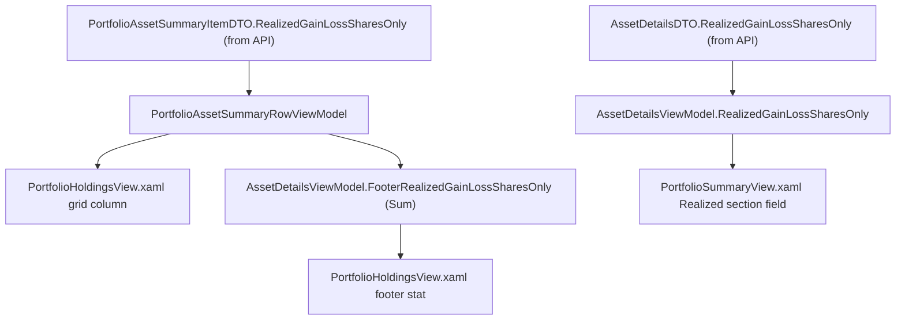

# Spec: F03. Realized (Shares Only) parity in Financial.App (WPF)

## 1. Technical Overview

**What:** Add "Realized (Shares Only)" next to "Realized Gain/Loss" in Financial.App's Historic Portfolio Holdings grid, its footer, and the Asset Summary panel, mirroring F02's Web UI. The value is read directly from `dto.RealizedGainLossSharesOnly` / `details.RealizedGainLossSharesOnly` — the field F01 computes server-side and exposes on `PortfolioAssetSummaryItemDTO` and `AssetDetailsDTO`. No subtraction happens in this codebase; the view model only surfaces what the API sends.

**Why:** Financial.App (WPF) and Financial.Web must stay at feature parity per this repo's UI invariants. F01 already computes and serves the shares-only component; this feature surfaces that field in WPF's view models and views, using the same terminology ("Realized (Shares Only)") as F02.

**Scope:**
- Included: new `RealizedGainLossSharesOnly` property + display string + positive/negative flags on `PortfolioAssetSummaryRowViewModel`; new `RealizedGainLossSharesOnly` property on `AssetDetailsViewModel` for the current asset plus a `FooterRealizedGainLossSharesOnly` aggregate; new grid column in `PortfolioHoldingsView.xaml`'s historic template with a matching footer stat; new field row in `PortfolioSummaryView.xaml`'s Realized section; unit tests mirroring existing `RealizedGainLoss`/`FooterRealizedGainLoss` coverage.
- Excluded (per PRD Section 7 and Out of Scope): any further DTO/domain/API change (F01, already shipped); `Financial.Web` parity (F02, separate feature); net-of-withholding or net-of-fee variants; currency-conversion changes; client-side derivation of the value (explicitly forbidden — the field must be read as-is from the API, per this feature's Consumes relationship to F01); active click-to-sort wiring on the new grid column (the existing "Realized Gain/Loss" column in this WPF grid has no active sort either — `SortMemberPath` is metadata only, not a live sort feature in this view, so no new behavior is introduced here beyond what its sibling already has).
- The PRD has no `Core Scope`/`Full Scope additions` split for F03, so the spec covers the feature's full stated scope.

## 2. Architecture Impact

**Affected components:**
- `Financial.App/ViewModels/Investment/PortfolioAssetSummaryRowViewModel.cs` — modified: new property, display string, positive/negative flags, constructor mapping.
- `Financial.App/ViewModels/Investment/AssetDetailsViewModel.cs` — modified: new backing field + property for the current asset, new footer backing field + property + aggregate computation, reset in both `Clear()` and `ClearAssetContext()`.
- `Financial.App/Views/Investment/PortfolioHoldingsView.xaml` — modified: new `DataGridTemplateColumn` in `PortfolioHoldingsTemplateHistoric` immediately after the existing "Realized Gain/Loss" column; new `PortfolioFooterStat`-style stat in the footer `WrapPanel` immediately after the existing "Realized Gain/Loss:" stat.
- `Financial.App/Views/Investment/PortfolioSummaryView.xaml` — modified: new grid row inserted immediately after the existing "Realized Gain/Loss" / "Portfolio Weight" row (row 8), with `Grid.RowDefinitions` gaining one entry and every row from the old row 9 onward (XIRR row, the "Current" active-scope section, Status, Tax Jurisdiction) renumbered down by one.
- Corresponding test files: `Tests/Financial.Presentation.Tests/ViewModels/PortfolioAssetSummaryRowViewModelTests.cs` and the file covering `AssetDetailsViewModel`'s portfolio-summary loading/footer/reset behavior (`AssetDetailsViewModelPortfolioSummaryTests.cs`, confirmed by prior codebase discovery this session).

No Backend or Database sections apply — F01 already shipped the field; this feature makes zero further backend, API, or persistence changes.

## 3. Technical Decisions

| Decision | Chosen Approach | Alternative Considered | Trade-off |
|----------|----------------|----------------------|-----------|
| Where the displayed value comes from | Set `RealizedGainLossSharesOnly = dto.RealizedGainLossSharesOnly` / `details.RealizedGainLossSharesOnly` directly in the constructor/loader — no client-side arithmetic | Compute `RealizedGainLoss - TotalCredits` in the view model (the approach originally considered and rejected) | Rejected: computing the formula independently in Web and WPF duplicates business logic in two languages with no single source of truth; F01 already serves the correct value |
| Grid column coloring mechanism | Boolean `RealizedGainLossSharesOnlyIsPositive`/`RealizedGainLossSharesOnlyIsNegative` flags driving a `DataTrigger`, matching the existing "Realized Gain/Loss" column's mechanism exactly (`PortfolioHoldingsView.xaml` lines 432-450) | Reuse the `SignedValueToBrushConverter` used elsewhere in this same view's footer | Matches the specific sibling column being extended — the grid uses `DataTrigger`/boolean-flag coloring for its `DataGridTemplateColumn`s, while the footer `WrapPanel` (a different visual context in the same file) uses the converter; each new element follows its own immediate neighbor's existing convention rather than unifying the two mechanisms across the file |
| Footer stat coloring mechanism | `SignedValueToBrushConverter` bound directly to `AssetDetails.FooterRealizedGainLossSharesOnly`, matching the existing "Realized Gain/Loss:" footer stat exactly (`PortfolioHoldingsView.xaml` lines 577-580) | Boolean flags | Matches the specific sibling stat being extended, per the same "follow the immediate neighbor" rule above |
| Asset Summary panel placement | Insert a new `Grid.Row` immediately after row 8 (the existing "Realized Gain/Loss" / "Portfolio Weight" row) in `PortfolioSummaryView.xaml`'s `AssetSummaryTemplate`, add one `RowDefinition`, and renumber every `Grid.Row` from the old 9 through 16 down by one (9→10, ..., 16→17) | Reuse unused grid cells in an existing row | No unused cells exist — row 8 already uses all 4 columns (Realized Gain/Loss label+value, Portfolio Weight label+value) and row 9 already uses all 4 (XIRR, XIRR w/ Credits); the PRD requires the new field to appear "immediately below Realized Gain/Loss" (Section 6 Experience), which this grid's fixed row/column layout can only satisfy by inserting a row. This is the widest-reaching file change in the feature but is mechanical (row-index renumbering only, no logic change) |
| New field's `IsHistoricScope` visibility gate | Bind `Visibility` to `AssetDetails.IsHistoricScope` via `BoolToVisibilityConverter`, identical to every other field in the same Realized block (rows 7-9) | A new gating property | No new gating concept needed — the existing `IsHistoricScope` binding already governs this entire section |

## 4. Component Overview

**WPF:**

| File Path | New/Modified | Purpose | Key Responsibilities |
|-----------|--------------|---------|---------------------|
| `Financial.App/ViewModels/Investment/PortfolioAssetSummaryRowViewModel.cs` | Modified | Portfolio Holdings grid row | Add `RealizedGainLossSharesOnly` property (set from `dto.RealizedGainLossSharesOnly` in the constructor), `DisplayRealizedGainLossSharesOnly` (`"N2"` format), `RealizedGainLossSharesOnlyIsPositive`/`RealizedGainLossSharesOnlyIsNegative` boolean flags — all placed immediately after their `RealizedGainLoss` counterparts |
| `Financial.App/ViewModels/Investment/AssetDetailsViewModel.cs` | Modified | Asset details + portfolio footer | Add `_realizedGainLossSharesOnly` backing field + `RealizedGainLossSharesOnly` property (mapped from `details.RealizedGainLossSharesOnly` in the asset-load method, alongside the existing `RealizedGainLoss = details.RealizedGainLoss` line); add `_footerRealizedGainLossSharesOnly` backing field + `FooterRealizedGainLossSharesOnly` property (computed as `assetItems.Sum(i => i.RealizedGainLossSharesOnly)` alongside the existing `FooterRealizedGainLoss` line in the portfolio-summary load method); reset both new properties to `0m` in `Clear()` (alongside `FooterRealizedGainLoss`) and in `ClearAssetContext()` (alongside `RealizedGainLoss`) |
| `Financial.App/Views/Investment/PortfolioHoldingsView.xaml` | Modified | Historic Portfolio Holdings grid | New `DataGridTemplateColumn` "Realized (Shares Only)" bound to `DisplayRealizedGainLossSharesOnly`/`RealizedGainLossSharesOnlyIsPositive`/`RealizedGainLossSharesOnlyIsNegative`, immediately after the "Realized Gain/Loss" column, inside `PortfolioHoldingsTemplateHistoric`; new footer `StackPanel` stat "Realized (Shares Only):" bound to `AssetDetails.FooterRealizedGainLossSharesOnly`, immediately after the existing "Realized Gain/Loss:" stat |
| `Financial.App/Views/Investment/PortfolioSummaryView.xaml` | Modified | Asset Summary panel | New row (inserted as the new row 9, pushing prior rows 9-16 to 10-17) with "Realized (Shares Only):" label + `AssetDetails.RealizedGainLossSharesOnly` value, both gated on `AssetDetails.IsHistoricScope` like their neighbors; add one `RowDefinition` to `Grid.RowDefinitions`; renumber every `Grid.Row` attribute from 9 through 16 up by one throughout the rest of the template |
| `Tests/Financial.Presentation.Tests/ViewModels/PortfolioAssetSummaryRowViewModelTests.cs` | Modified | Row view-model tests | New tests for the new property/display string/flags, mirroring `DisplayRealizedGainLoss_FormatsN2`, `RealizedGainLossIsPositive_WhenGainPositive_IsTrue`, `RealizedGainLossIsNegative_WhenLossNegative_IsTrue` |
| `Tests/Financial.Presentation.Tests/ViewModels/AssetDetailsViewModelPortfolioSummaryTests.cs` (or the file already covering `LoadAssetDetails`/footer/reset behavior — confirm exact file at implementation time) | Modified | Asset details + footer tests | New tests mirroring `LoadPortfolioSummary_SetsFooterRealizedGainLoss_SumOfRows` and the existing `RealizedGainLoss` load/reset coverage |

## 5. API Contracts

Not applicable — no new API changes in this feature. `PortfolioAssetSummaryItemDTO.RealizedGainLossSharesOnly` and `AssetDetailsDTO.RealizedGainLossSharesOnly` were added by F01 and are already available to `Financial.App` via its existing API client.

## 6. Data Model

Not applicable — no persistence or schema changes. The value is bound directly from the already-fetched DTO field.

## 7. Testing Strategy

**Test File Structure:**

| Test File | Test Type | Target | Coverage Goal |
|-----------|-----------|--------|---------------|
| `Tests/Financial.Presentation.Tests/ViewModels/PortfolioAssetSummaryRowViewModelTests.cs` | Unit (xUnit + FluentAssertions) | `PortfolioAssetSummaryRowViewModel` | New property set from DTO (not derived), display formatting, positive/negative flags |
| `Tests/Financial.Presentation.Tests/ViewModels/AssetDetailsViewModelPortfolioSummaryTests.cs` (confirm exact name) | Unit (xUnit + FluentAssertions) | `AssetDetailsViewModel` | Per-asset value set from DTO, footer aggregate sum, reset behavior on `Clear()`/`ClearAssetContext()` |

**`PortfolioAssetSummaryRowViewModelTests.cs` — new test functions:**

| Test Function | Description | Assertions | Maps to AC |
|---------------|-------------|------------|------------|
| `RealizedGainLossSharesOnly_SetFromDto_NotDerived` | Proves the property is read from the DTO field, not computed from `RealizedGainLoss`/`TotalCredits` — mirrors `BuildRow`'s existing pattern but sets `realizedGainLoss`/`totalCredits` to values inconsistent with `realizedGainLossSharesOnly` | `BuildRow(realizedGainLoss: 10m, totalCredits: 50m, realizedGainLossSharesOnly: 999m).RealizedGainLossSharesOnly.Should().Be(999m)` | AC1 |
| `DisplayRealizedGainLossSharesOnly_FormatsN2` | Mirrors `DisplayRealizedGainLoss_FormatsN2` | `BuildRow(realizedGainLossSharesOnly: 123.456m).DisplayRealizedGainLossSharesOnly.Should().Be("123.46")` | AC1 |
| `RealizedGainLossSharesOnlyIsPositive_WhenGainPositive_IsTrue` | Mirrors `RealizedGainLossIsPositive_WhenGainPositive_IsTrue` | `BuildRow(realizedGainLossSharesOnly: 100m)` → `RealizedGainLossSharesOnlyIsPositive` true, `...IsNegative` false | AC1, AC4 |
| `RealizedGainLossSharesOnlyIsNegative_WhenLossNegative_IsTrue` | Mirrors `RealizedGainLossIsNegative_WhenLossNegative_IsTrue` | `BuildRow(realizedGainLossSharesOnly: -50m)` → `RealizedGainLossSharesOnlyIsNegative` true, `...IsPositive` false | AC1, AC4 |

**`AssetDetailsViewModelPortfolioSummaryTests.cs` (or equivalent) — new test functions:**

| Test Function | Description | Assertions | Maps to AC |
|---------------|-------------|------------|------------|
| `LoadAssetDetails_SetsRealizedGainLossSharesOnly_FromDto` | Mirrors the existing `RealizedGainLoss` load assertion | Loading an `AssetDetailsDTO` with `RealizedGainLossSharesOnly: 25m` sets `viewModel.RealizedGainLossSharesOnly` to `25m` | AC2 |
| `LoadPortfolioSummary_SetsFooterRealizedGainLossSharesOnly_SumOfRows` | Mirrors `LoadPortfolioSummary_SetsFooterRealizedGainLoss_SumOfRows` | Multiple asset items with distinct `RealizedGainLossSharesOnly` values sum correctly into `FooterRealizedGainLossSharesOnly` | AC3 |
| `Clear_ResetsFooterRealizedGainLossSharesOnly_ToZero` | Mirrors the existing footer reset coverage | After `Clear()`, `FooterRealizedGainLossSharesOnly` is `0m` | AC3 |
| `ClearAssetContext_ResetsRealizedGainLossSharesOnly_ToZero` (name adapted to whichever existing test already covers `RealizedGainLoss`'s reset via `ClearAssetContext`) | Mirrors the existing per-asset reset coverage | After the reset path that zeroes `RealizedGainLoss`, `RealizedGainLossSharesOnly` is also `0m` | AC2, AC3 |

**Cross-Feature Integration tests:**

| Test Function | Description | Assertions | Cross-Feature Criterion |
|---------------|-------------|------------|--------------------------|
| `RealizedGainLossSharesOnly_SetFromDto_NotDerived` (above) | Proves the WPF view model consumes the API-provided field verbatim | Already listed above | "`RealizedGainLossSharesOnly` computed by F01 flows unchanged into Financial.App's Portfolio Holdings-equivalent grid and asset-details view (F03) with no client-side re-derivation" |
| `LoadAssetDetails_SetsRealizedGainLossSharesOnly_FromDto` (above) | Same proof for `AssetDetailsViewModel` | Already listed above | Same criterion |

The third cross-feature criterion — "For the same asset and the same underlying data, F02 (Web) and F03 (WPF) display numerically identical 'Realized (Shares Only)' values" — is a structural consequence of both F02 and F03 reading the same F01-computed field with no re-derivation in either codebase; it is not independently testable within a single-platform test suite and is satisfied by construction once both F02's and F03's "not derived" tests pass.

**No UI automation test** is warranted for the WPF views themselves — per this repo's testing conventions (`testing-guide-Financial` skill), XAML view/code-behind is verified via view-model contract tests plus manual verification, not automated UI tests.

## Assumptions / Decisions

1. **Exact `AssetDetailsViewModel` test file name.** Assumed `AssetDetailsViewModelPortfolioSummaryTests.cs` based on this session's prior codebase discovery (`LoadPortfolioSummary_SetsFooterRealizedGainLoss_SumOfRows` at ~line 405); confirm the exact file at implementation time and add new tests there following its existing naming convention.
2. **Grid row insertion is the correct approach for `PortfolioSummaryView.xaml`**, not a workaround — the grid's fixed 4-column, N-row layout has no spare cell in the Realized block, so satisfying the PRD's "immediately below Realized Gain/Loss" placement requires inserting a row. This is mechanical renumbering, not new logic, and is scoped tightly to this one XAML file.
3. **No active sort wiring on the new WPF grid column**, matching its "Realized Gain/Loss" sibling, which also has no live sort behavior in this view despite carrying a `SortMemberPath` — this preserves symmetry between the two columns rather than introducing sort behavior asymmetrically.
