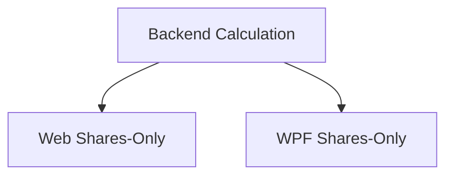

# Realized Gain/Loss — Shares Only

## 1. Executive Summary

Financial's Investment views (Portfolio Holdings and Asset Summary, in Historic scope) show a single "Realized Gain/Loss" figure that blends two economically different things: capital gains/losses from selling shares, and credit-type distributions such as dividends, interest on equity (JCP), coupons, and securities-lending income. For the single user of this tool, who holds Brazilian FIIs (real estate investment funds) where dividend credits are tax-exempt while share capital gains are taxable, this blended number cannot be used directly for tax analysis — it has to be manually decomposed every time.

This feature adds a second, narrower figure — "Realized (Shares Only)" — next to the existing "Realized Gain/Loss" everywhere it already appears: the Historic Investments Portfolio Holdings grid (as a new column with its own footer total) and the Historic Investments Asset Summary panel. The new figure is the capital-gain/loss component alone, with all credits excluded; the existing "Realized Gain/Loss" total is left completely unchanged.

The value is computed exactly once, in the Investment domain (`Financial.Investment.Domain.Entities.Asset`), as a sibling of the existing `RealizedGainLoss` property, and exposed as a new field on the two DTOs that already carry `RealizedGainLoss` (`PortfolioAssetSummaryItemDTO`, `AssetDetailsDTO`). Both front ends — Financial.Web and Financial.App (WPF) — read that same server-computed field rather than re-deriving it independently, so the formula lives in exactly one place and both clients are guaranteed to agree by construction, not by parallel maintenance.

## 2. Problem and Opportunity

**The Problem**
- **Blended tax-relevant figures**: "Realized Gain/Loss" mixes taxable share capital gains/losses with tax-exempt credit distributions (e.g., FII dividends in Brazil), so the number cannot be used as-is for tax reporting or planning.
- **Manual decomposition today**: The user must currently subtract credits from the total by hand (or eyeball the difference against the separate "Credits"/"Total Credits" figure) every time they need the shares-only component, for every asset and for the whole historic portfolio footer.
- **Inconsistent availability across front ends**: If added to only one client, the user would get accurate tax-relevant figures in one app (Web) but not the other (WPF), breaking the existing React/WPF parity the project maintains for every workflow.
- **Duplicated business logic risk**: If each front end computed "shares-only" independently, the same subtraction formula would exist in TypeScript and C# separately, with no single source of truth — a future change to how credits or disposals are counted (e.g., a new credit type, a withholding adjustment) would have to be found and updated in three places instead of one, and the two clients could silently drift apart.

**The Opportunity**
- Compute the shares-only component once, server-side, as a new `Asset` domain property alongside the existing `RealizedGainLoss`, and expose it on the same DTOs that already serve `RealizedGainLoss` — directly solves the blended-figure and manual-decomposition problems.
- Both front ends consume the same computed field from the API rather than reimplementing the formula, eliminating duplicated business logic and guaranteeing Web/WPF parity by construction.

## 3. Target Audience

### Primary Users

**Self-directed investor tracking Brazil + UK holdings**
- Uses Financial as a single-user, self-hosted tool to consolidate Brazilian and UK investment transactions, including Brazilian FIIs whose dividend credits are tax-exempt.
- Periodically reviews Historic Investments to understand realized performance and prepare tax-relevant figures for closed positions.
- Works from whichever front end is open at the time — Financial.Web (browser) or Financial.App (WPF desktop) — and expects the same figures and terminology in both.

## 4. Objectives

**Product Objectives**
- **Separate** taxable share capital gains/losses from tax-exempt credit distributions in every place "Realized Gain/Loss" is shown.
- **Preserve** the existing "Realized Gain/Loss" total exactly as-is, with zero behavior change to its value, sorting, or footer sum.
- **Centralize** the shares-only formula in one server-side computation, consumed identically by Financial.Web and Financial.App, so no client re-derives it.

**Success Metrics**
- 100% of surfaces currently showing "Realized Gain/Loss" (Portfolio Holdings grid + footer, Asset Summary panel) also show "Realized (Shares Only)", verified by the acceptance criteria below.
- 0 changes to existing "Realized Gain/Loss" test assertions (value, sort order, footer sum) across backend, Web, and WPF test suites after this feature ships.
- For any historic asset with non-zero credits, `RealizedGainLossSharesOnly` equals `RealizedGainLoss - Credits.Sum(c => c.Value)`, verified by a domain unit test — the single authoritative formula both front ends display without re-deriving it.
- 0 lines of formula-reimplementation code in Financial.Web or Financial.App — both read the field, neither subtracts.

## 5. User Stories

### F01. Realized (Shares Only) domain calculation and API exposure
- As the system, I want to compute the realized gain/loss attributable to share transactions alone (excluding all credits) as part of `Asset`'s existing realized-gain-loss computation, so that both front ends can display a tax-relevant, credit-free figure without recomputing it themselves
- As the system, I want to expose this value on `PortfolioAssetSummaryItemDTO` and `AssetDetailsDTO` alongside the existing `RealizedGainLoss` field, so that the Portfolio Holdings summary and the single-asset details endpoints serve it without a separate API call
- As a developer, I want the OpenAPI contract snapshot and the generated Web API types to reflect the new field, so that `tsc -b` catches any frontend code that doesn't yet handle it

### F02. Realized (Shares Only) in Financial.Web
- As a user, I want to see a "Realized (Shares Only)" column next to "Realized Gain/Loss" in the Historic Investments Portfolio Holdings grid so that I can read the taxable share capital gain/loss for each asset without doing the subtraction myself
- As a user, I want the Portfolio Holdings footer to show the sum of "Realized (Shares Only)" across all listed assets so that I have a portfolio-level taxable-gain figure
- As a user, I want to sort the Portfolio Holdings grid by "Realized (Shares Only)" so that I can rank assets by taxable capital gain/loss independent of dividend size
- As a user, I want to see "Realized (Shares Only)" in the Historic Investments Asset Summary panel, next to the existing "Realized Gain/Loss" field, so that I get the same decomposition when reviewing a single asset in detail
- As a user, I want the new "Realized (Shares Only)" value to use the same positive/negative coloring convention as "Realized Gain/Loss" so that I can read gains vs. losses at a glance

### F03. Realized (Shares Only) parity in Financial.App (WPF)
- As a user, I want to see "Realized (Shares Only)" next to "Realized Gain/Loss" in the WPF Portfolio Holdings-equivalent grid so that I get the same taxable-gain figure whichever app I have open
- As a user, I want the WPF portfolio footer/summary to show the aggregate "Realized (Shares Only)" the same way the footer already aggregates "Realized Gain/Loss" so that totals match Financial.Web
- As a user, I want to see "Realized (Shares Only)" in the WPF asset-details view next to the existing "Realized Gain/Loss" field so that single-asset review is consistent with Financial.Web

## 6. Functionalities

### F01. Realized (Shares Only) domain calculation and API exposure

**Provides:**
- Per-asset shares-only realized gain/loss amount, computed server-side (used by F02, F03)
- Portfolio-level shares-only realized gain/loss, available via the same summary list both front ends already fetch (used by F02, F03)

**Capabilities:**
- New `Asset.RealizedGainLossSharesOnly` domain property, computed as the sum of `GainLoss` across the asset's active (non-superseded) `DisposalRecords` — the same disposal-record sum `RealizedGainLoss` already includes, minus all `Credit.Value` — with zero change to the existing `RealizedGainLoss` property's formula or value.
- New field on `PortfolioAssetSummaryItemDTO` and `AssetDetailsDTO`, named `RealizedGainLossSharesOnly`, populated from the new domain property by `PortfolioAssetSummaryBuilder` and `NavigationService` respectively, alongside their existing `RealizedGainLoss` mapping.
- No new endpoint: the field rides on the existing Portfolio Holdings summary and Asset Details responses.
- OpenAPI contract snapshot (`Tests/Financial.Api.Tests/Contract/openapi-v1.snapshot.json`) regenerated to include the new field; `Financial.Web/src/api/generated/openapi.ts` regenerated to match.

**Experience:**
- Not user-facing on its own — this feature is the shared calculation and API surface F02 and F03 both display. No UI change ships from F01 alone.

### F02. Realized (Shares Only) in Financial.Web

**Consumes:**
- F01: per-asset `realizedGainLoss` and `realizedGainLossSharesOnly` fields on the Portfolio Holdings summary item and the Asset Details response

**Capabilities:**
- New value read directly from `PortfolioAssetSummaryItemDto.realizedGainLossSharesOnly` (Portfolio Holdings grid) and `AssetDetailsDto.realizedGainLossSharesOnly` (Asset Summary panel) — no client-side subtraction, no re-derivation of the formula.
- Label: "Realized (Shares Only)", used verbatim as the grid column header, the `data-label` on the footer cell, and the Asset Summary field label.
- Displayed with the same numeric formatting (`formatN2`) and the same sign-based CSS coloring (`getProfitClass`/`signClass`) already used for "Realized Gain/Loss".
- Visible only where "Realized Gain/Loss" is currently visible: Portfolio Holdings grid and footer only render the Realized column set in Historic scope (unchanged existing condition — the new column follows the same condition), and the Asset Summary "Realized" section only renders for a fully-closed (zero-quantity) historic asset (unchanged existing condition).
- New sortable grid column "Realized (Shares Only)" positioned immediately after the existing "Realized Gain/Loss" column, using the same `SortableColumnHeader` pattern and numeric sort semantics (ascending/descending toggle) as the existing column.
- Footer sum: `Σ(realizedGainLossSharesOnly)` across all currently-listed historic assets, rendered as a read-only input matching the existing footer cell pattern, with `data-label="Realized (Shares Only)"`.

**Experience:**
- Portfolio Holdings grid: a new column header "Realized (Shares Only)" appears to the right of "Realized Gain/Loss", numeric-aligned, clickable to sort (single-column sort, replacing any prior sort — consistent with existing grid sort behavior). Each row shows the per-asset value in green (positive), red (negative), or neutral (zero) using the same color classes as "Realized Gain/Loss". The footer row gains a matching total cell.
- Asset Summary panel: within the existing "Realized" section (which already shows the section title "Realized" and the "Realized Gain/Loss" field for closed historic assets), a new field "Realized (Shares Only)" appears immediately below "Realized Gain/Loss", styled identically (same label/value classes, same sign-based coloring).
- No new empty/loading/error states are introduced: the new column/field renders wherever its sibling "Realized Gain/Loss" renders, using data already loaded for that view, and is absent under the exact same conditions "Realized Gain/Loss" is absent (active scope, or a still-open position in Asset Summary).

### F03. Realized (Shares Only) parity in Financial.App (WPF)

**Consumes:**
- F01: per-asset `RealizedGainLoss` and `RealizedGainLossSharesOnly` fields on the Portfolio Holdings summary item and the Asset Details response

**Capabilities:**
- `PortfolioAssetSummaryRowViewModel` and `AssetDetailsViewModel` each expose a new `RealizedGainLossSharesOnly` property set directly from `dto.RealizedGainLossSharesOnly`/`details.RealizedGainLossSharesOnly` — no client-side subtraction, no re-derivation of the formula.
- `AssetDetailsViewModel` exposes a `FooterRealizedGainLossSharesOnly` aggregate computed the same way `FooterRealizedGainLoss` is (`assetItems.Sum(i => i.RealizedGainLossSharesOnly)`).
- Label: "Realized (Shares Only)", matching the Web label exactly (per the UI parity invariant — equivalent terminology across front ends).
- Displayed with the same numeric string format (`"N2"`) and the same positive/negative visual convention already used for `RealizedGainLoss` on each surface (grid: boolean `IsPositive`/`IsNegative` flags driving a `DataTrigger`; Asset Summary panel and grid footer: the existing signed-value-to-brush converter).
- Visible only where `RealizedGainLoss`/`FooterRealizedGainLoss` are currently visible in the WPF views bound to `PortfolioAssetSummaryRowViewModel` and `AssetDetailsViewModel` — no new visibility conditions introduced.

**Experience:**
- Wherever the WPF grid/view currently shows a "Realized Gain/Loss" column or field bound to `PortfolioAssetSummaryRowViewModel.DisplayRealizedGainLoss` / `AssetDetailsViewModel.RealizedGainLoss`, a sibling "Realized (Shares Only)" column/field appears immediately after it, bound to the new `DisplayRealizedGainLossSharesOnly` property, right-aligned (per this repo's numeric/currency grid convention) and using the same positive/negative coloring as its neighbor.
- The WPF footer/summary area that shows `FooterRealizedGainLoss` gains a matching `FooterRealizedGainLossSharesOnly` cell, reset to `0m` wherever `FooterRealizedGainLoss` is reset (e.g., on data reload/clear), consistent with existing reset logic.
- No new empty/loading/error states: the new column/field follows the exact visibility and reset lifecycle of its existing sibling property.

## 7. Out of Scope

- **Net-of-withholding or net-of-fee variants**: the new metric uses the same gross `Credit.Value` basis as the existing total; no separate "net of withholding tax" realized figure is introduced.
- **Currency conversion or multi-currency aggregation changes**: the new metric inherits whatever currency/date logic already applies to `RealizedGainLoss` and `Credits` — no new conversion logic is added.
- **New export, report, or tax-form generation**: this feature only adds a displayed figure; it does not feed a tax report, CSV export, or the P51 tax-reporting feature (a future feature could consume it, but that integration is not part of this PRD).
- **Historic Investments-only restriction**: not applicable — the metric follows "Realized Gain/Loss" wherever it already appears (both historic-scope Portfolio Holdings and Asset Summary), not a Historic-Investments-page-specific addition.
- **Changing the existing "Realized Gain/Loss" total's value, formula, sort key, or footer computation**: explicitly unchanged in Domain, Application, Web, and WPF.
- **New API endpoint**: the new field is added to the two existing DTOs already served by the existing Portfolio Holdings summary and Asset Details endpoints; no new route is introduced.

## 8. Dependency Graph

| # | Feature | Priority | Dependencies |
|---|---------|----------|--------------|
| F01 | Realized (Shares Only) domain calculation and API exposure | 1 | None |
| F02 | Realized (Shares Only) in Financial.Web | 1 | F01 |
| F03 | Realized (Shares Only) parity in Financial.App (WPF) | 1 | F01 |

### Execution Waves
Features within the same wave can be built in parallel. A wave starts only after every feature in earlier waves is complete.

- **Wave 1**: F01
- **Wave 2**: F02, F03

### Priority levels
- **1** = Essential — product does not work without it
- **2** = Important — significant value addition
- **3** = Desirable — incremental improvement

## 9. Acceptance Criteria

### F01. Realized (Shares Only) domain calculation and API exposure
- [x] `Asset.RealizedGainLossSharesOnly` equals the sum of `GainLoss` across active `DisposalRecords`, with `Credits` entirely excluded
- [x] For an asset with non-zero credits, `Asset.RealizedGainLoss - Asset.RealizedGainLossSharesOnly` equals the sum of that asset's `Credit.Value`
- [x] `Asset.RealizedGainLoss`'s existing value and formula are unchanged
- [x] `PortfolioAssetSummaryItemDTO.RealizedGainLossSharesOnly` is populated by `PortfolioAssetSummaryBuilder` and matches the corresponding `Asset.RealizedGainLossSharesOnly`
- [x] `AssetDetailsDTO.RealizedGainLossSharesOnly` is populated by `NavigationService` and matches the corresponding `Asset.RealizedGainLossSharesOnly`
- [x] The OpenAPI contract snapshot includes `realizedGainLossSharesOnly` on both affected schemas, and `OpenApiContractTests` passes against the regenerated snapshot
- [x] `Financial.Web/src/api/generated/openapi.ts` is regenerated and includes the new field; `npm run build` (tsc -b) succeeds

### F02. Realized (Shares Only) in Financial.Web
- [ ] Portfolio Holdings grid (Historic scope) shows a "Realized (Shares Only)" column immediately after "Realized Gain/Loss"
- [ ] Each row's "Realized (Shares Only)" value equals `realizedGainLossSharesOnly` as served by the API for that asset
- [ ] The "Realized (Shares Only)" column is sortable (ascending/descending) independently of the "Realized Gain/Loss" column
- [ ] The Portfolio Holdings footer shows a "Realized (Shares Only)" total equal to the sum of `realizedGainLossSharesOnly` across all listed historic assets
- [ ] Positive "Realized (Shares Only)" values render in the same "positive" color class as positive "Realized Gain/Loss" values; negative values render in the same "negative" color class
- [ ] The "Realized (Shares Only)" column/footer cell does not render in Active scope, matching the existing "Realized Gain/Loss" column's visibility
- [ ] Asset Summary panel (historic, closed position) shows a "Realized (Shares Only)" field directly below "Realized Gain/Loss" within the existing "Realized" section, equal to `asset.realizedGainLossSharesOnly`
- [ ] Asset Summary panel does not show "Realized (Shares Only)" when the "Realized" section itself is hidden (open/active position)
- [ ] Existing "Realized Gain/Loss" value, sort behavior, and footer sum are unchanged by this feature (no regression in existing tests)

### F03. Realized (Shares Only) parity in Financial.App (WPF)
- [ ] `PortfolioAssetSummaryRowViewModel` exposes a `RealizedGainLossSharesOnly` value set from `dto.RealizedGainLossSharesOnly` and a formatted `DisplayRealizedGainLossSharesOnly` string
- [ ] `AssetDetailsViewModel` exposes a `RealizedGainLossSharesOnly` value set from `details.RealizedGainLossSharesOnly` for the current asset
- [ ] `AssetDetailsViewModel` exposes a `FooterRealizedGainLossSharesOnly` aggregate equal to `assetItems.Sum(i => i.RealizedGainLossSharesOnly)`, reset to `0m` alongside `FooterRealizedGainLoss` on data reload/clear
- [ ] The WPF grid/view bound to `PortfolioAssetSummaryRowViewModel` shows "Realized (Shares Only)" immediately after "Realized Gain/Loss", right-aligned, with matching positive/negative coloring
- [ ] The WPF asset-details view shows "Realized (Shares Only)" next to the existing "Realized Gain/Loss" field
- [ ] The WPF footer/summary area shows the "Realized (Shares Only)" aggregate next to the existing "Realized Gain/Loss" footer value
- [ ] For the same underlying data, WPF's "Realized (Shares Only)" values (row, asset-details, and footer) numerically match Financial.Web's corresponding values
- [ ] Existing `RealizedGainLoss`/`FooterRealizedGainLoss` values and behavior are unchanged by this feature (no regression in existing WPF tests)

### Cross-Feature Integration
- [ ] `realizedGainLossSharesOnly` computed by F01 flows unchanged into Financial.Web's Portfolio Holdings grid and Asset Summary panel (F02) with no client-side re-derivation
- [ ] `RealizedGainLossSharesOnly` computed by F01 flows unchanged into Financial.App's Portfolio Holdings-equivalent grid and asset-details view (F03) with no client-side re-derivation
- [ ] For the same asset and the same underlying data, F02 (Web) and F03 (WPF) display numerically identical "Realized (Shares Only)" values, since both read the same F01-computed field rather than each deriving it independently
