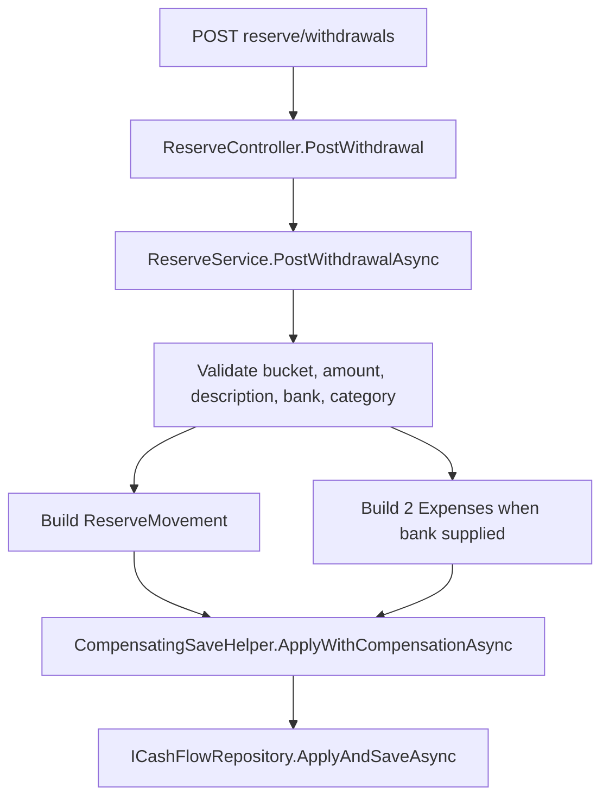

# Spec: F01. Bank-Routed Withdrawal API

Complexity: simple (one service method, one DTO, no persistence-shape change, no new endpoint).

## 1. Technical Overview

**What:** Extend `POST /api/v1/financial/reserve/withdrawals` so `WithdrawalRequestDTO` may carry an optional bank and an optional expense category. With neither, behavior is unchanged. With both, `ReserveService.PostWithdrawalAsync` creates, in one compensating-save unit, the reserve movement plus two `Expense` records on the chosen bank: a `-Amount` expense in the `Reserva` category and a `+Amount` expense in the chosen category, both with the withdrawal's date and description.

**Why:** The orchestration (validation, 3-record build, atomic save) belongs in the CashFlow Application layer so React (F02) and WPF (F03) share one authoritative implementation and cannot drift.

**Scope:**
- Included: DTO extension, validation, 3-record creation, compensating rollback, telemetry/logging conformance, OpenAPI snapshot + generated Web types regeneration, controller XML doc update, tests.
- Excluded: any UI (F02/F03), persisted link between the records, bank-balance checks, credit-card routing, data migration, new endpoint.
- No Core/Full Scope split in the PRD; the spec covers the full feature.

## 2. Architecture Impact

**Affected components:**
- `Financial.CashFlow.Application/DTOs/WithdrawalRequestDTO.cs` — modified: two optional fields.
- `Financial.CashFlow.Application/Services/ReserveService.cs` — modified: validation + bank-side expense creation inside `PostWithdrawalAsync`.
- `Financial.CashFlow.Domain/Entities/Category.cs` — modified: `public const string ReservaName = "Reserva"` (rule lives on the owning entity, per `docs/rules/implementation.md` §Domain rules).
- `Financial.Api/Controllers/ReserveController.cs` — modified: XML doc for `PostWithdrawal` (Swagger-visible) mentions the new fields.
- `Tests/Financial.Api.Tests/Contract/openapi-v1.snapshot.json` — regenerated.
- `Financial.Web/src/api/generated/openapi.ts` — regenerated (`npm run generate-api-types`); `types.ts` alias needs no change.
- `Tests/Financial.CashFlow.Application.Tests/Services/ReserveServiceTests.cs` — modified.
- `Tests/Financial.Api.Tests/ReserveEndpointsTests.cs` — modified.

No new route, no repository interface change (`AddExpense`, `DeleteExpense`, `GetBanks`, `GetCategories`, `ApplyAndSaveAsync` already exist), no persistence-shape change.



## 3. Technical Decisions

| Decision | Chosen Approach | Alternative Considered | Trade-off |
|----------|----------------|----------------------|-----------|
| Where orchestration lives | Inside `ReserveService.PostWithdrawalAsync` using `_repository` directly | Call `IExpenseService.AddExpenseAsync` twice | Calling the service would save three times (not atomic) and nest spans; direct repository use is the pattern `IncomeService` already follows when it adds an income plus reserve movements in one save |
| Atomicity | `CompensatingSaveHelper.ApplyWithCompensationAsync` with apply = add movement + expenses, compensate = delete movement + both expenses | Plain `ApplyAndSaveAsync` | Matches the existing withdrawal/income pattern; rollback covers a save that fails after in-memory apply |
| Finding the `Reserva` category | Case-insensitive name match against `GetCategories()` using `Category.ReservaName`; skip the active check for it; missing category throws `ArgumentException` "Category 'Reserva' is not configured." | Add a flag to `Category` | No schema change; the seed data and existing tests already treat `Reserva` by name. It may legitimately be inactive (monthly views hide it), so activeness must not block the withdrawal |
| Chosen-category rules | Must exist, be `Active`, not `IsInvestment`, and not be the `Reserva` category (by id) | Only existence | Enforces PRD rule; mirrors `ExpenseService.ValidateFields` messages for unknown/inactive |
| Bank validation | Existence only, via `EntityIdResolver` | Require "active" | **Deviation from PRD:** `Bank` has no active/inactive concept in the domain, so the PRD's "active bank" rule cannot be implemented without a new field; existence is the enforceable rule. PRD F01 text is updated to match |
| Field pairing | Bank without category, or category without bank, throws `ArgumentException` (mapped to 400) | Ignore a lone category | Prevents silently dropping user input |
| Description length | `DescriptionValidator.EnsureWithinLimit` on the description when a bank is supplied | Validate always | Expense enforces the 200-char limit; the reserve movement path is unchanged for direct withdrawals |
| No comments on new code | None | XML docs on DTO members | Project no-comments policy; the DTO's existing doc comments stay, new members get a `<summary>` only because Swagger reads DTO docs (tooling exception) |

## 4. Component Overview

**Backend:**

| File Path | New/Modified | Purpose | Key Responsibilities |
|-----------|--------------|---------|---------------------|
| `Financial.CashFlow.Application/DTOs/WithdrawalRequestDTO.cs` | Modified | Request contract | Add optional `PaymentSourceBankId` (Guid?) and `ExpenseCategoryId` (Guid?) |
| `Financial.CashFlow.Application/Services/ReserveService.cs` | Modified | Use case | Validate bank/category pairing; resolve bank, chosen category, `Reserva` category; build the 2 expenses; include them in the compensating save. Keep the standard span/log/failure shape; extract validation/creation into small private methods |
| `Financial.CashFlow.Domain/Entities/Category.cs` | Modified | Domain entity | Add `ReservaName` constant |
| `Financial.Api/Controllers/ReserveController.cs` | Modified | Endpoint | Update XML docs so the OpenAPI text describes the new optional fields |

**Contract artifacts:**

| File | Operation | Notes |
|------|-----------|-------|
| `Tests/Financial.Api.Tests/Contract/openapi-v1.snapshot.json` | Regenerate | `UPDATE_OPENAPI_SNAPSHOT=1 dotnet test Tests/Financial.Api.Tests`, review diff (only the two new optional properties expected) |
| `Financial.Web/src/api/generated/openapi.ts` | Regenerate | `cd Financial.Web && npm run generate-api-types`, commit |

## 5. API Contracts

**Endpoint: Post Withdrawal**
- **Method:** POST
- **Path:** `/api/v1/financial/reserve/withdrawals` (existing)
- **Authentication:** as today (none beyond deployment config)

**Request:**

| Field | Type | Required | Validation | Description |
|-------|------|----------|------------|-------------|
| `bucketId` | `uuid` | Yes | known bucket | Existing |
| `amount` | `decimal` | Yes | > 0 | Existing |
| `date` | `date` | Yes | - | Existing |
| `description` | `string` | Yes | non-blank; ≤ 200 chars when a bank is supplied | Existing |
| `confirmed` | `bool` | No | - | Existing overdraft override |
| `paymentSourceBankId` | `uuid?` | No | known bank; requires `expenseCategoryId` | New. Present = withdrawal passes through this bank |
| `expenseCategoryId` | `uuid?` | Conditional | required with `paymentSourceBankId`; active, non-investment, not `Reserva` | New |

**Request Example (via bank):**
```json
{
  "bucketId": "3f1c1a52-6b0e-4d0e-9c3b-0d3d4a4b9a11",
  "amount": 250.00,
  "date": "2026-09-29",
  "description": "Car service",
  "confirmed": false,
  "paymentSourceBankId": "8a7b8d21-1c55-4a55-a0e0-5d9b0e6a1f02",
  "expenseCategoryId": "c2e4f7a0-3b1d-4e59-8f66-9a0b1c2d3e44"
}
```

**Response (Success - 200):** unchanged `ReserveMovementDTO` (`id`, `bucketId`, `bucketName`, `amount` (negative), `date`, `description`, `incomeId`).

**Side effects on success with a bank:** two `Expense` records on that bank — `{category: Reserva, value: -amount}` and `{category: expenseCategoryId, value: +amount}` — both `date`/`description` from the request, no credit card, default tithe flag, no round-up.

**Error Codes:**

| Trigger | HTTP Status | Description |
|---------|-------------|-------------|
| Blank description, amount ≤ 0, unknown bucket, description > 200 (bank path) | 400 | Existing/expense rules |
| Unknown `paymentSourceBankId` | 400 | "Payment source '...' is not recognized." |
| Bank without category / category without bank | 400 | Pairing rule |
| Unknown / inactive / investment / `Reserva` category | 400 | Same wording as `ExpenseService` for unknown/inactive |
| `Reserva` category not configured | 400 | "Category 'Reserva' is not configured." |
| Bucket overdraft without `confirmed` | 409 | Existing |

## 6. Data Model

No schema change. `data-cashflow.json` gains ordinary `Expense` records through the existing persistence path; the file is loaded at startup, so no migration or restart concern beyond normal operation. No link field is added (per PRD).

## 7. Testing Strategy

**Assumptions recorded (spec-writer decisions applied without a PRD answer):**
- Bank "active" rule dropped (no such concept on `Bank`); existence only.
- `Reserva` category resolved by name and exempt from the active check.
- Description-length rule applies on the bank path.

| Test File | Test Type | Target | Coverage Goal |
|-----------|-----------|--------|---------------|
| `Tests/Financial.CashFlow.Application.Tests/Services/ReserveServiceTests.cs` | Unit | `ReserveService.PostWithdrawalAsync` | all new branches |
| `Tests/Financial.Api.Tests/ReserveEndpointsTests.cs` | Integration (AC-tracing) | withdrawal endpoint end to end | contract + status mapping |
| `Tests/Financial.Api.Tests/Contract/OpenApiContractTests.cs` | Contract | snapshot | regenerated snapshot passes |
| `Financial.Web/src/api/generated/__tests__/openapiFreshness.test.ts` | Contract | generated types | passes after regeneration |

**ReserveServiceTests additions** (use `StubCashFlowRepository`, `RecordingTelemetryTracer`, `RecordingLogger<T>`; the stub seeds a `Reserva` category):

| Test Function | Description | Assertions |
|---------------|-------------|------------|
| `PostWithdrawalAsync_WithoutBank_CreatesNoExpenses` | Direct path | 1 movement, `Expenses` empty |
| `PostWithdrawalAsync_WithBankAndCategory_CreatesMovementAndTwoExpenses` | Happy path | 1 movement + 2 expenses; on the bank; values `-amount` (Reserva) and `+amount` (chosen); date/description copied; no credit card |
| `PostWithdrawalAsync_BankWithoutCategory_Throws` | Pairing | `ArgumentException`; nothing saved |
| `PostWithdrawalAsync_CategoryWithoutBank_Throws` | Pairing | `ArgumentException`; nothing saved |
| `PostWithdrawalAsync_UnknownBank_Throws` | Bank validation | `ArgumentException`; nothing saved |
| `PostWithdrawalAsync_UnknownInactiveInvestmentOrReservaCategory_Throws` | Theory over 4 cases | `ArgumentException`; nothing saved |
| `PostWithdrawalAsync_ReservaCategoryInactive_StillSucceeds` | Reserva exempt from active check | 3 records created |
| `PostWithdrawalAsync_ReservaCategoryMissing_Throws` | Not configured | `ArgumentException`, message contains "not configured" |
| `PostWithdrawalAsync_BankPathOverdraftUnconfirmed_ThrowsAndSavesNothing` | Overdraft | `OverdraftConfirmationRequiredException`; 0 movements/expenses; with `Confirmed` → 3 records |
| `PostWithdrawalAsync_BankPathSaveFails_RollsBackMovementAndBothExpenses` | Atomicity | 0 of 3 remain (mirror existing `..._WhenSaveFails_RollsBackTheMovement`) |
| `PostWithdrawalAsync_BankPathFailure_LogsNoValuesOrMessages` | Observability | `RecordingLogger` has no amount/description/exception message; span marked failed |
| `PostWithdrawalAsync_BankPathDescriptionTooLong_Throws` | Length | `ArgumentException` |

**ReserveEndpointsTests additions** (derive from `ApiEndpointTests`):

| Test Function | Description | Assertions |
|---------------|-------------|------------|
| `PostWithdrawal_WithBankAndCategory_Returns200AndCreatesExpenses` | AC: 3 records | 200; GET expenses shows both; GET reserve history shows movement |
| `PostWithdrawal_WithoutBank_BehavesAsBefore` | AC: direct unchanged | 200; no new expenses |
| `PostWithdrawal_BankWithoutCategory_Returns400` | AC | 400 |
| `PostWithdrawal_InvalidCategory_Returns400` | AC | 400 |
| `PostWithdrawal_OverdraftUnconfirmedWithBank_Returns409` | AC | 409; nothing created |

**Integration criteria from PRD Cross-Feature section referencing F01:** the ids accepted from F02/F03 are exercised by the endpoint tests above; the UI-side criteria are verified in F02/F03.

**Existing tests:** all current `PostWithdrawal*` tests stay unchanged and must pass (PRD objective: direct path untouched).
