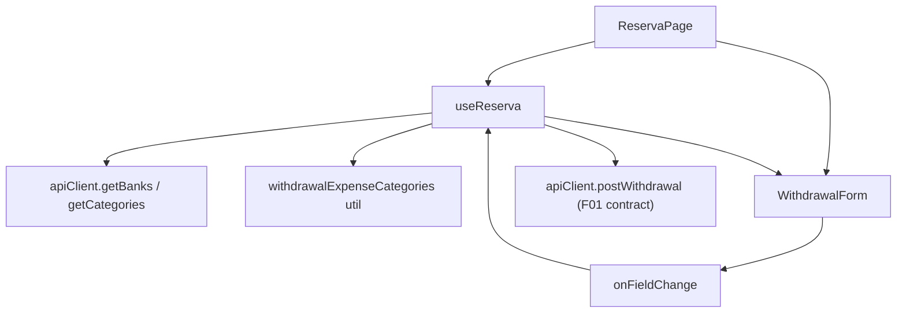

# Spec: F02. Web Withdrawal Form (React)

Complexity: simple (one form component, one hook, one small utility, no backend change).

## 1. Technical Overview

**What:** Extend the React "New Withdrawal" inline form so the user can optionally route the withdrawal through a bank. The form gains a "Through bank" select and, once a bank is chosen, a required "Expense category" select preselected to the category named after the selected bucket. On submit the two ids ride on the F01 request (`paymentSourceBankId`, `expenseCategoryId`); with no bank both are sent as `null` and behavior is exactly as today.

**Why:** React is the UX source of truth (`docs/rules/ui.md`); F03 (WPF) copies the workflow defined here. F01 already made the API accept and validate both fields, so this feature is the presentation and client-side validation layer only.

**Scope:**
- Included: form fields, conditional visibility, category default and eligibility rules, client validation, request payload, state reset on cancel/success, disabled-while-saving behavior, tests.
- Excluded: any backend change, WPF (F03), remembering the last bank or category across opens, editing an existing reserve movement (`EditMovementForm` is untouched), viewing the created bank expenses (they show up in the existing CashFlow bank/monthly views).
- No Core/Full Scope split in the PRD; the spec covers the full feature.

**Consumes (F01):** the extended `WithdrawalRequestDto` (`paymentSourceBankId`, `expenseCategoryId`, both `string | null`) and the unchanged `ReserveMovementDto` response.

## 2. Architecture Impact

**Affected components:**
- `Financial.Web/src/hooks/useReserva.ts` — modified: load banks and categories, two new form-state fields, derived effective category, validation, payload.
- `Financial.Web/src/components/WithdrawalForm.tsx` — modified: two new fields, all fields disabled while submitting.
- `Financial.Web/src/pages/ReservaPage.tsx` — modified: pass the new props.
- `Financial.Web/src/utils/withdrawalExpenseCategories.ts` — new: eligibility filter and bucket-name default lookup.
- `Financial.Web/src/hooks/__tests__/useReserva.test.ts` — modified.
- `Financial.Web/src/pages/__tests__/ReservaPage.test.tsx` — modified.
- `Financial.Web/src/utils/__tests__/withdrawalExpenseCategories.test.ts` — new.

No API client change: `getBanks`, `getCategories` and `postWithdrawal` already exist and `WithdrawalRequestDto` was regenerated in F01.



## 3. Technical Decisions

| Decision | Chosen Approach | Alternative Considered | Trade-off |
|----------|----------------|----------------------|-----------|
| Field order | Date, Bucket, **Through bank, Expense category**, Description, Amount | Append after Amount (PRD text) | **Deviation from PRD Section 6, decided with the user:** the PRD's order ("Bucket, Amount, Date, Description, …") did not match the real form and contradicts `forms-data-and-visualisations.md` (related entities before description/amount). PRD F02 text updated to match |
| Where banks/categories load | Inside `fetchReservaData` when `includeBuckets` is true (initial load and retry), each with `.catch(() => [])` | Load lazily when the form opens; separate hook | Same tolerant pattern already used for `getReserveBuckets`; one round trip with the page data, no extra loading state. If either list fails to load, bank routing is simply unavailable (only "No bank" is offered) and direct withdrawals still work |
| Category default | Derive, do not store: state holds only the user's explicit choice (`''` = none); the effective category is that choice, else the eligible category whose name equals the selected bucket's name (case-insensitive), else `''` | Store a value plus a "touched" flag | Follows the project's derive-don't-store rule; "default re-applies on bucket change only until the user chooses" falls out for free, and clearing the bank clears the explicit choice |
| Eligible categories | Active, not investment, name not equal to `Reserva` (case-insensitive) — mirrors F01 server rules | Send everything and rely on server 400 | Prevents offering options the server would reject; server remains the authority |
| `Reserva` name | One exported constant in the new util | Literal at each use | No magic strings; only one place in Web needs it |
| Server errors | Shown as the form's general error (`fields: {}`) like every other withdrawal error | Map to field errors | Client validation already covers every field-attributable rule; server messages for bank/category are edge cases (stale list) |
| Disabled while saving | All form controls disabled while `isSubmitting` | Only the submit button (today's behavior) | PRD F02 requires it and it prevents mid-flight edits; also applied to the existing four fields for consistency (`docs/ui` "prevent duplicate submission") |
| Contextual help | "Through bank" uses Fluent `InfoLabel` (per the Contextual help mechanism) | Plain label | The meaning ("also records a Reserva return and an expense on that bank") is not obvious from the label alone; reference `BalanceAdjustmentForm.tsx` |
| Unsaved-changes prompt | None; Cancel discards as today | Add a discard confirmation | Existing inline forms in this page do not prompt; out of scope, noted as an assumption |
| Comments | None in new code | Explanatory comments | Project no-comments policy |

## 4. Component Overview

**Frontend:**

| File Path | New/Modified | Purpose | Key Responsibilities |
|-----------|--------------|---------|---------------------|
| `Financial.Web/src/utils/withdrawalExpenseCategories.ts` | New | Category rules | Export `RESERVA_CATEGORY_NAME`, `eligibleWithdrawalCategories(categories)`, `defaultExpenseCategoryId(eligible, bucketName)` |
| `Financial.Web/src/hooks/useReserva.ts` | Modified | Form state and submit | Add `banks`, `categories` to state and `FETCH_SUCCESS`; add `withdrawalBankId` and `withdrawalExpenseCategoryId` (explicit choice) to state, blank fields and `WithdrawalFormField`; reducer resets the explicit category when the bank is cleared; expose `withdrawalBanks`, `withdrawalCategoryOptions` and the effective `withdrawalExpenseCategoryId`; validate; send both ids in the request |
| `Financial.Web/src/components/WithdrawalForm.tsx` | Modified | Presentation | Render "Through bank" (InfoLabel) select with a leading empty "No bank (direct)" option and, when a bank is selected, the required "Expense category" select; disable all controls while submitting |
| `Financial.Web/src/pages/ReservaPage.tsx` | Modified | Wiring | Pass `bankId`, `expenseCategoryId`, `banks`, `categories` to `WithdrawalForm` |

**Field behavior contract (for F03 parity):**

| Item | Value |
|------|-------|
| Order | Date, Bucket, Through bank, Expense category (conditional), Description, Amount |
| "Through bank" | Not required; options: "No bank (direct)" (value empty) then every bank by name; default empty |
| "Expense category" | Shown only when a bank is selected; required; options = eligible categories by name |
| Default category | Eligible category whose name equals the selected bucket's name, case-insensitive; empty if none |
| Explicit choice rule | Once the user picks a category it is kept when the bucket changes; clearing the bank drops it |
| Persistence | Bank and category are not remembered between opens (existing date/bucket memory unchanged) |
| Validation message | `Category is required when a bank is selected.` (same text F01 returns) |
| Request | `paymentSourceBankId` and `expenseCategoryId` set only when a bank is selected, else `null` |
| Help text on "Through bank" | Explains that a bank records a Reserva return and an expense on that bank |

## 5. API Contracts

No new endpoint. The form uses the F01 contract unchanged:

**Request (bank path):**
```json
{
  "bucketId": "b3",
  "amount": 250,
  "date": "2026-09-29",
  "description": "Car service",
  "confirmed": false,
  "paymentSourceBankId": "chase-id",
  "expenseCategoryId": "mercado-id"
}
```

**Request (direct):** same shape with `"paymentSourceBankId": null, "expenseCategoryId": null`.

**Errors handled (existing behavior):** 409 overdraft → `window.confirm` flow then replay with `confirmed: true`; 400 and other failures → general form error, entered values kept.

## 6. Data Model

None. No persisted state, no storage-key change (bank/category are intentionally not stored).

## 7. Testing Strategy

**Assumptions recorded (spec-writer decisions with no PRD answer):**
- Category eligibility filtered client-side to mirror F01.
- Banks/categories load tolerant of failure (empty lists) like buckets.
- No unsaved-changes prompt; all fields disabled while saving.

| Test File | Test Type | Target | Coverage Goal |
|-----------|-----------|--------|---------------|
| `src/utils/__tests__/withdrawalExpenseCategories.test.ts` | Unit | eligibility + default lookup | all branches |
| `src/hooks/__tests__/useReserva.test.ts` | Unit (hook) | state, validation, payload | all new branches |
| `src/pages/__tests__/ReservaPage.test.tsx` | Component/AC-tracing | rendered form and submit | one test per F02 acceptance criterion |

The existing mocks in the hook and page tests must add `getBanks` and `getCategories` (default resolved lists), otherwise the extended fetch breaks unrelated tests.

**withdrawalExpenseCategories.test.ts**

| Test Function | Description | Assertions |
|---------------|-------------|------------|
| `eligibleWithdrawalCategories_excludesInactiveInvestmentAndReserva` | Filter | only active, non-investment, non-Reserva remain (Reserva matched case-insensitively) |
| `defaultExpenseCategoryId_matchesBucketNameCaseInsensitively` | Default | returns matching id |
| `defaultExpenseCategoryId_noMatch_returnsEmpty` | No match | `''` |

**useReserva.test.ts additions**

| Test Function | Description | Assertions |
|---------------|-------------|------------|
| `loads banks and categories with the reserve data` | Load | `banks` and category options populated; `getBanks`/`getCategories` called once |
| `still loads reserve data when banks or categories fail to load` | Tolerance | page not in error; empty option lists |
| `withdrawal without a bank posts null bank and category` | Direct | `postWithdrawal` called with both `null` |
| `selecting a bank defaults the category to the bucket-named one` | Default | effective category id = matching category |
| `changing the bucket updates the default until the user picks a category` | Explicit-choice rule | default follows bucket; after `setWithdrawalField` choice it does not |
| `clearing the bank drops the explicit category and posts nulls` | Clear | request has `null`s; effective category not carried |
| `submitting with a bank but no category shows the required message` | Validation | `withdrawalErrorFields` contains the category field text `Category is required when a bank is selected.`; nothing posted |
| `submitting with bank and category posts both ids` | Payload | both ids present, `confirmed` handling unchanged |
| `cancel and success reset bank and category` | Reset | both blank after `cancelWithdrawalForm` and after a successful submit |
| `bank path 409 replays with confirmed and keeps both ids` | Overdraft | second call has `confirmed: true` and the same ids |

**ReservaPage.test.tsx additions** (React Testing Library, AC-tracing)

| Test Function | PRD acceptance criterion | Assertions |
|---------------|--------------------------|------------|
| `withdrawal form offers an optional Through bank select listing all banks, empty by default` | Optional select, active banks | select present, value empty, "No bank (direct)" then bank names |
| `withdrawal form shows no category field until a bank is selected` | Hidden when no bank | absent, then present after selecting a bank |
| `selecting a bank preselects the bucket-named category` | Default | select value equals matching category |
| `submit with a bank but no matching category shows the required message` | Empty + required | message under the category field; `postWithdrawal` not called |
| `clearing the bank hides the category and posts null ids` | Clearing | field removed; request nulls |
| `changing the bucket does not overwrite a manually chosen category` | Explicit choice | value kept |
| `submit with bank and category posts both ids and closes the form` | Payload + success | request shape; form closed; reserve data refetched |
| `server 400 shows the general error and keeps the entered values` | Server error | MessageBar text; fields retain values |
| `all withdrawal fields are disabled while saving` | Saving state | controls disabled with a pending request |
| `Through bank and Expense category expose accessible names and are keyboard reachable` | Accessibility | `getByLabelText` for both; tab order Date, Bucket, Through bank, Category, Description, Amount |

**Integration criteria from PRD Section 9 (Cross-Feature) referencing F02:**
- "Bank and category ids sent by the web form (F02) are accepted by the API (F01) and produce the 3 expected records": the payload shape is asserted here against the generated `WithdrawalRequestDto` (a type-check plus the request assertions above); acceptance by the API is covered by F01's endpoint tests, and confirmed end to end in the manual verification step.
- "Field order, defaults, terminology and messages in the WPF form (F03) match the web form (F02)": the "Field behavior contract" table in Section 4 is the reference F03 is verified against.

**Manual verification (required by `docs/rules/ui.md` completion):** run the Vite dev server against a local API started on a **temporary copy** of the data files (never the repo-root live `data/*.json`, and check `netstat` for port 8080/5190 clashes first), exercise a direct and a bank-routed withdrawal, and confirm the two expenses appear on the chosen bank. Run `npm run build`, `npm run lint`, `npm test`.

**UI review:** complete every item in `docs/ui/review-checklist.md` for `WithdrawalForm.tsx` and have `.claude/agents/ui-reviewer.md` review the change.
