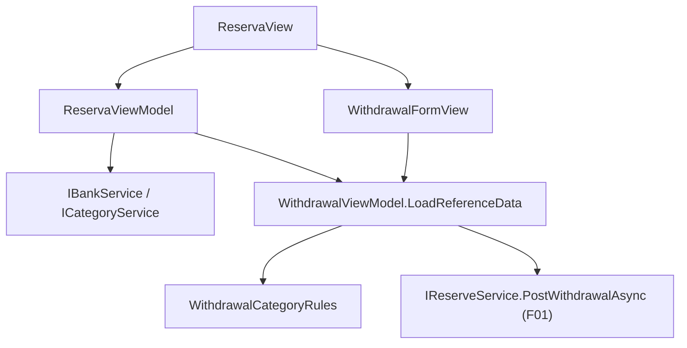

# Spec: F03. WPF Withdrawal Form Parity

Complexity: medium (view model, view, validation, one composition-root change, tests; no backend or contract change).

## 1. Technical Overview

**What:** Give the WPF "New Withdrawal" inline form the same optional bank routing as the React form (F02): a "Through bank" ComboBox and, once a bank is selected, a required "Expense category" ComboBox preselected to the category named after the selected bucket. The request carries `PaymentSourceBankId` and `ExpenseCategoryId` (F01); with no bank both stay `null` and behavior is unchanged.

**Why:** React is the UX source of truth and WPF must reach the same outcomes (`docs/rules/ui.md`). The field order, terminology, defaults, help text, validation meaning and outcomes are the contract in the F02 spec, Section 4 "Field behavior contract".

**Scope:**
- Included: two new fields with the F02 behavior, the derived category default, client validation and message, request payload, reset on open, disabled-while-saving, loading banks and categories with the page data, and the trigger to form-title to confirm-label alignment for this form (see Decisions).
- Excluded: backend or API changes, the React form, the edit-movement form, remembering the bank or category between opens, persisted links between the records.

**Consumes:**
- F01: extended `WithdrawalRequestDTO` (`PaymentSourceBankId`, `ExpenseCategoryId`, both `Guid?`) and the unchanged `ReserveMovementDTO`.
- F02: the "Field behavior contract" (order, defaults, terminology, messages) as the UX reference.

## 2. Architecture Impact

**Affected components:**
- `Financial.App/ViewModels/CashFlow/WithdrawalViewModel.cs` — modified: bank and category state, derived default, options, validation, request.
- `Financial.App/ViewModels/CashFlow/WithdrawalFormValidation.cs` — modified: category-required rule.
- `Financial.App/ViewModels/CashFlow/WithdrawalBankOption.cs` — new: the "No bank (direct)" plus bank list item type.
- `Financial.App/ViewModels/CashFlow/WithdrawalCategoryRules.cs` — new: presentation-side eligibility filter and bucket-name default (WPF twin of F02's `withdrawalExpenseCategories.ts`).
- `Financial.App/ViewModels/CashFlow/ReservaViewModel.cs` — modified: load banks and categories with the reference data and hand them to the withdrawal view model; refresh parameter renamed.
- `Financial.App/App.xaml.cs` — modified: register the two extra services for `ReservaViewModel`.
- `Financial.App/Views/CashFlow/WithdrawalFormView.xaml` — modified: two new fields, new layout, disabled-while-saving, label chain.
- `Tests/Financial.Presentation.Tests/ViewModels/CashFlow/WithdrawalViewModelTests.cs`, `WithdrawalFormValidationTests.cs`, `ReservaViewModelTests.cs` — modified; `WithdrawalCategoryRulesTests.cs` — new.

No new dependency direction: the view model uses Application DTOs and services only. `Category.ReservaName` (Domain constant) is reachable transitively exactly as `ExpenseFormValidation` already reaches Domain constants.



## 3. Technical Decisions

| Decision | Chosen Approach | Alternative Considered | Trade-off |
|----------|----------------|----------------------|-----------|
| Where banks/categories load | `ReservaViewModel` takes `IBankService` and `ICategoryService`, loads them in the existing refresh when reference data is included, each tolerant of failure (empty list, warning log with the exception type only), then calls `Withdrawal.LoadReferenceData(banks, categories)` | Give `WithdrawalViewModel` the services | Mirrors how buckets load and keeps `WithdrawalViewModel`'s constructor and its existing tests unchanged; `App.xaml.cs` registration and the `ReservaViewModel` test factory are the only construction sites |
| Refresh parameter | Rename `includeBuckets` to `includeReferenceData` (4 call sites) | Keep the name | The parameter now covers three lists; the existing explanation about a rebuilt collection resetting bound ComboBox selection still applies and is why mutation refreshes pass false |
| "No bank (direct)" | ComboBox `SelectedItem` bound to a non-null `WithdrawalBankOption` (`Id` is `Guid?`, the first option has `Id = null`, default) | `SelectedValue` with a `null` id | WPF cannot select an item by a `null` `SelectedValue`; `SelectedItem` keeps the placeholder real and selectable, like Web's empty option |
| Category default | Derived, not stored: `WithdrawalExpenseCategoryId` getter returns the explicit choice, else the eligible category matching the selected bucket's name (case-insensitive), else `null`; the setter stores the explicit choice; bucket and bank changes re-notify it | Store the default and a "touched" flag | Same derive-don't-store rule as F02; "default follows the bucket until the user picks" needs no flag |
| Eligible categories | Active, not investment, name not equal to `Category.ReservaName` (case-insensitive), computed in `WithdrawalCategoryRules` from the loaded DTOs | Show all active categories | Mirrors F01's server rules and F02 so the same options appear on both platforms |
| Form layout | `UniformGrid Columns="4"` holding six field panels in order; the category panel's `Visibility` is bound to `IsBankSelected` | Fixed `Grid` cells | `UniformGrid` skips collapsed children, so the row reflows exactly like Web's 4-column grid (Date, Bucket, Bank, Category / Description, Amount when a bank is chosen; Date, Bucket, Bank, Description / Amount otherwise) |
| Empty category | Empty selection (nothing chosen) plays the role of Web's "Select a category" placeholder | Add a placeholder item | WPF-native: a required ComboBox with no selection is the desktop convention; the meaning (must choose) and the validation message are identical |
| Saving state | All form controls and Cancel disabled while `IsSubmittingWithdrawal` via one `IsWithdrawalFormEditable` property bound on the container | Per-control converters | One property, no new converter; matches F02 |
| Contextual help | `controls:HelpFlyoutButton` beside the "Through bank" label with F02's help text | Tooltip | Documented WPF mechanism (`BalanceAdjustmentFormView.xaml` reference) |
| Label chain | Confirm button reads "Add Withdrawal" and "Saving..." (was "Withdraw" / "Withdrawing...") to match trigger "New Withdrawal", form title, and the React form | Leave as is | `forms-data-and-visualisations.md` requires trigger, title and confirm to name the same thing and says to fix the whole chain of a touched form; also required for React/WPF terminology parity |
| Unsaved-changes prompt | None; Cancel discards as today | Add discard prompt | Same deferral as F02 (no sibling form has one) |
| Comments | None in new code | XML docs | Project no-comments policy; existing comments in touched files are left alone |

## 4. Component Overview

**Presentation (WPF):**

| File Path | New/Modified | Purpose | Key Responsibilities |
|-----------|--------------|---------|---------------------|
| `Financial.App/ViewModels/CashFlow/WithdrawalBankOption.cs` | New | List item | Immutable option with a nullable bank id and a display name; one shared "No bank (direct)" instance |
| `Financial.App/ViewModels/CashFlow/WithdrawalCategoryRules.cs` | New | Category rules | Eligibility filter and bucket-name default lookup over `CategoryDTO` lists |
| `Financial.App/ViewModels/CashFlow/WithdrawalViewModel.cs` | Modified | Form state and submit | `BankOptions`, `CategoryOptions` (in-place collections), `SelectedBankOption`, `IsBankSelected`, derived `WithdrawalExpenseCategoryId`, `IsWithdrawalFormEditable`, `ExpenseCategoryFieldError`, `LoadReferenceData`; reset bank and category when the form opens; pass both ids in the request |
| `Financial.App/ViewModels/CashFlow/WithdrawalFormValidation.cs` | Modified | Client validation | Add optional bank and category arguments and the category-required message; existing four-argument callers keep working |
| `Financial.App/ViewModels/CashFlow/ReservaViewModel.cs` | Modified | Page state | Constructor takes the two extra services; loads banks and categories with the reference data, tolerant of failure; calls `Withdrawal.LoadReferenceData`; rename `includeBuckets` |
| `Financial.App/App.xaml.cs` | Modified | Composition | Pass `IBankService` and `ICategoryService` into `ReservaViewModel` |
| `Financial.App/Views/CashFlow/WithdrawalFormView.xaml` | Modified | View | Field order, conditional category, help button, disabled-while-saving, "Add Withdrawal" and "Saving..." labels |

**Field behavior parity table (F02 contract mapped to WPF):**

| Item | React (F02) | WPF |
|------|-------------|-----|
| Order | Date, Bucket, Through bank, Expense category (conditional), Description, Amount | Same, via `UniformGrid` |
| Through bank | Select, first option "No bank (direct)", then banks by name | ComboBox over `BankOptions`, default "No bank (direct)" |
| Expense category | Shown when a bank is selected, required, eligible categories | Same visibility via `IsBankSelected`; required indicator = red " *" `Run` plus `AutomationProperties.HelpText="Required"` |
| Default | Bucket-named eligible category, else empty | Same, derived |
| Explicit choice rule | Kept when the bucket changes; dropped when the bank is cleared | Same |
| Persistence | Not remembered | Reset to "No bank (direct)" and no category each time the form opens |
| Validation message | `Category is required when a bank is selected.` | Identical text, shown under the category field |
| Help text | Info button on "Through bank" | `HelpFlyoutButton` with the same sentence |
| Saving | All controls and Cancel disabled, label "Saving..." | Same |
| Confirm label | "Add Withdrawal" | "Add Withdrawal" |

## 5. API Contracts

No endpoint change. The view model uses the F01 request:

```json
{
  "bucketId": "…",
  "amount": 20,
  "date": "2026-09-29",
  "description": "Car service",
  "confirmed": false,
  "paymentSourceBankId": "…chase…",
  "expenseCategoryId": "…ariana…"
}
```

Direct withdrawal: both ids `null`. Overdraft handling (`OverdraftConfirmationRequiredException` then confirm dialog then replay with `Confirmed = true`) and the post-submit refresh are unchanged; the replay keeps both ids.

## 6. Data Model

None.

## 7. Testing Strategy

**Assumptions recorded (spec-writer decisions with no PRD answer):**
- Eligible categories filtered client-side, same rule as F01 and F02.
- Banks and categories load tolerant of failure, like buckets.
- Confirm label changed to "Add Withdrawal" and Cancel disabled while saving, for React parity.
- The XAML view has no unit tests (per the project's coverage policy for view code-behind and layout); its behavior is covered by the view-model tests, and the visual result by a manual check.

| Test File | Test Type | Target | Coverage Goal |
|-----------|-----------|--------|---------------|
| `Tests/Financial.Presentation.Tests/ViewModels/CashFlow/WithdrawalCategoryRulesTests.cs` | Unit | eligibility and default lookup | all branches |
| `Tests/Financial.Presentation.Tests/ViewModels/CashFlow/WithdrawalFormValidationTests.cs` | Unit | validation | category rule |
| `Tests/Financial.Presentation.Tests/ViewModels/CashFlow/WithdrawalViewModelTests.cs` | Unit (VM, AC tracing) | state, payload, reset | one test per F03 criterion |
| `Tests/Financial.Presentation.Tests/ViewModels/CashFlow/ReservaViewModelTests.cs` | Unit (VM) | reference-data loading | load, tolerance, pass-through |

Reuse `StubBankService` and `StubCategoryService` from `ViewModels/CashFlow/TestStubs.cs`; the `ReservaViewModelTests` factory adds them to the constructor call. Select through the same view-model properties the bindings write (`SelectedBankOption`, `WithdrawalExpenseCategoryId`, `WithdrawalBucketId`).

**WithdrawalCategoryRulesTests**

| Test Function | Description | Assertions |
|---------------|-------------|------------|
| `Eligible_ExcludesInactiveInvestmentAndReserva` | Filter | only active non-investment non-Reserva remain, Reserva matched case-insensitively |
| `DefaultFor_MatchesBucketNameCaseInsensitively` | Default | returns the matching id |
| `DefaultFor_NoMatch_ReturnsNull` | No match | `null` |

**WithdrawalFormValidationTests additions**

| Test Function | Description | Assertions |
|---------------|-------------|------------|
| `BankWithoutCategory_ReturnsCategoryRequired` | Rule | message equals `Category is required when a bank is selected.` |
| `BankWithCategory_ReturnsEmpty` | Valid | empty |
| `NoBank_NoCategory_ReturnsEmpty` | Direct | empty |
| `CategoryWithoutBank_IsIgnored` | Stale value | empty |

**WithdrawalViewModelTests additions** (each maps to a PRD F03 acceptance criterion)

| Test Function | Criterion | Assertions |
|---------------|-----------|------------|
| `LoadReferenceData_ListsDirectOptionThenBanks_AndEligibleCategories` | Same fields, defaults | `BankOptions` = direct + banks; `CategoryOptions` = eligible only; direct selected by default |
| `SelectingBank_ShowsCategoryAndDefaultsToBucketNamedCategory` | Same defaults and show/hide | `IsBankSelected` true; category id = matching category |
| `NoMatchingCategory_LeavesCategoryEmpty` | Same defaults | id `null` |
| `BucketChange_UpdatesDefaultUntilExplicitChoice` | Explicit choice rule | default follows bucket; after assigning a category it does not |
| `ClearingBank_DropsExplicitCategory_AndPostsNulls` | Request omits ids | request `PaymentSourceBankId` and `ExpenseCategoryId` null |
| `SubmitBankWithoutCategory_ShowsCategoryRequiredFieldError_AndPostsNothing` | Same validation text | `ExpenseCategoryFieldError` equals the message; no service call; `WithdrawalGeneralSaveError` null |
| `SubmitBankAndCategory_PostsBothIds_ClosesFormAndRefreshes` | Post and refresh | request carries both ids; form closed; refresh invoked once |
| `SubmitBankPath_OverdraftConfirmed_ResubmitsWithBothIds` | Overdraft unchanged | second request `Confirmed` true with the same ids |
| `SubmitBankPath_BackendRejects_KeepsFormOpenAndValues` | Server errors, values retained | form open; bank, category and amount kept; `WithdrawalGeneralSaveError` equals the server message |
| `ShowWithdrawalForm_ResetsBankAndCategory` | Not remembered | direct selected, category null after a prior selection |
| `IsWithdrawalFormEditable_FalseWhileSubmitting` | Saving state | flips true to false to true around a submit |

**ReservaViewModelTests additions**

| Test Function | Description | Assertions |
|---------------|-------------|------------|
| `Refresh_LoadsBanksAndCategoriesIntoWithdrawal` | Reference data | withdrawal options populated |
| `Refresh_WhenBanksOrCategoriesFail_StillLoadsReserveData` | Tolerance | `HasError` false; options hold only the direct option; warning logged with the exception type only |
| `MutationRefresh_DoesNotReloadReferenceData` | Selection preserved | bank service called once across an add-withdrawal refresh |

**Cross-Feature Integration criteria from PRD Section 9 referencing F03:**
- WPF ids accepted by the API and producing the same three records as the web form: the payload assertions above plus F01's endpoint tests; confirmed end to end in the manual check.
- The reserve movement appearing after the WPF refresh: `SubmitBankAndCategory_...` asserts the refresh; manual check confirms the grid.
- Field order, defaults, terminology and messages matching F02: the parity table in Section 4 is the reference, verified in the manual check against the React form.

**Manual verification (required by `docs/rules/ui.md`):** build the WPF app and launch it against a **temporary copy** of the data files (never the live `data/*.json`; check for a running Docker instance on 8080 first). Exercise a direct and a bank-routed withdrawal, and toggle the bank on and off to confirm the row reflows without a gap. Automation of the desktop UI must use the elements' clickable points, never screenshot-guessed coordinates. The final visual check is left to the user, as with earlier WPF features; the PRD's manual-check box and the cross-feature boxes are checked only after that confirmation.

**UI review:** complete every item in `docs/ui/review-checklist.md` for `WithdrawalFormView.xaml` and have `.claude/agents/ui-reviewer.md` review the change, including WPF-specific guidance in `docs/ui/wpf.md`.
