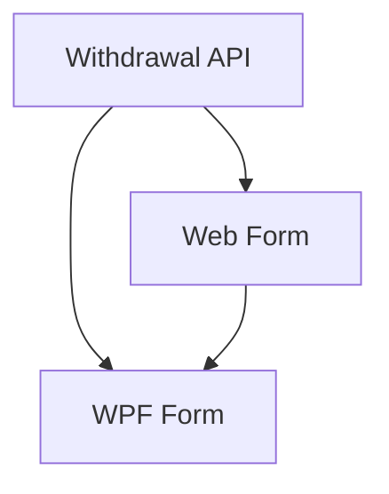

# Reserve Withdrawal via Bank

## 1. Executive Summary

Reserve Withdrawal via Bank extends the existing Reserva withdrawal workflow so that a withdrawal can optionally pass through one of the user's bank accounts. Today a withdrawal only creates a negative reserve movement on a bucket. When the money actually lands in a bank and is then spent from that bank, the bank-side cash flow (balance, monthly expenses, category totals) does not reflect it, and the user must key two extra expenses by hand.

The product is a single-user, self-hosted personal finance tool with a React web front end (UX source of truth) and a WPF desktop front end that must stay at feature parity. The feature adds an optional "Through bank" choice to the withdrawal form. When left empty, behavior is exactly as today. When a bank is chosen, one submit atomically creates the reserve movement plus two expenses on that bank: a negative `Reserva`-category expense (money returning from the Reserva into the bank) and a positive expense in the user-chosen category (money spent from the bank), which defaults to the category named after the bucket.

The core value is that a Reserva-funded expense is recorded once, correctly, on both the reserve and the bank side, with bank balance and category reporting staying accurate without manual double entry.

## 2. Problem and Opportunity

### The Problem

**Manual double entry**
- A withdrawal that flows through a bank needs 1 reserve movement + 2 bank expenses today, i.e. 3 separate form submissions.
- The two bank expenses must share the same date and description as the withdrawal, so typos cause mismatches.

**Inaccurate bank-side reporting**
- Forgetting the negative `Reserva` expense leaves the bank balance understated by the withdrawn amount.
- Forgetting the category expense leaves monthly category totals (e.g. the bucket's category) understated.

**Inconsistent categorisation**
- The category chosen for the spend is free-typed each time, although it is usually the bucket name.

### The Opportunity

- Recording all three records in one atomic submit removes the double entry and the partial-save risk (all three saved, or none).
- Pre-selecting the bucket-named category makes the common case a two-field change (bank, amount) instead of a three-form chore.
- Keeping the bank-less path unchanged preserves existing workflows and data.

## 3. Target Audience

### Primary Users

**Household finance owner (single user)**
- Records Reserva withdrawals used to pay for expenses through a specific bank (e.g. Chase, Trading212 account).
- Expects bank balances and category totals in the monthly view to match reality.
- Uses both the web app and the WPF desktop app and expects identical outcomes.

## 4. Objectives

### Product Objectives

1. **Eliminate** manual double entry for bank-routed Reserva withdrawals.
2. **Guarantee** atomicity: the reserve movement and both bank expenses are saved together or not at all.
3. **Preserve** existing direct-withdrawal behavior with zero change when no bank is chosen.
4. **Deliver** identical outcomes in React and WPF.

### Success Metrics

| Objective | Metric | Measurement condition |
|---|---|---|
| Eliminate double entry | 1 submit creates 3 records (1 reserve movement + 2 expenses) | API test posting a withdrawal with a bank |
| Atomicity | 0 partial states after any injected save failure | Application test with a failing repository save |
| Preserve direct path | 100% of existing withdrawal tests pass unchanged | Existing suite run without modification to their assertions |
| Parity | 100% of F02 acceptance criteria have a WPF equivalent in F03 | Review against the parity checklist |

## 5. User Stories

### F01. Bank-Routed Withdrawal API
- As a user, I want a withdrawal request that names a bank and a category so that the bank-side expenses are created together with the reserve movement
- As a user, I want a withdrawal without a bank to behave exactly as before so that my existing workflow is unaffected
- As a user, I want an invalid bank or category to be rejected before anything is saved so that I never end up with a partial withdrawal
- As the system, I want the reserve movement and both expenses saved atomically so that a failure leaves no orphan records

### F02. Web Withdrawal Form (React)
- As a user, I want an optional "Through bank" dropdown on the withdrawal form so that I can say the money passed through a bank
- As a user, I want the category preselected to the bucket's name so that the common case needs no extra typing
- As a user, I want clear validation messages when I pick a bank but no category so that I can fix the form quickly
- As a user, I want the reserve history and bank views to refresh after a successful submit so that I see all three records

### F03. WPF Withdrawal Form Parity
- As a user, I want the same "Through bank" and category fields, order, defaults and messages in the desktop app so that both apps behave identically
- As a user, I want the same overdraft confirmation and refresh behavior in the desktop app so that outcomes match the web app

## 6. Functionalities

### F01. Bank-Routed Withdrawal API

**Provides:**
- Extended withdrawal contract: optional bank identifier and category identifier on the withdrawal request (used by F02, F03)
- Result describing the created reserve movement (unchanged) (used by F02, F03)

**Capabilities:**
- `WithdrawalRequestDTO` gains two optional fields: `PaymentSourceBankId` (Guid?) and `ExpenseCategoryId` (Guid?). Both omitted = direct withdrawal, identical to today: exactly 1 reserve movement, 0 expenses.
- When `PaymentSourceBankId` is supplied, `ExpenseCategoryId` is required. Supplying a category without a bank is rejected.
- On success with a bank, exactly 3 records are created in one persisted unit:
  1. The reserve movement on the bucket (negative amount, as today).
  2. An Expense on the selected bank: category `Reserva`, value = `-Amount`, same date and description as the withdrawal.
  3. An Expense on the selected bank: category = `ExpenseCategoryId`, value = `+Amount`, same date and description.
- Both expenses use the payment-source-bank shape (no credit card), default tithe flag, and no round-up.
- Validation (server side, HTTP 400 through the existing exception mapping):
  - Bank must exist (the domain has no active/inactive bank concept).
  - Category must exist, be active, not be an investment category, and not be `Reserva`.
  - All existing withdrawal rules still apply (description required, amount > 0, bucket recognised).
- Overdraft confirmation remains bucket-based only (`Confirmed` flag, 409 when balance is exceeded); bank balance is never checked.
- Atomicity uses the existing compensating-save pattern: if the save fails, none of the 3 records remain.
- No persisted link between the reserve movement and the two expenses; after creation they are independent records (edit/delete unaffected by each other).
- Service method keeps the standard span/log/failure shape; no amounts, descriptions or exception messages are logged.
- OpenAPI snapshot is regenerated and reviewed; `Financial.Web/src/api/generated/openapi.ts` is regenerated and committed.
- Domain and bounded-context rules: the orchestration lives in the CashFlow Application layer; Investment context is untouched.

**Experience:**
- API-only; consumers see one POST to the existing withdrawal endpoint that either returns the created reserve movement DTO (unchanged shape) or an error.

**Error Handling:**
- Unknown bank: 400 "Payment source ... is not recognized.", nothing saved.
- Bank supplied without category: 400, nothing saved.
- Category unknown, inactive, investment or `Reserva`: 400, nothing saved.
- Overdraft without `Confirmed`: 409 as today, nothing saved.
- Persistence failure on save: compensating rollback removes any of the 3 records already applied; original exception surfaces.

### F02. Web Withdrawal Form (React)

**Consumes:**
- F01: extended withdrawal contract (optional bank identifier, category identifier), reserve movement result

**Capabilities:**
- `WithdrawalForm` gains a "Through bank" select listing all banks, empty by default with an empty option meaning "No bank (direct)".
- When a bank is selected, an "Expense category" select appears listing active, non-investment, non-`Reserva` categories.
- Category defaults to the category whose name equals the selected bucket's name (case-insensitive); if none matches, it stays empty and required. Changing the bucket re-applies the default only while the user has not manually chosen a category.
- Clearing the bank hides the category field and drops its value; the request then omits both fields.
- The bank and category selections are not remembered between opens (the existing last-used date and bucket behavior is unchanged).
- Client validation mirrors server messages: "Category is required when a bank is selected."; existing messages unchanged.
- Field order: Date, Bucket, Through bank, Expense category, Description, Amount.

**Experience:**
- Initial: bank empty, category hidden.
- Selecting a bank reveals the category select with default applied and keyboard focus stays on the bank select.
- Saving: submit disabled with existing "saving" indicator; all fields disabled while the request is in flight.
- Success: form closes, reserve history and balances refresh; the bank-side expenses become visible on the next load of the bank/monthly views.
- Validation and server errors show inline per field or as a general message, as today; overdraft flow keeps the existing confirmation dialog.
- Unsaved changes: closing with entered data follows the existing form behavior.
- Fields have visible labels, keyboard operation and accessible names; no colour-only meaning.

**Error Handling:**
- Server 400 for bank/category shows the message under the relevant field or as the general form error; no data lost from the form.
- Network failure keeps the form open with the entered values and shows the existing save error.
- Partial save is impossible (F01 atomicity); after an error nothing is created.

### F03. WPF Withdrawal Form Parity

**Consumes:**
- F01: extended withdrawal contract (optional bank identifier, category identifier), reserve movement result
- F02: field order, defaults, terminology and validation messages as the UX reference

**Capabilities:**
- `WithdrawalViewModel` and the withdrawal form view gain the same "Through bank" and "Expense category" fields, same order, same default-category rule, same show/hide behavior and same validation text as F02.
- `WithdrawalFormValidation` adds the "Category is required when a bank is selected." rule; field-error matching follows the existing substring pattern.
- The request passes both new fields only when a bank is selected.
- Overdraft confirmation flow and post-submit refresh are unchanged; the refresh also reloads data the bank views depend on where the app already does so.
- Bucket, bank and category lists come from the existing services; no business logic in code-behind.
- Tests select through `TreeNodeViewModel.IsSelected` where a tree selection is involved, per existing convention.

**Experience:**
- Same states as F02 (initial, saving, success, validation, server error, overdraft confirmation), adapted to native controls; keyboard navigation, visible focus and automation names preserved.

**Error Handling:**
- Server validation and conflict errors surface through the existing `WithdrawalSaveError` per-field matching and general message.
- Failure keeps the form open with values retained; no partial records exist.

## 7. Out of Scope

- **Linkage:** no persisted relation between the reserve movement and the bank expenses; no cascade edit or delete.
- **Bank balance rules:** no bank-balance or overdraft check on the selected bank.
- **Other flows:** income-to-reserve splitting, credit-card payments, transfers between banks, and reserve deposits are unchanged.
- **Other payment sources:** credit-card routing of the spend is not supported here.
- **Retroactive changes:** existing withdrawals are not migrated or back-filled.
- **Persistence changes:** no new stored fields or data migration.
- **Admin CRUD:** reserve bucket and category management are unchanged.

## 8. Dependency Graph

| # | Feature | Priority | Dependencies |
|---|---------|----------|--------------|
| F01 | Bank-Routed Withdrawal API | 1 | None |
| F02 | Web Withdrawal Form (React) | 1 | F01 |
| F03 | WPF Withdrawal Form Parity | 1 | F01, F02 |

### Execution Waves
Features within the same wave can be built in parallel. A wave starts only after every feature in earlier waves is complete.

- **Wave 1**: F01
- **Wave 2**: F02
- **Wave 3**: F03

### Priority levels
- **1** = Essential — product does not work without it
- **2** = Important — significant value addition
- **3** = Desirable — incremental improvement

## 9. Acceptance Criteria

### F01. Bank-Routed Withdrawal API
- [x] A withdrawal without bank and category creates exactly 1 reserve movement and 0 expenses, identical to current behavior
- [x] A withdrawal with a valid bank and category creates exactly 1 reserve movement and 2 expenses in one save
- [x] The `Reserva`-category expense has value `-Amount`; the chosen-category expense has value `+Amount`; both are on the selected bank with the withdrawal's date and description
- [x] A bank without a category is rejected with 400 and nothing is saved
- [x] A category without a bank is rejected with 400 and nothing is saved
- [x] An unknown bank is rejected with 400 and nothing is saved
- [x] An unknown, inactive, investment or `Reserva` category is rejected with 400 and nothing is saved
- [x] An overdrawn bucket without `Confirmed` returns 409 and nothing is saved; with `Confirmed` the 3 records are created
- [x] A simulated save failure leaves 0 of the 3 records persisted
- [x] Failure logs contain no amounts, descriptions or exception messages, only operation name, exception type and allow-listed identifiers
- [x] The OpenAPI snapshot and generated TypeScript types are regenerated, committed and pass their freshness tests

### F02. Web Withdrawal Form (React)
- [x] The form shows an optional "Through bank" select, empty by default, listing all banks
- [x] Selecting a bank reveals the "Expense category" select preselected to the bucket-named category when one exists
- [x] With no matching category, the category stays empty and submit shows "Category is required when a bank is selected."
- [x] Clearing the bank hides the category and the request omits both fields
- [x] Changing the bucket updates the default category only if the user has not manually chosen one
- [x] Submit with a bank sends bank and category identifiers; success closes the form and refreshes the reserve data
- [x] Server 400 and 409 responses are shown inline/with the existing confirmation dialog and the entered values are kept
- [x] The new fields are keyboard operable, labelled, and show visible focus
- [x] `npm run build`, `npm run lint`, `npm test` pass

### F03. WPF Withdrawal Form Parity
- [ ] The WPF form has the same two new fields, in the same order, with the same defaults and show/hide behavior as the web form
- [ ] Validation text matches the web app, including "Category is required when a bank is selected."
- [ ] The request omits bank and category when no bank is selected
- [ ] Overdraft confirmation and post-submit refresh behave as before
- [ ] Server errors are attributed to the correct field or shown as the general error, and the form values are retained
- [ ] The new controls are keyboard navigable, have visible focus and automation names
- [ ] Manual WPF GUI check confirms the outcome matches the web app for a bank-routed and a direct withdrawal

### Cross-Feature Integration
- [ ] The bank and category identifiers sent by the web form (F02) are accepted by the API (F01) and produce the 3 expected records
- [ ] The bank and category identifiers sent by the WPF form (F03) are accepted by the API (F01) and produce the same 3 records as the web form
- [ ] The reserve movement returned by the API (F01) appears in the reserve history after the web (F02) and WPF (F03) refresh
- [ ] Field order, defaults, terminology and messages in the WPF form (F03) match the web form (F02)
