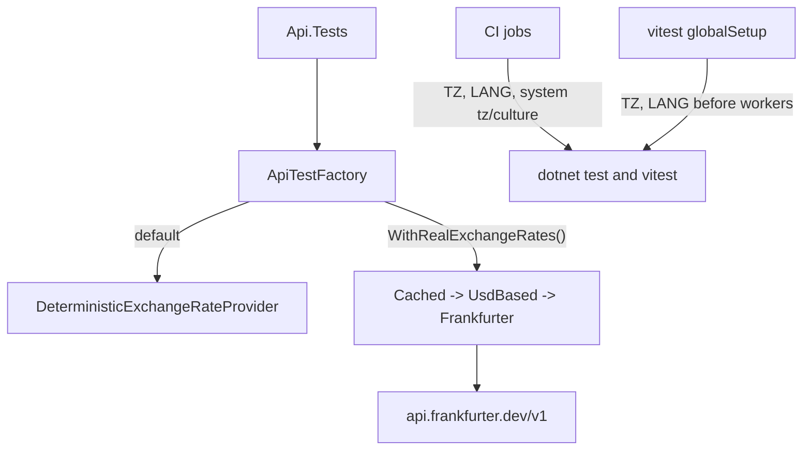

# Technical Specification: Deterministic Test Infrastructure

**Complexity:** simple (no API or data-model change; a test factory, one HTTP client, CI configuration and a vitest setup)

## 1. Technical Overview

**What.** Make every CI test run independent of the network, the host timezone and the host language:

1. `ApiTestFactory` registers a deterministic `IExchangeRateProvider` by default, so `Financial.Api.Tests` never reaches Frankfurter. The real chain becomes an explicit opt-in.
2. `FrankfurterExchangeRateProvider` gets a 10 s budget per lookup, stops on a transport failure instead of walking back 10 dates, and moves to the current host (`api.frankfurter.dev/v1`).
3. CI pins `Europe/London` and `en-GB` on the `backend`, `wpf`, `web` and `smoke` jobs, and vitest pins the same for every test run.

**Why.** Today `ApiTestFactory` leaves the production FX chain in place, so API tests that touch currency conversion issue live HTTP calls (up to 11 sequential per lookup, 100 s timeout each, ~18 min worst case). Date-dependent tests change behaviour with the runner's timezone and culture. Both make CI results depend on things the repo does not control.

**Scope.**

**Included:**
- Deterministic FX provider in `Financial.TestUtilities` and its use as the `ApiTestFactory` default.
- `WithRealExchangeRates()` opt-in on `ApiTestFactory`.
- Frankfurter timeout, failure semantics and base address.
- `TZ`/`LANG` for the four CI jobs (Windows jobs through the system timezone and culture) and vitest.

**Provides (PRD):** deterministic `ApiTestFactory` with a stub FX provider by default and an explicit real-chain opt-in (used by F05); pinned test environment `TZ=Europe/London`, `LANG=en-GB` (used by F08).
**Consumes:** none.

**Excluded:**
- Migrating tests that read the wall clock to a pinned clock, and pt-BR parsing theories (F08).
- Culture-specific code changes; F01 only pins the environment.
- A `Category=Live` test for real Frankfurter (F07/F14).
- EUR rates: the `Currency` enum has only BRL, GBP and USD, so the PRD's EUR pair is not applicable.

**Assumptions / decisions recorded:**
- The PRD names `src/test/setup.ts`; the real vitest setup file is `Financial.Web/src/setupTests.ts`, and the pin goes in a new vitest `globalSetup` (see §3).
- "No CI test calls the real chain" is read as "no test makes outbound HTTP calls". The opt-in method has no test of its own: the first test that needs the real chain exercises it, and testing the test factory beyond the default guard adds little.
- Frankfurter answers weekend/holiday dates with HTTP 200 and the previous working day's rates (verified: 2026-10-03 and 2026-10-04 returned 2026-10-02; 2025-12-25 returned 2025-12-24). Only dates with no data (e.g. the future) return 404. So the day-by-day fallback is not needed for non-working days.

## 2. Architecture Impact

**Design answers (`docs/rules/design.md`):**
1. *Where does this belong?* Test infrastructure (`Financial.TestUtilities`, `Financial.Api.Tests`), the Frankfurter integration project (`Integrations/Frankfurter`), CI config and the web test setup. No bounded-context code changes.
2. *Layers touched:* none of Domain/Application/Infrastructure/Presentation. The Frankfurter project is an Integration behind the existing `IExchangeRateProvider`/`IUsdRateFetcher` interfaces.
3. *What keeps Domain from learning about Infrastructure?* Nothing changes: the provider stays behind `IExchangeRateProvider` declared in `Shared.Abstractions`; the stub implements the same interface.
4. *SOLID:* DIP — the factory swaps an interface registration, not a class. SRP — failure policy (stop vs fall back) is the only logic added to the provider.

| Component | Path | Change |
|---|---|---|
| Deterministic provider | `Tests/Financial.TestUtilities/DeterministicExchangeRateProvider.cs` | New |
| API test factory | `Tests/Financial.Api.Tests/ApiTestFactory.cs` | Default stub, `WithRealExchangeRates()` |
| Factory guard tests | `Tests/Financial.Api.Tests/ApiTestFactoryExchangeRateTests.cs` | New |
| Frankfurter provider | `Integrations/Frankfurter/FrankfurterExchangeRateProvider.cs` | Budget, failure semantics, base address |
| Frankfurter tests | `Tests/Financial.Frankfurter.Tests/FrankfurterExchangeRateProviderTests.cs` | New cases |
| Testing docs | `.claude/skills/testing-guide-Financial/**` | Base address and factory default |
| CI workflow | `.github/workflows/build.yml` | TZ/LANG, Windows timezone/culture step |
| Environment guard test | `Tests/Financial.Architecture.Tests/` (or `Financial.Api.Tests`) | New, runs only when `CI=true` |
| Vitest pin | `Financial.Web/vitest.globalSetup.ts`, `Financial.Web/vite.config.ts` | New / modified |
| Vitest pin test | `Financial.Web/src/__tests__/testEnvironment.test.ts` | New |

## 3. Technical Decisions

| Decision | Chosen Approach | Alternative Considered | Trade-off |
|---|---|---|---|
| Stub shape | New `DeterministicExchangeRateProvider` in `Financial.TestUtilities`: a committed USD-based table (USD 1, GBP 0.8, BRL 5) with cross rates derived as `usd[to] / usd[from]`; same currency → 1; date is ignored | Reuse `StubExchangeRateProvider(rate)` (one rate for every pair) | Round, human-checkable rates (GBP→BRL 6.25, BRL→GBP 0.16) and consistent crosses; one more class in TestUtilities |
| Where the stub is registered | In `ApiTestFactory.ConfigureWebHost` through `ConfigureTestServices` + `RemoveAll<IExchangeRateProvider>()`, unless an explicit override or `WithRealExchangeRates()` is set | Change production DI | Keeps production wiring untouched |
| Precedence | Explicit constructor override > `WithRealExchangeRates()` > deterministic default | Last call wins | Existing tests that pass their own provider are unchanged |
| Opt-in API | `ApiTestFactory.WithRealExchangeRates()` sets a flag and returns the factory; must be called before the host starts | Constructor flag | Readable at the call site; the factory builds its host lazily, so the flag is read in time |
| Failure semantics | A timeout, network error or non-success status ends the lookup and returns null. Walking back to earlier dates happens only on a successful reply with no usable rate | Keep walking back and cap total time | Worst case drops from ~18 min to the 10 s budget; 5xx makes 1 request per lookup. Non-working days are served by Frankfurter itself, so nothing is lost |
| Time budget | One `CancellationTokenSource` per public call (`GetHistoricalRateAsync`, `FetchAsync`), 10 s by default, passed to `GetFromJsonAsync`; the budget is an optional constructor parameter so tests use milliseconds | `HttpClient.Timeout = 10 s` | Covers the whole lookup, not one request; honours cancellation; tests stay fast |
| Base address | `https://api.frankfurter.dev/v1/` (the old host answers 301 to it) | Keep the old host | Removes a redirect hop and a dependency on a retired host. Relative request paths are unchanged |
| Linux pin | `TZ`/`LANG` in each job's `env` | Per-step env | One place per job |
| Windows pin | A first step in `backend` and `wpf`: `Set-TimeZone -Id "GMT Standard Time"` and `Set-Culture en-GB` (.NET on Windows ignores `TZ`/`LANG`) | Env vars only | Real effect, verified by a CI-only test; a test that fails off-London is guarded by `CI=true` so local runs are not affected |
| Vitest pin | `globalSetup` file sets `process.env.TZ`/`LANG` in the main process before workers start; a test asserts `Intl` resolves `Europe/London` and `en-GB` | Set inside `setupTests.ts` | A setup file runs in each worker after the process started; `globalSetup` is inherited by workers reliably |

## 4. Component Overview

**Test infrastructure:**

| File Path | New/Modified | Purpose | Key Responsibilities |
|---|---|---|---|
| `Tests/Financial.TestUtilities/DeterministicExchangeRateProvider.cs` | New | Fixed FX rates | Hold the committed rate table; resolve any BRL/GBP/USD pair; count calls |
| `Tests/Financial.Api.Tests/ApiTestFactory.cs` | Modified | Host factory | Register the deterministic provider by default; expose `WithRealExchangeRates()` |
| `Tests/Financial.Api.Tests/ApiTestFactoryExchangeRateTests.cs` | New | Guard | Default resolves the deterministic provider |

**Integration:**

| File Path | New/Modified | Purpose | Key Responsibilities |
|---|---|---|---|
| `Integrations/Frankfurter/FrankfurterExchangeRateProvider.cs` | Modified | Rate fetching | New base address; per-lookup time budget; stop on transport failure; keep stepping back only on a clean empty reply |
| `.claude/skills/testing-guide-Financial/artifacts/dependency-injection-modules.md`, `.../external-http-services.md`, `.../references/external-providers.md` | Modified | Docs | New base address; ApiTestFactory default stub and the opt-in name |

**CI and web:**

| File Path | New/Modified | Purpose | Key Responsibilities |
|---|---|---|---|
| `.github/workflows/build.yml` | Modified | Pinned environment | `TZ`/`LANG` in the four jobs; Windows timezone/culture step in `backend`, `wpf` |
| `Tests/Financial.Architecture.Tests/CiEnvironmentTests.cs` | New | Pin check | Under `CI=true`, asserts the local timezone is London and the current culture is en-GB; skipped silently otherwise |
| `Financial.Web/vitest.globalSetup.ts` | New | Pin | Set `TZ=Europe/London`, `LANG=en-GB` |
| `Financial.Web/vite.config.ts` | Modified | Wire the setup | `test.globalSetup`; exclude the file from coverage |
| `Financial.Web/src/__tests__/testEnvironment.test.ts` | New | Pin check | Asserts resolved timezone and locale |

## 5. API Contracts

Not applicable.

## 6. Data Model

Not applicable.

## 7. Testing Strategy

| Test File | Test Type | Target | Goal |
|---|---|---|---|
| `Tests/Financial.Api.Tests/ApiTestFactoryExchangeRateTests.cs` | Integration (in-process host) | Factory default | AC F01-1 |
| `Tests/Financial.Frankfurter.Tests/FrankfurterExchangeRateProviderTests.cs` | Unit | Provider failure policy | AC F01-4/5 |
| `Tests/Financial.Architecture.Tests/CiEnvironmentTests.cs` | Environment guard | CI pin | AC F01-6 (.NET) |
| `Financial.Web/src/__tests__/testEnvironment.test.ts` | Unit | vitest pin | AC F01-6 (web) |

| Test Function | Description | Assertions |
|---|---|---|
| `DefaultFactory_ResolvesDeterministicExchangeRateProvider` | `new ApiTestFactory()`, resolve `IExchangeRateProvider` | Instance is `DeterministicExchangeRateProvider` |
| `GetHistoricalRateAsync_WhenHandlerNeverResponds_ReturnsNullWithinTheBudget` | Handler awaits cancellation; budget 150 ms | Returns null; elapsed well under 11 s (asserted < 5 s) — **fails on pre-fix code** (it waits for the 100 s default) |
| `GetHistoricalRateAsync_WithServerError_MakesASingleRequest` | Handler counts calls, returns 503 | Null; call count 1 — **fails pre-fix (11)** |
| `GetHistoricalRateAsync_WithSuccessfulReplyMissingTheRate_StepsBackToEarlierDates` | First reply has no `to` rate, second has it | Returns the second rate; call count 2; second request is the previous day |
| `FetchAsync_WithServerError_MakesASingleRequest` | USD fetcher path | Null result; call count 1 |
| `FetchAsync_WhenHandlerNeverResponds_ReturnsEmptyResultWithinTheBudget` | Same for `IUsdRateFetcher` | Empty result; fast |
| `Constructor_SetsTheCurrentBaseAddressWhenNoneIsConfigured` | New client without base address | `BaseAddress` is `https://api.frankfurter.dev/v1/` |
| `Pinned_OnCi_UsesLondonTimeZoneAndBritishCulture` | Only when `CI=true` | `TimeZoneInfo.Local.Id` resolves to London; `CultureInfo.CurrentCulture.Name == "en-GB"` |
| `vitest environment pins Europe/London and en-GB` | `Intl.DateTimeFormat().resolvedOptions()` | `timeZone === 'Europe/London'`, `locale` starts with `en-GB` |

The existing Frankfurter tests (18) must keep passing; the ones asserting fallback on non-success status are rewritten to the new semantics.

**Acceptance-criteria trace (PRD §9, F01):**

| PRD criterion | Covered by |
|---|---|
| Default factory resolves the stub, guard test asserts it | `DefaultFactory_ResolvesDeterministicExchangeRateProvider` |
| `dotnet test Tests/Financial.Api.Tests` passes with outbound network disabled | Verified by running the project with the network blocked (e.g. a proxy to a dead address); recorded in PR1 |
| Opt-in requires an explicitly named method; no CI test makes real calls | `WithRealExchangeRates()` is the only way to select the real chain; nothing in the suite calls it (checked by search in the PR) |
| Hanging handler returns fallback in < 11 s | `GetHistoricalRateAsync_WhenHandlerNeverResponds_...` |
| 5xx makes ≤ 1 request per requested date | `GetHistoricalRateAsync_WithServerError_...`, `FetchAsync_WithServerError_...` |
| `TZ`/`LANG` set in `backend`, `wpf`, `web`, `smoke` and in vitest setup | Workflow diff; `Pinned_OnCi_...`, `vitest environment pins...` |

**Manual verification:** the first PR run on CI shows the `CiEnvironmentTests` result; if the Windows culture step does not take effect for the test host, the test fails and the step is corrected in the same PR.
