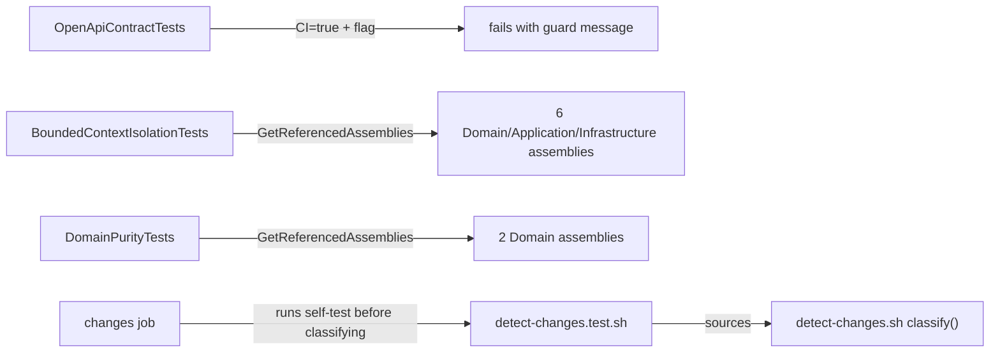

# Technical Specification: CI Gate Hardening

**Complexity:** medium (no API or data-model change; three new architecture/contract test guards, a rewritten change classifier with its own self-test, one workflow edit and CI documentation)

## 1. Technical Overview

**What.** Close the gaps that let a wrong change pass `ci-status` silently:

1. `OpenApiContractTests` can no longer rewrite the contract snapshot on CI.
2. Architecture tests enforce the two invariants nothing machine-checks today: bounded-context isolation (CashFlow ↔ Investment) and Domain purity (no ASP.NET Core, `System.Text.Json` or Infrastructure).
3. `detect-changes.sh` stops classifying a Markdown file under a source directory as documentation, gets a fixture-driven self-test that runs in the `changes` job, and sends `Financial.App` changes to `backend` as well, so the architecture tests can run once.
4. The architecture tests run in `backend` only, not in both `backend` and `wpf`.
5. `docs/ci-affected-pipeline.md` records that `enforce_admins` is deliberately `false`.

**Why.** Today `OpenApiContractTests` passes unconditionally when `UPDATE_OPENAPI_SNAPSHOT` is set, so one stray variable in a CI job turns the contract guard into a no-op. Invariant 3 (bounded contexts stay isolated) is only enforced by review. The classifier treats any `*.md` as docs, so `Financial.Web/src/foo.md` skips every job, and a mistake in a classifier rule silently skips jobs with no test to catch it. `Financial.Architecture.Tests` runs in two jobs for the cost of one signal.

**Scope.**

**Included:**
- Snapshot-update guard in `OpenApiContractTests`.
- `BoundedContextIsolationTests` (6 assertions) and `DomainPurityTests` (2 assertions, one per Domain project).
- `detect-changes.sh`: Markdown rule reordered, `main` guard so the script can be sourced, `Financial.App/*` also sets `backend`.
- `.github/scripts/detect-changes.test.sh` with at least 15 cases, run as a step in the `changes` job.
- `wpf` job stops running `Financial.Architecture.Tests`.
- `docs/ci-affected-pipeline.md`: updated rules and a new "Merge-gate bypass" section.

**Provides (PRD):** machine-enforced bounded-context and Domain-purity rules, a tested classifier. **Consumes:** none.

**Excluded:**
- Application-layer purity (the Application DTOs use `System.Text.Json` attributes by decision; see `feedback_json_dto_converter_leak`).
- Enabling `enforce_admins` (PRD out-of-scope; documented only).
- A coverage ratchet, diff coverage or hygiene scan (F09, F11).
- Verifying the WPF job's timezone/culture pin: `CiEnvironmentTests` moves with the architecture tests to `backend` only (see decision D5).

## 2. Architecture Impact

| Area | Change |
|---|---|
| `Tests/Financial.Api.Tests/OpenApiContractTests.cs` | Guard at the top of the snapshot test |
| `Tests/Financial.Architecture.Tests/` | Two new rule classes, reusing `ProjectAssembly` |
| `.github/scripts/detect-changes.sh` | Reordered `*.md` arm, `main` function, `Financial.App/*` also sets backend |
| `.github/scripts/detect-changes.test.sh` | New self-test |
| `.github/workflows/build.yml` | Self-test step in `changes`; `wpf` stops running the architecture tests |
| `docs/ci-affected-pipeline.md` | Rules, job descriptions, bypass policy |

Dependency direction is unchanged. The new tests live in test projects only.

## 3. Technical Decisions

| # | Decision | Alternatives | Rationale |
|---|---|---|---|
| D1 | The guard is a failing assertion in the existing test, not a skipped or removed one: when `CI=true` and the flag is non-empty it throws with `UPDATE_OPENAPI_SNAPSHOT must not be set in CI` | Remove the flag; check in the workflow | The flag stays for local regeneration (documented in CLAUDE.md); a test assertion is visible where the contract lives |
| D2 | Isolation and purity rules use `Assembly.GetReferencedAssemblies()` via `ProjectAssembly`, like the existing rule tests | Roslyn/NetArchTest | No new package; same limitation as today: an unused project reference is dropped by the compiler and is not seen. Acceptable because an unused reference is not an isolation breach |
| D3 | Isolation: every assembly named `Financial.<Context>.*` must not reference any assembly whose name starts with the *other* context's prefix; `Financial.Shared.*` stays allowed | Allowlist per assembly | Matches invariant 3 literally and survives new Shared projects |
| D4 | Domain purity forbids `Microsoft.AspNetCore*`, `System.Text.Json`, `Financial.<Context>.Infrastructure` and `Financial.Shared.Infrastructure`. Both Domain projects reference none of these today (checked) | Also forbid `Newtonsoft.Json`, `System.Net.Http` | Matches the PRD list; extend only on a real need |
| D5 | The architecture tests, including `CiEnvironmentTests` from F01, run in `backend` only. The `wpf` job's timezone/culture pin is the same step text as `backend`'s, so it is not separately verified | Keep a copy in `wpf` | PRD requirement "run once per pipeline"; `backend` already runs the whole solution except Presentation.Tests, so removing the `wpf` line loses nothing there |
| D6 | `Financial.App/*` also sets `backend=true` | Keep architecture tests in `wpf` | `PresentationDependencyRuleTests` pins `Financial.App`'s references. With the tests in `backend` only, an App-only change would otherwise skip them. Cost: App-only PRs also run `backend` (about 4 minutes) |
| D7 | `*.md` is classified after the source-directory rules, so a Markdown file inside `Financial.*`, `Tests/`, `Tools/` or `Integrations/` follows that directory's rule; root-level and `docs/` Markdown stays docs-only | Enumerate allowed doc folders | Smallest change, keeps `first match wins` |
| D8 | The self-test sources `detect-changes.sh` and calls `classify` per path; the script's main body moves behind a `main` function guarded by `[[ "${BASH_SOURCE[0]}" == "$0" ]]` | A temporary git repo per case; an env var overriding the file list | No production seam, no git setup, runs in milliseconds |
| D9 | `enforce_admins: false` is documented, not changed | Enable it | PRD decision: single-user repo, an emergency escape hatch; any admin merge on red is followed by a fix PR |

## 4. Component Overview

| File | Status | Role | Key content |
|---|---|---|---|
| `Tests/Financial.Api.Tests/OpenApiContractTests.cs` | Modified | Snapshot guard | `CI=true` with a non-empty flag fails with the guard message before any write |
| `Tests/Financial.Architecture.Tests/BoundedContextIsolationTests.cs` | New | Invariant 3 | Theory over (context, layer): 6 cases |
| `Tests/Financial.Architecture.Tests/DomainPurityTests.cs` | New | Invariant 1 | Theory over the two Domain assemblies |
| `.github/scripts/detect-changes.sh` | Modified | Classifier | `*.md` arm moved; `main` guard; `Financial.App/*` sets backend and wpf |
| `.github/scripts/detect-changes.test.sh` | New | Classifier self-test | Case table, prints every failing case, non-zero exit on any failure |
| `.github/workflows/build.yml` | Modified | CI | `changes` runs the self-test first; `wpf` runs only `Financial.Presentation.Tests` |
| `docs/ci-affected-pipeline.md` | Modified | Documentation | Updated rule rows and job descriptions; new "Merge-gate bypass" section |

## 5. API Contracts

Not applicable. The OpenAPI snapshot is not changed; only the way the test may rewrite it is.

## 6. Data Model

Not applicable.

## 7. Testing Strategy

**Business rules.**

- **Snapshot guard:** the flag is honoured only when `CI` is not `true`. With `CI=true` and the flag set the test fails with `UPDATE_OPENAPI_SNAPSHOT must not be set in CI`, and the snapshot file is not touched. With `CI` unset the update flow still rewrites it.
- **Isolation:** for each context in {CashFlow, Investment} and layer in {Domain, Application, Infrastructure}, the assembly's referenced assembly names contain nothing starting with the other context's `Financial.<Other>.` prefix. The failure message names the offending assembly and the reference.
- **Domain purity:** for each Domain assembly the referenced names contain no `Microsoft.AspNetCore`, `System.Text.Json`, `Financial.CashFlow.Infrastructure`, `Financial.Investment.Infrastructure` or `Financial.Shared.Infrastructure`.
- **Classifier:** `*.md` is docs-only only outside the source directories; every other rule is unchanged except `Financial.App/*`, which now sets backend and wpf.

**Test files and functions.**

| Test File | Test Type | Target | Goal |
|---|---|---|---|
| `Tests/Financial.Api.Tests/OpenApiContractTests.cs` | Integration (host) | Snapshot guard | AC F02-1/2 |
| `Tests/Financial.Architecture.Tests/BoundedContextIsolationTests.cs` | Architecture | Invariant 3 | AC F02-3 |
| `Tests/Financial.Architecture.Tests/DomainPurityTests.cs` | Architecture | Invariant 1 | AC F02-4 |
| `.github/scripts/detect-changes.test.sh` | Shell self-test | Classifier | AC F02-6/7 |

| Test Function | Description | Assertions |
|---|---|---|
| `OpenApiDocument_WithUpdateFlagOnCi_FailsInsteadOfRewriting` | Set `CI=true` and the flag in-process, run the guard | Throws with the guard message; snapshot file's last-write time unchanged |
| `OpenApiDocument_WithUpdateFlagOffCi_StillRewritesTheSnapshot` | `CI` unset, flag set, temp snapshot path | File rewritten |
| `BoundedContextIsolationTests.Assembly_DoesNotReferenceTheOtherContext(context, layer)` | 6 theory cases | No reference to the other context's prefix |
| `DomainPurityTests.Domain_DoesNotReferenceFrameworkOrInfrastructure(assembly)` | 2 theory cases | None of the forbidden names present |
| `detect-changes.test.sh` cases | At least 15 path → expected `backend wpf web smoke` rows: `docs/x.md`, `README.md`, `CLAUDE.md`, `Financial.Web/src/foo.md`, `Tests/Financial.Api.Tests/README.md`, `.claude/skills/x.md`, `Financial.Api/Program.cs`, `Tests/Financial.Api.Tests/OpenApi.snapshot.json`, `Financial.CashFlow.Application/DTOs/X.cs`, `Financial.Web/src/api/types.ts`, `Financial.App/Views/X.xaml`, `Financial.Web/src/App.tsx`, `Financial.CashFlow.Domain/X.cs`, `Tests/Financial.Architecture.Tests/X.cs`, `.github/workflows/build.yml`, `Dockerfile`, `some-unknown/file.txt` | Each row matches; the runner prints the failing path and both values |

**Verification by reverting.**

- Adding a `ProjectReference` from `Financial.CashFlow.Application` to an Investment project fails `BoundedContextIsolationTests`; adding `Microsoft.AspNetCore.App` use to a Domain class fails `DomainPurityTests`; each recorded once in the PR and reverted.
- Breaking one classifier rule (for example removing the `Financial.Web/*` arm) fails `detect-changes.test.sh`; recorded once in the PR and reverted.

**Acceptance-criteria trace (PRD §9, F02):**

| PRD criterion | Covered by |
|---|---|
| With `CI=true` and `UPDATE_OPENAPI_SNAPSHOT=1` the test fails with the guard message | `OpenApiDocument_WithUpdateFlagOnCi_FailsInsteadOfRewriting` |
| With `CI` unset the update flow still rewrites the snapshot | `OpenApiDocument_WithUpdateFlagOffCi_StillRewritesTheSnapshot` |
| A cross-context project reference fails `BoundedContextIsolationTests` | The 6-case theory; revert check in PR |
| A Domain reference to ASP.NET Core / `System.Text.Json` fails the purity test | The 2-case theory; revert check in PR |
| `Financial.Architecture.Tests` runs in `backend` only | `build.yml` diff: `wpf` job runs `Financial.Presentation.Tests` only |
| Self-test has at least 15 cases and runs in `changes`; a broken rule fails it | `detect-changes.test.sh` and the workflow step; revert check in PR |
| A `*.md` change under `Financial.Web/src` is not docs-only | The `Financial.Web/src/foo.md` row |
| `docs/ci-affected-pipeline.md` documents `enforce_admins: false` and the follow-up rule | Doc diff |

**Manual verification:** the first PR run on CI shows the self-test step in the `changes` job summary, and the `wpf` job log no longer lists `Financial.Architecture.Tests`.

## 8. Error Handling

- **Classifier fails a case:** `detect-changes.test.sh` prints `FAIL <path>: expected <x> got <y>` for every mismatch and exits 1, so `changes` fails and `ci-status` fails with it.
- **Self-test script missing or not executable:** the step fails; it is invoked as `bash .github/scripts/detect-changes.test.sh`, so no execute bit is needed.
- **Guard fires on CI by mistake:** the message names the variable, so the fix (unset it in the job) is obvious.
- **Unknown assembly in an isolation theory:** `ProjectAssembly.Load` throws a clear assembly-load error naming it.

## 9. Assumptions and Decisions to Review

- A `*.md` under `.github/` stays docs-only (it matches the Markdown arm before the Infra arm).
- Only the four documented source directories change the Markdown rule; a new top-level source folder falls through to "unclassified" and runs everything, as today.
- `Financial.App/*` triggering `backend` is a CI-cost decision (D6) the owner may want to revisit if WPF-only PRs become frequent.
- `CiEnvironmentTests` moves with the architecture tests (D5); the `wpf` job's pin is therefore unchecked.
