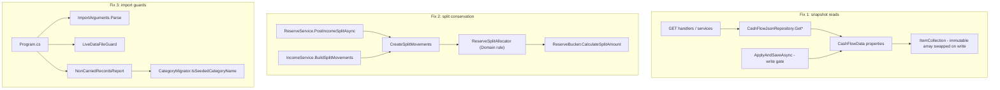

# Technical Specification: Data-Integrity Defect Fixes

**Complexity:** medium (three independent fixes across Domain, Application and Tools; no API or schema changes)

## 1. Technical Overview

**What.** Three defects that a green build currently lets through, each fixed behind a test that fails on the pre-fix code:

1. **CashFlow read/write safety.** `CashFlowJsonRepository` hands out the live in-memory collections (`GetExpenses() => _data.Expenses`, `CashFlowJsonRepository.cs:26`, and every other `Get*`). A read that is enumerating while `ApplyAndSaveAsync` mutates the same collection throws `InvalidOperationException: Collection was modified`. The fix makes every `CashFlowData` collection copy-on-write, so an enumeration always walks one immutable array.
2. **Reserve split conservation.** `ReserveService.CreateSplitMovements` (`ReserveService.cs:345-349`) rounds each bucket's share independently, so a split can drift ±£0.01 from what the percentages say. The fix moves allocation into a Domain rule that assigns the rounding residual to one bucket.
3. **Import tool guards.** `CashFlowSpreadsheetImport` defaults its output to the live `data/data-cashflow.json` (`Program.cs:33-36`) and silently drops record types the spreadsheet does not own (`CarryOverDataTheSpreadsheetDoesNotOwn`, `Program.cs:199-236`). The fix requires an explicit `--output`, refuses the live file, and reports what will not be carried over. The omission itself stays — it is intended.

**Why.** Each defect corrupts or loses money/persistence state without any test noticing: a 500 on a GET under concurrent use, a reserve balance a penny off the bank balance, and an import that can overwrite production data by default. The existing split test computes its expectation with production code (`IncomeServiceTests.cs:360,463`), so it cannot catch the drift.

**Scope.**

**Included:**
- Copy-on-write `ItemCollection<T>`/`IdCollection<T>`; the four collections still backed by a plain `List<T>` in `CashFlowData` (`CardStatements`, `InvestmentSnapshots`, `ReserveBuckets`, `TitheCarryForwards`) move onto `ItemCollection<T>`.
- New Domain rule `ReserveSplitAllocator` used by both split paths (`ReserveService.PostIncomeSplitAsync` and `IncomeService.BuildSplitMovements`, both via `CreateSplitMovements`).
- Literal-value rewrites of the split expectations in `IncomeServiceTests`.
- `CashFlowSpreadsheetImport`: new command-line parsing, live-file guard, non-carried-record report, exit codes 2/3, README update.

**Output contracts (Provides):** none — F03 provides nothing to other P58 features.
**Input contracts (Consumes):** none.

**Excluded:**
- Making in-place entity mutation (e.g. `ReserveBucket.Update`, `Expense` field setters) atomic for readers. Copy-on-write protects collection *membership*; a reader can still observe a single entity mid-update. No reported failure today; out of P58 scope.
- Investment context repositories (no reported concurrent-read defect).
- Changing the carry-over set of the import tool (PRD Section 7).
- The import tool's `DateTime.Now` (`Program.cs:71`) — owned by F08.
- Front ends: neither React nor WPF computes split amounts (`reserveBucketSplit.ts` only checks the percentage sum), so no front-end change is needed. The ±0.01 tolerance consolidation is F04 Full Scope.

## 2. Architecture Impact

**Design answers (`docs/rules/design.md`):**

1. *Where does this belong?* CashFlow bounded context. Snapshot semantics are a property of the aggregate's collections → **Domain** (`Entities/Collections`). Split allocation is a money rule → **Domain** (`Rules/`). Import guards belong to the **Tools** host (the tool is its own composition root, like `Program.cs` today).
2. *Layers touched, direction:* Fix 1: Domain only (repository code unchanged). Fix 2: Domain (new rule) ← Application (`ReserveService` calls it). Fix 3: Tools only, reading Domain `CashFlowData`. No fix touches all four layers.
3. *What stops Domain learning about Infrastructure?* Nothing new crosses: `ImmutableArray<T>` is BCL (`System.Collections.Immutable` ships in the shared framework, no package reference). `ICashFlowRepository` (Application) remains the only persistence boundary; `CashFlowJsonRepository` keeps returning `_data.X`.
4. *SOLID:* SRP — allocation moves out of a LINQ one-liner in an Application service into one Domain rule with one reason to change; the import tool's argument parsing/guard/report become three single-purpose classes instead of growing the top-level script. OCP — `CashFlowData`'s public surface (`IReadOnlyCollection<T>` properties, `Add*/Remove*/Update*`) is unchanged, so no caller is modified for fix 1. DIP — unchanged; Application still depends only on `ICashFlowRepository`.

**Affected components:**

| Component | Path | Fix |
|---|---|---|
| Item collection | `Financial.CashFlow.Domain/Entities/Collections/ItemCollection.cs` | 1 |
| Id collection | `Financial.CashFlow.Domain/Entities/Collections/IdCollection.cs` | 1 |
| Aggregate | `Financial.CashFlow.Domain/Entities/CashFlowData.cs` | 1 |
| Split rule (new) | `Financial.CashFlow.Domain/Rules/ReserveSplitAllocator.cs` | 2 |
| Reserve service | `Financial.CashFlow.Application/Services/ReserveService.cs` | 2 |
| Import CLI (new) | `Tools/CashFlowSpreadsheetImport/CommandLine/ImportArguments.cs` | 3 |
| Live-file guard (new) | `Tools/CashFlowSpreadsheetImport/CommandLine/LiveDataFileGuard.cs` | 3 |
| Non-carried report (new) | `Tools/CashFlowSpreadsheetImport/Reporting/NonCarriedRecordsReport.cs` | 3 |
| Category seed | `Tools/CashFlowSpreadsheetImport/Migrations/Categories/CategoryMigrator.cs` | 3 |
| Entry point | `Tools/CashFlowSpreadsheetImport/Program.cs` | 3 |

## 3. Technical Decisions

| Decision | Chosen Approach | Alternative Considered | Trade-off |
|---|---|---|---|
| Snapshot mechanism | Copy-on-write inside `ItemCollection<T>`: a `volatile ImmutableArray<T>` field replaced on every `Add`/`RemoveById`/`Update`; `GetEnumerator` enumerates the array captured at call time | (a) Repository publishes committed snapshots after each successful write; (b) every `Get*` copies under a read lock shared with every mutator | O(n) copy per mutation (≤ a few thousand items, single user — negligible). A reader during a LocalJson save that later fails may briefly see the uncommitted change until `CompensatingSaveHelper` reverts it — identical to today. (a) would make reads inside `applyChanges` see stale data; (b) copies on every read and needs a lock in every mutator |
| Writer concurrency inside the collection | No extra lock in the collection; all mutations already run inside `CashFlowJsonRepository._writeGate` | Interlocked compare-exchange loop | Correctness depends on the existing single-writer gate. Documented with one gotcha comment on the field |
| Storage-provider independence | Fix lives above `IJsonStorage`; serialization still happens inside the gate and hands a finished string to storage | Provider-specific handling | Works identically for `LocalJson` and `GoogleDriveJson` (`DebouncedJsonStorage` only ever sees the serialized string) |
| Split target | Target total = `round(base × Σ activePct ÷ 100, 2, AwayFromZero)`; residual = target − Σ per-bucket rounded shares; residual added to the bucket with the largest `SplitPercentage`, ties → first in repository order | Always force the sum to the full base; fix only when Σ% is within ±0.01 of 100 | Honors mis-configured percentages (99% stays 99%, which already raises the existing non-blocking warning) instead of silently inflating one bucket |
| Tie-break | First in the order `GetReserveBuckets()` returns (insertion order) | Display order | `ReserveBucket` has no display-order field; PRD's "display order" maps to repository order |
| Where allocation lives | New static Domain rule `ReserveSplitAllocator` in `Rules/` (next to `TitheRule`) | Method on `ReserveBucket` | A rule spanning several buckets doesn't belong on one entity; `CalculateSplitAmount` stays as the per-bucket primitive |
| Import CLI | `<workbook> --output <path> [--mensais-only]`; both required; hardcoded Downloads default removed | Keep positional output | Breaking change to a personal one-off tool; README updated |
| Live-file detection | Walk up from `AppContext.BaseDirectory` to the first directory containing `Financial.slnx`; live path = `<root>/data/data-cashflow.json`; compare `Path.GetFullPath` values with `OrdinalIgnoreCase` | Refuse anything under `data/`; read `Financial.Api` appsettings | Covers dev config and the Docker `./data` volume; a temp copy named `data-cashflow.json` elsewhere is allowed. When no repo root is found (tool copied elsewhere) there is no live path to compare and the run proceeds |
| Guard placement | Before `MigrationBackup.Create` and the four raw `*ReferenceMigrator.Migrate(outputPath)` calls | After load | Those migrators rewrite the output file in place; the guard must run before any file I/O |
| Testability of the tool | Extract `ImportArguments`, `LiveDataFileGuard`, `NonCarriedRecordsReport` as public classes in the tool assembly, tested from `Financial.CashFlowSpreadsheetImport.Tests` | Spawn the built exe in tests | Unit tests stay fast; `Program.cs` remains a thin orchestrator. The tool assembly stays coverage-excluded (`coverlet.runsettings`), so tests are behavioural, not coverage-driven |

**Assumptions / decisions recorded:**
- "User categories" (PRD) = categories in the existing file whose name is not one of `CategoryMigrator`'s 14 seeded names (case-insensitive). Seeded categories are re-seeded on rebuild, so only non-seeded ones are lost.
- Tithe carry-forwards are counted as `TitheCarryForwards.Count`; a set `TitheCarryForwardEffectiveFrom` is reported as part of the same line (`Tithe carry-forwards 1 (effective from 2026-04-01)`).
- The non-carried report is printed only in full-rebuild mode. In `--mensais-only` mode `data == existingData`, nothing is dropped, and the line is omitted.
- When the output file does not exist yet, there is nothing to report and no line is printed.
- The counts are read from the raw JSON of the existing output file (`Transfers`, `BalanceAdjustments`, `TitheCarryForwards`, `Categories`), not from a typed `CashFlowData`: the typed loader rejects legacy shapes that the migrations only fix later, and raw reading keeps the check free of side effects so a corrupt file exits 3 before anything is written. `NonCarriedRecordsReport.FromJson(string)` replaces the planned data-based constructor.
- Exit codes: `0` success, `1` workbook not found (unchanged), `2` argument/guard refusal, `3` existing output unreadable.

## 4. Component Overview

**Domain (`Financial.CashFlow.Domain`):**

| File Path | New/Modified | Purpose | Key Responsibilities |
|---|---|---|---|
| `Entities/Collections/ItemCollection.cs` | Modified | Copy-on-write collection | Hold items in an immutable array; `Add` swaps in a new array; `Count`/`GetEnumerator` read one captured array |
| `Entities/Collections/IdCollection.cs` | Modified | Id-keyed copy-on-write collection | `RemoveById`/`Update` build the new array and swap it; no in-place index assignment |
| `Entities/CashFlowData.cs` | Modified | Aggregate root | Replace the four `List<T>` + `AsReadOnly()` fields with `ItemCollection<T>`; public API unchanged |
| `Rules/ReserveSplitAllocator.cs` | New | Split conservation rule | Given active buckets (ordered) and a base amount, return one amount per bucket summing to the percentage-implied target; zero base or no buckets → empty result |

**Application (`Financial.CashFlow.Application`):**

| File Path | New/Modified | Purpose | Key Responsibilities |
|---|---|---|---|
| `Services/ReserveService.cs` | Modified | Split fan-out | `CreateSplitMovements` materializes the bucket list once, asks `ReserveSplitAllocator` for amounts, creates one `ReserveMovement` per bucket; signature unchanged so `IncomeService` needs no edit |

**Tools (`Tools/CashFlowSpreadsheetImport`):**

| File Path | New/Modified | Purpose | Key Responsibilities |
|---|---|---|---|
| `CommandLine/ImportArguments.cs` | New | Argument parsing | Parse `<workbook> --output <path> [--mensais-only]`; return parsed values or a refusal message (missing workbook, missing/empty `--output`, unexpected second positional, unknown flag) |
| `CommandLine/LiveDataFileGuard.cs` | New | Live-file refusal | Resolve the repo root from a start directory; decide whether an output path is the live data file |
| `Reporting/NonCarriedRecordsReport.cs` | New | Pre-write disclosure | Count Transfers, BalanceAdjustments, Tithe carry-forwards and non-seeded Categories in the existing data; render the single `Not carried over: ...` line |
| `Migrations/Categories/CategoryMigrator.cs` | Modified | Seed list owner | Expose `IsSeededCategoryName(string)` so the report reuses the single source of truth |
| `Program.cs` | Modified | Orchestration | Parse → guard (exit 2) → backup + raw migrations + typed load inside one failure boundary (exit 3) → print non-carried line (full mode) → import → write. Remove hardcoded defaults |
| `README.md` (repo root) | Modified | Docs | New usage line, required `--output`, refusal and exit-code table, "never point at `data/data-cashflow.json`" |

**Messages (exact text):**

| Situation | stderr text | Exit |
|---|---|---|
| No args / missing workbook / missing `--output` | `Refusing to run: --output is required and must not be the live data file (data/data-cashflow.json).` followed by `Usage: CashFlowSpreadsheetImport <workbook.xlsx> --output <path> [--mensais-only]` | 2 |
| Second positional argument | `Unexpected argument '<arg>'. Pass the output path with --output.` + usage line | 2 |
| `--output` resolves to the live file | same refusal line as row 1 | 2 |
| Existing output unreadable/corrupt | `Cannot read existing output to report non-carried records: <exception message>` | 3 |
| Valid full rebuild (stdout, before the write) | `Not carried over: Transfers 12, BalanceAdjustments 3, Tithe carry-forwards 1, Categories 4` | — |

## 5. API Contracts

Not applicable — no endpoint, DTO or OpenAPI change. `ReserveSplitResultDTO.splitAmounts` keeps its shape; only the values become conserved.

## 6. Data Model

Not applicable — no change to `data-cashflow.json` shape or serializer. Persisted amounts produced after the fix differ from pre-fix ones by at most £0.01 on one bucket per split; existing movements are not rewritten.

## 7. Testing Strategy

Per `testing-guide-Financial`: Domain rules → pure unit tests with literal expectations; repository behaviour → Infrastructure tests with hand-written fakes (no Moq); tool classes → unit tests in the tool's test project. Every new test asserts literal values and is written to fail on the pre-fix code first.

**Test files:**

| Test File | Test Type | Target | Goal |
|---|---|---|---|
| `Tests/Financial.CashFlow.Domain.Tests/Entities/Collections/ItemCollectionTests.cs` | Unit | snapshot semantics | Enumerator stability across mutation |
| `Tests/Financial.CashFlow.Domain.Tests/Entities/Collections/IdCollectionTests.cs` | Unit | remove/update under enumeration | Same |
| `Tests/Financial.CashFlow.Infrastructure.Tests/Repositories/CashFlowJsonRepositoryConcurrencyTests.cs` | Integration (in-process) | repository read during save | AC F03-1/2 |
| `Tests/Financial.CashFlow.Domain.Tests/Rules/ReserveSplitAllocatorTests.cs` | Unit | allocation rule | AC F03-3/4 |
| `Tests/Financial.CashFlow.Application.Tests/Services/ReserveServiceTests.cs` | Unit | split endpoint path | Conserved amounts reach movements and response |
| `Tests/Financial.CashFlow.Application.Tests/Services/IncomeServiceTests.cs` | Unit | income split path | AC F03-5 (literals) |
| `Tests/Financial.CashFlowSpreadsheetImport.Tests/CommandLine/ImportArgumentsTests.cs` | Unit | CLI parsing | AC F03-6 |
| `Tests/Financial.CashFlowSpreadsheetImport.Tests/CommandLine/LiveDataFileGuardTests.cs` | Unit | live-file detection | AC F03-7 |
| `Tests/Financial.CashFlowSpreadsheetImport.Tests/Reporting/NonCarriedRecordsReportTests.cs` | Unit | disclosure line | AC F03-8 |

**Fix 1 — snapshot reads:**

| Test Function | Description | Assertions |
|---|---|---|
| `GetEnumerator_WhenItemAddedMidEnumeration_CompletesWithOriginalItems` | Take enumerator over 3 items, `MoveNext` once, `Add` a 4th, drain | No exception; yields exactly the 3 original items |
| `GetEnumerator_WhenItemRemovedMidEnumeration_CompletesWithOriginalItems` | Same with `RemoveById` | 3 items yielded; a fresh enumeration yields 2 |
| `GetEnumerator_WhenItemUpdatedMidEnumeration_YieldsPreUpdateInstance` | Same with `Update` | Old instance yielded; fresh enumeration yields the new instance (`BeSameAs`) |
| `GetExpenses_WhileApplyAndSaveAddsExpense_EnumerationCompletesWithBeforeState` | 1,000 expenses; start enumerating `GetExpenses()`; inside `applyChanges` (with `BlockingJsonStorage` holding the write) add an expense; finish enumeration; release write | No `InvalidOperationException`; enumeration count = 1,000; `GetExpenses().Count()` after = 1,001 — **fails on pre-fix code** |
| `GetBankBalancesByMonth_WhileSaveMutatesExpenses_ReturnsBeforeOrAfterState` | Same setup driving `BankService.GetBankBalancesByMonth` over the repository while a save adds/removes an expense | Completes; totals equal either the pre-save or the post-save literal, never another value |
| `GetReserveBuckets_WhileSaveAddsBucket_EnumerationCompletes` | Covers a formerly `List<T>`-backed collection | No exception; before-state count |
| Existing `ApplyAndSaveAsync_*` and `UpdateIncomeAsync_WhenSaveFails_RestoresIncomeAndOriginalMovements` | Regression | Still pass unchanged (rollback semantics preserved) |

The concurrency tests interleave deterministically (enumerator held open across a mutation, `BlockingJsonStorage` gate) — no `Task.Delay`, no thread-timing races, so they comply with F11's hygiene rules.

**Fix 2 — split conservation:**

| Test Function | Description | Assertions |
|---|---|---|
| `Allocate_ThreeBucketsSummingTo100_AssignsResidualToLargest` | £100.01 at 33.33/33.33/33.34 | Literals 33.33, 33.33, 33.35; sum 100.01 — **fails on pre-fix code** |
| `Allocate_TiedLargestPercentage_AssignsResidualToFirstInOrder` | £0.03 at 50/50: each share rounds to 0.02 (Σ 0.04, target 0.03), residual −0.01 | Literals 0.01 (bucket 0), 0.02 (bucket 1) — residual can be negative |
| `Allocate_PercentagesSumTo99_TargetsNinetyNinePercent` | £100.00 at 50/49 | 50.00, 49.00; not inflated to 100.00 |
| `Allocate_ConservesTargetToThePenny` (Theory, ≥ 50 `InlineData`/`MemberData` amounts incl. 0.01, 0.99, 100.01, 2205.00, 9999.99, 1963.005) | Fixed bucket set 40/30/20/10 and 33.33/33.33/33.34 | Σ amounts == `round(base × Σ% ÷ 100, 2)` exactly |
| `Allocate_ZeroBase_ReturnsZeroAmounts` / `Allocate_NoBuckets_ReturnsEmpty` | Edge cases | No exception |
| `PostIncomeSplitAsync_WithThirdsSplit_PersistsConservedMovements` (`ReserveServiceTests`) | End-to-end through the service | Movement amounts and `splitAmounts` DTO literals 33.33/33.33/33.35 |
| `AddIncomeAsync_WithSplitForEligibleSource_CreatesLinkedMovementsForEveryActiveBucket` (rewrite) | Replace `bucket.CalculateSplitAmount(splitBase)` with per-bucket literal amounts for the 2205.00 base | Literal per bucket name |
| `UpdateIncomeAsync_StillSplitWithChangedNetValue_RecreatesMovementsWithNewAmounts` (rewrite) | Replace `investimento.CalculateSplitAmount(newSplitBase)` with the literal for 900.00 | Literal |
| `AddIncomeAsync_WithSplitAndZeroActiveBuckets_SucceedsWithNoMovements` (existing) | Zero buckets | Still passes; zero movements, income saved |

**Fix 3 — import guards:**

| Test Function | Description | Assertions |
|---|---|---|
| `Parse_NoArguments_ReturnsRefusal` | `[]` | Refusal with the exact message; exit code 2 |
| `Parse_WorkbookWithoutOutput_ReturnsRefusal` | `["a.xlsx"]` | Exit 2, refusal message |
| `Parse_SecondPositional_ReturnsUseOutputRefusal` | `["a.xlsx","b.json"]` | Exit 2, `Unexpected argument 'b.json'...` |
| `Parse_OutputFlagWithoutValue_ReturnsRefusal` | `["a.xlsx","--output"]` | Exit 2 |
| `Parse_ValidArguments_ReturnsWorkbookOutputAndMode` | with and without `--mensais-only`, flag in any position | Parsed values |
| `IsLiveDataFile_SamePathDifferentCaseAndSeparators_ReturnsTrue` | temp dir with a fake `Financial.slnx`, `data/data-cashflow.json`; output given as `..\`-relative, mixed case | True |
| `IsLiveDataFile_TempCopyWithSameFileName_ReturnsFalse` | `<temp>/copy/data-cashflow.json` | False |
| `IsLiveDataFile_NoRepoRootFound_ReturnsFalse` | start dir with no `Financial.slnx` ancestor | False |
| *(replaced by a manual check)* `Run_OutputIsLiveFile_LeavesFileTimestampUnchanged` | `Program.cs` is a top-level script, so the refusal path is exercised by running the built tool with `--output data/data-cashflow.json` and comparing the file's timestamp before and after | Exit 2; timestamp unchanged; no backup sibling created |
| `Render_WithAllTypesPresent_ListsCountsInFixedOrder` | data with 12 transfers, 3 adjustments, 1 carry-forward, 4 non-seeded + 14 seeded categories | Exactly `Not carried over: Transfers 12, BalanceAdjustments 3, Tithe carry-forwards 1, Categories 4` |
| `Render_SeededCategoryDifferentCase_NotCounted` | `"mercado"` present | Categories 0 |
| `Render_WithEffectiveFromDate_IncludesDate` | effective-from set | Date appears on the tithe segment |
| `Load_CorruptExistingOutput_ReturnsExitThreeWithReason` | invalid JSON in output file | Exit 3, message prefix `Cannot read existing output to report non-carried records:`; file bytes unchanged |

**Acceptance-criteria trace (PRD Section 9, F03):**

| PRD criterion | Covered by |
|---|---|
| Concurrent read/write test throws pre-fix, passes post-fix | `GetExpenses_WhileApplyAndSaveAddsExpense_EnumerationCompletesWithBeforeState` |
| Readers observe full before or full after, never partial | `..._EnumerationCompletesWithBeforeState`, `GetBankBalancesByMonth_WhileSaveMutatesExpenses_ReturnsBeforeOrAfterState` |
| £100.01 at 33.33/33.33/33.34 → 33.33/33.33/33.35 | `Allocate_ThreeBucketsSummingTo100_AssignsResidualToLargest`, `PostIncomeSplitAsync_WithThirdsSplit_PersistsConservedMovements` |
| Conservation theory ≥ 50 amounts | `Allocate_ConservesTargetToThePenny` |
| `IncomeServiceTests` split expectations are literals | the two rewrites above |
| No `--output` → exit 2, nothing written, refusal printed | `Parse_NoArguments_ReturnsRefusal`, `Parse_WorkbookWithoutOutput_ReturnsRefusal` |
| `--output` = live file → exit 2, timestamp unchanged | `Run_OutputIsLiveFile_LeavesFileTimestampUnchanged` |
| Valid run prints non-carried counts before writing | `Render_WithAllTypesPresent_ListsCountsInFixedOrder` + manual run against a temp copy recorded in PR3 |

**Cross-feature integration:** F03 has no Consumes and no Provides, so PRD Section 9 has no cross-feature criteria for it. Its tests must already respect F11's hygiene rules (no `Task.Delay`, `Thread.Sleep`, `Skip =` or wall-clock reads in new test lines) so they don't need rework when F11 lands.

**Manual verification (PR3):** run the tool against a temp copy of the live file (`--output %TEMP%\cf-verify\data-cashflow.json`) and paste the `Not carried over:` line into the PR body; also run once with `--output data/data-cashflow.json` and confirm exit 2 with the file's timestamp unchanged.
