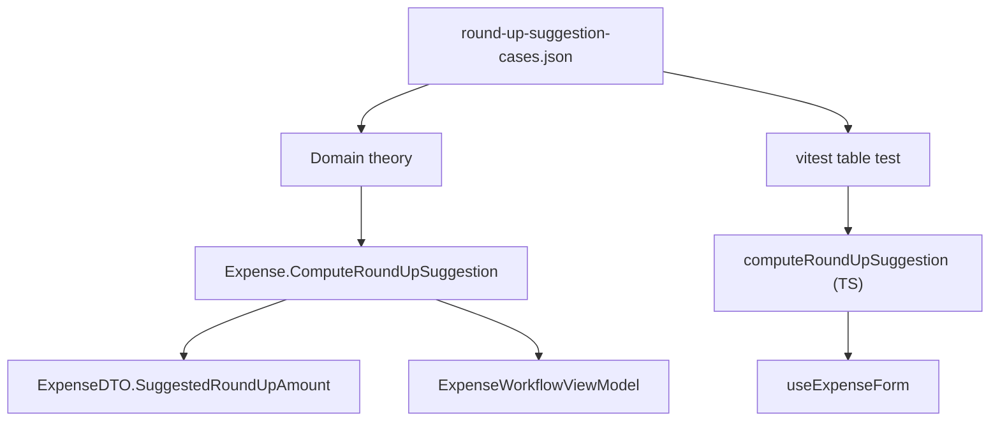

# Technical Specification: Cross-Front-End Correctness Fixes

**Complexity:** simple (three small fixes across Domain, a WPF view model and the Web app; no API, schema or persistence changes)

## 1. Technical Overview

**What.** Three defects where React and WPF disagree with each other, or where a test pins a wrong behaviour, each fixed behind a test that fails on the pre-fix code:

1. **Round-up suggestion.** On the expense form, a round-up-enabled bank suggests `ceil(value) - value`. Three copies exist: `Expense.RoundUpSuggestion` (Domain, unrounded), `computeRoundUpSuggestion` in `useExpenseForm.ts` (rounded to 2 dp, shown with `toFixed(2)`, so `0.60`) and `ExpenseWorkflowViewModel.SuggestRoundUpAmount` (rounded to 2 dp, shown with `"0.##"`, so `0.6`). Typing 9.40 shows `0.60` in React and `0.6` in WPF, and each suite asserts its own variant. The fix makes the Domain function the single rule (2 dp, away from zero), has WPF call it, and keeps a small TypeScript mirror in the web app that is pinned to the same committed table of literal cases.
2. **Local calendar date.** `todayIsoDate()` returns `new Date().toISOString().slice(0, 10)`, the UTC date, so a form opened at 00:30 BST on 1 July defaults to 30 June. Eleven web tests build their expectation the same way, so they cannot see it.
3. **Empty `API_BASE_URL`.** `config.test.ts` asserts that an unset variable yields `''`, which CLAUDE.md forbids (an empty base URL makes the SPA fallback answer API calls with HTML). The config module accepts it silently.

**Why.** The suites pass because each computes its expectation with the code under test (UTC date) or pins its own front end's variant (`0.60` vs `0.6`). A user sees different numbers in the two front ends, and a wrong default date shortly after midnight in summer.

**Scope.**

**Included (Core Scope):**
- `Expense.ComputeRoundUpSuggestion(decimal)`, a public static in the CashFlow Domain; `RoundUpSuggestion` delegates to it.
- WPF `SuggestRoundUpAmount` calls it and formats at a fixed 2 dp.
- Web `computeRoundUpSuggestion` stays as the TypeScript mirror; one committed case table is asserted by both the C# and the vitest suites.
- `todayIsoDate()` returns the local date, and the 11 web tests that recompute it use pinned-time literal expectations.
- `config.ts` fails loudly on an unset or empty `API_BASE_URL`; the test that pins `''` is replaced.

**Deferred (Full Scope):** consolidating the four reserve-split ±0.01 tolerance checks (`reserveBucketSplit.ts`, `ReservaViewModel.cs:70`, `ReserveBucketsViewModel.cs:71`, `ReserveBucketService.cs:118`) into the Application service. Scope choice: Core only. The matching Section 9 box stays unticked.

**Output contracts (Provides):** none. **Input contracts (Consumes):** none (the date tests rely on the pinned `TZ=Europe/London` delivered by F01).

**Excluded:**
- Money parsing and formatting culture (pt-BR) — owned by F08.
- The WPF `DateTime.Today` / `DateTime.Now` clock reads — owned by F08.
- Any change to the OpenAPI snapshot: `ExpenseDTO.SuggestedRoundUpAmount` keeps its type; only values with more than 2 decimal places change (now rounded).

## 2. Architecture Impact

Affected components:
- `Financial.CashFlow.Domain/Entities/Expense.cs` — the rule.
- `Financial.App/ViewModels/CashFlow/ExpenseWorkflowViewModel.cs` — consumes the rule. WPF already references `Expense` (`MinRoundUpAmount`/`MaxRoundUpAmount` in `ExpenseFormValidation.cs`), so there is no new layer dependency.
- `Financial.Web/src/hooks/useExpenseForm.ts`, `src/utils/formatters.ts`, `src/api/config.ts`.
- `Tests/Financial.CashFlow.Domain.Tests/TestData/round-up-suggestion-cases.json` — shared literal table read by the Domain tests and by vitest (the same pattern `openapiFreshness.test.ts` uses to read the committed OpenAPI snapshot from `Tests/`).

## 3. Technical Decisions

| Decision | Chosen Approach | Alternative Considered | Trade-off |
|----------|----------------|----------------------|-----------|
| D1. How the front ends share the rule | One Domain function plus a TS mirror, both pinned to a committed literal table | New API endpoint called per keystroke | A second implementation exists, but a table asserted on both sides turns drift into a test failure; a request per keystroke with loading/error states is over-engineered for single-user arithmetic |
| D2. Where the rule lives | `Expense.ComputeRoundUpSuggestion` static in Domain | Application service method | `RoundUpSuggestion` and `SuggestedRoundUpAmount` already live on `Expense`; WPF already references `Expense` constants |
| D3. Rounding | 2 dp, `MidpointRounding.AwayFromZero`; non-positive value gives 0 | Leave Domain unrounded | Changes `SuggestedRoundUpAmount` only for values with more than 2 dp (9.995 → 0.01); matches what both front ends already did |
| D4. WPF format | `ToString("F2", CultureInfo.CurrentCulture)`; input still parsed with the current culture | Invariant culture | The field is user-facing text next to a culture-aware input; machine-format culture is F08's concern |
| D5. Date default | Local calendar date from `getFullYear/getMonth/getDate` | `toLocaleDateString('en-CA')` | Explicit parts have no locale dependency; tests run under the pinned `TZ=Europe/London` |
| D6. Test clock | `vi.useFakeTimers({ toFake: ['Date'] })` + `vi.setSystemTime`, literal expected dates | Compute the expectation from a helper | Faking only `Date` keeps `waitFor` and promises running; a literal cannot share the bug |
| D7. `API_BASE_URL` | `config.ts` throws on unset/empty; `vite.config.ts` already defaults an unset variable to `/api/v1/financial` | Keep silently returning `''` | A misconfigured build fails at startup instead of returning HTML to every API call |

### Assumptions

- Zero and negative values keep suggesting nothing (existing tests: -9.40 gives 0.00 in Domain, a blank field in both front ends).
- The TS mirror cannot reuse C# decimal arithmetic; it rounds with `Math.round((Math.ceil(v) - v) * 100) / 100`. The table includes 9.995 and 15.20 so a float-rounding mismatch fails the vitest side.
- Vitest applies the `define` in `vite.config.ts`, so `import.meta.env.API_BASE_URL` has a value in tests unless a test stubs it. To confirm during implementation; if not, tests that import the client stub the variable.
- Applied defaults (not from the PRD): D4 culture handling, D6 fake-timer scope, D7 throw-on-empty. The PRD says only that an unset value is "treated as misconfiguration according to the existing config contract"; the existing contract is the vite default plus CLAUDE.md's "never empty" rule.

## 4. Component Overview

**Backend (Domain)**

| File Path | New/Modified | Purpose | Key Responsibilities |
|-----------|--------------|---------|---------------------|
| `Financial.CashFlow.Domain/Entities/Expense.cs` | Modified | The single round-up rule | `ComputeRoundUpSuggestion(decimal)` static; `RoundUpSuggestion` delegates |

**WPF**

| File Path | New/Modified | Purpose | Key Responsibilities |
|-----------|--------------|---------|---------------------|
| `Financial.App/ViewModels/CashFlow/ExpenseWorkflowViewModel.cs` | Modified | Use the rule | `SuggestRoundUpAmount` calls the Domain function and formats `F2` |

**Frontend**

| File Path | New/Modified | Purpose | Key Responsibilities |
|-----------|--------------|---------|---------------------|
| `Financial.Web/src/hooks/useExpenseForm.ts` | Modified | TS mirror | Export `computeRoundUpSuggestion` so the table test can call it |
| `Financial.Web/src/utils/formatters.ts` | Modified | Local date | `todayIsoDate()` from local date parts |
| `Financial.Web/src/api/config.ts` | Modified | Fail loudly | Throw when the variable is unset or empty |

**Tests**

| File Path | New/Modified | Purpose |
|-----------|--------------|---------|
| `Tests/Financial.CashFlow.Domain.Tests/TestData/round-up-suggestion-cases.json` | New | Literal cases (value → suggestion), copied to the test output |
| `Tests/Financial.CashFlow.Domain.Tests/Entities/ExpenseTests.cs` | Modified | Replace the inline theory with the table; add 9.995 |
| `Tests/Financial.Presentation.Tests/ViewModels/CashFlow/ExpenseWorkflowViewModelTests.cs` | Modified | Assert `"0.60"`; merge the digit-by-digit table test into one interaction test |
| `Financial.Web/src/hooks/__tests__/useExpenseForm.test.ts` | Modified | Table test over the shared JSON; single interaction test; pinned-date test |
| `Financial.Web/src/utils/__tests__/formatters.test.ts` | Modified | `todayIsoDate` boundary cases |
| `Financial.Web/src/api/__tests__/config.test.ts` | Modified | Replace the empty-value test |
| 9 other web tests that compute `toISOString().slice(0, 10)` | Modified | Pinned time and literal date: `useBalanceAdjustmentForm`, `useControleMae`, `useCredits`, `usePriceHistory` (2 sites), `useReserva` (2 sites), `useTransactions`, `useTransferForm`, plus `UkExpensePromptDialog` (which calls `todayIsoDate()` itself) |

## 5. API Contracts

Skipped: no endpoint or DTO shape changes. `ExpenseDTO.SuggestedRoundUpAmount` stays `decimal?`; `Tests/Financial.Api.Tests/Contract/openapi-v1.snapshot.json` must remain byte-identical.

## 6. Data Model

Skipped: nothing persisted changes.

## 7. Testing Strategy

**Round-up**
- `ExpenseTests.RoundUpSuggestion_MatchesCommittedCases` (Theory over the JSON): 9.40 → 0.60, 10.00 → 0.00, 0.01 → 0.99, 9.995 → 0.01, 15.20 → 0.80, 0 → 0, -9.40 → 0. Fails on the pre-fix Domain code for 9.995 (returns 0.005).
- `useExpenseForm.test.ts` › `computeRoundUpSuggestion matches the committed cases`: the same JSON, comparing `toFixed(2)` of the result with the table's string form.
- `ExpenseWorkflowViewModelTests.TypingValue_KeepsRecalculatingTheSuggestion_UntilEditedManually`: types `9.40` and asserts `"0.60"`, changes the value and asserts it recalculates, edits the field and asserts it stops. Replaces `CreatingExpense_DefaultBankIsRoundUpEnabled_ShowsFieldAndSuggestsOnValueEntry` (`"0.6"`) and `TypingValueDigitByDigit_KeepsRecalculatingTheRoundUpSuggestion` (`"0"`, `"0.8"`), which are deleted as value tables.
- `useExpenseForm.test.ts` › `keeps recalculating as typed until manually edited`: the same flow, asserting `0.60`. Replaces the digit-by-digit table test; the existing "typing a value auto-suggests" test keeps asserting `0.60`.

**Local date**
- `formatters.test.ts` › `todayIsoDate`: at `2026-07-01T00:30:00+01:00` returns `2026-07-01` (fails on the pre-fix code, which returns `2026-06-30`); at `2026-01-31T23:59:00Z` returns `2026-01-31`; at `2026-03-01T00:30:00Z` returns `2026-03-01`.
- Each of the recompute sites pins `vi.setSystemTime(...)` and asserts a literal. A grep for `toISOString().slice(0, 10)` in `Financial.Web/src` finds only non-test code, or nothing.

**Config**
- `config.test.ts`: `API_BASE_URL_WhenUnset_Throws`, `API_BASE_URL_WhenEmpty_Throws`; the trailing-slash and unchanged-value tests stay. No test asserts `''` as valid.
- `npm run build` in the `web` job proves the build still receives a value from `vite.config.ts`.

**Cross-feature:** F08's pinned-clock tests rely on `todayIsoDate()` being local; nothing else consumes F04.

**Verification:** each fix is reverted locally once and the new test is seen failing; the result goes in the PR body.

## 8. Error Handling

- Unparseable or blank value in either form: no suggestion (unchanged).
- Unset or empty `API_BASE_URL` at app start: the config module throws `API_BASE_URL must be set (for example /api/v1/financial); an empty value makes API calls hit the SPA fallback`. The app fails visibly instead of with `Unexpected token '<'`.

## 9. Acceptance Criteria Mapping

| PRD box | Covered by |
|---------|-----------|
| Domain round-up tests pass for 9.40, 10.00, 0.01 and 9.995 | `ExpenseTests` theory over the JSON |
| Typing 9.40 shows `0.60` in both front ends; both interaction tests assert `0.60` | the two interaction tests |
| Per-front-end value-table tests are removed | deleted tests listed in Section 7 |
| `todayIsoDate()` at `2026-07-01T00:30+01:00` returns `2026-07-01` | `formatters.test.ts` |
| No web test computes an expected date with `toISOString().slice(0,10)` | the date-test rewrites plus a grep |
| No test asserts an empty `API_BASE_URL` as valid | `config.test.ts` |
| (Full Scope) reserve-split tolerance only in the Application service | deferred; stays unticked |
