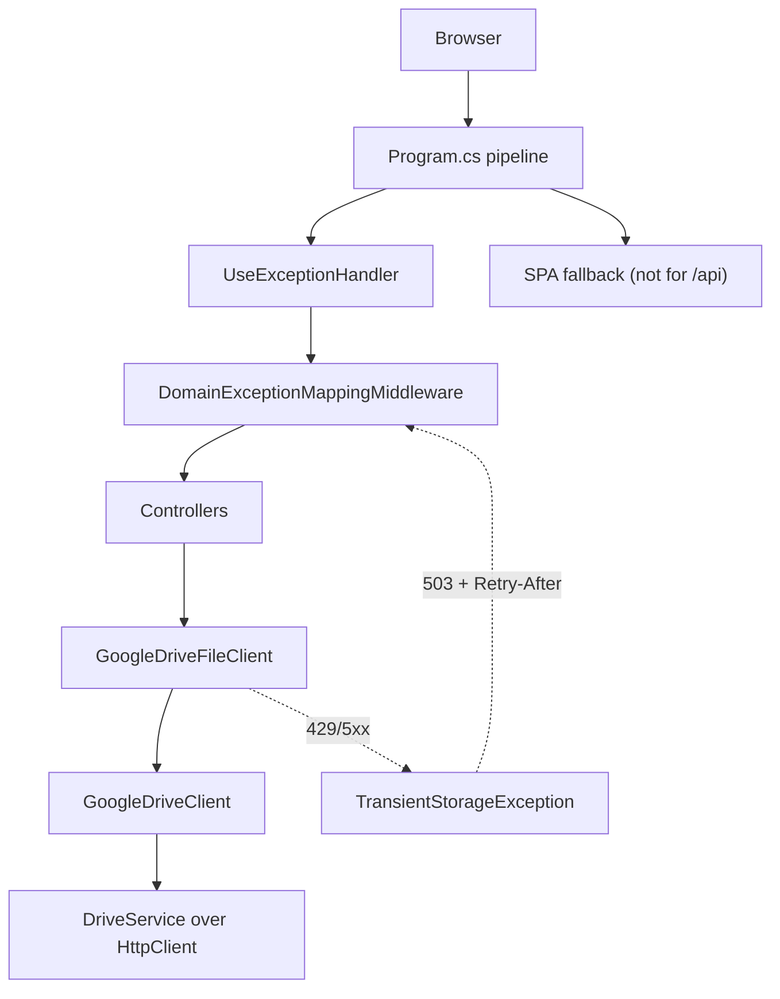

# Technical Specification: API Host Boundary Tests

**Complexity:** medium (three host-level behaviours in `Financial.Api`, one injection seam in an Integration project, no data-model change)

## 1. Technical Overview

**What.** Pin the three places where the API process meets the outside world and fix the defects the pins expose:

1. **SPA fallback.** An unmatched `/api/...` request must return 404, not the SPA's `index.html` with status 200.
2. **Exception mapping.** One table-driven test covers every exception the middleware maps, a completeness check names any exception type that is neither mapped nor explicitly exempt, and `TransientStorageException` maps to 503 with `Retry-After: 30`.
3. **Production 500.** An unmapped exception in the `Production` environment returns a ProblemDetails body with no stack trace, exception message or financial value.
4. **`GoogleDriveClient`.** Contract tests over a fake `HttpMessageHandler` cover upload, download, shortcut and not-found resolution, the 429 retry and the 503 translation, and the credential-rejection (`invalid_grant`) path.

**Why.** `app.MapFallbackToFile("index.html")` matches every path no endpoint claimed, so a renamed endpoint reaches the browser as HTML and surfaces as `Unexpected token '<'`. `TransientStorageException` is thrown by `GoogleDriveFileClient` on 429/5xx but nothing maps it, so a storage outage looks like a server bug (500). The exception mapping and the Production error shape have only per-exception unit tests, so a new exception type or a changed handler is not caught. `GoogleDriveClient` is the production storage path and its non-SDK logic (name resolution, shortcut targets, query escaping, id cache, upload status check, retry wiring) has no test because the client builds its own `DriveService`.

**Scope.**

**Included:**
- `Program.cs` fallback constrained so `/api` and `/api/**` never reach `index.html`.
- `DomainExceptionMappingMiddleware`: `TransientStorageException` → 503 + `Retry-After: 30`.
- `ApiTestFactory`: optional web-root directory so a host test can serve a known `index.html`.
- Host tests: SPA fallback, exception-mapping theory, completeness check, Production 500, 503 through the real pipeline.
- `GoogleDriveClient` / `GoogleDriveFileClient`: an `internal` construction seam (service factory, delay) and `InternalsVisibleTo` for the existing test project; contract tests in `Financial.GoogleIntegrations.Tests`.
- Docs: testing-guide pointer for the Drive fake-handler pattern; `docs/ci-affected-pipeline.md` is untouched.

**Provides (PRD):** none.
**Consumes (PRD):** F01's deterministic `ApiTestFactory` (stub FX provider, `useRealExchangeRates: false`); F08's delay seam on `GoogleRetryPolicy`.

**Excluded:**
- A `GoogleDriveClient` coverage exclusion. The client holds well over 30 lines of non-SDK logic (see decision D6), so the PRD's exclusion fallback does not apply.
- Handling `invalid_grant` in the Drive path. The current behaviour (the credential error propagates unchanged and unretried) is pinned; changing it is a separate fix.
- A validation-exception type to replace `ArgumentException` (see decision D3).
- Calendar OAuth `invalid_grant` handling, which already exists and is covered by `GoogleCalendarOAuthClientTests`.

**Assumptions / decisions recorded (Auto-Accept, review and override):**

| # | Decision | Reason |
|---|---|---|
| D1 | The fallback is constrained with a route pattern that rejects paths starting with `api` as a whole segment, rather than adding a catch-all `/api/{**path}` endpoint | A catch-all matches every HTTP method, so a wrong-method call to a real route (today 405) would become 404. The constrained fallback leaves routing untouched and an unmatched `/api/...` falls out of the pipeline as an empty 404 |
| D2 | `Retry-After` is a named constant of 30 seconds beside the mapping; the response body is a ProblemDetails with the exception message as detail, like the other mapped cases | Same shape as every other mapped status; the message from `GoogleTransientErrorTranslator` contains only a status code and name |
| D3 | `ArgumentException` stays mapped to 400 and the theory pins it. The PRD wording "infrastructure `ArgumentException` is no longer mapped to 400" is not applied | Nearly all of the ~147 throw sites are input validation (Domain entities, Application validators, price-fetcher request checks reached from the API), and the middleware cannot tell origins apart. The remaining throw sites are startup configuration checks that never run per request. `DomainExceptionLoggingTests` already pins the 400 |
| D4 | The PRD's "8 mapped types" is stale: the middleware maps 9 (5 → 409, `UnsupportedAssetClassException` → 422, `KeyNotFoundException` and `DividendNotFoundException` → 404, `ArgumentException` → 400) plus the new 503, so the theory has 10 rows | Counted from the middleware source |
| D5 | The completeness check scans the exception types declared in the `Financial.CashFlow.{Domain,Application}`, `Financial.Investment.{Domain,Application}` and `Financial.Shared.Abstractions` assemblies. `CalendarNotFoundException` and `CalendarTokenRevokedException` are on an explicit "handled in the service layer" allowlist because `CreditCardCalendarSyncService` and `CalendarIntegrationService` catch them before they reach HTTP | Without the allowlist the check would fail on two exceptions that are correctly never mapped |
| D6 | `GoogleDriveClient` gets contract tests, not an exclusion | Non-SDK logic: path-segment resolution, query escaping, shortcut target selection, id cache, not-found and multiple-match errors, upload status check, retry and delay wiring (~100 lines) |
| D7 | The Drive seam is an `internal` constructor taking a `Func<string[], DriveService>` and an optional delay function. The existing constructor keeps its signature and builds the credential-based factory. The tests build a real `DriveService` over the SDK's `HttpClientFactory` initializer option, so the SDK's own request building and response parsing are exercised | A `DriveService` over a fake handler is the contract boundary (HTTP); faking `DriveService` members is not possible and would test nothing |
| D8 | `GoogleDriveFileClient` gets an `internal` constructor taking a `GoogleDriveClient`, so the 429/5xx → `TransientStorageException` translation is tested through the real wrapper | The public constructor builds its own client from a credentials path |
| D9 | `invalid_grant` is modelled as the handler raising the SDK's `TokenResponseException` with error `invalid_grant`, which is what a rejected service-account token refresh raises inside `DriveService`'s HTTP pipeline | A real token endpoint is out of reach; the pinned behaviour is that the error propagates unchanged, is not retried (one request) and is not translated to `TransientStorageException` |
| D10 | The Production 500 and 503 host tests replace one Application service registration with a fake that throws, rather than adding a test-only endpoint | Exercises the real middleware order (`UseExceptionHandler`, then the mapping middleware) with no production code added for tests |
| D11 | The test web root is a per-test temp directory the factory writes (a fixed marker string in `index.html`) and deletes on dispose; because the factory writes the file itself, a missing `index.html` cannot occur and no separate setup assertion is needed | Replaces the PRD's "missing wwwroot fails setup" case with a construction that cannot produce it |
| D12 | The fallback pattern keeps the `nonfile` constraint (so a missing `/x.js` still 404s) and a second `MapFallbackToFile("/")` serves the root, because a regex constraint does not match the empty catch-all value | Found while implementing Stage 1 |

## 2. Architecture Impact

**Design answers (`docs/rules/design.md`):**
1. *Where does this belong?* Presentation (`Financial.Api` routing and middleware) and one Integration project (`Integrations/GoogleDrive`). No Domain or Application change.
2. *Layers touched:* Presentation, Integrations. The 503 mapping reads `TransientStorageException`, which already lives in `Financial.Shared.Abstractions`, so the dependency direction is unchanged.
3. *What keeps Domain from learning about Infrastructure?* Nothing changes: the exception stays in the shared kernel, thrown by the Integration and mapped at the edge.
4. *SOLID:* SRP — the middleware keeps translating exceptions only; the seam on `GoogleDriveClient` separates "how a service is built" from "what the client does with it".

| Component | Path | Change |
|---|---|---|
| Host pipeline | `Financial.Api/Program.cs` | Fallback constrained away from `/api` |
| Exception middleware | `Financial.Api/Middleware/DomainExceptionMappingMiddleware.cs` | 503 + `Retry-After` for `TransientStorageException` |
| Test factory | `Tests/Financial.Api.Tests/ApiTestFactory.cs` | Optional web root, `UseEnvironment` and service-override hooks |
| SPA fallback tests | `Tests/Financial.Api.Tests/SpaFallbackTests.cs` | New |
| Exception mapping tests | `Tests/Financial.Api.Tests/ExceptionMappingTests.cs` | New |
| Production boundary tests | `Tests/Financial.Api.Tests/ProductionErrorBoundaryTests.cs` | New |
| Drive client | `Integrations/GoogleDrive/GoogleDriveClient.cs` | Internal seam, delay threaded through |
| Drive file client | `Integrations/GoogleDrive/GoogleDriveFileClient.cs` | Internal constructor |
| Internals access | `Integrations/GoogleDrive/AssemblyInfo.cs` | New, `InternalsVisibleTo` the test project |
| Drive contract tests | `Tests/Financial.GoogleIntegrations.Tests/GoogleDriveClientContractTests.cs` | New |
| Fake Drive handler | `Tests/Financial.GoogleIntegrations.Tests/FakeDriveHandler.cs` | New |
| Testing guide | `.claude/skills/testing-guide-Financial/artifacts/external-http-services.md` | Fake-handler pattern for Google SDK clients |



## 3. Technical Decisions

See the decision table in §1 (D1–D11). Additional notes:

| Decision | Chosen Approach | Alternative Considered | Trade-off |
|---|---|---|---|
| Fallback exclusion | Route constraint on the fallback pattern | Catch-all `/api/{**path}` returning 404 | Keeps 405 for wrong-method calls; the 404 has an empty body instead of ProblemDetails |
| Mapping test shape | One theory over `(exception factory, status, retry-after)` rows through the middleware directly, plus two real-pipeline tests | Only real-pipeline tests | The direct form needs no DI fakes per type; the pipeline tests prove the registration order |
| Drive fake | Real `DriveService` over a fake `HttpMessageHandler` | Interface extraction over `DriveService` | Tests the SDK's request shape and parsing at the cost of constructing a few JSON bodies |

## 4. Component Overview

**Backend:**

| File Path | New/Modified | Purpose | Key Responsibilities |
|---|---|---|---|
| `Financial.Api/Program.cs` | Modified | Host pipeline | Fallback route pattern excludes the `api` segment |
| `Financial.Api/Middleware/DomainExceptionMappingMiddleware.cs` | Modified | Exception → status | `TransientStorageException` → 503, `Retry-After: 30`, type-only logging |
| `Integrations/GoogleDrive/GoogleDriveClient.cs` | Modified | Drive access | Service-factory and delay seam; delay passed to every retry call |
| `Integrations/GoogleDrive/GoogleDriveFileClient.cs` | Modified | Storage adapter | Internal constructor over a client instance |
| `Integrations/GoogleDrive/AssemblyInfo.cs` | New | Test access | `InternalsVisibleTo("Financial.GoogleIntegrations.Tests")` |

**Tests:**

| File Path | New/Modified | Purpose | Key Responsibilities |
|---|---|---|---|
| `Tests/Financial.Api.Tests/ApiTestFactory.cs` | Modified | Host factory | Optional web root (temp, deleted on dispose); environment and service overrides |
| `Tests/Financial.Api.Tests/SpaFallbackTests.cs` | New | Fallback behaviour | `/api` 404, client route 200 HTML, wrong-method 405 |
| `Tests/Financial.Api.Tests/ExceptionMappingTests.cs` | New | Mapping table | Status + `Retry-After` per type; completeness check |
| `Tests/Financial.Api.Tests/ProductionErrorBoundaryTests.cs` | New | Production shape | 500 leak checks; 503 through the pipeline |
| `Tests/Financial.GoogleIntegrations.Tests/FakeDriveHandler.cs` | New | HTTP fake | Scripted responses, recorded requests |
| `Tests/Financial.GoogleIntegrations.Tests/GoogleDriveClientContractTests.cs` | New | Drive contract | Upload, download, resolution, retry, translation, credential error |

## 5. API Contracts

No endpoint is added. Observable HTTP behaviour that changes:

**Unmatched API route**
- **Before:** `GET /api/v1/financial/does-not-exist` → 200, `text/html`, the SPA shell.
- **After:** 404, no HTML body. `GET /client/route` and `GET /apiary` still → 200 `text/html`.

**Transient storage outage**
- **Before:** 500 ProblemDetails from `UseExceptionHandler`.
- **After:** 503 with header `Retry-After: 30` and a ProblemDetails body:

```json
{
  "status": 503,
  "title": "Service Unavailable",
  "detail": "Drive request failed with a transient status (503 ServiceUnavailable)."
}
```

**Error codes (mapping table pinned by the theory):**

| Exception | HTTP Status |
|---|---|
| `OverdraftConfirmationRequiredException` | 409 |
| `ReserveMovementLinkedToIncomeException` | 409 |
| `EntityInUseException` | 409 |
| `DuplicateNameException` | 409 |
| `InvestmentRuleViolationException` | 409 |
| `UnsupportedAssetClassException` | 422 |
| `KeyNotFoundException` | 404 |
| `DividendNotFoundException` | 404 |
| `ArgumentException` | 400 |
| `TransientStorageException` | 503 + `Retry-After: 30` |
| Any other exception | 500 via `UseExceptionHandler` (Production) |

## 6. Data Model

Not applicable.

## 7. Testing Strategy

**Test File Structure:**

| Test File | Test Type | Target | Category |
|---|---|---|---|
| `Tests/Financial.Api.Tests/SpaFallbackTests.cs` | Integration (host) | `Program.cs` routing | Integration |
| `Tests/Financial.Api.Tests/ExceptionMappingTests.cs` | Unit + completeness scan | `DomainExceptionMappingMiddleware` | Unit |
| `Tests/Financial.Api.Tests/ProductionErrorBoundaryTests.cs` | Integration (host) | Pipeline in `Production` | Integration |
| `Tests/Financial.GoogleIntegrations.Tests/GoogleDriveClientContractTests.cs` | Unit | `GoogleDriveClient`, `GoogleDriveFileClient` | Unit |

**SpaFallbackTests** (factory with a temp web root holding `index.html` with a marker string)

| Test Function | Description | Assertions |
|---|---|---|
| `UnknownApiRoute_Returns404_NotHtml` | `GET /api/v1/financial/does-not-exist` | 404, content type is not `text/html`, body lacks the marker |
| `BareApiPath_Returns404` | `GET /api` and `GET /api/` | 404 |
| `ClientRoute_ReturnsSpaShell` | `GET /some/client/route` | 200, `text/html`, body contains the marker |
| `PathStartingWithApiPrefixOnly_IsAClientRoute` | `GET /apiary` | 200, `text/html` |
| `WrongMethodOnRealRoute_StillReturns405` | `DELETE` on a GET-only route | 405 |
| `RealApiRoute_StillReturnsJson` | `GET /api/v1/financial/banks` | 200, `application/json` |

**ExceptionMappingTests** (middleware invoked directly, one row per type)

| Test Function | Description | Assertions |
|---|---|---|
| `MappedException_ReturnsItsStatusCode` (theory, 10 rows) | Each type through the middleware | Status equals the table value |
| `TransientStorageException_SetsRetryAfter30` | 503 case | `Retry-After` header is `30`; other rows carry no `Retry-After` |
| `TransientStorageException_LogsTheTypeOnly` | 503 case | Single warning with the type name and 503; message text absent from the log |
| `EveryExceptionTypeInTheApplicationAssemblies_IsMappedOrExempt` | Reflection over the five assemblies in D5 | Each exception type is a theory row or on the service-layer allowlist; failure message names the type |
| `Scanner_FlagsAnUnmappedType` | Self-test of the completeness helper with a synthetic type | Names the synthetic type |

**ProductionErrorBoundaryTests** (`Production` environment, default `ApiTestFactory`, one Application service replaced by a throwing fake)

| Test Function | Description | Assertions |
|---|---|---|
| `UnmappedException_Returns500ProblemDetails` | Fake throws `InvalidOperationException` | 500, `application/problem+json`, `status` 500 |
| `UnmappedException_LeaksNothing` | Message contains `Ariana`, `1234.56` and the exception type name | Body contains none of them, no `at Financial.` frame, no `exception`/`stackTrace` field |
| `TransientStorageException_Returns503WithRetryAfter` | Fake throws it | 503, `Retry-After: 30`, ProblemDetails body |
| `HostTests_UseTheStubExchangeRateProvider` | Cross-feature (F01) | The default factory resolves `StubExchangeRateProvider`, so no outbound HTTP |

**GoogleDriveClientContractTests** (`FakeDriveHandler` scripts responses and records requests; delay recorded, never waited)

| Test Function | Description | Assertions |
|---|---|---|
| `GetFiles_ReturnsNamesAndIds` | List response with two files | Two DTOs with the expected name and id; page size 100 requested |
| `Download_ResolvesByNameThenReadsContent` | List by name, then media GET | Query contains the escaped name and `trashed = false`; returns the body text |
| `Download_NameWithApostrophe_EscapesTheQuery` | `Bob's file.json` | Query contains `Bob\'s file.json` |
| `Download_UsesLastPathSegment` | Path `a/b/data.json` | Query names `data.json` only |
| `Download_ResolvesShortcutToTargetId` | Shortcut mime type with a target id | Media request goes to the target id |
| `Download_CachesTheResolvedId` | Two downloads of one path | One list request, two media requests |
| `Download_NoMatch_ThrowsFileNotFound` | Empty list | `FileNotFoundException` naming the segment |
| `Download_MultipleMatches_ThrowsInvalidOperation` | Two matches | `InvalidOperationException` |
| `Download_BlankPath_ThrowsArgumentException` | `""` and whitespace | `ArgumentException` |
| `Upload_SendsContentAsJsonToTheResolvedFile` | Resolve then upload | Update request targets the id, media type `application/json`, body equals the content |
| `Upload_IncompleteStatus_ThrowsInvalidOperation` | Upload response fails non-retryably | `InvalidOperationException` naming the path |
| `Resolve_429ThenSuccess_RetriesWithBackoff` | First list is 429 | Succeeds; recorded delays start at 2 s; two list requests |
| `Resolve_429Exhausted_ThrowsRateLimitMessage` | 429 on every attempt | `HttpRequestException` with the rate-limit message; delays recorded, none awaited |
| `Download_404OnMedia_PropagatesGoogleApiException` | Media GET returns 404 | `GoogleApiException` with 404 through `GoogleDriveFileClient`, not translated |
| `FileClient_503_ThrowsTransientStorageException` | Media GET returns 503 | `TransientStorageException` wrapping the original; exactly one media request |
| `CredentialRejected_InvalidGrant_PropagatesUnchangedAndUnretried` | Handler raises `TokenResponseException` with `invalid_grant` | The same exception type reaches the caller, one request made, not a `TransientStorageException` |

**Cross-Feature Integration (PRD Section 9):**
- F05 host tests use F01's default `ApiTestFactory` and make no outbound HTTP calls → `HostTests_UseTheStubExchangeRateProvider`, plus the factory-level guard that already exists.

**Acceptance mapping (PRD Section 9, F05):**

| Criterion | Test |
|---|---|
| `/api/...` 404 not HTML, fails on pre-fix code | `UnknownApiRoute_Returns404_NotHtml` |
| Client route 200 `text/html` | `ClientRoute_ReturnsSpaShell` |
| Mapping theory covers all types, `TransientStorageException` → 503 | `MappedException_ReturnsItsStatusCode`, `TransientStorageException_SetsRetryAfter30` |
| Unmapped type fails completeness and names it | `EveryExceptionTypeInTheApplicationAssemblies_IsMappedOrExempt`, `Scanner_FlagsAnUnmappedType` |
| Production 500 leaks nothing | `UnmappedException_LeaksNothing` |
| Drive upload, download, 404, 429/503 retry, `invalid_grant` each covered | the Drive contract tests above |

**Mutation checks to run in the PR:** restore `MapFallbackToFile("index.html")` and the unknown-route test fails; delete the 503 catch and the 503 tests fail; remove `ResolveShortcutTargetId`'s shortcut branch and the shortcut test fails; stop passing the delay to the retry calls and the backoff test fails.
