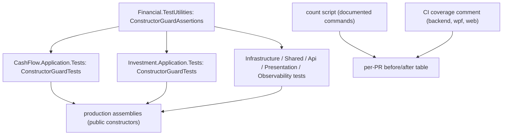

# Technical Specification: Low-Value Test Removal and Consolidation

**Complexity:** complex (test-only work across 20+ test projects and the web suite, spread over five PRs, with one small production deletion and one new shared test helper; no API, schema or persistence changes)

## 1. Technical Overview

**What.** Remove, merge and parameterize the tests that add count but no protection, so a green suite means behaviours are covered, not that boilerplate was repeated. Five groups of work:

1. **Pure deletions.** Tests that pass with the code under test deleted, duplicate another test, or pin something the compiler or framework already guarantees: the 35 `*_Null{Request,Body}_ReturnsBadRequest` controller tests together with the dead `if (request is null)` guards they execute, the 19 `ConvertBack_*Throws*` tests, the duplicate "two ids differ / non-empty id" tests (one "assigns non-empty ID" kept per aggregate root), `SyncState_Should_Have_Exactly_Four_Members`, the reflection line in `OpenLotTrackerTests`, the static-presence web tests (~10–15) and the per-endpoint camelCase tests.
2. **Constructor null-guard theory.** The ~177 per-class `Constructor_WithNullX_Throws` tests (plus the Observability, Swagger and NavigationService duplicates and the controller-constructor tests in `ControllerGuardClauseTests`) become one reflection-driven theory per production assembly. It discovers every public constructor and asserts `ArgumentNullException` naming the parameter, for each non-nullable reference parameter. Deleting a `?? throw` from any constructor fails it, which the per-class tests only caught by accident of someone having written one.
3. **Other .NET parameterization.** The 47 `CashFlowDataTests`, the 18 reference-converter tests, the 22 migrator scaffold tests, the finance-service triplets, the retry sync/async pairs and the ~20 getter echoes collapse into theories or one `Create_AssignsAllFields` per entity.
4. **Web `describe.each` tables.** The ~31 copy-pasted form-dialog contract tests become 3 tables and the ~36 list-tab template tests become ~12.
5. **Measurement and housekeeping.** Count before and after, confirm coverage did not regress, note the 7 untracked ghost test directories, tick the PRD.

**Why.** The audit (`docs/pending/tests.md`) found ~590 tests (about 7%) that could be removed or collapsed. They hide the real signal, slow refactors, and AI agents copy their patterns into new features. F09 will take its coverage baseline from this cleaned suite, so noise must go first; F07 rewrites only tests that survive this feature.

**Scope.**

**Included:** all five groups above; the new shared helper `ConstructorGuardAssertions` in `Financial.TestUtilities`; deleting the dead controller guards (production code, nothing else); a per-PR table naming the retained test that covers each removed group.

**Output contracts (Provides):** a consolidated suite with ≥ 550 fewer test methods and unchanged behavioural protection (consumed by F07 and F09).
**Input contracts (Consumes):** none.

**Excluded:**
- Rewriting weak or mirror tests, rethrow tests, trait categories, the new `Shared.Abstractions.Tests` project — F07.
- Culture/time determinism — F08. Deleting a test because it is flaky is not a F06 reason.
- The `ThreadPoolWarmup`/`Task.Delay(50)` WPF synchronization — F08.
- Any behaviour change in production code other than deleting guards proven unreachable (Section 8) and adding a missing constructor guard where the theory finds an unguarded parameter that should be guarded (each one called out in the PR).

## 2. Architecture Impact

Affected areas: `Tests/**` (many files), `Financial.Web/src/**/__tests__/**`, `Financial.Api/Controllers/*` (dead guards only), `Tests/Financial.TestUtilities/` (new helper), the P58 PRD (ticks in the last PR).

## 3. Technical Decisions

| Decision | Chosen Approach | Alternative Considered | Trade-off |
|----------|----------------|----------------------|-----------|
| D1. PR slicing | Five stages by area (below); each states its own before/after counts and coverage | One PR; one PR per group | Reviewable stages and one coverage check per stage, at the cost of five merge round-trips |
| D2. What "test method" means | A declared test: .NET `[Fact]`/`[Theory]` methods, web `it`/`test`/`.each` declarations. Not runner case counts | Runner-reported totals | A reflection theory still produces many cases at run time; the goal is fewer things to read and maintain. Runner totals will drop by less, and the PR says so |
| D3. Counting commands | Documented one-liners (below) run on `main` before and on the branch after; results pasted in each PR | A committed counting script | No new tooling for a one-off measurement; reproducible by copy-paste |
| D4. Null-guard theory scope | Non-nullable reference parameters of every public constructor of each production assembly that has constructor tests today, found with reflection and `NullabilityInfoContext` | Per-class tests kept, or a source generator | Reflection keeps one place to read and breaks when a guard is removed; nullable/optional parameters are excluded by annotation |
| D5. Building the other constructor arguments | `ConstructorGuardAssertions` creates interface arguments with a `DispatchProxy`-based do-nothing stub (BCL, no mocking library), uses `TimeProvider.System`, `NullLogger<T>`, `Options.Create(new T())`, and a small registry for the remaining concrete types; a parameter type with no factory fails the theory with the type name | Hand-written fakes per constructor | Matches "hand-written fakes remain the standard" for behaviour tests while avoiding a hundred bespoke fakes for a guard check; the registry is the one place to extend |
| D6. Unguarded parameters | If the theory finds a non-nullable reference parameter with no guard, either add the guard (a one-line production change, called out in the PR) or list it in an explicit allowlist with a reason | Silently skip | The theory must not pass by exclusion; every exemption is visible |
| D7. Parameterization form | xUnit `[Theory]` with `[MemberData]`/`[InlineData]` and a generic base class where the type varies (reference converters) | Source-generated or reflection-driven tests everywhere | Readable, debuggable in the IDE, no new infrastructure |
| D8. Removal safety | Each removed group is mapped to the retained test that covers the behaviour; line coverage may drop ≤ 1.0 point per job, branch coverage must not drop | Delete first, check coverage later | A group with no retained covering test is not removed (it is rewritten in F07 or kept) |
| D9. Ghost directories | Delete the 7 untracked directories locally only with the user's explicit confirmation, note it in the PR; no git change | Delete without asking | They are gitignored local leftovers, but deleting files is irreversible so it needs a yes |

### Assumptions

- The PRD's group sizes are estimates; measured on `main` at spec time: 35 null-body tests, 177 per-class constructor null-guard tests in 6 test projects, 19 `ConvertBack_*Throws*` tests, 47 `CashFlowDataTests` methods, 5 reference-converter test files, 5,377 `[Fact]`/`[Theory]` declarations and 2,132 web `it(`/`test(` declarations (7,509 declared tests). Stage 1 re-measures and records the exact baseline in its PR.
- The ≥ 550 target is taken from the PRD (about 125 removed plus ~470 saved by merging). If the measured total falls short, Stage 5 reports the gap and lists further candidates rather than padding the number.
- Applied defaults not in the PRD: D2, D3, D5, D6, D9. The slicing (D1) was chosen by the user.
- Duplicate-ID, finance-triplet, retry-pair and getter-echo tests are enumerated by name pattern at the start of their stage; the PR lists them, since the PRD gives counts but not names.

## 4. Component Overview

### Stage 1 — Pure deletions and dead guards (PR1)

| File Path | New/Modified | Purpose |
|-----------|--------------|---------|
| `Tests/Financial.Api.Tests/Controllers/ControllerGuardClauseTests.cs` | Modified | Delete the 35 null-body tests (constructor-guard tests in the same file move to Stage 2) |
| `Financial.Api/Controllers/*.cs` | Modified | Remove the `if (request is null) return BadRequest` guards on non-nullable `[FromBody]` parameters only; guards on nullable bodies stay (reachable) |
| WPF converter tests (`Tests/Financial.Presentation.Tests/...`) | Modified | Delete the 19 `ConvertBack_*Throws*` tests |
| Domain/Application test files holding duplicate ID tests | Modified | Keep one "assigns non-empty ID" per aggregate root |
| `Tests/Financial.Shared.Infrastructure.Tests/Sync/SyncStatusTests.cs` | Modified | Delete `SyncState_Should_Have_Exactly_Four_Members` |
| `Tests/Financial.Investment.Domain.Tests/Domain/OpenLotTrackerTests.cs` | Modified | Remove the `typeof(OpenLot).GetProperty("GainLoss")` reflection assertion and its comment; keep the behavioural lot assertions |
| Web test files | Modified | Delete static-presence tests (~10–15) and per-endpoint camelCase tests |

### Stage 2 — Constructor null-guard theory (PR2)

| File Path | New/Modified | Purpose |
|-----------|--------------|---------|
| `Tests/Financial.TestUtilities/ConstructorGuardAssertions.cs` | New | Enumerate public constructors of an assembly, build arguments (D5), expose `(type, constructor, parameter)` cases and the assertion that a null in that slot throws `ArgumentNullException` with that parameter name; honour the allowlist |
| `Tests/Financial.<Context>.<Layer>.Tests/ConstructorGuardTests.cs` | New (one per assembly) | `[Theory]` over the helper's cases for `CashFlow.Application`, `Investment.Application`, `CashFlow.Infrastructure`, `Investment.Infrastructure`, `Shared.Infrastructure`, `Api`, `Presentation.App`, `Observability` |
| Per-class `Constructor_With*Null*_Throws` tests (~177 across 6 projects, plus duplicates in `Observability`, Swagger and `NavigationService` tests) and the constructor tests in `ControllerGuardClauseTests.cs` | Modified/Deleted | Removed once the theory covers them; the file `ControllerGuardClauseTests.cs` is deleted |
| Production constructors with a missing guard | Modified (if any) | One-line guards found by the theory (D6) |

### Stage 3 — Other .NET parameterization (PR3)

| Area | Change |
|------|--------|
| `Tests/Financial.CashFlow.Domain.Tests/Entities/CashFlowDataTests.cs` (47) | `IdCollection<T>` behaviour tests plus one `MemberData` wiring theory that checks each `CashFlowData` collection is wired to its type |
| `Tests/Financial.CashFlow.Infrastructure.Tests/Persistence/*ReferenceConverterTests.cs` (5 files, 18 tests) | One generic `ReferenceConverterTests<T>` base with a derived class per converter |
| `Tests/Financial.CashFlowSpreadsheetImport.Tests/Migrations` (22 scaffold tests) | One theory per behaviour |
| Finance-service triplets (9 → 3), retry sync/async pairs, ~20 getter echoes | Theories; one `Create_AssignsAllFields` per entity |

### Stage 4 — Web `describe.each` tables (PR4)

| File Path | New/Modified | Purpose |
|-----------|--------------|---------|
| `Financial.Web/src/components/__tests__/*FormDialog.test.tsx` and `MoveAssetDialog.test.tsx` (13 files) | Modified | The shared contract (create mode renders empty, edit mode pre-fills, Save disabled with a validation message, server error shown and Save re-enabled, Cancel calls `onCancel`) becomes 3 `describe.each` tables fed by a per-dialog configuration; dialog-specific tests stay in the dialog's own file |
| `Financial.Web/src/components/__tests__/*Tab.test.tsx` (9 files) | Modified | The repeated list-tab template (loading, empty, error, populated, retry) becomes shared tables (~36 → ~12) |
| `Financial.Web/src/test-utils/` | Modified (if needed) | A small shared configuration type for the tables |

### Stage 5 — Measurement and ticks (PR5)

| File Path | New/Modified | Purpose |
|-----------|--------------|---------|
| P58 PRD | Modified | Tick the satisfied F06 boxes (own commit) |
| PR body | — | Final count table, per-job coverage comparison, the list of retained covering tests per group, the ghost-directory note |

### Counting commands (D3)

- .NET declared tests: `grep -rEn "^\s*\[(Fact|Theory)" Tests --include=*.cs | grep -v "/bin/\|/obj/" | wc -l`
- Web declared tests: `grep -rEn "^\s*(it|test)(\.each)?\(" Financial.Web/src --include=*.test.ts --include=*.test.tsx | wc -l`
- Theory case rows (informational): `grep -rEn "^\s*\[InlineData" Tests --include=*.cs | wc -l`

## 5. API Contracts

Skipped: no endpoint or DTO changes. The only API-adjacent change is removing guards that `[ApiController]` model validation makes unreachable; `Tests/Financial.Api.Tests/Contract/openapi-v1.snapshot.json` must stay byte-identical.

## 6. Data Model

Skipped: nothing persisted changes.

## 7. Testing Strategy

F06 deletes and merges tests, so verification is that protection did not drop:

- **Counts.** Before/after table in every PR using the Section 4 commands. Stage 5 shows the cumulative drop ≥ 550 declared test methods.
- **Coverage.** Each PR compares the `coverage-comment` rows (backend, wpf, web) with `main`'s last run: branch % must not drop, line % may drop ≤ 1.0 point. A PR that breaches either restores the offending group before merge.
- **Retained-test table.** Each PR body lists, per removed group, the retained test that covers the behaviour (for example: "35 controller null-body tests → `[ApiController]` model validation, covered by the endpoint tests in `Tests/Financial.Api.Tests` that post an empty body and expect 400").
- **Null-guard theory proof (Stage 2).** `ConstructorGuardTests` fails naming `type.parameter` when a `?? throw` is deleted: revert checks on at least one constructor per assembly (Application, Infrastructure, Api, Presentation), recorded in the PR. A second check: adding a constructor with an unguarded non-nullable reference parameter fails the theory until a guard or an allowlist entry is added.
- **Stage 3 proof.** For each parameterized group, deleting the behaviour under test (for example breaking one `ReferenceConverter` mapping) fails exactly one derived case.
- **Stage 4 proof.** Removing "Cancel calls onCancel" from one dialog makes only that dialog's row of the contract table fail.

**Acceptance mapping**

| PRD box | Verified by |
|---------|-------------|
| Total .NET + web test methods drop by ≥ 550 | Stage 5 count table |
| Branch coverage per job ≥ pre-cleanup | per-PR coverage comparison |
| Line coverage drops ≤ 1.0 point per job | per-PR coverage comparison |
| The 34 unreachable null-body tests and their dead guards deleted | Stage 1 diff (`ControllerGuardClauseTests.cs` null-body tests and the `request is null` branches) |
| One constructor null-guard reflection theory per assembly; removing a `?? throw` fails it | Stage 2 theories and revert checks |
| React dialog and list-tab contracts run as `describe.each` tables | Stage 4 |
| Each removal PR lists the retained covering test per removed group | PR bodies |

## 8. Error Handling

- **A guard that looks dead but is reachable.** Before deleting an `if (x is null)` guard, confirm the parameter is a non-nullable `[FromBody]` bound by an `[ApiController]`; nullable bodies and non-controller code keep their guards. The PR lists each deleted guard with that justification.
- **A parameter type the helper cannot construct.** The theory fails with `no argument factory for <Type>`; the fix is a registry entry, never a silent skip.
- **A removed group turns out to guard a behaviour no other test covers.** It is kept (or moved to F07 for rewriting) and the PR says so; the target count is not met by deleting unprotected behaviour.
- **Coverage drops past the allowance.** The PR restores the group with the highest coverage contribution and re-measures before merge.
- **Ghost directories.** Deleting them needs the user's explicit yes (D9); a declined or failed deletion is noted and does not block the PR.

## 9. Acceptance Criteria Mapping

See Section 7. No Cross-Feature Integration criterion names F06 as the consumer; F07 and F09 depend on its output, so the final PR states the exact test counts and line/branch percentages they should treat as the starting point.
