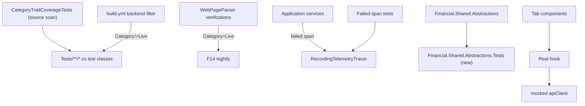

# Technical Specification: Test Rewrites and Re-Layering

**Complexity:** complex (touches ~700 test classes for traits, ~60 rethrow tests, a new test project, three web test files, CI filters and docs; no production behaviour, API or schema change)

## 1. Technical Overview

**What.** The surviving suite (after F06) is rewritten and re-layered so each test proves something and declares its level: "rethrows" tests assert the recorded failed span instead of only the exception, weak and mirror assertions become literal ones, every .NET test class carries a `Category` trait (`Unit`, `Integration`, `Live`), the nine manual web-parser verifications become `Category=Live` without `Skip`, `Shared.Abstractions` gets its own test project, Investment.Infrastructure CRUD tests prove a disk round-trip, and three web tab tests render the real hook over a mocked API client.

**Why.** A "rethrows" test that only asserts `Throw<T>()` passes with the `catch` block deleted, so it protects nothing; the span the service records on failure is the observable behaviour. Without levels, CI and local runs cannot filter live-network checks or run the fast tier alone, and `Shared.Abstractions` types are tested from an unrelated project. Tests that mock their own hook (web tabs) cannot catch a hook/API wiring break.

**Scope.**

**Included (full scope):**
- Failed-span tests replacing the "rethrows" tests in CashFlow.Application and Investment.Application services (61 test methods in 33 files today; the two in Investment.Domain are not span tests and are only reviewed).
- Rewrites: `DataQualityReportFormatterTests.Format_SalesExceedPurchases_NamesHoldingAndShortfall`, `InvestmentRepositoryFactoryTests...ResolvesPastFileCheck`, the `App.test.tsx` theme test, and the remaining wall-clock-relative web date tests (`UpcomingIncomePanel`, `DashboardPage`, `upcomingIncomeWindow`).
- `Category` trait on every .NET test class, a source-scan gate, the nine `Skip=` verifications to `Category=Live`, CI `backend` filter excluding `Live`.
- New `Tests/Financial.Shared.Abstractions.Tests` (in `Financial.slnx`, covered by `backend`).
- Investment.Infrastructure `CreditServiceTests` and `TransactionServiceTests` reload from disk and assert persisted state, or are deleted where Application tests already cover the rule.
- `TransactionsTab`, `CreditsTab`, `PriceHistoryTab` tests over the real hook.
- Docs: layer split, trait convention, literal-expectation rule.

**Output contracts (Provides):** the `Category` classification and the Live filter (consumed by F09 and F14), and `Financial.Shared.Abstractions.Tests` (consumed by F09's baseline).
**Input contracts (Consumes):** F06's consolidated suite; this feature only rewrites survivors.

**Excluded:**
- Production code changes (none expected; a defect found while rewriting is recorded, not fixed here).
- `Category=E2E`/`Smoke` on `Financial.App.E2ETests` (F13 owns them; the gate accepts them).
- The F09 coverage baseline and the F14 workflow.

## 2. Architecture Impact

Dependency direction is unchanged. The new test project references only `Financial.Shared.Abstractions` and `Financial.TestUtilities`.

## 3. Technical Decisions

| Decision | Chosen Approach | Alternative Considered | Trade-off |
|----------|----------------|----------------------|-----------|
| D1. Where traits live | Explicit `[Trait("Category", "...")]` on each test class, applied by a one-off script from a per-project default table, then hand-corrected for mixed projects | Assembly-level default trait | xUnit v2 merges class and assembly traits, so an `Integration` class in a `Unit` project would match both filters; explicit class traits keep filters exact. Costs one attribute per class |
| D2. Default level per project | Domain, Application, Architecture, Presentation, Observability, Frankfurter, GoogleIntegrations: `Unit`. Infrastructure projects, import tools, `Api.Tests` host-based classes (derive from `ApiEndpointTests` / use `ApiTestFactory`), Investment.Infrastructure `Services` real-JSON classes: `Integration`. `Api.Tests` host-less classes: `Unit`. WebPageParser verifications: `Live` | One level per project | Matches the PRD; classes needing a judgement call are listed in the PR |
| D3. Gate | `Financial.Architecture.Tests/CategoryTraitCoverageTests` scans `Tests/**/*.cs` (via `RepoRoot`), finds each class with `[Fact]`/`[Theory]` methods, and fails naming `file:line` when the class (or its base class in the same project) has no `Category` trait with value `Unit`, `Integration`, `Live`, `E2E` or `Smoke` | Reflection over test assemblies | Architecture.Tests does not reference test projects; the source scan mirrors `ProductionClockReadsTests` and needs no new references. Self-tests pin nested and base-class handling |
| D4. Live tests | Remove `Skip=` and tag `Category=Live`; CI `backend` filter becomes `Category!=E2E&Category!=Live`; `Live` tests never run on PRs | Keep `Skip` and add trait | PRD requires `Skip` removed so F14's `--filter Category=Live` runs them; they pass only when the sites are reachable, hence excluded from PR CI |
| D5. Failed-span test shape | One test per service, asserting `Throw<T>()` plus a recorded span whose `OperationResult` attribute is failed and whose `RecordedException` is the exact type, through a shared `TelemetryAssertions.ShouldHaveFailedSpan(...)` helper in `Financial.TestUtilities` | Inline assertions per test | One helper keeps the assertion identical across 30+ services and is the single place that knows the attribute key. Removing the service's `catch`/`MarkFailed` fails the test |
| D6. Count | The 61 rethrow methods collapse to one per service; a service keeps more than one only when its failure paths differ (distinct operation kinds) | Keep all 61 | Fewer, stronger tests; the PR lists the retained test for every removed method, as F06 requires |
| D7. Shared.Abstractions tests | New project with `UsdBasedExchangeRateProviderTests` (moved from Shared.Infrastructure.Tests), `CompensatingSaveHelperTests` (new), `RetryPolicyTests` (new) and `ConstructorGuardTests` (reusing `ConstructorGuardAssertions`) | Leave in Shared.Infrastructure.Tests | Tests live with the code they cover; coverage attributes correctly |
| D8. Infrastructure CRUD round-trip | `CreditServiceTests`/`TransactionServiceTests` in Investment.Infrastructure add, update and delete, then rebuild a repository from the same temp file (`InvestmentLoader.LoadSync`) and assert the persisted state; tests that only repeat a rule already covered in `Investment.Application.Tests` are deleted | Delete all | The adapter's value is persistence; the round-trip proves it |
| D9. Web tab tests | Mock `../../api/financialApiClient` (existing `vi.hoisted` pattern) and render the real hook through the tab with `renderWithFluent`; keep the `recharts` mock; assert visible outcomes (form appears, row added, error shown) | Keep mocking the hook | The test then fails when hook-to-client wiring breaks; recharts stays mocked because jsdom cannot lay it out |
| D10. Weak assertions | Literal, whole-output assertions; the theme test asserts the provider's theme through a stable token with a literal expected value instead of the Fluent-generated class and instead of reading the same theme object | Leave | Removes false-pass paths |

### Assumptions

- Applied without asking: D1-D10; stage order below; helper names `TelemetryAssertions` and `CategoryTraitCoverageTests`; the PRD's "35 rethrow tests" is superseded by the measured 61 methods in 31 service test files.
- The `IncomeServiceTests` split tests and `UkExpensePromptDialog.test.tsx:53` are already literal and pinned (verified at spec time); no work remains there. No `toISOString().slice(0,10)` remains in `Financial.Web/src`.
- Web tests that build expectations from `new Date()` instants (`UpcomingIncomePanel`, `DashboardPage`, `upcomingIncomeWindow`) are pinned with `vi.setSystemTime` and literal dates in Stage 5; `usePriceHistory`, `formatters` and `SyncStatusBanner` uses are reviewed and changed only if wall-clock-dependent.
- `Category` values are case-sensitive; `Smoke` is accepted on E2E classes alongside `E2E`.
- `ConstructorGuardTests` is added to the new project because it owns that assembly.

## 4. Component Overview

**Traits and Live (Stage 1)**

| File Path | New/Modified | Purpose |
|-----------|--------------|---------|
| `Tests/**/*Tests.cs` (every test class) | Modified | `[Trait("Category", ...)]` per D1/D2 |
| `Tests/Financial.Architecture.Tests/CategoryTraitCoverageTests.cs` | New | Source-scan gate (D3) plus self-tests |
| `Tests/Financial.WebPageParser.Tests/*VerificationTests.cs` (4 files, 9 tests) | Modified | `Skip` removed, `Category=Live` |
| `.github/workflows/build.yml` | Modified | `backend` filter excludes `Live` |

**Shared.Abstractions tests (Stage 2)**

| File Path | New/Modified | Purpose |
|-----------|--------------|---------|
| `Tests/Financial.Shared.Abstractions.Tests/Financial.Shared.Abstractions.Tests.csproj` | New | Test project (references Shared.Abstractions, TestUtilities, TimeProvider.Testing) |
| `.../Currencies/UsdBasedExchangeRateProviderTests.cs` | Moved | From Shared.Infrastructure.Tests |
| `.../Persistence/CompensatingSaveHelperTests.cs`, `.../Resilience/RetryPolicyTests.cs`, `.../ConstructorGuardTests.cs` | New | Direct tests |
| `Financial.slnx` | Modified | Project entry |

**Failed-span tests (Stages 3-4)**

| File Path | New/Modified | Purpose |
|-----------|--------------|---------|
| `Tests/Financial.TestUtilities/TelemetryAssertions.cs` | New | `ShouldHaveFailedSpan` (D5) |
| `Tests/Financial.CashFlow.Application.Tests/Services/*ServiceTests.cs` | Modified | Rethrow tests become failed-span tests (Stage 3) |
| `Tests/Financial.Investment.Application.Tests/Services/*ServiceTests.cs` | Modified | Same (Stage 4); Investment.Domain's two "rethrow" tests reviewed |

**Rewrites (Stage 5)**

| File Path | Change |
|-----------|--------|
| `Tests/Financial.InvestmentDataQualityReport.Tests/` formatter tests | Exact output lines |
| `Tests/Financial.Investment.Infrastructure.Tests/Repositories/InvestmentRepositoryFactoryTests.cs` | Positive outcome for `ResolvesPastFileCheck` |
| `Financial.Web/src/__tests__/App.test.tsx` | Theme assertion per D10 |
| `Financial.Web/src/components/dashboard/__tests__/UpcomingIncomePanel.test.tsx`, `src/pages/__tests__/DashboardPage.test.tsx`, `src/utils/__tests__/upcomingIncomeWindow.test.ts` | Pinned time, literal dates |

**Persistence round-trip (Stage 6):** `Tests/Financial.Investment.Infrastructure.Tests/Services/CreditServiceTests.cs`, `TransactionServiceTests.cs`.

**Web tabs (Stage 7):** `Financial.Web/src/components/__tests__/TransactionsTab.test.tsx`, `CreditsTab.test.tsx`, `PriceHistoryTab.test.tsx`.

**Docs and PRD (Stage 8):** `docs/rules/implementation.md` §Tests, `.claude/skills/testing-guide-Financial/SKILL.md` and `references/file-conventions.md`, `CLAUDE.md` (test commands), `docs/ci-affected-pipeline.md`, the PRD.

## 5. API Contracts

Skipped: no endpoint, DTO or OpenAPI change.

## 6. Data Model

Skipped: nothing persisted changes.

## 7. Testing Strategy

| Stage | Proof |
|-------|-------|
| 1 | `CategoryTraitCoverageTests` passes on the tree and its self-test fails on a class without the trait; `--filter Category=Unit` and `Category=Integration` partition the non-Live tests with none uncategorised; `Category=Live` selects exactly the 9 tests; the `backend` command excludes Live |
| 2 | New project builds and runs; `UsdBasedExchangeRateProviderTests` moved with the same count; `CompensatingSaveHelperTests` covers success, failure and the compensation call; project listed in `Financial.slnx`; `backend` coverage includes it |
| 3-4 | For each service group, deleting the `catch`/`MarkFailed` locally makes its failed-span test fail (recorded in the PR); every removed method maps to a retained test |
| 5 | Formatter test asserts the exact `OVERSOLD` lines; factory test asserts the positive outcome; theme test fails when the provider's theme token changes; web date tests pass under `TZ=Europe/London` and `TZ=UTC` |
| 6 | Each CRUD test reloads from disk and asserts the persisted row; reverting the save call fails it |
| 7 | The three tab tests contain no `vi.mock` of their own hook; breaking the hook's client call fails them |
| 8 | Docs updated; PRD boxes ticked in their own commit |

**Acceptance mapping**

| PRD box | Covered by |
|---------|-----------|
| Deleting the `catch` in any service fails its failed-span test | Stages 3-4 |
| Every .NET test class has a `Category` trait and a test asserts none missing | Stage 1 `CategoryTraitCoverageTests` |
| `backend` excludes `Category=Live` | Stage 1 build.yml |
| 9 live verifications no longer use `Skip=` and pass with `--filter Category=Live` | Stage 1 (run locally; result depends on site availability, recorded in the PR) |
| `Financial.Shared.Abstractions.Tests` exists, in slnx, covers `CompensatingSaveHelper` | Stage 2 |
| Investment.Infrastructure CRUD tests reload from disk or are removed | Stage 6 |
| Tab tests do not mock their own hook | Stage 7 |
| Docs document layer split, traits, literal expectations and the no-null-guard rule | Stage 8 (the null-guard rule exists since F06) |

Cross-Feature Integration: "F07 rewrites touch only tests that survived F06" holds by construction (Stages 3-7 edit current files only); "F14's live-check step selects exactly the tests F07 tagged Live" is covered by the Stage 1 `Category=Live` count check; F09 and F14 consume traits and the new project (not ticked here).

## 8. Error Handling

- Gate failure message: `Test class <Name> (<file>:<line>) has no [Trait("Category", ...)]; use Unit, Integration or Live`.
- A Live test that fails because a site changed is not a PR failure (excluded from `backend`); F14 reports it.
- A rewritten assertion that exposes a real production defect is recorded in the PR body as a finding and fixed in a separate change, not here.

## 9. Acceptance Criteria Mapping

See Section 7: the eight F07 PRD boxes. The mirror-test bullet is already satisfied (Assumptions) and verified, not changed.
