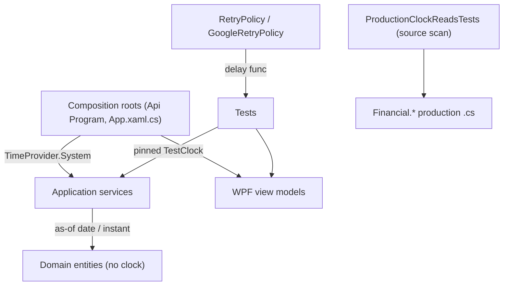

# Technical Specification: Time and Culture Determinism

**Complexity:** complex (a cross-cutting change across Domain, Application, Infrastructure and the WPF view models, ~550 test call sites, retry/delay seams, culture handling, and a permanent gate; no API, schema or user-visible behaviour change)

## 1. Technical Overview

**What.** Every production read of the wall clock in the `Financial.*` projects goes through an injected `TimeProvider` (Application, Infrastructure, WPF view models) or an explicit "as of" argument (Domain, which stays dependency-free). Tests then pin the clock instead of reading it. In the same feature: retry backoff and polling get an injectable delay so no test waits in real time, the ten WPF `Task.Delay` synchronisations and `ThreadPoolWarmup.cs` go away, machine-format parsing uses the invariant culture with pt-BR proof, and a permanent test keeps wall-clock reads out of production code.

**Why.** Today a test that builds its data from `DateTime.Today` and a service that reads `DateTime.Today` agree only by coincidence: they diverge across midnight, at month ends, in January, and between a UTC runner and a BST laptop. Two flakes surfaced on CI during P58 alone: `ControleMaeViewModelTests.RefreshEntriesAsync_LoadsEntriesFromDate` (an async race plus a wall-clock date) and `CreditCardCalendarSyncServiceTests` (real 2 s polling). The production clock reads that are not testable also hide date-rule defects (payments-due rollover, annual-average, FX "today vs. future") that F10 needs to pin.

**Scope.**

**Included (user-confirmed: backend + WPF; Integrations/Tools out):**
- Production wall-clock reads in `Financial.*`: 22 backend sites (Investment.Domain 6, Investment.Application 8, CashFlow.Application 4, Investment.Infrastructure 1, Shared.Abstractions 2, Shared.Infrastructure 1) and 31 in `Financial.App` (29 view-model sites in ~26 view models, 1 shared helper path, and `MonthYearPicker`).
- Test migration of ~255 backend and ~303 WPF wall-clock sites to a pinned clock, with explicit January, month-end and midnight cases where the logic branches on them.
- Retry/backoff delay seam (`RetryPolicy`, `GoogleRetryPolicy`), deterministic signals in `CreditCardCalendarSyncServiceTests` and `DebouncedJsonStorageTests`, removal of `Task.Delay`/`ThreadPoolWarmup` from `Financial.Presentation.Tests`.
- Culture: invariant parsing of machine-format values, pt-BR theories, web formatter locale tests, `waitFor` timeouts at the default.
- A permanent source-scan test that fails on a wall-clock read in `Financial.*` production code.

**Output contracts (Provides):** `TimeProvider` at every Application/Infrastructure/WPF site, as-of arguments in Domain, delay seams (consumed by F10); deterministic coverage output (consumed by F09).
**Input contracts (Consumes):** F01's pinned `TZ=Europe/London` / `LANG=en-GB` (done).

**Excluded:**
- `Integrations/WebPageParser` (4 reads stamping a live quote's fetch time) and `Tools/CashFlowSpreadsheetImport` (2 reads, a hand-run CLI): vendor/CLI code outside coverage; documented as the clock boundary.
- Changing any date rule's behaviour. A site that is wrong today (for example `todayIsoDate` UTC-vs-local, fixed in F04) is out of scope here; F10 owns the rollover and annual-average edge cases.
- The F11 hygiene scan's diff-only behaviour (Stage 8 only widens one rule).

## 2. Architecture Impact

Dependency direction is unchanged. Domain gains parameters, not references. `TimeProvider` is already registered in both Application DI extensions (`TimeProvider.System`), so the WPF app, which composes those, already has one to inject.

## 3. Technical Decisions

| Decision | Chosen Approach | Alternative Considered | Trade-off |
|----------|----------------|----------------------|-----------|
| D1. Application / Infrastructure / WPF | Constructor-injected `TimeProvider`, required parameter | Optional parameter defaulting to `TimeProvider.System` | A required parameter makes a missed call site a compile error (PRD error-handling rule) and keeps `ConstructorGuardTests` honest; costs edits at every construction site, concentrated in test `CreateViewModel()`/`CreateSut()` helpers |
| D2. Domain | An `asOf`/`now` argument supplied by the Application caller (`GetLocalNow()` for dates, `GetUtcNow()` for instants) | Inject `TimeProvider` into entities | Domain stays dependency-free (PRD) |
| D3. Local vs UTC | Date rules use `TimeProvider.GetLocalNow()` (host zone), timestamps use `GetUtcNow()` | One kind everywhere | Matches today's `DateTime.Today` (local date) vs `DateTimeOffset.UtcNow` (instant) semantics exactly, so no rule changes |
| D4. Test clock | `Microsoft.Extensions.Time.Testing.FakeTimeProvider` (the package `Shared.Infrastructure.Tests` already used, now referenced by `Financial.TestUtilities`), created through `TestClock.At(...)` with named pinned instants and the London local zone; the old hand-written fixed-instant fake is deleted | Extend the hand-written fake | Two same-named fakes with different timer semantics were a trap (a fake without timers silently fell back to real time); one fake whose timers fire on `Advance` also lets `DebouncedJsonStorage` retry delays be stepped (see D5). Decided during Stage 1 review |
| D5. Delays | An injected `Func<TimeSpan, CancellationToken, Task>` (default `Task.Delay`) in `RetryPolicy`/`GoogleRetryPolicy`; tests pass a recording fake that completes immediately and assert the requested delays (2 s, 4 s, ...) | `Task.Delay(timeSpan, TimeProvider)` with a fake that owns timers | PRD names an injected delay function; avoids teaching the fake timers. The synchronous retry variant stops using `Thread.Sleep` by blocking on the same delegate |
| D6. WPF waits | View models expose the `Task` of the work a command starts (or the command's own `ExecutionTask`); tests `await` it | Keep delays, raise timeouts | The root cause of both the 10 `Task.Delay` sites and `ThreadPoolWarmup` is fire-and-forget work with no handle; fixing the handle removes both |
| D7. `MonthYearPicker` | Static dependency-property defaults use `TimeProvider.System.GetLocalNow()` directly | Inject into a control | A XAML control cannot take constructor injection; the rule is "no `DateTime.Today`/`Now`/`UtcNow` tokens in `Financial.*`", and `TimeProvider.System` is allowed only in composition roots and this control |
| D8. Culture | Machine-format values (`GoogleSheetValueParser`, `GoogleFinanceParsing`, any persisted/API string parsed in WPF) parse with `CultureInfo.InvariantCulture`; user input in WPF keeps current-culture parsing through `DecimalInputHelper`/the validators | Invariant everywhere | User typing "9,40" under pt-BR must keep working; only values that cross a process boundary must not depend on the host |
| D9. pt-BR proof | A `TEST_CULTURE` environment variable read by a module initializer in `Financial.TestUtilities` sets the default thread culture (default en-GB), so `TEST_CULTURE=pt-BR dotnet test` runs the whole suite in pt-BR locally | Change the OS regional setting | Reproducible without touching the machine; CI stays en-GB (F01) |
| D10. Verifying "any clock" | The permanent source scan (zero reads in production) plus pinned-clock cases for January, 31st to 1st and 00:30 | Set the OS clock to 31 Jan 23:59 etc. | Once nothing reads the real clock, the suite cannot depend on it; changing the OS clock needs admin rights and breaks the dev machine. The PRD box is amended |
| D11. Permanent gate | `Financial.Architecture.Tests/ProductionClockReadsTests` scans `Financial.*` production `.cs` for `DateTime.(Now\|Today\|UtcNow)` and `DateTimeOffset.(Now\|UtcNow)` and allows only `TimeProvider.System` in the composition roots and `MonthYearPicker` | Widen F11's diff-only rule only | Whole-tree and independent of the PR diff; F11's rule is also widened to drop its `TimeProvider`-in-file precondition for `Financial.*` |

### Assumptions

- Applied without asking (no PRD detail): D1-D11; WPF view models take a required `TimeProvider`; stage order below; `TEST_CULTURE` env var name; named pinned instants in `TestClock` are `Default` = `2026-10-05T12:00:00+01:00` (chosen after the latest hard-coded fixture dates in the suite, so none of them is "in the future"), `EndOfJanuary` = `2026-01-31T23:59:00+00:00`, `StartOfMarch` = `2026-03-01T00:30:00+00:00`, `FirstOfJulyJustAfterMidnight` = `2026-07-01T00:30:00+01:00`.
- The PRD's "17 sites" is the backend list; the real count is 22 backend (extra: `AssetPriceHistoryService`, `Asset.cs`, `YahooFinanceService`, a few repeated reads inside listed files). Discovery by grep at implementation time is authoritative; the permanent scan is what proves completeness.
- `Task.Delay` in non-WPF tests (CashFlow/Investment repository tests waiting 300 ms or 2 s for a negative, `Frankfurter` hanging-handler test using `Timeout.Infinite`) is out of this feature unless it appears in a flake; the PRD only requires `CreditCardCalendarSyncServiceTests`, `DebouncedJsonStorageTests:137` and the WPF project. They stay on F11's diff-only rule.
- The web side needs no clock change: F04 already pinned `todayIsoDate`; F08 only touches web `waitFor` timeouts and adds formatter locale tests.

## 4. Component Overview

**Test infrastructure (Stage 1)**

| File Path | New/Modified | Purpose |
|-----------|--------------|---------|
| `Tests/Financial.TestUtilities/FakeTimeProvider.cs` | Deleted | Replaced by the Microsoft fake (D4) |
| `Tests/Financial.TestUtilities/TestClock.cs` | New | Named pinned instants and factory helpers |
| `Tests/Financial.TestUtilities/TestCulture.cs` | New | Module initializer: `TEST_CULTURE` (default en-GB) applied as default thread culture |
| `Financial.Shared.Abstractions/Resilience/RetryPolicy.cs` | Modified | Delay seam; sync variant no longer `Thread.Sleep` |
| `Integrations/GoogleCore/GoogleRetryPolicy.cs` | Modified | Forwards the delay seam |
| `Tests/Financial.GoogleIntegrations.Tests/GoogleRetryPolicyTests.cs` | Modified | Assert requested delays without waiting; whole class < 1 s |
| `Tests/Financial.CashFlow.Application.Tests/Services/CreditCardCalendarSyncServiceTests.cs`, `Tests/Financial.Shared.Infrastructure.Tests/Persistence/DebouncedJsonStorageTests.cs` | Modified | Deterministic completion signals instead of polling/`Task.Delay` |

**Backend production (Stages 2-3)**

| File Path | New/Modified | Change |
|-----------|--------------|--------|
| `Financial.Investment.Domain/Entities/AssetPriceSnapshot.cs`, `DisposalRecord.cs`, `TaxClassification.cs`, `Asset.cs` | Modified | "As of" parameter replaces the clock read; callers pass it |
| `Financial.Investment.Application/Services/AssetPriceLookupService.cs`, `AssetPriceHistoryService.cs`, `DividendService.cs`, `PortfolioAssetSummaryService.cs`, `XirrCalculationService.cs` and the remaining Application reads | Modified | Inject `TimeProvider`, pass as-of into Domain |
| `Financial.CashFlow.Application/Services/CardStatementService.cs`, `ControleMaeService.cs`, `InvestmentSnapshotService.cs`, `TitheService.cs` | Modified | Inject `TimeProvider` |
| `Financial.Shared.Abstractions/Currencies/FxRates/UsdBasedExchangeRateProvider.cs`, `Financial.Shared.Infrastructure/Persistence/FxRates/FxRateJsonStore.cs`, `Financial.Investment.Infrastructure/Services/YahooFinanceService.cs` | Modified | Inject `TimeProvider` |
| DI extensions and composition (`Financial.Api/Program.cs`, `App.xaml.cs`) | Modified | Pass the registered `TimeProvider` where constructions are explicit |

**WPF production (Stages 4-5)** — constructor gains a required `TimeProvider`; `DateTime.Today` becomes `_time.GetLocalNow().Date`:

| Group | View models |
|-------|-------------|
| CashFlow (Stage 4) | `AdjustmentWorkflowViewModel`, `AnnualSummaryViewModel`, `ControleMaeViewModel`, `ExpenseWorkflowViewModel`, `IncomeSplitViewModel`, `IncomeWorkflowViewModel`, `InvestmentSnapshotsViewModel`, `MensaisViewModel`, `MonthlyViewModel`, `TransferWorkflowViewModel`, `UkExpensePromptDialogViewModel`, `WithdrawalViewModel`; control `Components/MonthYearPicker.xaml.cs` (D7) |
| Investment (Stage 5) | `AssetDetailsViewModel`, `CorporateActionFormViewModel`, `CreditDialogViewModel`, `CreditsTabViewModel`, `UpcomingIncomeViewModel`, `PriceDialogValidation`/`PriceDialogViewModel`, `PriceHistoryTabViewModel`, `TransactionDialogViewModel`, `TransactionsTabViewModel`, `PeriodFilterHelper` callers |

**Waits (Stage 6)** — the view models behind `IncomeWorkflowViewModelTests:288`, `InvestmentSnapshotsViewModelTests:345,376,399,404` and the `Task.Delay(10/25)` helper loops in `AssetDetailsViewModelCoverageTests`, `InvestmentSnapshotsViewModelTests`, `CorporateActionsTabViewModelTests`, `SettingsIntegrationsViewModelTests`, `TransactionsTabViewModelTests` expose an awaitable task; `Tests/Financial.Presentation.Tests/ThreadPoolWarmup.cs` deleted.

**Culture and web (Stage 7)** — `Integrations/GoogleSheets/GoogleSheetValueParser.cs`, `Integrations/WebPageParser/GoogleFinanceParsing.cs`, WPF machine-value parses (for example `InvestmentSnapshotsViewModel` suggested values), `Financial.Web/src/components/__tests__/DetailPanel.test.tsx` (266, 358, 369), `Financial.Web/src/pages/__tests__/MonthlyPage.test.tsx` (1002, 1150), a new `Financial.Web/src/utils/__tests__/formattersLocale.test.ts`.

**Gate and docs (Stage 8)** — `Tests/Financial.Architecture.Tests/ProductionClockReadsTests.cs`, `.github/scripts/test-hygiene.sh` (+ self-test) widened per D11, `docs/rules/implementation.md` §Tests, `testing-guide-Financial`, `CLAUDE.md`, `docs/ci-affected-pipeline.md`.

## 5. API Contracts

Skipped: no endpoint, DTO or OpenAPI change. The public C# surface that changes is internal composition: constructors and Domain method parameters.

## 6. Data Model

Skipped: nothing persisted changes. Instants stored today as `DateTimeOffset.UtcNow` keep the same value semantics (UTC instant from `GetUtcNow()`).

## 7. Testing Strategy

**Per stage** (every stage keeps the suite green and its own coverage non-decreasing for branch coverage per F06's rule):

| Stage | Proof |
|-------|-------|
| 1 | `GoogleRetryPolicyTests` < 1 s total and asserts delays `2 s, 4 s` for retries 1, 2; `CreditCardCalendarSyncServiceTests` and `DebouncedJsonStorageTests:137` contain no real-time wait; revert of the seam makes the retry tests slow/fail |
| 2-3 | Each migrated service has a test with the pinned clock at: a mid-month day, 31 Jan 23:59 (year/month rollover), 1 Mar 00:30 (month start), 1 Jul 00:30 BST (UTC-date vs local-date); Domain tests pass an as-of date and never read the clock |
| 4-5 | View-model tests pin the clock through `TestClock`; form-default tests assert the literal date; `ControleMaeViewModelTests.RefreshEntriesAsync_LoadsEntriesFromDate` asserts a literal and awaits the refresh |
| 6 | `grep Task.Delay Tests/Financial.Presentation.Tests` is empty; `ThreadPoolWarmup.cs` is gone; the Presentation suite passes 10 consecutive local runs and on CI at the default 2-core thread pool |
| 7 | Theories: `"12.5"` machine value under pt-BR -> 12.5 (fails on the pre-fix code); user input `"9,40"` under pt-BR -> 9.40; web formatter tests for `en-GB` and `pt-BR` with an explicit locale; no `waitFor` with a timeout above the default |
| 8 | `ProductionClockReadsTests` passes on the tree and fails when a `DateTime.Today` is added to a `Financial.*` file; `test-hygiene.test.sh` case for the widened rule |

**Acceptance mapping**

| PRD box | Covered by |
|---------|-----------|
| 0 `DateTime.Now/Today/UtcNow` in production code outside `TimeProvider` adapters | `ProductionClockReadsTests` (Financial.*; Integrations/Tools excluded by decision) |
| Domain types receive as-of dates rather than a `TimeProvider` | Domain tests and the Architecture dependency tests (no `TimeProvider` field in Domain) |
| Suite passes with the clock at 31 Jan 23:59, 1 Mar 00:30, 1 Jul 00:30 BST | pinned-clock cases per D10 (box amended: no OS clock change) |
| Suite passes under `LANG=pt-BR` | `TEST_CULTURE=pt-BR dotnet test` run, result recorded in the PR (D9; box amended from `LANG`) |
| 0 `Task.Delay` in `Financial.Presentation.Tests`; `ThreadPoolWarmup.cs` deleted | Stage 6 |
| `GoogleRetryPolicyTests` runs in < 1 s | Stage 1 |
| `"12.5"` under pt-BR returns 12.5; `"9,40"` returns 9.40 | Stage 7 theories |
| No web `waitFor` with a timeout above the default | Stage 7 grep recorded in the PR |

Cross-Feature Integration: "F08's pinned-clock and culture tests run under F01's pinned TZ/LANG and pass when the host timezone differs" is covered by running the migrated suites under `TZ=UTC` and `TEST_CULTURE=pt-BR` once locally, recorded in the Stage 8 PR.

## 8. Error Handling

- A Domain method that previously read the clock now requires an as-of argument: every caller passes `GetLocalNow()` / `GetUtcNow()` from Application; a missed call site is a compile error, not a silent default.
- A WPF view model constructed without a `TimeProvider` fails to compile; the DI lambdas in `App.xaml.cs` pass the registered provider.
- Culture regression: the pt-BR theory fails and names the input value.
- The source scan fails with `file:line` of the offending read and the replacement to use.
- A test that still needs a real delay (none expected) uses `// hygiene-allow: <reason>` per F11.

## 9. Acceptance Criteria Mapping

See Section 7. PRD boxes covered: the nine F08 boxes (two amended in the last PR: D9 `TEST_CULTURE` instead of `LANG`, D10 pinned cases instead of an OS clock change; the first box is scoped to `Financial.*` by the confirmed decision). Cross-Feature Integration: F08 under F01's pinned environment (above). F10 consumes F08's seams; not ticked here.
