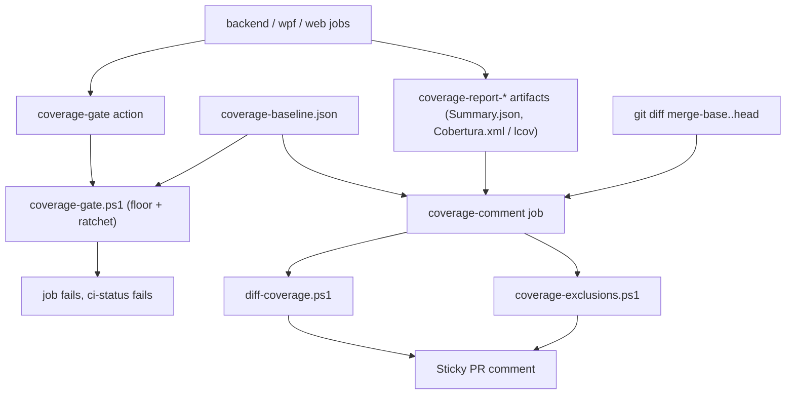

# Technical Specification: Coverage Gate v2

**Complexity:** medium (CI-only: one composite action, three scripts with self-tests, workflow wiring, one config exclusion, one committed baseline file; no application code)

## 1. Technical Overview

**What.** Turn the three job-wide line floors into a ratchet that measures branch coverage too, and add the changed-code signal the PRD asks for:

1. `coverage-baseline.json` at the repo root holds per-job line and branch coverage (`backend`, `wpf`, `web`).
2. `.github/actions/coverage-gate` fails when line **or** branch coverage drops more than 0.5 points below the baseline, and fails closed when the baseline or the branch figure is missing. The 90% line floor stays as a tripwire.
3. Web coverage stops counting `src/test/**` and `src/test-utils/**`.
4. The sticky PR comment shows, per job: Line %, Branch %, delta against the baseline, Diff line %, Diff branch % and a verdict.
5. Diff coverage (changed lines and branches in the in-scope source directories) is computed from the merged coverage reports against the PR's merge base, advisory first.
6. A PR that edits the coverage exclusions, or the baseline file itself, gets a warning line in the comment.

**Why.** Today each job gates only line coverage at 90% with ~5 points of headroom, so a PR can delete branch handling, or add an untested class, and stay green. The branch numbers moved a lot during F06-F08 (backend 87.8 to 90.4, wpf 80.7 to 82.9, web 87.5 to 87.7 on the last green `main` run), so a ratchet taken now locks in real protection rather than the noisy pre-cleanup suite. Exclusions in `coverlet.runsettings` and `vite.config.ts` can currently grow in the same PR that adds the untested code they hide.

**Scope.**

**Included (Core + Full, chosen by the user):**
- `coverage-baseline.json`, the ratchet in the gate, fail-closed behaviour, the web helper exclusion.
- Extended PR comment (Branch %, delta, Diff line, Diff branch, verdict, baseline-changed and exclusion-changed warnings).
- Diff coverage script (advisory) and exclusion-change detection, both with self-tests run in the `changes` job.
- Docs: CLAUDE.md coverage paragraph, `docs/ci-affected-pipeline.md` (ratchet, baseline-update rule, diff-coverage observation window and the criteria for switching it to blocking).

**Consumes (PRD):** F06 consolidated suite (baseline is not taken from the noisy suite), F07 `Category` traits and `Live` exclusion (coverage runs are already `Category!=Live`), F08 deterministic coverage output.
**Provides (PRD):** the baseline and ratchet that F10's coverage gains are captured by.

**Excluded:**
- Switching diff coverage to blocking. This feature ships the advisory mode and a single switch (D8); flipping it is a separate PR after the 2-4 week window and at least 20 PRs, as the PRD requires.
- Raising any threshold above today's numbers, F10's test additions, mutation scores (F14).
- Changing what `coverlet.runsettings` excludes (only the warning about changes to it).

**Assumptions / decisions recorded (Auto-Accept, review and override):**

| # | Decision | Reason |
|---|---|---|
| D1 | The gate logic moves out of the action's inline script into `.github/scripts/coverage-gate.ps1`, called by the composite action, with `coverage-gate.test.ps1` as its self-test | The inline script cannot be tested; the repo's existing pattern for CI logic is a script plus a `*.test.sh` run in the `changes` job (`detect-changes`, `test-hygiene`). PowerShell rather than bash because the action is already `pwsh` and the dev machine runs `pwsh` but not Python |
| D2 | Baseline values are the `summary.linecoverage` and `summary.branchcoverage` figures from each job's reportgenerator `Summary.json`, exactly as the gate reads them today (one decimal) | The gate and baseline read the same field, so the 0.5-point tolerance (10x the rounding step) is the only slack. Boundary tests use deltas of 0.4 and 0.6 |
| D3 | The baseline is taken from a `main` run **after** the web exclusion has merged, read from that run's `coverage-report-*` artifacts. Two reruns of that commit are compared before the file is committed | PRD cross-feature criterion; the exclusion changes the web number, and an unstable number cannot be ratcheted. The rerun is requested from the user (outward-facing) |
| D4 | The ratchet lives in the three existing jobs (inside `coverage-gate`), so a job skipped by path classification skips its ratchet and `ci-status` is unaffected | Matches today's skip semantics (PRD Error Handling) |
| D5 | A missing or unparsable `coverage-baseline.json`, a missing key for the job, or a missing `branchcoverage` all fail the step with `coverage-baseline.json missing or invalid` (or the specific reason) | PRD: fail closed |
| D6 | Diff coverage is a custom `pwsh` script, not `diff-cover` | The PRD thresholds include a diff-**branch** figure; as far as I know `diff-cover` reports line coverage only (not verified). A custom script over Cobertura and lcov adds no dependency and is testable offline. Revisit if the script grows past ~200 lines |
| D7 | Diff coverage reads a merged Cobertura per .NET job (reportgenerator gets `Cobertura` added to its report types) and `coverage/lcov.info` for web. The merged report is produced under the same assembly filters as the summary, so each job's diff is scoped like its number | Backend produces 19 Cobertura files; the merged one is the only form scoped by the existing assembly filters |
| D8 | Diff coverage is advisory through a repository variable-free switch: an `env` value `DIFF_COVERAGE_BLOCKING` in `build.yml`, default `false`. When `true`, a diff figure below threshold fails the comment job. Merge-base unavailable (shallow clone) prints `not computed` and never blocks | Keeps the later blocking PR a one-line change that cites the observed false-positive rate |
| D9 | Scope for diff coverage is the PRD list: changed files under `Financial.*.Domain`, `Financial.*.Application`, `Financial.Api`, `Financial.App/ViewModels` and `Financial.Web/src/{hooks,utils,components,pages}`; thresholds 80% diff-line and 70% diff-branch. A PR with no in-scope changed lines shows `n/a` | PRD |
| D10 | The comment job checks out the repository (full history), downloads the three coverage artifacts, and computes deltas and diff coverage itself; the gate's outputs keep carrying the job's line and branch figures | The comment job has no access to the jobs' workspaces today; artifacts are already uploaded |
| D11 | Exclusion-change detection compares the exclude lists of `coverlet.runsettings` (`<Exclude>` entries) and `Financial.Web/vite.config.ts` (`coverage.exclude` entries) at the merge base and at head and lists only **added** patterns. It is advisory | PRD Full Scope; removed exclusions only raise the bar |
| D12 | The warning for a changed `coverage-baseline.json` is its own comment line, independent of the exclusion warning | PRD: "updated only by a PR that changes this file, which the PR comment flags" |
| D13 | The web exclusion is added to `coverage.exclude` in `vite.config.ts` as `src/test/**` and `src/test-utils/**`, keeping the existing entries | PRD |

## 2. Architecture Impact

**Design answers (`docs/rules/design.md`):**
1. *Where does this belong?* CI configuration and scripts (`.github/**`), one frontend build config, root-level data file and docs. No bounded-context or presentation code.
2. *Layers touched:* none of Domain/Application/Infrastructure/Presentation.
3. *What keeps Domain from learning about Infrastructure?* Nothing changes.
4. *SOLID:* SRP — the gate script decides pass/fail, the diff script computes diff coverage, the exclusion script lists added patterns, and the comment job only lays them out. DIP — each script reads files and arguments, not workflow context, so each is testable offline.

| Component | Path | Change |
|---|---|---|
| Baseline | `coverage-baseline.json` | New |
| Gate script | `.github/scripts/coverage-gate.ps1` | New: ratchet and floor logic |
| Gate self-test | `.github/scripts/coverage-gate.test.ps1` | New |
| Gate action | `.github/actions/coverage-gate/action.yml` | Calls the script; new inputs and outputs |
| Diff coverage | `.github/scripts/diff-coverage.ps1` | New |
| Diff self-test | `.github/scripts/diff-coverage.test.ps1` | New |
| Exclusion guard | `.github/scripts/coverage-exclusions.ps1` | New |
| Exclusion self-test | `.github/scripts/coverage-exclusions.test.ps1` | New |
| Workflow | `.github/workflows/build.yml` | Baseline inputs, `Cobertura` report type, self-test steps in `changes`, rebuilt `coverage-comment` job |
| Web coverage config | `Financial.Web/vite.config.ts` | Two excludes |
| Docs | `CLAUDE.md`, `docs/ci-affected-pipeline.md` | Ratchet, baseline rule, diff coverage |



## 3. Technical Decisions

See D1-D13 in §1. Trade-offs:

| Decision | Chosen Approach | Alternative Considered | Trade-off |
|---|---|---|---|
| Ratchet precision | One-decimal `Summary.json` figures, 0.5-point tolerance | Recompute from covered/total counts | Counts are exact but the baseline would then not match what the gate prints; the tolerance dwarfs the rounding |
| Where deltas are computed | Gate fails on the ratchet; the comment job recomputes the delta for display | Pass deltas through job outputs | One more read of the baseline, but no output plumbing and the comment still works when a job failed |
| Diff tool | Custom pwsh | `diff-cover` | Owns ~150 lines and parsing of two formats; gains branch figures and no Python dependency |
| Baseline refresh | Hand-edited file in a normal PR, flagged in the comment | Auto-update on `main` | A person decides each ratchet move; costs one small PR per move |

## 4. Component Overview

**CI and scripts:**

| File Path | New/Modified | Purpose | Key Responsibilities |
|---|---|---|---|
| `coverage-baseline.json` | New | Ratchet baseline | `backend`, `wpf`, `web` each with `line` and `branch` |
| `.github/scripts/coverage-gate.ps1` | New | Gate decision | Read `Summary.json` and the baseline; floor, ratchet, fail-closed; write step summary and outputs |
| `.github/scripts/coverage-gate.test.ps1` | New | Self-test | Synthetic summaries and baselines for every branch of the gate |
| `.github/actions/coverage-gate/action.yml` | Modified | Composite action | Pass `baseline-key`, `baseline-path`, call the script, expose line, branch, emoji, deltas |
| `.github/scripts/diff-coverage.ps1` | New | Changed-code coverage | Parse the unified diff, map changed lines and branches onto Cobertura or lcov, apply the scope list, print a table row per job |
| `.github/scripts/diff-coverage.test.ps1` | New | Self-test | Fixture diffs and reports |
| `.github/scripts/coverage-exclusions.ps1` | New | Exclusion warning | List added exclusion patterns between two revisions |
| `.github/scripts/coverage-exclusions.test.ps1` | New | Self-test | Fixture before/after files |
| `.github/workflows/build.yml` | Modified | Pipeline | See §5 |
| `Financial.Web/vite.config.ts` | Modified | Web coverage scope | Exclude the two test-support folders |
| `CLAUDE.md`, `docs/ci-affected-pipeline.md` | Modified | Docs | Ratchet, baseline rule, diff-coverage window |

## 5. API Contracts

No HTTP endpoints. The contracts are file and action interfaces.

**`coverage-baseline.json`** (values are the post-exclusion figures taken in Stage 2):

```json
{
  "backend": { "line": 95.7, "branch": 90.4 },
  "wpf": { "line": 94.4, "branch": 82.9 },
  "web": { "line": 0.0, "branch": 0.0 }
}
```

The `web` numbers above are placeholders for the shape; the committed values come from the first `main` run after the exclusion merges.

**Action `coverage-gate` inputs/outputs:**

| Input | Required | Default | Meaning |
|---|---|---|---|
| `label` | Yes | - | Name used in messages |
| `summary-path` | No | `CoverageReport/Summary.json` | reportgenerator summary |
| `baseline-key` | Yes | - | `backend`, `wpf` or `web` |
| `baseline-path` | No | `coverage-baseline.json` | Baseline file |

Existing outputs `coverage`, `emoji`, `branch`, `branch-emoji` are unchanged; new outputs `line-delta` and `branch-delta` (signed, two decimals).

**Failure messages (exact, asserted by the self-test):**

| Condition | Message |
|---|---|
| Baseline missing or invalid | `coverage-baseline.json missing or invalid: <reason>` |
| Key missing | `coverage-baseline.json has no entry for '<key>'` |
| No branch figure in the report | `<label> report has no branch coverage; the ratchet fails closed` |
| Line below baseline - 0.5 | `<label> line coverage <x>% is more than 0.5 below the baseline <b>%` |
| Branch below baseline - 0.5 | `<label> branch coverage <x>% is more than 0.5 below the baseline <b>%` |
| Line below 90 | `<label> line coverage <x>% is below the 90% floor` (existing) |

**Sticky comment layout:**

| Project | Line | Branch | Δ vs baseline (line / branch) | Diff line | Diff branch | Verdict |
|:---|---:|---:|---:|---:|---:|:---|
| Backend (.NET) | 🟢 95.7% | 🟢 90.4% | +0.0 / +0.0 | 92.0% (23/25) | 75.0% (6/8) | ✅ |

Below the table, when applicable: `⚠ coverage-baseline.json changed in this PR`, and `⚠ Coverage exclusions added: <pattern>, ...`. A skipped job shows `⚪ not run` in every column. Diff cells show `n/a` (no in-scope changes) or `not computed` (no merge base).

## 6. Data Model

Not applicable beyond the baseline file in §5.

## 7. Testing Strategy

The logic under test is PowerShell scripts, so the self-tests are PowerShell scripts run by the `changes` job (the same place the existing bash self-tests run), plus end-to-end verification on real runs. No .NET or vitest tests are added.

**Test file structure:**

| Test File | Test Type | Target |
|---|---|---|
| `.github/scripts/coverage-gate.test.ps1` | Script self-test | `coverage-gate.ps1` |
| `.github/scripts/diff-coverage.test.ps1` | Script self-test | `diff-coverage.ps1` |
| `.github/scripts/coverage-exclusions.test.ps1` | Script self-test | `coverage-exclusions.ps1` |

**coverage-gate.test.ps1**

| Test Case | Description | Assertions |
|---|---|---|
| `LineAndBranchAtBaseline_Passes` | Equal to baseline | Exit 0, deltas 0 |
| `BranchDownPoint4_Passes` | Branch 0.4 below baseline | Exit 0 |
| `BranchDownPoint6_Fails` | Branch 0.6 below baseline | Exit 1, the branch message |
| `LineDownPoint6_Fails` | Line 0.6 below baseline (above the 90 floor) | Exit 1, the line message |
| `LineDownPoint4_Passes` | Line 0.4 below baseline | Exit 0 |
| `LineBelowFloor_StillFails` | Line 89.9 with a lower baseline | Exit 1, floor message |
| `BaselineMissing_FailsClosed` | No file | Exit 1, `missing or invalid` |
| `BaselineUnparsable_FailsClosed` | Malformed JSON | Exit 1 |
| `BaselineKeyMissing_FailsClosed` | No entry for the key | Exit 1, names the key |
| `BranchFigureMissing_FailsClosed` | Summary without `branchcoverage` | Exit 1 |
| `ImprovementAboveBaseline_PassesWithPositiveDelta` | Higher than baseline | Exit 0, positive deltas |
| `OutputsWritten` | Step summary and output file lines | Contain line, branch, emoji, deltas |

**diff-coverage.test.ps1**

| Test Case | Description | Assertions |
|---|---|---|
| `AllChangedLinesCovered_Is100` | Diff over a covered Cobertura line range | 100%, counts |
| `UncoveredChangedLine_IsCounted` | One uncovered changed line | Ratio and count correct |
| `BranchConditionCoverage_UsesConditionCoverageAttribute` | `condition-coverage="50% (1/2)"` on a changed line | 1 of 2 branches |
| `LcovBranchLines_UseBRDA` | lcov `BRDA` entries | Covered and total branches |
| `OutOfScopeFile_IsIgnored` | Changed file outside the scope list | Not counted |
| `NoInScopeChanges_ReportsNotApplicable` | Docs-only diff | `n/a` |
| `WindowsAbsolutePaths_AreMappedToRepoRelative` | Cobertura with `D:\a\...` file names | Matches the repo path |
| `MergeBaseMissing_ReportsNotComputedAndNeverBlocks` | Empty base | `not computed`, exit 0 even with blocking on |
| `BlockingOn_BelowThreshold_Fails` | `DIFF_COVERAGE_BLOCKING=true`, 70% line | Exit 1 |
| `AdvisoryMode_BelowThreshold_Passes` | Default | Exit 0, figure shown |
| `ThresholdBoundaries` | Exactly 80% line and 70% branch | Pass |

**coverage-exclusions.test.ps1**

| Test Case | Description | Assertions |
|---|---|---|
| `AddedCoverletPattern_IsListed` | New entry in `<Exclude>` | Listed |
| `RemovedCoverletPattern_IsNotListed` | Entry removed | Empty |
| `AddedViteExclude_IsListed` | New `coverage.exclude` item | Listed |
| `UnchangedFiles_AreSilent` | No difference | Empty output |
| `BothFiles_AreCombined` | One add in each | Both listed |

**End-to-end verification (recorded in the PR bodies):**
- Stage 2: a throwaway PR (closed unmerged, or a draft) that lowers branch coverage by more than 0.5 fails the job; the same PR with a drop under 0.5 passes. Done once, by temporarily editing the baseline in a scratch branch to sit 0.6 above, and 0.4 above, the current figure.
- Stage 2: two `main` runs on the baseline commit produce identical line and branch figures (compared from artifacts).
- Stage 3/4/5: the sticky comment on the stage PRs themselves shows the new columns and warnings.

**Acceptance mapping (PRD Section 9, F09):**

| Criterion | Test |
|---|---|
| `coverage-baseline.json` exists for all 3 jobs after F06-F08 | the committed file plus the Stage 2 artifact comparison |
| Branch lowered by 0.6 fails | `BranchDownPoint6_Fails`, scratch-branch run |
| A drop of 0.4 passes | `BranchDownPoint4_Passes`, scratch-branch run |
| Missing baseline fails closed | `BaselineMissing_FailsClosed` |
| Web coverage excludes the two folders | the `vite.config.ts` exclude list and the web summary no longer listing those files |
| Every PR comment shows Line, Branch, Δ, Diff line, Diff branch | the stage PR comments |
| Diff coverage advisory for 2-4 weeks, switch is a separate PR | `AdvisoryMode_BelowThreshold_Passes`, the `DIFF_COVERAGE_BLOCKING` default, the documented procedure |
| A PR touching exclusions shows the ⚠ line | `AddedCoverletPattern_IsListed`, `AddedViteExclude_IsListed`, a stage PR touching `vite.config.ts` |

**Cross-Feature Integration (PRD Section 9):**
- F09's baseline is taken from a `main` run that includes F06, F07 and F08, and two consecutive runs on that commit are identical → Stage 2 artifact comparison, recorded in the PR body.

## Error Handling

- Baseline file missing or unparsable: the gate fails with `coverage-baseline.json missing or invalid`.
- Merge base unavailable (shallow clone): diff coverage reports `not computed` and does not block; the ratchet still runs.
- A job skipped by path classification: its ratchet and its comment row are skipped, and `ci-status` treats it as passed.
- An artifact missing in the comment job (job failed or was skipped): that row shows `⚠️ unavailable` or `⚪ not run`, as today.
