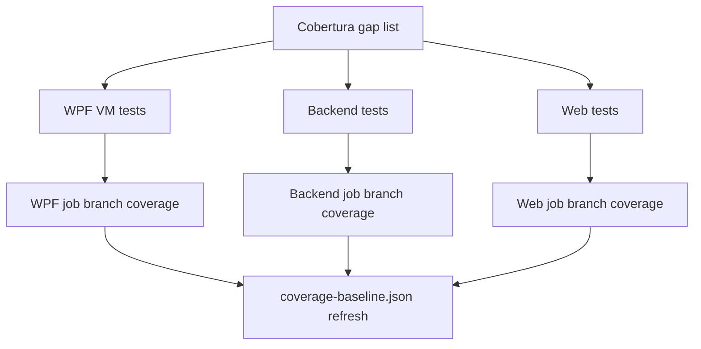

# Technical Specification: High-Risk Branch Coverage

**Complexity:** medium (tests only, across WPF view models, backend services and web components; no API contract or data model change; at most one small production edit, see D4)

## 1. Technical Overview

**What.** Add behaviour tests for the branches the CI coverage report shows as untested in the PRD's named high-risk classes, so that each failure and edge path asserts an observable outcome: a message shown, state left unchanged, a command re-enabled, a value returned or thrown. Plus pinned-clock edge-case tests the PRD names.

**Why.** Branch coverage is the weaker metric (WPF 83.0%, backend 91.0%, web 87.7% in `coverage-baseline.json`) and the ratchet from F09 now guards it, so lifting it locks the gain in. The untested branches cluster in error paths nobody exercises: a failed delete, a cancelled dialog, a null selection, a month rollover.

**Scope.** The PRD has no Core/Full split, so the whole feature is in scope, narrowed by two user decisions (D1, D2) and by the measured state of `main` (Cobertura of run 37508880034, the F09 stage 3 PR run, identical to the committed baseline).

| PRD block | Informs |
|---|---|
| Consumes (F08: `TimeProvider`, delay seams) | The pinned-clock edge cases (section 4, stage 3) |
| Capabilities (WPF, backend, web, pinned-clock bullets) | Sections 3-4 |
| Section 9 F10 criteria and the F10 cross-feature box | Section 6 |

**Measured starting point (branch coverage, covered/total):**

| Class | Now | Target | Verdict |
|---|---|---|---|
| WPF `ReservaViewModel` | 30/50 = 60.0% | ≥ 85% (≥ 43) | in scope |
| WPF `CardsWorkflowViewModel` | 18/28 = 64.3% | raise | in scope |
| WPF `IncomeSplitViewModel` | 15/26 = 57.7% | raise | in scope |
| WPF `ReportingCurrencyViewModel` | 6/14 = 42.9% | raise | in scope |
| WPF `CorporateActionsTabViewModel` | 75/130 = 57.7% | raise | in scope |
| WPF `TransferWorkflowViewModel` | 43/64 = 67.2% | raise | in scope |
| WPF job | 83.0% (3280/3951) | ≥ 85% (≥ +78 branches) | in scope |
| Backend `AssetAdminService` | 27/32 = 84.4% | ≥ 90% (≥ 29) | in scope |
| Backend `CorporateActionReplay` | 35/44 = 79.5% | ≥ 90% (≥ 40) | in scope |
| Backend `SummaryController` | 9/12 per Cobertura | ≥ 90% | in scope (D4) |
| Backend `AssetPriceHistoryService` | 17/18 = 94.4% | ≥ 90% | **already met** |
| Backend job | 91.0% | ≥ 89% (PRD figure is stale) | **already met** |
| Web `CreditsTab.tsx` | 16/32 = 50.0% | ≥ 85% (≥ 28) | in scope |
| Web `TransactionsTab.tsx` | 17/27 = 63.0% | ≥ 85% (≥ 23) | in scope |
| Web `ExpenseForm.tsx` | 5/6 = 83.3% | ≥ 85% (6/6) | in scope |
| Web `EditMovementForm.tsx` | 2/2 = 100% | ≥ 85% | **already met** |

**Excluded:**
- Tests for branches already over their target (D1), and any test whose only purpose is to execute a line.
- Per-class constructor null-guard tests (D3).
- Changing product behaviour. Where a pinned test exposes a questionable behaviour (D7) it is recorded, not fixed.
- Raising `coverage-baseline.json`: the baseline-reminder from F09 flags it after merge; refreshing it is a separate PR.

**Decisions (user choices marked U; the rest are Auto-Accept, review and override):**

| # | Decision | Reason |
|---|---|---|
| D1 (U) | Skip targets already met; keep only the pinned-clock edge-case tests the PRD names | The PRD forbids tests added only to execute a line; the PRD's backend 87.8% and several class figures are stale |
| D2 (U) | All six WPF view models are in scope | The WPF job target (≥ 85%) needs about +78 covered branches and the six classes miss 125 |
| D3 | No new constructor null-guard tests. The Presentation reflection theory (`ConstructorGuardTests`, F06) covers injected services; the remaining unguarded-by-test branches (delegates, collections, `TimeProvider`) stay uncovered | The F07 rule in `testing-guide-Financial` forbids per-class constructor null tests |
| D4 | `SummaryController`: first verify whether the `IsNullOrWhiteSpace` guards (lines 72, 88) are dead behind `[ApiController]` model validation, by running one HTTP test with a whitespace route value under a temporary breakpoint-equivalent assertion (does the action body run?). Dead → delete the guards (the HTTP 400 tests already pin the outcome, as F06 did for the null-body guards). Alive → unit-test the controller directly with hand-written fakes, the pattern of `DividendsControllerLoggingTests` | Cobertura says uncovered although the HTTP tests exist, which points to dead code; deleting is the root-cause fix |
| D5 | `CorporateActionReplay`: cover `RequireRatioFactor` (line 60) and `RequireRetainedFraction` (line 63) through public paths, and the unsupported Type/Role arm (line 43) with one test that builds the invalid action by the narrowest means available at implementation time (a rehydration path if one exists, otherwise reflection on the private setters, with a comment stating why). `_ => 3` in `RankWithinDate` (line 113) is unreachable and excluded | 90% needs +5; lines 60/63 give +2, the switch arm the rest |
| D6 | Web recharts formatters and `dataKey` functions (CreditsTab 284/309/323/334, TransactionsTab 329/335/345) are covered by changing the existing `vi.mock('recharts')` so `Tooltip`, `LabelList` and `Bar` call their `formatter`/`dataKey` props with sample values and render the result; no production change | The branches live in callbacks recharts invokes; the mock is what hides them |
| D7 | Payments-due rollover: P42 computes the due date inside the current calendar month only (`Math.Min(DueDay, DaysInMonth)`, window today..today+5). So on the 29th, `DueDay=2` is **not** in the banner. The test pins that documented behaviour; the possible product gap (a bill due on the 2nd of next month is invisible on the 29th) is recorded in the PR, not changed | The PRD asks the expectation to be cited from P42; the P42 PRD (business rules and AC) states the current-month rule |
| D8 | The WPF job reaching 85% is checked on CI after each WPF stage (the `coverage-comment` delta and Summary figures). If a stage leaves it short, the next stage adds a top-up from the next-lowest-branch view models in the same report, listed in that PR | The target is tight (about 78 of roughly 100 reachable branches) and only CI measures the real number |
| D9 | Unreachable or untestable branches are excluded from the count and listed in the PR: `SaveTransferCommand?.RaiseCanExecuteChanged()` null-conditionals, `ShowDeleteCorporateActionDialog` (constructs a real window; documented as manually tested), `RankWithinDate` default arm | Chasing them adds tests that prove nothing |

## 2. Architecture Impact

Tests only; the one possible production edit is deleting dead guards (D4) and, if needed, making `CorporateActionsTabViewModel.RatioFactorToFraction` `internal` so its three branches are testable.

## 3. Requirements and Business Rules

Each new test names the behaviour it protects and asserts an observable outcome. Test names follow the existing `Method_Condition_Outcome` style of each file.

**WPF (existing files under `Tests/Financial.Presentation.Tests/ViewModels/`, reusing their `CreateViewModel` helpers and the stubs in `CashFlow/TestStubs.cs`; none of the six classes touches `TreeNodeViewModel`, so the `IsSelected` rule does not apply, and `CorporateActionsTabViewModel.SelectedCorporateAction` is a plain property):**

`ReservaViewModel`:
- A failed load keeps `ShowContent` false and sets `Error`; a successful load sets it true; setting the same `Error` twice raises `PropertyChanged` once.
- `SplitPercentageWarning` is empty when there are no buckets.
- `EditGeneralSaveError` equals `EditSaveError` for a non-field message and is null for a field message.
- `EditMovementCommand.CanExecute(null)` and `DeleteMovementCommand.CanExecute(null)` are true; `Execute(null)` on edit leaves the form closed.
- `SaveMovementEditAsync` without an open edit does nothing and reports no error.
- `DeleteMovementAsync(null)` and a declined confirmation do not call the service, leave `Movements` unchanged and set no error; a failed delete (`ThrowOnDeleteMovement`) leaves the movement listed and shows the error message (PRD box).

`CardsWorkflowViewModel`:
- `MarkStatementPaidCommand.CanExecute` is false for null and for a statement without a source; true once a source is set.
- `MarkStatementPaidAsync` and `UnmarkStatementPaidAsync` with a null statement (or none with a source) do not call the service or `refresh` and leave the error/warning properties null.
- `UpdateCreditCardAsync`: null card returns early; the unchanged-guard (`NextInvoiceDueDate == due && IsActive == isActive`) calls the service when only the date, only `isActive`, or a null-vs-non-null date differs.

`IncomeSplitViewModel`:
- `SplitGeneralSaveError` equals `SplitSaveError` for a non-field message and is null for a field message.
- `ShowSplitFormFields` is true while the form is open without a result, false when closed or after a successful split.

`ReportingCurrencyViewModel`:
- Setting `IsEnabled` calls the provider and a same-value set does not; `IsGbpSelected`, `IsBrlSelected`, `IsUsdSelected` set to true persist that currency and set to false do nothing. The setters are fire-and-forget, so tests await the matching `PropertyChanged`.

`TransferWorkflowViewModel`:
- `IsSameBankTransfer` is true only when both banks are set and equal, with the "Source and destination must be different banks." message; the save command is not executable then.
- `TransferGeneralSaveError` as above.
- `ShowCreateTransferForm` source/destination resolution: explicit source; last-used source gone from `Banks` falls back to the first bank; empty `Banks`; last-used destination equal to the source, or gone, resolves to none (reached by a successful save, then the move-money command).
- `EditTransferCommand.Execute(null)` leaves the form closed.

`CorporateActionsTabViewModel`:
- `Add`/`Delete` with no service return early: no form shown, no message, nothing applied.
- A non-rule exception in `Add`, `Update`, `Delete` shows the generic "could not be added/updated/deleted" message (rule violations show their own message); a null refreshed-details result takes the same generic path.
- A cancelled form (null form data) calls nothing and applies nothing.
- `ResolveAffectedAsset` for merger and spin-off: null result, primary matches the current asset, secondary matches, neither matches.
- `CanUpdateCorporateAction`/`CanDeleteCorporateAction` are false without context, false without selection, true with a selected row or a row parameter; the command with a row parameter assigns `SelectedCorporateAction`.
- A zero ratio denominator yields factor 0; `RatioFactorToFraction` branches (null, ≥ 1, < 1) are tested directly if made `internal`.

**Backend:**
- `AssetAdminService`: `CreateAssetAsync` with an active broker but missing portfolio throws `KeyNotFoundException` and persists nothing; `UpdateAssetAsync` with Historic scope on an active-only broker, active scope on a historic-only broker, and an unknown broker (throws, persists nothing); broker found but portfolio missing throws.
- `CorporateActionReplay` per D5.
- `SummaryController` per D4.
- Pinned-clock edge cases (D7): `PaymentsDueService` on the 29th with `DueDay=2` is not included; `AnnualAverageMonthsCalculator`: January of the current year gives 0, 2017 gives 11, another past year gives 12 (new direct test file); `UsdBasedExchangeRateProvider` with a future date returns the live rate and persists nothing (the today case exists).

**Web:**
- `CreditsTab`: sorting by each yield column puts null yields first ascending and last descending; an unknown credit type shows the raw text and the dividend CSS class; by-month chart `dataKey` returns the amount for a present type and 0 for a missing one; formatters render a number as `formatN2` text and pass a non-number through; the label formatter returns '' for zero, negative and non-numbers.
- `TransactionsTab`: inflow, outflow and neutral type rows get their row classes (Redemption, ReturnOfCapital, Transfer); an unknown type shows the raw type text; tooltip formatters as above; the label formatter returns '' for zero.
- `ExpenseForm`: checking an unchecked "Counts toward tithe" box reports `'true'`.

## 4. Component Overview

| File | New/Modified | Purpose |
|---|---|---|
| `Tests/Financial.Presentation.Tests/ViewModels/CashFlow/ReservaViewModelTests.cs` | Modified | Failure, null and declined paths |
| `.../CashFlow/CardsWorkflowViewModelTests.cs` | Modified | Null/guard and unchanged-card paths |
| `.../CashFlow/IncomeSplitViewModelTests.cs` | Modified | General error and form-field visibility |
| `.../CashFlow/TransferWorkflowViewModelTests.cs` | Modified | Same-bank, form-open resolution, general error |
| `.../Settings/ReportingCurrencyViewModelTests.cs` | Modified | Setter paths |
| `.../CorporateActionsTabViewModelTests.cs` | Modified | Error, cancel, resolve and can-execute paths |
| `Financial.App/ViewModels/Investment/CorporateActionsTabViewModel.cs` | Modified (only if needed) | `RatioFactorToFraction` to `internal` |
| `Tests/Financial.Investment.Application.Tests/Services/AssetAdminServiceTests.cs` | Modified | Missing portfolio and scope fallbacks |
| `Tests/Financial.Investment.Domain.Tests/Domain/CorporateActionReplayTests.cs` | Modified | Missing ratio/allocation, unsupported combination |
| `Financial.Api/Controllers/SummaryController.cs` and `Tests/Financial.Api.Tests/SummaryEndpointsTests.cs` (or a new controller test) | Modified | D4 |
| `Tests/Financial.CashFlow.Application.Tests/Services/PaymentsDueServiceTests.cs` | Modified | 29th / `DueDay=2` pin |
| `Tests/Financial.CashFlow.Domain.Tests/Rules/AnnualAverageMonthsCalculatorTests.cs` | New | January, 2017, other year |
| `Tests/Financial.Shared.Abstractions.Tests/Currencies/FxRates/UsdBasedExchangeRateProviderTests.cs` | Modified | Future date |
| `Financial.Web/src/components/__tests__/CreditsTab.test.tsx`, `TransactionsTab.test.tsx`, `ExpenseForm.test.tsx` | Modified | Web branches; recharts mock calls formatter/dataKey props |

## 5. API Contracts and Data Model

Not applicable: no endpoint, DTO or persistence change. D4 may remove unreachable guard code without changing any HTTP response (the 400s are already produced by model validation and pinned by `SummaryEndpointsTests`).

## 6. Testing Strategy

Every acceptance criterion is a coverage figure or a named behaviour; the figures are read from the CI `coverage-report-*` artifacts (`Cobertura.xml`) of the PR run, with the per-file script used for this spec (class-level lines, covered/total conditions).

| PRD criterion | Verified by |
|---|---|
| `ReservaViewModel` ≥ 85% branch; a failed delete leaves the movement listed and shows the error | `Reserva*` tests above, plus the per-file figure from the stage 1 CI artifact |
| WPF job ≥ 85% branch | The wpf job's `Summary.json` after the last WPF stage (D8); the baseline-reminder flags the rise |
| Four backend classes ≥ 90% | `AssetAdminService` 29/32, `CorporateActionReplay` 40/44, `SummaryController` all reachable branches (D4); `AssetPriceHistoryService` already 94.4% (verified, no work) |
| Four web files ≥ 85% | `CreditsTab` ≥ 28/32, `TransactionsTab` ≥ 23/27, `ExpenseForm` 6/6; `EditMovementForm` already 2/2 |
| Payments-due rollover pins the 29th with `DueDay=2`, cited from P42 | `GetPaymentsDue_MensaisDueDayEarlierInMonthOn29th_IsNotIncluded`, with the P42 citation in the PR |
| `AnnualAverageMonthsCalculator` January and 2017 direct tests | `NumberOfMonthsForAverage_CurrentYearInJanuary_ReturnsZero`, `..._Year2017_Returns11`, `..._PastYear_Returns12` |
| Cross-feature: F10's date-dependent tests use the `TimeProvider` seams from F08 | The payments-due and calculator tests pass a `FakeTimeProvider`/`DateTimeOffset`, never the wall clock; `test-hygiene.sh` on each PR |

**Mutation-style proof per stage:** for two or three of the new failure-path tests per PR, remove the guarded behaviour locally (the catch, the null check, the confirm check) and confirm the test fails; recorded in the PR body, as in F05.

## 7. Error Handling and Risks

- **WPF target not reached** (D8): the PR reports the measured figure and the next stage adds a top-up; if still short at the end, the PRD box stays unticked and the shortfall is reported, never padded with line-executing tests.
- **Dead `SummaryController` guards** turn out alive: fall back to direct controller tests (D4).
- **Reflection needed for the replay default arm** (D5): acceptable once, commented as the reason (an invalid action cannot be built through its factories).
- **A pinned test reveals a bug:** record it in the PR and the F10 report; fix only in a separate change.
- **Flaky async setters** (`ReportingCurrencyViewModel` fire-and-forget): await `PropertyChanged`, never `Task.Delay` (hygiene gate).
