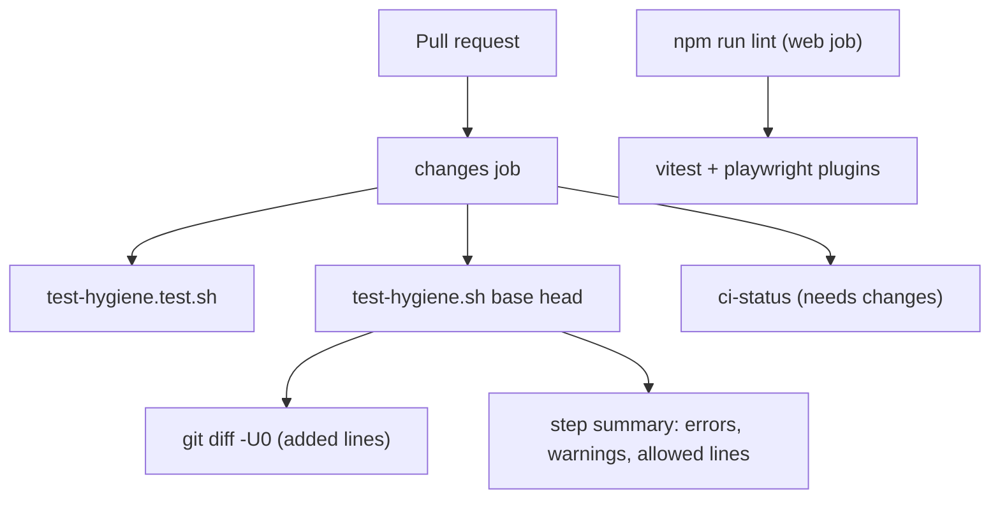

# Technical Specification: Test Hygiene Gate

**Complexity:** simple (one shell scanner, one self-test, one workflow step, two ESLint plugins; no application code, API or schema changes)

## 1. Technical Overview

**What.** A merge gate that rejects newly added patterns that make tests flaky or hollow, so the cleanup done by F06–F08 cannot be undone by the next change. Two layers:

1. **`.github/scripts/test-hygiene.sh`** scans only the lines a pull request adds (`git diff -U0`) and fails on:
   - `DateTime.Now`, `DateTime.Today` or `DateTime.UtcNow` in `Tests/**/*.cs`, or in a production `.cs` file that already mentions `TimeProvider`.
   - `Task.Delay(` or `Thread.Sleep(` in `Tests/**/*.cs`.
   - `Skip =` in `Tests/**/*.cs`.
   - `.only(`, `.skip(` or `waitForTimeout(` in `Financial.Web/src/**` and `Financial.Web/tests/e2e/**` (`.ts`/`.tsx`).
   - `new Date()` in a web test file that never fakes the clock: warning only.
2. **ESLint** (`@vitest/eslint-plugin` `no-focused-tests` and `no-disabled-tests` as errors, `eslint-plugin-playwright` recommended rules for `tests/e2e/**`) catches focused/disabled tests in the editor and in the existing `npm run lint` step.

A trailing `// hygiene-allow: <reason>` on the same line exempts that line; every exemption is listed in the job summary.

**Why.** The audit counted 496 wall-clock reads, ~10 fixed delays and 9 `Skip=` tests in `Tests/`. A whole-tree rule would block every unrelated PR, so the rule applies to added lines only: legacy code is cleaned by F06–F08, and F11 stops the count from growing in the meantime. AI agents imitate whatever patterns they find, so the check has to be machine-enforced rather than a convention.

**Scope.**

**Included:**
- `.github/scripts/test-hygiene.sh` (scanner) and `.github/scripts/test-hygiene.test.sh` (self-test using a throwaway git repository).
- Two new steps in the `changes` job of `build.yml`: self-test (always) and scan (pull requests only).
- ESLint configuration and the two dev dependencies.
- Documentation: `docs/ci-affected-pipeline.md` Safeguards, the CI paragraph of `CLAUDE.md`, and the testing rules in `docs/rules/implementation.md` §Tests.

**Output contracts (Provides):** none. **Input contracts (Consumes):** none. F08's "no `Task.Delay` in `Financial.Presentation.Tests`" criterion is a whole-tree cleanup; F11 only prevents regression.

**Excluded:**
- Whole-tree enforcement and cleanup of legacy violations (F06, F07, F08).
- The `Category` trait convention and the `Skip=` → `Category=Live` migration (F07). F11 only rejects *new* `Skip =`.
- Playwright specs themselves (F12). The ESLint block for `tests/e2e/**` is configured now and starts applying when F12 adds the directory.
- Running the scan on pushes to `main` (there is no PR diff to scope it to).

## 2. Architecture Impact

Affected components:
- `.github/scripts/test-hygiene.sh` — new, the scanner.
- `.github/scripts/test-hygiene.test.sh` — new, self-test.
- `.github/workflows/build.yml` — `changes` job gains two steps.
- `Financial.Web/eslint.config.js`, `Financial.Web/package.json`, `Financial.Web/package-lock.json` — plugins.
- `docs/ci-affected-pipeline.md`, `CLAUDE.md`, `docs/rules/implementation.md` — documentation.

`ci-status` already fails when `changes` does not succeed, so a failing scan blocks merge with no change to `ci-status`.

## 3. Technical Decisions

| Decision | Chosen Approach | Alternative Considered | Trade-off |
|----------|----------------|----------------------|-----------|
| D1. Scan scope | Added lines of the PR diff (merge-base..head) | Whole tree with a baseline file | Nothing to maintain; legacy violations are invisible until F06–F08 remove them |
| D2. Language | One bash script using `git diff` and `awk`, same style as `detect-changes.sh` | A Node or C# analyzer | No toolchain in the `changes` job (Ubuntu, no setup); regex-level precision is enough for these patterns |
| D3. Production wall-clock rule | Flag only in a `.cs` file that already contains the token `TimeProvider` | Flag every production wall-clock read | Matches the PRD ("class has a `TimeProvider` constructor parameter") and avoids blocking classes F08 has not migrated yet; file-level instead of class-level is slightly broader |
| D4. Escape hatch | `// hygiene-allow: <reason>` on the same line; a bare `hygiene-allow:` with no reason is still an error | Block-level suppression | Forces a reason per line and keeps exemptions visible in the summary |
| D5. When it runs | `pull_request` events only, in `changes` | Also on push to `main` | A push has no stable base; `main` content was already scanned as a PR |
| D6. Proving the scanner | `test-hygiene.test.sh` builds a temporary git repository (base commit with legacy violations, head commit with new ones) and asserts exit codes and messages; runs in `changes` on every run | Unit-test the regexes only | Exercises the real `git diff` parsing, including legacy-line and allow-comment behaviour |
| D7. ESLint plugins | `@vitest/eslint-plugin` (`no-focused-tests`, `no-disabled-tests`, both `error`) for `src/**/*.test.{ts,tsx}`; `eslint-plugin-playwright` recommended set for `tests/e2e/**` | Rely on the scanner alone | Two new dev dependencies, but errors appear in the editor and fail `npm run lint` |
| D8. `new Date()` rule | Warning (GitHub `::warning::`), skipped when the file mentions `useFakeTimers`, `setSystemTime` or `pinDate` | Error | Per PRD; legitimate uses exist (building a fixture date) |

### Assumptions

- Applied defaults not stated in the PRD: D3 file-level check, D5 PR-only, D8 file-level fake-timer detection, ESLint file globs, and that the playwright plugin's block is added before `tests/e2e/` exists. The `new Date()` and `Skip =` rules ignore `.md`/non-code files because the diff is restricted to `*.cs`, `*.ts` and `*.tsx`.
- The scanner reads CRLF diffs defensively (strips `\r`); the index is LF, so CI never sees CRLF.
- Deleted lines and context lines are never scanned. A moved line that is textually changed counts as added.
- The scan runs after the existing classifier self-test, uses the same merge-base the classifier computes, and falls back to the PR base SHA if the merge-base cannot be resolved (mirroring `detect-changes.sh`).

## 4. Component Overview

**CI**

| File Path | New/Modified | Purpose | Key Responsibilities |
|-----------|--------------|---------|---------------------|
| `.github/scripts/test-hygiene.sh` | New | Scanner | Parse `git diff -U0 <base> <head>` into file/line/added-text; apply the rule table; print `test-hygiene: <file>:<line> adds <pattern> — <hint>` plus a `::error`/`::warning` annotation; write errors, warnings and allowed lines to `$GITHUB_STEP_SUMMARY`; exit 1 on any error |
| `.github/scripts/test-hygiene.test.sh` | New | Self-test | Create a temp repo, commit legacy violations, then added violations/allowed lines; assert per case the exit code and message |
| `.github/workflows/build.yml` | Modified | Wiring | `changes` job: `Self-test the hygiene scanner` (always) and `Scan added lines for test hygiene` (`if: github.event_name == 'pull_request'`, env `BASE_SHA`/`HEAD_SHA` as the classifier step) |

**Frontend tooling**

| File Path | New/Modified | Purpose | Key Responsibilities |
|-----------|--------------|---------|---------------------|
| `Financial.Web/eslint.config.js` | Modified | Lint rules | Vitest rules on `**/*.test.{ts,tsx}`; Playwright recommended rules on `tests/e2e/**` |
| `Financial.Web/package.json` / `package-lock.json` | Modified | Dev dependencies | `@vitest/eslint-plugin`, `eslint-plugin-playwright` |

**Documentation**

| File Path | New/Modified | Purpose |
|-----------|--------------|---------|
| `docs/ci-affected-pipeline.md` | Modified | Safeguards bullet: what the scan checks, diff-only, the allow comment, how to run it locally |
| `CLAUDE.md` | Modified | One sentence in the CI paragraph |
| `docs/rules/implementation.md` | Modified | §Tests: the four forbidden patterns and the allow comment |

### Rule table (scanner)

| Rule | Path (added line's file) | Pattern | Severity | Message hint |
|------|--------------------------|---------|----------|--------------|
| `wall-clock-test` | `Tests/**/*.cs` | `DateTime\.(Now\|Today\|UtcNow)` | error | inject `TimeProvider` (`FakeTimeProvider` in tests) or pass a fixed date |
| `wall-clock-prod` | other `*.cs` whose head content contains `TimeProvider` | same | error | use the injected `TimeProvider` |
| `fixed-delay` | `Tests/**/*.cs` | `Task\.Delay\(\|Thread\.Sleep\(` | error | await the operation's `Task` or a deterministic signal instead |
| `skipped-test` | `Tests/**/*.cs` | `\bSkip\s*=` | error | fix or delete the test |
| `focused-or-fixed-wait` | `Financial.Web/(src\|tests/e2e)/**/*.{ts,tsx}` | `\.only\(\|\.skip\(\|waitForTimeout\(` | error | remove `.only`/`.skip`; wait on a condition, not a delay |
| `unpinned-date` | `Financial.Web/src/**/*.test.{ts,tsx}` without a fake-timer call | `new Date\(\)` | warning | pin the clock with `pinDate(...)` and assert a literal |

## 5. API Contracts

Skipped: no endpoint changes. The only interfaces are the script's CLI (`test-hygiene.sh <base-sha> <head-sha>`; exit 0 clean or warnings only, 1 on any error) and its output line format above.

## 6. Data Model

Skipped: nothing persisted.

## 7. Testing Strategy

`test-hygiene.test.sh` (runs in `changes` and locally with `bash .github/scripts/test-hygiene.test.sh`) builds a temp repository whose base commit already contains one legacy violation of every rule, then for each case commits a head change and asserts the scanner result:

| Case | Expected |
|------|----------|
| added `await Task.Delay(100);` in `Tests/X/FooTests.cs` | exit 1, message `Tests/X/FooTests.cs:<line> adds Task.Delay` |
| added `Thread.Sleep(10)` in `Tests/` | exit 1 |
| added `DateTime.UtcNow` in `Tests/` | exit 1 |
| added `DateTime.Now` in a production `.cs` that mentions `TimeProvider` | exit 1 |
| added `DateTime.Now` in a production `.cs` that does not mention `TimeProvider` | exit 0 |
| added `[Fact(Skip = "x")]` in `Tests/` | exit 1 |
| added `it.only(` in `Financial.Web/src/**/x.test.ts` | exit 1 |
| added `page.waitForTimeout(500)` in `Financial.Web/tests/e2e/x.spec.ts` | exit 1 |
| added `new Date()` in a web test with no fake timers | exit 0, warning printed |
| added `new Date()` in a web test that calls `pinDate` | exit 0, no warning |
| pre-existing violation on an unchanged line, unrelated added line | exit 0 (legacy line not reported) |
| added violation with `// hygiene-allow: waiting for the real driver` | exit 0, line listed in the summary file |
| added violation with `// hygiene-allow:` and no reason | exit 1 |
| deleted a violating line | exit 0 |
| violation in a non-code file (`.md`) | exit 0 |

**Acceptance mapping**

| PRD box | Covered by |
|---------|-----------|
| Adding `Task.Delay(` to a test file fails `changes` with a file:line message | self-test case 1 plus the real CI step |
| Adding a new `DateTime.Now` to a service that injects `TimeProvider` fails | self-test case 4 |
| Adding `it.only(` fails both lint and hygiene | self-test case 7 and an ESLint check: a temporary `it.only` in a web test makes `npm run lint` fail (recorded in the PR) |
| An existing legacy violation on an unchanged line does not fail | self-test case 11 |
| `// hygiene-allow: <reason>` passes and is listed in the summary | self-test case 12 |

**Revert check:** with the scanner step removed or a rule deleted, the matching self-test case fails; recorded in the PR body. The ESLint rule is proven by a temporary `it.only(` / `it.skip(` that fails `npm run lint`, then reverted.

## 8. Error Handling

- Base SHA unavailable (shallow clone, force push): the step fetches it as the classifier does; if it still cannot diff, it fails with `test-hygiene: cannot diff <base>..<head>` rather than passing silently.
- Unknown path or file type: ignored (only `*.cs`, `*.ts`, `*.tsx` are scanned).
- Empty diff (docs-only PR): exits 0 with `no added lines to scan` in the summary.
- A rule is edited so its regex is invalid: the self-test fails first, in the same job.

## 9. Acceptance Criteria Mapping

See Section 7. PRD boxes covered: the five F11 boxes. No Cross-Feature Integration criterion references F11.
