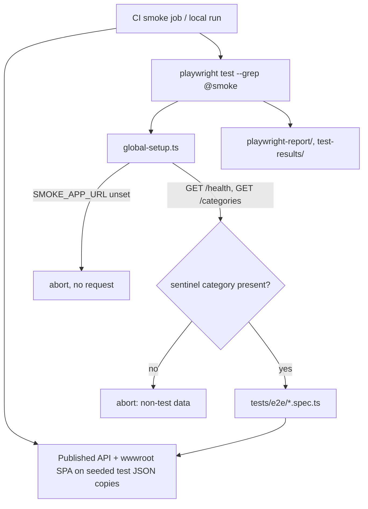

# Technical Specification: React Playwright E2E Suite

**Complexity:** medium (one new test directory, one config, one global setup, a CI job rewrite, one test-data record, docs; no production code change)

## 1. Technical Overview

**What.** Replaces the single-script browser smoke (`Financial.Web/scripts/smoke-test.mjs`, Playwright *library*, 2 read paths) with a `@playwright/test` suite under `Financial.Web/tests/e2e/`: a config, a global setup that refuses to run against anything but test data, six `@smoke` specs, and a CI `smoke` job that runs them and uploads traces/screenshots/video on failure.

**Why.** The current script cannot express a failure journey, has no retries or artifacts, and defaults to `localhost:5173`, so a careless local run seeds expenses into the developer's live data file. F14's nightly pipeline also needs a real test project to run in full.

**Scope.**

**Included:**
- `playwright.config.ts`, global setup, and `package.json` changes (`@playwright/test` replaces the `playwright` library dependency; `smoke-test` script runs `playwright test --grep @smoke`).
- Six `@smoke` specs: five from the PRD plus the ported Historic Summary Average drift check (D2).
- Test-data guard: a sentinel record in the committed test JSON, verified by global setup through an existing endpoint (D1).
- `smoke` job rewrite in `build.yml`: run the suite, upload artifacts on failure.
- Documentation: `testing-guide-Financial` `e2e-environment.md`, `docs/ci-affected-pipeline.md`, and the `npm run smoke-test` / local-debug notes in `CLAUDE.md` and `Financial.Web/CLAUDE.md`.

**Output contracts (Provides):** a `@playwright/test` suite with `@smoke`-tagged and untagged specs, an HTML report and failure artifacts, consumed by F14 (`npm run test:e2e`, all specs).
**Input contracts (Consumes):** none. F11 already configured the `eslint-plugin-playwright` recommended rules for `tests/e2e/**` and the hygiene scan for `waitForTimeout(`/`.only(`/`.skip(` there.

**Excluded:**
- A new endpoint exposing data-file paths (rejected, D1).
- Cross-browser runs, visual regression, authentication flows (PRD Out of Scope).
- The keyboard-only journey named in `e2e-environment.md` (not in the PRD F12 list).
- The nightly full run (F14) and WPF E2E (F13).

## 2. Architecture Impact



No production code changes. Outside `Financial.Web` and CI, the only change is one record in `Tests/Financial.Api.Tests/TestData/data-cashflow.test.json` and the tests that count categories.

## 3. Technical Decisions

| Decision | Chosen Approach | Alternative Considered | Trade-off |
|----------|----------------|----------------------|-----------|
| D1. Test-data guard | Sentinel category `E2E-TEST-DATA` (inactive) added to `data-cashflow.test.json`; global setup `GET`s `/api/v1/financial/categories` and aborts if it is absent | PRD fallback: a Development/Testing-only endpoint reporting data-file names | `DiagnosticsController` documents that serving data paths was removed on purpose (a guard one env var from being off published the real path on an unauthenticated port). The sentinel adds no surface and cannot exist in live data. Cost: one test-data record and a category-count update. **Chosen by the user.** |
| D2. Old drift check | Ported to a sixth `@smoke` spec, seeding three expenses through Playwright's `request` fixture | Fold into spec 2, or drop | Keeps what the current job protects (frontend types vs. real API shape); PRD lists 5 specs, this adds 1 (~15 s). **Chosen by the user.** |
| D3. Dependency | Replace devDependency `playwright` with `@playwright/test` | Keep both | One package, one browser-install command |
| D4. Server lifecycle | Not owned by Playwright (no `webServer`): CI and the documented local recipe start the published app, as today | Playwright `webServer` starting `dotnet` | The suite must run against the published single-process shape; port and data-file hygiene stay explicit |
| D5. Isolation | Write specs run serially (`test.describe.configure({ mode: 'serial' })`), use a per-run unique description `e2e-<runId>` (`GITHUB_RUN_ID` or `crypto.randomUUID()`), never clean up; data files are throwaway copies | Delete created records in teardown | Matches today's approach; teardown failures cannot mask test failures |
| D6. Locators | `getByRole`/`getByLabel`/`getByText` first; `data-testid` only with a comment saying why. No CSS classes, XPath or DOM position | Test ids everywhere | Fluent UI roles and labels already exist; also enforced by the F11 ESLint rules |
| D7. Reporter/artifacts | CI: `list` + `html` (`open: 'never'`); `trace: 'on-first-retry'`, `screenshot: 'only-on-failure'`, `video: 'retain-on-failure'`, `retries: 2` | Always-on tracing | Per PRD; the retry is what produces the first-retry trace |
| D8. Locale/timezone | `use.locale: 'en-GB'`, `timezoneId: 'Europe/London'` | Host defaults | Same pinned environment as F01 (the old script used `en-US`) |

### Assumptions

- Applied without asking (no PRD detail): D3-D8; the sentinel name `E2E-TEST-DATA`; the failure journey (spec 5) forces a 500 with `page.route` on `POST /expenses` because no seeded invalid operation exists; the CI job keeps its name `smoke` so `ci-status` and `detect-changes.sh` need no change.
- **PRD deviation.** The PRD says a blank-value submit leaves "the Save button disabled". In the shipped form the primary button is disabled only while saving; validation runs on submit and shows `Value must be a non-zero number` beside the field (`useExpenseForm.ts:258`, `ExpenseForm.tsx:204`). The spec asserts the message and that no `POST /expenses` is sent. The PRD box is amended in the final PR.
- The expense is added in the month the Monthly page opens on; the spec does not assume a calendar month, so it is not date-sensitive.

## 4. Component Overview

**Test project (`Financial.Web`)**

| File Path | New/Modified | Purpose | Key Responsibilities |
|-----------|--------------|---------|---------------------|
| `Financial.Web/playwright.config.ts` | New | Runner config | `testDir ./tests/e2e`, headless, `retries: CI ? 2 : 0`, `workers: CI ? 2 : undefined`, artifacts per D7, `baseURL` from `SMOKE_APP_URL`, `globalSetup`, `forbidOnly: !!CI`, locale/timezone per D8 |
| `Financial.Web/tests/e2e/global-setup.ts` | New | Guard | Abort `SMOKE_APP_URL is required` before any browser starts; poll `GET {url}/api/v1/financial/health` up to 60 s (`App not reachable at <url> within 60 s`); abort `Refusing to run against non-test data: sentinel category E2E-TEST-DATA not found` |
| `Financial.Web/tests/e2e/fixtures.ts` | New | Shared fixture | Extends `test` with console-error collection (a `console.error` or `pageerror` fails the test), `runId`, and an API helper over `request` |
| `Financial.Web/tests/e2e/app-loads.spec.ts` | New | Smoke 1 | Tree renders `XPI` with no console errors |
| `Financial.Web/tests/e2e/investment-asset.spec.ts` | New | Smoke 2 | Navigate XPI, Default, BCIA11 and see the seeded summary values |
| `Financial.Web/tests/e2e/add-expense.spec.ts` | New | Smokes 3-5 (serial) | Add expense; blank-value validation; forced server error |
| `Financial.Web/tests/e2e/historic-average.spec.ts` | New | Smoke 6 | Port of the old drift check |
| `Financial.Web/scripts/smoke-test.mjs` | Deleted | Replaced | |
| `Financial.Web/package.json`, `package-lock.json` | Modified | Deps and scripts | D3; `"smoke-test": "playwright test --grep @smoke"`; `"test:e2e": "playwright test"` |
| `Financial.Web/.gitignore` | Modified | Hygiene | `playwright-report`, `test-results` |
| `Financial.Web/tsconfig.node.json` | Modified | Typecheck | Include `playwright.config.ts` and `tests/e2e/**` so `tsc -b` covers them |
| `Financial.Web/vite.config.ts` | Modified | Keep vitest off e2e | `test.exclude` adds `tests/e2e/**` |

**Test data and API tests**

| File Path | New/Modified | Purpose |
|-----------|--------------|---------|
| `Tests/Financial.Api.Tests/TestData/data-cashflow.test.json` | Modified | Add inactive category `E2E-TEST-DATA` |
| `Tests/Financial.Api.Tests/CategoriesEndpointsTests.cs` | Modified | Count 14 to 15 (`GetCategories_ReturnsAllFifteenSeededCategories`); any other count assertion the full run reveals |

**CI and docs**

| File Path | New/Modified | Purpose |
|-----------|--------------|---------|
| `.github/workflows/build.yml` | Modified | `smoke` job: run `npm run smoke-test` with `SMOKE_APP_URL`; `actions/upload-artifact` of `playwright-report/` and `test-results/` with `if: failure()` |
| `.claude/skills/testing-guide-Financial/references/e2e-environment.md` | Modified | Driver row, local recipe, "what it proves" section for the six specs and the guard |
| `.claude/skills/testing-guide-Financial/artifacts/example-and-seed-data.md` | Modified | Mention the sentinel |
| `docs/ci-affected-pipeline.md` | Modified | Smoke job description and artifacts |
| `CLAUDE.md`, `Financial.Web/CLAUDE.md` | Modified | `npm run smoke-test` semantics; `--headed`/`--ui`/`--debug`; locator rules |

## 5. API Contracts

Skipped: no endpoint changes. The suite consumes existing endpoints: `GET /health`, `GET /categories`, `POST /expenses`, and the pages' own calls.

## 6. Data Model

Skipped beyond the one test-data record:

```json
{ "Id": "8f3b1c1a-2e3a-4b1a-9a7f-600000000015", "Name": "E2E-TEST-DATA", "Active": false, "IsInvestment": false, "IsTithe": false }
```

An inactive category is not offered by the expense form's category select, so no spec or existing UI test sees it.

## 7. Testing Strategy

Specs (all `@smoke`; each fails on any console error via the fixture):

| # | Spec | Journey | Key assertions |
|---|------|---------|----------------|
| 1 | `app-loads` | open `/` | tree shows `XPI`; no console errors |
| 2 | `investment-asset` | expand XPI, Default, select BCIA11 | role-based locators find the asset summary and a value from `data.test.json` |
| 3 | `add-expense` | Monthly, Expense tab, New Expense, fill Description `e2e-<runId>`, Value, Category `Mercado`, Payment Source `Barclays`, Add Expense | row with `e2e-<runId>` is listed |
| 4 | `add-expense` | submit with blank Value | `Value must be a non-zero number` visible; zero `POST /expenses` requests observed; form still open |
| 5 | `add-expense` | `page.route` returns 500 for `POST /expenses`, valid form | the form's server-error message is visible; Add Expense is enabled again |
| 6 | `historic-average` | seed 3 expenses (year - 2, Mercado, 100 each) via `request`; `/cashflow/annual-summary`, tab `Historic Summary Average` | Mercado row contains `25.00` |

Global-setup cases (verified by hand and recorded in the PR body, since they abort the runner):

| Case | Expected |
|------|----------|
| `SMOKE_APP_URL` unset | exit 1 `SMOKE_APP_URL is required`; the API receives no request |
| App not up | exit 1 after 60 s naming the URL |
| App on data without the sentinel (a copy of `data.example.json`) | exit 1 `Refusing to run against non-test data` |

**Acceptance mapping**

| PRD box | Covered by |
|---------|-----------|
| `smoke-test.mjs` removed; `npm run smoke-test` runs `playwright test --grep @smoke` | file deleted; script in `package.json` |
| Without `SMOKE_APP_URL` aborts before launching a browser, API gets no requests | global-setup case 1, run with the API stopped and then with request logging |
| Against non-test data aborts with the refusal message | global-setup case 3 |
| All 5 smoke specs pass in CI headless in <= 5 min | specs 1-5 (plus 6); CI duration recorded |
| Expense-add spec's record carries the run's unique ID | spec 3 asserts the `e2e-<runId>` row |
| A forced failure uploads trace, screenshot and video | one throwaway commit with a failing assertion; artifact list recorded; commit reverted |
| No CSS-class, XPath or `waitForTimeout` locators/waits (ESLint playwright rules pass) | `npm run lint` over `tests/e2e/**` |

**Revert check:** removing the sentinel from the test-data copy makes global setup abort (case 3).

## 8. Error Handling

- `SMOKE_APP_URL` unset: abort before any browser launches; no HTTP request is sent.
- App unreachable within 60 s: abort naming the URL it tried.
- Sentinel absent: abort `Refusing to run against non-test data`; nothing is written.
- A write spec fails mid-flow: no cleanup; data is a per-run copy (CI workspace, or the temp copy the local recipe creates).
- A spec that passes only on retry shows as flaky in the HTML report; the PRD's "0 retries over 20 runs" is read from the reports, not enforced by the suite.

## 9. Acceptance Criteria Mapping

See Section 7. PRD boxes covered: the seven F12 boxes (the "5 smoke specs" wording is amended to six, and the blank-value expectation per the Assumptions). The Cross-Feature Integration box "F14's nightly E2E step runs F12's full spec set" is satisfied by F14, not ticked by F12.
