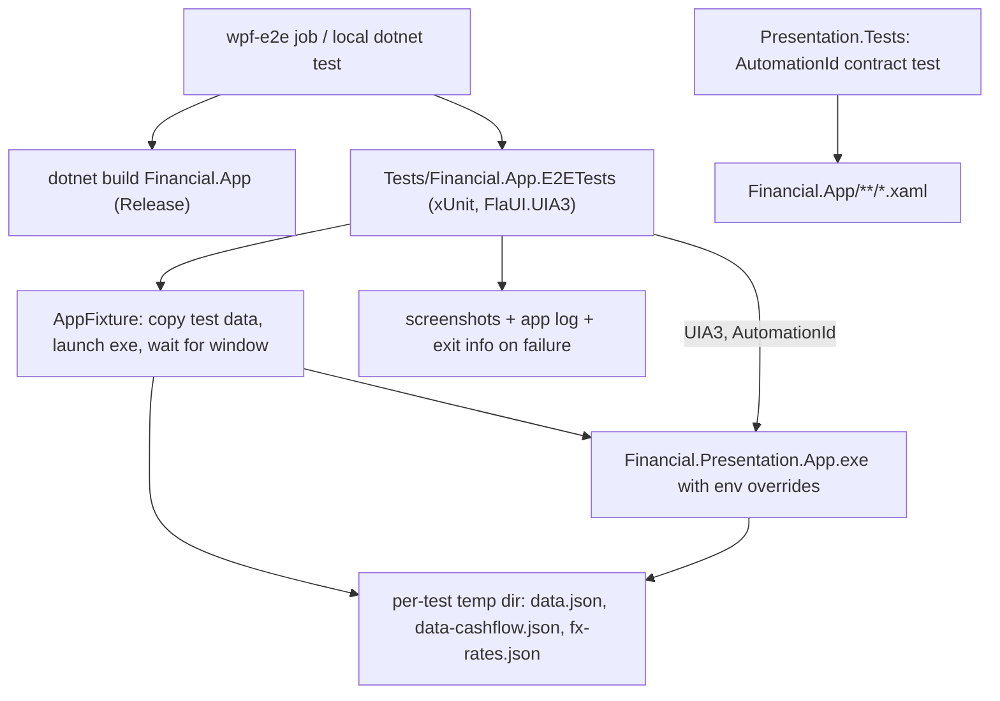

# Technical Specification: WPF FlaUI E2E Suite

**Complexity:** complex (a new test project, a process-launching fixture, AutomationIds across ~8 XAML views, a new CI job and classifier rule, documentation; no domain, API or persistence change)

## 1. Technical Overview

**What.** A UI-automation smoke suite for the real `Financial.App` executable. A new xUnit project, `Tests/Financial.App.E2ETests`, launches the built exe against a throwaway copy of the test data, drives it through UIA3 with FlaUI, and asserts five critical-path journeys. To make controls addressable, the WPF views gain `AutomationProperties.AutomationId` values under a documented naming convention. A new `wpf-e2e` job runs the smoke on a `windows-latest` runner and feeds `ci-status`.

**Why.** WPF has no automated end-to-end coverage today; its top automated layer is in-process view-model tests, and the manual launch-and-look is the substitute. A view that is mis-bound, a command wired to the wrong button, or a startup crash is invisible to all 2,000+ unit tests. The app already carries `AutomationProperties.Name` on ~72 XAML files (accessibility work) but **no** `AutomationId`, so every previous UI-automation check was done by hand.

**Scope.**

**Included:**
- `Tests/Financial.App.E2ETests`: FlaUI.Core and FlaUI.UIA3, a launch fixture, five `Smoke` specs, failure artifacts.
- `AutomationProperties.AutomationId` on every control the smoke uses (shell, navigation, investment tree and asset summary, monthly view, expense form), plus a convention document.
- A contract test in `Financial.Presentation.Tests` that fails when an id the E2E suite relies on disappears from the XAML.
- `wpf-e2e` CI job, `detect-changes.sh` rule and self-test cases, exclusion from the backend/wpf unit runs and coverage, documentation.

**Output contracts (Provides):** a `Category=E2E` / `Smoke`-traited suite and failure artifacts (screenshots, app log, exit info), consumed by F14's nightly full run.
**Input contracts (Consumes):** none.

**Excluded:**
- Platform-specific behaviour that has no React equivalent, drag-and-drop in the investment tree, and `MessageBox` confirmation flows (native dialogs; not in the five journeys).
- Parallel execution, self-hosted runners and VMs (PRD Out of Scope).
- A deterministic FX source: the app has none (the stub lives only in `ApiTestFactory`). The journeys assert nothing that depends on a converted value.
- The nightly full run itself (F14).

## 2. Architecture Impact

The E2E project does not reference `Financial.App` code. It carries a project reference with `ReferenceOutputAssembly="false"` solely so that building the test project builds the exe first. It never loads the assembly. Layering and `Financial.Architecture.Tests` are unaffected (they pin `Financial.App`'s references, not a test project's).

## 3. Technical Decisions

| Decision | Chosen Approach | Alternative Considered | Trade-off |
|----------|----------------|----------------------|-----------|
| D1. Launch isolation | One fresh process per test, each with its own temp directory | One process per class | Slower (~5 s start x 5 tests, well inside 8 min) but a crash or dirty state cannot leak between tests; matches the PRD's "relaunch after a crash" rule |
| D2. Data wiring | Environment variables on the child process: `Investment__Repository__Provider=LocalJson`, `Investment__DataJsonFile`, `CashFlow__Repository__Provider=LocalJson`, `CashFlow__DataJsonFile`, `FxRates__Repository__Provider=LocalJson`, `FxRates__DataJsonFile`, `Observability__Enabled=false` | A test-only appsettings file | `Host.CreateDefaultBuilder` already reads environment variables; no app change. A Release build otherwise defaults to `appsettings.Production.json` (Google Drive), so the provider override is mandatory. `Tests/Financial.Api.Tests/TestData/*.test.json` is reused so the WPF and API suites share one dataset |
| D3. Live-data guard | The fixture refuses to start unless every data path it passes resolves inside its own temp root, and sets all three data files explicitly | Verify through the UI that the sentinel category exists | The app has no endpoint to ask; an unset path is the only way to reach real data, so the guard is on the launch side. Cheaper and sufficient |
| D4. Exe location | `FINANCIAL_APP_EXE` if set, else `Financial.App/bin/<Config>/net10.0-windows/Financial.Presentation.App.exe` found by walking up to `Financial.slnx` | A reference to the project output | The PRD forbids referencing app code; a path keeps the suite black-box |
| D5. Solution membership | Project is in `Financial.slnx`; the `backend` job's existing `FullyQualifiedName!~` filter gains `Financial.App.E2ETests` | Leave it out of the solution | IDE discoverability and a single restore, at the cost of one more filter term. The filter, not the project list, is what keeps it out of unit and coverage runs |
| D6. Waiting | Only `Retry.WhileNull` / `WhileFalse` with explicit timeouts; no `Thread.Sleep`, no coordinates | Fixed delays | Enforced by F11's hygiene scan (`Thread.Sleep(`, `Task.Delay(` in `Tests/`) |
| D7. Locators | `AutomationId` first; names only where the visible label is the contract (broker, portfolio and asset names in the tree, validation text) | Names everywhere | Names are already present for accessibility but are user-visible text and change with copy edits |
| D8. Id convention | `<screen>-<element>[-<qualifier>]`, kebab-case, unique within a window or dialog | Free-form | PRD-mandated; documented in `docs/ui/wpf.md` |
| D9. Contract test | `Presentation.Tests` parses the XAML and asserts each required id is present exactly once per file that declares it | Rely on the E2E suite to notice | An E2E run is minutes away and only on CI; a rename caught in the 5-second unit run is cheaper |
| D10. Validation journey | Assert the field error text and that the expense list is unchanged; the Save button is not asserted disabled | PRD wording ("Save is disabled") | Same deviation as F12: the button is disabled only while saving, validation runs on submit (`ExpenseWorkflowViewModel.SaveExpenseCommand` is `() => !IsSavingExpense`). PRD box amended in the final PR |

### Assumptions

- Applied without asking (no PRD detail): D1-D10; per-test process; `net10.0-windows` target; xUnit 2.9.3, FluentAssertions 6.12.0, `Microsoft.NET.Test.Sdk` 17.14.1 as in `Financial.Presentation.Tests`; FlaUI package version = latest stable at implementation time, pinned.
- The seeded cashflow dataset has no expenses, so journey 5 asserts that the Monthly summary renders (category total `0.00`, the `Barclays` bank row) rather than a non-zero figure. A seeded non-zero month is deferred.
- WPF-UI's `ui:Button` exposes UIA `Button` patterns and `Invoke`, so `AutomationId` on it is honoured; verified during Stage 2 against the real app, not assumed.
- Colour mode and window placement persist in `Settings.Default` under `%LOCALAPPDATA%`; the suite does not touch or reset them.
- `windows-latest` is assumed to give UIA a real interactive desktop. The PRD's fallback (move to nightly after > 2 infrastructure failures in 20 runs) is implemented as documentation only; no automation of the move.

## 4. Component Overview

**Test project**

| File Path | New/Modified | Purpose | Key Responsibilities |
|-----------|--------------|---------|---------------------|
| `Tests/Financial.App.E2ETests/Financial.App.E2ETests.csproj` | New | Project | `net10.0-windows`, FlaUI.Core and FlaUI.UIA3, xUnit; `ProjectReference` to `Financial.App` with `ReferenceOutputAssembly=false`; not packable |
| `Tests/Financial.App.E2ETests/Infrastructure/AppSession.cs` | New | Per-test launch | Create temp dir, copy test data (D2), start the exe with env overrides, wait up to 30 s for the main window (`Financial.App did not show its main window`), expose the FlaUI `Window`; on dispose `Close()`, kill the process tree after 5 s, delete the temp dir; capture exit code and log on failure |
| `Tests/Financial.App.E2ETests/Infrastructure/AppPaths.cs` | New | Locations | Exe resolution (D4), data source dir, temp root, live-data guard (D3) |
| `Tests/Financial.App.E2ETests/Infrastructure/OrphanReaper.cs` | New | Cleanup | Kill leftover `Financial.Presentation.App` processes whose command line points into the E2E temp root, run once per test run |
| `Tests/Financial.App.E2ETests/Infrastructure/FailureArtifacts.cs` | New | Diagnostics | On test failure save `Capture.Screen()` PNG, the app's `logs/app-*.log`, and the process exit code under `TestResults/e2e-artifacts/<test>/` |
| `Tests/Financial.App.E2ETests/Infrastructure/UiaExtensions.cs` | New | Waits and lookup | `FindById(id)` with a named-failure message (`AutomationId '<id>' not found in <window>`), retry helpers with timeouts, no fallback to coordinates |
| `Tests/Financial.App.E2ETests/Infrastructure/E2ECollection.cs` | New | Serialisation | Collection definition with `DisableParallelization = true` |
| `Tests/Financial.App.E2ETests/Smoke/AppStartsTests.cs` | New | Journey 1 | Main window and navigation visible |
| `Tests/Financial.App.E2ETests/Smoke/InvestmentAssetTests.cs` | New | Journey 2 | Open an asset, see its summary |
| `Tests/Financial.App.E2ETests/Smoke/AddExpenseTests.cs` | New | Journeys 3-4 | Add an expense and see it listed; blank value shows the field error and adds nothing |
| `Tests/Financial.App.E2ETests/Smoke/MonthlySummaryTests.cs` | New | Journey 5 | Navigate to Monthly and see the totals |

**Contract test**

| File Path | New/Modified | Purpose |
|-----------|--------------|---------|
| `Tests/Financial.Presentation.Tests/Views/AutomationIdContractTests.cs` | New | Theory over the required ids (see the table below): each appears in its XAML file exactly once, and ids in a file match the convention regex |

**WPF app (Stage 1)** — `AutomationProperties.AutomationId` added only; no behaviour, layout or binding change.

| File Path | New/Modified | Ids added |
|-----------|--------------|-----------|
| `Financial.App/MainWindow.xaml` | Modified | `main-window`, `main-breadcrumb` |
| `Financial.App/Components/Sidebar.xaml` | Modified | `nav-<childId>` on each navigation button, bound to the item id (templated), `sidebar` |
| `Financial.App/Components/NavigationView.xaml` | Modified | `investment-tree`, `asset-summary`, `asset-summary-name` |
| `Financial.App/Views/CashFlow/MonthlyView.xaml` | Modified | `monthly-tabs`, `monthly-error`, `monthly-retry` |
| `Financial.App/Views/CashFlow/MonthlySummaryView.xaml` | Modified | `monthly-category-grid`, `monthly-category-total` |
| `Financial.App/Views/CashFlow/ExpenseSectionView.xaml` | Modified | `monthly-expenses-grid`, `monthly-new-expense` |
| `Financial.App/Views/CashFlow/ExpenseFormView.xaml` | Modified | `expense-form-date`, `-description`, `-payment-source`, `-card`, `-value`, `-category`, `-save`, `-cancel`, `-value-error`, `-description-error` |
| `Financial.App/Views/CashFlow/BanksGridView.xaml` | Modified | `monthly-banks-grid` |

**CI, solution and docs**

| File Path | New/Modified | Purpose |
|-----------|--------------|---------|
| `.github/workflows/build.yml` | Modified | New `wpf-e2e` job (`windows-latest`, `needs: [changes, wpf]`, runs when `wpf == 'true'` and `wpf` did not fail), builds `Financial.App` Release, `dotnet test Tests/Financial.App.E2ETests --filter Category=Smoke`, uploads `TestResults/e2e-artifacts` on failure; `ci-status` needs gains `wpf-e2e`; `backend` filter gains `Financial.App.E2ETests` |
| `.github/scripts/detect-changes.sh` | Modified | `Tests/Financial.App.E2ETests/*` sets `wpf=true` only, placed before the generic `Tests/*` rule |
| `.github/scripts/detect-changes.test.sh` | Modified | Cases: an E2E test file runs wpf only; an `AutomationId` change under `Financial.App/` still runs backend and wpf |
| `Financial.slnx` | Modified | Adds the project |
| `docs/ui/wpf.md` | Modified | AutomationId convention, the id table, how to add one |
| `docs/ci-affected-pipeline.md` | Modified | `wpf-e2e` job, trigger, artifacts, the nightly fallback rule |
| `.claude/skills/testing-guide-Financial/references/e2e-environment.md`, `SKILL.md` | Modified | WPF E2E now exists; how to run it; locate by AutomationId |
| `CLAUDE.md`, `Financial.App/CLAUDE.md` | Modified | Command line and the rule to add an AutomationId with any new control a journey uses |

## 5. API Contracts

Skipped: no endpoint changes. The only interfaces are the process contract (environment variables in D2, exe path in D4) and the AutomationId table above.

## 6. Data Model

Skipped: nothing persisted by this feature. The suite reads `data.test.json` and `data-cashflow.test.json` from `Tests/Financial.Api.Tests/TestData` and writes only to its temp copies.

## 7. Testing Strategy

**Smoke journeys** (`[Trait("Category","E2E")]`, `[Trait("Smoke","true")]`, one process per test):

| # | Test | Steps | Assertions |
|---|------|-------|------------|
| 1 | `App_Starts_ShowsMainWindowAndNavigation` | launch | window title `Financial tools`; `main-window`, `sidebar` and `investment-tree` found; broker `XPI` tree item visible |
| 2 | `InvestmentAsset_OpensWithSummary` | expand XPI, Default, select `BCIA11` | `asset-summary-name` reads `BCIA11`; summary panel visible |
| 3 | `AddExpense_AppearsInMonthlyList` | `nav-monthly`, tab `Bank expenses`, `monthly-new-expense`, fill description `e2e-<guid>`, value `12.34`, category `Mercado`, payment source `Barclays`, `expense-form-save` | `monthly-expenses-grid` contains a row with the description |
| 4 | `AddExpense_BlankValue_ShowsFieldErrorAndAddsNothing` | open the form, description only, save | `expense-form-value-error` shows `Value must be a non-zero number.`; grid has no row for that description; form still open |
| 5 | `MonthlySummary_ShowsTotals` | `nav-monthly`, tab `Summary` | `monthly-category-total` reads `0.00`; `monthly-banks-grid` lists `Barclays` |

Contract test (`AutomationIdContractTests`): one theory row per id in Section 4; fails naming the id and the file; a second theory asserts every `AutomationId` in `Financial.App` XAML matches `^[a-z0-9]+(-[a-z0-9]+)*$`.

Infrastructure behaviour (verified by hand and recorded in the PR body unless noted):

| Case | Expected |
|------|----------|
| A test fails | PNG screenshot and app log exist under `TestResults/e2e-artifacts/<test>/` (verified in CI with a throwaway failing commit) |
| After a failing test | no `Financial.Presentation.App` process remains; the temp dir is gone |
| Main window never appears (point `FINANCIAL_APP_EXE` at a console stub) | fails with `Financial.App did not show its main window` after 30 s |
| An id is removed from XAML | the contract test fails first, naming the id and file |
| `Thread.Sleep` / `Task.Delay` added to the project | F11's hygiene scan fails the PR |

**Acceptance mapping**

| PRD box | Covered by |
|---------|-----------|
| `Tests/Financial.App.E2ETests` exists, references FlaUI.Core/UIA3, excluded from coverage and unit jobs | project file; backend filter; coverage report of a CI run shows no E2E assembly |
| Every control the smoke uses has an AutomationId following the convention | contract test (presence and regex) |
| The naming convention is documented | `docs/ui/wpf.md` |
| All 5 smoke specs pass sequentially on `windows-latest` in <= 8 min | the five journeys; CI job duration recorded |
| After a deliberately failing test, no app process remains and temp data is deleted | failure case above |
| A failing test uploads a screenshot and the app log | failure case above |
| No `Thread.Sleep`, no coordinate clicks | code review + F11 scan; `UiaExtensions` has no coordinate API |
| `wpf-e2e` is in `ci-status` needs, or the move to nightly is documented | `build.yml`; fallback rule in `docs/ci-affected-pipeline.md` |

**Revert check:** removing an `AutomationId` from XAML fails the contract test; deleting the `Barclays` row assertion's data makes journey 5 fail.

## 8. Error Handling

- Main window not shown within 30 s: fail with `Financial.App did not show its main window`; kill the process, attach the screenshot and the app log.
- AutomationId not found: the failure names the id and the window searched; there is no coordinate or tree-position fallback.
- App crash mid-test: the fixture records the exit code and the crash log; each later test launches a fresh process, so the collection continues.
- Orphan process from an aborted earlier run: `OrphanReaper` kills any `Financial.Presentation.App` process whose command line points into the E2E temp root before the first test.
- Exe not found: fail at fixture setup with the path tried and the `FINANCIAL_APP_EXE` hint.
- A data path resolving outside the temp root: refuse to launch (`Refusing to launch against data outside <temp root>: <path>`).
- Interactive desktop unavailable on the runner: the first journey fails at window discovery; the nightly-fallback rule applies (documented, manual).

## 9. Acceptance Criteria Mapping

See Section 7. PRD boxes covered: the eight F13 boxes (the "Save is disabled" wording behind journey 4 is amended in the last PR, D10). No Cross-Feature Integration box is ticked by F13: "F14's nightly E2E step runs ... F13's full `Category=E2E` set" belongs to F14.
