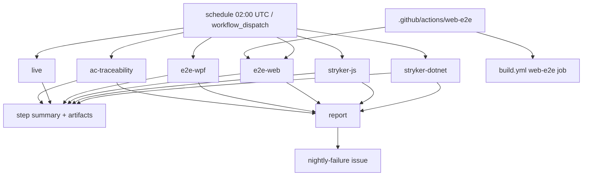

# Technical Specification: Nightly Quality Pipeline

**Complexity:** complex (a new scheduled workflow with six jobs across Windows and Ubuntu, two mutation-testing toolchains, a refactor of the existing `web-e2e` job into a shared composite action, three PowerShell scripts with self-tests, and documentation; no domain, API or persistence change)

## 1. Technical Overview

**What.** A scheduled workflow, `.github/workflows/nightly.yml` (cron 02:00 UTC plus `workflow_dispatch`), that runs the checks too slow or too external for a pull request: Stryker.NET over both Domain projects, StrykerJS over the web app's pure logic, the full Playwright and FlaUI suites, the `Category=Live` verifications and an acceptance-criteria traceability report. Every job publishes its result to the run's step summary. One final job opens or updates a single `nightly-failure` GitHub issue when a blocking-class job fails. The workflow is never a required check.

**Why.** After F01–F13 the PR gate measures line and branch execution, but nothing measures whether the assertions would notice a wrong answer (mutation score), the PR smoke suites cover five journeys per front end, and the live parsers are verified by nobody. A nightly run makes those three blind spots visible without slowing a PR or blocking a merge.

**Scope.**

**Included:**
- `nightly.yml` with jobs `stryker-dotnet`, `stryker-js`, `e2e-web`, `e2e-wpf`, `live`, `ac-traceability` and `report`.
- Stryker.NET as a local dotnet tool with one committed config shared by the two Domain projects; StrykerJS with a committed `stryker.config.json`, an incremental cache and `npm run test:mutation`.
- A shared composite action, `.github/actions/web-e2e`, extracted from the `web-e2e` job so the PR smoke run and the nightly full run share one build, publish and start-the-app block.
- Three scripts with self-tests: `mutation-score.ps1`, `test-results-summary.ps1`, `ac-traceability.ps1`; plus `nightly-issue.ps1`, whose decision logic is tested with a fake `gh`.
- Documentation in `docs/ci-affected-pipeline.md` and a one-line pointer in `CLAUDE.md`.

**Output contracts (Provides):** none consumed by another feature.
**Input contracts (Consumes):** F07 `Category=Live` trait; F12 full Playwright suite (`npm run test:e2e`); F13 full FlaUI suite (`Category=E2E`).

**Excluded:**
- Any break threshold on a mutation score before three runs exist (PRD). Setting `break-at` is a later PR by the owner, not part of this feature.
- Mutation testing of Application or Infrastructure projects, or of `.tsx` components (PRD Out of Scope).
- A mutation gate on pull requests.
- Auto-closing the `nightly-failure` issue when the next run is green; the owner closes it.
- Backfilling acceptance-criterion ids into the ~45 PRDs that have none (user decision: those PRDs get one summary line).
- Fixing the two stale live tests (`DicionarioDoInvestidorVerificationTests`, `GoogleFinanceVerificationTests`); the nightly reports them, which is the point.

## 2. Architecture Impact

Affected components:
- `.github/workflows/nightly.yml` (new), `.github/workflows/build.yml` (the `web-e2e` job body moves into the composite action).
- `.github/actions/web-e2e/action.yml` (new).
- `.github/scripts/` (four new scripts and their tests).
- `.config/dotnet-tools.json` and `.config/stryker-config.json` (new).
- `Financial.Web/stryker.config.json`, `Financial.Web/package.json` (new script and dev dependencies), `.gitignore`.
- `.github/workflows/build.yml` `changes` job (runs the new script self-tests).
- `docs/ci-affected-pipeline.md`, `CLAUDE.md`.

The nightly touches no product code and no test project. It reuses `Financial.CashFlow.Domain.Tests`, `Financial.Investment.Domain.Tests`, `Financial.App.E2ETests`, `Financial.WebPageParser.Tests` and the Playwright specs as they are.

## 3. Technical Decisions

| Decision | Chosen Approach | Alternative Considered | Trade-off |
|---|---|---|---|
| Sharing the web E2E block | Extract a composite action `.github/actions/web-e2e` taking a `command` input; `build.yml` and `nightly.yml` both call it | Copy the ~60-line build/publish/start block into `nightly.yml` | Touches the PR pipeline (validated by this PR's own run, since `.github/**` runs everything); removes a copy that would drift |
| Mutation score source | One script, `mutation-score.ps1`, reads the mutation-testing-elements JSON that both Stryker tools emit and computes `detected / (detected + undetected)` | Parse each tool's console output | One definition of "score" for both tools; depends on the JSON schema (`files.*.mutants[].status`), which both tools pin |
| Stryker.NET install | Local tool manifest `.config/dotnet-tools.json`, `dotnet tool restore` | `dotnet tool install --global` in the workflow | Pinned version, reproducible locally with the same command |
| Stryker.NET runner OS | `windows-latest`, as every other .NET job | `ubuntu-latest` (cheaper) | Parity with the environment the tests are proven on; slower and dearer, acceptable once a night |
| StrykerJS cost control | `incremental: true`, cache `reports/stryker-incremental.json` with `actions/cache` (key `stryker-js-${{ github.run_id }}`, restore-keys prefix) | No cache, full mutation each night | The PRD's 45-minute and 10-minute-rerun targets need it |
| Full Playwright run | `npm run test:e2e` through the composite action | A separate nightly-only spec list | The PRD says all specs; one definition of "full" |
| Live tests never fail the workflow | `continue-on-error: true` on the test step; failures listed in the summary by `test-results-summary.ps1` | Skip the summary and rely on logs | A known-stale site is visible every morning without a red run |
| Failure issue | `report` job (`needs` the blocking-class jobs, `if: always()`) runs `nightly-issue.ps1`, which uses `gh` to find an open issue labelled `nightly-failure` and comment on it, or create one | One issue per failing job | One issue matches the PRD; a comment per night keeps the history |
| Blocking-class jobs | `stryker-dotnet`, `stryker-js`, `e2e-web`, `e2e-wpf`, `ac-traceability` can open the issue; `live` never does | Include `live` | PRD: live failures are reported, never fatal |
| Traceability matching | Criteria with an id (`- [ ] **P52-F02-name-01**`) are matched against `[Trait("AC", "<id>")]` in `Tests/**/*.cs` and `[AC <id>]` in `Financial.Web/src/**/*.test.tsx`; PRDs without ids get one summary line (user decision) | Fail on any untraced id | Advisory, matches the PRD wording; the report job never opens an issue for gaps, only for a script crash |

### Assumptions

- **Stryker.NET invocation (PRD silent on the project wiring).** From the repo root: `dotnet stryker --config-file .config/stryker-config.json --project <Domain csproj file name> --test-project Tests/<Domain>.Tests/<Domain>.Tests.csproj --output StrykerOutput/<name>`, once per Domain project in a matrix. Reporters: `html`, `json`.
- **Threshold file value.** `thresholds.break` is `0` in both configs until three scheduled runs exist; `high` 80 and `low` 60 are Stryker defaults and only colour the report.
- **StrykerJS `mutate` globs.** `src/utils/**/*.ts` (includes `validators.ts`, `formatters.ts`), `src/hooks/**/*.ts`; excluded `**/*.test.*`, `**/__tests__/**`, `src/api/generated/**`, `src/test/**`, `src/test-utils/**`. `.tsx` is never listed.
- **Timeouts.** `timeout-minutes`: 90 for Stryker.NET per project, 60 for StrykerJS, 30 for E2E jobs, 20 for live.
- **Permissions.** Workflow default `contents: read`; only `report` gets `issues: write`.
- **Label.** `nightly-failure` is created on first use with `gh label create --force`.
- **Cron and manual runs.** Scheduled workflows run only from the default branch; `workflow_dispatch` is how the first run is exercised before merge to `main` is observed.
- **WPF E2E full run.** `dotnet test Tests/Financial.App.E2ETests --configuration Release --filter "Category=E2E"`, artifacts from `TestResults/e2e-artifacts` on failure (as the PR job does).
- **`nightly.yml` and the PR classifier.** `.github/workflows/nightly.yml` is an unclassified path, so a PR touching it runs every PR job (acceptable; no rule change).
- **Where the self-tests run.** The new `*.test.ps1` scripts run as steps in the `changes` job of `build.yml`, like the F09 scripts.

## 4. Component Overview

**CI workflows and actions:**

| File Path | New/Modified | Purpose | Key Responsibilities |
|---|---|---|---|
| `.github/workflows/nightly.yml` | New | Scheduled quality pipeline | Cron and manual trigger; seven jobs; summaries; artifacts; permissions |
| `.github/actions/web-e2e/action.yml` | New | Shared web E2E runner | Setup Node and .NET, install Chromium, build the SPA, publish the API, seed test data, start the app and wait for health, run the `command` input, stop the app |
| `.github/workflows/build.yml` | Modified | PR pipeline | `web-e2e` job calls the composite action with `npm run smoke-test`; `changes` runs the new script self-tests |

**Scripts (`.github/scripts/`, PowerShell 7):**

| File Path | New/Modified | Purpose | Key Responsibilities |
|---|---|---|---|
| `mutation-score.ps1` | New | Score and summary for either Stryker tool | Read a mutation-report JSON; count Killed, Timeout, Survived, NoCoverage, Ignored, CompileError; compute the score; append a table row to `$GITHUB_STEP_SUMMARY`; emit `score` as a step output; fail closed on a missing or unparsable report |
| `mutation-score.test.ps1` | New | Self-test | Pins the score formula, the excluded statuses, the empty-report case and the missing-file case |
| `test-results-summary.ps1` | New | List failures from a `.trx` | Read a trx; print passed/failed/skipped counts and one line per failed test with its message; append to the step summary |
| `test-results-summary.test.ps1` | New | Self-test | Pins counts, failure listing and the missing-file case |
| `ac-traceability.ps1` | New | Criteria-to-test report | Scan `docs/prd/**/prd-*.md` for id-carrying checkboxes; scan tests for tags; write a table of untraced criteria per PRD, a summary line for PRDs without ids, and totals |
| `ac-traceability.test.ps1` | New | Self-test | Fixture PRDs and tests in a temp directory; pins id parsing, both tag forms, the no-id summary line and the orphan-tag case |
| `nightly-issue.ps1` | New | Open or update the single failure issue | Take the failed job names and the run URL; with `-DryRun` print the decision; otherwise find the open `nightly-failure` issue and comment, or create it; ensure the label exists |
| `nightly-issue.test.ps1` | New | Self-test | Uses a fake `gh` first on `PATH` to pin create-versus-comment and the no-failure no-op |

**Mutation configuration:**

| File Path | New/Modified | Purpose | Key Responsibilities |
|---|---|---|---|
| `.config/dotnet-tools.json` | New | Pin `dotnet-stryker` | Local tool manifest |
| `.config/stryker-config.json` | New | Shared Stryker.NET config | Reporters, thresholds (`break` 0), mutation level, test-case filter excluding `Category=Live` and `Category=E2E` |
| `Financial.Web/stryker.config.json` | New | StrykerJS config | Vitest runner, TypeScript checker, `mutate` globs, incremental file, reporters `html` and `json`, thresholds (`break` 0) |
| `Financial.Web/package.json` | Modified | Tooling | `test:mutation` script; dev dependencies `@stryker-mutator/core` and `@stryker-mutator/vitest-runner`, and `@stryker-mutator/typescript-checker` |
| `.gitignore` | Modified | Hygiene | Ignore `StrykerOutput/`, `Financial.Web/reports/` and `Financial.Web/.stryker-tmp/` |

**Documentation:**

| File Path | New/Modified | Purpose | Key Responsibilities |
|---|---|---|---|
| `docs/ci-affected-pipeline.md` | Modified | Pipeline reference | A "Nightly pipeline" section: jobs, schedule, artifacts, the break-threshold rule, how to read the report, the issue rule |
| `CLAUDE.md` | Modified | Pointer | One sentence in the CI section naming `nightly.yml` and `npm run test:mutation` |

## 5. API Contracts

Not applicable: no HTTP endpoint is added or changed. The only interfaces are the scripts' command-line contracts.

| Script | Parameters | Output |
|---|---|---|
| `mutation-score.ps1` | `-Report <path>`, `-Name <label>`, `-SummaryPath <path>` (default `$env:GITHUB_STEP_SUMMARY`), `-OutputPath <path>` (default `$env:GITHUB_OUTPUT`) | Table row in the summary; `score=<n.n>` in the output file; exit 1 when the report is missing or invalid |
| `test-results-summary.ps1` | `-Trx <path>`, `-Name <label>`, `-SummaryPath <path>` | Counts and one line per failed test; exit 0 whenever the file parses, 1 when it is missing |
| `ac-traceability.ps1` | `-PrdRoot docs/prd`, `-TestRoots Tests,Financial.Web/src`, `-SummaryPath <path>` | Markdown: totals, per-PRD untraced ids, a line per PRD without ids; exit 1 only on an internal error |
| `nightly-issue.ps1` | `-FailedJobs <string>` (comma-separated), `-RunUrl <url>`, `-DryRun` | One issue created or commented; nothing when `-FailedJobs` is empty |

## 6. Data Model

Not applicable. The only data are the tools' report files, consumed in place:

| File | Producer | Fields read |
|---|---|---|
| `mutation-report.json` | Stryker.NET, StrykerJS | `files[*].mutants[].status` |
| `*.trx` | `dotnet test --logger trx` | `UnitTestResult@outcome`, `@testName`, `Output/ErrorInfo/Message` |
| `reports/stryker-incremental.json` | StrykerJS | Opaque; cached between runs, never parsed by us |

## 7. Testing Strategy

**Test File Structure:**

| Test File | Test Type | Target | Coverage Goal |
|---|---|---|---|
| `.github/scripts/mutation-score.test.ps1` | Script self-test | `mutation-score.ps1` | Every branch |
| `.github/scripts/test-results-summary.test.ps1` | Script self-test | `test-results-summary.ps1` | Every branch |
| `.github/scripts/ac-traceability.test.ps1` | Script self-test | `ac-traceability.ps1` | Every branch |
| `.github/scripts/nightly-issue.test.ps1` | Script self-test | `nightly-issue.ps1` | Every branch |
| `nightly.yml` run via `workflow_dispatch` | Workflow run | The seven jobs end to end | Each AC below |

**`mutation-score.test.ps1`:**

| Test | Description | Assertions |
|---|---|---|
| Score counts killed and timeout as detected | 6 Killed, 2 Timeout, 2 Survived, 0 NoCoverage | Score 80.0 |
| NoCoverage counts as undetected | 4 Killed, 1 Survived, 5 NoCoverage | Score 40.0 |
| Ignored and CompileError are excluded | 3 Killed, 1 Survived, 5 Ignored, 5 CompileError | Score 75.0 |
| No mutants | Empty `files` | Exit 1 with a message, no divide-by-zero |
| Missing report | Path does not exist | Exit 1 naming the path |
| Writes summary and output | Temp paths | Row contains the name and score; output file has `score=` |

**`test-results-summary.test.ps1`:** passing-only trx (zero failures listed); mixed trx (counts and one line per failure with its message); skipped counted separately; missing file (exit 1).

**`ac-traceability.test.ps1`:** an id with a `Trait` tag is traced; an id with a web `[AC id]` title is traced; an id with no tag is listed untraced under its PRD; a PRD with no ids yields one line "N criteria, no ids"; a tag naming an id that no PRD has is listed as an orphan; an unticked and a ticked checkbox are both read.

**`nightly-issue.test.ps1`:** empty failure list does nothing; no open issue creates one with the label and the run URL; an open issue gets a comment, not a second issue; the label-create call is made once.

**Workflow acceptance (manual `workflow_dispatch` after each stage merges, results recorded in the stage's PR):**

| Criterion (PRD §9) | How it is verified |
|---|---|
| `nightly.yml` runs on cron and manual dispatch, not required | The file's `on:` block; absent from `ci-status` `needs` and from branch protection |
| Stryker report and score for both Domain projects in the summary | Dispatch run; two summary rows |
| StrykerJS report and score in the summary | Dispatch run; one summary row |
| StrykerJS never mutates `.tsx`, generated code or test helpers | Report's `files` keys contain no `.tsx`, no `api/generated`, no `test` paths |
| Second StrykerJS run reuses the cache, ≤ 10 min | Two dispatches with no source change; the second's job duration |
| No break threshold until 3 runs | Both configs hold `break: 0`; documented rule |
| Full Playwright and FlaUI suites run, artifacts on failure | Dispatch; spec counts above the smoke counts; failure drill uploads artifacts |
| `Category=Live` failures reported, workflow stays green | Dispatch with the two known stale tests failing; the run is green and the summary lists them |
| AC table lists criteria with no traced test | Summary table matches a manual count for one ID'd PRD |
| One `nightly-failure` issue opened or updated | Forced failure on a branch dispatch creates one; a second forced failure comments |

**Cross-Feature Integration (PRD §9):**
- *F14's live-check step selects exactly the tests F07 tagged `Category=Live`:* `dotnet test --filter "Category=Live" --list-tests` on the four `WebPageParser` verification classes equals the live job's set; asserted once by comparing the job's trx test names with that list.
- *F14's nightly E2E step runs F12's full spec set and F13's full `Category=E2E` set, with the same artifact types as the PR jobs:* the e2e-web job runs `playwright test` without `--grep`; the e2e-wpf job filters `Category=E2E`; the artifact names and paths match the PR jobs'.

## 8. Error Handling

| Condition | Behaviour |
|---|---|
| Stryker crashes or the report is missing | `mutation-score.ps1` exits 1, the job fails, `report` opens or updates the issue |
| Stryker.NET finds no tests for a mutant | Counted as NoCoverage by the tool; part of the score, no special handling |
| StrykerJS incremental cache missing or corrupt | The tool does a full run; the job is slower, not failed |
| Playwright or FlaUI spec fails | Job fails after uploading `playwright-report/` and `test-results/` or `TestResults/e2e-artifacts`; issue updated |
| WPF desktop session unavailable on the runner | Job fails; the PRD's fallback rule is about the PR job, not this one; the nightly keeps reporting |
| Live site changed or down | The `live` test step fails, the job still succeeds, the summary lists the failed tests; no issue |
| `ac-traceability.ps1` throws | Job fails and the issue is updated; untraced criteria alone never fail it |
| `gh` cannot reach the API or lacks `issues: write` | `nightly-issue.ps1` exits 1 with the underlying message; `report` fails, which is visible on the run |
| A PRD cannot be parsed | Listed as "unreadable" in the report, the rest continues |
| Two failures in one night | One issue, one comment naming every failed job |

## 9. Acceptance Criteria Mapping

| PRD §9 criterion | Spec section | Stage |
|---|---|---|
| `nightly.yml` on cron and manual dispatch, not required | 1, 3, 7 | 1 |
| Stryker report and score for both Domain projects in the summary | 4, 7 | 1 |
| StrykerJS report and score in the summary | 4, 7 | 2 |
| StrykerJS never mutates `.tsx`, generated code or test helpers | 3 (assumptions), 7 | 2 |
| Second StrykerJS run reuses the cache, ≤ 10 min | 3, 7 | 2 |
| No break threshold until 3 runs; each threshold PR sets lowest − 5 | 3, 7, docs | 1, 2, 4 |
| Full Playwright and FlaUI suites run, artifacts on failure | 3, 4, 7 | 3 |
| `Category=Live` failures reported, never fail the workflow | 3, 8 | 3 |
| AC-traceability table lists criteria with no traced test | 3, 4, 7 | 4 |
| A nightly failure opens or updates one `nightly-failure` issue | 3, 4, 8 | 4 |
| Cross-feature: live step selects exactly F07's `Category=Live` tests | 7 | 3 |
| Cross-feature: nightly E2E runs F12's full set and F13's full `Category=E2E` set with matching artifacts | 7 | 3 |
