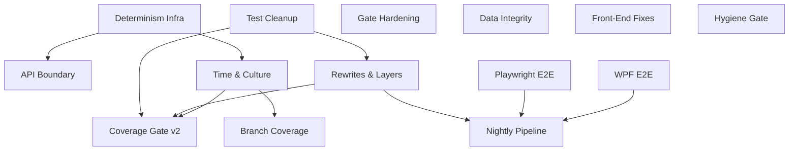

# Test Quality and CI Gates

## 1. Executive Summary

This product is a quality programme for the Financial repository's automated tests and its CI merge gate. It turns a suite that is large but noisy (~8,460 tests, three line-only 90% coverage floors) into one where every test protects a behaviour, every run is deterministic, and the gate measures meaningful signal: branch coverage, coverage of changed code, regression ratchets and assertion strength. It also standardizes UI end-to-end testing for both front ends: Playwright for the React SPA and FlaUI/UIA3 for the WPF desktop client.

It serves the single owner-developer of this self-hosted tool and the AI implementation agents that write most new features and tests under `implement-feature`. The core value is trust. A green `ci-status` should mean that money calculations, persistence and both front ends actually work, not that enough lines were executed.

It works in four layers:
1. Fix the defects and non-determinism the audit found, each with a failing test first.
2. Remove, merge and re-layer the ~700 low-value tests, so that coverage numbers reflect real protection.
3. Harden the CI gate with a re-baselined line+branch ratchet, diff coverage, a hygiene check, architecture rules and a contract-snapshot guard.
4. Add a small, critical-path E2E smoke suite per front end on PRs, plus a nightly pipeline that runs the full E2E suites, mutation testing (Stryker.NET on the Domain projects, StrykerJS on the web app's logic) and live-verification checks.

## 2. Problem and Opportunity

### The Problem

**Real defects slip past a green build**
- CashFlow reads hand out live collections (`CashFlowJsonRepository.cs:26`), so a GET during a POST can throw "Collection was modified". No test exercises concurrent reads.
- Reserve-split movements are rounded per bucket with no residual (`ReserveService.cs:345-349`). A split can be off by ±£0.01, and the only test computes its expected value with production logic.
- `GET /api/v1/financial/<unknown>` returns 200 `text/html` from the SPA fallback. This is the incident class behind the `API_BASE_URL` rule.
- `CashFlowSpreadsheetImport` defaults its output to the live `data/data-cashflow.json` and drops app-native records with no warning.

**Tests that lock in bugs or prove nothing**
- React suggests round-up `"0.60"` and WPF suggests `"0.6"`. Each suite asserts its own variant.
- `todayIsoDate()` returns the UTC date (wrong 00:00–01:00 BST), and its tests compute the expectation the same way.
- 34 `ControllerGuardClauseTests` cover paths the file calls "unreachable via HTTP". There are also 170 constructor null-guard tests, 35 "rethrows" tests that pass with the `catch` deleted, and ~27 "two ids differ" tests.
- About 590 tests (~7%) could be removed or collapsed. They obscure the real signal and slow refactors.

**Non-deterministic runs**
- `ApiTestFactory` reaches the live Frankfurter API by default (up to 11 sequential calls, 100 s default timeout).
- 17 production sites bypass `TimeProvider`. About 250 backend and 294 WPF test sites read the wall clock, and month-branching tests take different paths in January.
- 10 WPF `Task.Delay(50)` synchronizations need a `ThreadPoolWarmup` workaround. A real 2 s retry backoff runs in unit tests.
- Money parsing and formatting is never tested under pt-BR, where `"9.40"` would misparse as 940.

**A gate that measures execution, not quality**
- Three job-wide 90% line floors with ~5 points of headroom (95.5 / 94.6 / 94.6). Branch coverage is lower in every job (87.8 / 80.7 / 87.5) and isn't gated.
- There is no diff coverage, no ratchet, no mutation signal and no hygiene check.
- `coverlet.runsettings` exclusions can grow in the same PR that adds untested code.
- `OpenApiContractTests` passes unconditionally when `UPDATE_OPENAPI_SNAPSHOT` is set.
- No architecture rule enforces CashFlow ↔ Investment isolation (invariant 3).
- Web coverage counts `src/test/**` and `src/test-utils/**` as product code.

**Thin, fragile UI end-to-end coverage**
- The browser E2E is one Playwright-library script covering 2 read-only paths. It defaults to `localhost:5173`, which writes seed data into the live data file when run locally.
- WPF has no automated E2E. The app has 0 `AutomationProperties.AutomationId` values, so verification is manual UI Automation.

### The Opportunity

| Problem | Solution |
|---|---|
| Defects past a green build | Defect fixes, each with a failing-first test (data-integrity fixes, cross-front-end correctness fixes, API host boundary tests) |
| Tests that lock in bugs or prove nothing | Low-value test removal and consolidation, plus test rewrites and re-layering |
| Non-deterministic runs | Deterministic test infrastructure, plus time and culture determinism |
| Gate measures execution only | Gate hardening, Coverage Gate v2, Test Hygiene Gate, Nightly Quality Pipeline |
| Thin UI E2E | React Playwright E2E suite and WPF FlaUI E2E suite, both smoke-scoped on PRs |

The differentiator is sequencing. Noise is removed and determinism fixed **before** the new ratchet takes its baseline, so the gate locks in real protection rather than the current inflated numbers.

## 3. Target Audience

### Primary Users

**Owner-developer**
- Sole user and maintainer. Merges every PR manually and relies on `ci-status` as the merge signal.
- Needs a red build to mean a real regression in money, persistence or a front-end workflow, and a green build to be trustworthy without re-checking by hand.
- Works in two currencies and locales (UK/Brazil) and in the BST timezone, which are exactly where the current tests are blind.

**AI implementation agents**
- `implement-feature`, `spec-writer` and fork sub-agents that write most new code and tests.
- Imitate the patterns they find. Low-value test patterns in the repo get copied into new features.
- Need explicit, machine-checked rules (hygiene check, diff coverage, architecture rules) rather than conventions they might not read.

### Behavioral Profile
Both work in small, single-feature PRs (target ≤ 8 non-test code files) on a branch-per-feature workflow. Both depend on the CI pipeline for feedback rather than running the full suite locally. Both work against seeded test JSON, never the live data files.

## 4. Objectives

### Product Objectives
1. **Eliminate** known undetected defects. Every defect named in Section 2 has a test that fails on the pre-fix code and passes after the fix.
2. **Reduce** test noise. Remove or collapse low-value tests without losing behavioural protection.
3. **Make** every CI test run deterministic: no live network, no wall clock, no host locale or timezone dependence, no fixed-delay synchronization.
4. **Strengthen** the merge gate so it measures branch coverage, changed-code coverage, regressions and hygiene, not only job-wide line execution.
5. **Establish** standardized, smoke-scoped UI E2E coverage for both front ends that runs on every relevant PR.

### Success Metrics
1. 100% of the 7 named defects have a regression test, and that test fails on a revert of the fix. Verified once per feature PR by reverting the fix locally.
2. Total test methods drop by ≥ 550 (from ~8,460), and backend/WPF/web **branch** coverage does not fall below today's 87.8 / 80.7 / 87.5. Measured from the CI coverage artifacts on the first `main` run after the consolidation work merges.
3. 0 outbound HTTP calls from `Financial.Api.Tests`, verified by the default FX stub and a test asserting the real provider is never resolved. 0 production `DateTime.Now/Today/UtcNow` reads outside `TimeProvider`, verified by the hygiene check over the whole tree. 20 consecutive `main` runs with no test retried or failing intermittently.
4. Each job is blocked by a line **and** branch ratchet (0.5-point tolerance). Diff coverage is reported on 100% of PRs and is blocking after a 2–4 week observation window with a false-positive rate ≤ 10% over ≥ 20 PRs.
5. The React Playwright smoke runs in ≤ 5 min and the WPF FlaUI smoke in ≤ 8 min on PR CI. Both pass 20 consecutive `main` runs with 0 retries needed, and both upload traces/screenshots on failure.

## 5. User Stories

### F01. Deterministic Test Infrastructure
- As the owner-developer, I want `ApiTestFactory` to register a deterministic FX provider by default so that API tests never reach `api.frankfurter.app`.
- As an AI agent, I want to opt into the real FX chain explicitly, so that the rare test that needs it is visibly marked.
- As the owner-developer, I want vitest and every CI test job to run with a pinned `TZ=Europe/London` and `LANG=en-GB` so that results do not depend on the host.
- As the owner-developer, I want the Frankfurter client to have a bounded timeout so that a hung upstream cannot stall the suite or production for 100 s per call.

### F02. CI Gate Hardening
- As the owner-developer, I want `OpenApiContractTests` to fail when `CI` is set together with `UPDATE_OPENAPI_SNAPSHOT` so that a CI run can never silently rewrite the contract.
- As the owner-developer, I want an architecture test that fails if any CashFlow assembly references an Investment assembly (or the reverse) so that bounded-context isolation is machine-enforced.
- As the owner-developer, I want an architecture test that fails if a Domain assembly references ASP.NET Core, System.Text.Json or any Infrastructure assembly.
- As the owner-developer, I want architecture tests to run once per pipeline, not in both `backend` and `wpf`.
- As the owner-developer, I want `detect-changes.sh` to have a self-test so that a rule mistake that silently skips jobs is caught.
- As the owner-developer, I want the `enforce_admins: false` decision documented so that the bypass is a known, deliberate choice.

### F03. Data-Integrity Defect Fixes
- As the system, I want CashFlow reads to return a snapshot so that a GET never throws while a save mutates the collection.
- As the owner-developer, I want a reserve split to conserve its total exactly so that reserve balances never drift from bank balances by a penny.
- As the owner-developer, I want `CashFlowSpreadsheetImport` to refuse to run without an explicit output path so that it can never overwrite the live data file by default.
- As the owner-developer, I want the import tool to list which app-native record types a rebuild will not carry over, with their counts, before writing, so that the intended omission is never a surprise.

### F04. Cross-Front-End Correctness Fixes
- As the owner-developer, I want one round-up suggestion rule in Domain/Application so that React and WPF show the same value with the same formatting.
- As the owner-developer, I want new-entry forms to default to my local calendar date so that an entry made at 00:30 BST lands on the right day.
- As the owner-developer, I want the test that asserts an empty `API_BASE_URL` replaced, so that the suite no longer pins a configuration CLAUDE.md forbids.

### F05. API Host Boundary Tests
- As the owner-developer, I want unknown `/api/*` routes to return 404 and never 200 HTML, so that a renamed endpoint fails loudly instead of as `Unexpected token '<'`.
- As the owner-developer, I want every exception type the middleware maps to be covered by one table-driven test, so that a mapping change is visible.
- As the system, I want `TransientStorageException` to map to 503 so that a storage outage is distinguishable from a server bug.
- As the owner-developer, I want a Production-environment 500 response to be verified not to leak exception details or financial values.
- As the owner-developer, I want `GoogleDriveClient` (the production storage provider) covered by contract tests over a fake HTTP handler so that save/load regressions are caught.

### F06. Low-Value Test Removal and Consolidation
- As the owner-developer, I want the 34 unreachable null-body controller tests deleted together with the dead guards they execute.
- As an AI agent, I want constructor null-guard checks collapsed into one reflection theory per assembly so that I stop writing new per-class copies.
- As the owner-developer, I want duplicate ID, getter-echo, enum-shape and `ConvertBack_*Throws` tests removed.
- As the owner-developer, I want copy-pasted React dialog and list-tab contract tests turned into shared `describe.each` tables.
- As the owner-developer, I want the 7 untracked ghost test directories removed from the working tree.

### F07. Test Rewrites and Re-Layering
- As the owner-developer, I want "rethrows" tests rewritten to assert that the failed span is recorded so that deleting the `catch` fails a test.
- As the owner-developer, I want mirror tests to assert literal expected values instead of recomputing them with production code.
- As an AI agent, I want every .NET test categorized as `Unit`, `Integration` or `Live` by trait so that CI and local runs can filter by level.
- As the owner-developer, I want `Shared.Abstractions` types tested in their own `Financial.Shared.Abstractions.Tests` project.
- As the owner-developer, I want Investment.Infrastructure `Services/*` tests either to prove a disk round-trip or to be removed in favour of the Application tests.
- As the owner-developer, I want web list-tab tests to render the real hook over a mocked API client instead of mocking their own hook.

### F08. Time and Culture Determinism
- As the system, I want all 17 production wall-clock reads to go through the injected `TimeProvider` so that date logic is testable.
- As the owner-developer, I want wall-clock tests migrated to a pinned clock, including explicit January, month-end and midnight cases.
- As the owner-developer, I want WPF view-model tests to await the command's task instead of `Task.Delay(50)` so that they are neither flaky nor slow.
- As the owner-developer, I want the Google retry policy's backoff injected so that its tests run in milliseconds.
- As the owner-developer, I want money parsing tested under pt-BR, and machine-format parsing to use the invariant culture.

### F09. Coverage Gate v2
- As the owner-developer, I want a committed per-job baseline of line and branch coverage, and a gate that fails when either drops more than 0.5 points.
- As the owner-developer, I want diff line/branch coverage reported on every PR, first as advisory and later as blocking.
- As the owner-developer, I want a warning when a PR changes coverage exclusions so that untested code cannot be hidden by the same PR.
- As the owner-developer, I want web coverage to exclude test helpers so that the number reflects product code.
- As the owner-developer, I want the sticky PR coverage comment to show the branch %, the ratchet delta and the diff coverage.

### F10. High-Risk Branch Coverage
- As the owner-developer, I want the failure paths of the lowest-branch WPF view models tested so that delete and state-change errors show the right message and leave state intact.
- As the owner-developer, I want backend decision-heavy classes brought up to ≥ 90% branch coverage with behaviour tests.
- As the owner-developer, I want the payments-due month-rollover and annual-average edge cases pinned by tests with a fixed clock.

### F11. Test Hygiene Gate
- As an AI agent, I want CI to reject newly added wall-clock reads, fixed sleeps, focused tests and skipped tests so that I cannot reintroduce flakiness.
- As the owner-developer, I want the hygiene check to apply only to lines changed in the PR so that legacy code does not block unrelated work.
- As the owner-developer, I want ESLint to flag `.only` and `.skip` in vitest and Playwright specs.

### F12. React Playwright E2E Suite
- As the owner-developer, I want the browser smoke to be a `@playwright/test` project with a config that runs headless, records trace/screenshot/video only on failure, and retries twice in CI.
- As the owner-developer, I want the suite to refuse to run unless `SMOKE_APP_URL` is set and the API reports it is serving test data, so that a local run can never touch my live data.
- As the owner-developer, I want smoke specs that cover app start, navigation to an investment asset, adding an expense, a validation failure and a server-error message.
- As an AI agent, I want locator rules (role/label first, `data-testid` only by exception) documented and enforced by review.

### F13. WPF FlaUI E2E Suite
- As the owner-developer, I want a `Financial.App.E2ETests` project that launches the real WPF executable against a temp copy of the test data and drives it through UIA3.
- As the owner-developer, I want stable `AutomationProperties.AutomationId` values on every control the E2E workflows use, under a documented naming convention.
- As the owner-developer, I want a WPF smoke covering app start, the dashboard tree, adding an expense, a visible validation error, and opening an investment asset.
- As the owner-developer, I want the app process killed and temp data deleted after every test, even on failure.
- As the owner-developer, I want screenshots, the app log and the process exit info uploaded when a WPF E2E test fails.

### F14. Nightly Quality Pipeline
- As the owner-developer, I want Stryker.NET to run nightly over both Domain projects and publish the mutation score, without blocking anything at first.
- As the owner-developer, I want StrykerJS to run nightly over the web app's pure logic (`src/utils`, `src/hooks`, form validators) so that weak assertions in the money-formatting and form-rule tests are visible too.
- As the owner-developer, I want the full Playwright and FlaUI suites and the `Category=Live` verifications to run nightly so that slower or external checks still get exercised.
- As the owner-developer, I want a report comparing PRD Section 9 criteria against `[Trait("AC", …)]` tags so that I can see which criteria have no traced test.

## 6. Functionalities

### F01. Deterministic Test Infrastructure

**Provides:**
- Deterministic `ApiTestFactory` with a stub FX provider by default and an explicit real-chain opt-in (used by F05)
- Pinned test environment: `TZ=Europe/London`, `LANG=en-GB`, vitest `process.env.TZ` set in setup, and a .NET test culture of `en-GB` (used by F08)

**Capabilities:**
- `ApiTestFactory` registers a stub `IExchangeRateProvider` that returns fixed rates (GBP/BRL/USD/EUR pairs from a committed table). Tests opt into the real chain with a named method such as `WithRealExchangeRates()`. No test uses it in CI.
- A guard test resolves the FX provider from a default factory and asserts it is the stub.
- `FrankfurterExchangeRateProvider`'s `HttpClient` gets a 10 s timeout and honours cancellation. A unit test with a hanging fake handler completes in < 11 s and returns the existing fallback result. A test with a 5xx handler asserts no more than 1 call per requested date.
- `TZ` and `LANG` are set at job level in `backend`, `wpf`, `web` and `smoke`, and in `Financial.Web/src/test/setup.ts`.

**Experience:** A developer runs `dotnet test Tests/Financial.Api.Tests` with no network and every test passes. Running vitest on a pt-BR or UTC host gives the same results as CI.

### F02. CI Gate Hardening

**Capabilities:**
- `OpenApiContractTests` throws a failing assertion with the message `UPDATE_OPENAPI_SNAPSHOT must not be set in CI` when `CI=true` and the flag is non-empty.
- New `BoundedContextIsolationTests`: every assembly whose name starts with `Financial.CashFlow.` must not reference `Financial.Investment.*`, and the reverse, across Domain, Application and Infrastructure (6 assertions). The tests reuse the existing `ProjectAssembly` helper.
- New Domain purity rule: `Financial.*.Domain` must not reference `Microsoft.AspNetCore.*`, `System.Text.Json`, `Financial.*.Infrastructure` or `Financial.Shared.Infrastructure`.
- The `wpf` job stops running `Financial.Architecture.Tests`. They run in `backend` only.
- `detect-changes.sh` gets a fixture-driven self-test (≥ 15 path → expected-jobs cases, including `*.md` under `Financial.Web/`, `.claude/**`, `Tests/Financial.Api.Tests/*` → web=true, and an unknown path → all). It runs as a step in the `changes` job. Paths ending in `.md` count as docs-only only outside the source directories `Financial.*`, `Tests/`, `Tools/` and `Integrations/`.
- `docs/ci-affected-pipeline.md` records that `enforce_admins` is deliberately `false` (single-user repo, an emergency escape hatch) and that any admin merge on red must be followed by a fix PR.

**Experience:** A wrong change to the classifier or to a context reference fails `ci-status` with a message that names the offending path or assembly.

### F03. Data-Integrity Defect Fixes

**Capabilities:**
- CashFlow read/write safety: repository reads (`GetExpenses`, income, movements, banks, and every `ItemCollection` getter) return an immutable snapshot (an array copy taken under the write gate, or a copy-on-write list). A test runs `ApplyAndSaveAsync`, blocked mid-write by `ControllableJsonStorage`, against 1,000 expenses while another task enumerates `GetExpenses()` and runs `BankService.GetBankBalancesByMonth`. Enumeration completes without `InvalidOperationException` and sees either the before state or the after state.
- Reserve split conservation: `CreateSplitMovements` assigns any rounding residual to the bucket with the largest percentage (tie → first by display order). Test: buckets at 33.33/33.33/33.34% and £100.01 produce the literal amounts 33.33/33.33/33.35, which sum to 100.01. A property-style theory over ≥ 50 generated amounts asserts the sum equals the base to the penny. The mirror tests in `IncomeServiceTests` (~lines 360 and 463) are rewritten with literals.
- Import tool guards: `CashFlowSpreadsheetImport` requires an explicit `--output <path>`. With no output, or an output that resolves to the configured live data file, it exits with code 2 and writes nothing. Before writing, it prints one line per non-carried type (Transfers, BalanceAdjustments, Tithe carry-forwards, user Categories) with the count found in the existing output file. The omission itself is intended and unchanged.

**Experience:** Running the import tool without `--output` prints `Refusing to run: --output is required and must not be the live data file (data/data-cashflow.json).` and exits 2. A valid run prints `Not carried over: Transfers 12, BalanceAdjustments 3, Tithe carry-forwards 1, Categories 4`, then the normal summary.

**Error Handling:**
- Output path equals the live file (after `Path.GetFullPath` normalization) → exit 2 with the refusal message, and no file is touched.
- Existing output file is unreadable or corrupt when counting non-carried types → exit 3: `Cannot read existing output to report non-carried records: <reason>`, and nothing is written.
- Split base is zero or there are no active buckets → no movements are created and the income still saves. The test asserts zero movements and no exception.
- Snapshot read during a failed save → readers see the pre-save state, and the existing rollback test still passes.

### F04. Cross-Front-End Correctness Fixes

**Core Scope:**
- A single round-up suggestion rule, local-date default, and replacement of the empty `API_BASE_URL` test

**Full Scope additions:**
- Consolidate the four reserve-split ±0.01 tolerance implementations (`reserveBucketSplit.ts`, `ReservaViewModel.cs:70`, `ReserveBucketsViewModel.cs:71`, `ReserveBucketService.cs:118`) into the Application service, with one message text, and have both front ends display the server result

**Capabilities:**
- Round-up rule: the suggestion is `ceil(v) − v` rounded to 2 dp, exposed from Domain/Application. Both front ends compute it with the same rule and display it with each front end's money formatter at a fixed 2 dp. Domain test literals: 9.40 → 0.60, 10.00 → 0.00, 0.01 → 0.99, 9.995 → 0.01. `useExpenseForm.test.ts` and `ExpenseWorkflowViewModelTests` keep one interaction test each ("keeps recalculating as typed until manually edited") and both assert `0.60`. Their value-table tests are deleted.
- `todayIsoDate()` returns the local calendar date (`getFullYear/getMonth/getDate`). Test: `vi.setSystemTime('2026-07-01T00:30:00+01:00')` with `TZ=Europe/London` → `'2026-07-01'`, and the 1st-of-month case → the same month. Every web test that builds its expectation with `new Date().toISOString().slice(0,10)` is rewritten to use a pinned time and a literal.
- `config.test.ts` "API_BASE_URL_WhenUnset_ReturnsEmptyString" is replaced by a test that asserts the documented production value `/api/v1/financial` is used when the env var is set, and that an unset value is treated as misconfiguration according to the existing config contract.

**Experience:** Typing 9.40 in either front end shows a round-up suggestion of `0.60`. A new expense opened at 00:30 BST on 1 July defaults to 01/07.

### F05. API Host Boundary Tests

**Consumes:**
- F01: deterministic `ApiTestFactory` with the stub FX provider

**Capabilities:**
- The SPA fallback excludes `/api/**`: `MapFallbackToFile` is constrained so unmatched `/api/...` paths return 404 with no HTML body. Test: a factory with a temp `wwwroot/index.html` asserts `GET /api/v1/financial/does-not-exist` → 404 with a content type that is not `text/html`, and `GET /some/client/route` → 200 `text/html`.
- Exception mapping: one theory covers all 8 mapped exception types plus `TransientStorageException` and asserts each status code. `TransientStorageException` → 503. `ArgumentException` raised from infrastructure is no longer mapped to 400. The 400 mapping applies only to the domain/validation exception types.
- Production 500: a host running in the `Production` environment that throws an unmapped exception returns 500 with a ProblemDetails body that contains no stack trace, exception message or decimal values. A test asserts this.
- `GoogleDriveClient` contract tests over a fake `HttpMessageHandler`: upload, download, file-not-found (404 → the documented exception), retry on 429/503 (bounded by the injected delay seam from F08 or a local seam), and `invalid_grant` on token refresh. If the client is found to hold < 30 lines of non-SDK logic, it is instead added to the `coverlet.runsettings` exclusions next to GoogleSheets, with a comment giving the reason. That decision is recorded in the PR.

**Experience:** A frontend call to a renamed endpoint now produces a clear 404 error state in the UI, not a JSON parse error.

**Error Handling:**
- `wwwroot` is missing in the test host → the fallback test fails setup with an explicit message, not a false pass.
- A new exception type is added without a mapping → the theory's "all public exception types in Domain are mapped" assertion fails and names the type.
- A storage outage during save → 503 with `Retry-After: 30`, and the SPA shows its existing server-error state.

### F06. Low-Value Test Removal and Consolidation

**Provides:**
- A consolidated suite with ≥ 550 fewer test methods and unchanged behavioural protection (used by F07, F09)

**Capabilities:**
- Remove (~125): 34 `*_Null{Request,Body}_ReturnsBadRequest` tests plus the dead controller guards they cover; ~27 duplicate ID tests (one "assigns non-empty ID" kept per aggregate root); 19 `ConvertBack_*Throws*` tests; `SyncState_Should_Have_Exactly_Four_Members`; the `OpenLotTrackerTests.cs:61` reflection line; static-presence web tests (~10–15); per-endpoint camelCase tests; duplicate Observability/Swagger/NavigationService null-guard tests.
- Merge/parameterize (~580 → ~110): 170 + 50 constructor null-guards → one reflection theory per assembly that discovers public constructors and asserts `ArgumentNullException` per reference parameter; 47 `CashFlowDataTests` → `IdCollection<T>` tests plus one `MemberData` wiring theory; 18 ReferenceConverter tests → a generic `ReferenceConverterTests<T>`; 22 migrator scaffold tests → one theory per behaviour; finance-service triplets (9 → 3); ~31 React dialog contract tests → 3 `describe.each` tables; ~36 list-tab template tests → ~12; retry sync/async pairs → theories; ~20 getter echoes → one `Create_AssignsAllFields` per entity.
- Each removal PR states, for each removed group, the retained test that covers the behaviour. Line coverage per job may drop by up to 1.0 point. Branch coverage must not drop below the pre-PR value.
- The 7 untracked ghost directories under `Tests/` are deleted locally, with a note in the PR. They aren't tracked, so there is no git change.

**Experience:** Test files read as behaviour lists. A reviewer can see one test per behaviour instead of scrolling past boilerplate.

### F07. Test Rewrites and Re-Layering

**Consumes:**
- F06: consolidated suite (rewrites apply only to surviving tests)

**Provides:**
- A `[Trait("Category", "Unit"|"Integration"|"Live")]` classification on every .NET test class, and a `Financial.Shared.Abstractions.Tests` project (used by F09, F14)

**Capabilities:**
- 35 rethrow tests → one test per service asserting `RecordingTelemetryTracer` records a failed span with the exception type, and that the exception propagates.
- Mirror tests (the IncomeService split tests, web UTC-date expectations, `UkExpensePromptDialog.test.tsx:53`) → literal expectations.
- Weak assertions rewritten: `DataQualityReportFormatterTests.Format_SalesExceedPurchases_*` asserts exact output lines; `ResolvesPastFileCheck` asserts the positive outcome; `App.test.tsx` theme test asserts the provider's theme attribute or token instead of the Fluent-generated class.
- Traits: Api.Tests' ~94 host-less tests → `Unit`; Investment.Infrastructure `Services/*` → `Integration`, and its Credit/Transaction CRUD tests reload from disk and assert persisted state (or are deleted where Application tests already cover the rule); 9 `Skip=` live verifications → `Category=Live` with `Skip` removed. CI `backend` filters out `Category=Live`.
- New `Tests/Financial.Shared.Abstractions.Tests` gets `UsdBasedExchangeRateProviderTests` (moved) and direct tests for `CompensatingSaveHelper`. It is added to `Financial.slnx` and covered by the `backend` job.
- `TransactionsTab`, `CreditsTab` and `PriceHistoryTab` tests render the real hook over a mocked `financialApiClient` and assert the visible outcome (form appears, row added).
- `testing-guide-Financial` and `docs/rules/implementation.md` §Tests are updated with the layer responsibility split (Unit / Component / Integration / UI E2E), the trait convention, the literal-expectation rule and the no-constructor-null-test rule.

**Experience:** `dotnet test --filter Category=Unit` runs in under 60 s locally, and every test class declares its level.

### F08. Time and Culture Determinism

**Consumes:**
- F01: pinned TZ/LANG test environment

**Provides:**
- `TimeProvider` injected at all 17 production sites, plus delay seams for retry/backoff (used by F10)
- Deterministic coverage output across runs (used by F09)

**Capabilities:**
- The 17 sites (`CardStatementService.cs:111`, `ControleMaeService.cs:51`, `InvestmentSnapshotService.cs:35`, `TitheService.cs:95`, `AssetPriceLookupService.cs:228,248,282`, `DividendService.cs:67`, `PortfolioAssetSummaryService.cs:50`, `XirrCalculationService.cs:18`, `UsdBasedExchangeRateProvider.cs:26`, `FxRateJsonStore.cs:34`, `DisposalRecord.cs:76`, `TaxClassification.cs:73,87,98`, `AssetPriceSnapshot.cs:68`) read time from an injected `TimeProvider`. Domain types take a `DateOnly`/`DateTime` "as-of" parameter instead of a provider, so Domain stays dependency-free.
- Wall-clock test uses (~250 backend, 294 WPF, 14 web files) are migrated to `FakeTimeProvider` or `vi.setSystemTime`. Month-branching tests get explicit January, month-end (31st → 1st) and midnight cases.
- WPF: the 10 `Task.Delay(50)` sites await the command's `ExecutionTask` or an exposed completion `Task`. `ThreadPoolWarmup.cs` is deleted.
- `GoogleRetryPolicy` takes an injected delay function. Its tests assert the requested delays (2 s, 4 s, …) without waiting. `CreditCardCalendarSyncServiceTests`' 2 s polling and `DebouncedJsonStorageTests.cs:137` `Task.Delay(200)` are replaced with deterministic signals.
- Culture: machine-format parsing (`GoogleSheetValueParser.cs:14-15`, `GoogleFinanceParsing.cs:25`, WPF parsing of persisted/API values) uses `CultureInfo.InvariantCulture`. User-input parsing in WPF stays culture-aware through `DecimalInputHelper`. pt-BR theories assert `"12.5"` (machine) → 12.5 and user input `"9,40"` under pt-BR → 9.40. Web formatters get an explicit-locale test for `en-GB` and `pt-BR`.
- Enlarged `waitFor` timeouts (`DetailPanel.test.tsx:266,358,369`; `MonthlyPage.test.tsx:1002,1150`) are replaced by awaiting the specific state, back at the default timeout.

**Experience:** The full suite produces identical pass/fail and identical coverage numbers when run on 31 January at 23:59 or 1 March at 00:30, on an en-GB or pt-BR host.

**Error Handling:**
- A Domain method that previously read the clock now requires an as-of date → every caller passes `TimeProvider.GetLocalNow()` from Application. A missing call site is a compile error, not a silent default.
- Culture switch regression → the pt-BR parse theory fails and names the input value.

### F09. Coverage Gate v2

**Consumes:**
- F06: consolidated suite, so the baseline does not lock in noise
- F07: Category traits (Live excluded from coverage runs) and the Shared.Abstractions test project
- F08: deterministic coverage output across runs

**Core Scope:**
- Committed baseline, blocking line+branch ratchet, web test-helper exclusion, extended PR comment

**Full Scope additions:**
- Diff coverage advisory → blocking; exclusion-change warning

**Capabilities:**
- `coverage-baseline.json` at the repo root: `{ "backend": { "line": x, "branch": y }, "wpf": {…}, "web": {…} }`. It is taken from the first `main` run after F06–F08 merge and updated only by a PR that changes this file, which the PR comment flags.
- `.github/actions/coverage-gate` is extended to read `summary.branchcoverage` and fail when line or branch < baseline − 0.5. The existing 90% line floor stays as a tripwire. Missing branch data fails closed.
- `vite.config.ts` `coverage.exclude` adds `src/test/**` and `src/test-utils/**`.
- Diff coverage: a script computes covered/total changed lines and branches per job from Cobertura (.NET) and lcov (web) against `origin/main`. Candidate tool: `diff-cover`. Scope: changed files under `Financial.*.Domain`, `Financial.*.Application`, `Financial.Api`, `Financial.App/ViewModels`, `Financial.Web/src/{hooks,utils,components,pages}`. Thresholds: 80% diff-line, 70% diff-branch. It is advisory (comment only) for 2–4 weeks. It switches to blocking after ≥ 20 PRs with ≤ 10% false positives, recorded in `docs/ci-affected-pipeline.md`.
- Exclusion guard: when a PR diff touches the `<Exclude>` in `coverlet.runsettings` or `coverage.exclude` in `vite.config.ts`, the PR comment shows a ⚠ line listing the added patterns. This is advisory.
- The sticky PR comment gets these columns per job: Line %, Branch %, Δ vs baseline (line/branch), Diff line %, Diff branch %, Verdict.

**Experience:** A PR that adds an untested branch-heavy class sees `backend branch 87.1% (−0.7 vs baseline 87.8) ✖` and a failing `ci-status`.

**Error Handling:**
- Baseline file missing or unparsable → the gate fails with `coverage-baseline.json missing or invalid`.
- Merge base unavailable (shallow clone) → diff coverage reports `not computed` and does not block. The ratchet still runs.
- A job is skipped by path classification → its ratchet is skipped, and `ci-status` treats it as passed (same as today).

### F10. High-Risk Branch Coverage

**Consumes:**
- F08: injected `TimeProvider` and delay seams for pinned-clock tests

**Capabilities:**
- WPF failure paths, each tested for the error message shown, state left unchanged and commands re-enabled: `ReservaViewModel` (50% → ≥ 85% branch, including `DeleteMovementAsync` failure), `CardsWorkflowViewModel` `Mark/UnmarkStatementPaidAsync` failure, `IncomeSplitViewModel`, `ReportingCurrencyViewModel`, `CorporateActionsTabViewModel`, `TransferWorkflowViewModel`. WPF tests select through `TreeNodeViewModel.IsSelected`, never by assigning `SelectedNode`.
- Backend to ≥ 90% branch with behaviour tests: `AssetAdminService`, `CorporateActionReplay`, `SummaryController`, `AssetPriceHistoryService`.
- Web forms to ≥ 85% branch: `CreditsTab.tsx`, `EditMovementForm.tsx`, `ExpenseForm.tsx`, `TransactionsTab.tsx` validators.
- Pinned-clock edge cases: `PaymentsDueService` on the 29th with `DueDay=2` (expected behaviour confirmed against the P42 PRD before the test is written); `AnnualAverageMonthsCalculator` January → 0 and the 2017 special case; `UsdBasedExchangeRateProvider` today/future branch.
- No test may be added only to execute a line. Each new test names the behaviour it protects.

**Experience:** WPF branch coverage rises from 80.7% to ≥ 85%, and backend from 87.8% to ≥ 89%. These gains are captured by the next baseline update PR.

### F11. Test Hygiene Gate

**Capabilities:**
- A `.github/scripts/test-hygiene.sh` diff-only scan over added lines (`git diff origin/main...HEAD -U0`) fails on:
  - `DateTime.Now`, `DateTime.Today` or `DateTime.UtcNow` in `Tests/**`, or in any production file whose class has a `TimeProvider` constructor parameter.
  - `Task.Delay(` or `Thread.Sleep(` in `Tests/**`.
  - `Skip =` in `Tests/**`.
  - `.only(`, `.skip(` or `waitForTimeout(` in `Financial.Web/src/**` and `Financial.Web/tests/e2e/**`.
  - `new Date()` without fake timers in web test files (warning only).
- An escape hatch: a trailing `// hygiene-allow: <reason>` on the same line, listed in the job summary.
- ESLint adds `@vitest/eslint-plugin` rules `no-focused-tests` and `no-disabled-tests` (error) and the `eslint-plugin-playwright` recommended rules for `tests/e2e/**`.
- Runs in the `changes` job (fast, Ubuntu) and blocks via `ci-status`.

**Experience:** An agent that writes `await Task.Delay(100)` in a test sees `test-hygiene: Tests/…/FooTests.cs:42 adds Task.Delay — await the operation's Task instead` and a red check.

### F12. React Playwright E2E Suite

**Provides:**
- A `@playwright/test` suite with `@smoke`-tagged and full specs, and an HTML report plus failure artifacts (used by F14)

**Capabilities:**
- `Financial.Web/playwright.config.ts`: `testDir: './tests/e2e'`, `headless: true`, `retries: CI ? 2 : 0`, `workers: CI ? 2 : undefined`, `trace: 'on-first-retry'`, `screenshot: 'only-on-failure'`, `video: 'retain-on-failure'`, `baseURL` from the required `SMOKE_APP_URL`.
- Global setup refuses to run (exit 1, `SMOKE_APP_URL is required` / `API is not serving test data`) unless `SMOKE_APP_URL` is set **and** a health/info endpoint confirms the configured data files are test files. If no such endpoint exists, a Development/Testing-only endpoint reports the data file names. `smoke-test.mjs` is deleted and `npm run smoke-test` runs `playwright test --grep @smoke`.
- Smoke specs, 5 in total (≤ 5 min in CI):
  1. App loads and the dashboard tree renders with no console errors.
  2. Navigate to an investment asset and see its summary values.
  3. Add an expense with a unique description (`e2e-<runId>`) and see it in the monthly list.
  4. Submitting the expense form with a blank value shows the validation message and the Save button stays disabled.
  5. A server error (forced through a seeded invalid operation or a `page.route` 500 on one call) shows the user-facing error state.
- Write specs use unique data and run serially (`test.describe.configure({ mode: 'serial' })`). Read specs run in parallel.
- Locators: `getByRole` or `getByLabel` first, `data-testid` only with a comment explaining why. No CSS classes, XPath, DOM position or `waitForTimeout`.
- The `smoke` CI job installs Chromium, starts the published app on seeded test JSON (as today), runs `npx playwright test --grep @smoke`, and uploads `playwright-report/` and `test-results/` on failure.
- Local debug commands are documented in `Financial.Web/README` or CLAUDE.md: `--headed`, `--ui`, `--debug`.

**Experience:** A failing PR shows the failed step, and the run artifacts hold the trace, screenshot and video for that spec.

**Error Handling:**
- `SMOKE_APP_URL` unset → the suite aborts before any browser launches. No request is sent.
- The API reports live data files → abort with `Refusing to run against non-test data: <file>`.
- App not reachable within 60 s → global setup fails with the URL it tried.
- A write spec fails mid-flow → seeded data is per-run and discarded with the CI workspace. A local run uses a temp data copy that the smoke harness deletes.

### F13. WPF FlaUI E2E Suite

**Provides:**
- A `Financial.App.E2ETests` project with `Category=E2E` and `Smoke` traits, plus failure artifacts (used by F14)

**Capabilities:**
- New xUnit project `Tests/Financial.App.E2ETests` (`net10.0-windows`) referencing `FlaUI.Core` and `FlaUI.UIA3`, and not referencing `Financial.App` code. It launches the built exe from a configurable path.
- Launch fixture:
  1. Copies `Tests/Financial.Api.Tests/TestData/*.json` to a per-test temp directory.
  2. Starts the exe with environment overrides (`Investment__Repository__Provider=LocalJson`, `Investment__DataJsonFile`, the `CashFlow__*` equivalents, observability disabled, and the deterministic FX source if the app supports one).
  3. Waits up to 30 s for the main window through UIA, with a retry-until condition and no sleeps.
  4. On dispose: `Close()`, then kill the process tree after 5 s, then delete the temp directory.
  5. A collection fixture forces sequential execution (`[CollectionDefinition(DisableParallelization = true)]`).
- AutomationIds: `AutomationProperties.AutomationId` is added to every control the smoke uses: main window regions, the navigation tree, expense form fields, Save/Cancel, the validation message, the asset summary panel and the error banner. Naming convention: `<screen>-<element>[-<qualifier>]` in kebab-case, for example `expense-form-value`, `expense-form-save` and `dashboard-tree`. IDs are unique per window/dialog and documented in `docs/ui/` (or `testing-guide-Financial`) as part of the UI contract.
- Smoke specs, 5 in total (≤ 8 min in CI):
  1. App starts and the main window and dashboard tree are visible.
  2. Open an investment asset and see its summary.
  3. Add an expense and see it in the monthly list.
  4. Blank value → the validation message is visible and Save is disabled.
  5. Navigate to the CashFlow monthly view and see the totals displayed.
- Rules: locate by AutomationId, use names only where the label is the contract, and never use coordinates, visual-tree position or `Thread.Sleep`. All waits use `Retry.WhileNull/WhileFalse` with timeouts.
- CI: a new `wpf-e2e` job (`windows-latest`) runs when `wpf` runs. It builds `Financial.App` in Release, runs `dotnet test Tests/Financial.App.E2ETests --filter Category=Smoke`, and feeds `ci-status`. On failure it uploads per-test screenshots (FlaUI `Capture.Screen`), the app log, and the exit code/crash info. The project is excluded from the `backend` and `wpf` unit runs and from coverage.
- If the hosted runner's desktop session proves unreliable (> 2 infrastructure failures in the first 20 runs), the job is moved to the nightly pipeline and removed from `ci-status` needs. That decision is recorded in `docs/ci-affected-pipeline.md`.

**Experience:** Locally, `dotnet test Tests/Financial.App.E2ETests` opens the app, drives it visibly and closes it. A failing CI run provides a screenshot of the window at the moment of failure.

**Error Handling:**
- Main window doesn't appear within 30 s → the test fails with `Financial.App did not show its main window`, the process is killed, and the screenshot and app log are attached.
- An AutomationId isn't found → the failure names the ID and the window it searched. There is no fallback to coordinates.
- An app crash mid-test → the fixture records the exit code and the crash log, and the remaining tests in the collection relaunch a fresh process.
- Orphan process from a previous aborted run → fixture setup kills any `Financial.App` process whose start-info data path points into the E2E temp root.

### F14. Nightly Quality Pipeline

**Consumes:**
- F07: `Category=Live` trait for the live verifications
- F12: the full Playwright suite (all specs, not only `@smoke`)
- F13: the full FlaUI suite (`Category=E2E`)

**Capabilities:**
- New workflow `.github/workflows/nightly.yml` (cron 02:00 UTC plus `workflow_dispatch`), not a required check.
- Stryker.NET over `Financial.CashFlow.Domain` and `Financial.Investment.Domain` (`dotnet stryker` with a committed `stryker-config.json`) publishes the HTML report and the score in the job summary. There is no break threshold for the first 3 runs. After that, `break-at` = the lowest of those 3 scores − 5, set by a PR.
- StrykerJS (`@stryker-mutator/core` + `@stryker-mutator/vitest-runner`, TypeScript checker enabled) runs over `Financial.Web` with a committed `stryker.config.json`:
  - `mutate`: `src/utils/**/*.ts`, `src/hooks/**/*.ts` and form-validator modules.
  - Excluded: `*.test.*`, `src/api/generated/**`, `src/test*/**` and `.tsx` components (too slow and too low-signal under jsdom for nightly).
  - Incremental mode (`incremental: true`, with the `reports/stryker-incremental.json` cache restored and saved via `actions/cache`) keeps runs ≤ 45 min.
  - The HTML report and the score appear in the job summary.
  - Threshold rule is the same as Stryker.NET: none for 3 runs, then the lowest score − 5. It is set independently of the .NET threshold.
  - `npm run test:mutation` runs it locally.
- Full E2E: `npx playwright test` (all specs) and `dotnet test Tests/Financial.App.E2ETests` (all specs), with the same artifact uploads as on PRs.
- Live checks: `dotnet test --filter Category=Live`. Failures are reported in the summary but never fail the workflow, since external sites change.
- AC-traceability report: a script parses every `docs/prd/**/prd-*.md` Section 9 checkbox against `[Trait("AC", "<id>")]` tags and lists criteria with no traced test as a table in the job summary. It is advisory.
- On a failure of Stryker (crash), the E2E suites or the traceability script, the workflow opens or updates a single GitHub issue labelled `nightly-failure`.

**Experience:** Each morning the Actions tab shows one nightly run with the mutation score per Domain project and for the web logic, E2E results, live-check results and the untraced AC count.

## 7. Out of Scope

**Product features**
- An unsaved-changes guard in Web and WPF. It is a UX feature and gets a separate PRD.
- Changing `CashFlowSpreadsheetImport` to carry over Transfers, BalanceAdjustments, Tithe carry-forwards or Categories. The omission is intended; only guards are added.

**CI and governance**
- Enabling `enforce_admins` on `main`. It stays off and is documented.
- A release/deploy pipeline or a `docker build` gate.
- Removing the 90% line floor. It stays as a tripwire.
- Mutation testing on .NET Application/Infrastructure projects or on React `.tsx` components, or any mutation gate on PRs.

**E2E**
- Authentication flows. The app is single-user with no auth, so the auth/credential guidance in the source brief does not apply.
- Duplicating full business flows in both E2E suites. Shared rules are tested below the UI.
- Visual regression or snapshot tests, and cross-browser runs beyond Chromium.
- Running WPF E2E in parallel, or on self-hosted runners/VMs.

**Tooling**
- Introducing a mocking framework (Moq/NSubstitute). Hand-written fakes remain the standard.
- Testcontainers or emulators, which aren't needed for JSON persistence.
- Coverage tests for WPF Views/Controls code-behind, generated `src/api/generated/**`, the GoogleSheets wrapper or `GoogleFinanceVerifier`.

## 8. Dependency Graph

| # | Feature | Priority | Dependencies |
|---|---------|----------|--------------|
| F01 | Deterministic Test Infrastructure | 1 | None |
| F02 | CI Gate Hardening | 1 | None |
| F03 | Data-Integrity Defect Fixes | 1 | None |
| F04 | Cross-Front-End Correctness Fixes | 1 | None |
| F05 | API Host Boundary Tests | 1 | F01 |
| F06 | Low-Value Test Removal and Consolidation | 2 | None |
| F07 | Test Rewrites and Re-Layering | 2 | F06 |
| F08 | Time and Culture Determinism | 2 | F01 |
| F09 | Coverage Gate v2 | 2 | F06, F07, F08 |
| F10 | High-Risk Branch Coverage | 2 | F08 |
| F11 | Test Hygiene Gate | 2 | None |
| F12 | React Playwright E2E Suite | 2 | None |
| F13 | WPF FlaUI E2E Suite | 2 | None |
| F14 | Nightly Quality Pipeline | 3 | F07, F12, F13 |

### Execution Waves
Features within the same wave can be built in parallel. A wave starts only after every feature in earlier waves is complete.

- **Wave 1**: F01, F02, F03, F04, F06, F11, F12, F13
- **Wave 2**: F05, F07, F08
- **Wave 3**: F09, F10, F14

### Priority levels
- **1** = Essential — product does not work without it
- **2** = Important — significant value addition
- **3** = Desirable — incremental improvement

## 9. Acceptance Criteria

### F01. Deterministic Test Infrastructure
- [ ] A default `ApiTestFactory` resolves the stub FX provider, and a guard test asserts this.
- [ ] `dotnet test Tests/Financial.Api.Tests` passes with outbound network disabled.
- [ ] A test opting into the real FX chain must call an explicitly named method. No CI test calls it.
- [ ] A Frankfurter call against a hanging handler returns the fallback result in < 11 s.
- [ ] A Frankfurter 5xx makes ≤ 1 request per requested date.
- [ ] `TZ=Europe/London` and `LANG=en-GB` are set in the `backend`, `wpf`, `web` and `smoke` jobs and in vitest setup.

### F02. CI Gate Hardening
- [ ] With `CI=true` and `UPDATE_OPENAPI_SNAPSHOT=1`, `OpenApiContractTests` fails with the guard message.
- [ ] With `CI` unset, the update flow still rewrites the snapshot.
- [ ] Adding a project reference from any `Financial.CashFlow.*` to any `Financial.Investment.*` (or the reverse) fails `BoundedContextIsolationTests`.
- [ ] A Domain project referencing `Microsoft.AspNetCore.*` or `System.Text.Json` fails the Domain purity test.
- [ ] `Financial.Architecture.Tests` runs in `backend` only.
- [ ] The `detect-changes.sh` self-test has ≥ 15 cases and runs in the `changes` job. A deliberately broken rule fails it.
- [ ] A `*.md` change under `Financial.Web/src` is not classified as docs-only.
- [ ] `docs/ci-affected-pipeline.md` documents `enforce_admins: false` and the follow-up rule.

### F03. Data-Integrity Defect Fixes
- [ ] The concurrent read/write test throws `InvalidOperationException` on the pre-fix code and passes after the fix.
- [ ] Readers observe either the full before state or the full after state, never a partial list.
- [ ] A split of £100.01 at 33.33/33.33/33.34% produces 33.33/33.33/33.35.
- [ ] The conservation theory (≥ 50 amounts) passes, with the sum equal to the base to the penny.
- [ ] `IncomeServiceTests` split expectations are literals.
- [ ] The import tool without `--output` exits 2, writes nothing, and prints the refusal message.
- [ ] The import tool with `--output` resolving to the live data file exits 2 and leaves the file's timestamp unchanged.
- [ ] A valid import run prints the non-carried counts per type before writing.

### F04. Cross-Front-End Correctness Fixes
- [ ] Domain round-up tests pass for 9.40 → 0.60, 10.00 → 0.00, 0.01 → 0.99 and 9.995 → 0.01.
- [ ] Typing 9.40 shows `0.60` in both React and WPF, and both interaction tests assert `0.60`.
- [ ] The per-front-end round-up value-table tests are removed.
- [ ] `todayIsoDate()` at `2026-07-01T00:30+01:00` returns `'2026-07-01'`. The test fails on the pre-fix code.
- [ ] No web test computes an expected date with `toISOString().slice(0,10)`.
- [ ] No test asserts an empty `API_BASE_URL` as valid.
- [ ] (Full Scope) The reserve-split tolerance rule exists only in the Application service, and both front ends show the server's single message.

### F05. API Host Boundary Tests
- [ ] With `wwwroot/index.html` present, `GET /api/v1/financial/does-not-exist` returns 404 and not `text/html`. This fails on the pre-fix code.
- [ ] With `wwwroot/index.html` present, a client route returns 200 `text/html`.
- [ ] The exception-mapping theory covers all mapped types, and `TransientStorageException` → 503.
- [ ] An unmapped exception type in Domain makes the completeness assertion fail and name the type.
- [ ] A Production-environment 500 body contains no stack trace, exception message or decimal value.
- [ ] `GoogleDriveClient` upload, download, 404, 429/503 retry and `invalid_grant` are each covered by a test, or the client is explicitly excluded with a documented reason.

### F06. Low-Value Test Removal and Consolidation
- [ ] Total .NET + web test methods drop by ≥ 550, comparing the counts on `main` before and after.
- [ ] Branch coverage per job is ≥ its pre-cleanup value.
- [ ] Line coverage drops by ≤ 1.0 point per job.
- [ ] The 34 unreachable null-body tests and their dead guards are deleted.
- [ ] One constructor null-guard reflection theory per assembly replaces the per-class tests. Removing a `?? throw` from any constructor fails it.
- [ ] React dialog and list-tab contracts run as `describe.each` tables.
- [ ] Each removal PR lists the retained test covering every removed group.

### F07. Test Rewrites and Re-Layering
- [ ] Deleting the `catch` in any service makes that service's failed-span test fail.
- [ ] Every .NET test class has a `Category` trait, and an architecture-style test asserts none is missing.
- [ ] The `backend` job excludes `Category=Live`.
- [ ] The 9 live verifications no longer use `Skip=` and pass with `--filter Category=Live` against live sites when available.
- [ ] `Financial.Shared.Abstractions.Tests` exists, is in `Financial.slnx`, and covers `CompensatingSaveHelper` directly.
- [ ] Investment.Infrastructure CRUD tests reload from disk and assert persisted state, or are removed.
- [ ] The rewritten `TransactionsTab`, `CreditsTab` and `PriceHistoryTab` tests do not mock their own hook.
- [ ] `testing-guide-Financial` and `docs/rules/implementation.md` document the layer split, traits, literal expectations and the no-null-guard rule.

### F08. Time and Culture Determinism
- [ ] A whole-tree grep finds 0 `DateTime.Now/Today/UtcNow` in production code outside `TimeProvider` adapters.
- [ ] Domain types receive as-of dates rather than a `TimeProvider`.
- [ ] The full suite passes with the system clock set to 31 Jan 23:59, 1 Mar 00:30 and 1 Jul 00:30 BST.
- [ ] The full suite passes under `LANG=pt-BR` (local verification, recorded in the PR).
- [ ] 0 `Task.Delay` in `Financial.Presentation.Tests`, and `ThreadPoolWarmup.cs` is deleted.
- [ ] `GoogleRetryPolicyTests` runs in < 1 s total.
- [ ] Machine-format parsing of `"12.5"` under pt-BR returns 12.5.
- [ ] User input `"9,40"` under pt-BR returns 9.40.
- [ ] No `waitFor` in web tests uses a timeout above the default.

### F09. Coverage Gate v2
- [ ] `coverage-baseline.json` exists with line and branch values for all 3 jobs, taken after F06–F08 merged.
- [ ] Lowering branch coverage by 0.6 points in any job fails that job's gate.
- [ ] A drop of 0.4 points passes.
- [ ] A missing baseline file fails the gate closed.
- [ ] Web coverage excludes `src/test/**` and `src/test-utils/**`.
- [ ] Every PR comment shows Line, Branch, Δ vs baseline, Diff line and Diff branch per job.
- [ ] Diff coverage is advisory for its first 2–4 weeks. The switch to blocking is a separate PR citing the false-positive rate over ≥ 20 PRs.
- [ ] A PR touching coverage exclusions shows the ⚠ exclusion line in the comment.

### F10. High-Risk Branch Coverage
- [ ] `ReservaViewModel` branch coverage is ≥ 85%. A failed delete leaves the movement listed and shows the error message.
- [ ] WPF job branch coverage is ≥ 85%.
- [ ] `AssetAdminService`, `CorporateActionReplay`, `SummaryController` and `AssetPriceHistoryService` are each ≥ 90% branch.
- [ ] `CreditsTab.tsx`, `EditMovementForm.tsx`, `ExpenseForm.tsx` and `TransactionsTab.tsx` are each ≥ 85% branch.
- [ ] The payments-due rollover test pins the 29th with `DueDay=2`. Its expected value is cited from the P42 PRD.
- [ ] `AnnualAverageMonthsCalculator` January and 2017 cases have direct tests.

### F11. Test Hygiene Gate
- [ ] Adding `Task.Delay(` to a test file fails the `changes` job with a file:line message.
- [ ] Adding a new `DateTime.Now` to a service that injects `TimeProvider` fails the job.
- [ ] Adding `it.only(` fails both lint and hygiene.
- [ ] An existing legacy violation on an unchanged line does not fail the job.
- [ ] A line ending with `// hygiene-allow: <reason>` passes and is listed in the job summary.

### F12. React Playwright E2E Suite
- [ ] `smoke-test.mjs` is removed, and `npm run smoke-test` runs `playwright test --grep @smoke`.
- [ ] Running without `SMOKE_APP_URL` aborts before launching a browser, and the API receives no requests.
- [ ] Running against an API serving non-test data files aborts with the refusal message.
- [ ] All 5 smoke specs pass in CI headless in ≤ 5 min.
- [ ] The expense-add spec's record carries the run's unique ID.
- [ ] A forced failure uploads a trace, screenshot and video as artifacts.
- [ ] The specs contain no CSS-class, XPath or `waitForTimeout` locators or waits (ESLint playwright rules pass).

### F13. WPF FlaUI E2E Suite
- [ ] `Tests/Financial.App.E2ETests` exists, references FlaUI.Core and FlaUI.UIA3, and is excluded from coverage and the unit jobs.
- [ ] Every control used by the 5 smoke specs has an AutomationId that follows `<screen>-<element>[-<qualifier>]`.
- [ ] The naming convention is documented.
- [ ] All 5 smoke specs pass sequentially on `windows-latest` in ≤ 8 min.
- [ ] After a deliberately failing test, no `Financial.App` process remains and its temp data directory is deleted.
- [ ] A failing test uploads a screenshot and the app log.
- [ ] The tests contain no `Thread.Sleep` and no coordinate-based clicks.
- [ ] The `wpf-e2e` job is in `ci-status` needs, or, if the fallback rule triggered, the move to nightly is documented in `docs/ci-affected-pipeline.md`.

### F14. Nightly Quality Pipeline
- [ ] `nightly.yml` runs on cron and on manual dispatch, and is not a required check.
- [ ] The Stryker report and score for both Domain projects appear in the job summary.
- [ ] The StrykerJS report and score for `Financial.Web` utils/hooks/validators appear in the job summary.
- [ ] StrykerJS never mutates `.tsx` components, generated code or test helpers.
- [ ] A second StrykerJS run with no source changes reuses the incremental cache and finishes in ≤ 10 min.
- [ ] Neither Stryker run has a break threshold until 3 runs exist. Each threshold PR sets it to that tool's lowest score − 5.
- [ ] The full Playwright and FlaUI suites run, and their artifacts upload on failure.
- [ ] `Category=Live` failures are reported but do not fail the workflow.
- [ ] The AC-traceability table lists every PRD Section 9 criterion with no traced test.
- [ ] A nightly failure opens or updates one `nightly-failure` issue.

### Cross-Feature Integration
- [ ] F05's host tests use F01's default `ApiTestFactory` and make no outbound HTTP calls.
- [ ] F08's pinned-clock and culture tests run under F01's pinned `TZ`/`LANG`, and pass when the host timezone differs.
- [ ] F07 rewrites touch only tests that survived F06. No rewritten test is one F06 marked for removal.
- [ ] F09's baseline is taken from a `main` run that includes F06's consolidation, F07's trait filtering (Live excluded) and F08's determinism. Two consecutive runs on that commit produce identical line and branch percentages.
- [ ] F10's date-dependent tests use the `TimeProvider` and delay seams introduced by F08.
- [ ] F14's live-check step selects exactly the tests F07 tagged `Category=Live`.
- [ ] F14's nightly E2E step runs F12's full spec set (not only `@smoke`) and F13's full `Category=E2E` set, and uploads the same artifact types as the PR jobs.
