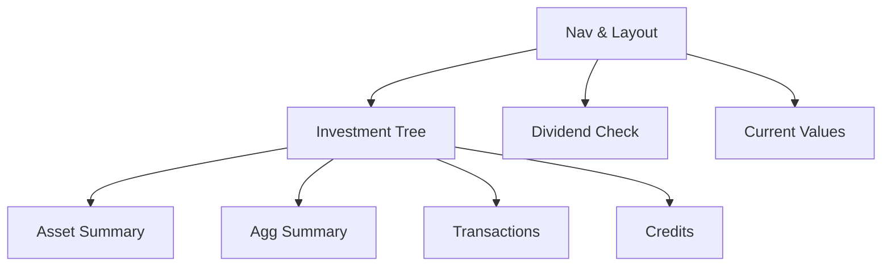

# Financial Web Front End — WPF Parity

## 1. Executive Summary

The Financial Web Front End is a React single-page application that shares a .NET REST API backend with the WPF desktop application. It manages personal investment portfolios across UK GBP brokers (Coinbase, FreeTrade, Trading 212) and a Brazil BRL broker (XPI), tracking assets, transactions, dividends, and rent credits. The WPF desktop application is the reference implementation and source of truth for all functionality, presentation, and user experience.

The current web front end has partial functionality spread across six distinct routes — broker list, broker detail, asset detail, credits, navigation tree, and a persistent sidebar — with none of these matching the WPF's three-tab structure, split-panel layout, or level of detail. This fragmented architecture causes context loss when navigating between related entities, and key Summary fields, current market value calculations, and the grouped ticker watchlist are entirely absent from the web.

This PRD defines the work required to bring the web front end to full feature and UX parity with the WPF. It restructures the application around three top-level sections matching the WPF tabs, implements a unified Portfolio Navigator with a context-sensitive split-panel detail view, introduces new API endpoints for broker and portfolio aggregated summaries, redesigns Shares Dividend Check to use a grouped watchlist dropdown, and aligns Read Assets Current Values to the same fixed portfolio scope used by the WPF.

---

## 2. Problem and Opportunity

### The Problem

**Fragmented portfolio navigation**
- The web uses six separate routes (BrokersPage, BrokerDetailPage, AssetDetailPage, CreditsPage, NavigationTreePage, plus a persistent sidebar) for content that the WPF presents in a single split-panel view
- Navigating from a broker to a portfolio to an asset requires multiple page transitions, losing tree context each time
- A persistent sidebar shows the navigation tree on every page, including Dividend Check and Current Values where it is irrelevant

**Incomplete Portfolio Navigator**
- The web has no split-panel layout; the investment tree and the detail panel are on separate routes
- No asset class filter is present in the tree; active/inactive asset indicators are absent
- Tree selection state is not preserved across the tree and detail panel
- The asset detail breadcrumb (Ticker · Exchange · Broker · Portfolio) and active/inactive status indicator are missing

**Missing summary fields and current value section**
- The web Summary tab for assets is missing ISIN, Country, Local Type, Asset Class, Current Value, As of, Total Current Value, Result %, Total Current + Credits, Result % with credits, and the Status field
- When a broker or portfolio is selected in the tree, the web shows no meaningful summary; no aggregated totals (Total Bought, Total Sold, Total Credits) are available

**Shares Dividend Check UX gap**
- The web uses a plain text input for tickers and a separate editable exchange field; the WPF provides a grouped, editable dropdown with a pre-configured watchlist of eight tickers in three categories
- There is no pre-populated list; users must type tickers from memory with no guidance on coverage
- The Price max buy value is not colour-coded to signal buy/avoid conditions

**Read Assets Current Values scope mismatch**
- The web provides broker and portfolio filter dropdowns, diverging from the WPF's fixed curated set (XPI/Default, XPI/Acoes)
- The web shows an "As of" column not present in the WPF, adding visual noise inconsistent with the reference

### The Opportunity

Each problem maps to a concrete deliverable:
- Fragmented navigation → F01: App Navigation & Layout Restructure replaces all legacy routes with three top-level sections
- Incomplete navigator → F02: Investment Tree & Split Panel Layout delivers the split-panel tree with filter, icons, and selection persistence
- Missing summary fields → F03: Summary Tab — Asset View adds all missing fields and the current value section; F04: Summary Tab — Broker/Portfolio Aggregated View introduces new API endpoints and aggregated display
- Dividend Check gap → F07: Shares Dividend Check Redesign replaces text input with a grouped editable dropdown matching the WPF watchlist
- Current Values mismatch → F08: Read Assets Current Values Redesign removes filters and aligns scope to XPI/Default and XPI/Acoes only

---

## 3. Target Audience

### Primary Users

**Personal Investor**
- Manages a multi-broker portfolio across UK (GBP) and Brazil (BRL) markets with assets spanning equities, real estate funds (FII), and fixed income
- Records all transactions and credits (dividends, rent) and tracks current market values and performance metrics
- Uses both the WPF desktop application and the React web front end interchangeably and expects consistent presentation, field names, and calculations across both interfaces

---

## 4. Objectives

**Unify navigation** to three top-level sections matching WPF tabs
- Metric: Routes `/brokers`, `/brokers/:name`, `/credits/:brokerName`, `/credits/:brokerName/:portfolioName`, and `/navigation` return 404 or redirect; top navigation bar renders exactly 3 labelled items

**Implement split-panel Portfolio Navigator** matching WPF layout and behaviour
- Metric: User can select any broker, portfolio, or asset from the investment tree and see the correct context-sensitive detail panel without a page navigation occurring

**Expose aggregated broker and portfolio summary** via new API endpoints
- Metric: `GET /api/v1/financial/summary/broker/{brokerName}` and `GET /api/v1/financial/summary/portfolio/{brokerName}/{portfolioName}` both return `{ totalBought, totalSold, totalCredits }` as decimals; Summary tab for broker and portfolio selections populates these three fields

**Match Shares Dividend Check UX to WPF**
- Metric: Grouped dropdown renders three labelled groups containing 8 pre-configured tickers; Price max buy is displayed in green when current price is below it and red when above

**Match Read Assets Current Values scope to WPF**
- Metric: Check Prices fetches active assets exclusively from XPI/Default and XPI/Acoes; no broker or portfolio filter controls are visible on the page; no "As of" column exists in the results table

---

## 5. User Stories

### F01. App Navigation & Layout Restructure
- As a user, I want to see three top-level navigation items — Portfolio Navigator, Shares Dividend Check, and Read Assets Current Values — so that I can move between the main sections of the application
- As a user, I want each section to fully replace the main content area when selected so that I do not see mixed content from multiple sections at once
- As a user, I want the application to occupy the full browser viewport without showing page-level scrollbars so that the layout matches the desktop application feel
- As a user, I want the active section to be visually distinct in the navigation bar so that I always know which section I am currently viewing

### F02. Portfolio Navigator - Investment Tree & Split Panel Layout
- As a user, I want a split panel with an investment tree on the left and a context-sensitive detail panel on the right so that I can navigate and view details without leaving the page
- As a user, I want to filter the investment tree by asset class so that I can focus on a specific category of investment
- As a user, I want broker and portfolio nodes to be expandable and collapsible so that I can control how much of the hierarchy is visible
- As a user, I want active assets to display a filled circle (●) and inactive assets an empty circle (○) so that I can distinguish active from inactive positions at a glance
- As a user, I want the selected node to remain highlighted in blue even when I interact with the right panel so that I do not lose track of my current selection
- As a user, I want to click any broker, portfolio, or asset node and see its details in the right panel without a page navigation so that tree context is preserved
- As a user, I want the detail panel header to show the name, breadcrumb, and active/inactive status of the selected entity so that I always know what I am looking at
- As a user, I want to click the copy icon next to an asset name so that the name is copied to my clipboard without a prompt

### F03. Portfolio Navigator - Summary Tab - Asset View
- As a user, I want to see the asset's Quantity, Average Price, ISIN, Country, Local Type, and Asset Class in the Summary tab so that I have full metadata visible without switching screens
- As a user, I want Total Bought displayed in green, Total Sold in red, and Total Credits in blue so that I can distinguish income from cost immediately
- As a user, I want to see the Current Value and "As of" timestamp in the Summary tab so that I know when the price data was last retrieved
- As a user, I want to click Refresh to fetch the latest market price for the selected asset so that I can update stale price data on demand
- As a user, I want to see Total Current Value, Result %, Total Current + Credits, and Result % with credits so that I can assess the full performance of my position
- As a user, I want positive Result % to appear in green and negative Result % in red so that performance direction is immediately apparent

### F04. Portfolio Navigator - Summary Tab - Broker/Portfolio Aggregated View
- As a user, I want to see aggregated Total Bought, Total Sold, and Total Credits in the Summary tab when I select a broker so that I can assess the broker's consolidated position
- As a user, I want to see aggregated Total Bought, Total Sold, and Total Credits in the Summary tab when I select a portfolio so that I can assess the portfolio's consolidated position
- As the system, I want a `GET /summary/broker/{brokerName}` endpoint so that the web front end can retrieve pre-computed aggregated totals for a broker
- As the system, I want a `GET /summary/portfolio/{brokerName}/{portfolioName}` endpoint so that the web front end can retrieve pre-computed aggregated totals for a portfolio

### F05. Portfolio Navigator - Transactions Tab
- As a user, I want to see all transactions for the selected asset in a table with Date, Type, Quantity, Unit Price, Fees, and Total columns so that I have a complete transaction history
- As a user, I want Buy transactions displayed in green and Sell transactions in red so that I can distinguish direction at a glance
- As a user, I want transactions sorted by date descending so that the most recent transaction appears first
- As a user, I want to click New to show an inline form for adding a transaction so that I can record a purchase or sale without navigating away
- As a user, I want to click the edit icon on a transaction row to populate the inline form with that transaction's values so that I can correct mistakes
- As a user, I want to click the delete icon on a transaction and confirm the deletion so that I can remove erroneous records
- As a user, I want the Transactions tab to show an explanatory message when a broker or portfolio is selected so that I understand transactions are asset-level only

### F06. Portfolio Navigator - Credits Tab
- As a user, I want to see all credits for the selected asset in a table with Date, Type, and Value columns so that I have a complete dividend and rent history
- As a user, I want to click New to add a credit (Dividend or Rent) so that I can record income
- As a user, I want to edit and delete individual credits so that I can maintain accurate income records
- As a user, I want to see a "Credits by Month" bar chart below the credits list for the selected asset so that I can visualise monthly income patterns
- As a user, I want to toggle the chart between Stacked and Grouped views so that I can compare credit types side by side or aggregated
- As a user, I want to filter the chart by This month, Last 3 months, Last 6 months, Last year, or All so that I can focus on a specific time period
- As a user, I want the chart filter and mode to be remembered per asset context so that my preference is preserved when I return to an asset
- As a user, I want to see only the credits bar chart (no list, no New button) when a broker or portfolio is selected so that I can view aggregate income without navigating away

### F07. Shares Dividend Check Redesign
- As a user, I want a grouped editable dropdown with a pre-configured watchlist so that I can select a ticker quickly without typing from memory
- As a user, I want to type a ticker not in the watchlist directly into the dropdown field so that I can check any ticker beyond the pre-configured list
- As a user, I want to click Check to fetch dividend data for the selected ticker so that I can evaluate a dividend investment
- As a user, I want to see the ticker name, current price, average dividend (last 5 years), and price max buy with discount % so that I can evaluate whether the current price offers a good entry point
- As a user, I want Price max buy to appear in green when the current price is below it and red when it is above so that the buy signal is immediately visible
- As a user, I want to see the full Dividend History table (Type, Date, Value) so that I can review the payment track record
- As a user, I want to see the By Year summary table (Year, Total) so that I can assess annual dividend income trends

### F08. Read Assets Current Values Redesign
- As a user, I want to click Check Prices to fetch current market prices for all active assets in XPI/Default and XPI/Acoes so that I can review my current portfolio values quickly
- As a user, I want to see a progress bar and status text while prices are being fetched so that I know the operation is running and how far along it is
- As a user, I want to see a results table with Ticker, Name, and Price columns so that I can scan current values at a glance
- As a user, I want prices displayed right-aligned in bold so that numbers are easy to scan in the column
- As the system, I want to load the fixed portfolio list (XPI/Default, XPI/Acoes) from frontend configuration so that the scope of assets fetched is consistent with the WPF application

---

## 6. Functionalities

### F01. App Navigation & Layout Restructure

**Capabilities:**
- Three top-level navigation items: "Portfolio Navigator", "Shares Dividend Check", "Read Assets Current Values"
- Default route (`/`) redirects to Portfolio Navigator (`/portfolio-navigator`)
- Route map: `/portfolio-navigator`, `/dividend-check`, `/current-values`
- Legacy routes removed (return 404 or redirect): `/brokers`, `/brokers/:brokerName`, `/credits/:brokerName`, `/credits/:brokerName/:portfolioName`, `/navigation`
- Full viewport height (`100vh`); `overflow: hidden` on `html` and `body`; no page-level scrollbar at any desktop resolution
- Top navigation bar is the only persistent shell element; it contains the three navigation links
- `NavigationTreePanel` sidebar removed from the app shell; it is embedded exclusively inside the Portfolio Navigator section (F02)
- Content area fills all remaining height below the navigation bar

**Experience:**
- On initial load: navigate to Portfolio Navigator
- Top nav bar shows three labelled links; active section is visually highlighted (underline or contrasting background)
- Clicking a nav item unmounts the previous section and mounts the new one; no page reload
- Browser window shows no vertical or horizontal scrollbar at 1280×800 or larger viewports during normal usage

---

### F02. Portfolio Navigator - Investment Tree & Split Panel Layout

**Provides:**
- Selected node context (node type [Asset | Portfolio | Broker | None], brokerName, portfolioName, assetName) (used by F03, F04, F05, F06)

**Capabilities:**
- Split layout: left panel default 300px width, minimum 300px, resizable via horizontal drag handle; right panel fills remaining width
- Left panel contents:
  - "Investments" heading (bold, 16px)
  - "Asset class" label and filter dropdown: "All" plus one option per `GlobalAssetClass` enum value; defaults to "All"
  - Tree view with independent vertical scroll
- Tree node display format:
  - Broker: `{BrokerName} ({CurrencyCode})` — e.g., `XPI (BRL)`
  - Portfolio: `{PortfolioName} ({N} assets)` — e.g., `Acoes (4 assets)`
  - Asset: `● {AssetName}` (active) or `○ {AssetName}` (inactive)
- Selection: clicking any node applies `background: #007ACC; color: white`; highlight persists when focus moves to right panel
- All broker nodes are expanded by default on load; expand/collapse toggled by clicking node chevron
- Right panel header (context-sensitive):
  - Nothing selected: no header, empty state message "Select an item to view details" centred in right panel
  - Broker selected: broker name in bold (20px); status indicator top-right (inactive state, no asset active status relevant at broker level)
  - Portfolio selected: portfolio name in bold (20px); breadcrumb below: `{BrokerName}`
  - Asset selected: asset name in bold (20px) + clipboard copy icon button; breadcrumb below: `{Ticker} · {Exchange} · {BrokerName} · {PortfolioName}`; status indicator top-right (`● Active` or `○ Inactive` with label in grey 11px)
- Detail tabs below header: Summary | Transactions | Credits; tabs always visible when any node is selected
- Copy icon: calls `navigator.clipboard.writeText(assetName)` silently with no confirmation dialog or toast

**Experience:**
- On page load: `GET /api/v1/financial/navigation/tree`; show loading indicator in left panel; on success expand all broker nodes
- Asset class filter change: re-filter the tree client-side (retain only assets matching the selected class and their parent broker/portfolio ancestors); no API call
- Selecting "All" restores the full unfiltered tree
- Clicking a tree node: updates right panel without page navigation; previous tab selection within the right panel is reset to Summary on node change
- Drag handle: allows left panel resize between 300px and 50% of viewport width

**Error Handling:**
- Tree fetch failure: show error message with Retry button in the left panel; right panel shows nothing

---

### F03. Portfolio Navigator - Summary Tab - Asset View

**Consumes:**
- F02: selected node context for asset type (brokerName, portfolioName, assetName)

**Capabilities:**
- Data source: `GET /api/v1/financial/assets/{brokerName}/{portfolioName}/{assetName}` → `AssetDetailsDto`
- Summary fields displayed in a two-column grid:
  - Quantity (format: N8) | Average Price (N2)
  - ISIN | Country
  - Local Type | Asset Class
  - *horizontal separator*
  - Total Bought (N2, green) | Total Sold (N2, red)
  - Total Credits (N2, blue)
  - *horizontal separator*
  - "Current" section heading (bold) | Refresh button (right-aligned)
  - Current Value (N2) | As of (dd/MM/yyyy HH:mm)
  - Total Current Value (N2) | Result % (P2, colour-coded)
  - Total Current + Credits (N2) | Result % with credits (P2, colour-coded)
  - Status (error text, dark red; empty when no error)
- Client-side computations:
  - Total Current Value = Current Value × Quantity
  - Result % = (Total Current Value − Total Bought) / Total Bought
  - Total Current + Credits = Total Current Value + Total Credits
  - Result % with credits = (Total Current + Credits − Total Bought) / Total Bought
- Colour rule: Result % ≥ 0 → green; Result % < 0 → red
- Current Value section (rows from "Current" heading onwards) hidden when Quantity = 0 or Average Price = 0
- Current price source: `GET /api/v1/financial/prices/current?exchange={exchange}&ticker={ticker}`

**Experience:**
- On asset selection: load asset details; simultaneously begin fetching current price silently
- While loading asset: show loading indicator in right panel
- While price is loading: show "—" in Current Value and As of fields; computed current fields hidden
- After price arrives: populate Current Value, As of, and all computed current fields; Status field empty
- Refresh button: disabled while price is being fetched; enabled after completion; clicking re-fetches price
- Price fetch failure: Status field shows error message; Refresh remains available
- On switching to a different asset: reset Current Value, As of, and computed fields immediately; load new asset

**Error Handling:**
- Asset load failure: show inline error message with Retry button in right panel
- Price fetch failure: Status field shows the error text returned by the API or a generic "Unable to fetch current price" message; no blocking error state

---

### F04. Portfolio Navigator - Summary Tab - Broker/Portfolio Aggregated View

**Consumes:**
- F02: selected node context for broker type (brokerName) or portfolio type (brokerName, portfolioName)

**Capabilities:**
- New backend endpoints (Clean Architecture — Application layer query service + Infrastructure repository implementation):
  - `GET /api/v1/financial/summary/broker/{brokerName}` → `{ totalBought: decimal, totalSold: decimal, totalCredits: decimal }`
  - `GET /api/v1/financial/summary/portfolio/{brokerName}/{portfolioName}` → `{ totalBought: decimal, totalSold: decimal, totalCredits: decimal }`
- Backend computation (summed across all assets within scope):
  - totalBought = Σ transaction.TotalPrice for all Buy transactions (TotalPrice = UnitPrice × Quantity + Fees)
  - totalSold = Σ transaction.TotalPrice for all Sell transactions
  - totalCredits = Σ credit.Value for all credits
- Summary tab display when broker or portfolio selected:
  - Total Bought (N2, green)
  - Total Sold (N2, red)
  - Total Credits (N2, blue)
- No Current Value section at aggregate level (not applicable without fetching all asset prices)
- Transactions tab shows static message: "Transactions are only available for individual assets"

**Experience:**
- On broker selection: `GET /summary/broker/{brokerName}`; show loading indicator in Summary tab content area
- On portfolio selection: `GET /summary/portfolio/{brokerName}/{portfolioName}`; show loading indicator
- After load: populate three coloured fields
- Error: inline error message with Retry button

---

### F05. Portfolio Navigator - Transactions Tab

**Consumes:**
- F02: selected node context for asset type (brokerName, portfolioName, assetName)

**Capabilities:**
- Data source: `AssetDetailsDto.transactions` from the asset details endpoint
- Available only when asset is selected; when broker or portfolio is selected: show message "Transactions are only available for individual assets"
- "New" button above table
- Table columns (in order): [edit icon] [delete icon] | Date (dd/MM/yyyy) | Type (Buy = green bold, Sell = red bold) | Quantity (N8, right-aligned) | Unit Price (N2, right-aligned) | Fees (N2, right-aligned) | Total (N2, right-aligned, bold)
- Total displayed as-is from API (UnitPrice × Quantity + Fees)
- Sort: descending by date (most recent first)
- Inline form fields: Date (date input, required), Type (select: Buy | Sell, default Buy), Quantity (number, step 0.0001, min 0, required), Unit Price (number, step 0.0001, min 0, required), Fees (number, step 0.0001, min 0, default 0)
- Form appears above the table; title "New transaction" or "Edit transaction"

**Experience:**
- New: shows blank form with title "New transaction"; Save → `POST /api/v1/financial/transactions`; Cancel → clears form
- Edit icon: populates form with the row's values; form title changes to "Edit transaction"; Save → `PUT /api/v1/financial/transactions`; Cancel → clears form
- Delete icon: `window.confirm("Delete this transaction?")` → confirmed: `DELETE /api/v1/financial/transactions` → reload asset; denied: no action
- After save or delete: reload asset details; reset form to blank state
- Save button: disabled during submission; label shows "Saving..."
- Form validation: Date, Quantity, and Unit Price required; all numeric fields must be finite positive numbers; Fees defaults to 0 if blank

**Error Handling:**
- Submit failure (add or update): show inline error message below form; form remains populated with entered values; user can retry
- Delete failure: show inline error message below the table; transaction row remains visible

---

### F06. Portfolio Navigator - Credits Tab

**Consumes:**
- F02: selected node context (node type, brokerName, optional portfolioName, optional assetName)

**Core Scope:**
- Credits list with New/Edit/Delete for asset selection
- "Credits by Month" bar chart for all selection types (asset, broker, portfolio)
- Time filter (This month | Last 3 months | Last 6 months | Last year | All) and view toggle (Stacked | Grouped) for all selection types

**Full Scope additions:**
- Filter and mode state persisted per selection context key (switching between nodes and returning restores the previously set filter and mode for each node)

**Capabilities:**

When Asset selected:
- Data source: `AssetDetailsDto.credits` from the asset details endpoint
- "New" button above credits table
- Credits table columns: [edit icon] [delete icon] | Date (dd/MM/yyyy) | Type | Value (N2, right-aligned, bold)
- Layout: credits table occupies upper portion; horizontal drag handle; chart occupies lower portion (default 2:1 ratio chart:table)
- Inline edit form fields: Date (date input, required), Type (select: Dividend | Rent, default Dividend), Value (number, step 0.0001, min 0, required)

When Broker selected:
- Data source: `GET /api/v1/financial/credits/broker/{brokerName}`
- No credits table; no New button; chart fills the full tab area

When Portfolio selected:
- Data source: `GET /api/v1/financial/credits/portfolio/{brokerName}/{portfolioName}`
- No credits table; no New button; chart fills the full tab area

Chart capabilities (all selection types):
- Title: "Credits by Month" (centred)
- X-axis: month labels in `MM/yyyy` format (e.g., 07/2025), ordered chronologically
- Y-axis: credit value, formatted N2 on ticks
- Bars coloured by credit type using a blue gradient palette (lightest to darkest for multiple types, single type uses `#4682b4`)
- Value labels shown on bar segments (omitted when too small to fit)
- View toggle: `View: Stacked Grouped` (active option: black, bold, no underline; inactive option: blue, underlined link)
- Time filter links: `This month | Last 3 months | Last 6 months | Last year | All` (active: black bold; inactive: blue link)
- Default: Last year filter, Stacked mode
- Filter computation (month boundaries based on start of current calendar month):
  - This month: current month only
  - Last 3 months: current month + 2 preceding months
  - Last 6 months: current month + 5 preceding months
  - Last year: current month + 11 preceding months
  - All: no date restriction

**Experience:**
- Credits are filtered client-side after load; toggling filter or mode does not trigger an API call
- State persistence: stored per selection key (`Asset|{broker}|{portfolio}|{name}`, `Portfolio|{broker}|{name}`, `Broker|{name}`); restored when node is re-selected
- New credit: blank inline form; Save → `POST /api/v1/financial/credits` → reload asset; Cancel → clears form
- Edit credit: click edit icon → form populated; Save → `PUT /api/v1/financial/credits` → reload asset; Cancel → clears form
- Delete credit: `window.confirm("Delete this credit?")` → confirmed: `DELETE /api/v1/financial/credits` → reload asset

**Error Handling:**
- Credit submit failure (add or update): inline error below form; form remains populated
- Credit delete failure: inline error below credits table; credit row remains visible

---

### F07. Shares Dividend Check Redesign

**Capabilities:**
- Ticker selector: editable combobox (custom component or library) displaying grouped options:
  - Group "Ja possuidas": KLBN4, TASA4, TAEE3
  - Group "Outras Barse": UNIP6, CMIG4, TRPL4, BBAS3
  - Group "Outras": CSAN3
- Default value on page load: KLBN4
- User may type a ticker not in the list directly into the input field
- Exchange: fixed to BVMF (not displayed to user, not configurable from the UI)
- "Check" button (blue, beside dropdown)
- Summary card (visible after first successful Check):
  - Line 1: `{Ticker} - {Name}` (bold, large)
  - Line 2: `Current price: {N2}`
  - Line 3: `Average Dividend: {N2} (last 5 years)` (blue text)
  - Line 4: `Price max buy: {N2}   Discount {N2}%` (green if current price < price max buy; red otherwise; bold)
- Placeholder when no data loaded: "Select a ticker and click Check"
- Two-column layout below summary:
  - Left (~2/3 width): "Dividend History" — table with columns Type, Date (dd/MM/yyyy), Value (N2, bold, right-aligned); ordered by date descending; independently scrollable
  - Right (~1/3 width): "By Year" — table with columns Year, Total (N2, bold, right-aligned); ordered by year descending; independently scrollable
- Dividend History type column text matches the type string returned by the API (e.g., Dividend, JCP)

**Experience:**
- On page load: watchlist dropdown pre-populated; KLBN4 selected; summary area shows placeholder; tables empty
- Click Check (or form submit): fetch simultaneously `GET /dividends/{ticker}/history?exchange=BVMF` and `GET /dividends/{ticker}/summary?exchange=BVMF`
- Ticker is trimmed and uppercased before the API call
- While loading: Check button shows "Checking..." and is disabled; previous results remain visible
- After load: populate summary card and both tables
- Error: inline error message with Retry button; ticker and exchange values preserved

**Error Handling:**
- Check failure: show inline error message; Check button re-enabled; previous results cleared

---

### F08. Read Assets Current Values Redesign

**Capabilities:**
- No broker or portfolio filter controls visible on the page
- Fixed portfolio scope loaded from frontend configuration: XPI/Default and XPI/Acoes (matching WPF `appsettings.json`)
- "Fetch Current Prices" section heading with "Check Prices" button (blue)
- Progress bar (0–100%) and progress text shown while fetch is running
- Results table columns: Ticker (left-aligned) | Name (left-aligned, fills remaining width) | Price (N2, right-aligned, bold)
- No "As of" column
- Only active assets with non-empty ticker and exchange are included in the fetch

**Experience:**
- On page load: fetch `GET /api/v1/financial/navigation/brokers` to resolve active assets within the fixed portfolio scope; no price fetch triggered automatically
- Click Check Prices: iterate through resolved active assets sequentially; for each: `GET /api/v1/financial/prices/current?exchange={exchange}&ticker={ticker}`
- After each individual fetch: append a result row immediately (results appear progressively)
- Progress text during fetch: `Fetching {completed} of {total}: {ticker}...`
- Progress bar value: `(completed / total) × 100`
- Check Prices button: disabled while running; label shows "Checking..."; re-enabled on completion
- Completion text: `Completed! Loaded {N} assets.`
- Individual asset price failure: row added with "—" in Price column; error text shown in Price cell; fetch continues for remaining assets

**Error Handling:**
- Broker tree load failure on page init: show error message with Retry button; Check Prices button hidden until tree is successfully loaded

---

## 7. Out of Scope

**Portfolio Hierarchy Management**
- Creating, editing, or deleting brokers, portfolios, or assets via the web UI
- Bulk import or export of transactions or credits (CSV, Excel, or any file format)

**Advanced Analytics**
- Historical portfolio value tracking over time (cumulative performance charts)
- Real-time price streaming (all price data is fetched on demand only)
- Comparative analysis or ranking between brokers, portfolios, or assets

**Application Infrastructure**
- Authentication or multi-user access control
- Dark mode or custom theming
- Mobile or tablet responsive layout (the web application targets desktop browsers only)
- Email or push notifications for price movements or new credits

---

## 8. Dependency Graph

| # | Feature | Priority | Dependencies |
|---|---------|----------|--------------|
| F01 | App Navigation & Layout Restructure | 1 | None |
| F02 | Investment Tree & Split Panel Layout | 1 | F01 |
| F07 | Shares Dividend Check Redesign | 1 | F01 |
| F08 | Read Assets Current Values Redesign | 1 | F01 |
| F03 | Summary Tab — Asset View | 1 | F02 |
| F04 | Summary Tab — Broker/Portfolio Aggregated View | 2 | F02 |
| F05 | Transactions Tab | 1 | F02 |
| F06 | Credits Tab | 1 | F02 |

### Foundation Features
These features set up shared project infrastructure. In a greenfield project they must be implemented sequentially before or alongside any feature that depends on them:
- **F01 App Navigation & Layout Restructure** — establishes the top-level routing structure, three-section navigation shell, full-viewport CSS layout, and removes legacy routes that all subsequent features depend on

### Execution Waves
Features within the same wave can be built in parallel. A wave starts only after every feature in earlier waves is complete.

**Note:** Foundation features (see "Foundation Features" above) cannot run in parallel in a greenfield project even if they appear together in a wave — they share scaffolding files and must be implemented sequentially until the base is in place.

- **Wave 1**: F01
- **Wave 2**: F02, F07, F08
- **Wave 3**: F03, F05, F06, F04

### Priority levels
- **1** = Essential — product does not work without it
- **2** = Important — significant value addition
- **3** = Desirable — incremental improvement

---

## 9. Acceptance Criteria

### F01. App Navigation & Layout Restructure
- [ ] Navigating to `/` redirects to Portfolio Navigator (`/portfolio-navigator`)
- [ ] Top navigation bar renders exactly three items: "Portfolio Navigator", "Shares Dividend Check", "Read Assets Current Values"
- [ ] Clicking each nav item replaces the main content area completely without a page reload
- [ ] The active nav item is visually distinct from inactive items (underline, background, or equivalent)
- [ ] No vertical or horizontal browser scrollbar appears at 1280×800 viewport or larger during normal usage
- [ ] Routes `/brokers`, `/brokers/XPI`, `/credits/XPI`, `/credits/XPI/Default`, and `/navigation` return 404 or redirect to Portfolio Navigator
- [ ] No `NavigationTreePanel` sidebar is visible on the Dividend Check or Current Values sections

### F02. Portfolio Navigator - Investment Tree & Split Panel Layout
- [ ] Tree renders all brokers with their portfolios and assets on page load
- [ ] Broker nodes display `{BrokerName} ({CurrencyCode})` (e.g., "XPI (BRL)")
- [ ] Portfolio nodes display `{PortfolioName} ({N} assets)` (e.g., "Acoes (4 assets)")
- [ ] Active assets display ● prefix; inactive assets display ○ prefix
- [ ] Asset class filter dropdown defaults to "All" and shows all assets
- [ ] Selecting an asset class filters the tree client-side to retain only matching assets and their broker/portfolio ancestors
- [ ] Clicking a broker, portfolio, or asset node applies blue (#007ACC) highlight to that node
- [ ] Blue selection highlight persists when the right panel receives focus
- [ ] Broker and portfolio nodes expand and collapse on click
- [ ] Left panel scrolls independently with its own scrollbar; right panel scrolls independently
- [ ] When an asset is selected, the right panel header shows: asset name (bold, 20px), clipboard copy icon, breadcrumb `{Ticker} · {Exchange} · {BrokerName} · {PortfolioName}`, and active/inactive status indicator
- [ ] Clicking the copy icon writes the asset name to the clipboard without showing a dialog
- [ ] When no node is selected, the right panel shows "Select an item to view details"
- [ ] Left panel is resizable via drag handle with a minimum width of 300px

### F03. Portfolio Navigator - Summary Tab - Asset View
- [ ] Selecting an asset and viewing the Summary tab shows Quantity (N8), Average Price (N2), ISIN, Country, Local Type, and Asset Class
- [ ] Total Bought is displayed in green, Total Sold in red, and Total Credits in blue
- [ ] Current Value and As of fields are populated after price fetch completes
- [ ] Refresh button is present; clicking it triggers a new price fetch
- [ ] Refresh button is disabled while a price fetch is in progress
- [ ] Total Current Value equals Current Value × Quantity (within ±0.01 rounding)
- [ ] Result % equals (Total Current Value − Total Bought) / Total Bought, displayed as a percentage
- [ ] Positive Result % is green; negative Result % is red
- [ ] Total Current + Credits equals Total Current Value + Total Credits (within ±0.01 rounding)
- [ ] Current Value section is hidden when Quantity = 0 or Average Price = 0
- [ ] Status field shows error text when the price fetch fails

### F04. Portfolio Navigator - Summary Tab - Broker/Portfolio Aggregated View
- [ ] `GET /api/v1/financial/summary/broker/{brokerName}` returns a JSON object with `totalBought`, `totalSold`, and `totalCredits` as decimal values
- [ ] `GET /api/v1/financial/summary/portfolio/{brokerName}/{portfolioName}` returns a JSON object with `totalBought`, `totalSold`, and `totalCredits` as decimal values
- [ ] Selecting a broker populates the Summary tab with aggregated Total Bought (green), Total Sold (red), Total Credits (blue)
- [ ] Selecting a portfolio populates the Summary tab with aggregated Total Bought (green), Total Sold (red), Total Credits (blue)
- [ ] `totalCredits` from the summary endpoint matches the sum of all credit values returned by `GET /credits/broker/{brokerName}` for the same broker
- [ ] Transactions tab shows "Transactions are only available for individual assets" when a broker or portfolio is selected
- [ ] No Current Value section appears in the Summary tab for broker or portfolio selections

### F05. Portfolio Navigator - Transactions Tab
- [ ] Transactions tab shows all transactions for the selected asset, sorted by date descending (most recent first)
- [ ] Table columns are Date (dd/MM/yyyy), Type, Quantity (N8), Unit Price (N2), Fees (N2), Total (N2 bold)
- [ ] Buy type displayed in green bold; Sell type displayed in red bold
- [ ] Clicking New shows a blank inline form above the table with title "New transaction"
- [ ] Submitting a valid new transaction form calls `POST /transactions` and refreshes the transaction list
- [ ] Clicking the edit icon populates the inline form with that transaction's values and changes the title to "Edit transaction"
- [ ] Submitting an edited transaction form calls `PUT /transactions` and refreshes the list
- [ ] Clicking the delete icon shows `window.confirm("Delete this transaction?")`
- [ ] Confirming delete calls `DELETE /transactions` and removes the row from the table
- [ ] Cancelling delete leaves the transaction unchanged
- [ ] Save button shows "Saving..." and is disabled during submission
- [ ] Form validation: Date, Quantity, and Unit Price are required; invalid submission shows an error message without clearing the form; Fees defaults to 0

### F06. Portfolio Navigator - Credits Tab
- [ ] When an asset is selected, credits table shows Date (dd/MM/yyyy), Type, and Value (N2 bold) for all credits
- [ ] When an asset is selected, New button is present; clicking it shows a blank inline form
- [ ] Adding a valid credit calls `POST /credits` and refreshes the credits list
- [ ] Editing a credit calls `PUT /credits` and refreshes the list
- [ ] Deleting a credit shows confirm dialog; confirmed calls `DELETE /credits` and removes the row
- [ ] When a broker or portfolio is selected, no credits table and no New button are shown; only the chart is visible
- [ ] Chart title is "Credits by Month"
- [ ] X-axis labels are in MM/yyyy format, ordered chronologically
- [ ] Stacked mode stacks all credit types into a single bar per month
- [ ] Grouped mode renders separate bars per credit type per month
- [ ] Time filter "This month" shows only credits in the current calendar month
- [ ] Time filter "Last year" shows credits across the current month and the 11 preceding months
- [ ] Default filter on first load is "Last year"; default mode is "Stacked"
- [ ] Switching to another asset and returning restores the previously selected filter and mode for the original asset
- [ ] When a broker is selected, chart data matches credits returned by `GET /credits/broker/{brokerName}` for the same time filter
- [ ] When a portfolio is selected, chart data matches credits returned by `GET /credits/portfolio/{brokerName}/{portfolioName}` for the same time filter

### F07. Shares Dividend Check Redesign
- [ ] Ticker combobox renders three groups: "Ja possuidas" (KLBN4, TASA4, TAEE3), "Outras Barse" (UNIP6, CMIG4, TRPL4, BBAS3), "Outras" (CSAN3)
- [ ] KLBN4 is selected by default on page load
- [ ] Clicking Check fetches dividend data using the selected ticker and exchange BVMF
- [ ] Summary card shows `{Ticker} - {Name}`, current price (N2), average dividend (N2, blue text), price max buy and discount % (green if price < max buy, red otherwise)
- [ ] Dividend History table shows Type, Date (dd/MM/yyyy), Value (N2) ordered by date descending
- [ ] By Year table shows Year and Total (N2) ordered by year descending
- [ ] Check button shows "Checking..." and is disabled while the API calls are in progress
- [ ] A ticker typed directly into the field (not from the watchlist) is sent to the API and returns data correctly
- [ ] An inline error message is shown when the API call fails; Check button is re-enabled

### F08. Read Assets Current Values Redesign
- [ ] No broker or portfolio filter controls are visible on the page
- [ ] Clicking Check Prices fetches prices for active assets in XPI/Default and XPI/Acoes only
- [ ] Results table shows columns Ticker, Name, and Price (N2 right-aligned bold); no "As of" column is present
- [ ] Progress bar updates incrementally as each asset price is fetched
- [ ] Progress text reads "Fetching {N} of {M}: {ticker}..." during the fetch operation
- [ ] Completion text reads "Completed! Loaded {N} assets." after all fetches finish
- [ ] Check Prices button is disabled while the fetch is running
- [ ] Assets with a failed price fetch display "—" in the Price column; fetch continues for remaining assets
- [ ] Only active assets with non-empty ticker and exchange values are included in the fetch scope

### Cross-Feature Integration
- [ ] Selecting an asset node in F02 correctly passes brokerName, portfolioName, and assetName to F03; the asset details loaded match the selected node
- [ ] Selecting a broker node in F02 correctly passes brokerName to F04; the aggregated summary fetched uses the broker's exact name
- [ ] Selecting a portfolio node in F02 correctly passes brokerName and portfolioName to F04; the aggregated summary fetched uses both identifiers
- [ ] Selecting an asset node in F02 correctly passes brokerName, portfolioName, and assetName to F05; transactions displayed belong to the selected asset
- [ ] Selecting an asset node in F02 correctly passes the asset context to F06; credits list and chart display data for that asset only
- [ ] Selecting a broker node in F02 correctly passes brokerName to F06; credits chart data matches `GET /credits/broker/{brokerName}`
- [ ] Selecting a portfolio node in F02 correctly passes brokerName and portfolioName to F06; credits chart data matches `GET /credits/portfolio/{brokerName}/{portfolioName}`
